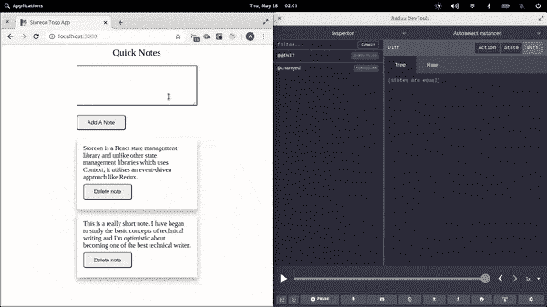

# 使用 Storeon - LogRocket 博客在 React 中进行事件驱动的状态管理

> 原文：<https://blog.logrocket.com/event-driven-state-management-in-react-using-storeon/>

自从引入钩子之后，React 的上下文 API 和钩子库就被一起用于应用程序状态的管理。然而，上下文 API 和钩子的结合——许多基于钩子的状态管理库都是在这个基础上构建的——对于大规模的应用程序来说可能是低效的。

这种组合对开发人员来说也很累，因为在组件中使用它之前，他们必须创建一个自定义钩子来访问状态及其方法。这违背了钩子的真正目的:简单。然而，对于较小的应用程序，Redux 可能有些过头了。

所以今天，我们将讨论一个使用上下文 API 的替代品:Storeon。Storeon 是一个微小的、事件驱动的 React 状态管理库，其原理类似于 Redux。状态动作可以用 Redux DevTools 来查看和可视化。Storeon 在内部使用上下文 API 来管理状态，并采用事件驱动的方法进行状态操作。

## 我们不只是写 Redux，我们也谈论它。现在听着:

或者以后订阅

### 商店

## 存储是存储在应用程序状态中的数据的集合。它是用从 Storeon 库中导入的`createStoreon()`函数创建的。

`createStoreon()`函数接受一个模块列表，其中每个模块都是一个接受`store`参数并绑定其事件侦听器的函数。这里有一个商店的例子:

模块性

```
import { createStoreon } from 'storeon/react'
// todos module
const todos = store => {
  store.on(event, callback)
}

export default const store = createStoreon([todos])
```

### Storeon 中的存储是模块化的——也就是说，它们是独立定义的，没有绑定到挂钩或组件。每种状态及其操作方法都是在称为模块的功能下定义的。这些模块被传递到`createStoreon()`函数中，将它们注册为全局存储。

商店有三种方法:

`store.get()`–该方法用于检索当前状态下的数据。

1.  `store.on(event, callback)`–此方法用于将事件监听器注册到指定的事件名称。
2.  `store.dispatch(event, data)`–该方法用于根据事件定义的要求，发出带有可选数据的事件。
3.  事件

## Storeon 是一个基于事件的状态管理库，因此，对状态的更改由状态模块中定义的事件发出。Storeon 中有三个内置事件，以前缀`@`开头；其他事件的定义不带`@`前缀。三个内置事件是:

`@init`–该事件在应用程序加载时触发。它用于设置应用程序的初始状态，并执行传递给它的回调中的任何内容。

1.  每个新动作都会触发这个事件。这对调试很有用。
2.  `@changed`–当应用程序状态发生变化时，触发此事件。
3.  **注意** : `store.on(event, callback)`用于在我们的模块中添加一个事件监听器。

> 我们将建造什么

## 为了演示如何在 Storeon 中执行应用程序状态操作，我们将构建一个简单的 notes 应用程序。我们还将使用 Storeon 的另一个包来保存我们在`localStorage`中的状态数据。

从这里开始，我假设您对 JavaScript 和 React 有基本的了解。你可以在 [GitHub](https://github.com/Youngestdev/storeon-app) 上找到本文使用的代码。

设置

### 在我们深入研究之前，让我们规划一下项目结构和 notes 应用程序所需的依赖项的安装。我们将从创建项目文件夹开始。

接下来，我们初始化目录并安装所需的依赖项。

```
mkdir storeon-app && cd storeon-app
mkdir {src,public,src/Components}
touch public/{index.html, style.css} && touch src/{index,store,Components/Notes}.js
```

现在是时候在我们的`index.js`文件中写入父组件了。

```
npm init -y
npm i react react-dom react-scripts storeon @storeon/localstorage uuidv4
```

`index.js`

### 这个文件负责呈现我们的 notes 组件。首先，我们将导入所需的包。

接下来，我们将通过编写用于初始化和操作`store.js`中状态的代码来构建我们的应用程序商店。

```
import React from 'react'
import { render } from 'react-dom';

function App() {
  return (
    <>
      Hello!
    </>
  );
}
const root = document.getElementById('root');
render(<App />, root);
```

`store.js`

### 这个文件负责在我们的应用程序中处理状态和后续状态管理操作。我们必须创建一个模块来存储我们的状态及其支持事件，以处理操作变化。

我们将从引入 Storeon 的`createStoreon`方法和独特的随机 ID 生成器 UUID 开始。

`createStoreon`方法负责将我们的状态注册到一个全局存储中。

我们将把我们的状态存储在一个数组变量`notes`中，该变量将包含以下格式的注释:

```
import { createStoreon } from 'storeon';
import { v4 as uuidv4 } from 'uuid'
import { persistState } from '@storeon/localstorage';

let note = store => {}
```

接下来，我们将首先通过用两个注释初始化状态来填充注释模块，这两个注释将在我们第一次启动应用程序时显示。然后我们将定义状态事件。

```
{
  id: 'note id',
  item: 'note item'
},
```

在上面的代码块中，我们定义了状态并用两个简短的注释填充它，并定义了两个事件和回调函数，一旦事件从`dispatch(event, data)`函数发出，它们将被执行。

```
let note = store => {
  store.on('@init', () => ({
    notes: [
      { id: uuidv4(), item: 'Storeon is a React state management library and unlike other state management libraries that use Context, it utilizes an event-driven approach like Redux.' },
      { id: uuidv4(), item: 'This is a really short note. I have begun to study the basic concepts of technical writing and I'\'m optimistic about becoming one of the best technical writers.' },
    ]
  });
  store.on('addNote', ({ notes }, note) => {
    return {
      notes: [...notes, { id: uuidv4(), item: note }],
    }
  });
  store.on('deleteNote', ({ notes }, id) => ({
    notes: notes.filter(note => note.id !== id),
  });
}
```

在`addNote`事件中，我们返回一个添加了新注释的更新后的状态对象，在`deleteNote`事件中，我们过滤出 id 被传递给 dispatch 方法的注释。

最后，我们将模块注册为一个全局存储，将它分配给一个可导出的变量存储，这样我们可以在以后将它导入到我们的上下文提供者中，并将状态存储在`localStorage`中。

接下来，我们将在`Notes.js`中编写我们的 notes 应用程序组件。

```
const store = createStoreon([
  notes,
  // Store state in localStorage
  persistState(['notes']),
]);
export default store;
```

更多来自 LogRocket 的精彩文章:

* * *

### `Notes.js`

* * *

### 这个文件包含了我们的 notes 应用程序的组件。我们将从导入依赖项开始。

接下来，我们将编写组件。

```
import React from 'react';
import { useStoreon } from 'storeon/react';
```

在上面代码块的第二行，`useStoreon()`钩子的返回值被设置为一个可析构的对象。`useStoreon()`钩子将模块名作为它的参数，并返回状态和一个发出事件的分派方法。

```
const Notes = () => {
  const { dispatch, notes } = useStoreon('notes');
  const [ value, setValue ] = React.useState(''); 
}
```

接下来，我们将定义在组件中发出状态定义事件的方法。

让我们回顾一下我们上面定义的三种方法:

```
const Notes = () => {
...
  const deleteNote = id => {
    dispatch('deleteNote', id)
  };
  const submit = () => {
    dispatch('addNote', value);
    setValue('');
  };
  const handleInput = e => {
    setValue(e.target.value);
  };
}
```

`deleteNote(id)`–该方法在被触发时调度`deleteNote`事件。

1.  `submit()`–该方法通过传递输入状态的值来调度`addNote`事件，这是在我们的`Notes`组件中本地定义的。
2.  `handleInput()`–该方法将本地状态的值设置为用户输入。
3.  接下来，我们将构建应用程序的主界面并将其导出。

这就完成了我们的`Notes`组件。接下来，我们将为我们的应用程序和`index.html`文件编写样式表。

```
const Notes = () => {
  ...
  return (
    <section>
      <header>Quick Notes</header>

      <div className='addNote'>
        <textarea onChange={handleInput} value={value} />
        <button onClick={() => submit()}> Add A Note </button>
      </div>

      <ul>
        {notes.map(note => (
          <li key={note.id}>
            <div className='todo'>
              <p>{note.item}</p>
              <button onClick={() => deleteNote(note.id)}>Delete note</button>
            </div>
          </li>
        ))}
      </ul>
    </section>
  );
}
```

`index.html`

### 接下来，我们将填充我们的`style.css`文件。

```
<!DOCTYPE html>
<html lang="en">

<head>
    <meta charset="UTF-8">
    <meta name="viewport" content="width=device-width, initial-scale=1.0">
    <meta http-equiv="X-UA-Compatible" content="ie=edge">
    <link rel="stylesheet" href="style.css">
    <title>Storeon Todo App</title>
</head>

<body>
    <div id="root"></div>
</body>

</html>
```

`style.css`

### 运行我们的应用

```
* {
  box-sizing: border-box;
  margin: 0;
  padding: 0;
}

section {
  display: flex;
  justify-content: center;
  align-items: center;
  flex-direction: column;
  width: 300px;
  margin: auto;
}

header {
  text-align: center;
  font-size: 24px;
  line-height: 40px;
}

ul {
  display: block;
}

.todo {
  display: block;
  margin: 12px 0;
  width: 300px;
  padding: 16px;
  box-shadow: 0 8px 12px 0 rgba(0, 0, 0, 0.3);
  transition: 0.2s;
  word-break: break-word;
}

li {
  list-style-type: none;
  display: block;
}

textarea {
  border: 1px double;
  box-shadow: 1px 1px 1px #999;
  height: 100px;
  margin: 12px 0;
  width: 100%;
  padding: 5px 10px;
}

button {
  margin: 8px 0;
  border-radius: 5px;
  padding: 10px 25px;
}

.box:hover {
  box-shadow: 0 8px 16px 0 rgba(0, 0, 0, 0.2);
}
```

## 既然我们已经成功地编写了组件和样式表，我们还没有更新我们在`index.js`中的父组件来呈现我们的 notes 组件。让我们呈现我们的 notes 组件。

`index.js`

### 要访问我们的全局存储，我们必须导入我们的存储和 Storeon 存储上下文组件。我们还将导入 notes 组件来呈现它。

用以下内容替换组件的内容:

在第 8–10 行，我们调用商店上下文提供者组件，并将 notes 组件作为消费者传递。存储上下文提供程序组件将全局存储作为其上下文值。

```
import React from 'react';
import { render } from 'react-dom';
import { StoreContext } from 'storeon/react';
import Notes from './Components/Notes';
import store from '../src/store';

function App() {
  return (
    <>
      <StoreContext.Provider value={store}>
        <Notes />
      </StoreContext.Provider>
    </>
  );
}

const root = document.getElementById('root');
render(<App />, root);
```

接下来，我们将编辑`package.json`文件中的脚本部分，如下所示:

然后我们运行我们的应用程序:

```
"scripts": {
  "start": "react-scripts start",
}
```

让我们继续添加和删除注释:

```
npm run start
```


史东蜜·德弗林先生

## Storeon 与 Redux 共享相似的属性，因此，可以在 Redux DevTools 中可视化和监控状态变化。为了在我们的 Storeon 应用程序中可视化状态，我们将导入`devtools`包，并将其作为参数添加到我们的`store.js`文件中的`createStoreon()`方法。

下面是一个使用 Redux DevTools 可视化状态变化的演示:

```
...
import { storeonDevtools } from 'storeon/devtools';
...
const store = createStoreon([
  ...,
  process.env.NODE_ENV !== 'production' && storeonDevtools,
]);
```



结论

## 本教程应该让你对 Storeon 是什么以及它是如何工作的有一个基本的了解。主要的好处是你不需要写一个定制的钩子和容器变量就可以在你的组件中使用状态。

Storeon 是一个非常有用的状态管理库，它使用事件驱动的方法和从 Redux 改编的模块化风格来管理状态。同样，您可以在 [GitHub](https://github.com/Youngestdev/storeon-app) 上找到本文中使用的代码。

使用 LogRocket 消除传统反应错误报告的噪音

## 是一款 React analytics 解决方案，可保护您免受数百个误报错误警报的影响，只针对少数真正重要的项目。LogRocket 告诉您 React 应用程序中实际影响用户的最具影响力的 bug 和 UX 问题。

[LogRocket](https://lp.logrocket.com/blg/react-signup-issue-free)

自动聚合客户端错误、反应错误边界、还原状态、缓慢的组件加载时间、JS 异常、前端性能指标和用户交互。然后，LogRocket 使用机器学习来通知您影响大多数用户的最具影响力的问题，并提供您修复它所需的上下文。

[ ](https://lp.logrocket.com/blg/react-signup-general) [  ](https://lp.logrocket.com/blg/react-signup-general) [LogRocket](https://lp.logrocket.com/blg/react-signup-issue-free)

关注重要的 React bug—[今天就试试 LogRocket】。](https://lp.logrocket.com/blg/react-signup-issue-free)

Focus on the React bugs that matter — [try LogRocket today](https://lp.logrocket.com/blg/react-signup-issue-free).