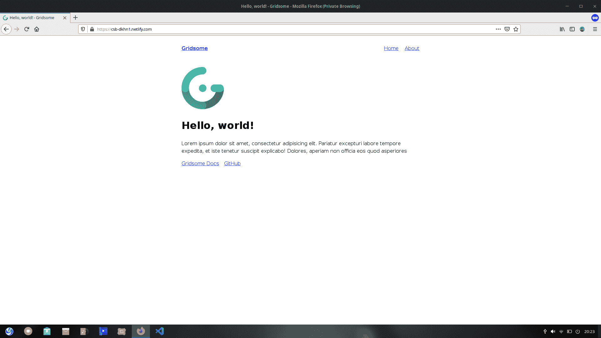
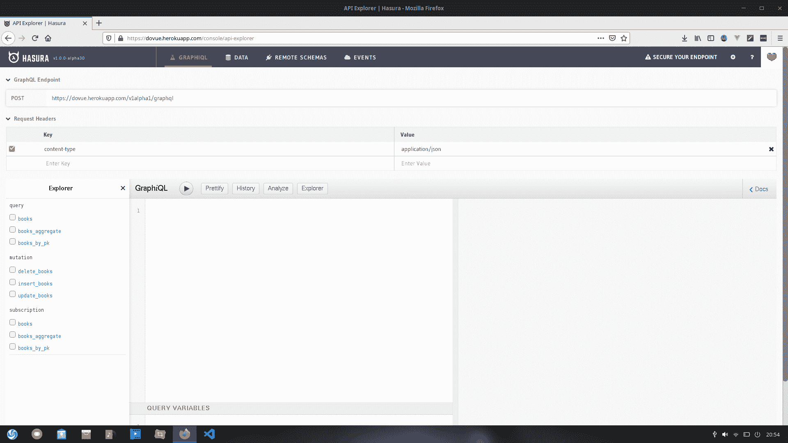
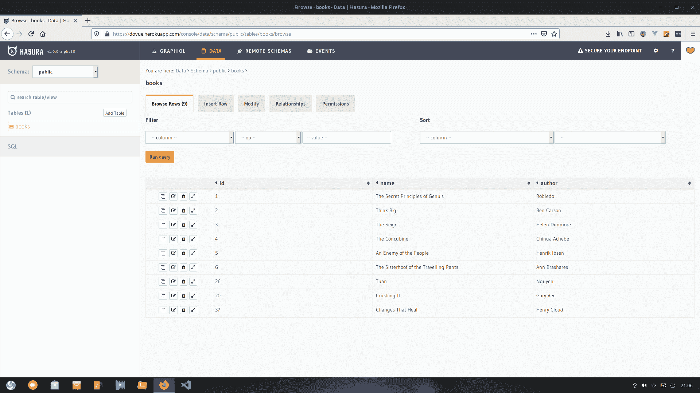
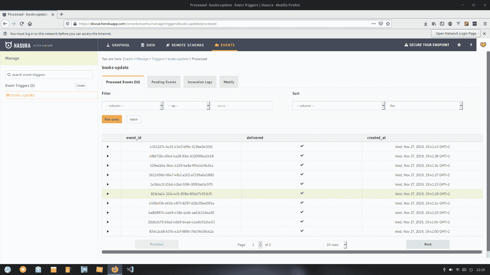
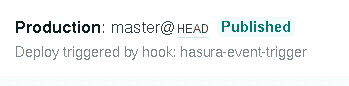

# 事件触发的 GraphQL - LogRocket 博客

> 原文：<https://blog.logrocket.com/event-triggered-graphql/>

### 动态的

我看到了 JAMStack SF 的创始人之一 Tanmai Gopal 关于让静态的 React 站点动态化的精彩演讲。

“我也许可以做一个 Vue 替代品，”我想。

我的[博客](https://blog.malgamves.dev)恰好是用 Gridsome 构建的，grid some 是一个 Vue 驱动的静态站点生成器，用于构建高速静态网站。

我以前玩过 Hasura:它是一个超快的 GraphQL 服务器，通过 Postgres 为你提供即时、实时的 GraphQL APIs。所以我们要用 Gridsome 构建一些东西，部署它，然后用 GraphQL 和 Netlify 使它的一部分(有点)动态化。

我有一个在 GraphQL API 中读过的书籍列表，我想用它作为我们 Gridsome 站点内容的数据源。我们希望这个网站能够在我们向列表中添加或取出新书时进行动态更新。

我会告诉你怎么做。

TL；DR: Hasura 事件触发
[演示](https://codesandbox.io/s/gridsome-remote-graphql-source-dkhn1?fontsize=14&hidenavigation=1&theme=dark)

为了本教程的缘故，我让我的 GraphQL 端点保持开放，但是对于生产环境来说这是不可取的。

看看[这篇关于通过添加授权和管理用户来保护 API 的文章](https://dev.to/hasurahq/hasura-authentication-explained-2c95)。

我们将从使用`npm install --global @gridsome/cli`安装 Gridsome CLI 工具开始。

完成后，我们用`gridsome create <project name>`创建一个新的 Gridsome 项目。

之后，我们`cd <project name>`然后用`gridsome develop`在本地运行它。

你会看到一个非常简单的页面，就像这样。



现在转到[这个页面](https://docs.hasura.io/1.0/graphql/manual/getting-started/heroku-simple.html)，点击部署到 Heroku。您可能需要创建一个新的 Heroku 帐户。

完成排序后，系统会提示您创建一个应用程序名称。键入一个，然后单击部署。

一旦部署完毕，前往`<your-app-name>.herokuapp.com`访问您的 Hasura API Explorer。

它应该是这样的:



在我们的 API 控制台上，我们将前往**数据**部分，并单击**添加表**。

然后，我们创建一个名为 books 的表，并继续创建以下列:

*   `id, Integer (AutoIncrement), Unique`
*   `name, text`
*   `author, text`

将`id`设为主键。然后，单击创建。

现在我们已经有了一个 books 表，我们必须向其中插入数据。

在数据部分，单击 books 表并选择插入数据选项卡。随意添加你喜欢的任何书籍和作者。我的看起来像这样:



我们现在已经完成了 Hasura API 控制台。

接下来，我们希望能够查询远程 GraphQL 源。

首先，我们需要安装 Gridsome 源代码插件。为此，我们将输入`npm install gridsome-source-graphql`。一旦完成，我们需要编辑我们的`gridsome.config.js`。

然后，我们粘贴以下代码:

```
plugins: [
    {
      use: 'gridsome-source-graphql',
      options: {
        url: 'https://example.com/api',
        fieldName: 'puppies',
        typeName: 'puppyTypes',

      },
    },
  ]
```

务必更改`url`、`fieldName`和`typeName`(尽管后者是可选的)。

* * *

### 更多来自 LogRocket 的精彩文章:

* * *

您可以从 Hasura API 控制台获取`url`，即您的应用名称>herokuapp.com/v1alpha1/graphql 的
*T4。*

我将命名为`fieldType`书单，并将`typeName`留空。它们很重要，所以要记住它们。

现在让我们导航到`src > pages > About.vue<`。这是我们想要显示数据的地方。

Gridsome 使用 GraphQL 查询显示在页面上的数据。

关闭`<template>`后，我们粘贴如下页面查询:

```
<page-query>  
query {
  books {
    author
    id
    name
  }
}
</page-query>
```

该查询从 books 表中获取作者、id 和姓名。现在我们需要显示我们正在查询的数据。

为此，在唯一的`<p>`标签下添加以下代码:

```
<h1>Books Read by Me</h1>
<div v-for="book in $page.books" v-bind:key="book.id">
   <li>{{ book.author }} - {{ book.name }}</li>
</div>
```

我们使用`$page.books`来访问查询响应，并用 v-for 指令解析它，将每个值存储在 book 变量中。然后我们用它来显示书的作者和书名。

这也恰好是理解 Gridsome 如何显示数据的一种非常好的方式。当我们在本地运行并点击`about`时，我们可以看到显示的书籍及其作者。

如果您返回到 Hasura API 控制台，在 books 表中插入一行，您会注意到站点上的列表会更新。

这仅在本地发生，因为数据源会不断刷新。

当您部署应用程序时，只显示部署时可用的数据，这意味着当我们在 API 控制台中插入一行时，它不会显示，直到站点重新构建。

为了解决这个问题，我们将利用 Hasura 事件触发器来触发 Netlify 构建，然后更新数据库中的数据。

您需要将代码推送到 GitHub 或 GitLab，并将您的存储库连接到 Netlify。

Gridsome 提供了一个很好的资源，如果你在这方面有任何困难，它可以帮助你。看看这里的。

一旦部署到 Netlify，我们需要创建一个构建钩子。

我把我的叫做 **hasura-event-trigger** 。

当您创建一个时，您会得到一个触发构建的 URL。

复制这个 URL 并返回到您的 Hasura API 控制台。

这一次，我们将前往活动部分。

Hasura 事件触发器捕获指定表上的事件，并调用 webhooks 来执行任何定制逻辑。

事件可以是行上的插入、更新或删除。它们还为您提供了添加手动触发器的灵活性。

每当我们删除或添加一本书时，我们都希望触发重建。点击`create`后，我们将其命名为`author-update`，选择图书表，勾选`insert`，更新为触发操作。

然后我们被要求添加一个 webhook URL。这是我们从 Netlify 复制的构建钩子 URL。

粘贴后，点击`create`。

现在，每当我们插入或删除一行时(无论是在 API 控制台中手动插入还是使用另一个 web 应用程序进行修改)，事件都会被触发，新的构建将会开始。

这更新了侧边内容——有人会说是动态的。

添加或删除几行来触发构建，您的 events 选项卡将如下所示:



Netlify 上的构建也显示了是什么触发了它们。



### 结论

现在我们有了一种利用 Hasura GraphQL 事件触发器的动态静态站点。

在我的 GitHub 上查看[完整回购](https://github.com/malgamves/gridsome-remote-gql-source)，并随时向[推特](https://github.com/malgamves)我任何问题。

## 监控生产中失败和缓慢的 GraphQL 请求

虽然 GraphQL 有一些调试请求和响应的特性，但确保 GraphQL 可靠地为您的生产应用程序提供资源是一件比较困难的事情。如果您对确保对后端或第三方服务的网络请求成功感兴趣，

[try LogRocket](https://lp.logrocket.com/blg/graphql-signup)

.

[](https://lp.logrocket.com/blg/graphql-signup)[https://logrocket.com/signup/](https://lp.logrocket.com/blg/graphql-signup)

LogRocket 就像是网络和移动应用的 DVR，记录下你网站上发生的每一件事。您可以汇总并报告有问题的 GraphQL 请求，以快速了解根本原因，而不是猜测问题发生的原因。此外，您可以跟踪 Apollo 客户机状态并检查 GraphQL 查询的键值对。

LogRocket 检测您的应用程序以记录基线性能计时，如页面加载时间、到达第一个字节的时间、慢速网络请求，还记录 Redux、NgRx 和 Vuex 操作/状态。

[Start monitoring for free](https://lp.logrocket.com/blg/graphql-signup)

.