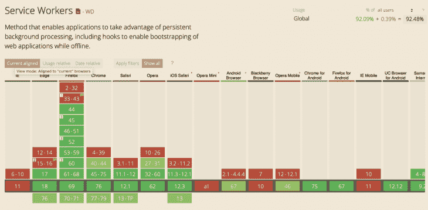
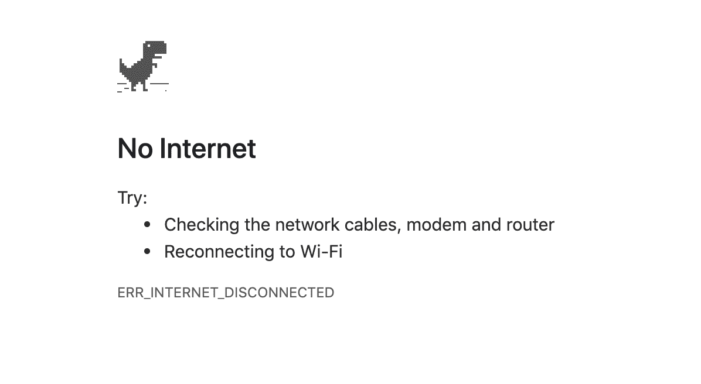

# 每个网站都应该有一个服务人员博客

> 原文：<https://blog.logrocket.com/every-website-deserves-a-service-worker/>

你的网站离线工作吗？

如果不是，那就应该是。同样，每个网站都应该反应灵敏，在桌面和移动设备上都可以工作，网站没有理由不离线工作。

除了 IE 之外，你现在可以让你的网站在任何浏览器中离线工作。最好的一点是，你可以逐步增强你的网站，这样，如果有人碰巧使用非常旧的浏览器访问它，它仍然可以完美地工作。在这种情况下，它在离线状态下是行不通的。



### “离线”的真正含义是什么

那么如何让你的网站离线工作呢？你想让它离线工作吗？例如，如果你的网站是一个聊天框，它甚至可能没有意义。如果你不在线，你怎么和别人聊天？

但是“离线”并不意味着你的用户永远是离线的。

它真正的意思是，越来越多的用户通过移动设备访问你的网站。移动设备往往连接不稳定、时断时续或速度缓慢。

正是在这些情况下，你的网站应该提供足够好的体验，让用户不想离开你的网站。你的网站不应该崩溃，它应该提供一些东西来阻止用户离开。

如果你已经确保你的站点的资产( [CSS](https://blog.logrocket.com/a-guide-to-css-pseudo-elements/) ，图像，JavaScript)可以从本地缓存提供，那么你的资产将立即可用，而不需要通过网络获取。

如果你已经确保你最常访问的网页也在本地缓存，这些也将立即可用。

这就是当一个用户通过一个缓慢的、断断续续的连接访问你的网站时的不同之处，这就是“离线”的真正含义。当你的网站在这种情况下仍然能够提供良好的用户体验时，你就赢了。

访问一些你喜欢的网站，关闭你的 wifi 或 4G，刷新页面，看看会发生什么。

大多数人都会失败，并向您展示这一点:



没必要这样。还有更好的方法。

### 如何让你的网站离线工作

要让你的网站离线工作，你需要做的就是添加一个服务人员。服务工作者是一种[网络工作者](https://developer.mozilla.org/en-US/docs/Web/API/Web_Workers_API)，它在你的网站、浏览器和网络之间充当代理服务器，使你能够拦截请求和响应。

请记住这一点:通过在您的网站上添加一名服务人员，您现在有能力拦截任何传出的请求和传入的响应。仅此一点就足以成为在你的网站上添加一个的理由。

您现在可以拦截请求，并基本上提供您想要的任何服务。您可以直接从本地缓存提供静态资产，甚至从 [IndexedDB](https://developer.mozilla.org/en-US/docs/Web/API/IndexedDB_API) 提供 API 响应和 BLOBs。

要注册服务人员，创建一个名为`service-worker.js`(任何名称都可以)的文件，并将其放在您的应用程序的根目录下。

接下来，调用`navigator.serviceWorker.register`来实际注册服务人员。

用支票把它包起来，确保旧浏览器不会坏:

```
if('serviceWorker' in navigator) {
  const registerServiceWorker = async () =>  
  navigator.serviceWorker.register('./service-worker.js');
  const registration = await registerServiceWorker();
}

```

您的站点现在由一名服务人员控制。然而，由于文件仍然是空的，它实际上不会做任何事情。服务工作者是事件驱动的 Web 工作者，所以我们需要添加代码来响应这些事件，从生命周期事件开始。

### 服务人员生命周期

为了确保服务人员不会破坏网站，他们会经历一个严格定义的生命周期。这可以确保只有一个服务人员控制您的网站(因此只有一个版本的网站存在)。

服务工作者生命周期还确保新的服务工作者不会中断当前正在运行的服务工作者。

### 安装事件

第一个触发的事件是`install`事件。当服务工作器被成功下载、解析和执行时，它被触发。

* * *

### 更多来自 LogRocket 的精彩文章:

* * *

如果在这个阶段出现任何问题，从`navigator.serviceWorker.register`返回的承诺将被拒绝，`install`事件将不会触发，服务工作者将被丢弃。如果已经有一个服务工作程序在运行，它将继续运行。

如果成功安装了服务工作者，将触发`install`事件。在事件处理程序中，您将缓存静态资产。

缓存是使用位于`window.caches`中的[缓存存储](https://developer.mozilla.org/en-US/docs/Web/API/CacheStorage)对象来完成的。

首先，我们打开一个缓存，然后将一个指向我们想要缓存的资产的路径数组传递给`addAll`方法。

`open`方法返回一个承诺，我们将这个承诺传递给 install 事件的`waitUntil`方法，以便在安装完成时向浏览器发出信号，如果安装成功:

```
cacheName = 'my-cache';
    const filestoCache = [
      '/index.html',
      '/css/styles.css',
      '/js/app.js',
      '/img/logo.png'
    ]; 
    self.addEventListener('install', e => {
      e.waitUntil(
        caches.open(cacheName)
        .then(cache => cache.addAll(filesToCache))
      );
    });
```

同样，如果传递给`e.waitUntil`的承诺被拒绝，它将向浏览器发出安装失败的信号，新的服务工作者将被丢弃，留下现有的(如果有的话)服务工作者运行。

### 激活事件

当您成功安装新的服务工作者时，将触发`activate`事件。服务人员现在准备好控制您的网站了——但它还不能控制它。

服务人员只会在您激活页面后刷新页面时控制您的网站。同样，这是为了确保没有任何东西被破坏。

服务人员控制的网站窗口称为其`clients`。在`install`事件的事件处理程序中，可以通过调用`self.clients.claim()`来控制不受控制的`clients`。

服务人员将立即控制网站，尽管这仅在服务人员第一次被激活时有效。当激活新版本的服务人员时，它不起作用:

```
self.addEventListener('activate', e => self.clients.claim());
```

### 拦截请求

服务工作者的杀手锏是拦截请求和响应的能力。

每当服务工作者控制的网站发出请求时，就会触发一个`fetch`事件。`FetchEvent`的`request`属性提供了对请求的访问。

在事件处理程序中，我们可以为之前在`install`事件处理程序中添加到缓存中的静态资产提供服务:

```
self.addEventListener('fetch', e => {
  e.respondWith(
    caches.match(e.request)
    .then(response => response ? response : fetch(e.request))
  )
});
```

通过调用`FetchEvent`的`respondWith`方法，浏览器的默认获取处理被阻止。我们用解析为`Response`的`Promise`来调用它，然后提供服务。

这里，我们调用`caches.match()`来查看资产是否被缓存。如果是，将从缓存中提供。如果不是，我们仍然通过调用`fetch(e.request)`从网络中获取它。

这确保了只要静态资产以前被缓存过，它们将总是从缓存中得到服务。

现在，无论您网站的用户何时处于糟糕的移动连接甚至完全离线状态，缓存的资产仍将提供服务，您可以为您的用户提供良好的用户体验。

如果您的网站只包含静态 HTML 页面，您也可以将它们全部缓存起来，并且无论用户是否在线，您的整个网站都可以被查看——前提是他们至少以前访问过您的网站。

### 拦截响应

但这并没有结束。例如，如果您的网站从 REST API 获取动态内容，您也可以缓存这些内容。

每当向 API 发出请求时，我们可以缓存响应以备后用。如果再次发出相同的请求，但由于某种原因失败了，我们只提供之前缓存的响应。

```
self.addEventListener('fetch', e => {
  const {method, url} = e.request;
  const requestClone = e.request.clone();

  if(url.includes('/api')) {
    e.respondWith(
      fetch(e.request)
      .then(response => {
        const responseClone = response.clone();
        if(method === 'GET') {
          cacheApiResponse(responseClone);
        }

        return response;
      })
      .catch(err => {         
         if(method === 'GET') {
           return getCachedApiResponse(e.request);
         }

         if(method === 'POST') {
           cacheApiRequest(requestClone);
           return new Response(JSON.stringify({
              message: 'POST request was cached'
           }));
         }
       })
   );
 }
 else {
   e.respondWith(
     caches.match(e.request)
     .then(response => response ? response : fetch(e.request))
   );
 }
});
```

当请求的 url 包含`/api`时，我们知道这是对 API 的调用。然后我们通过用`fetch(e.request)`调用`e.respondWith`来传递它，这基本上只是转发相同的请求。

当响应到达时，它需要被克隆，用`cacheApiResponse`方法保存到 IndexedDB(实现省略)，然后被服务。

然而，当获取时发生错误，并且从`fetch(e.request)`返回的承诺被拒绝时，我们捕捉错误并提供一个 API 响应，该响应在之前用`getCachedApiResponse(e.request)`缓存。

通过这种方式，我们可以确保即使用户离线或者 API 由于其他原因无法访问，对动态内容的调用也会成功。

### 自动同步

上面的例子集中在获取数据的 GET 请求上，但是如果您需要 POST 请求来在后端保存数据呢？

正如您所看到的，在下面的例子中的`catch`子句中有一个 POST 请求的检查:

```
.catch(err => {
   ...
   if(method === 'POST') {
     cacheApiRequest(requestClone);
     return new Response(JSON.stringify({
       message: 'POST request was cached'
     }));
   }
 })
```

这意味着，每当对 API 的 POST 请求由于用户离线而失败时，将使用`cacheApiRequest`方法保存请求的一个克隆(省略实现),并返回一个定制响应，指示 POST 请求已保存。

这允许我们保存对本地缓存(如 IndexedDB)所做的所有更改，并在用户重新在线时将这些更改发送到后端。

每当用户的连接恢复时，就会触发一个`sync`事件，我们可以重试之前进行的 API 调用:

```
self.addEventListener('sync', e => {
     e.waitUntil(retryApiCalls());
 });
```

### 预加载响应

到目前为止，我们已经看到了如何为之前缓存的静态资产提供服务，以及如何保存 API 响应以便以后在 API 不可用或用户离线的情况下从缓存中为它们提供服务。

但是获取动态内容的 API 调用必须首先至少执行一次，以便可以缓存它们以供后续调用。

这意味着任何不是首先进行的 API 调用都不会被缓存，因此当用户离线时也不可用。

如果你的网站只包含静态 HTML 页面，你可以在`install`事件中缓存这些页面，方法是将它们提供给`cache.addAll()`调用:

```
const filesToCache = [
  '/index.html',
  '/about.html',
  '/blog/posting.html'
  ...
];
self.addEventListener('install', e => {
  e.waitUntil(
    caches.open(cacheName)
    .then(cache => cache.addAll(filesToCache))
  );
});
```

我们实际上可以对任何或某些从我们的网站发出的 API 调用做同样的事情来预取内容。

例如，如果你的网站是一个博客，你可以预先获取你最近或最受欢迎的帖子，这样即使用户离线，他们也可以立即获得。

用户只需要访问你网站的一个页面。当服务工作者被激活时，我们预取我们想要的内容。合适的位置是服务人员的`activate`事件:

```
self.addEventListener('activate', e => {
  ...
  const postings = [
    '/api/blog/1'
    '/api/blog/3'
    '/api/blog/9'
  ];

  e.waitUntil(async () => {
    await Promise.all(postings.map(url => prefetch(url)));
  }());
});
const prefetch = async url => {
  const response = await fetch(url);
  const clone = response.clone();

  cacheApiResponse(clone);
};
```

在`activate`事件中，我们迭代一个数组，该数组包含像我们最受欢迎的博客帖子的 URL 这样的数据。然后在后台获取每个发布，并使用`cacheApiResponse`方法存储(省略实现)。

现在，我们能够从缓存中提供所有这些帖子，因此它们将立即可用，而无需网络呼叫。

你的网站不仅离线时完全可用，而且几乎可以即时加载，给用户类似应用的体验。

### 缓存策略

缓存资源时可以采用几种策略。

**缓存，回退到网络**
在前面的例子中，静态资产的策略是总是先尝试缓存。如果资产未被缓存，请尝试使用网络。

对于 API 调用和其他 GET 请求也可以这样做。这是构建离线优先体验的最佳方法，但这意味着用户可能会从缓存中收到过时的内容。

幸运的是，我们将在第三个策略中看到一个解决方案。

**网络，回退到缓存**
上面的相反策略是总是先尝试网络。如果失败，从缓存中提供资源。

对于经常更新的资源来说，这是一个很好的策略，因此在线用户将总是获得最新的内容，而离线用户将获得(可能更旧的)缓存版本。

这种方法的缺点是，当一个网络请求需要一段时间时，如果该网络请求最终失败，也需要一段时间回退到缓存。

**高速缓存，然后是网络**
解决“网络，回退到高速缓存”策略问题的一个好办法是总是立即从高速缓存中提供资源，然后在后台发出一个网络请求来获取相同的资源并更新高速缓存。

这种方法的好处是所请求的资源总是立即可用的，并且缓存的版本几乎总是最新的。

当然，从网络上获取的内容有可能是较新的，而用户只是从缓存中获得了较旧的版本。

在这种情况下，您可以更新缓存中已经显示的内容。但是，您需要注意不要破坏用户体验。

例如，用户可能正在阅读文章的缓存版本。如果这篇文章突然更新了新的、不同的内容，您可能会提供糟糕的用户体验。

如果您完全确定您将更新对用户尚不可见的内容，您可以选择这样做。您还可以显示一个横幅，表明有更新的内容，并提示用户刷新页面。

如果资源对时间不是很敏感，您也可以选择只显示缓存的版本，在随后的访问中显示更新的版本。

通常，根据资源的类型，您需要同时使用多种策略。

频繁更新的资源可能最好从网络上提供，而从缓存中提供不频繁更新的资源可能是安全的。

您应该确定什么最适合您的情况，并根据您的需求调整您的服务人员。

**一般错误回退**
在网络和缓存都出现故障，或者缓存版本不可用的情况下，可以提供一般错误响应。例如，页面可能会显示网站暂时离线。

这可以只是驻留在缓存中的静态 HTML 页面:

```
self.addEventListener('fetch', e => {
  e.respondWith(
    caches.match(e.request)
    .then(response => response ? response : fetch(e.request))
    .catch(() => caches.match('./offline.html'))
  )
});
```

### 现在，去实现服务工作者

服务人员让您能够控制网站和互联网之间的所有网络流量。这种能力带来了惊人的力量。

您现在可以即时提供资源，并为您的用户提供类似应用程序的体验。

除了控制网络流量，服务人员还可以让您的网站接收推送通知，即使用户没有与您的网站互动。

服务人员还能让你把网站变成一个[渐进式网络应用](https://blog.logrocket.com/building-a-progressive-web-app-pwa-no-react-no-angular-no-vue-aefdded3b5e/)，让用户把你的网站安装到他们的设备上，像一个原生应用一样与之互动。

但是，控制网络流量和使您的网站离线工作的能力应该足以成为今天为您的网站实现服务工作者的理由。

现在所有主流浏览器都支持服务人员，所以没有理由或借口不支持。你的用户会为此感谢你的。

## 使用 [LogRocket](https://lp.logrocket.com/blg/signup) 消除传统错误报告的干扰

[](https://lp.logrocket.com/blg/signup)

[LogRocket](https://lp.logrocket.com/blg/signup) 是一个数字体验分析解决方案，它可以保护您免受数百个假阳性错误警报的影响，只针对几个真正重要的项目。LogRocket 会告诉您应用程序中实际影响用户的最具影响力的 bug 和 UX 问题。

然后，使用具有深层技术遥测的会话重放来确切地查看用户看到了什么以及是什么导致了问题，就像你在他们身后看一样。

LogRocket 自动聚合客户端错误、JS 异常、前端性能指标和用户交互。然后 LogRocket 使用机器学习来告诉你哪些问题正在影响大多数用户，并提供你需要修复它的上下文。

关注重要的 bug—[今天就试试 LogRocket】。](https://lp.logrocket.com/blg/signup-issue-free)