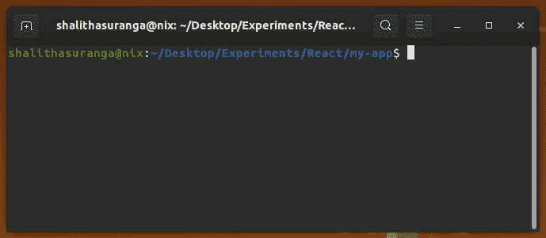

# 关于 react-scripts - LogRocket 博客你需要知道的一切

> 原文：<https://blog.logrocket.com/everything-you-need-know-about-react-scripts/>

***编者按**:本文最后一次更新是在 2022 年 3 月 30 日，以反映关于 react-scripts 的更多更新和高级信息，包括环境变量。*

## 什么是反应脚本？

在过去，创建一个 React 应用程序是一个痛苦的过程。在你动手开发有意义的东西之前，你必须努力完成大量的配置，尤其是 webpack 和 Babel。

幸运的是，今天我们有 [Create React App](https://blog.logrocket.com/getting-started-with-create-react-app-d93147444a27/) ，这是一个方便的模块，具有出色的配置，以及一个名为 react-scripts 的脚本命令，使构建 React 应用程序变得更加容易。

在本指南中，我们将概述 react 脚本，比较几种不同类型的脚本，并描述 Create React App 如何显著简化 React 开发流程。让我们开始吧！

### 内容

## 什么是剧本？

在编程中，脚本是一个指令列表，它指示对另一个程序做什么；React 也不例外。Create React 应用程序附带了四个主要脚本，我们稍后将对每个脚本进行探讨。

但是现在，我们将关注在哪里可以找到这些脚本。

首先，使用以下命令创建一个新的 React 应用程序来查找预定义的脚本:

```
npx create-react-app my-app

```

上面的命令用 [cra 模板](https://github.com/facebook/create-react-app/tree/main/packages/cra-template)和所有需要的配置创建了一个新的 React 应用程序。React 应用程序所需的每个配置都来自 react-scripts 包。现在，检查新创建项目的`package.json`文件。

在 React 应用中，脚本位于`package.json`文件的`script`部分，如下所示:

```
 "scripts": {
    "start": "react-scripts start",
    "build": "react-scripts build",
    "test": "react-scripts test",
    "eject": "react-scripts eject"
  }

```

在前面的 JSON 代码片段中，`package.json`文件有一些默认脚本，但是仍然可以编辑它们。您可以使用首选的节点程序包管理器 CLI 执行这些脚本。

正如你所看到的，一个新的 React 应用程序附带了四个脚本，它们使用了 react-scripts 包。现在我们知道了脚本是什么以及在哪里可以找到它们，让我们深入每一个脚本并解释它对 React 应用程序有什么作用。

## `start`

React 在开发时使用 Node.js 来打开`[http://localhost:3000](http://localhost:3000)`上的应用程序，因此`start`脚本使您能够启动 webpack 开发服务器。

您可以使用`npm`或`yarn`在终端上运行`start`脚本命令:

```
yarn start
npm start

```

该命令不仅会启动开发服务器，而且每当 webpack 的[热模块替换(HMR)](https://webpack.js.org/guides/hot-module-replacement/) 功能[发生变化时，它还会做出反应并显示最新版本。](https://webpack.js.org/guides/hot-module-replacement/)另外，如果无法启动服务器，会以有意义的错误信息的形式在终端上显示 lint 错误。

## `test`

Create React 应用程序使用 [Jest](https://blog.logrocket.com/testing-react-apps-jest-react-testing-library/) 作为测试运行程序。`test`脚本使您能够在交互式观察模式下启动 test runner，让您用键盘控制 Jest。

可以使用以下命令在终端上运行`test`脚本:

```
yarn test
npm test

```

默认的 React 模板为示例应用程序接口提供了一个预定义的测试用例。打开`src/App.test.js`文件，找到下面的示例测试用例:

```
test('renders learn react link', () => {
  render(<App />);
  const linkElement = screen.getByText(/learn react/i);
  expect(linkElement).toBeInTheDocument();
});

```

上述测试案例检查应用程序是否呈现“learn react”(不区分大小写)。输入`npm test`(或`yarn test`)命令，按 **a** 键运行所有测试用例，如下图所示:



我不会深入到[测试 React 应用](https://blog.logrocket.com/testing-react-apps-jest-react-testing-library/)，但是请记住，任何带有`.test.js`或`.spec.js`扩展名的文件都将在脚本启动时执行。

## `build`

React 是模块化的，这就是为什么如果你愿意，你可以创建几个文件或组件。准确地说，这些独立的文件需要合并或捆绑成一个文件。这是`build`脚本的主要好处之一。

另一个是性能；如您所知，开发模式并不适合生产环境。React 使用`build`脚本来确保完成的项目按照部署的最佳实践进行捆绑、缩小和优化。

可以使用以下命令运行该脚本。

```
yarn build
npm run build

```

运行`build`脚本后，您可以在`build`目录中找到所有可部署的优化静态资源。

有一些额外的选项可以传递给`build`脚本。例如，您可以使用`--stats`选项来生成一个 bundle stats 文件，您可以使用 [webpack-bundle-analyzer](https://github.com/webpack-contrib/webpack-bundle-analyzer) 工具来可视化该文件。

查看[文档](https://create-react-app.dev/docs/production-build/)，深入了解如何增强您的`build`脚本。

## `eject`

Create React App 文档将此脚本描述为“单向操作”，并警告“一旦弹出，就无法返回！”Create React App 附带了一个出色的配置，可以帮助您根据最佳实践来构建 React 应用程序，并对其进行优化。

但是，在一些高级场景中，我们可能需要使用额外的配置来定制预构建的 react 脚本。`eject`脚本让您可以完全控制 React 应用程序的配置。例如，您可以通过弹出 React 应用程序，根据特定需求自定义 webpack 或 Babel 配置。

运行`eject`脚本将从您的项目中移除单个构建依赖项。这意味着它将复制配置文件和可传递的依赖项(例如，webpack、Babel 等)。)作为`package.json`文件中的依赖项。如果这样做，您必须确保在构建项目之前安装了依赖项。

运行完`eject`命令后，就不可能再运行它了，因为除了`eject`之外，所有的脚本都是可用的。仅在需要时使用此命令。否则，坚持使用默认配置。反正这样更好。

要在终端上运行命令，请键入以下命令。

```
yarn eject
npm run eject

```

弹出可以帮助您定制 react 配置中的任何内容，但是弹出可能会创建不同版本的 React 脚本。然后，您必须为每个 react 项目维护定制的 React 脚本。因此，创建一个 react-scripts 分支是一个更好的想法，可以进行可重用的定制 react 应用程序配置。

您可以通过以下命令使用分叉的 react-scripts 模块:

```
npx create-react-app my-app --scripts-version react-scripts-fork

```

上面的命令通过使用 react-scripts-fork 包作为 react-scripts 源来构建一个新的 React 应用程序。

## 为 react 脚本使用环境变量

预配置的 React 脚本通常不接受许多 CLI 选项来定制它们的默认行为。但是，react-scripts 允许开发人员通过环境变量进行各种高级配置，您可以通过终端设置这些环境变量。

* * *

### 更多来自 LogRocket 的精彩文章:

* * *

例如，您可以使用`PORT`环境变量更改开发服务器端口，如下所示:

```
PORT=5000 yarn start
PORT=5000 npm start

```

此外，您可以通过如下设置`BUILD_PATH`来更改默认的应用程序构建目录:

```
BUILD_PATH=./dist yarn build
BUILD_PATH=./dist npm run build

```

如果您愿意，也可以用环境变量更新现有的脚本定义。例如，如果您在`package.json`中使用下面的 JSON 片段，那么您总是可以在`start`脚本中使用端口`5000`:

```
"scripts": {
  "start": "PORT=5000 react-scripts start", // port 5000 
  "build": "react-scripts build",
  "test": "react-scripts test",
  "eject": "react-scripts eject"
}

```

所有支持的环境变量都可以在[官方文档](https://create-react-app.dev/docs/advanced-configuration)中找到。

## 结论

我希望这篇指南能对 Create React 应用程序的惊人配置有所启发。它不仅附带了有用的脚本，可以帮助任何开发人员的生活变得更加轻松，而且一些命令附带了灵活的选项，使您能够根据项目的独特需求来调整脚本。

尽管 Create React App 提供了四个预配置的脚本，但是您可以像任何其他 JavaScript 项目一样，通过更新您的`package.json`文件来添加更多脚本。react 团队基于社区反馈开发了带有通用配置的 react 脚本，因此许多 React 开发团队使用 React 脚本时无需额外的定制。因此，如果你觉得你的需求可以解决每个人的问题，考虑在[官方知识库](https://www.github.com/facebook/create-react-app)中为特性请求打开一个问题或讨论线程。

否则，您可以通过为高级和独特的用例弹出或分叉来定制 react 脚本。

## 使用 LogRocket 消除传统反应错误报告的噪音

[LogRocket](https://lp.logrocket.com/blg/react-signup-issue-free)

是一款 React analytics 解决方案，可保护您免受数百个误报错误警报的影响，只针对少数真正重要的项目。LogRocket 告诉您 React 应用程序中实际影响用户的最具影响力的 bug 和 UX 问题。

[ ](https://lp.logrocket.com/blg/react-signup-general) [  ](https://lp.logrocket.com/blg/react-signup-general) [LogRocket](https://lp.logrocket.com/blg/react-signup-issue-free)

自动聚合客户端错误、反应错误边界、还原状态、缓慢的组件加载时间、JS 异常、前端性能指标和用户交互。然后，LogRocket 使用机器学习来通知您影响大多数用户的最具影响力的问题，并提供您修复它所需的上下文。

关注重要的 React bug—[今天就试试 LogRocket】。](https://lp.logrocket.com/blg/react-signup-issue-free)