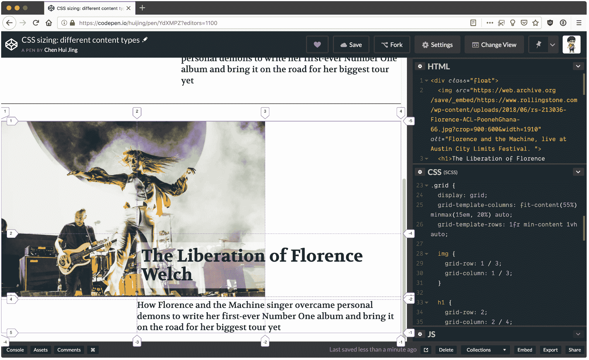
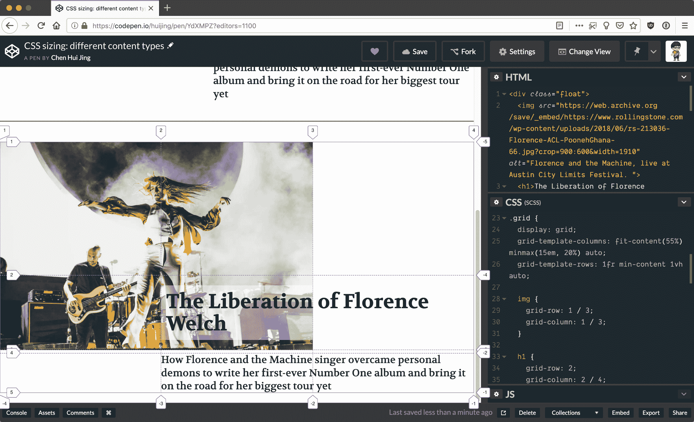

# 审视内在网页设计中的“挤压性”

> 原文：<https://blog.logrocket.com/examining-squishiness-in-intrinsic-web-design-1005d30dda0c/>

2018 年网页设计界的一大亮点是 [Jen Simmons](http://jensimmons.com/) 提出了[固有网页设计](http://www.zeldman.com/2018/05/02/transcript-intrinsic-web-design-with-jen-simmons-the-big-web-show/)这一术语，并与全世界分享。内在网页设计不是一个框架。这也不是一套要遵守的规则。相反，它是一个概念的集合，强调了现代 CSS 的可能性。我们如何选择利用这些概念在网络上获得更好的艺术指导，并构建更好的布局，这取决于我们。

Jen 在谈到内在网页设计时涵盖了以下六个主要概念:

*   结合流动和固定
*   压扁的阶段
*   真正的二维布局
*   嵌套上下文
*   扩展和收缩内容
*   媒体询问，根据需要

您会注意到，这些概念都没有指出具体的 CSS 属性或模块。这是因为当各种互补的属性一起使用时，CSS 工作得最好。在这篇文章中，我想谈谈阶段挤压的概念，以及它将如何极大地提高网站上编辑内容的艺术导向。

### 使用 CSS 调整项目大小

让我们从一些基础开始。浏览器执行大量的计算，以确保每个元素都能正确地呈现在网页上。每个元素都必须解析和计算每个可能的 CSS 属性值，然后才能在页面上布局。

根据视觉格式化模型，文档树中的每个元素生成零个或多个框。影响这些盒子尺寸的因素有很多。

详细涵盖这一点的 CSS 规范是 [CSS 内在&外在调整模块级别 3](https://www.w3.org/TR/css-sizing-3/) 。*外在大小*基于元素的上下文，不考虑其内容，而*内在大小*基于元素的内容，不考虑其上下文。

我们大多数人都熟悉外在大小，因为这通常是我们用来确定网页中项目大小的。我见过的几乎每个 web 开发人员都是这样开始的:用固定的 CSS 单位(如`px`)或相对的 CSS 单位(如百分比)来设置`width`和`height`。

然后我们会学习`rem`和`em`单位，并被它们吸引。我们中的一些人也开始使用视口单位，这是另一种相对单位。以这种方式调整大小会完全忽略元素中的内容，如下面的[代码打开](https://codepen.io/huijing/pen/wRwYee/)所示:

参见 [CodePen](https://codepen.io) 上静([@惠晶](https://codepen.io/huijing) )
的笔[【CSS 尺寸:外在相对单位](https://codepen.io/huijing/pen/wRwYee/)。

这并不是说内在规模是一个新事物，我认为内在规模的使用只是意味着不去管它。浏览器会根据元素中的内容量为我们调整大小。

确定元素的宽度和高度有一个很长的规则集，这取决于它的类型(块或内嵌，替换与否，定位方案等)。)，如果感兴趣的话可以从 [CSS2.1 规范](https://www.w3.org/TR/CSS2/visudet.html)中找到。并且 [CSS 内在&外在尺寸模块级别 3](https://www.w3.org/TR/css-sizing-3/) 进一步扩展了该规范。

关于`width`和`height`属性，我想提醒大家的一点是，这两个大小属性**而不是**适用于行内元素。内联元素的宽度由其呈现内容的宽度决定，而内联元素的高度由字体大小决定。

第三级规范向`width`和`height`属性添加了新的基于内容的关键字，即:`min-content`、`max-content`和`fit-content()`，这允许非行内元素具有更多基于内容的大小调整选项。

在网格格式上下文中使用时，所有这些值都受支持。但是，如果您现在想要在调整属性中使用它们，您的里程数可能会有所不同。

见 [CodePen](https://codepen.io) 上静([@惠晶](https://codepen.io/huijing) )
的笔[【CSS 调整:基于内容的调整](https://codepen.io/huijing/pen/VqLqMz/)。

### 元素的相对大小

web 上响应式设计的一个常见设计模式是调整内容列以适应视窗。开发人员会用大量的媒体查询来编写这样的布局，因为每一列的宽度都必须在特定的断点指定。这种方法可以用 floats 或 inline-block 来实现，但是使用大量媒体查询的机制是相同的。

参见 [CodePen](https://codepen.io) 上的 [笔 CSS 上浆:百分比栏](https://codepen.io/huijing/pen/BvNMZB/)作者静([@惠晶](https://codepen.io/huijing) )
。

当您调整窗口大小并观察列的增长和收缩时，请注意所有列都以相同的速率增长和收缩*。这是意料之中的，因为每列的大小都是视区宽度的百分比。*

这种行为的一个后果是，构建以最佳大小呈现不同类型内容的布局变得更加困难。与文本内容相比，具有内在纵横比的内容(如图像)需要更多的考虑，因为文本内容更容易流动和适应。

### 变化率可变的规模

让我们来看看列的大小以*不同的速率*增长和收缩的情况。当我们在 flex 格式化上下文中操作时，当应用某些轨道大小时，或者当使用基于内容的大小调整时，可能会出现这种情况。

对于这个 Flexbox 例子，我强烈推荐阅读 Rachel Andrew 的[逐步解释](https://www.smashingmagazine.com/2018/09/flexbox-sizing-flexible-box/)关于规模算法如何工作。在这里你可以看到当最后一列有更多的内容时，Flexbox 会给它更多的空间，并将第二列收缩得“更早”。

见 [CodePen](https://codepen.io) 上静([@惠晶](https://codepen.io/huijing) )
的笔[【CSS 上浆:用 Flexbox](https://codepen.io/huijing/pen/xmZJMB/) 的变化率。

Grid 引入了`fr`单元，它被定义为网格容器中剩余空间的分数。它的行为类似于 flex 项目填充 flex 容器空间的方式。

一旦所有非弹性轨道达到其最大尺寸，从可用空间中减去这些行或列的总尺寸，产生剩余空间，然后在弹性大小的行和列中按照其弹性因子的比例划分剩余空间。

对于这个基于栅格的示例，使用各种值来调整列的大小，当视口大小改变时，这会影响它们的结果行为。对于第一个例子，第一列的大小为`1fr`，这意味着它占用了内容所需的空间加上任何可用的空闲空间。因此，如果视口变宽，它将继续增长。

但是，当视口缩小时，其行为由其他列的大小决定。另外两列是`auto`和`fit-content(400px)`，随着空间的减少，它们的行为类似，因为`fit-content`解析为`minmax(auto, max-content)`，除了它被固定在提供的参数值。

[https://codepen.io/huijing/pen/VqeGba/](https://codepen.io/huijing/pen/VqeGba/)

对于第二个示例，最后一列的大小是用`minmax(200px, 400px)`确定的。请注意，该列尽可能长时间地保持其最大大小，而其他列则收缩。`fr`列首先收缩，然后是`auto`列。但是`auto`列和`minmax()`列同时达到它们的最小尺寸。

### 反应更灵敏的艺术指导

现在让我们将它应用到实际设计中。这个例子可以是一个编辑出版物上的特色文章，有一个大的英雄形象，标题和一些开放的文本。我再次强烈推荐在一个单独的窗口中打开这个演示，这样就可以观察整个视窗的行为。

第一个例子是用百分比大小来完成的，这里的限制是双重的。页眉在图像上的重叠有点笨拙，因为它是用负边距完成的。其次，图像和文本都以相同的速度缩小，所以在最窄的尺寸下，图像有点太小，文本也有点太挤。

看笔 [CSS 上浆:不同内容类型](https://codepen.io/huijing/pen/YdXMPZ/)由靖([@惠晶](https://codepen.io/huijing) )
上 [CodePen](https://codepen.io) 。

使用 Grid，管理重叠要容易得多，因为在网格中放置项目就是将它们分配到所需的行和列，并且不限制多个项目占用网格上的相同空间。

* * *

### 更多来自 LogRocket 的精彩文章:

* * *

如果你已经安装了 Firefox，打开 DevTools 并打开网格检查器，它会向你显示轨迹是如何随着视口大小的变化而调整的。此外，使用`minmax()`调整轨道大小允许中间列中的内容尽可能长时间地“保持”其大小，而调整为`auto`的轨道首先收缩。

Firefox has the best Grid inspector tool

### 结论

这种行为为网页设计者和开发者在艺术指导方面提供了更好的选择和更大的灵活性，并确保了无论在什么样的背景下，内容的焦点都不会丢失。

我强烈鼓励开发人员自己尝试这些新的属性和技术，因为正是通过实验，我才弄清楚了很多这种东西。随着越来越多的开发人员和设计人员使用这些新工具，我们将有更多的想法和灵感来构建真正适合 web 本质的设计。

## 你的前端是否占用了用户的 CPU？

随着 web 前端变得越来越复杂，资源贪婪的特性对浏览器的要求越来越高。如果您对监控和跟踪生产环境中所有用户的客户端 CPU 使用、内存使用等感兴趣，

[try LogRocket](https://lp.logrocket.com/blg/css-signup)

.

[https://logrocket.com/signup/](https://lp.logrocket.com/blg/css-signup)

LogRocket 就像是网络和移动应用的 DVR，记录你的网络应用或网站上发生的一切。您可以汇总和报告关键的前端性能指标，重放用户会话和应用程序状态，记录网络请求，并自动显示所有错误，而不是猜测问题发生的原因。

现代化您调试 web 和移动应用的方式— [开始免费监控](https://lp.logrocket.com/blg/css-signup)。