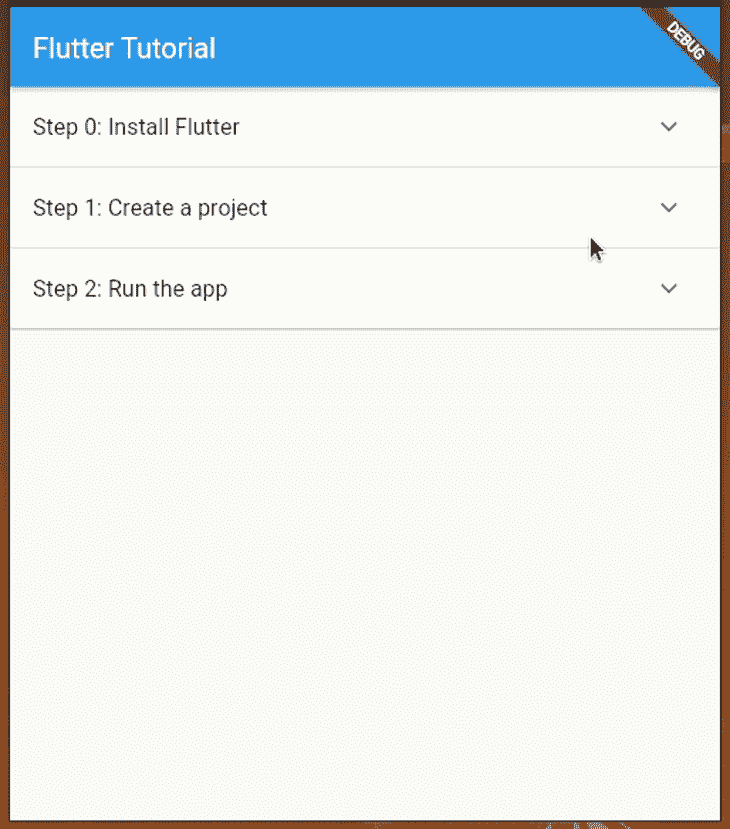
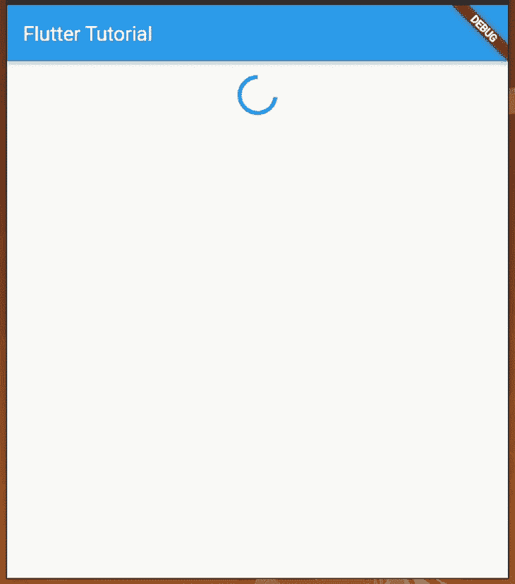
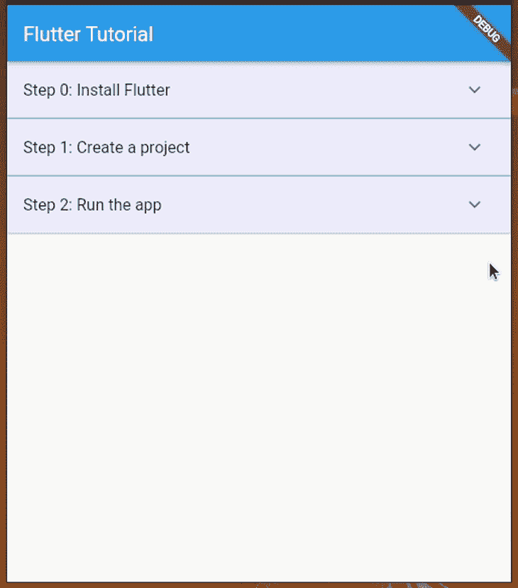
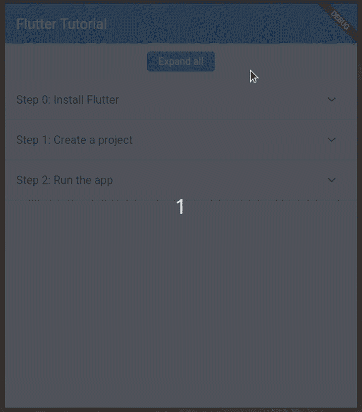
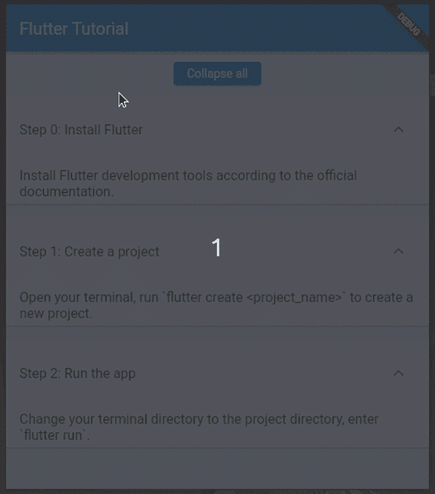
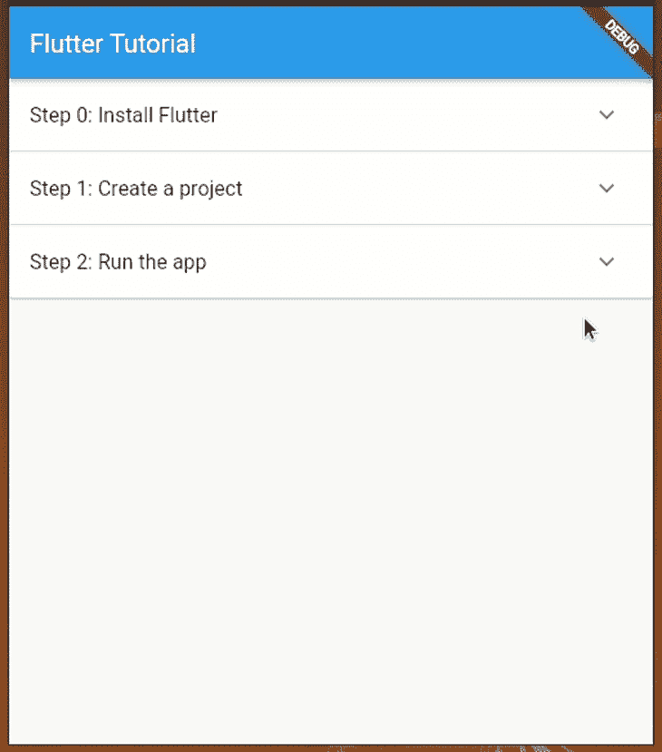
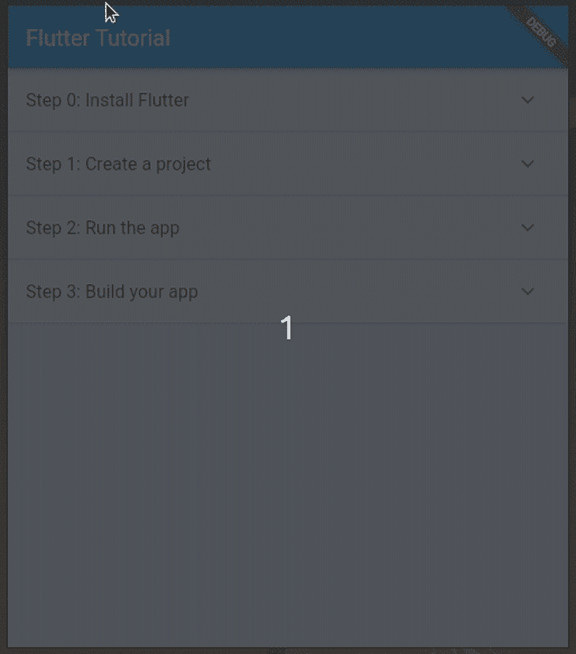

# 颤振中的扩张板:实例指南

> 原文：<https://blog.logrocket.com/expansionpanel-flutter-guide-with-examples/>

每个移动操作系统都提供了一个内置的 UI 工具包，其中包含各种小部件，这些小部件通常不太容易定制。Flutter 带有一个灵活的小部件系统，它实现了材料设计规范，并激励移动应用程序开发人员创建未来主义的最小化 ui。

与特定于平台的 UI 小部件不同，Flutter 为每个通用需求提供了许多可定制的小部件选择，因此根据您独特的设计草图构建您的 Flutter 应用程序很容易。其中之一是`ExpansionPanel`小部件，它帮助我们创建可展开/可折叠的列表。

我们可以在一个`ExpansionPanelList`小部件中添加几个`ExpansionPanel`小部件，在我们的 Flutter 应用程序中创建可扩展/可折叠的列表。这些小部件有一个展开/折叠图标按钮，供用户显示/隐藏附加内容。Flutter 开发人员通常使用一个单独的细节屏幕来显示特定列表项的大内容片段(即显示产品细节)。

`ExpansionPanel`小部件帮助开发人员显示每个列表项的中小型内容片段，而不需要屏幕导航。在 UI/UX 规范中，这个 UI 元素可以被称为可折叠的、可扩展的或可折叠的。

在本教程中，我将通过实际例子解释如何使用和定制`ExpansionPanel`小部件。此外，我们将把它与提供类似功能的`ExpansionTile`小部件进行比较。

向前跳:

## 飘起`ExpansionPanel`教程

让我们创建一个新的 Flutter 项目来使用`ExpansionPanel`小部件。您也可以在现有的 Flutter 项目中使用这个示例代码。

如果你是 Flutter 新手，根据官方 Flutter [安装指南](https://docs.flutter.dev/get-started/install)安装 Flutter 开发工具。您可以在 Google Chrome 上运行即将到来的示例，这是一个物理移动设备，或者是一个仿真器/模拟器。在本教程中，我将使用 Chrome 预览示例应用程序。

首先，使用以下命令创建一个新的 Flutter 应用程序:

```
flutter create expansionpanel_example
cd expansionpanel_example

```

输入`flutter run`命令，确保一切正常。

### 使用`ExpansionPanel`和`ExpansionPanelList`

让我们创建一个简单的指南页面，用几个`ExpansionPanel`部件和一个`ExpansionPanelList`部件创建一个 Flutter 应用程序。用户可以点击特定的步骤来展开它并查看更多细节。

在大多数情况下，我们通常通过具有异步功能的后端 web 服务将数据加载到应用前端，但是对于我们的教程，我们将从同步功能呈现硬编码的数据，以便快速开始使用`ExpansionPanel`。

将以下代码添加到您的`main.dart`文件中:

```
import 'package:flutter/material.dart';

void main() => runApp(const MyApp());

class MyApp extends StatelessWidget {
  const MyApp({Key? key}) : super(key: key);
  static const String _title = 'Flutter Tutorial';
  @override
  Widget build(BuildContext context) {
    return MaterialApp(
      title: _title,
      home: Scaffold(
        appBar: AppBar(title: const Text(_title)),
        body: const Steps(),
      ),
    );
  }
}

class Step {
  Step(
    this.title,
    this.body,
    [this.isExpanded = false]
  );
  String title;
  String body;
  bool isExpanded;
}

List<Step> getSteps() {
  return [
    Step('Step 0: Install Flutter', 'Install Flutter development tools according to the official documentation.'),
    Step('Step 1: Create a project', 'Open your terminal, run `flutter create <project_name>` to create a new project.'),
    Step('Step 2: Run the app', 'Change your terminal directory to the project directory, enter `flutter run`.'),
  ];
}

class Steps extends StatefulWidget {
  const Steps({Key? key}) : super(key: key);
  @override
  State<Steps> createState() => _StepsState();
}

class _StepsState extends State<Steps> {
  final List<Step> _steps = getSteps();
  @override
  Widget build(BuildContext context) {
    return SingleChildScrollView(
      child: Container(
        child: _renderSteps(),
      ),
    );
  }
  Widget _renderSteps() {
    return ExpansionPanelList(
      expansionCallback: (int index, bool isExpanded) {
        setState(() {
          _steps[index].isExpanded = !isExpanded;
        });
      },
      children: _steps.map<ExpansionPanel>((Step step) {
        return ExpansionPanel(
          headerBuilder: (BuildContext context, bool isExpanded) {
            return ListTile(
              title: Text(step.title),
            );
          },
          body: ListTile(
            title: Text(step.body),
          ),
          isExpanded: step.isExpanded,
        );
      }).toList(),
    );
  }
}

```

请注意上面示例代码的以下事实:

*   `Steps`小部件负责在屏幕上呈现整个可扩展列表
*   `getSteps`同步函数将所有硬编码的步骤作为`Item`类的实例返回，而`_steps`小部件状态变量将所有项目保存为一个 Dart `List`
*   我们使用来自`ExpansionPanelList`类的两个参数:
    *   `children`通过转换`_steps`列表来设置所有的`ExpansionPanel`实例
    *   `expansionCallback`基于最近用户与展开/折叠按钮的交互来更新`_steps`列表
*   我们使用了`ListTile`类，而不是简单地使用`Text`来显示一个样式良好的材料列表

运行上面的代码。您将看到创建颤振项目的步骤，如以下预览所示:



通过添加更多步骤来测试应用程序，或者尝试使用[列表生成一些动态数据。生成](https://api.flutter.dev/flutter/dart-core/List/List.generate.html)工厂构造函数。

如果需要从 web 后端加载数据，可以像往常一样用`FutureBuilder`包装`ExpansionPanelList`小部件:

```
import 'package:flutter/material.dart';

void main() => runApp(const MyApp());

class MyApp extends StatelessWidget {
  const MyApp({Key? key}) : super(key: key);
  static const String _title = 'Flutter Tutorial';
  @override
  Widget build(BuildContext context) {
    return MaterialApp(
      title: _title,
      home: Scaffold(
        appBar: AppBar(title: const Text(_title)),
        body: const Steps(),
      ),
    );
  }
}

class Step {
  Step(
    this.title,
    this.body,
    [this.isExpanded = false]
  );
  String title;
  String body;
  bool isExpanded;
}

Future<List<Step>> getSteps() async {
  var _items = [
    Step('Step 0: Install Flutter', 'Install Flutter development tools according to the official documentation.'),
    Step('Step 1: Create a project', 'Open your terminal, run `flutter create <project_name>` to create a new project.'),
    Step('Step 2: Run the app', 'Change your terminal directory to the project directory, enter `flutter run`.'),
  ];
  return Future<List<Step>>.delayed(const Duration(seconds: 2), () => _items);
}

class Steps extends StatelessWidget {
  const Steps({Key? key}) : super(key: key);
  @override
  Widget build(BuildContext context) {
    return SingleChildScrollView(
      child: Container(
        child: FutureBuilder<List<Step>>(
          future: getSteps(),
          builder: (BuildContext context, AsyncSnapshot<List<Step>> snapshot) {
            if(snapshot.hasData) {
              return StepList(steps: snapshot.data ?? []);
            }
            else {
              return Center(
                child: Padding(
                  padding: EdgeInsets.all(16),
                  child: CircularProgressIndicator(),
                ),
              );
            }
          }
        ),
      ),
    );
  }
}

class StepList extends StatefulWidget {
  final List<Step> steps;
  const StepList({Key? key, required this.steps}) : super(key: key);
  @override
  State<StepList> createState() => _StepListState(steps: steps);
}

class _StepListState extends State<StepList> {
  final List<Step> _steps;
  _StepListState({required List<Step> steps}) : _steps = steps;
  @override
  Widget build(BuildContext context) {
    return ExpansionPanelList(
      expansionCallback: (int index, bool isExpanded) {
        setState(() {
          _steps[index].isExpanded = !isExpanded;
        });
      },
      children: _steps.map<ExpansionPanel>((Step step) {
        return ExpansionPanel(
          headerBuilder: (BuildContext context, bool isExpanded) {
            return ListTile(
              title: Text(step.title),
            );
          },
          body: ListTile(
            title: Text(step.body),
          ),
          isExpanded: step.isExpanded,
        );
      }).toList(),
    );
  }
}

```

我们对之前的源代码做了三处更新，如下所述:

1.  通过人为延迟使`getSteps`函数异步，所以现在您甚至可以通过您最喜欢的网络客户端库(即 [Dio](https://github.com/flutterchina/dio) )从 web 服务获取可扩展列表的数据
2.  通过创建第二个名为`StepList`的小部件，用一个`FutureBuilder`包装可扩展列表，该小部件使用条件渲染在模拟网络延迟期间显示循环加载动画
3.  使`Steps`小部件成为无状态的，因为我们在那里没有保存任何数据

运行上面的代码—您将在两秒钟的延迟后看到可扩展列表:



使用这两种方法中的任何一种，您都可以为任何需要使用`ExpansionPanel`小部件的情况提供解决方案。

现在，让我们研究一下`ExpansionPanel`提供的功能！在接下来的例子中，我们将更新同步版本，因为与异步版本相比，它的实现是最小的。再次将第一个示例源代码复制到您的`main.dart`文件中，并准备好继续本教程。

当您将`ExpansionPanel`与`ListTile`一起使用时，您将得到一个用户友好的可扩展列表，就像我们在前面的例子中看到的那样。可以根据个人喜好或者 app 主题进行定制。例如，您可以更改元素的背景颜色，如下所示:

```
return ExpansionPanel(
  //.....
  //...
  backgroundColor: const Color(0xffeeeeff),
);

```

您可以更改可扩展列表的分隔线颜色，如以下代码片段所示:

```
return ExpansionPanelList(
  dividerColor: Colors.teal,
  //....
  //...

```

也可以为标题设置自定义填充。请看下面的例子:

```
return ExpansionPanelList(
  expandedHeaderPadding: EdgeInsets.all(6),
  //....
  //...

```

下面的`_renderSteps`方法实现使用上述参数来应用几个 UI 定制。

```
Widget _renderSteps() {
    return ExpansionPanelList(
      dividerColor: Colors.teal,
      expandedHeaderPadding: EdgeInsets.all(0),
      expansionCallback: (int index, bool isExpanded) {
        setState(() {
          _steps[index].isExpanded = !isExpanded;
        });
      },
      children: _steps.map<ExpansionPanel>((Step step) {
        return ExpansionPanel(
          backgroundColor: const Color(0xffeeeeff),
          headerBuilder: (BuildContext context, bool isExpanded) {
            return ListTile(
              title: Text(step.title),
            );
          },
          body: ListTile(
            title: Text(step.body),
          ),
          isExpanded: step.isExpanded,
        );
      }).toList(),
    );
  }

```

现在，您将看到一个自定义的可扩展列表 UI，如下面的预览所示:



### 调整`ExpansionPanel`的动画和触摸反馈

Flutter widget 系统可以让你改变`ExpansionPanel`的动画速度。例如，您可以通过延长动画持续时间来减缓其动画，如下所示:

```
return ExpansionPanelList(
  animationDuration: const Duration(milliseconds: 1500),
  //....
  //...

```

只有当用户点击右侧图标按钮时，`ExpansionPanel`小部件才会打开/关闭内容部分，但是如果您使用以下设置，用户可以通过点击整个标题部分来执行相同的操作:

```
return ExpansionPanel(
  canTapOnHeader: true,
  //...
  //..

```

如果您的应用程序用户通常使用小屏幕设备，这种配置是一种很好的用户体验改进——他们不需要直接点击小的展开/折叠图标按钮来激活展开/折叠操作。

在前面的例子中，我们在`Step`类中使用了`isExpanded`类变量，但是我们没有从`getSteps`函数中为它显式地设置一个值。最初我们得到的只是膨胀板坍塌了。

我们可以为`ExpansionPanel`类的`isExpanded`参数设置一个初始值来设置一个自动扩展的项目。使用下面的同步`getSteps`功能实现:

```
List<Step> getSteps() {
  return [
    Step('Step 0: Install Flutter',
        'Install Flutter development tools according to the official documentation.',
        true),
    Step('Step 1: Create a project', 'Open your terminal, run `flutter create <project_name>` to create a new project.'),
    Step('Step 2: Run the app', 'Change your terminal directory to the project directory, enter `flutter run`.'),
  ];
}

```

这里，我们为第一个列表元素中的`isExpanded`设置`true`。在`_renderSteps`方法中找到下面的代码行:

```
isExpanded: step.isExpanded,

```

上面的行将`isExpanded`从`Step`实例传递到`ExpansionPanel`，所以现在我们可以看到第一个面板开始自动展开:


同样，您甚至可以从 web 后端控制最初打开的面板！

### 一次展开和折叠所有项目

你有没有注意到，在一些应用程序中，我们可以一键展开/折叠所有可展开的部分？如果用户需要阅读所有隐藏的内容，而不需要点击每个扩展面板，此功能会很有帮助。使用下面的`build`方法实现`_StepsState`:

```
@override
  Widget build(BuildContext context) {
    return SingleChildScrollView(
      child: Column(
        children: <Widget>[
          Padding(
            padding: EdgeInsets.all(12),
            child: ElevatedButton(
              child: const Text('Expand all'),
              onPressed: () {
                setState(() {
                  for(int i = 0; i < _steps.length; i++) {
                    _steps[i].isExpanded = true;
                  }
                });
              },
            ),
          ),
          _renderSteps()
        ],
      ),
    );
  }

```

这里，我们创建了一个按钮来一次展开所有面板。对于所有列表项实例，`setState`方法调用将`isExpanded`设置为`true`,因此一旦点击按钮，所有步骤都会展开如下:



类似地，您可以通过将`isExpanded`参数设置为`false`来实现折叠所有面板的按钮:

```
_steps[i].isExpanded = false;

```



### 用`ExpansionPanelRadio`创建无线电扩展面板

默认的`ExpansionPanelList`小部件的行为就像一组复选框，所以当我们点击一个面板时，这个特定的面板就会展开，我们必须再次点击它才能折叠它。

但是如果我们需要构建一个行为类似于一组单选按钮的可扩展列表呢？我们只能保持一个面板展开，就像复选框组一样。

作为一种解决方案，您可能会考虑编写一些自定义逻辑来更新我们实现扩展/折叠所有功能的方式的`_steps`列表，但是 Flutter widget 系统实际上为这一需求提供了内置的`ExpansionPanelRadio`。

使用以下代码实现`_renderSteps`功能:

```
Widget _renderSteps() {
    return ExpansionPanelList.radio(
      children: _steps.map<ExpansionPanelRadio>((Step step) {
        return ExpansionPanelRadio(
          headerBuilder: (BuildContext context, bool isExpanded) {
            return ListTile(
              title: Text(step.title),
            );
          },
          body: ListTile(
            title: Text(step.body),
          ),
          value: step.title
        );
      }).toList(),
    );
  }

```

这里，我们使用了带有`ExpansionPanelList.radio`构造函数的`ExpansionPanelRadio`小部件。`ExpansionPanelRadio`小部件不像`ExpansionPanel`那样接受`isExpanded`参数；相反，它接受带有`value`参数的唯一值。此外，我们不需要从`expansionCallback`调用`setState`，因为 Flutter 框架提供了一个内置的实现，一旦用户打开另一个面板，它就会自动折叠打开的面板。

一旦您使用了上面的代码片段，您将会看到以下结果:



如果您最初需要打开一个特定的面板，您可以使用通过`value`参数添加的唯一标识符来完成，如下所示:

```
return ExpansionPanelList.radio(
  initialOpenPanelValue: 'Step 0: Install Flutter',
  //....
  //...

```

请注意，出于演示目的，我们在这里使用项目标题字符串作为唯一的`value`。对于生产应用程序，确保使用更好的唯一值，如产品标识符。

## 构建嵌套扩展面板

在大多数应用中，使用一个级别的扩展面板就足够了，例如我们前面的示例。但是当你用 Flutter 开发复杂的应用(即桌面应用)时，有时你需要添加嵌套的扩展面板。

Flutter widget 系统非常灵活，可以让你创建嵌套的扩展面板。但是，我们如何定义一个模型来保存一个扩展面板的数据？

我们确实可以为`Step`类使用递归定义，如下所示:

```
class Step {
  Step(
    this.title,
    this.body,
    [this.subSteps = const <Step>[]]
  );
  String title;
  String body;
  List<Step> subSteps;
}

```

现在，我们可以使用`subSteps`列表来呈现一个嵌套的扩展面板集。以下示例代码通过两个子步骤向我们的 Flutter tutorial 应用程序添加了另一个步骤:

```
import 'package:flutter/material.dart';

void main() => runApp(const MyApp());

class MyApp extends StatelessWidget {
  const MyApp({Key? key}) : super(key: key);
  static const String _title = 'Flutter Tutorial';
  @override
  Widget build(BuildContext context) {
    return MaterialApp(
      title: _title,
      home: Scaffold(
        appBar: AppBar(title: const Text(_title)),
        body: const Steps(),
      ),
    );
  }
}

class Step {
  Step(
    this.title,
    this.body,
    [this.subSteps = const <Step>[]]
  );
  String title;
  String body;
  List<Step> subSteps;
}

List<Step> getSteps() {
  return [
    Step('Step 0: Install Flutter', 'Install Flutter development tools according to the official documentation.'),
    Step('Step 1: Create a project', 'Open your terminal, run `flutter create <project_name>` to create a new project.'),
    Step('Step 2: Run the app', 'Change your terminal directory to the project directory, enter `flutter run`.'),
    Step('Step 3: Build your app', 'Select a tutorial:', [
      Step('Developing a to-do app', 'Add a link to the tutorial video'),
      Step('Developing a 2-D game', 'Add a link to the tutorial video'),
    ]),
  ];
}

class Steps extends StatefulWidget {
  const Steps({Key? key}) : super(key: key);
  @override
  State<Steps> createState() => _StepsState();
}

class _StepsState extends State<Steps> {
  final List<Step> _steps = getSteps();
  @override
  Widget build(BuildContext context) {
    return SingleChildScrollView(
      child: Container(
          child: _renderSteps(_steps)
      ),
    );
  }

  Widget _renderSteps(List<Step> steps) {
    return ExpansionPanelList.radio(
      children: steps.map<ExpansionPanelRadio>((Step step) {
        return ExpansionPanelRadio(
          headerBuilder: (BuildContext context, bool isExpanded) {
            return ListTile(
              title: Text(step.title),
            );
          },
          body: ListTile(
            title: Text(step.body),
            subtitle: _renderSteps(step.subSteps)
          ),
          value: step.title
        );
      }).toList(),
    );
  }
}

```

这里，我们用`step.subSteps`递归地调用`_renderSteps`方法来呈现嵌套的扩展面板。运行上述代码后，您将看到最后一步的子步骤，如下所示:



上面的例子只渲染了两层嵌套的展开面板，但是递归方法支持更多，那么如何修改`getSteps`方法源来显示三层展开呢？通过传递**开发待办事项应用**步骤的子步骤，您可以轻松添加另一个扩展级别。

## `ExpansionPanel`对`ExpansionTile`

我们已经测试了`ExpansionPanel`提供的所有功能。接下来，让我们将它与类似的小部件进行比较，并讨论何时需要使用它们。看看下面这张比较`ExpansionPanel`和`ExpansionTile`的表格:

| 比较因素 | `ExpansionPanel` | `ExpansionTile` |
| --- | --- | --- |
| 推荐的父部件 | 仅适用于 | `ListView`、`Column`、`Drawer`，或者任何可以容纳单个或多个小部件的容器类型的小部件 |
| 支持的添加内容/正文的方式 | 通过`body`参数接受一个小部件(通常是一个`ListTile`) | 通过`children`参数接受多个小部件(通常是`ListTile`) |
| 预定义的样式 | 没有为标题和内容提供预定义的样式——开发人员必须使用一个`ListTile`小部件来根据材料规范实现扩展列表。它还呈现一个不可自定义的箭头图标。 | 通过让开发者设置标题和副标题，为标题提供预定义的样式，因为这个小部件是对`ListTile`的扩展 |
| 支持的用户界面自定义 | 为基于展开状态的动态渲染提供标题生成器功能。无法自定义箭头图标，但默认图标(`ExpandIcon`)符合材料规格。 | 能够设置自定义扩展图标，改变图标位置，并添加前导/尾随部件 |
| 使用异步数据源呈现 | 像往常一样，可以使用一个`FutureBuilder`实例 | 像往常一样，可以使用一个`FutureBuilder`实例 |

根据上面的比较，我们可以理解`ExpansionPanel`更像是一个用户可以展开/折叠的内容小部件，因此我们可以使用它，例如，显示关于特定产品的更多细节，而不必导航到第二个屏幕。此外，您可以通过使用`ExpansionPanelRadio`小部件将小部件分组并一次显示一组小部件来简化复杂的应用程序屏幕。

另一方面，`ExpansionTile`是一个适合创建子列表的小部件，因为您可以在`children`参数中直接使用多个`ListTile`。例如，您可以使用`ExpansionTile`小部件实现设置面板或子菜单。参见 [`flutter_settings_screens`实现](https://github.com/GAM3RG33K/flutter_settings_screens)了解更多关于使用`ExpansionTile`实现设置面板的信息。

## 结论

在本教程中，我们学习了如何在 Flutter 中使用`ExpansionPanel`小部件，方法是根据各种需求修改一个实际例子。您可以使用这个小部件根据材料设计规范创建可扩展的细节部分。

`ExpansionPanel`满足了添加可扩展列表的通用 UI 需求，但是正如我们在比较部分注意到的，与`ExpansionTile`相比，它有一些限制。然而，它遵守材料规范，所以通常我们不需要对`ExpansionPanel`进行高级定制，因为它和`ListTile`一起提供了一个伟大的、开发者友好的可扩展列表设计。

如果你面临`ExpansionPanel`或者`ExpansionTile`的限制，你可以查看[的颤振扩展](https://github.com/aryzhov/flutter-expandable)社区包。它以一种更加灵活的方式提供了`ExpansionPanel`和`ExpansionTile`的组合功能。

Flutter 提供了数百个内置的小部件，Flutter 开发团队根据开发人员的反馈努力改进现有的小部件，因此他们可以引入新的功能或改进，这可能会导致替代的、基于社区的小部件。因此，使用像`ExpansionPanel`和`ExpansionTile`这样的原生部件可以使你的应用程序稳定，并且符合材料设计规范。

尝试用`ExpansionPanel`实现你的下一个应用原型的可扩展列表！

## 使用 [LogRocket](https://lp.logrocket.com/blg/signup) 消除传统错误报告的干扰

[](https://lp.logrocket.com/blg/signup)

[LogRocket](https://lp.logrocket.com/blg/signup) 是一个数字体验分析解决方案，它可以保护您免受数百个假阳性错误警报的影响，只针对几个真正重要的项目。LogRocket 会告诉您应用程序中实际影响用户的最具影响力的 bug 和 UX 问题。

然后，使用具有深层技术遥测的会话重放来确切地查看用户看到了什么以及是什么导致了问题，就像你在他们身后看一样。

LogRocket 自动聚合客户端错误、JS 异常、前端性能指标和用户交互。然后 LogRocket 使用机器学习来告诉你哪些问题正在影响大多数用户，并提供你需要修复它的上下文。

关注重要的 bug—[今天就试试 LogRocket】。](https://lp.logrocket.com/blg/signup-issue-free)