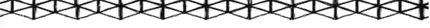
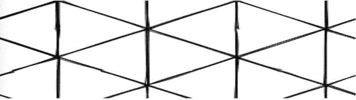
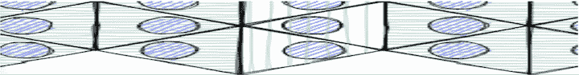
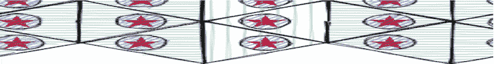
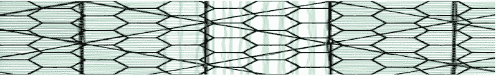
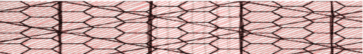

# JavaScript tiling - LogRocket 博客中的实验

> 原文：<https://blog.logrocket.com/experiments-in-javascript-tiling/>

对于一些网站来说，用户参与度是由娱乐价值驱动的——网站的转向程度。当建立这样一个网站时，创造一个与众不同的视觉形象是至关重要的。你的代码应该致力于在美学层面上丰富用户的享受，同时满足客户的设计需求。

一种方法是在表面覆盖一层由独立图像组成的图案。这样做没有任何间隙或重叠的覆盖图像，这被称为平铺平面-平面是表面，平铺是覆盖它的图像的集合。

这些年来，我对这个问题的兴趣到处都有。几周前，我看到一篇名为“[计算机生成的伊斯兰星形图案](https://pdfs.semanticscholar.org/5ce8/42f4093cdd67c838342c69b9062358c74854.pdf)”的论文作者克雷格·卡普兰(Craig Kaplan)在这个主题上写了很多东西，我将在这篇文章中参考他的出版物以获得灵感和例子。

## 原始资料

碰巧的是，卡普兰也有一个 GitHub 简介和一个名为 T2 的库。这基本上是一个专门用于平铺的实用程序库。

根据“[计算机图形的介绍性平铺理论](https://books.google.dk/books/about/Introductory_Tiling_Theory_for_Computer.html?id=OPtQtnNXRMMC&redir_esc=y)”,“有 93 种平铺类型”，即平铺可以相互关联的不同方式。其中，12 个很无聊，因为它们不可定制；该库允许您操作其他 81 种类型。

对于这 81 种类型，瓷砖一边的变化会导致其他边也发生变化——这当然是它们在数学上有趣的原因，但这也是为什么我们需要一个专用的库来确定其他边应该如何变化。

在本教程中，我们将介绍如何使用 TactileJS 为您的网站创建视觉上令人惊叹的图案。你需要把它连接到一个图形库来显示你定义的镶嵌。Tactile 提供了一个演示，演示了如何使用 JavaScript 处理端口来实现这一点。

## 民众

卡普兰已经展示了触觉的一些用例。我在这里复制了它们作为 CodePen 的例子。它们非常全面，初看起来可能令人望而生畏，但是理解这些例子将有助于你更容易地理解一般概念。

下面的交互式演示允许您通过摆弄发送到 Tactile 的参数来动态地改变平铺。

这个交互式演示的变体显示了对触摸事件的支持。

这两个工具都使用了一个名为`tileinfo.js`的实用程序脚本，这使得使用触觉操作变得不那么危险。我也会在我的一些演示中使用它。

要弄清楚如何用你正在使用的绘图库进行平铺，可能需要很多代码，所以 Kaplan 也创建了一个最小的例子。

创造者 Tiler

## 虽然演示对于教授平铺工作原理的教学任务是有用的，但我认为它们仍然比实际需要的稍微复杂一些，尤其是如果您只想快速生成一些平铺并绘制它们的话。

出于这个原因，我构建了一个提供这种功能的小实用程序库，我冒昧地将其命名为[TilerTheCreator](https://github.com/bryanrasmussen/TilerTheCreator)——因为当宇宙给我一个使用这样一个名称的绝佳机会时，我怎么能拒绝呢？

对于这个例子，我将使用 [RoughJS](https://roughjs.com/) 来绘制瓷砖，并从我能想到的最简单的演示开始。

RoughJS 需要一个 canvas 元素来工作，而大多数其他图形库需要一个 DOM 元素来绘制，但会根据需要创建一个 canvas 或 svg 元素。

简单平铺

## 我们开始的 HTML 会很简单；我们只需要一块画布。

`demo_rough.js`会是这样的:

```
            <canvas id="roughcanvas" class="roughcanvas">
        </canvas>

```

`type: 77`瓷砖是一个三角形。更改高度和宽度将会改变您拥有的牌的数量。

```
   import { TilerTheCreator } from './Tiler_The_Creator.js';

const setCanvas = () => { 
        const roughCanvas =  rough.canvas( document.getElementById('roughcanvas') );
        const roughJSTiling = new TilerTheCreator({width: window.innerWidth, height: 10, type: 77}); 
        roughJSTiling.readyToTile(); 
        const polygons = roughJSTiling.getPolygonsFromRegion(); 

        polygons.forEach((polygon) => { 
            roughCanvas.polygon( polygon);
                        })
             } 
            setCanvas();

```

无论如何，你的第一个瓷砖看起来会像这样:




绘图的粗糙是由于 Rought.js 的默认设置，与平铺本身无关。

这是我们能做的最简单的平铺 API。readyToTile 做了一些额外的事情，通过使用前面提到的最小示例中使用的相同的`tiling.fillRegionBounds`函数来实例化您的图块。

更改多边形的大小

如果您想以不同的尺寸绘制图块，可以在实例化时传入一个`scale_factor`属性，或者使用 TilerTheCreator 公开的`setScale`函数。

### 当实例化您的平铺时，尝试传入一个属性`scale_factor: 50`。

您应该会看到类似如下的结果:



```
const roughJSTiling = new TilerTheCreator({width: window.innerWidth, height: window.innerHeight, scale_factor: 50, type: 77});

```

更高级的平铺

显然，我们可以用我们的库绘制其他东西，而不仅仅是瓷砖——在这个例子中，是 RoughJS。但是，由于我们有与我们的瓷砖相关的多边形信息，我们可以看到我们绘制的其他东西如何与这些多边形相关联。

假设我们想在瓷砖里面画一个圆。

## 画圆的大致代码是`roughCanvas.circle`(圆心 X，圆心 Y，圆的直径)。这符合 SVG 定义圆的方式。

为了计算出 X 和 Y 应该在哪里，我们可以添加这些函数，例如:

然后我们将它们添加到我们通过所有多边形的循环中。

这应该会产生下面的图像。


```
const getX = (polygon) => {
return polygon.map(p => p[0]);
}
const getY = (polygon) => {
return polygon.map(p => p[1]);
}

```

Then we’ll add them to our loop through all the polygons.

```
   const polygonX = getX(polygon);
    const polygonY = getY(polygon);
    const xmin = Math.min( ...polygonX );
    const xmax = Math.max( ...polygonX );
    const ymin = Math.min( ...polygonY );
    const ymax = Math.max( ...polygonY );
    const dx = (xmin+xmax) / 2;
    const dy = (ymin+ymax) / 2;
    roughCanvas.circle(dx, dy, 30, {fill: 'blue'});

```

我们还可以使用图形库中的方法，使用多边形中的信息来设计它们的样式。我们不会太深入，但是让我们稍微改变一下我们第一次实例化画布的方式。

我们画完圈之后可以加上下面的。

这样，我们就知道画布中的一些基本位置。当我们绘制多边形时，我们可以使用我们创建的样式属性。

我们应该有这样的东西:

```
const canvas = document.getElementById('roughcanvas');
const canvasW = canvas.width;
const canvasH = canvas.height;
const roughCanvas = rough.canvas(canvas);

```



```
const canvasDivisions = canvasW / 3;
const canvasMiddle = canvasDivisions + canvasDivisions;
const pointPlacement = (dx < canvasDivisions) ? "start" : (dx < canvasMiddle) ? "middle" : "end";
const styling = {};
styling.fill = (pointPlacement === "middle") ? "#8aea92" : "#80ada0";
styling.hachureAngle = (pointPlacement === "middle") ? 180 : 90;
styling.hachureGap = (pointPlacement === "middle") ? 10 : 5;

```

组合绘图 API

```
roughCanvas.polygon(
polygon, styling
);

```

另一个好处是我们可以混合和匹配绘图工具，同时重用多边形数据。例如，由于我们目前正在画布上绘图，我们可以进入浏览器的本机画布 API，而不是依赖于一个库。

让我们使用 canvas API 的`[drawImage](https://developer.mozilla.org/en-US/docs/Web/API/CanvasRenderingContext2D/drawImage)`函数在我们的圆的中心画一颗红星。

首先，通过我们的 canvas 变量为绘图上下文添加一些代码。

### 接下来，加载图像，并将之前的所有多边形操作放入图像加载事件中。这样，我们在需要的时候就有图像可以画了。

我们现在可以输入以下内容。

我们必须改变我们开始绘制的 x 和 y 坐标，因为像 SVG 圆一样，粗略的圆是从 x 和 y 向外绘制的。

我们的模式应该如下所示:

```
const ctx = canvas.getContext('2d');

```



```
const image = new Image();
image.src = 'path to redstar.png';
image.addEventListener('load', () => {
        //all our normal polygon manipulating code comes in here
    });

```

组合多个镶嵌

```
ctx.drawImage(image, dx - 12.5, dy - 12.5, 25, 25);

```

最后，由于我们的平铺解决方案独立于我们的图形库，没有什么可以阻止我们在同一个图形中使用多个平铺。

让我们删除多余的绘图代码，但使用我们之前添加的样式规则。我们将创建两个新的 TilerTheCreator 实例，并用它们来绘制一些多边形。

一旦我们有了这些多边形，我们可以做两件事:分别绘制两个多边形数组，这样我们就有不同的规则来绘制它们各自的镶嵌图，或者简单地将它们连接成一个数组，用相同的规则绘制它们。

让我们参考一下之前的风格演示。

### Combining multiple tilings

我们将对它做一个新的变化，但是用两个不同的镶嵌画出相同的方式。

它应该是这样的:



我们的样式仍然在那里，所有的多边形都在同一个数组中。

所以它们是由同一个多边形绘制函数绘制的。

您也可以像这样绘制两个数组:

Here’s what it should look like:



这里的主要区别是我们的第二个多边形数组被绘制。

```
const polygons = roughJSTiling.getPolygonsFromRegion().concat(roughJSTiling2.getPolygonsFromRegion()); 

```

如果我们将它们保存在两个独立的图块中，我们也可以绘制一些特定类型的图块，例如每隔三个图块绘制一次，或者将图块放置在画布上的某个位置。

从下面的例子中寻找灵感。

按索引设置图块样式:

如果图块落在画布中间，则不要在一个数组中绘制图块:

The main difference here is that our second array of polygons is drawn.

```
 polygons2.forEach((polygon) => {
            roughCanvas.polygon(
                  polygon, {fill: 'red'}
            );
        });

```

由于图形是由 JavaScript 绘制的，我们可以像处理其他任何东西一样对页面上的事件做出反应。例如，我们可以改变一个瓷砖或改变其他事情来响应一个事件。

结论

当然，你可以用这些技术做很多其他的事情，比如结合多种镶嵌和绘图方法来制作万花筒效果或者镶嵌动画。我希望这篇指南能给你一些想法，帮助你开始 JavaScript 平铺之旅。

通过理解上下文，更容易地调试 JavaScript 错误

调试代码总是一项单调乏味的任务。但是你越了解自己的错误，就越容易改正。

LogRocket 让你以新的独特的方式理解这些错误。我们的前端监控解决方案跟踪用户与您的 JavaScript 前端的互动，让您能够准确找出导致错误的用户行为。

LogRocket 记录控制台日志、页面加载时间、堆栈跟踪、慢速网络请求/响应(带有标题+正文)、浏览器元数据和自定义日志。理解您的 JavaScript 代码的影响从来没有这么简单过！

## .

Of course, there are lots of other things you could do with these techniques, such as combining multiple tilings and drawing methods to make kaleidoscopic effects or animations of the tilings. I hope this guide gave you some ideas to help kick off your JavaScript tiling journey.

## [LogRocket](https://lp.logrocket.com/blg/javascript-signup): Debug JavaScript errors more easily by understanding the context

Debugging code is always a tedious task. But the more you understand your errors the easier it is to fix them.

[LogRocket](https://lp.logrocket.com/blg/javascript-signup) allows you to understand these errors in new and unique ways. Our frontend monitoring solution tracks user engagement with your JavaScript frontends to give you the ability to find out exactly what the user did that led to an error.

[](https://lp.logrocket.com/blg/javascript-signup)

LogRocket records console logs, page load times, stacktraces, slow network requests/responses with headers + bodies, browser metadata, and custom logs. Understanding the impact of your JavaScript code will never be easier!

[Try it for free](https://lp.logrocket.com/blg/javascript-signup)

.