# 探索最好的 Laravel 图表库

> 原文：<https://blog.logrocket.com/exploring-best-laravel-chart-libraries/>

随着公司越来越受数据驱动，高效收集和分析数据的需求也在不断增长。这种需求使得图表作为帮助人们简化复杂数据和快速有效地交流信息的工具越来越有价值。

开发人员通常使用数据库信息来创建易于用户理解的可视化效果。由于图表已经成为网站中的一个常见功能，使用图表库来创建这些可视化效果是有意义的，而无需编写数百行代码或从头开始构建。

在本文中，我们将看看 Laravel 中最好的图表库，以及如何在项目中使用它们。我们将使用这些库来创建折线图、条形图和饼图。

我们将介绍的 Laravel 图表库包括:

我特别选择了这三个库，因为它们可以无缝集成到项目中，并且只需要很少的几行代码就可以完成一个完整的图表。让我们深入其中吧！

向前跳:

## 什么是 Larapex 图表？

Larapex Charts 是一个围绕着 T2 的 Laravel 包装器。在这个包的帮助下，我们可以轻松地在我们的 Laravel 应用程序中创建和呈现图表，而无需编写任何 JavaScript 代码。

这个软件包为我们提供了饼状图，圆环图，面积图，折线图，以及其他。要在您的项目中使用 Larapex 图表库，请使用`composer`安装它:

```
composer require arielmejiadev/larapex-charts

```

使用上面的命令安装这个库之后，您应该会看到下面的内容:

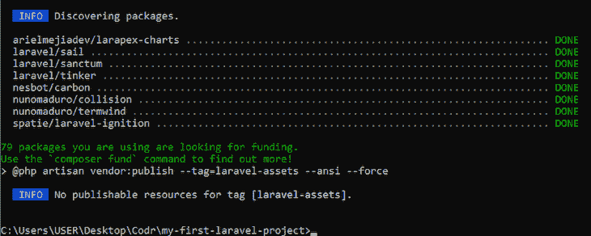

接下来，发布 Larapex 的`config`文件，使它们可以被您的应用程序访问:

```
php artisan vendor:publish –tag=larapex-charts-config

```

如下图所示，当您看到绿色文本的`DONE`时，您已经成功设置了 Larapex 图表:

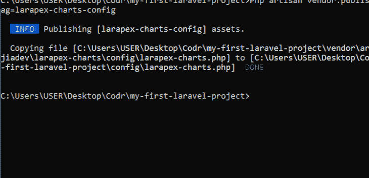

现在，您可以在项目中使用 Larapex 图表。

### 使用 Larapex 图表创建条形图

Larapex 图表包提供了一个`chart`类。我们需要创建这个类的一个实例，在这个例子中，我将其命名为`ExpensesChart`:

```
php artisan make:chart ExpensesChart

```

运行上述命令后，系统会提示您选择要创建的图表类型。让我们先创建一个条形图:

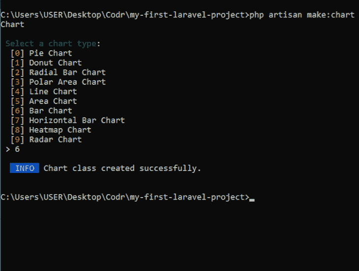

将在`app/Charts/ExpensesChart`中创建一个图表类。您可以通过给图表的属性赋值来自定义图表。使用`setTitle`设置图表标题，使用`addData`设置图表数据，使用`setXAxis`设置 x 轴上的值:

```
<?php
namespace App\Charts;
use ArielMejiaDev\LarapexCharts\LarapexChart;
class ExpensesChart
{
    protected $chart;
    public function __construct(LarapexChart $chart)
    {
        $this->chart = $chart;
    }
    public function build(): \ArielMejiaDev\LarapexCharts\BarChart
    {
        return $this->chart->barChart()
            ->setTitle('My July Expenses.')
            ->setSubtitle('Weekly expenses in july.')
            ->addData('Bills', [26, 39, 10, 48])
            ->addData('Vacation', [70, 13, 36, 94])
            ->addData('EatOuts',[50, 60, 70, 30])
            ->setXAxis(['Week1', 'Week2', 'Week3', 'Week4']);
    }
}

```

接下来，创建一个控制器来帮助构建和呈现图表:

```
php artisan make: controller ExpensesController –r

```

您应该会看到一条消息，确认控制器创建成功:

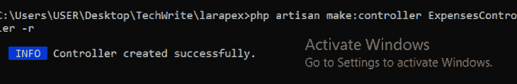

导航到`app/HTTP/Controller/ExpensesController`并导入您创建的`ExpensesChart`类。在`index`函数中，创建一个`ExpensesChart`对象，并使用`ExpensesChart`类中的`build()`函数来创建您的图表。然后图表可以被传递给一个`view`:

```
<?php
namespace App\Http\Controllers;
use App\Charts\ExpensesChart;
use Illuminate\Http\Request;
class ExpensesController extends Controller
{
    /**
     * Display a listing of the resource.
     *
     * @return \Illuminate\Http\Response
     */
    public function index(ExpensesChart $chart)
    {
        return view('expenses.index', ['chart' => $chart->build()]);   
    }
}

```

在上面的代码中，我们将图表对象传递给了`expenses.index`，这是一个位于`Expenses`文件夹中的`index.blade.php`文件。您可以在这里找到该文件夹:

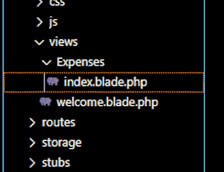

为了确保索引函数在访问`view`页面时被调用，我们需要在`routes/web.php`中为它创建一个路由。

首先，导入你的控制器`ExpensesController`。然后创建一个路由`/expenses`，它触发`ExpensesController`类中的`index`函数，并返回相应的`view`文件:

```
<?php
use Illuminate\Support\Facades\Route;
use App\Http\Controllers\ExpensesController;
Route::get('/expenses', [ExpensesController::class, 'index'])->name('expenses.index');

```

现在可以使用`$chart->container()`将图表呈现在您的`view`中。在页面底部，添加软件包的 CDN 和脚本文件:

```
<!doctype html>
<html lang="en">
<head>
    <meta charset="UTF-8">
    <meta name="viewport" content="width=device-width, user-scalable=no, initial-scale=1.0, maximum-scale=1.0, minimum-scale=1.0">
    <meta http-equiv="X-UA-Compatible" content="ie=edge">
    <title>Chart Example</title>
    <link href="https://unpkg.com/[email protected]^2/dist/tailwind.min.css" rel="stylesheet">
</head>
<body class="h-screen bg-gray-100">
<div class="container px-4 mx-auto">
    <div class="p-6 m-20 bg-white rounded shadow">
        {!! $chart->container() !!}
    </div>
</div>
<script src="{{ $chart->cdn() }}"></script>
{{ $chart->script() }}
</body>
</html>

```

现在，如果您在浏览器中导航到`localhost:8000/expenses`，条形图应该可见:

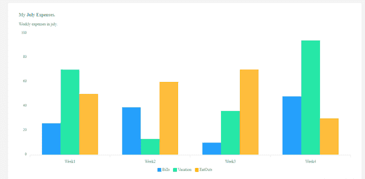

### 创建其他类型的图表

Larapex 图表不仅限于条形图。我们可以按照相同的过程创建其他类型的图表。

例如，要创建饼图，在终端中运行`php artisan make:chart`命令后，从提供的选项列表中选择`Pie Chart`:

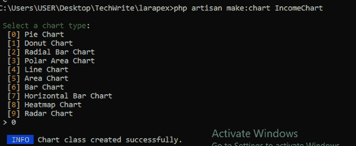

就像之前一样，定制您的图表以符合您的要求，就像这样:

```
<?php
namespace App\Charts;
use ArielMejiaDev\LarapexCharts\LarapexChart;
class IncomeChart
{
    protected $chart;
    public function __construct(LarapexChart $chart)
    {
        $this->chart = $chart;
    }
    public function build(): \ArielMejiaDev\LarapexCharts\PieChart
    {
        return $this->chart->pieChart()
            ->setTitle('My Monthly Income')
            ->setSubtitle('July Income')
            ->addData([400, 500,700, 300])
            ->setLabels(['income1', 'income2', 'income3']);
    }
}

```

接下来，使用以下命令创建一个控制器:

```
php artisan make: controller IncomeController –r

```

这将允许您构建和呈现图表，如下所示:

```
<?php
namespace App\Http\Controllers;
use Illuminate\Http\Request;
use App\Charts\IncomeChart;
class IncomeController extends Controller
{
    /**
     * Display a listing of the resource.
     *
     * @return \Illuminate\Http\Response
     */
    public function index(IncomeChart $chart)
    {
        return view('income.index', ['chart' => $chart->build()]);
    }

```

创建连接控制器和视图的路线:

```
<?php 
Use Illuminate\Support\Facades\Route;
Use App\Http\Controllers\IncomeController;
Route::get(‘/income’, [IncomeController::class, ‘index’]) ->name(‘income.index’);

```

最后，用`$chart->container()`在视图中呈现图表。

```
<body class="h-screen bg-gray-100">
<div class="container px-4 mx-auto">
    <div class="p-6 m-20 bg-white rounded shadow">
        {!! $chart->container() !!}
    </div>
</div>
<script src="{{ $chart->cdn() }}"></script>
{{ $chart->script() }}
</body>

```

结果是:


## 浏览控制台电视/图表 v6

尽管 ConsoleTV/Charts 库的 v7 最近被弃用，但是 [v6 仍然是活动的，并且在运行](https://charts.erik.cat/getting_started.html)。这个库[帮助开发人员将 Chart.js](https://blog.logrocket.com/using-chart-js-react/) 集成到 Laravel 应用程序中，而无需编写任何 JavaScript 代码。有了这个库，开发人员可以通过 API 创建图表。

在应用程序中安装软件包:

```
composer require consoletvs/charts “6.*”

```

现在我们的应用程序中有了这个库，可以继续使用它来创建图表。

### 使用控制台电视/图表创建饼图

运行以下命令创建新的图表模型:

```
php artisan make:chart IncomeChart

```

您应该会看到如下所示的确认消息:

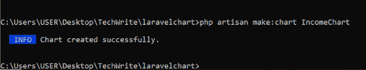

上面的命令在`app/Charts`中创建了一个`IncomeChart`类。它有一个构造函数，帮助初始化你的图表。

接下来，我们需要一个控制器来帮助生成图表数据:

```
php artisan make:controller IncomeChartController -r

```

导航到您的新控制器`app/Http/Controllers/UserChartController.php`并为您的图表添加一些数据。

正如您在下面看到的，我们正在创建一个图表，显示六月、七月和八月的收入。在`labels`中，你会找到 X 轴上的值。同样，在`dataset`中，您将找到 Y 轴上的值。代码如下:

```
<?php
namespace App\Http\Controllers;
use App\Charts\IncomeChart;
use Illuminate\Http\Request;
class IncomeChartController extends Controller
{
    /**
     * Display a listing of the resource.
     *
     * @return \Illuminate\Http\Response
     */
    public function index()
    {
        $incomeChart = new IncomeChart;
        $incomeChart->labels(['June', 'July', 'August']);
        $incomeChart->dataset('Income', 'pie', [400, 392, 355]);
        return view('income', [ 'incomeChart' => $incomeChart ] );
    }
}

```

请注意我们如何创建了一个`IncomeChart`模型的实例，并使用该实例来创建图表数据。然后，我们将图表数据传递给一个名为`income`的`view`，我们现在必须创建它。

导航到`resources/views/`并创建一个名为`income.blade.php`的文件。在这个`view`文件中，我们可以通过使用`container()`函数来访问我们之前创建的图表，该函数带有我们之前创建的`incomeChart`模型:

```
<div class="container">
    <h1>Income Graphs</h1>
    <div class="row">
        <div class="col-6">
            <div class="card rounded">
                <div class="card-body py-3 px-3">
                    {!! $incomeChart->container() !!}
                </div>
            </div>
        </div>
    </div>
</div>

```

我们还需要在`head`标签中添加 Chart.js 的 CDN:

```
<head>
    {{-- ChartStyle --}}
    <script src="https://cdnjs.cloudflare.com/ajax/libs/Chart.js/2.7.1/Chart.min.js" charset="utf-8"></script>
</head>

```

此外，我们需要在`body`标签中为这个库添加一些其他脚本文件:

```
...
    {!! $incomeChart->script() !!}
</body>

```

最终，您的`view`文件应该是这样的:

```
<!DOCTYPE html>
<html lang="{{ str_replace('_', '-', app()->getLocale()) }}">
<head>
    <meta charset="utf-8">
    {{-- ChartStyle --}}
    <script src="https://cdnjs.cloudflare.com/ajax/libs/Chart.js/2.7.1/Chart.min.js" charset="utf-8"></script>
</head>
<body>
    <div id="app">

        <main class="py-4">
        <div class="container">
            <h1>Income Graph</h1>
            <div class="row">
                <div class="col-6">
                    <div class="card rounded">
                        <div class="card-body py-3 px-3">
                            {!! $incomeChart->container() !!}
                        </div>
                    </div>
                </div>
            </div>
        </div>
        </main>
    </div>

    {{-- Chartscript --}}
    @if($incomeChart)
    {!! $incomeChart->script() !!}
    @endif
</body>
</html>

```

最后，我们需要一个从 web URL 调用控制器的路由:

```
Route::get('/income', [IncomeChartController::class, 'index']);

```

现在，如果您在浏览器中导航到`localhost:8000/income`，您的饼图应该可见:

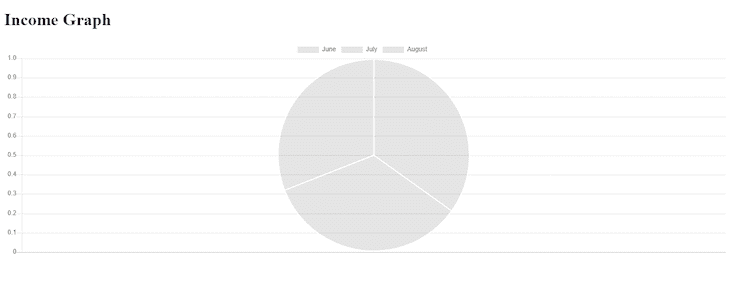

如果你回到你的控制器，将`pie`改为`line`或`bar`，你也应该得到相应的结果。

对于折线图:

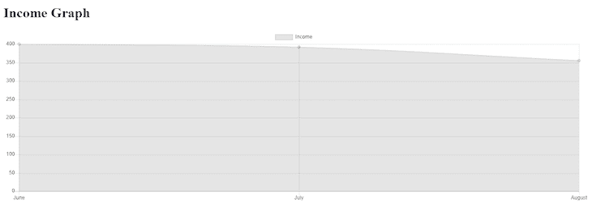

对于条形图:

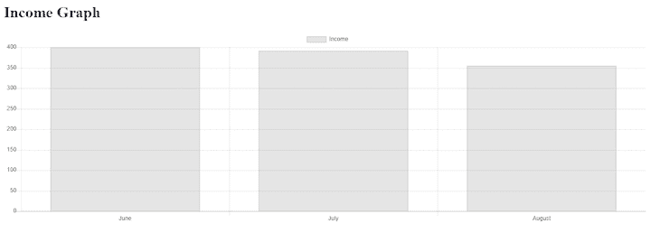

## 什么是`laravel-charts`？

我们要介绍的最后一个[图表库是](https://github.com/LaravelDaily/laravel-charts) `[laravel-charts](https://github.com/LaravelDaily/laravel-charts)`。就像前面的选项一样，这个包也可以帮助开发人员在 Laravel 应用程序的 Blade 文件中创建 Chart.js 图表，而无需编写任何 JavaScript 代码。

运行以下命令安装`laravel-charts`:

```
composer require laraveldaily/laravel-charts

```


为了探索如何使用`laravel-charts`，我们将绘制一张用户图表，对照他们被添加到我们的数据库的月份。转到`phpmyadmin`并创建一个名为`users`的数据库，然后将数据库名称添加到您的`.env`文件中:

```
DB_CONNECTION=mysql
DB_HOST=127.0.0.1
DB_PORT=3306
DB_DATABASE=users
DB_USERNAME=root
DB_PASSWORD=

```

当我们创建`users`表时，我们将使用 Laravel 的`DatabaseSeeder`为我们的图表创建一些虚拟用户。导航到`Database\Seeders\DatabaseSeeder`,简单地取消下面代码的注释:

```
public function run()
    {
        \App\Models\User::factory(10)->create();
        \App\Models\User::factory()->create([
            'name' => 'Test User',
            'email' => '[email protected]',
        ]);
    }

```

现在，我们已经准备好迁移和播种我们的数据库:

```
php artisan migrate --seed

```

至此，我们已经为图表创建了要显示的用户。现在，我们将继续创建图表本身。我们将在控制器中创建图表，然后将其传递给视图。

首先，创建控制器:

```
php artisan make:controller UserController

```

导航到新创建的控制器— `namespace App\Http\Controller\UserController` —并在`index`函数中创建图表:

```
public function index()
    {
        $chart_options = [
            'chart_title' => 'Users by months',
            'report_type' => 'group_by_date',
            'model' => 'App\Models\User',
            'group_by_field' => 'created_at',
            'group_by_period' => 'month',
            'chart_type' => 'bar',
        ];
        $chart1 = new LaravelChart($chart_options);

        return view('home', compact('chart1'));
    }

```

我们现在将创建一个变量`$chart_options`,并为它提供一组图表选项:

*   `chart_title` —显示在图例中的文本
*   `report_type` —确定图表数据的分组方式
*   `model` —图表数据的来源
*   `group_by_field` —我们数据库中的字段，将在`group_by`子句中使用
*   `group_by_period` —用于指定`group_by_date`报告类型的日期
    *   值可以是日、周、月或年

下一步是从我们安装的图表包中创建一个`LaravelChart`类的对象。首先，导入该类:

```
use LaravelDaily\LaravelCharts\Classes\LaravelChart;

```

然后，使用它创建一个对象:

```
$chart1 = new LaravelChart($chart_options);

```

最后，将它传递给你的视图:

```
return view('home', compact('chart1'));

```

要在视图中呈现图表，请在刀片文件中添加所需的 CDN 和样板代码:

```
{!! $chart1->renderChartJsLibrary() !!}
{!! $chart1->renderJs() !!}

```

现在您可以呈现图表了:

```
<div>
    <h1>{{ $chart1->options['chart_title'] }}</h1>
                    {!! $chart1->renderHtml() !!}
</div>

```

如果你需要，这里有完整的代码:

```
<!doctype html>
<html lang="en">
<head>
    <meta charset="UTF-8">
    <meta name="viewport" content="width=device-width, user-scalable=no, initial-scale=1.0, maximum-scale=1.0, minimum-scale=1.0">
    <meta http-equiv="X-UA-Compatible" content="ie=edge">
    <title>Chart Sample</title>
    <link href="https://unpkg.com/[email protected]^2/dist/tailwind.min.css" rel="stylesheet">
</head>
<body class="h-screen bg-gray-100">
<div class="container px-4 mx-auto">
    <div class="p-6 m-20 bg-white rounded shadow">
    <h1>{{ $chart1->options['chart_title'] }}</h1>
                    {!! $chart1->renderHtml() !!}
    </div>
</div>
{!! $chart1->renderChartJsLibrary() !!}
{!! $chart1->renderJs() !!}
</body>
</html>

```

下面，您可以看到浏览器中的结果:

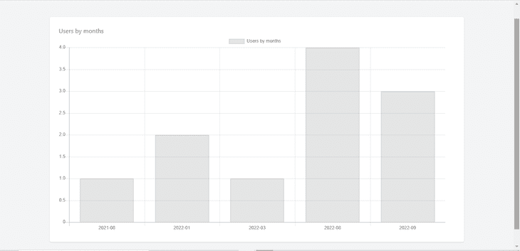

要创建一个饼图，导航到您的控制器并将`chart_type`的值更改为`pie`:

```
'chart_type' => 'pie'

```


对于折线图，设定值`line`:

```
'chart_type' => 'line'

```

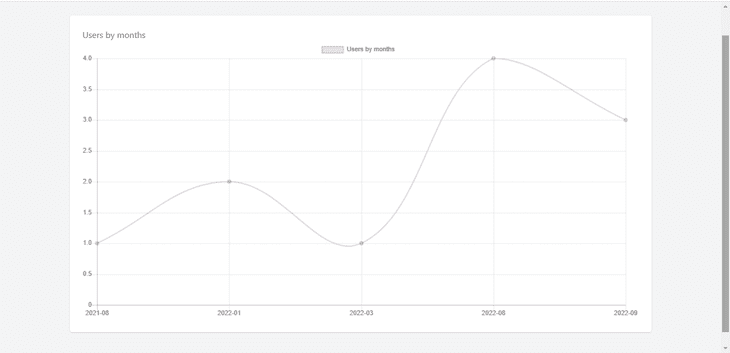

## 结论

在本指南中，我们讨论了三个最好的 Laravel 图表库，开发人员可以使用它们将图表添加到他们的 Laravel 应用程序中: [Larapex 图表](https://github.com/ArielMejiaDev/larapex-charts)、 [ConsoleTVs/Charts v6](https://charts.erik.cat/getting_started.html) 和`[laravel-charts](https://github.com/LaravelDaily/laravel-charts)`。

我们使用所有这三个库来创建样本线图、条形图和饼图——尽管这些库都不局限于这三种类型的图表。希望你现在可以自信地在下一个 Laravel 项目中实现这些图表库[。](https://blog.logrocket.com/whats-new-laravel-9/)

## 使用 [LogRocket](https://lp.logrocket.com/blg/signup) 消除传统错误报告的干扰

[](https://lp.logrocket.com/blg/signup)

[LogRocket](https://lp.logrocket.com/blg/signup) 是一个数字体验分析解决方案，它可以保护您免受数百个假阳性错误警报的影响，只针对几个真正重要的项目。LogRocket 会告诉您应用程序中实际影响用户的最具影响力的 bug 和 UX 问题。

然后，使用具有深层技术遥测的会话重放来确切地查看用户看到了什么以及是什么导致了问题，就像你在他们身后看一样。

LogRocket 自动聚合客户端错误、JS 异常、前端性能指标和用户交互。然后 LogRocket 使用机器学习来告诉你哪些问题正在影响大多数用户，并提供你需要修复它的上下文。

关注重要的 bug—[今天就试试 LogRocket】。](https://lp.logrocket.com/blg/signup-issue-free)