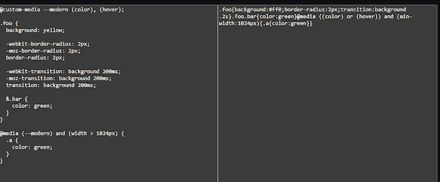
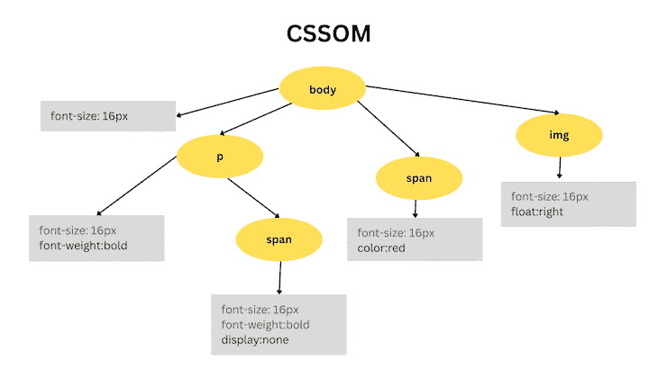
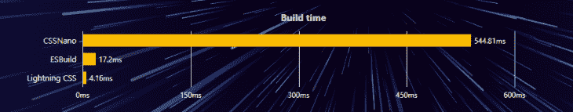

# 探索 Lightning CSS 中的捆绑

> 原文：<https://blog.logrocket.com/exploring-bundling-lightning-css/>

随着 Astro 等专注于减少网站加载时间的框架的兴起，很明显，速度在提高网站性能方面起着至关重要的作用。

有多种方法可以提高网站的加载速度，包括删除多余的 JavaScript 代码、优化图片、执行延迟加载等等。或者，你可以考虑缩小你网站的 CSS。

在本文中，我们将学习如何使用 CSS 精简器 [Lightning CSS](https://lightningcss.dev) 来捆绑我们的 CSS 代码。我们开始吧！

*向前跳转:*

## 什么是 CSS 缩小？

CSS 缩小是从 CSS 文件中移除空格、缩进、换行符和注释的过程，从而减小文件大小并将其转换为单行代码。由于重量较轻，CSS 加载速度更快，从而减少了网站的整体加载时间:



最初，开发人员用漂亮的、格式良好的代码编写 CSS。但是，在将 CSS 代码投入生产之前，他们会将其缩小以加快加载速度。大多数现代前端框架和库，如 React、Next.js 和 Astro，都预装了 CSS minifier，有时，您可以选择不同的 CSS minifier。

## 什么是 CSS bundler？

在缩小过程中，我们使用 CSS bundler 来处理依赖关系。捆绑是通过解决依赖关系和合并文件来创建优化捆绑包的过程。

当 CSS 解析器读取 CSS 代码并将其转换为 web 浏览器可以理解的结构化格式时，浏览器将 CSS 中的字节转换为一种称为 CSSOM 的数据结构，这相当于 HTML 的 DOM。下图显示了 CSSOM 的结构:



不同的编程语言有不同的 CSS 解析器；[小于](https://lesscss.org/)是 JavaScript 的一个。

## 什么是 CSS 转换器？

CSS 转换器是一种工具或软件，它将 CSS 代码作为输入，并对其进行各种修改，例如，删除不必要的空白、优化样式或将其转换为不同的格式或语法。它还可以包括为支持不同 CSS 属性的不同浏览器添加前缀。

CSS 转换器的目标是优化和简化 CSS 代码，以提高性能和减小文件大小，而不改变样式在浏览器中的显示方式。

## 什么是闪电 CSS？

以前称为包裹 CSS，照明 CSS 是用 Rust 编写的 CSS 解析器、转换器、捆绑器和迷你器。简而言之，Lightning CSS 在 CSS 文件上运行，为 web 应用程序创建一个优化的 CSS 包。

与 esbuild 和 cssnano 等其他基于 JavaScript 的工具相比，使用 Lightning CSS 缩小大型 CSS 文件要快得多:



## 在不同的捆绑器中实现 Lightning CSS

### 包裹

[包](https://parceljs.org/)是一个开源的捆绑器。由同一个人[德文·戈维特](https://twitter.com/devongovett)建造，包裹带有对闪电 CSS 的内置支持。默认情况下，Lightning CSS 处理 CSS 转换；您可以在根目录下的`package.json`文件中使用以下设置对其进行配置:

*   `drafts`:启用 CSS 嵌套和自定义媒体查询
*   `psedoClasses`:处理类似`:focus-visible`的伪类
*   `cssModules`:全局启用 CSS 模块

以下是上述配置的代码:

```
{
  "@parcel/transformer-css": {
    "cssModules": true,
    "drafts": {
      "nesting": true,
      "customMedia": true
    },
    "pseudoClasses": {
      "focusVisible": "focus-ring"
    }
  }
}

```

### 网络包

webpack 是另一个用于 JavaScript 的开源模块捆绑器。我们可以使用 [`css-minimizer-webpack-plugin`](https://www.npmjs.com/package/css-minimizer-webpack-plugin?activeTab=readme) 将 Lightning CSS 与 webpack 集成，它带有对 Lightning CSS 的内置支持。

使用下面的命令，安装`lightingcss`和`css-minimizer-webpack-plugin`。我们还增加了针对浏览器的`browserlist`:

```
npm install --save-dev lightningcss css-minimizer-webpack-plugin browserslist

```

现在，我们可以配置`webpack.config.js`文件了。从库中导入所有必需的模块，如下所示:

```
const CssMinimizerPlugin = require('css-minimizer-webpack-plugin');
const lightningcss = require('lightningcss');
const browserslist = require('browserslist');

```

下面是配置:

```
module.exports = {
  optimization: {
    minimize: true,
    minimizer: [
      new CssMinimizerPlugin({
        minify: CssMinimizerPlugin.lightningCssMinify,
        minimizerOptions: {
          targets: lightningcss.browserslistToTargets(browserslist('>= 0.25%'))
        },
      }),
    ],
  },
};

```

### 轻快地

再来说说 Vite 这个好奇的案例。在撰写本文时，还没有官方的方法将 Lightning CSS 与 Vite 集成，因为没有可用的插件。但是，有第三方库； [`vite-plugin-lightningcss`](https://github.com/lawrencecchen/vite-plugin-lightningcss) 只能在 transpilation 方面帮到你，trans pilation 是将现代 CSS 语法代码转换为支持旧版浏览器的过程。

用下面的命令安装`vite-plugin-lightningcss`:

```
npm install --save-dev vite-plugin-lightningcss

```

接下来，我们只需要使用下面的代码配置`vite.config.ts`文件:

```
import lightningcss from 'vite-plugin-lightningcss';

export default {
  plugins: [
    lightningcss({
      browserslist: '>= 0.25%',
    }),
  ],
};

```

## Node.js 中的绑定

Lightning CSS 支持在 Node.js 应用程序中捆绑 CSS 代码。使用`bundle`函数，我们可以从特定文件中缩小并捆绑代码。`bundle`将使`code`和`map`返回缓冲状态；`code`是缩小的代码，`map`是文件的源码图，在调试时很有用:

```
import { bundle } from 'lightningcss';

let { code, map } = bundle({
  filename: 'style.css',
  minify: true
});

```

## 自定义 JavaScript 解析器

为了支持自定义解析器，Lightning CSS 支持`bundleAsync`函数，这是常规`bundle`的异步版本。它支持添加自定义解析器，以`resolver`为对象。对象的属性是函数；`read`和`resolve`是两个功能，都是可选的。下面是示例的代码:

```
import { bundleAsync } from 'lightningcss';

let { code, map } = await bundleAsync({
  filename: 'style.css',
  minify: true,
  resolver: {
    read(filePath) {
      return fs.readFileSync(filePath, 'utf8');
    },
    resolve(specifier, from) {
      return path.resolve(path.dirname(from), specifier);
    }
  }
});

```

## 结论

在本教程中，我们探索了使用 Lightning CSS 库缩小和捆绑 CSS，这是一个使用插件来集成包裹和其他捆绑应用程序的工具。其中一些不是官方插件，支持有限。但是，尽管如此，当您将 Lightning CSS 用作 Node.js 中的库时，它还是非常强大的。

如果你想让你喜欢的工具集成 Lightning CSS，那么你可以将它们固定为插件。希望本文能帮助您更好地理解使用 Lightning CSS 进行捆绑。感谢阅读！

## 你的前端是否占用了用户的 CPU？

随着 web 前端变得越来越复杂，资源贪婪的特性对浏览器的要求越来越高。如果您对监控和跟踪生产环境中所有用户的客户端 CPU 使用、内存使用等感兴趣，

[try LogRocket](https://lp.logrocket.com/blg/css-signup)

.

[](https://lp.logrocket.com/blg/css-signup)[https://logrocket.com/signup/](https://lp.logrocket.com/blg/css-signup)

LogRocket 就像是网络和移动应用的 DVR，记录你的网络应用或网站上发生的一切。您可以汇总和报告关键的前端性能指标，重放用户会话和应用程序状态，记录网络请求，并自动显示所有错误，而不是猜测问题发生的原因。

现代化您调试 web 和移动应用的方式— [开始免费监控](https://lp.logrocket.com/blg/css-signup)。