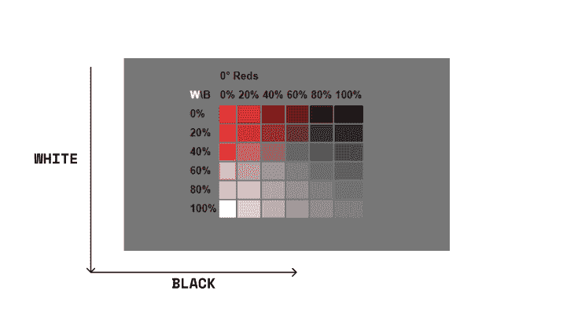
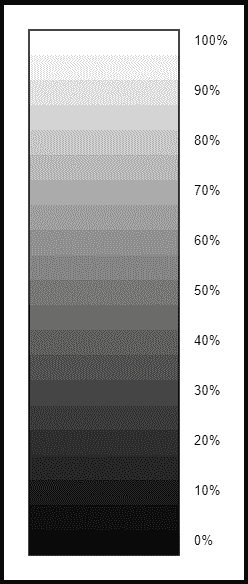
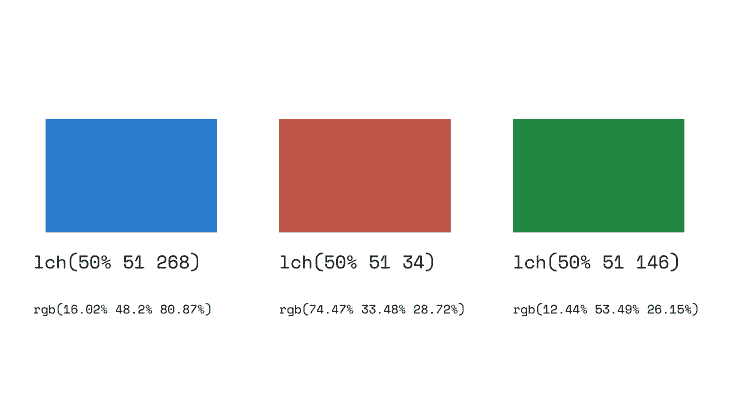

# CSS 颜色模块 5 级参考指南

> 原文：<https://blog.logrocket.com/exploring-css-color-module-level-5/>

过去，使用 CSS 的开发人员依赖预定义的颜色关键字或模糊的十六进制值来选择和应用颜色。然而，[随着 CSS 的发展](https://blog.logrocket.com/advanced-guide-setting-colors-css/)，更加用户友好、灵活的替代品变得可用，例如 RGB(红、绿、蓝)和 HSL(色调、饱和度、亮度)功能。还引入了 alpha 通道，允许控制透明度。

一些 CSS 改进关注于实现的容易程度，而不是功能性。例如，不透明度最初是使用一个单独的颜色函数 rgba()指定的，但后来发展到可以作为 RBG 函数中的第四个参数。下面是我们如何使用不同的 CSS 颜色函数来定义纯黑的比较:`hex(# 000000)`、`rgb(0, 0,0)`、`rgba(0, 0, 0, 0.4)`和`HSL(0, 0%, 0%)`。

CSS 颜色模块 Level 5 提供了许多新的颜色功能和改进，为开发者打开了一个新的可能性世界。一个例子是 LCH 颜色函数，它提供了大约 50%以上的颜色。

在本文中，我们将介绍 CSS 颜色模块 Level 5 中一些新的颜色规范方法。我们将回顾它们的优点，并展示如何使用这些颜色函数。我们还将讨论浏览器对这些新方法的支持。

我们将看看下面的 CSS 颜色函数和方法:

我们开始吧！

## HWB

HWB(色调、白度、黑度)是一种类似于 HSL 的颜色规范方法。hue 参数可以是 0 到 360 之间的任何数字，它指的是色轮上的特定颜色(红色、蓝色、蓝绿色、梅子色等。).

白度指定混合到色调中的白色量，从 0-100%不等。类似地，黑度指定有多少黑色混合到色调中，从 0-100%。

相等比例的白色和黑色通常会使色调显得更灰。100%的白度和 0%的黑度将产生纯白色。100%的黑度和 0%的白度将产生纯黑色。

还有一个可选的第四个参数，alpha 参数，可以添加到混合中来指定颜色的不透明度。

### 语法:HWB

在这个针对 HWB 的 CSS 语法示例中，我们用`20%`白度、`40%`黑度和`.3`不透明度指定了色调`0`:

```
hwb(0 20% 40%)
//with an optional alpha argument for specifying the opacity
hwb(0 20% 40% / .3)

```

下图显示了具有不同白度和黑度百分比的红色色调的颜色范围:



Sample CSS HWB color model; source: [W3C working draft](https://drafts.csswg.org/css-color/#the-hwb-notation).

我们可以看到，当白度或黑度达到 100%时，选定的色调分别变成白色或黑色，不会留下任何选定色调的痕迹。

## 实验室

LAB 颜色函数基于 [CIELAB 颜色空间](https://www.researchgate.net/figure/The-CIELAB-color-space-diagram-The-CIELAB-or-CIE-L-a-b-color-system-represents_fig1_338303610)。它以接近人类感知的方式表现颜色。与传统的 RGB 颜色空间相比，该颜色函数提供了更宽的颜色范围。LAB 颜色被称为与设备无关的颜色。

LAB 中的 L 表示明度，A 和 B 是[色度](https://en.wikipedia.org/wiki/Chromaticity#:~:text=Chromaticity%20is%20an%20objective%20specification,%2C%20intensity%2C%20or%20excitation%20purity.)坐标。更具体地说，A 和 B 是颜色方向。红绿轴由轴的红色端的正 A 和轴的绿色端的负 A 表示。类似地，黄蓝轴由轴的黄色端的正 B 和轴的蓝色端的负 B 表示。

LAB 颜色空间比 HSL 颜色空间更成功地表示光。需要注意的是，LAB 中的亮度轴不应与 HSL 中的 L 轴混淆。

规格中有一个很好的例子:

在 HSL 中，sRGB 颜色蓝色(# 00F)和黄色(# FF0)具有相同的 L 值(50%)，即使在视觉上，蓝色要暗得多。这在实验室中更加明显:sRGB 蓝是`lab(29.567% 68.298 -112.0294)`，而 sRGB 黄是`lab(97.607% -15.753 93.388)`。在实验室和 LCH，如果两种颜色有相同的 L 值，他们有相同的视觉亮度。

### 语法:实验室

```
lab(20% 100 20)
// with an optional alpha argument for specifying opacity
lab(20% 100 20 / .3)

```

下面是一个说明 LAB 颜色空间的明度轴的示例:



Lightness axis of the LAB color space; source: [W3C working draft](https://drafts.csswg.org/css-color/#lab-colors).

## 组织郎格罕细胞增生症

LCH 色彩空间的 L 轴与 LAB 色彩空间的 L 轴相同。事实上，这两种颜色空间都允许访问更广泛的颜色，因为它们旨在覆盖人类视觉的全光谱。

LCH 中的 L 是表示光通道的百分比，它可以超过 100%。c 或色度表示混合中的颜色数量。我们认为这个值是 HSL 色彩空间中的饱和度。在 LCH，它可以超过 100%。当它出现时，颜色将超出今天浏览器的色域。最后，H 代表色相。这可以是 0 到 360 之间的一个数字，类似于 HSL 或 HWB。

与 HSL 或 RGB 不同，在 HSL 或 RGB 中，调整亮度会根据色调产生不同的效果，而 LCH 在感知上是一致的。坐标中相同的数值变化会导致相同的感知色差，这使得颜色处理足够灵活。

有关 LCH 色彩空间的更多深入信息，请参考这篇由 Lea Verou 撰写的详细文章:[CSS 中的 LCH 色彩:什么，为什么，以及如何？](https://lea.verou.me/2020/04/lch-colors-in-css-what-why-and-how/)

### 语法:LCH

```
lch(80% 80 80)
// with an optional alpha argument for specifying opacity
lch(80% 80 80 / .3) 

```

下面是在 LCH 色彩空间中定义的三种颜色，以相同的亮度值(50%)显示。因为 LCH 在感知上是均匀的，所以这些颜色被感知为具有相同的亮度；这不是 HSL 颜色函数的情况。



## `color-mix`

`color-mix()`函数返回以指定百分比混合的两种颜色的结果。例如，`color-mix(in lch, purple 50%, plum 50%)`产生 50%紫色和 50%梅子色的混合物。

如果您以前使用过 Sass，这可能看起来很熟悉。它非常类似于 Sass 颜色混合函数:`mix($color1, $color2, [$weight])`，其中`$weight`参数指定了要添加的`$color1`的百分比。

### 语法:`color-mix`

```
color-mix(in lch, purple 50%, plum 50%)

```

以下是使用 CSS `color-mix()`函数时需要注意的一些附加事项:

*   如果没有指定 color1 和 color2 的百分比，它们将各自默认为 50 %,从而产生两种颜色的相等混合
*   如果未指定颜色 1 的百分比，它将默认为 100%和颜色 2 的百分比之差
*   如果未指定颜色 2 的百分比，它将默认为 100%和颜色 1 的百分比之差
*   如果颜色 1 和颜色 2 的百分比相加超过 100 %,它们将按比例缩小，使它们相加为 100%
*   如果颜色 1 和颜色 2 的百分比加起来小于 100 %,它们将按比例放大，使它们加起来等于 100%
*   `in lch`参数是指颜色混合的颜色空间。根据指定的颜色空间，混合或组合颜色可以产生不同的结果
*   如果选定的色彩空间无法表达颜色(例如，如果 HSL 和 HWB 空间无法表达 sRGB 色域之外的颜色)，则将相应地调整颜色。这个过程被称为[色域映射](https://gist.github.com/facelessuser/f7adf843a4f82b049a3de00dc16a07a8)

## `color-contrast`

`color-contrast()`功能可以帮助开发者建立网站，方便视力有差异或障碍的人访问。内容和背景之间较高的颜色对比度可以提高文本和非装饰性图像的可读性。

`color-contrast()`比较列表中两种颜色的值。从左到右检查颜色，浏览器选择与指定颜色比率匹配的第一种颜色。如果没有颜色与所需的颜色比率匹配，则选择具有最高值(最高对比度)的颜色。

### 语法:`color-contrast`

```
//here no color ratio is stated, so it picks the color with the highest contrast ratio

color-contrast(wheat vs tan, sienna, #b22222, #d2691e)

// here a color ratio is stated and the color in the list that meets the specified ratio is picked.

color-contrast(wheat vs bisque, darkgoldenrod, olive, sienna, darkgreen, maroon to AA)

```

*来自 [MDN](https://developer.mozilla.org/en-US/docs/Web/CSS/color_value/color-contrast) 的代码示例。*

以下是关于`color-contrast()`功能的一些附加细节:

*   在`vs`关键字之后和`to`关键字之前列出的颜色从左到右依次检查。具有最高对比度的颜色被选为临时获胜者
*   如果没有指定目标对比度，临时获胜者将成为整体获胜者
*   如果指定了目标对比度，但临时获胜者没有达到目标，则返回白色或黑色
*   如果列表中的两种颜色具有相同的获胜对比度，则列表中较早列出的颜色将被选为临时获胜者

## `color()`

如 [CSS 颜色模块 Level 4](https://www.w3.org/TR/css-color-4/) 中所述，`color()`函数允许浏览器显示任何颜色空间中的颜色。这包括 display-p3 颜色空间，与传统的 sRGB 颜色空间相比，它可以显示更大范围的颜色。在新的 Level 5 规范中，`color()`功能被允许扩展到自定义色彩空间。

### 语法:`color()`

```
color(display-p3 -0.6112 1.0079 -0.2192);
//with an optional alpha channel
color(display-p3 -0.6112 1.0079 -0.2192 / .3);

```

`color()`函数语法采用以下形式:

*   指定色彩空间的缩进或虚线标识。表示预定义的色彩空间(例如，display-p3)。但是，指定了自定义色彩空间
*   一个或多个数字或百分比值指定色彩空间采用的参数值
*   可选的 alpha 值

## `accent-color`

设计表单控件的样式可能会很乏味和令人沮丧。开发人员经常面临采用浏览器的默认样式或者从头开始设计的选择，以便拥有样式自由。CSS `accent-color`属性允许我们将浏览器默认样式提供的重音表单控件的颜色更改为自定义颜色值。

### 语法:`accent-color`

```
.element{
  accent-color: #010101;
}

```

属性对于设计表单控件非常有用，但是我们目前只能在特定的元素上使用它，即:复选框、单选按钮、范围和进度。

属性的一个显著特征是它尊重配色方案。例如，如果用户为他们的操作系统设置偏好选择了灯光外观，浏览器将分析`accent-color`值并选择可接受的 UI 颜色。这确保了浏览器的用户界面和口音之间有明显的色差。

* * *

### 更多来自 LogRocket 的精彩文章:

* * *

## 浏览器支持

上面介绍的一些方法仍被认为是试验性的，因为在撰写本文时它们还没有完全的浏览器支持。下面总结了当前浏览器对本文中讨论的 CSS 颜色方法的支持。

| 颜色函数 | 支持 |
| --- | --- |
| HWB | 目前仅在最新版本的 Firefox 和 Safari web 浏览器中受支持 |
| 实验室 | 目前仅在 Safari web 浏览器的最新发布版本中受支持 |
| 组织郎格罕细胞增生症 | 目前仅在 Safari web 浏览器的最新发布版本中受支持 |
| 颜色混合 | 默认情况下，在任何最新版本的 web 浏览器上都不可用；然而，它可以在 Safari 上使用`CSS color-mix()`标志启用，在 Firefox 上通过将`layout.css.color-mix.enabled`设置为 true 来启用 |
| 颜色对比 | 默认情况下，在任何最新版本的网络浏览器上都不可用，但可以在 Safari 上使用`CSS color-contrast()`标志来启用 |
| `color` | 默认情况下，在任何最新版本的网络浏览器上都不可用，但它支持 Safari 上的`display-p3`预定义颜色配置文件 |
| `accent-color` | 目前在除 Internet Explorer 之外的所有浏览器上都支持 |

## 结论

新的 CSS 颜色功能令人难以置信，与传统的 RGB 颜色空间相比，它提供了更宽的光谱范围。它们将使开发人员能够以更接近人类感知的方式来表现颜色。当然，其中一些功能仍然是试验性的，可能会有变化或修订。但是，就目前而言，颜色在网络上的前景看起来很有希望！

## 你的前端是否占用了用户的 CPU？

随着 web 前端变得越来越复杂，资源贪婪的特性对浏览器的要求越来越高。如果您对监控和跟踪生产环境中所有用户的客户端 CPU 使用、内存使用等感兴趣，

[try LogRocket](https://lp.logrocket.com/blg/css-signup)

.

[](https://lp.logrocket.com/blg/css-signup)[https://logrocket.com/signup/](https://lp.logrocket.com/blg/css-signup)

LogRocket 就像是网络和移动应用的 DVR，记录你的网络应用或网站上发生的一切。您可以汇总和报告关键的前端性能指标，重放用户会话和应用程序状态，记录网络请求，并自动显示所有错误，而不是猜测问题发生的原因。

现代化您调试 web 和移动应用的方式— [开始免费监控](https://lp.logrocket.com/blg/css-signup)。