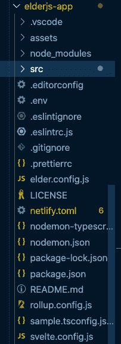

# 探索 Elder.js，一个专注于 SEO 的瘦框架博客

> 原文：<https://blog.logrocket.com/exploring-elder-js-svelte-framework/>

## 背景

欢迎来到 Jamstack 的建筑世界。Jamstack 架构最初表示 JavaScript、API 和标记，支持更快、更安全和可伸缩的 web。Jamstack 应用程序非常快，因为它们是预先呈现的，这意味着所有前端组件和资产都预先构建到高度优化的静态页面中。

通过这种设置，现在可以通过全球 CDN 为站点提供服务。Jamstack 应用还支持简洁的最小架构，消除了不必要的资源分配，因为整个前端与构建过程相隔离。这当然会带来许多好处，尤其是在基础设施和维护方面的成本节约。

Elder.js 是 Jamstack 站点的众多静态站点生成器之一，它为复杂的数据密集型网站提供了更好的解决方案，SEO 对这些网站尤为重要。从其网站来看，Elder.js 解决了构建高度复杂、面向 SEO 的网站的问题，这些网站的页面从 10 到 100K 不等。

## Elder.js 简介

Elder.js 建立在 Jamstack 技术之上，它的诞生是因为需要一个更可行的解决方案来构建复杂的、面向数据的、搜索优化的应用程序。该框架的创建者认为需要一种标准的方法来构建各种规模的静态站点，而不必担心所涉及的页面数量或数据量。

Elder.js 基于[svelite](https://blog.logrocket.com/truly-reactive-programming-with-svelte-3-0-321b49b75969/)模板。Svelte 是一个 JavaScript web 框架，采用了全新的方法来构建 ui；模板建立在 HTML 之上，带有一个数据层。反过来，Svelte 在构建/编译时将应用程序代码转换成 JavaScript。

根据作者的说法，Elder.js 的范围仅限于以 SEO 为主要优先级，为 Svelte 构建一个可插拔的静态站点生成器/服务器端渲染框架。Elder 充分利用了这一框架的众多优势，并提供了一些其他令人印象深刻的特性，包括:

1.  优化的可定制构建流程，可跨越多个 CPU 内核
2.  混合物中含有部分水合的细长模板。水合作用允许我们水合需要交互的客户机部分，允许减少有效负载，具有组件延迟加载、微小捆绑等优点。
3.  直观的数据层，可能有多个数据源
4.  优先支持安全部门改革和 SSG
5.  在整个页面生成过程中存在预构建的挂钩，允许在开发过程的每一步轻松定制页面

### 先决条件

在我们开始探索 Elder.js 之前，读者应该非常熟悉 Svelte 以及如何用这个 web 框架构建最小的应用程序。此外，虽然了解一点静态站点的构建或 Jamstack 的一般工作会有很大的帮助，但本标题涵盖了这些概念和想法，因此对读者来说不是绝对必要了解的。

## Elder.js 入门

为了开始使用 Elder.js，我们可以使用 [degit](https://github.com/Rich-Harris/degit#degit-straightforward-project-scaffolding) ，它允许通过制作 git 库的副本来快速搭建基于 Git 的项目。你可能想知道为什么我们不使用原生的`git clone`功能。嗯，degit 通过只下载最新的提交而不是整个 git 历史，只从 Git repo 中获取相关的部分。

### 安装程序

开始使用 Elder.js 最简单的方法是使用 degit 从 GitHub repo 中克隆模板(因为 Elder.js 需要一个特定的文件结构),如上所述。我们可以通过运行以下命令来实现:

```
npx degit Elderjs/template elderjs-app
```

运行上述命令的结果如下所示:

```
npx: installed 1 in 9.946s
> cloned Elderjs/template#master to elderjs-app
```

从上面的输出我们可以看到，该命令首先安装`npx`，然后从 GitHub 克隆 Elder.js 模板 master 分支。现在我们可以简单地导航到`elderjs-app`目录，使用`npm`或`yarn`安装依赖项，然后启动应用程序。文件夹结构应该如下所示:



为了启动 dev 服务器，我们可以运行`npm start`，它运行`npm run build:rollup && npm run dev:server`。请注意，当我们做出更改时,`npm run dev:rollup`会重建纤细的组件。

> **注意**:我们可以运行`npm run build`，它运行这个命令:`node ./src/cleanPublic.js && npm run build:rollup && npm run build:html`。这基本上清理了`public dir`并构建了用于服务的组件。有关更多细节，请查看模板的`package.json`文件的脚本部分。

### 探索 Elder.js 模板

现在我们来探索一下 Elder.js 模板。要查看模板运行情况，我们可以在运行`npm start`命令后在浏览器中导航到`localhost:3000`。要查看示例博客网站，我们可以导航到`[http://localhost:3000/how-to-build-a-blog-with-elderjs/](http://localhost:3000/how-to-build-a-blog-with-elderjs/)`。

现在让我们研究一下模板的博客部分，以了解它是如何工作的。首先，导航到`routes/blog`文件夹。在那里，我们将看到`routes.js`文件，其内容如下所示:

```
module.exports = {
  data: {},
  all: () => [],
  permalink: ({ request }) => `/${request.slug}/`,
};
```

正如我们在上面看到的，我们正在导出`data`、`all`和`permalink`函数。`data`函数将数据作为道具传递给瘦模板。`all`函数返回这条特定路线的所有可能的`request`对象的数组。

最后，`permalink`函数将从`all`函数返回的`request`对象转换成它们各自的相对 URL。这确实是奇迹发生的地方。稍后将在 Elder.js 路由部分讨论更多细节。

博客路径的`data`和`all`函数是由模板 GitHub 库中的`[/plugins/packages/markdown/index.js](https://github.com/Elderjs/plugins/tree/master/packages/markdown)`文件中定义的 Markdown 插件填充的。所以在我们的代码中，我们可以通过运行`npm install --save @elderjs/plugin-markdown`来使用插件。然而，在这种情况下没有必要这样做，因为插件是与模板捆绑在一起的。

为了理解插件是如何配置的，让我们看一下`root dir`中的`elder.config.js`文件。这是我们感兴趣的部分:

```
plugins: {
    '@elderjs/plugin-markdown': {
    routes: ['blog'],
},
```

从上面的配置中，我们可以看到我们正在利用 Markdown 插件来确定要控制的路由。在这种情况下，我们希望利用`blog`路线。该插件从指定的`route/blog`文件夹中读取并收集降价内容/文件，并自动将找到并解析的降价文件作为请求添加到`allRequests`钩子中。

插件使用`allRequests`钩子在 Elder.js 中注册处理过的 Markdown 文件和它们的 slug，这里我们的意思是`allRequests`钩子使用前面的 matter 或者 filename 作为 slug 将收集到的文件添加到`allRequests`数组中。

然而，在此之前，`[bootstrap](https://elderguide.com/tech/elderjs/#hook-bootstrap)`钩子将解析后的降价内容/数据添加到`data`函数中。这将作为`data`道具出现在`Blog.svelte`模板文件中。下面我们来探讨一下:

```
<script>
  export let data;
// destructure data prop
  const { html, frontmatter } = data;
</script>

<style>
</style>

<svelte:head>
  <title>{frontmatter.title}</title>
</svelte:head>

<a href="/">&LeftArrow; Home</a>
<div class="title">
  <h1>{frontmatter.title}</h1>
  {#if frontmatter.author}<small>By {frontmatter.author}</small>{/if}
</div>

{#if html}
  {@html html}
{:else}
  <h1>Oops!! Markdown not found!</h1>
{/if}
```

在上面的`Blog.svelte`文件中，`data`道具是从`elderjs-plugin-markdown`文件中填充的，就像我们之前讨论的那样。在下一行中，我们将把`data`对象析构为`html`和`frontmatter`对象，然后用它们来填充 UI。`if`语句检查是否有来自`data`道具的`html`对象，并渲染它；否则，将显示一个错误。

此外，我们可以访问位于`routes/home`文件夹中的父级`route dir`，即主页。在里面，我们会发现两个文件:`route.js`和`Home.svelte`。像往常一样，`route.js`文件包含了`all`、`permalink`和`data`函数，我们已经介绍过了。

> **注意**:`all()`查询返回一个对象，该对象表示在特定路线上生成特定页面所需的参数——在本例中是`home`路线。

查看`Home.svelte`文件的`script`部分，我们可以看到主页上所有组件的导入位置:

```
<script>
  import BlogTeaser from '../../components/BlogTeaser.svelte';
  export let data, helpers;
  // add permalinks to the hook list so we can link to the posts.
  const hooks = data.hookInterface.map((hook) => ({ ...hook, link: helpers.permalinks.hooks({ slug: hook.hook }) }));
</script>
```

具体来说，在第 2 行，我们可以看到从`'../../components/BlogTeaser.svelte`路径导入了`BlogTeaser`组件。像往常一样，我们将把`data`道具和`helpers`道具(`data`函数和所有钩子中可用的助手对象)从 route 文件传递到下一行的 homepage 文件。

此外，在`Home.svelte`组件上，我们从已经在`data` prop 中可用的已解析的 Markdown 文件中为每篇博客文章执行一个循环。我们将`blog`和`helpers`数据作为道具传递给导入的`BlogTeaser`组件进行渲染，如下图所示:

```
<div class="blog">
  <div class="entries">
    {#each data.markdown.blog as blog}
      <BlogTeaser {blog} {helpers} />
    {/each}
  </div>
</div>
```

最后，在模板中的`src/components`路径上，我们有了`BlogTeaser.svelte`组件，它现在可以访问作为道具从上面的`Home.svelte`组件传递来的`blog`和`helpers`。这是:

```
<script>
  export let blog;
  export let helpers;
</script>

<div class="entry">
  <a href={helpers.permalinks.blog({ slug: blog.slug })}>{blog.frontmatter.title}</a>
  <p>{blog.frontmatter.excerpt}</p>
</div>
```

从上面的`script`标签中我们可以看到，我们可以访问之前作为道具从主页传递过来的`blog`和`helpers`对象。在第 6 行，`helpers.permalinks.blog({ slug: blog.slug })}`是 Elder.js 默认助手之一，它是一个 permalink 解析器。这允许我们简单地传递一个请求对象并解析永久链接。总体结构如下所示:

```
helpers.permalink\[routeName\]({requestObject})
```

## Elder.js 与其他 SSG 相比的优势

*   大多数 SSG 都是为简单的网站/博客或全面的应用程序而构建的，而不是为非常大的数据密集型网站而构建的，这些网站的 SEO 特性令人印象深刻。
*   此外，对于其他 SSG，数据是从多个其他来源获取的，这可能导致难以维护的站不住脚的代码库。
*   在大多数其他 SSG 中，与客户端路由相关联的复杂性几乎是不可避免的，这可能导致较大的包大小。

### Elder.js 路由

Elder.js 中的路由方法——尽管与其他流行框架中基于参数的路由不同——提供了几个优点。这是因为我们可以完全控制我们想要的 URL 结构。此外，我们不必抓取网站的所有链接来了解需要生成哪些页面。

Elder.js 中的路由由位于`src/routes`目录中的两个文件组成。例如，当我们导航到模板中的`Hooks`文件夹时，我们会发现`Hooks.svelte`(一个用作模板的细长组件)和一个`route.js`文件(用于定义路线细节，如`permalink`、`all`和`data`功能)。

> **注意**:每条路线都定义了瘦模板，只在服务器上渲染。这是因为它们接收包含数据库凭证、env 变量等敏感属性。这可能包含我们不希望在 HTML 中出现的数据。

前面已经讨论过`permalink`、`all`和`data`函数，典型的`route.js`文件也是如此。这些函数的规范链接可以在 [Elder.js 文档](https://elderguide.com/tech/elderjs/#all-function-spec)中找到。

出于性能原因，我们必须包含查询数据库、API 或其他数据源所需的所有细节，并且不存储大数据。此外，如果我们打算获取、准备或处理数据，我们应该在`data`函数中处理，因为这将返回页面所需的所有数据。

此外，如果我们打算在多个路由中使用一些数据，我们可以通过在`bootstrap`钩子上填充`data`对象来共享这些数据。这是因为在页面生成过程的这个阶段定义的数据在所有路线上都可用。

### Elder.js 钩子

想自定义 Elder.js 应用中的核心页面生成流程？好吧，胜利的钩子！关于钩子有趣的事情是，对于大多数用例，它们可以作为插件捆绑和共享。

[根据作者](https://elderguide.com/tech/elderjs/#the-goal-of-elderjs-hooks)的说法，“Elder.js 的钩子实现的目标是，任何不能放入`route.js`文件中的更改都可以放入一个单独的`hooks.js`文件中，任何人都可以在其中找到任何隐藏的细节，从而允许用户完全控制 Elder.js 页面生成过程。"

Elder.js 钩子系统基于一个`hookInterface`。这个接口定义了每个钩子能做什么以及它们拥有的属性。

每个钩子定义了哪些`props`可用于钩子上注册的函数，以及哪些`props`是`mutable`或者可以被该函数改变。本质上，这定义了钩子接口实现的`contract`。

> **注意**:钩子出现在页面生成过程的每个主要步骤，从系统引导(即`bootstrap`钩子)到将 HTML 写入`public`文件夹(即`[requestComplete](https://elderguide.com/tech/elderjs/#hook-requestComplete)`钩子)。

值得注意的钩子包括`bootstrap`(在 Elder.js 自我引导后执行，用户可以运行任意函数)`[request](https://elderguide.com/tech/elderjs/#hook-request)`、`[requestComplete](https://elderguide.com/tech/elderjs/#hook-requestComplete)`、`[data](https://elderguide.com/tech/elderjs/#hook-data)`等等。关于可用钩子的完整概述，请参考`[hookInterface.ts](https://github.com/Elderjs/elderjs/blob/master/src/hookInterface/hookInterface.ts)`文件。在[文档](https://elderguide.com/tech/elderjs/#hook-lifecycle)中可以找到诸如在哪里以及如何组织钩子的细节，以及可用钩子的完整列表。

### Elder.js 插件

根据官方指南，插件是一组挂钩和/或路径，可用于向 Elder.js 站点添加额外功能——例如，将文件上传到 s3 bucket 的插件。在钩子调用之间，插件可以存储数据，因为在任何钩子或`init`函数中添加的数据将在整个生命周期中保持不变。

* * *

### 更多来自 LogRocket 的精彩文章:

* * *

> **注意**:要使用一个插件，必须在`elder.config.js`文件中注册，并且可以从 npm 包的入口点:`./node_modules/${pluginName}/`加载。

有关官方插件的列表，请查看文档的本节。另外，要编写自己的插件，可以克隆 [Elder.js 插件模板](https://github.com/Elderjs/plugin-template)。我们可以通过运行以下命令，利用 degit 在本地克隆它:

```
npx degit Elderjs/plugin-template elderjs-plugin
```

要查看一个示例插件的结构，你可以在这里查看。

> **注意**:`init()`函数是一个同步函数，处理插件初始化。它接收插件定义，包括 Elder.js 和插件配置。

## 结论

Jamstack 提供了一种开发、部署和支持 web 应用程序的新方法。本质上，这些站点是预先构建的，并且在提供服务之前进行了高度优化。它提供了一种不需要传统前端基础设施的新方法；相反，HTML 被预先呈现到静态文件中。

要快速开始构建优雅的、数据密集型的静态网站，并特别关注 SEO(从 10 到 100K 的页面), Elder.js 应该是您考虑的重点。要了解这个 web 框架的更多信息，请看一下 Github 上的源代码。

要真正理解 Elder.js 应用程序的整个数据流，请查看文档的这一部分。这些文档还将有助于学习这里没有涉及的其他主题，包括通用规范和配置要求、部分水合、短代码等。

## 您是否添加了新的 JS 库来提高性能或构建新特性？如果他们反其道而行之呢？

毫无疑问，前端变得越来越复杂。当您向应用程序添加新的 JavaScript 库和其他依赖项时，您将需要更多的可见性，以确保您的用户不会遇到未知的问题。

LogRocket 是一个前端应用程序监控解决方案，可以让您回放 JavaScript 错误，就像它们发生在您自己的浏览器中一样，这样您就可以更有效地对错误做出反应。

[](https://lp.logrocket.com/blg/javascript-signup)[https://logrocket.com/signup/](https://lp.logrocket.com/blg/javascript-signup)

[LogRocket](https://lp.logrocket.com/blg/javascript-signup) 可以与任何应用程序完美配合，不管是什么框架，并且有插件可以记录来自 Redux、Vuex 和@ngrx/store 的额外上下文。您可以汇总并报告问题发生时应用程序的状态，而不是猜测问题发生的原因。LogRocket 还可以监控应用的性能，报告客户端 CPU 负载、客户端内存使用等指标。

自信地构建— [开始免费监控](https://lp.logrocket.com/blg/javascript-signup)。