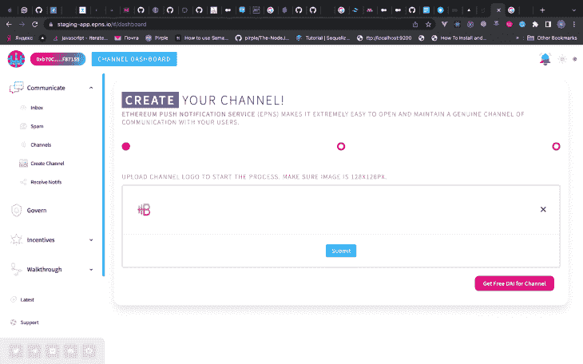
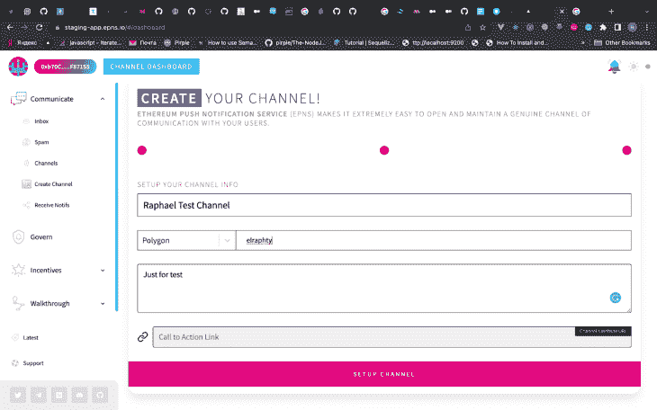
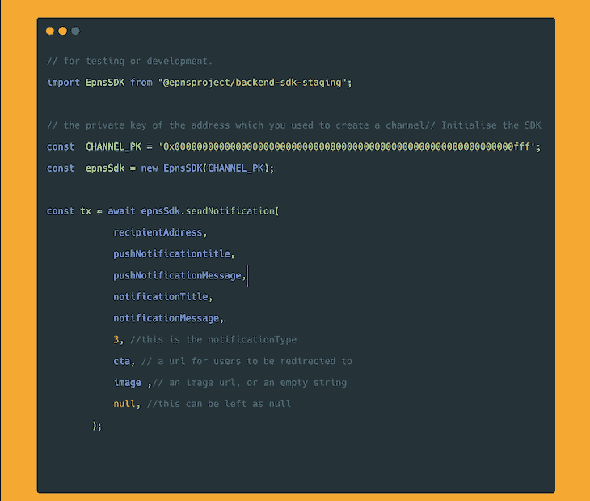
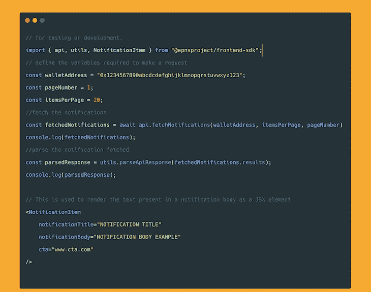
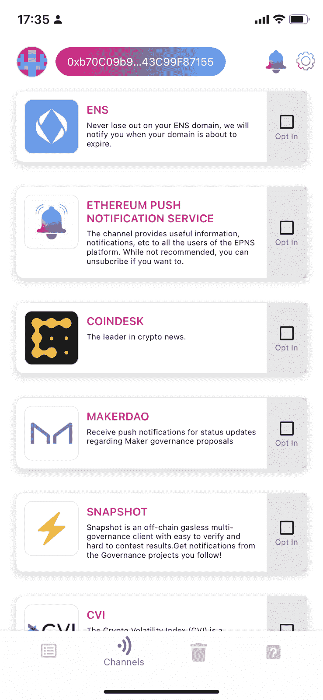
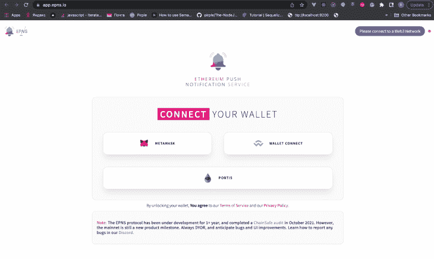

# 探索 EPNS，一个 DApp 友好的通知系统

> 原文：<https://blog.logrocket.com/exploring-epns-dapp-notification-system/>

分散式应用程序(DApps)正变得日益流行，许多处理交易的智能合同被部署到各种需要通知系统来跟踪区块链活动的区块链网络。

推送通知显然已经存在一段时间了:简单地说，它们提供了从服务器接收消息的过程，该过程在客户端应用程序上触发一个弹出窗口，该弹出窗口可以针对 web、移动和桌面平台具有不同的形式。

在以太坊推送通知服务(EPNS)之前，没有真正的方法在智能合约和 DApps 上实现推送通知功能。

虽然像 Metamask 这样的钱包会通知用户账户上的每一笔交易，但智能合同通知在以前是不可能的。但是，在本帖中，我们将介绍以下内容，以了解 EPNS 如何在 DApps 中工作，包括:

## 什么是 EPNS？

EPNS 是一个分散的通知协议，无缝地给予以太坊钱包地址(或用户)访问权，以接收链上或链下活动的通知。

借助 EPNS DApps，智能合约和后端应用可以以平台无关的方式向用户发送通知。

EPNS 通知之所以成为可能，是因为开放的通信网络，也称为推送节点，它与钱包地址相关联，使加密钱包、DApp 前端和其他服务能够向用户显示通知。

EPNS 还有一个名为$PUSH 的令牌，使 EPNS 用户能够基于直接或间接的操作获得激励。

## EPNS 功能

### 以用户为中心的通知和选择加入通知

EPNS 协议允许用户直接控制他们从哪些服务接收通知，并对服务施加严格的规则，包括对用户的垃圾邮件保护。

### 对用户的激励通知

想要向用户发送通知的服务必须使用 DAI。在此过程中获得的利息将分发给选择接收通知的订阅者。EPNS 通过使用奖励来激励发送者和接收者。

### 平台不可知

EPNS 协议还能够检索每个通知的信息，从而连续地实现通用通知。它向任何加密钱包、移动应用、网络浏览器、应用或其他集成该协议的平台发送通知。

### 垃圾邮件评分和限制

频道包含范围从`0`到`1`的垃圾邮件分数。`0`表示该频道得分较高，`1`表示该频道非常不健康。

### 管理

协议治理旨在激励对 EPNS 协议的持续采用，这是通过为所有相关用户提供激励来实现的。

## 推送节点和$推送令牌

EPNS 是一个协议，它有自己的节点(推送节点),由$PUSH 令牌管理。推送节点监听 EPNS 协议智能合约中的事件，并发送由来自相应接收者的事件触发的通知。

### 什么是$推送代币？

$PUSH 令牌用于 EPNS 生态系统中的治理。EPNS 协议基于对 EPNS 协议的特定动作为用户提供激励，包括直接和间接订阅频道，并且用户因参与 EPNS 协议而被给予这些激励。

当令牌激励在协议中给予用户时，用户可以在任何时候要求它们。这些代币奖励是使用[岱(AAVE 计息岱)](https://aave.com/aTokens)产生的。然后，阿岱在提款时会转换成$ PUSH tokens。

一个$PUSH 令牌的总供应量为 100，000，000，并且只有 100，000，000 会被创建。撰写本文时，[$推送代币的价值为$1.13](https://coinmarketcap.com/currencies/epns/) ，其流通供应量为$推送代币总量的 15，287，926(约 15%)。

## 为什么我们需要 Web3 推送通知？

推送通知是 Web2 生态系统中不可或缺的功能，并成为向用户发送信息和留住用户的重要策略。但是，Web2 通知完全由应用程序自己创建和规定。

用户很难选择他们希望接收哪种通知；他们可以关闭或打开应用程序通知。

另一方面，像 EPN 这样的分散式通知为 Web3 生态系统提供了强大和改进的通知生态系统的好处，而没有 Web2 通知的集中缺点。

要接收 Web2 通知，用户必须安装他们希望接收通知的应用程序，或者访问他们的网站并接受通知提示。

有了 EPNS，用户可以从 Coindesk 等平台接收通知，而无需安装应用程序；他们所做的就是选择他们的频道，给用户更多的权力来决定他们选择接收什么通知。

与 Twitter、Discord 或 email 等平台相比，应用程序需要更好的方式以实时和事件启动的方式与用户沟通。用户也应该有一个更简单的过程来控制他们收到的通知，并且应该受益于 [Web3 的开源特性](https://blog.logrocket.com/best-practices-web3-providers/)。

## 受益于 EPN 的分散平台

Web3 生态系统中的几乎所有应用都可以受益于推送通知。这些类型的 DApps 包括:

*   [分散融资(DeFi)](https://blog.logrocket.com/top-5-decentralized-app-development-frameworks/#defi)
*   分散交易所
*   以太坊名称服务(ENS)/消费者应用
*   不可替代代币(NFT)和游戏

### 挑战

在 DeFi 中使用 EPN 时，通知对于出借协议用户可能很有用。有了这个，用户可以设置通知，当他们下注的硬币将清算时得到通知。他们现在可以接收无缝通知，而不是定期手动检查。

### 德克斯

DEX 用户可以设置通知，在交易完成时通知他们，而不是不断查看。EPNS 使他们能够无缝地获得通知；例如，用户可以创建天然气价格何时有利的通知，以帮助他们决定何时交易。

### 实体

像以太坊名称服务(ENS)这样的应用程序可以在用户的订阅即将到期时通知用户，而不是用户定期检查以提醒自己到期日期。

### NFTs 和游戏

市场上的 NFTs 交易或游戏中的商品可以连接到 EPN，以通知用户某些商品何时开始销售或拍卖何时开始。

NFT 艺术家还可以在他们的 NFTs 被出价或出价超过时收到通知，并为他们的 NFTs 转售创建通知。

## EPNS 协议解决方案的一部分

EPNS 解决方案由四个模块组成:服务、频道、用户和订户。服务是 DApps、钱包所有者或任何想要发送通知的 Web3 服务的地址，而信道是在 EPNS 协议上激活自己并可以创建通知的服务。

用户是希望接收有关 DApp、钱包或智能合同的通知的 Web3 参与者，订阅者是选择从任何特定渠道接收通知并可以选择发送特定通知的特定渠道的用户。

## 如何将 EPN 集成到 DApps 中

要将 EPNS 集成到您的 DApps 中，您必须创建一个 EPNS 频道。你可以在 EPNS 的 [DApp 主网网站](http://app.epns.io/)或[分期网站](http://staging-app.epns.io/)上完成。访问网站后，按照以下步骤创建频道。

首先，系统会提示您连接加密钱包(Metamask、Ledger 或 Portis，因为 EPNS staging DApps 仅支持 Kovan 测试网络)。

连接钱包后，点击**创建您的频道**并上传频道徽标(徽标的尺寸必须为 128 像素乘 128 像素)。

要激活该渠道，您需要[下注戴代币](https://blog.logrocket.com/develop-solidity-smart-contracts-hardhat/)以向 AAVE 的生息赌注池捐款。

50 DAI 是最低的股份费，DAI 越多，渠道产生的利息就越多。这反过来又激励了订阅者(在筹备阶段，你可以获得 50 DAI 的测试费)。

在标记了 DAI 之后，你可以给你的通道一个名字和描述。然后点击**设置频道**将其激活。

成功创建通道后，您可以将其集成到您的 DApp 后端或前端应用程序中。

### 将 EPN 集成到 Node.js 后端

要在您的后端集成 EPNS，您必须首先安装 EPNS 后端生产或暂存 SDK: `npm install @epnsproject/backend-sdk`用于 mainnet 或`npm install @epnsproject/backend-sdk-staging`用于暂存。

接下来，复制用于创建 EPNS 频道的地址的私钥；[你可以在这个 GitHub gist 里面找到代码](https://gist.github.com/elraphty/185250443a36d0495839d782364bef3b):

### 将 EPNS 集成到 React 前端

要在 React 前端集成 EPNS，您必须安装 EPNS 前端生产或登台 SDK，其中`npm install @epnsproject/backend-sdk`用于生产，而`npm install @epnsproject/backend-sdk-staging`用于测试或开发。

[你可以在这个 GitHub gist](https://gist.github.com/elraphty/5c1e25200d4a55b53600cd1b8ab392d2) 中找到以下代码:

### 在前端应用程序上订阅 EPNS 频道

用户还可以使用以下代码从前端应用[订阅 EPNS 频道:](https://gist.github.com/elraphty/a2fa428876fa981693ecadc1cbad3d9d)

## 如何下载 EPN 和选择加入频道

你也可以从谷歌 Playstore 或苹果 Appstore 下载手机上的应用程序来使用 EPNS。

您也可以使用 EPNS 桌面和网络应用程序，或者在您的网络浏览器上下载 EPNS web 扩展，[然后连接您的钱包](https://app.epns.io/)，并根据您希望接收的通知选择不同的渠道。

## 结论

推送通知对于用户来说仍然是一个受欢迎的应用程序功能，但通过 EPNS，Web3 的这一不可或缺的功能为用户提供了对通知设置、他们希望接收的通知以及参与 EPNS 协议的激励的更多控制。

EPNS 改进了当前的 Web2 推送通知协议，Web3 用户将极大地受益于该解决方案。我希望每个 Web3 用户都使用 EPN 进行无缝通知。

## 加入像 Bitso 和 Coinsquare 这样的组织，他们使用 LogRocket 主动监控他们的 Web3 应用

影响用户在您的应用中激活和交易的能力的客户端问题会极大地影响您的底线。如果您对监控 UX 问题、自动显示 JavaScript 错误、跟踪缓慢的网络请求和组件加载时间感兴趣，

[try LogRocket](https://lp.logrocket.com/blg/web3-signup)

.

[https://logrocket.com/signup/](https://lp.logrocket.com/blg/web3-signup)

LogRocket 就像是网络和移动应用的 DVR，记录你的网络应用或网站上发生的一切。您可以汇总和报告关键的前端性能指标，重放用户会话和应用程序状态，记录网络请求，并自动显示所有错误，而不是猜测问题发生的原因。

现代化您调试 web 和移动应用的方式— [开始免费监控](https://lp.logrocket.com/blg/web3-signup)。