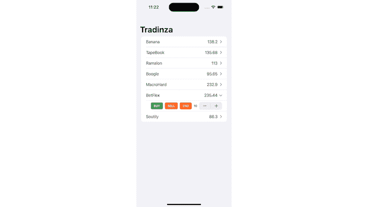
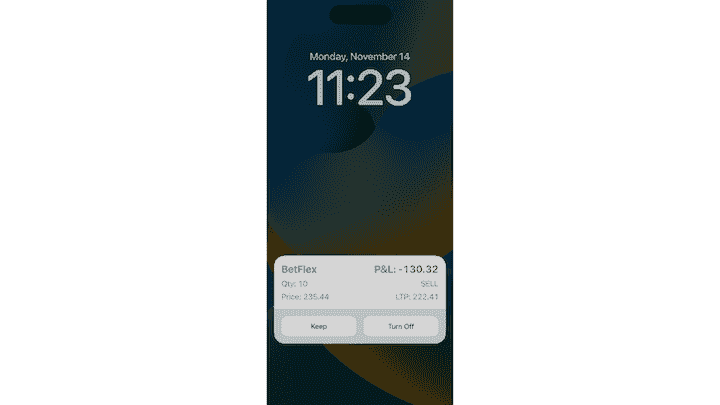
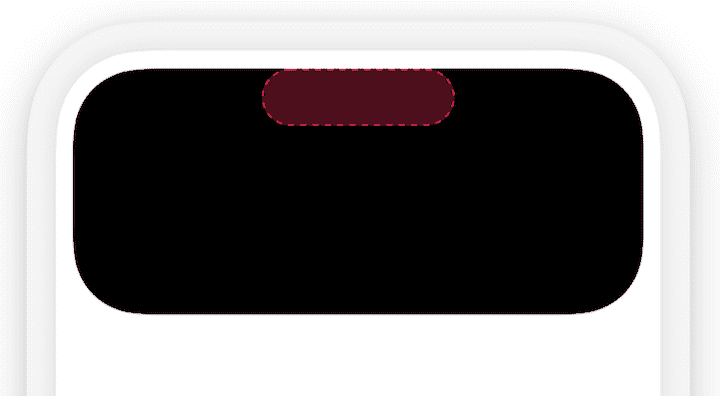
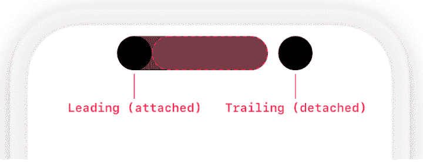
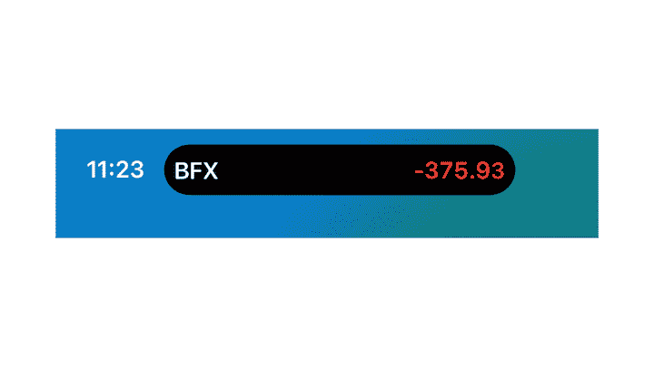
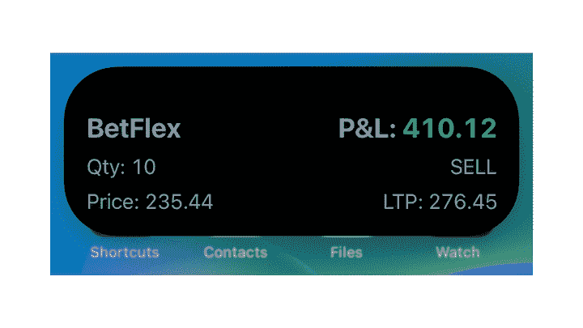

# 探索 iOS 实时活动 API

> 原文：<https://blog.logrocket.com/exploring-ios-live-activities-api/>

在 iOS 16.1 中，苹果引入了新的实时活动功能，互动通知在锁定屏幕上提供实时更新。对于 iPhone 14 Pro 和 Pro Max，该功能还扩展到了动态岛(Dynamic Island)，这是一个位于屏幕顶部的药丸形状的切口，可以显示提醒和通知，并根据内容动态改变形状和大小。

想象一下，在不连续打开应用程序的情况下，在你的锁定屏幕上跟踪你的食物交付进度，你的锻炼，甚至你股票的当前位置。多酷多方便啊！

在本文中，我们将探索实时活动的优势以及用于显示和处理实时活动的 ActivityKit 框架。在本文的演示部分，我们将展示如何向一个简单的股票跟踪应用程序添加实时活动，以在锁定屏幕和动态岛中显示实时信息。

好了，让我们来看看如何在你的应用程序中加入现场活动！

*向前跳转:*

## 现场活动的优势

主屏窗口部件的最大问题之一是它们不显示实际的实时更新。最接近的是有一分钟延迟的更新，这有时可以被系统包含。

但是，通过实时活动，您可以在锁定屏幕上显示实时更新。这对于需要显示时间关键信息的应用程序很有帮助，如加密应用程序中的正在进行的交易，食品交付应用程序中的进度跟踪，或真人游戏的比分。

使用 iPhone 14 Pro 和 Pro Max，您可以使用实时活动在主屏幕的动态岛部分显示实时更新。点击动态岛中的实时活动将启动您的应用程序，同时按住动态岛将显示一个包含更多描述性内容的扩展视图。

当 WidgetKit 框架首次引入时，它提供了两种类型的配置:`StaticConfiguration`和`IntentConfiguration`。

对于实时活动，WidgetKit 现在提供了第三种类型的配置，`ActivityConfiguration`:

```
struct ActivityConfiguration<Attributes>: WidgetConfiguration where Attributes: ActivityAttributes

```

作为一个例子，下面是如何创建一个`ActivityConfiguration`，为它提供上下文，并将其传递给一个活动的视图:

```
struct TradinzaLiveActivity: Widget {
  var body: some WidgetConfiguration {
    ActivityConfiguration(for: StockTradingAttributes.self) { context in
      CurrentTradeView(context: context)
        .padding()
    }
  }
}

```

接下来，让我们探索 ActivityKit，看看如何维护一个实时活动的生命周期。

## 活动工具包

Apple 已经提供了 ActivityKit 框架，使开发人员能够创建实时活动。这个框架只适用于 iOS 16.1+的 iPhones，允许你在锁屏或动态岛中将应用程序的实时更新作为实时活动进行分享。

为了创建实时活动的 UI 和表示层，您将分别使用 SwiftUI 和 WidgetKit。ActivityKit 将用于开始、更新和结束活动。

## 演示:现场活动示例项目

在本文中，我们将使用一个示例应用程序 Tradinza，它支持在一个名为 Bow 的虚拟股票交易所买卖股票。Tradinza 有许多上市股票可以在当天买卖:



为了跟踪交易中当前的实时头寸，我们将演示如何将实时活动 *添加到锁屏和动态岛中。*

 *Tradinza 应用程序包含一个用于定义股票的`Stock`结构，并有一些样本股票:

```
struct Stock: Identifiable, Codable, Equatable, Hashable {
  var id = UUID()
  var name: String
  var price: Double
  var date = Date()
}

extension Stock {
  var maximumPrice: Double {
    price * 1.2
  }

  var minimumPrice: Double {
    price * 0.8
  }
}

extension Stock {
  static let stocks = [
    Stock(name: "Banana", price: 138.20),
    Stock(name: "TapeBook", price: 135.68),
    Stock(name: "Ramalon", price: 113.00),
    Stock(name: "Boogle", price: 95.65),
    Stock(name: "MacroHard", price: 232.90),
    Stock(name: "BetFlex", price: 235.44),
    Stock(name: "Soutily", price: 86.30)
  ]
}

```

### 创建`Attributes`

作为 ActivityKit 框架的一部分，Apple 提供了一个`Activity`对象来管理开始、更新和结束实时活动的功能。`Activity`对象负责帮助实时活动的生命周期:

```
class Activity<Attributes> where Attributes: ActivityAttributes

```

使用`ActivityAttributes`协议描述实时活动的内容。该协议有一个必需的关联类型`ContentState`，必须在符合该协议的同时实现。`ContentState`类型描述了实时活动的动态内容。

这些属性有两个特性。一个属性保持静态，在整个实时活动中不会改变。另一个属性是动态的，可以在整个实时活动中不断变化。

在 Tradinza 应用程序中，当前交易具有静态属性，例如股票及其数量(为了示例的简单性，我们将保持数量不变)。它还具有动态内容，例如当前价格、交易状态(即`ongoing`或`ended`)以及交易的最终利润或损失:

```
struct StockTradingAttributes: ActivityAttributes {
  enum TradeState: Codable {
    case ongoing
    case ended
  }

  public struct ContentState: Codable, Hashable {
    var position: Double
    var currentPrice: Double
    var tradeState: TradeState
  }

  var stock: Stock
  var quantity: Int
}

```

### 开始一个`Activity`

要启动一个活动，首先要通过提供初始状态和属性来请求它。您可以提供从远程推送通知或直接从应用程序启动的令牌:

```
static func request(
    attributes: Attributes,
    contentState: Activity<Attributes>.ContentState,
    pushType: PushType? = nil
) throws -> Activity<Attributes>

```

对于股票交易应用程序，我们将提供诸如购买股票的`Stock`结构和`quantity`等属性。股票的`currentPrice`和用户的`position`都是动态的，在整个实时活动中可能会发生变化；

```
Button("Buy") {
  let currentPrice: Double = .random(in: stock.minimumPrice..<stock.maximumPrice)
  let position = (currentPrice - stock.price) * Double(quantity)

  let state = StockTradingAttributes.ContentState(position: position, currentPrice: currentPrice)
  let attributes = StockTradingAttributes(stock: stock, quantity: quantity)

  do {
    activity = try Activity.request(attributes: attributes, contentState: state)
  } catch (let error) {
    print("Error requesting stock trade Live Activity: \(error.localizedDescription).")
  }
}

```

这是`Widget`代码查找`ActivityConfiguration`的方式:

```
struct TradinzaLiveActivity: Widget {
  var body: some WidgetConfiguration {
    ActivityConfiguration(for: StockTradingAttributes.self) { context in
      CurrentTradeView(context: context)
        .padding()
    } dynamicIsland: { context in
      ///
    }
  }
}

```

当您启动一个`Activity`时，它使用您在`ActivityConfiguration`中提供的`View`。在 Tradinza 应用程序的例子中，您将实时活动视图放在`CurrentTradeView`中:

```
struct CurrentTradeView: View {
  var context: ActivityViewContext

  var body: some View {
    HStack {
      VStack(alignment: .leading, spacing: 8) {
        Text(context.attributes.stock.name).bold()
          .font(.title2)

        Text("Qty: ") + Text(context.attributes.quantity, format: .number).monospacedDigit()

        Text("Price: ") + Text(context.attributes.stock.price, format: .number).monospacedDigit()
      }

      Spacer()

      VStack(alignment: .trailing, spacing: 8) {
        Text("P&L: ").bold()
          .font(.title2) +
        CurrentTradePAndLView(context: context, font: .title2).body

        Text("SELL")

        Text("LTP: ") + Text(String(format: "%.2f", context.state.currentPrice)).monospacedDigit()
      }
    }
    .foregroundColor(.gray)
    .activityBackgroundTint(Color.white)
    .activitySystemActionForegroundColor(Color.black)
  }
}

```

开始活动并在设备上运行后，您就创建了您的第一个实时活动！


### 更新一个`Activity`

您可以使用更新方法更新`Activity`:

```
func update(using contentState: Activity<Attributes>.ContentState) async

```

您还可以通过关于实时活动的更新内容的通知来提醒用户。

```
func update(
    using contentState: Activity<Attributes>.ContentState,
    alertConfiguration: AlertConfiguration? = nil
) async

```

股票应用程序每秒都会更新来自证券交易所的新数据。要用最新的价格和位置更新实时活动，请使用`Activity.update(using:)`方法:

```
let currentPrice: Double = .random(in: stock.minimumPrice..<stock.maximumPrice)
let position = (currentPrice - stock.price) * Double(quantity)

let priceStatus = StockTradingAttributes.ContentState(position: position, currentPrice: currentPrice)

Task {
  do {
    try await activity.update(using: priceStatus)
  } catch(let error) {
    print("Error updating Live Activity: \(error.localizedDescription)")
  }
}

```

### 结束一个`Activity`

要结束实时活动，请使用以下方法:

```
func end(
    using contentState: Activity<Attributes>.ContentState? = nil,
    dismissalPolicy: ActivityUIDismissalPolicy = .default
) async

```

在示例 Tradinza 应用程序中，当实时活动结束时，它将显示最终交易价格和用户的`position`(即盈利或亏损):

```
func endTrade(for stock: Stock) async {
  let contentState = StockTradingAttributes.ContentState(position: position, currentPrice: currentPrice, tradeState: .ended)

  await activity?.end(using: contentState, dismissalPolicy: .default)
}

```

`ContentState`显示最终位置和当前价格，因为实时活动保持可见，直到用户手动删除它。如果您想让系统自动删除实时活动，请将`.immediate`传递给`dismissalPolicy`参数。

根据状态，您还可以为结束状态创建自定义视图。

## 在动态岛中实施现场活动

要将实时活动添加到动态岛，您需要做的就是将参数`dynamicIsland`添加到`ActivityConfiguration`中，并提供相关的视图。

有四个视图选项(所有示例图像均来自 [Apple Developer Live 活动文档](https://developer.apple.com/design/human-interface-guidelines/components/system-experiences/live-activities/)):

1.  **展开视图**:按住动态岛时，显示详细视图；将您的观点放在这里；它可以是前导、中心、尾随或底部
    
2.  **紧凑前导视图**:动态岛内容显示在药丸形状的左侧
3.  **紧凑拖尾视图**:动态岛内容显示在药丸形状右侧
    
4.  **最小视图**:当另一个 app 的内容正在动态岛
    中显示时，显示该视图

要为 Tradinza 应用程序使用动态岛，您需要为扩展视图显示相同的实时活动视图。对于紧凑的前导部分，您需要提供当前交易股票的符号。对于紧凑的尾部，您需要提供当前位置(即，利润或损失)。对于最小视图，您只需提供当前的位置编号。

以下是代码供您参考:

```
struct TradinzaLiveActivity: Widget {
  var body: some WidgetConfiguration {
    ActivityConfiguration(for: StockTradingAttributes.self) { context in
      CurrentTradeView(context: context)
        .padding()
    } dynamicIsland: { context in
      DynamicIsland {
        DynamicIslandExpandedRegion(.bottom) {
          CurrentTradeView(context: context)
        }
      } compactLeading: {
        Text(context.attributes.stock.symbol).bold()
          .foregroundColor(.white)
      } compactTrailing: {
        CurrentTradePAndLView(context: context, font: .body)
      } minimal: {
        CurrentTradePAndLView(context: context, font: .body)
      }
    }
  }
}

```

在 iPhone 14 Pro 或 14 Pro Max 上运行动态岛，我们会在屏幕顶部看到以下视图:



当您按住动态岛时，会打开一个详细视图，您可以在其中显示有关当前活动的更多详细信息:



## 生产准备就绪

截至本文撰写之时，iOS 16.1 正式版已经面向开发者和用户发布。然而，值得注意的是，iOS 开发人员仍在探索 ActivityKit 框架，并通过动态岛文档进行工作。目前，还没有一个大型社区可以回答与 Live Activities API 相关的所有问题和疑问。因此，根据您的开发历程，您将 Live Activities 应用程序发布到 App Store 可能会面临一些延迟或困难。

## 有效性

虽然实时活动和动态岛是可以在应用中实现的令人兴奋的功能，但遗憾的是，它们仅适用于 iOS 16.1+。

截至本文撰写之时，iOS 16.1 正式版已经发布给开发者，您可以将您的带有直播活动的应用提交到 App Store。

## 结论

Live Activities 是一个很好的解决方案，可以在不解锁 iPhone 的情况下将实时更新整合到您的 iOS 应用程序中。如果你的应用程序需要用户即时更新，比如送餐或拼车更新，那么你应该在你的应用程序中利用这个功能。

你可以在 [GitHub](https://github.com/rudrankriyam/Tradinza) 上找到这篇博文中展示的最终示例项目。

***注意，*** *截至本文写作和 iOS 16.1 发布时，你只能在锁屏上与 Apple apps 进行直播活动的互动，就像 Apple Music app 一样。苹果没有第三方 API 来实现现场活动的交互性。您可以在直播活动中添加深层链接 URL 来打开您的应用程序，但用户无法在锁屏屏幕上与直播活动进行互动*

我希望这篇文章能够帮助你开始在你的 iOS 应用程序中添加实时活动！

## 使用 [LogRocket](https://lp.logrocket.com/blg/signup) 消除传统错误报告的干扰

[](https://lp.logrocket.com/blg/signup)

[LogRocket](https://lp.logrocket.com/blg/signup) 是一个数字体验分析解决方案，它可以保护您免受数百个假阳性错误警报的影响，只针对几个真正重要的项目。LogRocket 会告诉您应用程序中实际影响用户的最具影响力的 bug 和 UX 问题。

然后，使用具有深层技术遥测的会话重放来确切地查看用户看到了什么以及是什么导致了问题，就像你在他们身后看一样。

LogRocket 自动聚合客户端错误、JS 异常、前端性能指标和用户交互。然后 LogRocket 使用机器学习来告诉你哪些问题正在影响大多数用户，并提供你需要修复它的上下文。

关注重要的 bug—[今天就试试 LogRocket】。](https://lp.logrocket.com/blg/signup-issue-free)*