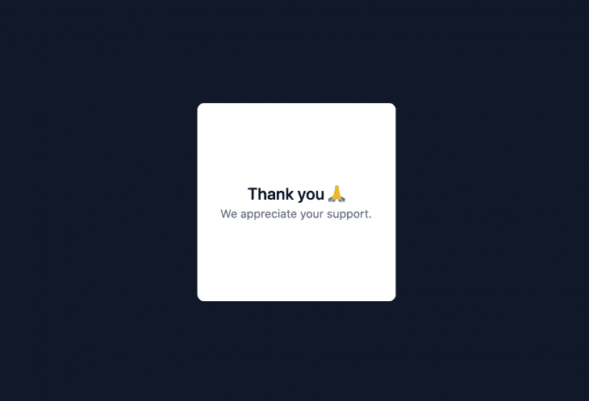
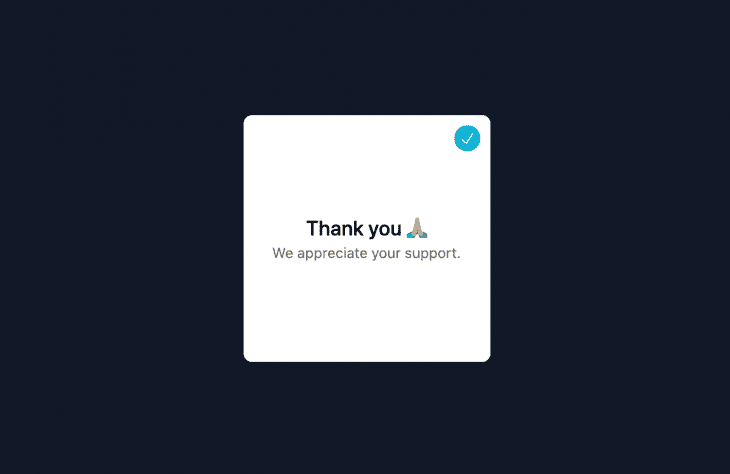
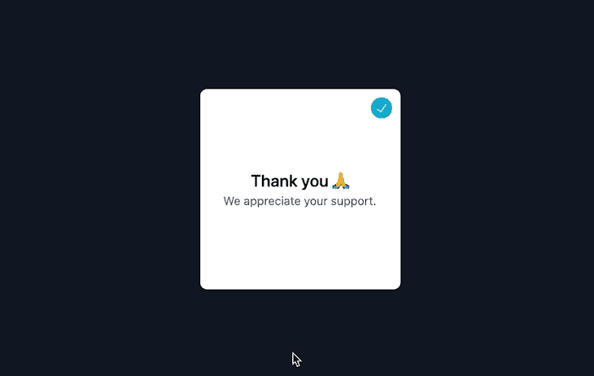
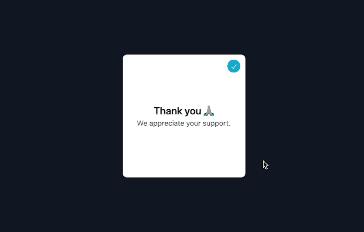
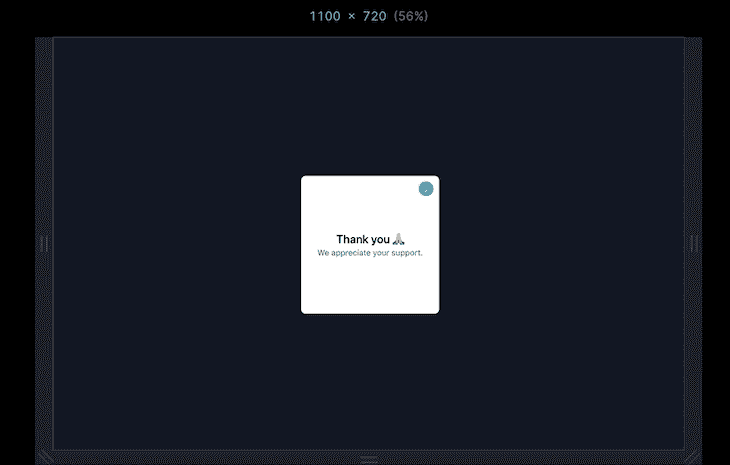
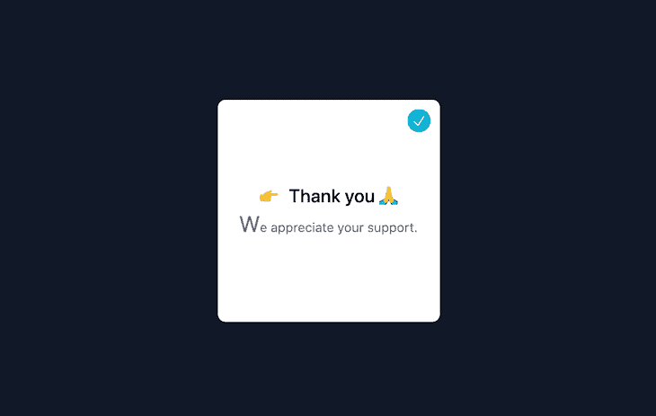
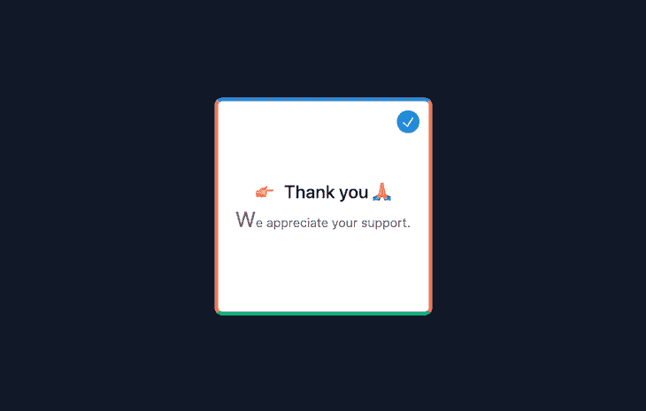

# 在顺风 CSS 中探索 JIT 模式

> 原文：<https://blog.logrocket.com/exploring-jit-mode-tailwind-css/>

Tailwind CSS 是一个固执己见的 CSS 实用程序类的集合，旨在使您作为开发人员的生活更加轻松。随着新的实时(JIT)编译器的发布， [Tailwind 变得更加高效](https://blog.logrocket.com/10-tailwind-css-tips-to-boost-your-productivity/)。

在本指南中，我们将深入了解 Tailwind 的新 JIT 模式，为什么应该使用它，实用的新用例，缺陷，以及如何安装它。让我们开始吧。

## 什么是 JIT 模式？

从 Tailwind CSS 版开始，新的 Tailwind JIT 编译器按需生成模板，而不是在最初的构建阶段就预先创建好一切。乍一看，这可能听起来不太有趣，但实际上它对你的日常前端工作有着重要的影响。

## 为什么我应该使用 JIT 模式？

### 不需要自定义 CSS

因为现在样式是按需生成的，所以您可以为几乎所有的 Tailwind 类创建任意值。这允许您使用带有自定义值的顺风，即使您的设计系统不支持它。

我们都遇到过这样的情况，我们需要一些超具体的值，并且不得不选择创建一个感觉不自然的类或内联样式。

### 超快的构建时间

[根据 Tailwind 的说法，](https://tailwindcss.com/docs/just-in-time-mode)使用 CLI 编译最初需要大约 3-8 秒，对于 Webpack 应用程序则需要 30-45 秒(Webpack 需要处理巨大的 CSS 文件)。有了新的 JIT 编译器，即使是最大的项目也能在 800 毫秒内编译完成，不管你用什么工具。

### 所有变体都可以开箱即用

出于文件大小的考虑，像`active`或`disabled`这样的类通常在默认情况下是不启用的。有了 JIT，你再也不用配置你的变体了。默认情况下，每个变体都是启用的。

### 暂存样式与生产样式相同

因为一切都是按需生成的，所以技术上不需要清除未使用的样式以用于生产。通过这种方式，您可以不必担心生产中未清理的类，也不必担心破坏您精心制作的设计。

## 我现在能做以前不能做的事情吗？

现在让我们探索一些令人兴奋的新东西，你可以用 JIT 编译器做。对于这个例子，我们将构建一个简单的模态屏幕，并逐步应用新的 JIT 特性。

这是我们模态的基本顺风代码:

```
<div class="flex justify-center items-center w-screen h-screen bg-gray-900">
  <div class="w-60 h-60 bg-white relative rounded-lg flex flex-col justify-center items-center">
      <div class="font-medium text-xl">Thank you 🙏</div>
      <div class="text-sm text-gray-500">We appreciate your support.</div>
  </div>
</div>

```



首先，给我们的父 div `h-screen`和`w-screen`组件，以使我们的模型居中。接下来，用`flex`将父 div 和子 div 居中，并应用一些基本的文本样式，使其看起来更有吸引力。

现在，让我们看看如何使用任意值来解决一个非常常见和恼人的预 JIT 问题。

### 任意值

让我们给我们的模式添加一个“关闭”按钮。为了实现这一点，我们将创建一个 div，给它一个`rounded-full`组件使它成为一个圆，并插入一个来源于 [icons8](https://icons8.com/) 的复选标记图标。

接下来，我们想把“关闭”按钮放在右上角。有趣的地方就在这里:Tailwind 带有一组预定义的值，例如`w-2`转换为 0.5 雷姆(8px)或`w-3`转换为 0.75 雷姆(12px)。但是，如果我们希望我们的设计是像素完美，需要 10px 的宽度呢？

以前，我们要么定义一个新的变量，使用内联样式，要么创建一个自定义的 CSS 类。这两种选择都不完美。

幸运的是，对于这些情况，Tailwind 的 JIT 允许我们使用带有括号`[arbritary_value]`语法的任意值:

```
<div class="flex justify-center items-center w-screen h-screen bg-gray-900">
  <div class="w-60 h-60 bg-white relative rounded-lg flex flex-col justify-center items-center">
      <div class="absolute flex justify-center items-center rounded-full top-[10px] right-[10px] w-[25px] h-[25px] p-[5px] bg-[#07B5D3]">
        
      </div>
      <div class="font-medium text-xl">Thank you 🙏</div>
      <div class="text-sm text-gray-500">We appreciate your support.</div>
  </div>
</div>

```



正如你所看到的，我们用任意值做了大量的工作，以我们想要的方式来设计我们的按钮:`top-[10px] right-[10px] w-[25px] h-[25px] p-[5px] bg-[#07B5D3]`。

如果您认为过度使用任意值会很快在我们的顺风代码中造成混乱，那么您是绝对正确的！然而，如果你小心地使用它，它会非常强大，使你的开发时间更有效率。

任意值的另一个非常有用的用例是自定义渐变和网格布局。

### 默认情况下，启用所有变体

因为样式是动态生成的，所以没有必要为每个核心插件指定可用的变体。这意味着我们现在可以使用变体，而无需事先在我们的`tailwind.config.js`中定义它们。

这是启用预 JIT 所需的代码:

```
// tailwind.config.js
module.exports = {
  mode: 'jit',
  variants: {
    extend: {
      backgroundColor: ['group-hover']
    }
  },
  purge: [
    // ...
  ],
  // ...
}

```

在这个小例子中，我们将`group`类放在父 div 上，将`group-hover`放在关闭按钮上。当我们将鼠标悬停在卡片上时，按钮的背景将变为绿色，其大小将缩放至 110 %:

```
<div class="flex justify-center items-center w-screen h-screen bg-gray-900">
  <div class="w-60 h-60 group bg-white relative rounded-lg flex flex-col justify-center items-center">
    <div class="absolute transform transition group-hover:bg-green-300 group-hover:scale-110 flex justify-center items-center rounded-full cursor-pointer top-[10px] right-[10px] w-[25px] h-[25px] p-[5px] bg-[#07B5D3]">
      
    </div>
    <div class="font-medium text-xl">Thank you 🙏</div>
    <div class="text-sm text-gray-500">We appreciate your support.</div>
  </div>
</div>

```



除了根据元素的父状态设计元素样式的`group-*`变体之外，我们现在可以使用新的`peer-*`变体根据元素以前的兄弟状态设计元素样式。

在下面的示例中，您可以看到当我们将鼠标悬停在“关闭”按钮上时，子段落文本会淡入全黑并缩放至 105 %:

```
<div class="flex justify-center items-center w-screen h-screen bg-gray-900">
  <div class="w-60 h-60 group bg-white relative rounded-lg flex flex-col justify-center items-center">
    <div class="peer absolute transform transition group-hover:bg-green-300 group-hover:scale-110 flex justify-center items-center rounded-full cursor-pointer top-[10px] right-[10px] w-[25px] h-[25px] p-[5px] bg-[#07B5D3]">
      
    </div>
    <div class="font-medium text-xl">Thank you 🙏</div>
    <div class="peer-hover:text-black peer-hover:scale-105 transition text-sm text-gray-500">We appreciate your support.</div>
  </div>
</div>

```



### 堆栈变体

下一个新特性允许我们堆叠和组合我们的变体来针对特定的情况，而不必编写定制的 CSS。这在处理响应式设计断点变体时尤其有用。

在下一个例子中，我们将把`sm`断点(`min-width: 640px`)和`hover`变量堆叠在一起，这样只有当设备宽度大于 640px 时，我们的卡的背景才会在鼠标经过时改变:

```
<div class="flex justify-center items-center w-screen h-screen bg-gray-900">
  <div class="w-60 h-60 group bg-white text-black sm:hover:bg-black sm:hover:text-white relative rounded-lg flex flex-col justify-center items-center">
    <div class="absolute transform transition group-hover:bg-green-300 group-hover:scale-110 flex justify-center items-center rounded-full cursor-pointer top-[10px] right-[10px] w-[25px] h-[25px] p-[5px] bg-[#07B5D3]">
      
    </div>
    <div class="font-medium text-xl">Thank you 🙏</div>
    <div class="text-sm text-gray-500">We appreciate your support.</div>
  </div>
</div>

```



### 伪元素

有了新的 JIT 模式，您可以使用特定的 Tailwind 类来设计几乎每个伪元素，比如`::before`、`::after`和`::first-letter`。

还没完呢！我们现在有了设置内容属性的实用程序，这对新的`before`和`after`变体非常有用。

在下面的例子中，我们添加了一个`before`伪元素，使其内容成为手指表情符号，并设置了一个左边距以防止它粘在我们的文本上。此外，我们还应用了`first-letter`变体来强调我们的子段落中的“W ”:

```
<div class="flex justify-center items-center w-screen h-screen bg-gray-900">
  <div class="w-60 h-60 group bg-white text-black sm:hover:bg-black sm:hover:text-white relative rounded-lg flex flex-col justify-center items-center">
    <div class="absolute transform transition group-hover:bg-green-300 group-hover:scale-110 flex justify-center items-center rounded-full cursor-pointer top-[10px] right-[10px] w-[25px] h-[25px] p-[5px] bg-[#07B5D3]">
      
    </div>
    <div class="font-medium text-xl before:content-['👉'] before:mr-3">Thank you 🙏</div>
    <div class="text-sm text-gray-500 first-letter:text-2xl">We appreciate your support.</div>
  </div>
</div>

```



很酷，不是吗？

### 每边边框颜色

最后但同样重要的是，让我们看看每边的边框颜色。这是请求最多的功能之一，由于文件大小的考虑，在 JIT 模式之前无法实现:

```
<div class="flex justify-center  items-center w-screen h-screen bg-gray-900">
  <div class="border-4 border-t-blue-500 border-r-pink-500 border-b-green-500 border-l-yellow-500 w-60 h-60 group bg-white text-black sm:hover:bg-black sm:hover:text-white   relative rounded-lg flex flex-col justify-center items-center">
      <div class="absolute transform transition  group-hover:bg-green-300 group-hover:scale-110 flex justify-center items-center rounded-full cursor-pointer top-[10px] right-[10px] w-[25px] h-[25px] p-[5px] bg-[#07B5D3]">
        
      </div>
      <div class="font-medium text-xl before:content-['👉'] before:mr-3">Thank you 🙏</div>
      <div class="text-sm text-gray-500 first-letter:text-2xl">We appreciate your support.</div>
  </div>
</div>

```



## 如何安装

如果你以前从未安装过 Tailwind，我强烈建议你参考他们的[文档](https://tailwindcss.com/docs/installation)。安装过程取决于您的前端框架和开发设置。

然而，几乎每种安装方法都包含这两个步骤:

首先，在您的开发环境中运行`npm install -D [[email protected]](/cdn-cgi/l/email-protection) [[email protected]](/cdn-cgi/l/email-protection) [[email protected]](/cdn-cgi/l/email-protection)`。然后，在您的`tailwind.config.js`文件中，将模式设置为`jit`:

```
// tailwind.config.js
module.exports = {
  mode: 'jit',
  purge: [
    // ...
  ],
  // ...
}

```

## JIT 模式有哪些弊端？

Tailwind 是一个很棒的 CSS 框架，可以创建并坚持你的设计系统。这使得您的代码更具可扩展性，最重要的是，可伸缩性。然而，通过在代码中引入任意值，您可以想象它会变成一个没有文档记录的烂摊子，使您面临设计不一致的风险。

好消息是，如果谨慎使用任意值，这应该不是问题，反而会使代码更容易阅读，因为所有内容都是用 Tailwind 的语法编写的。

此外，不再可能将`@apply ...`嵌套在`@screen`中。这有其优点和缺点，但最终留给我们更清晰的语法。例如，以下面的代码为例:

```
.wrapper {
  @apply mt-4 flex justify-center items-center h-screen w-screen bg-gray-100;
  @screen md {
    @apply mt-20;
  }
  @screen lg {
    @apply flex-col;
  }
}

```

没有在`@screen`中嵌套`@apply…`，这段代码变得更加清晰:

```
.create-page-body {
  @apply mt-4 flex justify-center items-center h-screen w-screen bg-gray-100 md:mt-20 lg:flex-col;
}

```

最后但同样重要的是，JIT 仍然是年轻的和实验性的，这意味着随着顺风团队继续完善它们，细节可能会改变。如果您正在构建自己的项目，我建议您马上使用这个令人敬畏的新功能。然而，如果你正在构建一个生产级的应用程序，那么等到 Tailwind 官方建议的时候可能是有意义的。

## 结论

在本指南中，我们研究了 Tailwind 新的实时模式，为什么您应该使用它，实用的新用例，以及潜在的陷阱。在我看来，如果可以的话，你绝对应该选择新的 JIT 模式。它不仅会让你的项目运行得更快，还会给你配备新的令人兴奋的顺风类，让你的代码更精简、更易读、更易扩展。

## 你的前端是否占用了用户的 CPU？

随着 web 前端变得越来越复杂，资源贪婪的特性对浏览器的要求越来越高。如果您对监控和跟踪生产环境中所有用户的客户端 CPU 使用、内存使用等感兴趣，

[try LogRocket](https://lp.logrocket.com/blg/css-signup)

.

[](https://lp.logrocket.com/blg/css-signup)[https://logrocket.com/signup/](https://lp.logrocket.com/blg/css-signup)

LogRocket 就像是网络和移动应用的 DVR，记录你的网络应用或网站上发生的一切。您可以汇总和报告关键的前端性能指标，重放用户会话和应用程序状态，记录网络请求，并自动显示所有错误，而不是猜测问题发生的原因。

现代化您调试 web 和移动应用的方式— [开始免费监控](https://lp.logrocket.com/blg/css-signup)。