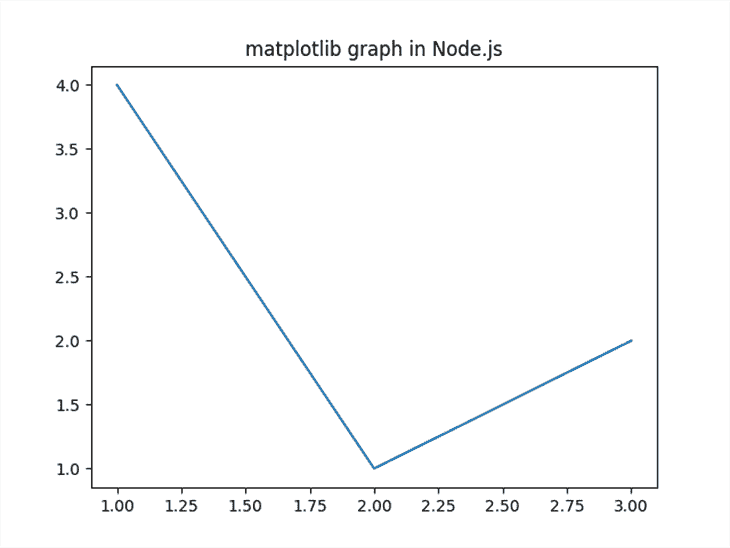

# 在 JavaScript 中探索 JSPyBridge，一个使用 Python 的新库

> 原文：<https://blog.logrocket.com/exploring-jspybridge-library-python-javascript/>

Node.js 和 Python 是两种最流行的软件开发工具。每一种都有其优点和缺点，有时很难从中做出选择，这取决于手头的任务。例如，Node.js 运行时很快，并且有一个拥有数百万个包的大型社区，但当涉及到数据科学和机器学习包时，它与 Python 相比就相形见绌了。

根据您的问题，您可能会发现自己同时需要 Node.js 和 Python 然而，这些语言互不相同，没有任何交流机制。

为了补救这一点，创建了 [JSPyBridge](https://github.com/extremeheat/JSPyBridge) 来允许 Node.js 和 Python 进行互操作。语言互操作允许 Node.js 和 Python 协同工作，就像它们是同一个系统的一部分并共享数据结构一样。使用 JSPyBridge，您可以在 Node.js 中导入和使用 Python API 方法，就像它们是本机的一样，反之亦然。

在本教程中，我们将使用 JSPyBridge 在 Node.js 和 Python 之间进行互操作。在前半部分，我们将看看如何在 Python 中访问和使用 Node.js 函数、包、类和数组。在第二部分，我们将看看如何在 Node.js 中使用 Python 函数、模块、类和数组。

*向前跳转:*

### 先决条件

为了从本教程中获得最大收益，您应该具备:

*   您的计算机上安装的 Node.js v ≥ 14
*   Python v ≥ 3.8 已安装
*   如何使用 Node.js 和 Python 的基本知识

## JSPyBridge 是什么？

JSPyBridge 是一个允许 Node.js 和 Python 互操作的桥梁。您可以将它视为两种编程语言之间的文字桥梁，从一种语言获取数据或对象，并对它们进行转换，以便另一种语言可以解析它们。

Python 和 Node.js 之间可以共享的一些对象是函数、类、可迭代对象和回调。例如，在使用 JSPyBridge 时，可以将 Python 中的函数导入 Node.js，调用它，并访问 Node.js 中的返回值。

以下是 JSPyBridge 特性的简要概述:

*   碎片帐集
*   扩展和调用类
*   支持回调、函数、类和可重复项
*   导入本地文件
*   管理错误

更多特性，参见[桥特性比较](https://github.com/extremeheat/JSPyBridge#bridge-feature-comparison)表。

## 在 Python 中访问 JavaScript

在这一节中，我们将看看如何在 Python 中访问 Node.js 函数、包、类和数组。为此，我们将创建一个项目目录并下载 [`javascript`模块](https://pypi.org/project/javascript/)，它是 JSPyBridge 的一个依赖项。

首先，创建项目目录，并使用以下命令切换到该目录:

```
mkdir python_demo && cd python_demo

```

因为这是一个 Python 目录，所以为项目创建一个虚拟环境:

```
python3 -m venv venv

```

激活虚拟环境:

```
source venv/bin/activate

```

创建虚拟环境后，安装`javascript`模块:

```
pip3 install javascript

```

现在我们已经设置好了环境，我们将开始用 Python 互操作 Node.js。

### 在 Python 中导入 JavaScript 函数

让我们用 Python 创建并调用一个 JavaScript 函数。该函数会将整数值格式化为您选择的货币。然后，您将导入 Python 中的 JavaScript 函数，向其传递参数，并打印返回值。

在编辑器中打开`formatCurrency.js`文件，并添加以下内容:

```
function formatCurrency(value, type) {
  format = new Intl.NumberFormat("en-US", {
    style: "currency",
    currency: type,
  }).format;
  return format(value);
}
module.exports = { formatCurrency };

```

在前面的代码块中，我们定义了一个`formatCurrency()`函数，它有两个参数:

1.  `value`、钱的数量
2.  `type`，我们希望金额格式化的货币

在这个函数中，我们创建了一个`Intl.NumberFormat`实例，它将语言`en-US`作为第一个参数，将包含格式化选项的对象作为第二个参数。

对象有两个属性:`style`和`currency`。`style`属性接受格式样式，这里是`currency`字符串。`currency`属性接受短格式的货币名称，它存储在`type`变量中。

一旦创建了`Intl.NumberFormat`实例，就会返回一个函数并存储在`format`变量中。接下来，调用带有参数`value`的`format()`函数。一旦`format()`函数运行，`formatCurrency()`函数返回结果。最后，我们导出函数`formatCurrency()`,以便它可以在 Python 中使用。

既然已经定义了函数，我们将在 Python 中引用它。在编辑器中打开并创建`format_currencies.py`文件，并添加以下内容:

```
from javascript import require

data = require("./formatCurrency.js")

value = 2000000

print(data.formatCurrency(value, "USD"))
print(data.formatCurrency(value, "EUR"))

```

首先，我们从`javascript`模块导入`require`方法。接下来，我们调用带有 JavaScript 文件路径的`require()`方法`formatCurrency.js`。之后，我们定义一个整数并存储在`value`变量中。在最后两行中，我们用`value`变量和我们想要的货币来调用`formatCurrency()`。

现在，运行`format_currency.py`文件:

```
python3 format_currencies.py

```

运行该文件时，您将看到如下所示的输出:

```
$2,000,000.00
€2,000,000.00

```

这表明 Python 调用了 JavaScript 函数，检索了返回值，并将其记录在终端中。

### 在 Python 中导入和使用 Node.js 包

Node.js 有许多可以在项目中使用的包，JSPyBridge 允许您在 Python 中导入和使用它们。您甚至不必使用 npm 来安装它们——当您使用包名调用`require()`方法时，JSPyBridge 会自动为您获取包。

在这一节中，我们将使用 Python 中的 [sqlstring](https://www.npmjs.com/package/sqlstring) npm 包。`sqlstring`模块可以用来转义和格式化 MySQL 的 SQL 语句。

在文本编辑器中打开`generateSQL.py`文件:

```
from javascript import require

sqlString = require("sqlstring")

name = input("What is your name?n")
sql = sqlString.format("SELECT *  FROM customers WHERE name = ?", [name])

print(sql)

```

首先，我们从`javascript`模块导入`require`方法。第二，我们调用带有参数`sqlstring`的`require()`方法。接下来，我们调用 Python 的`input()`方法来获取用户输入，之后，我们调用`sqlstring`模块的`format()`方法，该方法将一个 SQL 查询作为参数。最后，我们打印格式化的 SQL 查询。

现在运行该文件，并在出现提示时输入一个名称:

```
python3 generateSQL.py

```

运行该文件会产生如下所示的输出:

```
 Installing 'sqlstring' version 'latest'... This will only happen once.

added 1 package, and audited 2 packages in 502ms

found 0 vulnerabilities

 OK.
What is your name?
john

SELECT *  FROM customers WHERE name = 'john'

```

请注意，在输出中，当您第一次运行该文件时，JSPyBridge 下载了该包。下载后，该模块用于生成 SQL 语句，Python 将该语句记录在终端中。

### 在 Python 中使用 ES2015

在本节中，我们将导入一个 ECMAScript 2015 (ES6)类，实例化它，然后调用 Python 中的 instance 方法。

创建一个名为`person.js`的新文件:

```
class Person {
  constructor(firstName, lastName) {
    this.firstName = firstName;
    this.lastName = lastName;
  }

  getFullName() {
    return `${this.firstName} ${this.lastName}`;
  }
}

module.exports = { Person };

```

`Person`类有两个参数:`firstName`和`lastName`。它还有一个`getFullName()`方法，该方法连接`firstName`和`lastName`参数来产生一个全名。

为了使用 Python 中的类，我们使用`module.exports`将其导出。现在，在您的编辑器中创建另一个文件`create_person.py`并添加以下内容:

```
from javascript import require

data = require("./person.js")
person_one = data.Person.new("John", "Doe")
print(person_one.getFullName())

```

这里，我们导入`require()`并引用 JavaScript 文件`person.js`。接下来，我们通过调用`new()`方法来创建类`Person`的实例，该方法将名和姓作为参数。最后，我们调用`Person`类的`getFullName()`方法，并在终端中打印返回值。

保存文件并运行`person.py`:

```
python3 create_person.py

```

运行该文件将产生以下输出:

```
John Doe

```

输出显示名字和姓氏已经连接在一起。这证实了我们可以在 Python 中调用和使用 JavaScript ES2015 类。

* * *

### 更多来自 LogRocket 的精彩文章:

* * *

### 在 Python 中使用 JavaScript iterables

让我们在 Node.js 中创建一个数组，导出它，并在 Python 中迭代它。我们将在`formatCurrency.js`程序的基础上构建，并利用`formatCurrency()`函数来格式化多个值，并将它们追加到一个数组中。该数组将被导出并在 Python 中迭代。

用以下内容创建以下文件`formatValues.js`:

```
values = [200, 40000000, 2938, 80999];
usd_values = [];
function formatCurrency(value, type) {
  format = new Intl.NumberFormat("en-US", {
    style: "currency",
    currency: type,
  }).format;
  return format(value);
}

for (let i = 0; i < values.length; i++) {
  usd_values.push(formatCurrency(values[i], "USD"));
}

module.exports = { items: usd_values };

```

我们创建一个`values`数组，包含要格式化为货币的数字。接下来，我们定义一个空数组、`usd_values`值和`formatCurrency()`函数，它将给定值格式化为您选择的货币。

接下来，我们迭代`values`数组，在每次迭代中，我们调用`formatCurrency()`函数并将格式化后的值推入`usd_values`数组。一旦循环结束，我们导出一个具有`items`属性的对象，其值是`usd_values`数组。

接下来，我们将在 Python 中导入数组。用以下内容创建`list_currencies.py`文件:

```
from javascript import require

data = require("./formatValues.js")
for item in data.items:
    print(item)

```

首先，我们引用`formatValues.js`文件。接下来，我们迭代 Node.js 数组，并在每次迭代中打印值。

现在，使用`python3`命令运行该文件:

```
python3 list_currencies.py

```

运行该命令时，您将看到类似于以下内容的输出:

```
$200.00
$40,000,000.00
$2,938.00
$80,999.00

```

输出证实了我们可以在 Python 中迭代 JavaScript 数组。

### 从不同的目录导入 Python 中的 JavaScript 文件

到目前为止，我们已经了解了如何从 Node.js 导入函数、类和 iterables，并在同一个项目目录中用 Python 运行它们。在本节中，我们将把位于另一个目录中的 Node.js 数组导入 Python，并遍历每个元素。

首先，移出项目目录:

```
cd ..

```

接下来，创建一个新的项目目录，并移到该目录中:

```
mkdir currency_app && cd currency_app

```

将目录初始化为 npm 项目:

```
npm init -y

```

接下来，安装`[uuid]([https://www.npmjs.com/package/uuid](https://www.npmjs.com/package/uuid))` [包](https://www.npmjs.com/package/uuid)，它会生成一个通用的惟一标识符(UUID ),您可以用它来惟一地标识对象:

```
npm install uuid

```

接下来，创建一个新文件`formatValues.js`，并添加以下内容:

```
const { v4: uuidv4 } = require("uuid");

values = [200, 40000000, 2938, 80999];
usd_values = [];
function formatCurrency(value, type) {
  format = new Intl.NumberFormat("en-US", {
    style: "currency",
    currency: type,
  }).format;
  return format(value);
}

for (let i = 0; i < values.length; i++) {
  usd_values.push({
    id: uuidv4(),
    currency: formatCurrency(values[i], "USD"),
  });
}

console.log(usd_values);

module.exports = { items: usd_values };

```

该文件重用了我们在上一节中使用的大量代码；然而，现在有了新的变化。首先，我们导入 UUID 模块。在`for`循环中，我们不是只推送值，而是创建一个具有以下属性的对象:`id`和`currency`。

属性`id`被赋予一个 UUID，它是通过调用 UUID 模块的`uuidv4()`函数生成的。属性`currency`被赋予一个调用`formatCurrency()`函数返回的值。最后，我们有一个`console.log()`方法来记录控制台中的`usd_values`数组。

这样，使用`node`命令运行文件:

```
node formatValues.js

```

您将看到如下所示的输出:

```
[
  { id: 'bfdb0bd6-0e9a-4275-812f-dd1b81dde930', currency: '$200.00' },
  {
    id: '31b0d44a-8987-4f50-a683-99f4af477e6d',
    currency: '$40,000,000.00'
  },
  { id: 'ab9f0e76-875d-4e77-8bb9-61015b8a1a46', currency: '$2,938.00' },
  {
    id: 'f035883d-952a-4642-8c66-379858601f5f',
    currency: '$80,999.00'
  }
]

```

输出显示确认对象是用 UUIDs 创建的。

现在，移除`formatValues.js`文件中的`console.log()`方法。我们不再需要它了，因为数组内容将以 Python 显示。

现在我们知道程序成功运行了，我们将把数组导入到主项目目录中，`python_demo`。

返回到主项目目录:

```
cd .. && cd python_demo

```

在项目目录中，使用以下内容在编辑器中创建一个`list_usd_values_with_uuid.py`文件:

```
from javascript import require

data = require("./../currency_app/formatValues.js")
for item in data.items:
    print(f'ID: {item.id}')
    print(f'Amount in USD: {item.currency}')
    print("n")

```

在代码块中，我们引用了位于另一个目录中的`formatCurrencies.js`。接下来，我们遍历数组中的所有元素，并在控制台中打印商品 UUID 和格式化后的货币。

现在，运行`list_usd_values_with_uuid.py`文件:

```
python list_usd_values_with_uuid.py

```

运行代码会产生以下结果:

```
ID: 35295372-eedc-44bd-8e19-360a990a1a44
Amount in USD: $200.00

ID: c446ae79-3904-4c8b-8e74-31d4184612ca
Amount in USD: $40,000,000.00

ID: 13ce5e1a-7f0a-4d81-bfd4-d18229a1b159
Amount in USD: $2,938.00

ID: 755e1f39-3cad-4128-b806-4681acccd7d7
Amount in USD: $80,999.00

```

正如您在输出中看到的，我们可以成功地迭代另一个项目目录中的数组。

现在您已经知道了如何使用 JSPyBridge 来访问 Python 中的 Node.js API，我们将在下一节中访问 Python API。

## 在 Node.js 中访问 Python

在本节中，我们将访问 Node.js 中的 Python 模块、本地 Python 文件、函数、类和 iterables。

首先，移出当前目录，回到主目录:

```
cd ..

```

现在，在主目录中，创建一个新目录，并将其更改为:

```
mkdir node_demo && cd node_demo

```

由于这是一个 Node.js 目录，初始化`npm`:

```
npm init -y

```

接下来，安装 [pythonia 包](https://www.npmjs.com/package/pythonia)，它是 Node.js 的桥梁:

```
npm install pythonia

```

接下来，在`package.json`的末尾添加`"type": "module"`行，以允许 Node.js 使用 ES2015 模块:

```
{
  ...
  "license": "ISC",
  "dependencies": {
    "pythonia": "^1.0.0"
  },
  "type": "module"
}

```

至此，您现在可以在 Node.js 中使用 JSPyBridge 了。接下来，我们将导入一个 Python 函数并在 Node.js 中调用它。

### 在 Node.js 中导入 Python 函数

在本节中，我们将在 Python 中创建一个函数，导入它，然后在 Node.js 中运行该函数。该函数将利用 Python 中的 [`random`模块](https://docs.python.org/3/library/random.html)。

创建一个`random_choices.py`文件并添加以下内容:

```
import random

def get_random_word():
    colors = ["red", "green", "blue", "yellow"]
    return random.choice(colors)

```

在第一行，从 Python 导入`random`模块。然后我们定义一个函数`get_random_word()`，它在`colors`数组中打乱并返回一个随机值。

接下来，用以下代码创建`pickRandomValue.js`文件:

```
import { python } from "pythonia";
const rand = await python("./random_choices.py");
console.log(await rand.get_random_word());
python.exit();

```

从`pythonia`包中导入`python`函数。接下来，用`random_choices.py`路径作为参数调用`python()`函数，然后启动一个 Python 进程。

在 Node.js 中，JSPyBridge 要求每个 Python API 调用都以`await`关键字为前缀。接下来，我们调用`get_random_word()`函数并将结果记录到终端中。最后，我们退出流程。

现在，用`node`命令运行该文件:

```
node pickRandomValue.js

```

运行该命令时，您将看到类似于以下内容的输出:

```
red

```

输出显示`red`。您的可能会显示不同的颜色，因为毕竟包返回随机值。

### 在 Node.js 中使用 Python 第三方模块

在本节中，我们将使用 Node.js 中的第三方 Python 模块。我们的程序将使用 [Matplotlib](https://matplotlib.org/) 和 [NumPy](https://numpy.org/) 来创建一个图表。

首先，停用当前的虚拟环境:

```
deactivate

```

在目录中创建新的虚拟环境:

```
python3 -m venv venv

```

激活虚拟环境:

```
source venv/bin/activate

```

接下来，使用以下命令安装以下模块:

```
pip3 install numpy matplotlib

```

要使用 JavaScript 中的模块，创建一个`plot_graph.js`文件并添加以下内容:

```
import { python } from 'pythonia'
const np = await python('numpy')
const plt = await python('matplotlib.pyplot')

const x = await np.array([1, 2, 3])
const y = await np.array([4, 1, 2])

await plt.plot(x, y)

await plt.title('matplotlib graph in Node.js')

await plt.savefig('graph.png')
python.exit()

```

首先，我们从`pythonia`导入`python()`函数。在接下来的两行中，我们调用`python`函数来导入 NumPy 和 Matplotlib 模块。

接下来，我们使用`np.array()`方法定义数组，它们存储在`x`和`y`变量中。接下来，我们调用`plt.plot()`，它将`x`和`y`变量中的数组作为参数。之后，我们使用`plt.title()`方法来定义图表的标题。然后我们调用`plt.savefig()`将图表作为图像保存在目录中。最后，我们退出 Python 进程。

现在，运行该文件:

```
node plot_graph.js

```

当该命令运行时，您的目录中会有一个图像`graph.png`，看起来像这样:


### 在 Node.js 中使用 Python 类

在本节中，我们将在 Python 中定义一个类，并在 Node.js 中实例化它。

用以下内容创建`person.py`文件:

```
class Person:
    def __init__(self, firstName, lastName):
        self.firstName = firstName
        self.lastName = lastName

    def getFullName(self):
        return f"{self.firstName} {self.lastName}"

```

Python 类类似于我们之前定义的 ES2015 `Person`类。这个类有两个参数:`firstName`和`lastName`。它还有一个`getFullName()`方法，返回这个人的全名。

要使用 Node.js 中的`Person`类，请导入`createPerson.js`文件:

```
import { python } from "pythonia";
const data = await python("./person.py");
const person1 = await data.Person("John", "Doe");
console.log(await person1.getFullName());
python.exit();

```

首先，我们从`pythonia`导入`Python`函数，然后引用`person.py`文件。其次，我们通过调用`Person`类创建一个实例，将名字和姓氏作为参数。我们调用`getFullName()`方法，它返回全名，然后我们在控制台中打印出来。最后，和往常一样，我们退出 Python 进程。

现在，使用`node`运行文件:

```
node createPerson.js

```

它将产生如下所示的输出:

```
John Doe

```

这表明我们可以在 Node.js 中成功使用 Python 类。

### 在 Node.js 中使用 Python iterables

在本节中，我们将使用 Python 创建一个列表，并遍历 Node.js 中的每个元素。

首先，用下面的代码创建`get_dir_contents.py`:

```
import os

dir_files = os.listdir("./node_modules")

```

我们从导入`os`模块开始。接下来，我们调用`os`模块的`listdir()`方法，该方法返回给定目录`node_modules`中所有文件的列表。

现在我们已经有了 Python 中的列表，我们将导入它并在 Node.js 中调用它。

首先，创建`listDir.js`文件并添加以下内容:

```
import { python } from "pythonia";
const obj = await python("./get_dir_contents.py");
const dirFiles = await obj.dir_files;

for await (const file of dirFiles) {
  console.log(file);
}

python.exit();

```

首先，我们使用在第一行中导入的`python()`函数来引用`listDir.py`文件。接下来，我们解包`dir_files`数组并将其存储在`dirFiles`变量中。

之后，我们定义一个`for await`循环来遍历所有元素，并在每次迭代过程中记录控制台中的每个文件。JSPyBridge 不建议在 Python 中循环数组时使用其他循环。

接下来，运行`listDir.js`文件:

```
node listDir.js

```

当该命令运行时，您将看到类似如下的输出:

```
ansi-styles
color-name
has-flag
ws
pythonia
chalk
.package-lock.json
caller
supports-color
color-convert

```

这表明 Node.js 可以遍历 Python 数组。

## 结论

在本文中，我们学习了如何使用 JSPyBridge 实现 Node.js 和 Python 的互操作。在前半部分，我们研究了如何在 Python 中使用 JSPyBridge。我们学习了如何导入和使用以下内容:

| Python 中的 Node.js | Node.js 中的 Python |
| --- | --- |
|  | 功能

*   班
*   可重复的
*   第三方模块
*   要了解关于 JSPyBridge 的更多信息，请访问 JSPyBridge 文档。你也可以在他们的 GitHub repo 中查看更多[的例子。如果你想学习如何在前端使用 Python，请看](https://github.com/extremeheat/JSPyBridge/tree/master/examples)[的 PyScript 教程](https://blog.logrocket.com/pyscript-run-python-browser/)。

 |

200 只显示器出现故障，生产中网络请求缓慢

## 部署基于节点的 web 应用程序或网站是容易的部分。确保您的节点实例继续为您的应用程序提供资源是事情变得更加困难的地方。如果您对确保对后端或第三方服务的请求成功感兴趣，

.

[try LogRocket](https://lp.logrocket.com/blg/node-signup)

LogRocket 就像是网络和移动应用程序的 DVR，记录下用户与你的应用程序交互时发生的一切。您可以汇总并报告有问题的网络请求，以快速了解根本原因，而不是猜测问题发生的原因。

[](https://lp.logrocket.com/blg/node-signup)[https://logrocket.com/signup/](https://lp.logrocket.com/blg/node-signup)

您是否添加了新的 JS 库来提高性能或构建新特性？如果他们反其道而行之呢？

## 毫无疑问，前端变得越来越复杂。当您向应用程序添加新的 JavaScript 库和其他依赖项时，您将需要更多的可见性，以确保您的用户不会遇到未知的问题。

LogRocket 是一个前端应用程序监控解决方案，可以让您回放 JavaScript 错误，就像它们发生在您自己的浏览器中一样，这样您就可以更有效地对错误做出反应。

[LogRocket](https://lp.logrocket.com/blg/javascript-signup) 可以与任何应用程序完美配合，不管是什么框架，并且有插件可以记录来自 Redux、Vuex 和@ngrx/store 的额外上下文。您可以汇总并报告问题发生时应用程序的状态，而不是猜测问题发生的原因。LogRocket 还可以监控应用的性能，报告客户端 CPU 负载、客户端内存使用等指标。

[](https://lp.logrocket.com/blg/javascript-signup)[https://logrocket.com/signup/](https://lp.logrocket.com/blg/javascript-signup)

自信地构建— [开始免费监控](https://lp.logrocket.com/blg/javascript-signup)。

LogRocket 检测您的应用程序以记录基线性能计时，如页面加载时间、到达第一个字节的时间、慢速网络请求，还记录 Redux、NgRx 和 Vuex 操作/状态。

.

[Start monitoring for free](https://lp.logrocket.com/blg/node-signup)

.