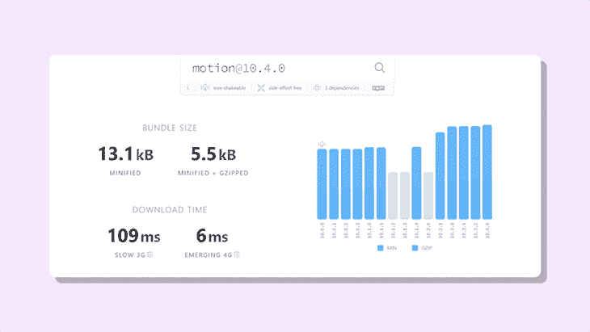
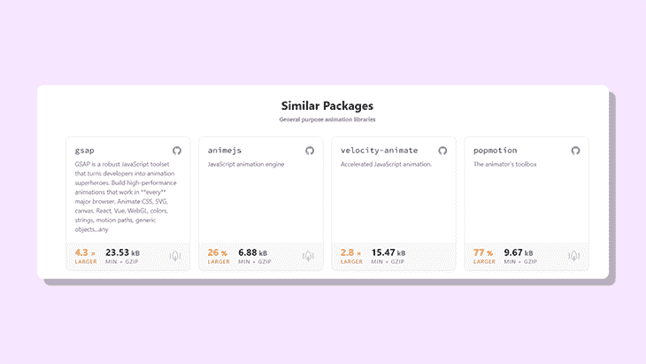
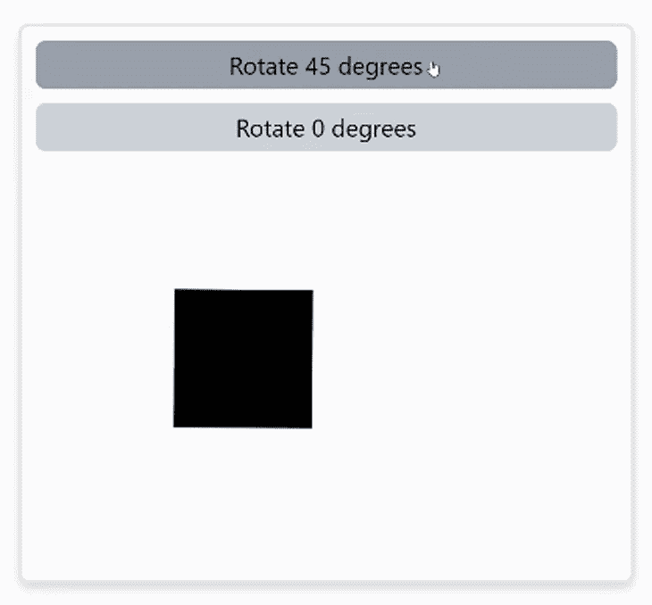
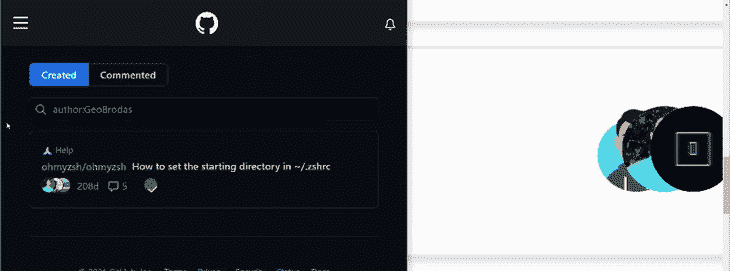
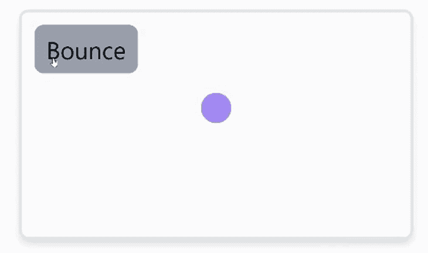
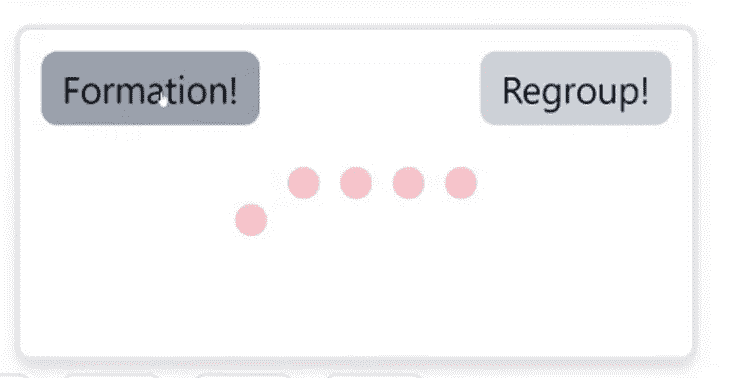
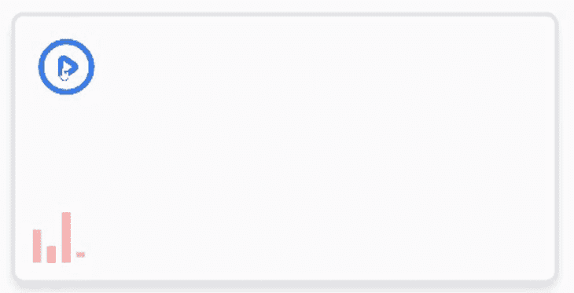

# 从 Framer Motion - LogRocket 博客探索 Motion One

> 原文：<https://blog.logrocket.com/exploring-motion-one-framer-motion/>

Motion One 是一个新的库，可以让你快速、轻松地在网站上添加小而流畅、功能强大的动画。您可以将它们添加到任何元素中，并轻松控制它们。

这篇文章会给你一个 Motion One 特性的快速概述。尽管它很小，但性能如此之好的原因是它建立在 [Web Animations API](https://developer.mozilla.org/en-US/docs/Web/API/Web_Animations_API) 之上，这是一种动画 DOM 元素的本地语言。Motion One 简单地提供了一种简单的方法，通过其自我解释的代码来实现这一点。

Motion One 动画也是完全响应的，它支持 SVG 和 CSS 转换、过渡和动画，除了一些用于使简单动画更加简单的 DSL。最后，它还得到了缓解([预定义和自定义](https://motion.dev/dom/animate#easing))。

在本文中，我们将介绍开始使用 [Motion One](https://motion.dev/) 的所有基础知识。这是我们要经历的:

1.  [标杆动作一](#benchmarking-motion-one)
2.  [使用`animate()` API](#using-animate-api)
3.  [使用关键帧和交错功能](#using-keyframes-stagger-function)
4.  [了解控件](#understanding-controls)

为了跟进，我为本教程制作了一个 [GitHub 库](https://github.com/GeoBrodas/motion-one-nextjs-example)。如果你迷路了，一定要偷看一下。

## 基准动议一

下面是来自 [BundlePhobia](https://bundlephobia.com/package/motion@10.4.0) 的关于 Motion One 的束尺寸的一些详细信息。



Motion One 中的核心函数是`animate()` API，大小只有 3.8kB。开发者马特·佩里打算[通过进一步的改进和版本升级把它减少到 1.8kB】！](https://motion.dev/guides/feature-comparison#bundlesize)

与市场上的其他动画库相比，Motion One 的大小只有 Anime.js 的一半，GSAP 的七分之一。



Motion One 的另一个很酷的特性是，它可以在没有主 JavaScript 线程的情况下运行。这意味着在繁重的应用程序渲染过程中，动画仍然会执行。

## 使用`animate()` API

开始之前，使用以下命令安装库:

```
npm install motion

```

完成后，让我们更深入地了解一下 Motion One 的核心功能之一。`animate()` API 提供了一种简单的方法，可以从当前方向或位置动画显示 DOM 上的元素。

Motion One 的核心功能之一是`animate()`功能，它接受三个参数:

1.  CSS 选择器
2.  可赋予活力的价值观
3.  选择

让我们更详细地看看所有这些。

### 1.CSS 选择器

第一个参数是 DOM 上将被动画化的元素的`id`或`class`。

```
import { animate } from "motion";

function Trigger ( ) {
  animate(".box", { x: 100} )
}

```

### 2.可赋予活力的价值观

第二个参数指定元素在动画中应该如何表现，比如在 DOM 中移动 100px 或者旋转 45 度。

```
import { animate } from "motion";

function Trigger ( ) {
  animate(".box", { x: 100, rotate: 45 } );
}

```

### 3.选择

最后一个参数是选项，可用于控制动画的各个方面，如延迟、持续时间、重复次数等。

```
import { animate } from "motion";

function Trigger ( ) {
  animate('.click', { transform: 'rotate(45deg)' }, { duration: 0.5 })
}

```



使用绑定到按钮的`onClick`事件可以触发`animate()`功能。

```
<button
  className="rounded-md bg-gray-300 hover:bg-gray-400 p-1 text-sm"
  onClick={() =>
    animate('.click', { transform: 'rotate(45deg)' }, { duration: 0.5 })
  }
>
  Rotate 45 degrees
</button>

// element to be animated
<div className="click"></div>

```

## 使用 Motion One 创建交互式动画

为什么不把我们到目前为止学到的所有东西结合起来，创造一个互动的动画呢？



在本教程中，我们将从 GitHub 的贡献者列表中获得这个动画的灵感。重新创建这个动画的主要目的是当鼠标悬停在水平轴上时，将化身图像向左移动。

在本教程中，我将使用 [Tailwind CSS](https://tailwindcss.com/docs/guides/nextjs) 来加速开发过程，但是这个概念仍然适用于普通 CSS。

首先，我们需要这个动画的三个`<image>`元素，每个元素都被一个`<div>`标签包围。

```
<div
  onMouseOver={onHover}
  onMouseOut={onHoverOff}
>
  <div>
    <Image
      className="rounded-full"
      alt="one"
      src="/images/avataaars.png"
      width="60"
      height="60"
    />
  </div>
    <div>
      <Image
        className=" rounded-full"
        alt="two"
        src="/images/new.jpg"
        width="60"
        height="60"
       />
  </div>
    <div>
     <Image
      className="rounded-full"
      alt="three"
      src="/images/logo.png"
      width="60"
      height="60"
     />
  </div>
</div>

```

我们将使父元素`<div>`成为相对元素，子元素成为绝对元素，然后增加每个子元素的 z-index，使照片上下对齐。

```
<div className="relative">
  <div className="absolute z-0"><Image {...attributes} /></div>
  <div className="absolute z-10"><Image {...attributes} /></div>
  <div className="absolute z-20"><Image {...attributes} /></div>
</div>

```

接下来，定位每个子元素，使所有图像在一行上对齐。

```
<div className="relative">
  <div className="absolute z-0 right-10"><Image {...attributes} /></div>
  <div className="absolute z-10 right-5"><Image {...attributes} /></div>
  <div className="absolute z-20 right-0"><Image {...attributes} /></div>
</div>

```

分别向父标签`<div>`添加两个事件`onMouseOver`和`onMouseOut`。现在需要做的就是将图像移动到一个特定的位置，使它们等距分布。

为每个事件创建一个处理函数:当鼠标在元素上时，以及当鼠标离开该区域时。

```
function onHover () {
  // code goes here
}

function onHoverExit () {
  // code goes here
}

```

我们希望当鼠标指针悬停在图像上时，图像分散在 X 轴上的三个不同位置。

```
function onHover() {
  animate('.one', { x: -70 }, { duration: 0.2 });
  animate('.two', { x: -40 }, { duration: 0.2 });
  animate('.three', { x: -10 }, { duration: 0.2 });
}

```

这里的减号将图像向左移动。类似地，在下面的事件中，我们希望它返回到原来的位置。

```
function onHoverOff() {
  animate('.one', { x: 0 }, { duration: 0.2 });
  animate('.two', { x: 0 }, { duration: 0.2 });
  animate('.three', { x: 0 }, { duration: 0.2 });
}

```

事情就是这样！这个很容易就搞定了，是不是很神奇？让我们讨论一些更基本的问题。

## 使用关键帧和`stagger`功能

### 使用关键帧在 DOM 中移动元素

当动画元素需要在 DOM 上移动多次，覆盖不同的坐标时，比如当加载指示器跳动时，可以使用关键帧。这些值可以以数组的形式提供，如下所示。

```
function bounceHandler() {
   animate(
     '.bounce',
     { y: [-30, 120, 50, 120] },
    { duration: 1, direction: 'alternate' }
   );
}

```



### 使用交错设置多个元素的动画

交错是另一个很酷的功能。当制作多个元素的动画时，这可用于对具有相同`class`或`id`的每个元素应用延迟。

```
<div className="flex justify-center">
  <div className="pawn"></div>
  <div className="pawn"></div>
  <div className="pawn"></div>
  <div className="pawn"></div>
  <div className="pawn"></div>
</div>

```

如果用`animate()`函数绑定单个元素，如下所示:

```
// onClick trigger
function moveUsingStagger() {
  animate('.pawn', { y: 50 }, { delay: stagger(0.1) });
}

```

这是您可能希望看到的情况:



为了在更具挑战性的例子中看到这些，让我们制作一个音乐波形，如下所示:



很棒，不是吗？首先，我们需要一个按钮和四个波形条。

```
<div>
  // button trigger to animate waveform
  <button onClick={play} >
    <PlayIcon />
  </button

  // waveform
  <div className="flex overflow-hidden">
    <span className="w-1 h-4" />
    <span className="w-1 h-2" />
    <span className="w-1 h-6" />
    <span className="w-1 h-2" />
  </div>
</div>

```

提醒一下，你可以在我为这篇文章创建的 GitHub repo 中查看完整代码。

然后我们将进入动画部分。向按钮添加一个`onClick`事件，并将其分配给一个函数。然后，指向每个`<span />`并调用`animate()`函数。记住给每个子元素一个不同的名字。与其他动画不同，我们将在这里为每个`<span />`制作不同的动画。

```
function playWaveform ( ) {
  // some code here
  const animation1 = animate(
      '#bar1',
      {
        transform: [
          'scaleY(1.0) translateY(0rem)',
          'scaleY(1.5) translateY(-0.082rem)',
          'scaleY(1.0) translateY(0rem)',
        ],
      },
      {
        duration: 1.0,
        repeat: Infinity,
        easing: 'ease-in-out',
      }
    );
    const animation2 = animate(
      '#bar2',
      {
        transform: [
          'scaleY(1.0) translateY(0rem)',
          'scaleY(3) translateY(-0.083rem)',
          'scaleY(1.0) translateY(0rem)',
        ],
      },
      {
        delay: 0.2,
        duration: 1.5,
        repeat: Infinity,
        easing: 'ease-in-out',
      }
    );
    const animation3 = animate(
      '#bar3',
      {
        transform: [
          'scaleY(1.0)  translateY(0rem)',
          'scaleY(0.8) translateY(0.37rem)',
          'scaleY(1.0)  translateY(0rem)',
        ],
      },
      {
        delay: 0.3,
        duration: 1.5,
        repeat: Infinity,
        easing: 'ease-in-out',
      }
    );
    const animation4 = animate(
      '#bar4',
      {
        transform: [
          'scaleY(0.3)  translateY(0rem)',
          'scaleY(2.0) translateY(-0.05rem)',
          'scaleY(0.3)  translateY(0rem)',
        ],
      },
      {
        delay: 0.3,
        duration: 1.5,
        repeat: Infinity,
        easing: 'ease-in-out',
      }
    );

  // some more code here ( wait for it )
}

```

您可能已经注意到，我已经为每个`animate()`函数分配了一个参考常数。这是出于一个特定的原因，我们稍后会谈到。

目前，让我们先了解一下`animate()` API 是做什么的。首先，我们将两个关键帧传递给`transform`属性:

*   `ScaleY`:垂直调整元素大小
*   `TranslateY`:沿 y 轴移动所选元素的位置

因此，您可能已经注意到，我向父元素添加了一个`overflow-hidden`属性，以隐藏由这两个属性引起的溢出。接下来，`repeat`属性被设置为`infinity`，这导致相同的动画无限重复。

将`delay`属性添加到最后三个子元素中，可以将它们区分开来，并产生每个条形独立于其他条形的感觉。

缓动属性控制动画播放的速度。在这个例子中，我们将它设置为`ease-in-out`，这意味着动画缓慢开始，在中间加快速度，然后在接近结束时再次减速。

## 了解控件

`animate()`函数返回一个叫做`controls`的东西。我们可以使用控件来控制动画的回放。每次调用`animate()`函数时都会返回控件，这可以通过将`animate()`函数实例化为一个变量来访问。

再来看最后一个例子，我们可能想只在音乐播放时让波形变成动画。这就是控件非常有用的地方。

要获得`controls`，请参考`animate`函数。

```
const animation1 = animate("#bar1", ...options )

```

接下来，为了控制动画，在给定的布尔条件下使用`pause()`或`play()`方法。

```
// if music is playing
animation1.play( );

// if the music stops playing
animation1.pause( );

```

现在让我们回到我们之前的动画！为了控制回放，我们可以使用在布尔条件之间切换的状态。

```
import { useState } from "react";

// component
function MusicWaveform () {
  const [ isPlaying, setIsPlaying ] = useState(false);

  // toggles between state
  function switchModeHandler() {
    setIsPlaying((prevState) => !prevState);
  }

  // animation code goes here
  function playWaveform() {
    switchModeHandler();
    // animate functions for each bar ...
  }
  // JSX code
}

export default MusicWaveform;
>
```

现在，当点击按钮时，`playWaveform`功能被触发，状态被切换。剩下的就是当按钮被触发时播放波形。

```
function playWaveform() {
  switchModeHandler();
  // useState
  // animate functions for each bar
  if (isPlaying) {
    animation1.pause();
    animation2.pause();
    animation3.pause();
    animation4.pause();
  } else {
    animation1.play();
    animation2.play();
    animation3.play();
    animation4.play();
  }
}

```

这就是全部了！你应该能看到酒吧在跳舞！

## 结论

Motion One 是一个功能齐全的网络动画库。它基于 web Animations API，这是一种 Web 标准，允许 Web 动画甚至在没有主 JavaScript 线程的情况下运行(因此保持流畅)。

Motion One 是一款非常轻量级的产品，拥有制作优秀动画所需的一切。你可以通过访问 [https://motion.dev](https://motion.dev) 了解更多关于 Motion One 的信息。

## 您是否添加了新的 JS 库来提高性能或构建新特性？如果他们反其道而行之呢？

毫无疑问，前端变得越来越复杂。当您向应用程序添加新的 JavaScript 库和其他依赖项时，您将需要更多的可见性，以确保您的用户不会遇到未知的问题。

LogRocket 是一个前端应用程序监控解决方案，可以让您回放 JavaScript 错误，就像它们发生在您自己的浏览器中一样，这样您就可以更有效地对错误做出反应。

[](https://lp.logrocket.com/blg/javascript-signup)[https://logrocket.com/signup/](https://lp.logrocket.com/blg/javascript-signup)

[LogRocket](https://lp.logrocket.com/blg/javascript-signup) 可以与任何应用程序完美配合，不管是什么框架，并且有插件可以记录来自 Redux、Vuex 和@ngrx/store 的额外上下文。您可以汇总并报告问题发生时应用程序的状态，而不是猜测问题发生的原因。LogRocket 还可以监控应用的性能，报告客户端 CPU 负载、客户端内存使用等指标。

自信地构建— [开始免费监控](https://lp.logrocket.com/blg/javascript-signup)。