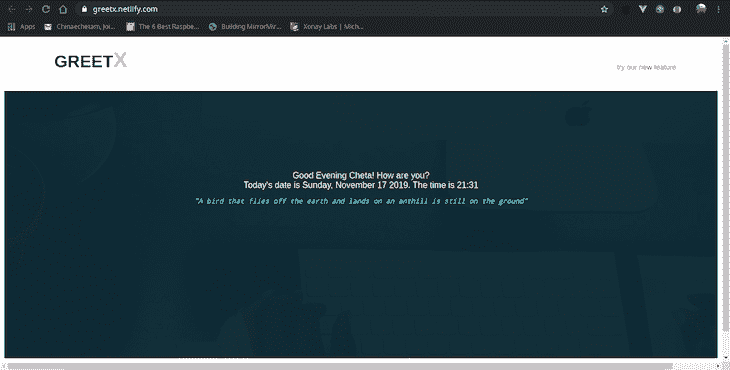
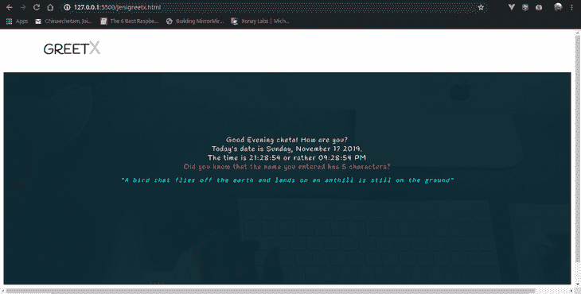
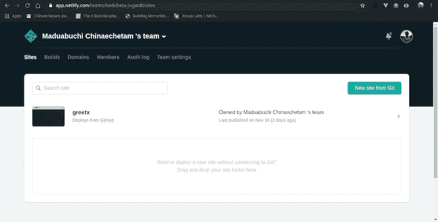
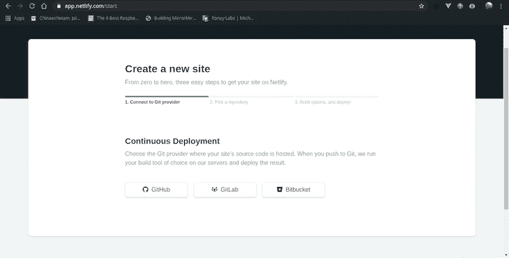
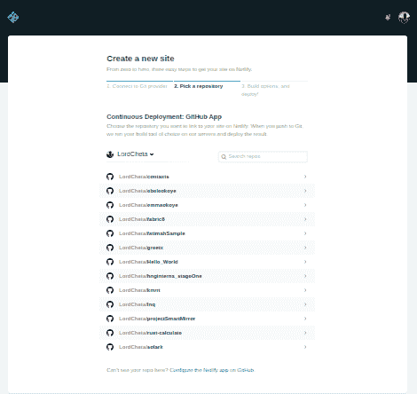
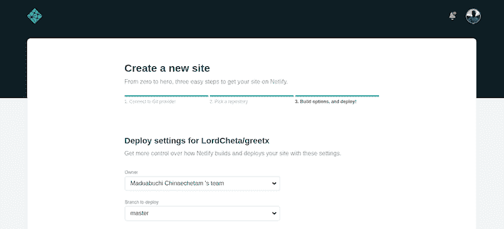
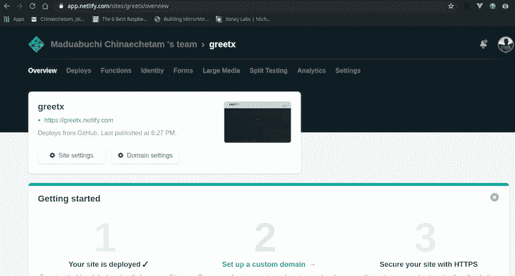
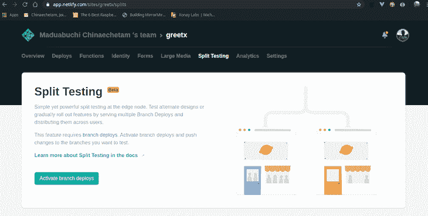
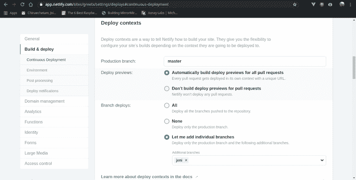
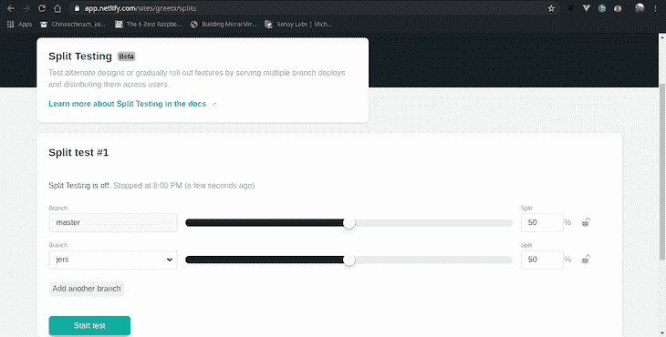

# 探索网络分裂测试

> 原文：<https://blog.logrocket.com/exploring-netlify-split-testing/>

[Obinna Ekwuno Follow](https://blog.logrocket.com/author/obinnaekwuno/) Writer of all things technical and inspirational. Developer and Community Advocate. In a love-love relationship with JavaScript🔥

# 探索网络分裂测试

## 

2019 年 11 月 21 日 3 分钟阅读 849

Netlify 是我个人喜欢并欣赏的工具，主要是因为它非常容易部署应用程序，也因为该公司参与了 [JAMstack](https://blog.logrocket.com/why-you-should-be-using-jamstack/) 。Netlify 做了很多很酷的事情，从即时部署到持续集成。

在本文中，我们将关注一个特定的网络特性:分割测试。值得注意的是，在撰写本文时，该功能仍处于测试阶段。我们将讨论如何利用分割测试，并看看一些令人兴奋的用例。

# 部署应用程序的问题是

当你想在项目中加入一个特性，但不确定用户会如何反应时，让他们尽早接触到这个新特性或你的站点或应用程序的一部分，以便对其可行性产生可操作的反馈是有意义的。然而，部署应用程序可能是一件麻烦的事情，更不用说管理你的网站或应用程序的单独实例，以便你可以测试功能。没必要这么复杂，这才是 Netlify 的分裂测试真正出彩的地方。

# 测试新功能

根据[官方文档](https://docs.netlify.com/site-deploys/split-testing/#run-a-branch-based-test)，“Netlify 的分割测试可以让你在不同的部署之间分配你网站的流量，直接来自他们的 CDN 网络，不会损失任何下载性能，也不会安装任何第三方 JavaScript 库。你可以用它来进行 A/B 测试，或者发布私人测试版。”最好的部分是:

*   你可以使用任何你选择的客户端分析库来跟踪你网站不同版本的访问者
*   借助 Git 分支的强大功能，Netlify 可以构建您的所有分支，并在专用 URL 上为它们提供服务
*   您可以将此功能用于您喜欢的任何类型的站点，而不管您使用什么工具或静态站点生成器来创建它
*   您甚至可以运行一个基于分支的测试，在两个或更多部署的 Git 分支之间划分流量
*   通过分割测试，用户可以不可见地访问不同的分支构建(即，都来自同一个产品 URL)

为了说明分割测试，我将使用托管在 [GitHub](https://github.com/LordCheta/greetx) 上的一个项目来演示一个非常简单的特性。在你输入自己的名字后，这个工具会用当前时间、日期和一句非洲谚语来问候你。

要演示的新功能并不花哨；它告诉你你的名字有多少个字符，以及 12 小时格式的时间，所有这些都是一种奇特的字体。

# 设置和实施

首先，你需要一个 Netlify 帐户，如果你还没有的话就注册吧。登录后，从仪表板右上角的 Git 图标中单击新站点。

我已经有一个以前部署的网站，所以不要担心，如果你的屏幕看起来不完全像我的。只要你能从 Git 按钮看到**新站点，你就可以开始了。**

要部署您的站点，请遵循下面概述的步骤。

首先，选择您的 Git 提供商:

接下来，选择您的项目存储库:

最后，设置您的构建选项，然后部署:

一旦您的站点部署完毕，请回到您的仪表板。现在它看起来应该和我的一样了，你已经成功地部署了你的第一个 Netlify 托管的站点。

现在是设置分割测试的时候了。继续点击你想要应用这个特性的站点。下一个屏幕应该是这样的:

一旦你到达上面的屏幕，下一步是点击**分割测试**，右边第三个菜单项。这将带你直接进入页面，在那里你可以设置我一直在大谈特谈的优点。

要激活分割测试，点击左下角的按钮**激活分支部署**。您可能会遇到这样一个问题，即分割测试只适用于具有多个分支的分支，如下所示。

这仅仅意味着 Netflify 被配置为只部署一个分支。您可以通过导航到**设置>构建&部署>连续部署>部署上下文**来解决这个问题。然后，点击**编辑设置**并选择标有**让我添加单个分支的单选按钮。**您可以选择部署所有分支机构(包括未来的分支机构)或选择您想要部署的单个分支机构。

一旦你解决了这个问题，回到分割测试菜单。

现在，您可以选择要测试的分支以及要分配给这些分支的流量百分比。一旦你完成了，点击**开始测试**按钮，这就是全部了。

请注意，您可以为分割测试添加两个以上的分支。在开始新的测试之前，请记住停止任何已经在运行的测试。

# 结论

分割测试功能是一个非常方便的工具。它简单明了，非常容易使用。你可以在 Netlify 的官方网站上了解更多关于它是如何实现的。不要因为它还是一个测试版特性就害怕尝试。它将使您的持续集成体验变得更好。

## 使用 [LogRocket](https://lp.logrocket.com/blg/signup) 消除传统错误报告的干扰

[LogRocket](https://lp.logrocket.com/blg/signup) 是一个数字体验分析解决方案，它可以保护您免受数百个假阳性错误警报的影响，只针对几个真正重要的项目。LogRocket 会告诉您应用程序中实际影响用户的最具影响力的 bug 和 UX 问题。

然后，使用具有深层技术遥测的会话重放来确切地查看用户看到了什么以及是什么导致了问题，就像你在他们身后看一样。

LogRocket 自动聚合客户端错误、JS 异常、前端性能指标和用户交互。然后 LogRocket 使用机器学习来告诉你哪些问题正在影响大多数用户，并提供你需要修复它的上下文。

关注重要的 bug—[今天就试试 LogRocket】。](https://lp.logrocket.com/blg/signup-issue-free)