# 探索 Unity 中的后处理

> 原文：<https://blog.logrocket.com/exploring-post-processing-unity/>

作为游戏开发者，我们通常希望我们的游戏看起来和感觉起来都不错。我们可以用一些小技巧让我们的游戏更精彩。其中一个技巧就是后处理。

如果你玩过游戏，你可能知道后处理，即使你不知道它叫什么。后期处理在游戏制作中起着重要的作用，因为它有助于改善游戏的视觉效果，从而使游戏更有趣。

不仅如此，后期处理还解决了色彩校正、效果等问题。Unity 游戏引擎内置了后处理堆栈。在本教程中，我们将了解如何在 Unity 中使用后处理以及如何使用它，包括:

首先，我们来快速了解一下什么是后期处理。

## 什么是后期处理？

后期处理描述了我们可以应用到游戏场景中的图像效果。一个场景包含你的游戏环境和菜单。

游戏场景设计的一种方式是将每个场景的文件看作一个独立的层次。你在每一个场景中放置你的环境，障碍和装饰，本质上是设计和构建你的游戏。

您可以将后期处理效果作为游戏视觉效果的点睛之笔。有时，你甚至可以使用后期处理来为你的游戏创造一个完全不同的外观。

例如，通过使用自动曝光和光晕效果来描绘日光，可以将黑暗的场景变成明亮的场景。你也可以利用白平衡效果将晴朗的一天变成寒冷多云的一天。

我们在游戏中看到的很多被修饰过的东西大多是通过我们所谓的后期处理效果实现的。后处理包括在屏幕上显示图像之前，在相机的图像缓冲区上执行的全屏滤镜和效果。

后期处理通常用于通过模拟电影摄影机特有的某些质量，如运动模糊，来为我们的场景添加电影质量。Unity 使用下面的例子来展示一个游戏场景在有和没有后期处理时的样子:

[无(前)后处理](https://docs.unity.cn/2021.1/Documentation/uploads/Main/PostProcessing-0.jpg):

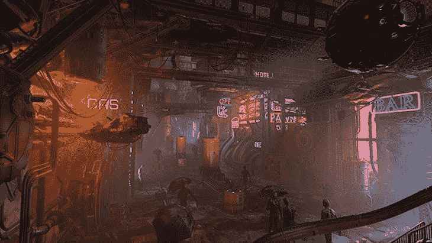

[带(后)后处理](https://docs.unity.cn/2021.1/Documentation/uploads/Main/PostProcessing-1.jpg):

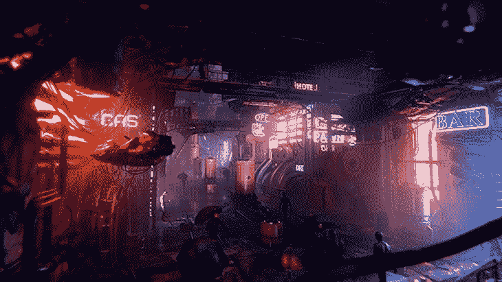

研究这两幅图像，我们可以看到颜色的变化以及图像场景的某些部分发出更亮的光。这意味着像`tonemapper`和`bloom`这样的效果已经应用到场景中，尽管可能有更多。

上面的图片显示了后期处理在改变游戏画面上显示的重要性。

后期处理改善了游戏的视觉效果，使图像更加逼真生动。它还微调游戏的渲染，使图形更加真实。你甚至可以使用后期处理效果来改变场景的情绪。

现在让我们继续讨论 Unity 中的后处理。

## Unity 中的后处理

Unity 游戏引擎支持后期处理,提供多种效果，可以立即显著改善游戏外观。我们可以使用这些效果来提供美丽的图形和改善我们的游戏。

需要注意的是，Unity 的后处理包可用的方式取决于你的 Unity 项目的渲染管道。我们可以通过三种方式使用后处理:内置渲染管道、通用渲染管道和高清渲染管道。

内置渲染管道是默认情况下后处理包不附带的渲染管道。我们必须使用软件包管理器来安装它。

默认情况下，当您使用 URP 模板创建项目时，通用渲染管道(URP)是一个在 Unity 中安装了后处理解决方案的渲染管道。

与 URP 一样，当您使用 HDRP 模板创建项目时，默认情况下，Unity 也会安装高清晰度渲染管道(HDRP)的后处理解决方案。

尽管在使用 URP 或 HDRP 时，后期处理略有不同，但他们的工作流程几乎是相同的——尽管 HDRP 提供了一些更高级的效果。本文将重点介绍最常用的 URP，它也应该适用于 HDRP。

## 如何在 Unity 中使用后期处理

首先，我们将看看如何在内置管道中使用后处理。之后，我们将研究在 URP 或 HDRP 设置后期处理。

### 在 Unity 的内置管道中使用后处理

由于默认情况下内置管道没有内置后处理，我们必须通过选择`window> Package Manager`来安装它。

它应该会打开一个新的弹出窗口；如果没有，请检查您是否将软件包管理器设置为 Unity 注册表。

在这个弹出窗口中，搜索并安装您需要的软件包—在本例中是后处理。您将看到如下所示的窗口:

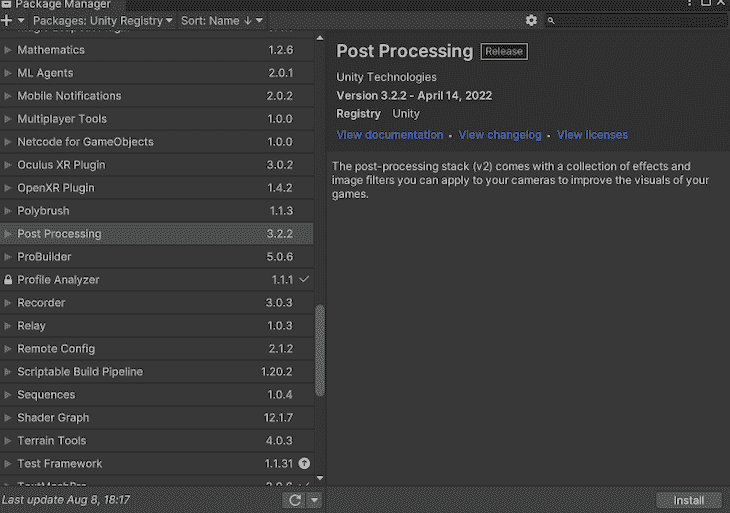

单击窗口右下角的“安装”按钮。

现在我们已经安装了后处理包，我们需要配置我们的游戏和场景来利用这个包。为了实现这一点，我们将需要一个[后处理体积组件](https://docs.unity3d.com/Packages/com.unity.postprocessing@3.0/manual/Quick-start.html)来确定我们将应用效果的区域。所以让我们建造一个。

选择您的主摄像机。在默认选项卡中，我们必须创建一个新层，将其命名为`post-process layer`，并将其指定为默认层，如下所示:

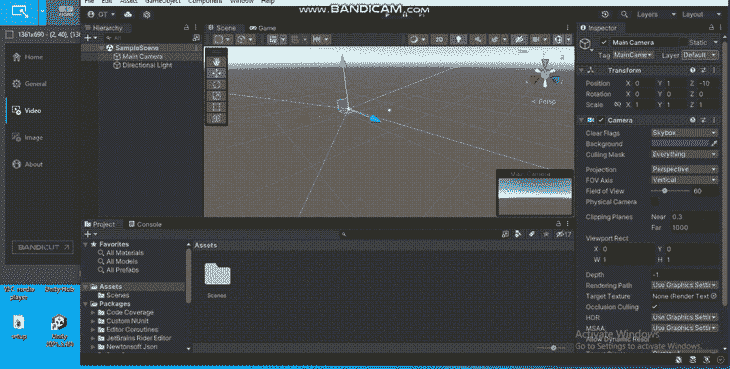

接下来，向下滚动，点击“添加组件”按钮，搜索我们在上一步创建的`post-process`层，并选择它。这将允许我们添加的每个效果都是可见的。

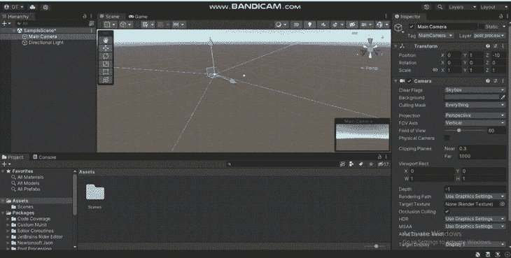

完成后，我们将再次单击“Add Component”按钮，创建一个后处理卷组件。

勾选“是全局”框，将此组件设置为全局；这将使应用于我们场景的效果在整个屏幕上可见。

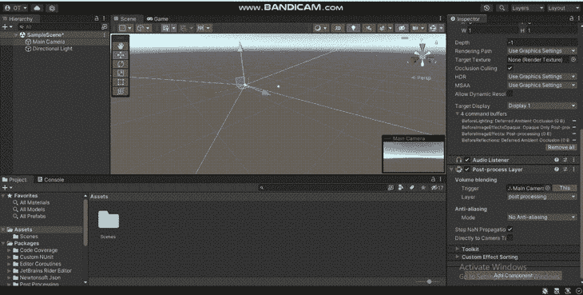

勾选此框后，现在让我们点击`new`按钮创建一个新的配置文件。然后我们可以继续添加我们想要的效果。

### 在 URP 和 HDRP 设置后处理

由于 URP 和 HDRP 有相似的工作流程，我们将只研究如何在 URP 设置后处理。我将创建一个 [3D URP 样本场景](https://blog.logrocket.com/2d-3d-raycasting-unity/)，这样我们可以在下一节用它来解释后期处理效果工具。

首先，让我们创建一个带有体积组件的游戏对象。我们的音量有不同的选项。

全局体积将效果应用于整个屏幕，而长方体、球体和网格体积在其各自的形状中定义边界，并在相机进入边界时应用后期处理效果。

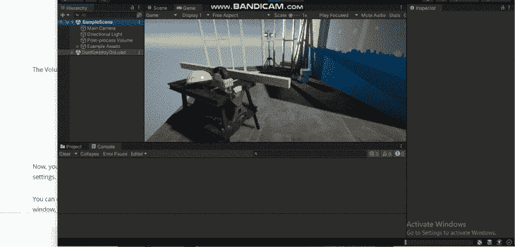

创建之后，我们的卷的检查器选项卡应该如下所示:

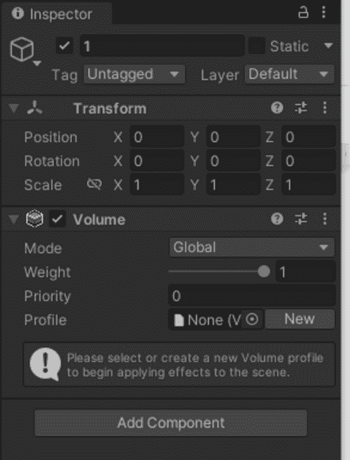

然后，我们需要创建一个体积配置文件，它就像一个容器，用于保存您的后期处理效果及其设置。正如你在上面的图片中看到的，你需要这个体积配置文件来开始应用场景效果。

在我们的卷配置文件下的检查器选项卡中，单击“新建”按钮。一旦我们添加了一个卷 *配置文件，我们将单击“添加覆盖”按钮。*

 *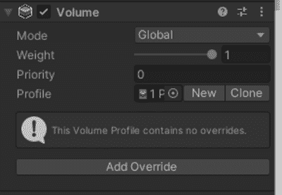

选择“后处理”，我们应该会看到一个效果列表。让我们在下一节看看它们是如何工作的。

## Unity 中的后期处理效果工具

在本节中，我们将探讨 Unity 中的各种后期处理效果工具，以及它们如何影响您的图像。

在我们继续之前，这里是我们的样本图像场景看起来像没有后期处理:

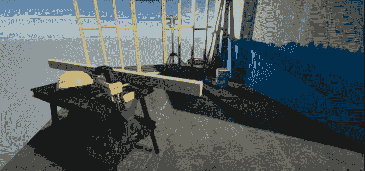

现在让我们给这个示例图像场景添加一些后期处理效果。对于每种效果，您可以修改各种属性以获得您想要的确切外观和感觉。

### 布鲁姆效应

当要让物体发光或看起来更亮时，Bloom 效果就派上用场了。它通过为我们的图像增加更多的光线，使我们的物体中的区域更加明显或突出。如果我们加上布鲁姆效应，就像这样:

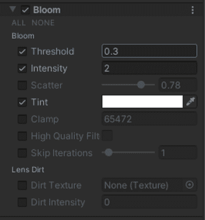

我们将得到下面的结果:

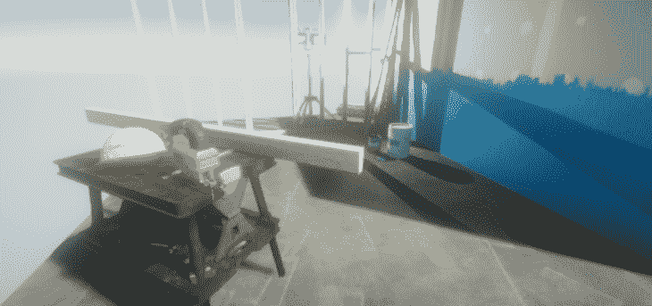

您可以使用 Bloom 效果来给人一种阳光明媚的感觉，或者为一个具有幻想或超凡脱俗主题的游戏。

### 晕影效果

晕影是一种后期处理效果属性，它在显示图像的屏幕周围添加一个黑色边框。这在用低质量相机镜头拍摄的图像中很常见，但现在经常被故意用来添加戏剧性的效果。如果我们给我们的图像添加一个小插图，就像这样:

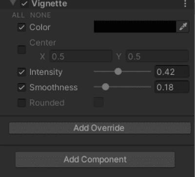

我们将得到以下结果:

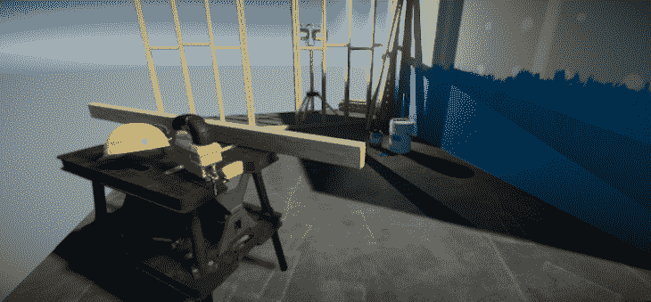

正如你所看到的，晕影效果增加了场景的深度，这可以用在恐怖场景中，因为它增加了一种毛骨悚然的感觉。

### 色差效应

当我们希望我们的场景看起来像是通过一个无法将光线聚集在边缘的镜头拍摄的，我们使用色差效应。如果我们给图像加上色差，就像这样:

我们的结果将如下所示:

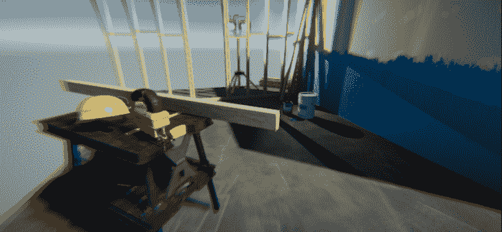

你可能在游戏中看到过类似的效果，你扮演的角色受伤了。

### 景深效果

景深效果会模糊指定距离以外的任何东西，以保持对场景中某些事物的聚焦。这是一种常用的后期处理效果，可以让你的游戏场景看起来更有深度。举个例子，如果我们把它添加到我们的图像中，就像这样:

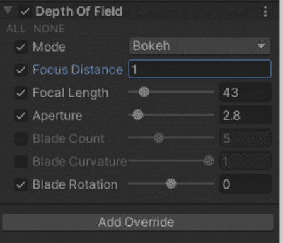

我们将得到下面的结果:

使用这种效果的一个例子是，给人一种非常热的天气的印象，使远处的事物看起来模糊不清。

### 胶片颗粒效应

胶片颗粒效果用于为我们的图像或场景添加粒子状的砂砾，使其看起来像一部老派电影。如果我们给图像添加胶片颗粒效果，就像这样:

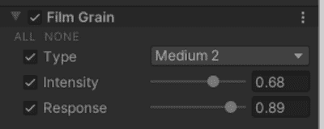

我们将得到以下结果:

我们可以使用胶片颗粒效果的一个例子是，如果我们希望一个场景看起来像一部经典电影。

### 色调映射效应

色调映射效果会重新映射高清晰度范围(HDR)的颜色值，使动态范围较低的场景看起来颜色范围较宽。

换句话说，这种效果扩大了颜色范围，以增加对比度，使场景看起来更真实。

如果我们给图像添加色调映射，如下所示:

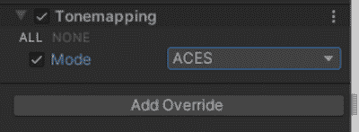

我们的结果将如下所示:

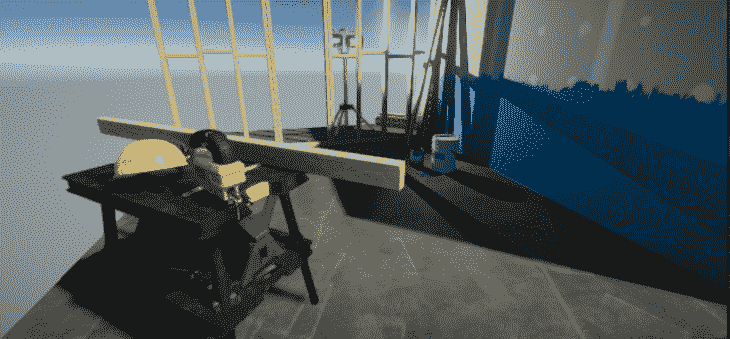

在 Unity 中有两种色调映射模式可供选择。中性色调映射对颜色的影响最小，当您想要更好的颜色校正控制时，这是一个很好的开始。我们在上面使用的 ACES 色调映射是实现更具电影效果的行业标准。

### 白平衡效果

白平衡效果通过改变温度或色调来改变场景的整体色调，同时保持白色区域。如果我们把它添加到我们的图像中，就像这样:

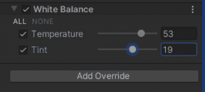

我们将得到下面的结果:

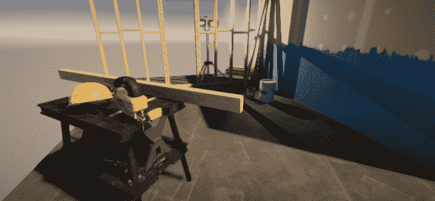

在这种情况下，我们将温度调高，使图像看起来更温暖。如果你想让图像看起来更冷，你可以把温度调得更低。

### 镜头畸变效应

镜头失真效果模拟真实生活中相机镜头造成的失真。使用正确的值，更宽的视野是可能的。如果我们把它添加到我们的图像中，就像这样:

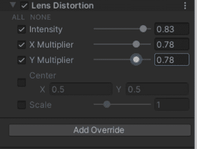

我们的结果将如下所示:

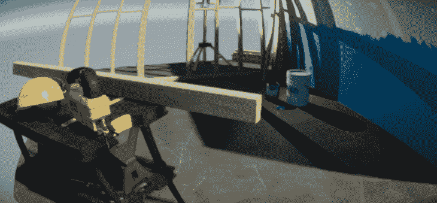

镜头扭曲效果对于水下场景、从鱼的视角发生的场景或狙击手视角的场景非常有用。

## 在 Unity 中组合后处理效果

我们也可以组合两种或多种效果。让我们看看如何通过结合光晕效果和色差效果来实现这一点，如下所示:

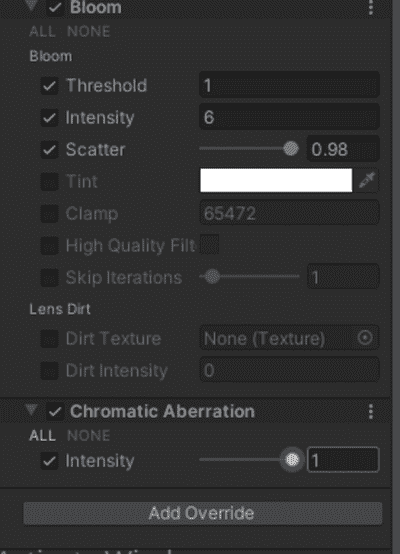

我们的结果将如下所示:

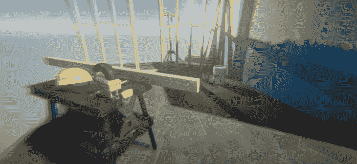

## Unity 中的其他后期处理效果

我们上面回顾的后期处理效果在所有 Unity 渲染管道中都有。还有其他后期处理效果工具我们上面没复习。根据您选择的渲染管道，可用的后期处理效果的数量及其行为可能会有所不同。

你可以查看一下 [Unity 的官方后期处理概述](https://docs.unity3d.com/Manual/PostProcessingOverview.html)来获得可能可用的后期处理效果列表。你也可以阅读关于[优化你的 Unity 项目](https://blog.logrocket.com/optimizing-your-unity-project-debug-log/)和其他有用的文章来帮助你用这个游戏引擎改进游戏。

## 结论

这篇文章谈到了后期处理，以及它在我们的游戏中有多重要。我们还研究了 Unity 中的后期处理工作，演示了示例图像上的各种效果。如果你觉得这有帮助，请分享。

## 使用 [LogRocket](https://lp.logrocket.com/blg/signup) 消除传统错误报告的干扰

[LogRocket](https://lp.logrocket.com/blg/signup) 是一个数字体验分析解决方案，它可以保护您免受数百个假阳性错误警报的影响，只针对几个真正重要的项目。LogRocket 会告诉您应用程序中实际影响用户的最具影响力的 bug 和 UX 问题。

然后，使用具有深层技术遥测的会话重放来确切地查看用户看到了什么以及是什么导致了问题，就像你在他们身后看一样。

LogRocket 自动聚合客户端错误、JS 异常、前端性能指标和用户交互。然后 LogRocket 使用机器学习来告诉你哪些问题正在影响大多数用户，并提供你需要修复它的上下文。

关注重要的 bug—[今天就试试 LogRocket】。](https://lp.logrocket.com/blg/signup-issue-free)*