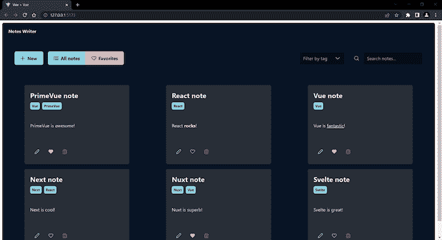
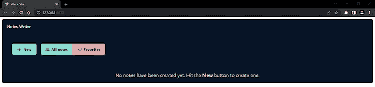
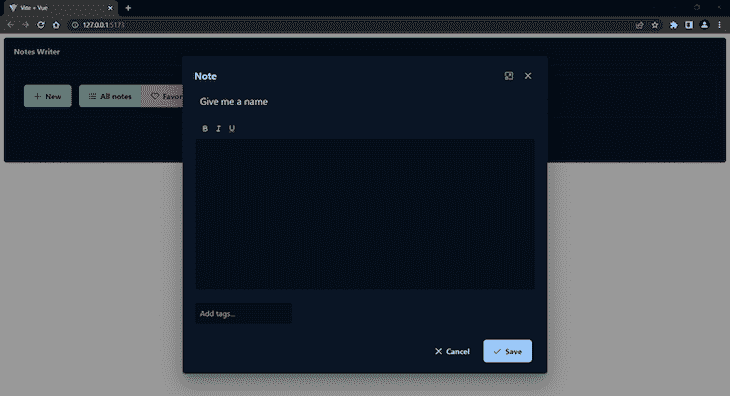
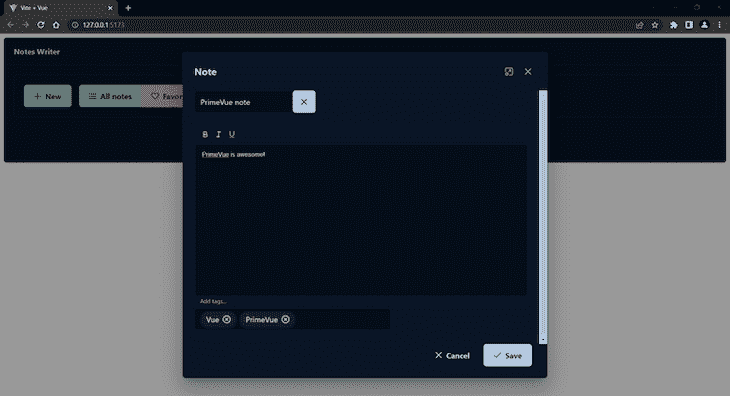
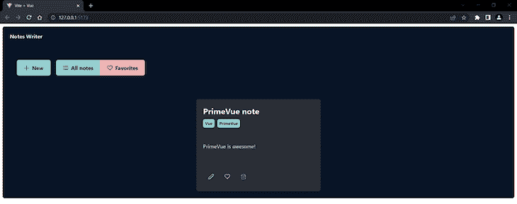
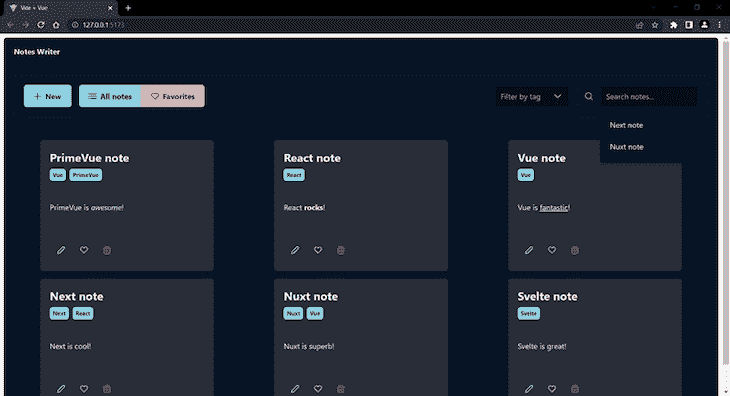
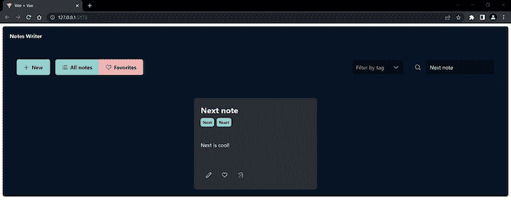
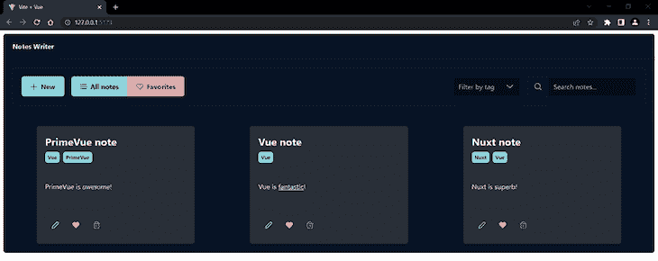

# 探索 PrimeVue，一个基于 Vue 的 UI 组件库

> 原文：<https://blog.logrocket.com/exploring-primevue-vue-based-ui-component-library/>

使用基于组件的前端使得开发 web 应用程序更加容易和易于管理。开发人员可以使用 Vue.js、React 和 Angular 等框架在几个小时内构建一个像样的应用程序。

此外，开发人员通常使用带有预制组件的 UI 库，如 Vuetify，以进一步加快和简化开发过程。

在本教程中，我们将探索一个最好的基于 Vue 的 UI 组件库 PrimeVue，以及如何使用它与 Vue 3 一起创建一个示例应用程序。我们将涵盖:

## 什么是 PrimeVue？

PrimeVue 是 PrimeTek 提供的[开源 UI 组件库家族的一员。](https://www.primetek.com.tr/)

除了 PrimeVue 组件库，PrimeTek 还提供了 Java (PrimeFaces)、Angular (PrimeNG)和 [React (PrimeReact)](https://blog.logrocket.com/top-11-react-ui-libraries-kits/#primereact) 的版本。这很好，因为您可以从一个框架切换到另一个框架，并且仍然可以使用几乎相同的组件。

PrimeVue 提供了一组丰富的超过 90 个响应 UI 组件，足以覆盖广泛的用例。它还提供了一些独特的组件，比如基于文本的用户界面的[终端，以及导航组件](https://www.primefaces.org/primevue/terminal)的 [Dock。](https://www.primefaces.org/primevue/dock)

PrimeVue 的另一个好处是它是设计不可知的，所以你不会受限于材料或类似自举的风格。你可以为你的应用程序选择大量不同的主题，或者你可以创建自己的主题。

PrimeVue 为每个组件提供了很好的文档，并提供了选项 API 和组合 API 的专用示例。文档简短、清晰，易于理解。

## 探索 PrimeVue 生态系统

PrimeVue 在主库中添加了一些很棒的东西，包括 PrimeIcons、PrimeFlex、主题设计器、模板和块。让我们更详细地看一下每一项。

### 原始图标

[PrimeIcons 是一组](https://github.com/primefaces/primeicons)超过 200 个常用图标，你可以在所有的 Prime UI 库中使用。多亏了 PrimeIcons，你不需要添加像 Font Awesome 这样的[第三方包来访问和显示你的应用程序中的图标。](https://blog.logrocket.com/font-awesome-icons-vue-js-complete-guide/)

### PrimeFlex

[PrimeFlex 是一个 CSS 实用程序库](https://www.primefaces.org/primeflex/)，类似于 TailwindCSS。它是 PrimeVue 的完美搭配。

一般来说，大多数 UI 库(包括 PrimeVue)的组件都有或多或少固执己见的风格，这通常很难调整。这就是像 PrimeFlex 这样的库可以提供帮助的地方。

实用程序类使您能够快速轻松地调整或更改组件的外观。另外，PrimeFlex 可以与 PrimeVue 和该系列的其他产品无缝集成。

### 主题设计师

主题设计器是一个基于网络的工具，它可以让你完全控制组件在你的应用中的外观。如果你不想使用 PrimeFlex，那么 [PrimeVue 视觉主题设计器](https://www.primefaces.org/designer/primevue)可以帮助你创造你想要的外观和感觉。

这个方便的工具[需要许可证](https://www.primefaces.org/designer/licenses)才能使用它的所有特性。

### 模板

你可以从一个[模板集合](https://www.primefaces.org/store/templates.xhtml)中为你的 Vue 应用选择。虽然这些模板很方便，但大多数 PrimeVue 模板仅供购买，起价约为 19 美元。

### 素数块

PrimeVue 的 PrimeBlocks 是 350 多个现成 UI 块的集合，比如布局、导航、表单、页面等。虽然有一些免费的块，你将需要一个许可证来访问完整的集合。

注意，最后三种资源——主题设计器、模板和质数块——大部分是付费的。然而，你可以通过 PrimeVue 实现很多功能，而不需要为额外的功能付费。

现在，当我们很好地理解了 PrimeVue 是什么以及它提供了什么好东西时，让我们来探索如何使用这个库的组件。

## PrimeVue 和 Vue 3 入门

首先，我们将使用 [Vite 搭建一个新的 Vue 项目](https://blog.logrocket.com/getting-started-with-vite/)。在您的终端中运行以下命令:

```
npm create [email protected]

```

在[按照提示完成搭建](https://vitejs.dev/guide/#scaffolding-your-first-vite-project)之后，导航到项目并安装依赖项:

```
cd your-project
npm install

```

现在，让我们通过运行以下命令将 PrimeVue、PrimeIcons 和 PrimeFlex 添加到项目中:

```
npm install [email protected]^3.15.0 
npm install primeicons 
npm install primeflex

```

接下来，让我们看一个导入 PrimeVue 组件的例子。打开`main.js`并用以下内容替换其内容:

```
import {createApp} from 'vue'
import App from './App.vue'

import PrimeVue from 'primevue/config'  // import PrimeVue

// import CSS resources
import 'primevue/resources/primevue.min.css'            // core 
import 'primevue/resources/themes/saga-blue/theme.css'  // theme
import 'primeicons/primeicons.css'                      // icons
import '/node_modules/primeflex/primeflex.css'          // PrimeFlex

import Button from 'primevue/button'  // import Button component

const app = createApp(App)  // create new Vue app

app.use(PrimeVue)  // register PrimeVue

app.component('Button', Button)  // register Button component

app.mount('#app')  // mount the app

```

现在你可以像这样使用 Vue 模板中的 [PrimeVue](https://www.primefaces.org/primevue/button) `[Button](https://www.primefaces.org/primevue/button)` [组件](https://www.primefaces.org/primevue/button):

```
<Button label="Submit" />

```

这就是使用 PrimeVue 组件的简单之处。只需导入并注册它们，就可以使用了。

注意，要获得对 PrimeFlex 实用程序类的代码补全和代码片断支持，可以安装 VS 代码的官方扩展[。](https://marketplace.visualstudio.com/items?itemName=yigitfindikli.primeflexsnippets)

## 用 PrimeVue 和 Vue 3 构建一个简单的笔记应用

在本节中，我们将通过构建一个简单的笔记应用程序来进一步探索 PrimeVue 组件。

这是我们将要构建的预览:



用户将能够创建、编辑和删除笔记。每个笔记将包含一个标题、一些内容和一个或多个标签。

我们还将添加使用搜索栏搜索笔记和通过标签过滤笔记的功能，以及将笔记添加到“收藏夹”集合的能力，可以独立浏览。

### 导入和注册 PrimeVue 组件

对于这个应用程序，我们将使用一堆 PrimeVue 组件。要导入并注册这些组件，用以下内容替换`main.js`文件的内容:

```
import { createApp } from 'vue'
import App from './App.vue'

import PrimeVue from 'primevue/config'

import 'primevue/resources/primevue.min.css'
import 'primevue/resources/themes/lara-dark-blue/theme.css'
import 'primeicons/primeicons.css' 
import '/node_modules/primeflex/primeflex.css'

import Panel from 'primevue/panel'
import Toolbar from 'primevue/toolbar'
import Button from 'primevue/button'
import Dropdown from 'primevue/dropdown'
import AutoComplete from 'primevue/autocomplete'
import Card from 'primevue/card'
import Tag from 'primevue/tag'
import Dialog from 'primevue/dialog'
import Inplace from 'primevue/inplace'
import InputText from 'primevue/inputtext'
import Editor from 'primevue/editor'
import Chips from 'primevue/chips'

import Tooltip from 'primevue/tooltip'

const app = createApp(App)

app.use(PrimeVue)

app.component('Panel', Panel)
app.component('Toolbar', Toolbar)
app.component('Button', Button)
app.component('Dropdown', Dropdown)
app.component('AutoComplete', AutoComplete)
app.component('Card', Card)
app.component('Tag', Tag)
app.component('Dialog', Dialog)
app.component('Inplace', Inplace)
app.component('InputText', InputText)
app.component('Editor', Editor)
app.component('Chips', Chips)

app.directive('tooltip', Tooltip)

app.mount('#app')

```

在上面的代码中，我们添加了所有必要的组件，加上`Tooltip`指令。

下一步是将`components`目录下的`HelloWord.vue`文件重命名为`NotesWriter.vue`。然后，编辑`App.vue`文件以反映更改后的文件名:

```
<script setup>
// This starter template is using Vue 3 <script setup> SFCs
// Check out https://vuejs.org/api/sfc-script-setup.html#script-setup
import NotesWriter from './components/NotesWriter.vue'
</script>
<template>
  <NotesWriter />
</template>

```

现在，我们准备开始有趣的部分。

### 设置我们的应用程序

打开`NotesWriter.vue`文件，将其内容替换为以下内容:

```
><script setup>
import { ref, reactive, computed, onMounted, watchEffect } from 'vue'

// Local storage setup
const STORAGE_KEY = 'notes'
const notes = ref(JSON.parse(localStorage.getItem(STORAGE_KEY) || '[]'))
watchEffect(() => {
  localStorage.setItem(STORAGE_KEY, JSON.stringify(notes.value))
})

// Get current state
const currentNotes = ref()
const currentNote = reactive({
  id: null,
  title: 'Give me a name',
  content: '',
  tags: [],
  fav: false
})

// Get notes
onMounted(() => {
  allNotes()
})
function allNotes() {
  currentNotes.value = notes.value
}
function favNotes() {
  currentNotes.value = notes.value.filter((note) => note.fav === true)
}

// Dialog logic
const displayDialog = ref(false)
function openDialog() {
  displayDialog.value = true
}
function closeDialog() {
  displayDialog.value = false
}

</script>

```

在上面代码的开始，我们导入了所有我们需要的 Vue 函数和工具。

然后，我们为笔记设置本地存储。将从本地存储中提取注释，供用户查看或编辑。然后，通过使用`watchEffect`功能，存储器将根据变化进行更新。

每当函数的任何依赖项发生变化时，`watchEffect`函数就会运行。在我们的例子中，依赖项是`notes`数组。

* * *

### 更多来自 LogRocket 的精彩文章:

* * *

接下来，我们定义了两个变量:`currentNotes`将用于显示当前过滤的笔记集合，而`currentNote`将在我们创建或编辑单个笔记时使用。

在下一节中，我们使用`onMounted` hook 在组件安装上加载注释。

使用`allNotes`函数，我们可以将`notes`分配给`currentNotes`，这样我们就可以渲染所有创建的笔记。使用`favNotes`函数，我们可以过滤`notes`数组以获得所有按键设置为`true`的音符，然后将结果分配给`currentNotes`，这样我们就可以在“收藏夹”集合中呈现它们。

代码的最后一部分设置了`Dialog`组件的逻辑，我们将使用它来创建和编辑注释。

现在，让我们添加组件模板。

### 添加 PrimeVue 组件模板

将以下代码放在脚本标记之后:

```
<template>
  <div>
    <Panel header="Notes Writer">
      <Toolbar class="mb-6">
        <template #start>
          <Button class="mr-3" label="New" icon="pi pi-plus" @click="addNote" />
          <span class="p-buttonset">
            <Button class="p-button-success" label="All notes" icon="pi pi-list" @click="allNotes" />
            <Button class="p-button-danger" label="Favorites" icon="pi pi-heart" @click="favNotes" />
          </span>
        </template>
        <template #end>
          <!-- Add filter and search functionality here later on -->
        </template>
      </Toolbar>
      <div class="flex flex-wrap justify-content-around gap-3">
        <div class="text-xl" v-if="!notes.length">No notes have been created yet. Hit the <b>New</b> button to create one.</div>
        <Card class="w-3 bg-bluegray-900 shadow-4" v-for="(note, index) in currentNotes" :key="index">
          <template #title>
            {{ note.title }}
          </template>
          <template #subtitle>
            <Tag class="mr-2" :value="tag" v-for="tag in note.tags"></Tag>
          </template>
          <template #content>
            <div class="overflow-hidden max-h-5rem" v-html="note.content"></div>
          </template>
          <template #footer>
            <Button class="p-button-rounded p-button-text" v-tooltip.bottom="'Edit'" icon="pi pi-pencil" @click="editNote(note)" />
            <Button class="p-button-rounded p-button-text p-button-danger" v-tooltip.bottom="'Add to Favorites'" :icon="note.fav ? 'pi pi-heart-fill' : 'pi pi-heart'" @click="note.fav = !note.fav" />
            <Button class="p-button-rounded p-button-text text-red-500" v-tooltip.bottom="'Delete'" icon="pi pi-trash" @click="removeNote(note)" />
          </template>
        </Card>
      </div>
    </Panel>
    <!-- Add Dialog component here later on -->
  </div>
</template>

```

在上面的代码中，我们[将我们的应用程序包装成一个](https://www.primefaces.org/primevue/panel) `[Panel](https://www.primefaces.org/primevue/panel)` [组件](https://www.primefaces.org/primevue/panel)，并使用`header`属性设置应用程序的标题。然后，我们使用一个`[Toolbar](https://www.primefaces.org/primevue/toolbar)` [组件来添加必要的按钮](https://www.primefaces.org/primevue/toolbar)。

我们通过使用 PrimeFlex 实用程序类(`mb-6`)给工具栏添加了一些底部空白。这将在工具栏和注释之间增加一些空间。

`Toolbar`组件有两个槽，`start`和`end`，分别用来定位左边和右边的工具栏元素。我们在这里使用了`start`插槽来添加一个创建新笔记的按钮，以及一个用于“所有笔记”和“收藏夹”按钮的按钮集。

要使用 PrimeIcons，我们需要为特定组件添加`icon`属性，并按照以下模式设置其值:`pi pi-[icon-name]`。在本例中，我们这样设置第一个按钮组件的图标:`pi pi-plus`。

对于每个按钮，我们将相应的功能分配给`click`事件处理程序。

我们将在下一节创建`addNote`按钮。稍后我们还将使用`Toolbar`组件的`end`插槽来添加搜索和过滤笔记的输入。

在处理了上面代码中的按钮之后，我们为笔记使用了一个包装`div`，它使用 [flex 实用程序类](https://www.primefaces.org/primeflex/flexwrap)来正确地样式化笔记。然后，我们有另一个`div`,如果还没有创建笔记(即，如果`notes`数组为空),它会显示一条消息。

接下来，我们使用一个`[Card](https://www.primefaces.org/primevue/card)` [组件](https://www.primefaces.org/primevue/card)来表示单个音符。我们可以迭代`currentNotes`并使用卡片的插槽(`title`、`subtitle`、`content`、`footer`)来填充笔记的数据，使用`[Tag](https://www.primefaces.org/primevue/tag)` [组件](https://www.primefaces.org/primevue/tag)来呈现笔记的标签，使用`v-html`指令将笔记的内容显示为 HTML。

最后，我们使用`Tooltip`指令为每个按钮添加一个提示。对于“添加到收藏夹”按钮，我们使用一个三元运算符来检查 note 的`fav`值，并相应地设置适当的图标。每次点击时，纸币的`fav`值从`true`变为`false`，反之亦然。

我在上面的模板中使用了一些实用程序类来使设计更加令人愉快。PrimeVue 也使用它自己的类，您可以通过前缀`p`来识别它——例如，在`p-buttonset`中。

让我们看看到目前为止我们做了什么。使用以下命令运行项目:

```
npm run dev

```

当您访问应用程序的地址( [http://127.0.0.1:5173/](http://127.0.0.1:5173/) )时，您应该会在浏览器窗口中看到以下内容:



相当酷！

### 创建用于添加、编辑、保存和删除注释的功能

在`script`标签中添加以下内容:

```
// Notes actions 
const isNewNote = ref(false)
function addNote() {
  isNewNote.value = true
  currentNote.id = Date.now()
  currentNote.title = 'Give me a name'
  currentNote.content = ''
  currentNote.tags = []
  currentNote.fav = false
  openDialog()
}
function editNote(note) {
  currentNote.id = note.id
  currentNote.title = note.title
  currentNote.content = note.content 
  currentNote.tags = note.tags
  currentNote.fav = note.fav
  openDialog()
}

```

这里，我们首先设置一个`isNewNote`变量，它将用于定义我们是创建一个新的注释还是编辑一个现有的注释。

接下来，在`addNote`函数中，我们用初始值设置`currentNote`，然后打开对话框。我们还将`isNewNote`设置为`true`，以表明我们想要创建一个新的便笺。

在`editNote`功能中，我们将已编辑笔记的数据分配给了`currentNote`，这样当我们打开对话框时，它将显示已编辑笔记的数据。

让我们添加其余的动作:

```
function saveNote() {
  if (isNewNote.value === false) {
    let note = notes.value.find((note) => note.id === currentNote.id)
    let editedNote = Object.assign({}, currentNote)
    notes.value.splice(notes.value.indexOf(note), 1, editedNote)
    currentNotes.value[currentNotes.value.indexOf(note)] = editedNote
  } else {
    let newNote = Object.assign({}, currentNote)
    notes.value.push(newNote)
    isNewNote.value = false
  }
  closeDialog()
}
function removeNote(note) {
  if (currentNotes.value === notes.value) {
    notes.value.splice(notes.value.indexOf(note), 1)
  } else {
    notes.value.splice(notes.value.indexOf(note), 1)
    currentNotes.value.splice(currentNotes.value.indexOf(note), 1)
  }
}

```

上面的`saveNote`函数首先检查我们是否保存了编辑过的笔记——换句话说，如果`isNewNote`的值是`false`。如果是这样，我们通过使用`currentNote.id`来获取注释。然后我们用`Object.assign()`克隆`currentNote`。

我们这样做是为了打破`currentNote`和编辑过的笔记之间的联系。它们之所以链接是因为[在 JavaScript 中，对象是通过引用](https://blog.logrocket.com/copy-objects-in-javascript-complete-guide/)复制的；当我们编辑源对象时，复制的对象也被更新，反之亦然。

然后我们更新了我们的`notes`和`currentNotes`数组。我们需要更新这两者，以便当我们看到所有笔记以及过滤的笔记时，更改是可见的。

如果我们保存一个新的笔记，我们把它推到`notes`数组，并把`isNewNote`设置回`false`。

在`removeNote`函数中，我们检查`currentNotes`和`notes`是否相等。如果是这样，我们只需要更新`notes`。如果没有，我们需要更新`notes`和`currentNotes`，原因与上面提到的`saveNote`功能相同。

### 在我们的笔记编辑界面中使用 PrimeVue 组件

在下一节中，我们将使用`[Editor](https://www.primefaces.org/primevue/editor)` [组件](https://www.primefaces.org/primevue/editor)，它依赖于 [Quill 文本编辑器](https://quilljs.com/)。我们需要先安装它，所以停止应用程序并运行以下内容:

```
npm install quill

```

现在使用`npm run dev`命令再次运行该应用程序。

太好了！现在让我们添加对话框的代码。在`Panel`组件后添加以下内容:

```
<Dialog header="Note" v-model:visible="displayDialog" :breakpoints="{'960px': '75vw', '640px': '90vw'}" :style="{width: '50vw'}" :maximizable="true" :modal="true">
  <Inplace :closable="true">
    <template #display>
      <span class="text-xl">{{ currentNote.title }}</span>
    </template>
    <template #content>
      <InputText v-model="currentNote.title" />
    </template>
  </Inplace>
  <Editor class="my-4" v-model="currentNote.content" editorStyle="height: 320px">
    <template #toolbar>
      <span class="ql-formats">
        <button class="ql-bold" v-tooltip.bottom="'Bold'"></button>
        <button class="ql-italic" v-tooltip.bottom="'Italic'"></button>
        <button class="ql-underline" v-tooltip.bottom="'Underline'"></button>
      </span>
    </template>
  </Editor>
  <span class="p-float-label">
    <Chips v-model="currentNote.tags" separator="," /> 
    <label for="chips">Add tags...</label>
  </span>
  <template #footer>
    <Button class="p-button-text" label="Cancel" icon="pi pi-times" @click="closeDialog" />
    <Button label="Save" icon="pi pi-check" @click="saveNote" />
  </template>
</Dialog>

```

这里，我们使用了`[Dialog](https://www.primefaces.org/primevue/dialog)` [组件](https://www.primefaces.org/primevue/dialog)来添加注释的编辑界面。它将打开一个模态窗口，我们可以在其中编辑笔记的标题、内容和标签。我们正在用这个组件做一些事情:

*   使用`displayDialog`变量打开或关闭对话框
*   通过添加一些断点来使对话框具有响应性
*   将`modal`和`maximizable`属性设置为`true`

我们还使用了`[Inplace](https://www.primefaces.org/primevue/inplace)` [组件](https://www.primefaces.org/primevue/inplace)以及`[InputText](https://www.primefaces.org/primevue/inputtext)` [组件](https://www.primefaces.org/primevue/inputtext)进行标题编辑。这允许用户通过简单地点击标题来编辑标题，然后在完成时点击关闭按钮。

然后，我们为笔记的内容使用了一个`Editor`组件。我们只添加了三个格式按钮，对于简单的笔记来说已经足够了。

接下来，我们创建了一个`[float-label](https://www.primefaces.org/primevue/floatlabel)` [输入](https://www.primefaces.org/primevue/floatlabel)，在这里我们可以使用`[Chips](https://www.primefaces.org/primevue/chips)` [组件](https://www.primefaces.org/primevue/chips)为我们的笔记添加标签。要添加标签，我们需要用逗号分隔它们。

最后，我们在页脚中添加了两个按钮，分别用于`Cancel`便笺创建和`Save`已创建的便笺。

下面是我们创建新注释时,`Dialog`组件的样子:



当我们编辑笔记时:



以下是创建的便笺的外观:



现在，我们可以使用我们的应用程序创建任意多的笔记。然而，随着我们添加笔记，找到您需要的笔记将变得更加困难。这就是为什么构建应用程序的最后一步是添加搜索和过滤功能。

### 添加搜索和过滤功能

将以下代码添加到脚本标记中:

```
// Filter notes logic
const selectedTag = ref()
const tags = computed(() => {
  let allTags = []
  notes.value.map((note) => allTags = allTags.concat(note.tags))
  let uniqueTags = [...new Set(allTags)]
  return uniqueTags 
})
function filterNotes() {
  currentNotes.value = notes.value.filter((note) => note.tags.includes(selectedTag.value))
}

```

这里，我们创建了一个名为`tags`的计算常量，它从所有笔记中获取所有标签，然后通过创建一个新的`Set()`来删除重复的标签，这个新的`Set()`只能包含唯一的条目。

然后，我们定义了一个`filterNotes`函数，它允许我们获取所有带有选定标签的笔记。

现在，在工具栏组件的`#end`模板中添加以下内容:

```
<template #end>
  <div class="flex">
    <Dropdown class="mr-3" v-model="selectedTag" :options="tags" placeholder="Filter by tag" @change="filterNotes" @blur="selectedTag = ''" />
  </div>
</template>

```

这里，我们使用了一个`[Dropdown](https://www.primefaces.org/primevue/dropdown)` [组件](https://www.primefaces.org/primevue/dropdown)来允许我们选择我们想要的标签。在`@blur`上，我们将`selectedTag`设置为空字符串，因此输入将被清除。

接下来，在`script`标签中添加以下内容:

```
// Search notes logic
const foundNotes = ref()
function searchNote(event) {
  setTimeout(() => {
    if (event.query.trim().length) {
      foundNotes.value = notes.value.filter((note) => {
        return note.title.toLowerCase().startsWith(event.query.toLowerCase())
      })
    }
  }, 250)
}
const selectedNote = ref()
function searchNotes() {
  currentNotes.value = [notes.value.find((note)=>note.title === selectedNote.value.title)]
}

```

在上面的代码中，在我们的`searchNote`函数中，我们首先添加了一个`setTimeout`函数，以便在组件显示搜索结果之前添加一个短暂的延迟。

我们可以使用`searchNote`函数通过使用`event`参数来检查输入查询是否为空。如果输入查询不为空，我们将通过查询过滤注释。

然后我们定义了一个`searchNotes`函数，它允许我们通过标题找到一个笔记，并把它放在一个数组中，我们把这个数组赋给了`currentNotes`。

我们需要做的最后一件事是在模板中添加`AutoComplete`组件，我们将把它添加到`Dropdown`组件之后:

```
<div class="flex">
  <Dropdown class="mr-3" v-model="selectedTag" :options="tags" placeholder="Filter by tag" @change="filterNotes" @blur="selectedTag = ''" />
  <div class="p-inputgroup">
    <span class="p-inputgroup-addon">
      <i class="pi pi-search"></i>
    </span>          
    <AutoComplete placeholder="Search notes..." field="title" v-model="selectedNote" :suggestions="foundNotes" @complete="searchNote($event)" @item-select="searchNotes" @blur="selectedNote = ''" />
  </div>
</div>

```

在上面的代码中，我们使用了一个`[AutoComplete](https://www.primefaces.org/primevue/autocomplete)` [组件](https://www.primefaces.org/primevue/autocomplete)和一个`[InputGroup](https://www.primefaces.org/primevue/inputgroup)` [组件](https://www.primefaces.org/primevue/inputgroup)，它在输入前添加了一个图标。

这是添加了`Dropdown`和`AutoComplete`组件的应用程序的外观:


### 测试和预览应用功能

现在我们已经完成了项目的代码，我们可以测试和预览我们添加的不同特性。下图显示了通过`Vue`标签过滤笔记的结果:


当我们搜索笔记时，我们应该会看到一些建议出现在“搜索笔记…”占位符下:



添加输入查询后，应用程序应该显示找到的注释，如下所示:



点击“收藏夹”按钮后，应用程序应该显示“收藏夹”集合，如下所示:



## 结论

正如我们所见，PrimeVue 是一个组件丰富的 UI 库，它提供了一个完整的 UI 构建解决方案、独特的组件、简单的主题化和优秀的文档。

我们已经构建了一个简单但功能强大的笔记应用程序，它使用了许多 PrimeVue 组件。我们学会了如何将它们结合在一起，为我们的应用程序创建我们想要的功能。

有了这些知识和 PrimeVue 丰富的文档，你就可以开始构建自己更复杂的应用程序了。编码快乐！

## 像用户一样体验您的 Vue 应用

调试 Vue.js 应用程序可能会很困难，尤其是当用户会话期间有几十个(如果不是几百个)突变时。如果您对监视和跟踪生产中所有用户的 Vue 突变感兴趣，

[try LogRocket](https://lp.logrocket.com/blg/vue-signup)

.

[](https://lp.logrocket.com/blg/vue-signup)[https://logrocket.com/signup/](https://lp.logrocket.com/blg/vue-signup)

LogRocket 就像是网络和移动应用程序的 DVR，记录你的 Vue 应用程序中发生的一切，包括网络请求、JavaScript 错误、性能问题等等。您可以汇总并报告问题发生时应用程序的状态，而不是猜测问题发生的原因。

LogRocket Vuex 插件将 Vuex 突变记录到 LogRocket 控制台，为您提供导致错误的环境，以及出现问题时应用程序的状态。

现代化您调试 Vue 应用的方式- [开始免费监控](https://lp.logrocket.com/blg/vue-signup)。