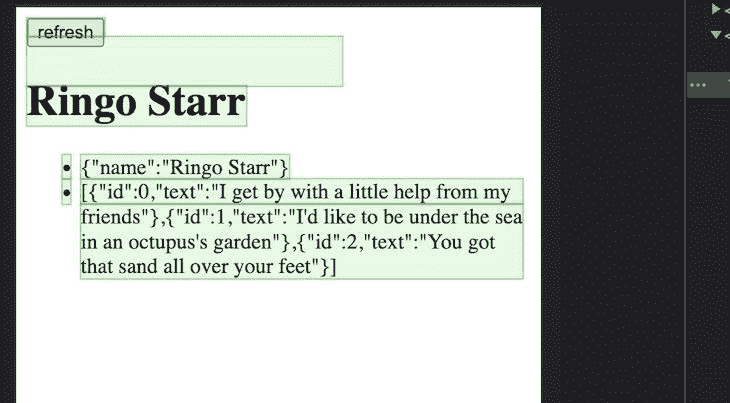
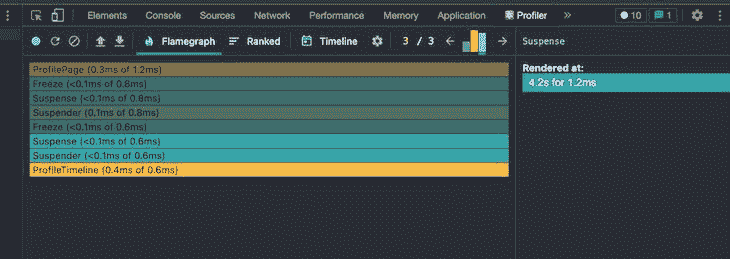

# 探索 React 悬念与 React 冻结日志火箭博客

> 原文：<https://blog.logrocket.com/exploring-react-suspense-react-freeze/>

如果你关注 React，你肯定听说过[React suspension](https://17.reactjs.org/docs/concurrent-mode-suspense.html)，这是一个允许你在 React 项目中优雅地处理加载和渲染数据的组件。在写这篇文章的时候，React 悬疑还在实验阶段。

为了进一步发展 React 悬念背后的想法， [React Freeze](https://github.com/software-mansion/react-freeze) 项目本质上使您能够冻结组件渲染并控制 React 应用程序中实际更新的内容。这种方法适用于 React 本地项目，以及常规的 React web 应用程序。

在本文中，我们将介绍 React Freeze，学习如何在我们的应用程序中使用它。首先，我将介绍 React 悬念，然后在一个演示项目中展示它是如何工作的。接下来，我将展示 React Freeze 如何增强你看到的 React 悬念。

如果你想继续，我在我的[React-suspension-and-Freeze](https://www.github.com/andrewevans0102/react-suspense-and-freeze)GitHub repo 中有 React Suspense 和 React Freeze 实现的例子。我们开始吧！

## 什么是反应悬疑？

React 悬念是一个实验性的概念，在 React 18 中[可用。要安装 React 悬念，我推荐](https://reactjs.org/blog/2022/03/29/react-v18.html#gradually-adopting-concurrent-features)[安装 React 18](https://github.com/reactwg/react-18/discussions/9) 并查看本 Github 线程中的[信息。本质上，React Suspense 允许您通过暂停渲染来优雅地处理加载数据，直到组件的所有部分都准备好显示。](https://github.com/reactwg/react-18/discussions/112)

开发人员在前端开发中面临的一个常见问题是，您可能需要等待 API 调用，或者您可能希望控制向用户显示什么，这样他们就不会看到不完整的数据。React Suspense 提供了一个`suspense`组件，它包括一个在组件加载时显示的`fallback`。

看看下面的例子，它最初是从 CodePen 项目复制而来的[:](https://codesandbox.io/s/frosty-hermann-bztrp?file=/src/fakeApi.js:0-1585)

```
function ProfilePage() {
  return (
    <Suspense
      fallback={<h1>Loading profile...</h1>}
    >
      <ProfileDetails />
      <Suspense
        fallback={<h1>Loading posts...</h1>}
      >
        <ProfileTimeline />
      </Suspense>
    </Suspense>
  );
}
```

正如您在上面的代码中看到的，有一个`<ProfileDetails />`组件和一个`<ProfileTimeline />`组件。

`fallback`是一个基本的`<h1>`元素，只有单词`Loading profile…`和`Loading posts…`。有了这个功能，您不必添加任何条件语句或在代码中使用`useEffect`来验证是否加载了某些东西。

下面的例子[最初是从 React QuickStart 例子](https://codesandbox.io/s/frosty-hermann-bztrp)中复制的，包括一个模仿 API 调用的`suspender`实现。我们使用了很多机制来处理这种活动，比如`try...catch`块，以及 Axios 之类的库。你可以在下面的`fakeApi.js`文件中的`wrapPromise`函数中看到:

```
  function wrapPromise(promise) {
    let status = "pending";
    let result;
    let suspender = promise.then(
      (r) => {
        status = "success";
        result = r;
      },
      (e) => {
        status = "error";
        result = e;
      }
    );
    return {
      read() {
        if (status === "pending") {
          throw suspender;
        } else if (status === "error") {
          throw result;
        } else if (status === "success") {
          return result;
        }
      }
    };
  }

```

包装`<Suspense>`元素用`fallback`元素处理这个调用的结果。

这些概念可能对开发人员非常有用，我很高兴在 React 的未来版本中看到它们。如果你想了解更多关于这个特性开发的信息，请查看 [React 文档](https://reactjs.org/blog/2021/06/08/the-plan-for-react-18.html)。

## 什么是反应冻结？

React Freeze 基于 React suspension 中提出的想法，使您能够暂停组件渲染以获得良好的用户体验。该方法类似于 React Suspense，如您在下面的示例中所见，该示例从 React Freeze GitHub Repo 中复制了[:](https://github.com/software-mansion/react-freeze)

```
function SomeComponent({ shouldSuspendRendering }) {
  return (
    <Freeze freeze={shouldSuspendRendering}>
      <MyOtherComponent />
    </Freeze>
  );
}

```

在上面的例子中，您用一个`<Freeze>`元素包装您的组件。然后将一个`boolean`标志传递给`Freeze`元素，以确定子组件是否被呈现。在 web 应用程序中这样做是有利的，因为您可以控制应用程序的呈现，甚至可以防止不完整的数据被不必要地呈现。

如果您跟随我的示例项目，查看`react-freeze-sample-project`文件夹，您会看到下面的代码:

```
   profileResponse === null ?  
      <h1>Loading profile...</h1> :
      <>
        <button onClick={() => callService()}>refresh</button>
        <Freeze freeze={profileResponse === null}>
          <ProfileDetails user={profileResponse} />
          { postsResponse === null ?
            <h1>Loading posts...</h1> :
            <Freeze freeze={postsResponse === null}>
              <ProfileTimeline posts={postsResponse} />
            </Freeze>
          }
        </Freeze>  
      </>
  );

```

类似于我们对悬念所做的，我们用一个`<Freeze>`元素包装我们的组件，然后决定何时显示它们。我的示例项目非常简单，但是您可以想象这在一个更大的应用程序中是多么有用。

就像有一个`Suspender`机制一样，如果你查看[React Freeze 源代码](https://github.com/software-mansion/react-freeze/blob/main/src/index.tsx)，你会看到渲染实际上是如何处理的:

```
function Suspender({
  freeze,
  children,
}: {
  freeze: boolean;
  children: React.ReactNode;
}) {
  const promiseCache = useRef<StorageRef>({}).current;
  if (freeze && !promiseCache.promise) {
    promiseCache.promise = new Promise((resolve) => {
      promiseCache.resolve = resolve;
    });
    throw promiseCache.promise;
  } else if (freeze) {
    throw promiseCache.promise;
  } else if (promiseCache.promise) {
    promiseCache.resolve!();
    promiseCache.promise = undefined;
  }

  return <Fragment>{children}</Fragment>;
}

```

## 自然反应和冻结反应

您也可以通过[导入`Freeze`元素](https://github.com/software-mansion/react-freeze)在 React 本地应用程序中启用这种行为:

```
import { enableFreeze } from "react-native-screens";

enableFreeze(true);

```

React 本机应用程序使用一个[导航堆栈](https://reactnative.dev/docs/navigation)来处理屏幕，这意味着当用户前进时，前一个屏幕的状态会保存在一个堆栈中以供将来使用。如果使用 React Native 实现 React Freeze，则可以控制在不同屏幕上呈现的内容。

我的示例项目在一个 web 应用程序中只有暂停和冻结实现；如果你想看 React Freeze 和 React Native 的例子，可以查看 Natanaelvich 在 [react-freeze-example](https://github.com/Natanaelvich/react-freeze-example) 的示例项目。

## 可视化冻结和悬念

当我写这篇文章时，我发现 Chrome DevTools 对可视化渲染非常有帮助。如果你打开 Chrome DevTools 并选择**渲染**，你可以选择**绘制闪烁**，这将绘制你的页面部分，如下图所示:



我还推荐在 Chrome 上安装 [React 开发者工具扩展。如果你这样做了，你可以在 Chrome DevTools 中打开它并查看渲染的内容:](https://chrome.google.com/webstore/detail/react-developer-tools/fmkadmapgofadopljbjfkapdkoienihi?hl=en)



## 包扎

在这篇文章中，我们谈到了反应冻结和反应悬念。React 悬念是一个强大的概念，我希望在未来的 React 版本中可以使用。React Freeze 提供了类似概念的可靠实现，可以在 web 和 React 本地应用程序中使用。

要标准化这种行为还有一些工作要做，但是控制呈现内容的策略为 React 项目提供了可靠的用户体验和高性能的实现。我还推荐[查看我的示例项目](https://www.github.com/andrewevans0102/react-suspense-and-freeze)，并使用 Chrome DevTools 来看看它的运行情况。

感谢您阅读我的帖子！在 [andrewevans.dev](https://www.andrewevans.dev/) 上关注我，在 [@AndrewEvans0102](https://twitter.com/AndrewEvans0102) 的 Twitter 上与我联系。

## [LogRocket](https://lp.logrocket.com/blg/react-signup-general) :全面了解您的生产 React 应用

调试 React 应用程序可能很困难，尤其是当用户遇到难以重现的问题时。如果您对监视和跟踪 Redux 状态、自动显示 JavaScript 错误以及跟踪缓慢的网络请求和组件加载时间感兴趣，

[try LogRocket](https://lp.logrocket.com/blg/react-signup-general)

.

[ ](https://lp.logrocket.com/blg/react-signup-general) [](https://lp.logrocket.com/blg/react-signup-general) 

LogRocket 结合了会话回放、产品分析和错误跟踪，使软件团队能够创建理想的 web 和移动产品体验。这对你来说意味着什么？

LogRocket 不是猜测错误发生的原因，也不是要求用户提供截图和日志转储，而是让您回放问题，就像它们发生在您自己的浏览器中一样，以快速了解哪里出错了。

不再有嘈杂的警报。智能错误跟踪允许您对问题进行分类，然后从中学习。获得有影响的用户问题的通知，而不是误报。警报越少，有用的信号越多。

LogRocket Redux 中间件包为您的用户会话增加了一层额外的可见性。LogRocket 记录 Redux 存储中的所有操作和状态。

现代化您调试 React 应用的方式— [开始免费监控](https://lp.logrocket.com/blg/react-signup-general)。