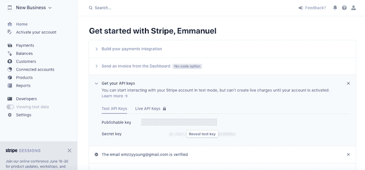
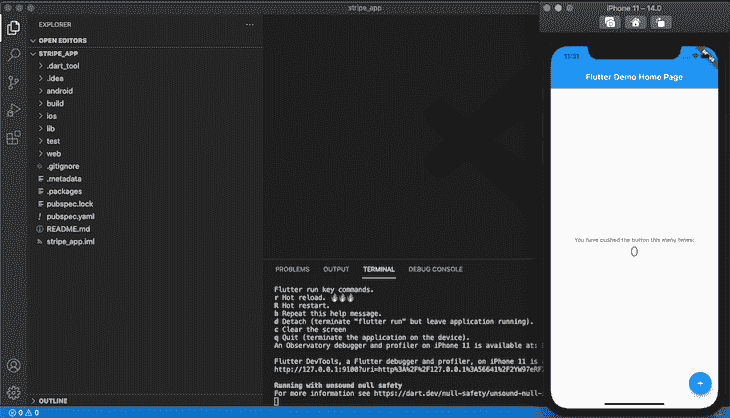
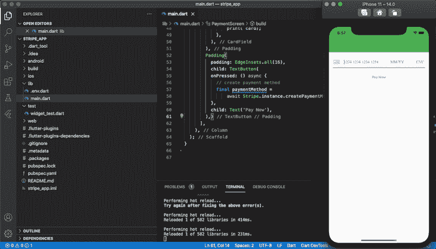
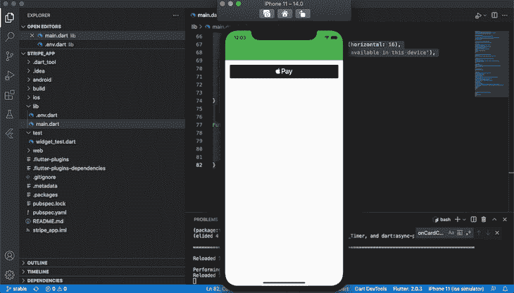
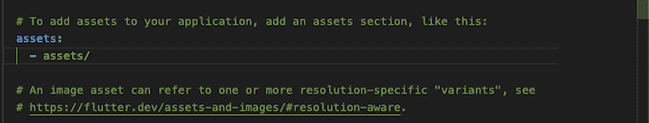

# 探索 Stripe Flutter SDK - LogRocket 博客

> 原文：<https://blog.logrocket.com/exploring-stripe-flutter-sdk/>

Stripe 是一个流行的支付处理器，它使开发者可以轻松地将支付方法集成到移动应用程序中。凭借对 UX 和安全性的高度关注，Stripe 凭借其在购物者和开发者中的受欢迎程度撼动了电子商务行业。

Stripe 为 React Native 发布了一个 [SDK 后不久，Stripe Flutter SDK 就推出了，构建在](https://blog.logrocket.com/exploring-the-new-stripe-react-native-sdk/) [Stripe API](https://stripe.com/docs/api) 的功能之上。在本教程中，我们将通过安装 [Stripe Flutter SDK](https://pub.dev/packages/flutter_stripe) 并将其集成到一个示例应用程序中来探索它。

要跟随本教程，您需要:

*   安装在您机器上的颤振
*   颤振的基本知识
*   熟悉 Dart
*   您机器上安装的 Xcode 或 Android Studio
*   用于测试的 iOS 模拟器或 Android 模拟器
*   代码编辑器，即 VS 代码

我们开始吧！

## 条纹飘动 SDK

让我们来看看 Stripe 的一些特性，我们将使用 Stripe Flutter SDK 将其集成到我们的 Flutter 应用程序中。

### 支付选项

Stripe 最初因支持多种货币简化应用程序中的国际交易而声名狼藉。目前，Stripe 支持多种类型的电子支付。

例如，你可以轻松地将 Apple Pay 和 Google Pay 这样的钱包集成到你的 Flutter 应用程序中。类似地，Stripe 支持大多数流行的信用卡和借记卡，以及 Klarna 和 Afterpay 等现在购买以后支付的方法。

使用重定向和凭证等方法在银行账户之间转移资金非常简单。Stripe 提供了一个支付计划，让您可以轻松添加自己的银行账户信息，并通过您的移动应用程序接收付款。

### 内置用户界面

Stripe 提供了一个原生 UI，可以在 Android 和 iOS 应用程序中安全地接受支付。类似地，SDK 附带了一个预建的 UI，用于接受 Google Pay 和 Apple Pay 中的支付。但是，如果您愿意，您可以轻松地在 Stripe 中构建自己的自定义支付表单。

通过 Stripe 的内置支付门户，您可以设置一次性购买或固定价格订阅。

### 安全性

Stripe 通过将敏感的支付信息发送到自己的服务器而不是主机的后端服务器来保持对安全性的关注，从而简化了数据收集并保持符合支付卡信息(PCI)安全标准。

此外，Stripe 执行 [3D 安全认证](https://stripe.com/docs/payments/3d-secure)以符合欧洲[强客户认证](https://stripe.com/docs/strong-customer-authentication)准则，保护您用户最重要的信息。

## Stripe 入门

如果您没有 Stripe 帐户，首先，[创建一个新帐户](https://dashboard.stripe.com/register)。您需要从您的帐户获取个人访问密钥。前往**开发者**部分，在 **API 键**下查找，如下图所示:



## 构建一个颤动条纹应用程序

有了个人访问密钥，我们将建立一个新的 Flutter 项目并安装 Stripe Flutter SDK 包。

导航到您的工作目录，添加下面的代码来初始化一个新的 Flutter 项目:

```
flutter create stripe_app

```

初始化完成后，打开 Android 模拟器或 iOS 模拟器。导航到`stripe_app`文件夹，使用下面的命令运行应用程序:

```
cd stripe_app && flutter run 

```

您的应用程序应该类似于下面的屏幕截图:



接下来，让我们安装 Stripe Flutter SDK 并开始构建我们的项目。导航到您的目录，将下面的代码复制并粘贴到您的终端中:

```
dart pub add flutter_stripe

```

### 安装要求

为了避免兼容性问题，您应该设置您的项目以匹配下面所需的规范。

#### 机器人

对于 Android 操作系统，您需要以下内容:

*   Android v5.0 (API 级别 21)或更高版本
*   kot Lin 1 . 5 . 0 版或更高版本
*   `Theme.AppCompact`的后裔为您活动
*   `FlutterFragmentActivity`中的`MainActivity.kt`代替了`FlutterActivity`

#### ios

Stripe Flutter SDK 兼容针对 iOS 11 及以上版本的应用。

为了避免构建错误，导航到 iOS 设置并找到`stripePublishableKey` `proj`或`Runner.xcworkspastripe publishable key`。将应用的部署目标设置为`12.0`:


## 构建支付屏幕

要从你的 Flutter 应用程序与 Stripe API 通信，从 Stripe 仪表板复制`stripePublishableKey`，导航到`lib`文件夹，创建一个名为`env. dart`的新文件，并添加下面的代码:

```
const stripePublishableKey =  "your_publishable_key";

```

`stripePublishableKey`常量保存您的键的值。接下来，让我们为我们的应用程序设置卡支付，并为 Apple Pay 和 Google Pay 添加按钮。

### 添加卡支付

Stripe 中最流行的支付方式是信用卡或借记卡。要构建一个基本的卡输入，导航到`lib`文件夹，用下面的代码更新`main. dart`中的代码:

```
// main.dart
import 'package:flutter/material.dart';
import 'package:flutter_stripe/flutter_stripe.dart';
import 'package:stripe_app/.env.dart';
void main() async {
  WidgetsFlutterBinding.ensureInitialized();
  // set the publishable key for Stripe - this is mandatory
  Stripe.publishableKey = stripePublishableKey;
  runApp(App());
}
class App extends StatelessWidget {
  const App({Key key}) : super(key: key);
  @override
  Widget build(BuildContext context) {
    return MaterialApp(
      debugShowCheckedModeBanner: false,
      title: "FLutter tripe",
      theme: ThemeData(
        primaryColor: Colors.green,
      ),
        home: PaymentScreen(),
      );
  }
}
// payment_screen.dart
class PaymentScreen extends StatelessWidget {
  @override
  Widget build(BuildContext context) {
    return Scaffold(
      appBar: AppBar(),
      body: Column(
        children: [
          CardField(
            onCardChanged: (card) {
              print(card);
            },
          ),
          TextButton(
            onPressed: () async {
              // create payment method
              final paymentMethod =
                  await Stripe.instance.createPaymentMethod(PaymentMethodParams.card());
            },
            child: Text('pay'),
          )
        ],
      ),
    );
  }
}

```

在上面的代码块中，我们导入了 Flutter Stripe SDK 和`.env.dart`文件。然后，我们用之前创建的`StripePublishableKey`初始化 Stripe。`PaymentScreen`返回一个支付输入框和按钮的框架。

此时，您的应用程序应该类似于下面的屏幕截图:



### Apple Pay 插件

SDK 内置了对支付插件的支持，包括 Apple Pay 和 Google Pay。下面的代码片段创建了一个`Apple Pay`按钮:

```
// main.dart
import 'package:flutter/material.dart';
import 'package:flutter_stripe/flutter_stripe.dart';
import 'package:stripe_app/.env.dart';
void main() async {
  WidgetsFlutterBinding.ensureInitialized();
  // set the publishable key for Stripe - this is mandatory
  Stripe.publishableKey = stripePublishableKey;
  runApp(App());
}
class App extends StatelessWidget {
  const App({Key key}) : super(key: key);
  @override
  Widget build(BuildContext context) {
    return MaterialApp(
      debugShowCheckedModeBanner: false,
      title: "FLutter tripe",
      theme: ThemeData(
        primaryColor: Colors.green,
      ),
        home: ApplePay(),
      );
  }
}
class ApplePay extends StatefulWidget {
  @override
  _ApplePayState createState() => _ApplePayState();
}
class _ApplePayState extends State<ApplePay> {
  @override
  void initState() {
    Stripe.instance.isApplePaySupported.addListener(update);
    super.initState();
  }
  @override
  void dispose() {
    Stripe.instance.isApplePaySupported.removeListener(update);
    super.dispose();
  }
  void update() {
    setState(() {});
  }
  @override
  Widget build(BuildContext context) {
    return Scaffold(
      appBar: AppBar(),
      body: Column(
        children: [
          if (Stripe.instance.isApplePaySupported.value)
            Padding(
              padding: EdgeInsets.all(16),
              child: ApplePayButton(
                onPressed: _handlePayPress,
              ),
            )
          else
            Padding(
              padding: EdgeInsets.symmetric(horizontal: 16),
              child: Text('Apple Pay is not available in this device'),
            ),
        ],
      ),
    );
  }
}

Future<void> _handlePayPress() async {
  try {

  } catch (e) {
  }
}

```

`ApplePay`类返回一个按钮的脚手架和一个`_handlePayPress`函数，每次按钮被按下时都会触发该函数。回想一下，Stripe Flutter SDK 附带了处理事件和响应的 Dart APIs。然而，你可以创建自定义的事件处理程序，就像我们对`_handlePayPress`方法所做的那样。

现在，您的应用程序应该看起来像下面的截图:



### Google Pay 插件

在我们创建`Google Pay`按钮之前，让我们安装`flutter pay`包:

```
flutter pub add pay

```

在`Installation complete`上，用下面的代码替换`main.dart`中的代码，创建 Google Pay 按钮:

```
// main.dart
import 'package:flutter/material.dart';
import 'package:flutter_stripe/flutter_stripe.dart';
import 'package:pay/pay.dart';
import 'package:stripe_app/.env.dart';
import 'package:pay/pay.dart' as pay;
const _paymentItems = [
  pay.PaymentItem(
    label: 'Total',
    amount: '108.99',
    status: pay.PaymentItemStatus.final_price,
  )
];
void main() async {
  WidgetsFlutterBinding.ensureInitialized();
  // set the publishable key for Stripe - this is mandatory
  Stripe.publishableKey = stripePublishableKey;
  runApp(App());
}
class App extends StatelessWidget {
  const App({Key key}) : super(key: key);
  @override
  Widget build(BuildContext context) {
    return MaterialApp(
      debugShowCheckedModeBanner: false,
      title: "FLutter tripe",
      theme: ThemeData(
        primaryColor: Colors.green,
      ),
        home: GooglePay(),
      );
  }
}
class GooglePay extends StatefulWidget {
  @override
  _GooglePayState createState() => _GooglePayState();
}
class _GooglePayState extends State<GooglePay> {
  @override
  void initState() {
    Stripe.instance.isApplePaySupported.addListener(update);
    super.initState();
  }
  @override
  void dispose() {
    Stripe.instance.isApplePaySupported.removeListener(update);
    super.dispose();
  }
  void update() {
    setState(() {});
  }
  @override
  Widget build(BuildContext context) {
    return Scaffold(
      appBar: AppBar(),
      body: Column(
        children: [
          if (Stripe.instance.isApplePaySupported.value)
            Padding(
              padding: EdgeInsets.all(16),
              child: GooglePayButton(
              paymentConfigurationAsset: 'google_pay_payment_profile.json',
              paymentItems: _paymentItems,
              style: GooglePayButtonStyle.black,
              type: GooglePayButtonType.pay,
              margin: const EdgeInsets.only(top: 16),
              onPaymentResult: onGooglePayResult,
              loadingIndicator: const Center(
                child: CircularProgressIndicator(),
              ),
                onPressed: () async {
                }
              ),
            )
          else
            Padding(
              padding: EdgeInsets.symmetric(horizontal: 16),
              child: Text('Apple Pay is not available in this device'),
            ),
        ],
      ),
    );
  }
}

Future<void> onGooglePayResult(paymentResult) async {
    try {

  } catch (e) {
  }
  }

```

在上面的代码中，我们导入了之前安装的`pay`包，创建了一个`_paymentItems`常量来保存我们的支付细节，然后将`GoogleButton`中的`paymentItems`的值设置为`_paymentItems`。

向应用程序添加资产需要创建一个新的部分。在项目的根目录下创建一个名为`assets`的新文件夹，然后创建一个名为`google_pay_payment_profile.json`的新文件。最后，启用`pubspec.yaml`中的资产。注意`paymentConfigurationAsset`是必需的:



## 条带化查询和响应操作

Stripe Flutter SDK 具有在通过 Stripe API 发送和接收数据时为特定查询和响应操作调用的函数。

*   `fetchPaymentIntentClientSecret`:从后端返回客户端的秘密
*   `confirmApplePayPayment` **:** 确认苹果支付
*   `confirmPaymentMethod`:通过要求`clientSecret`和付款明细来确认付款方式

## 结论

Stripe Flutter SDK 是一个简单而安全的软件包，用于在您的 Flutter 应用程序中集成和接受支付。在本教程中，我们探索了 Stripe 的特性和功能，了解了是什么让它成为开发人员的热门选择。我们介绍了用 Stripe 设置 Flutter 应用程序的必要步骤，然后为 Apple Pay 和 Google Pay 添加了借记卡支付和按钮。

Stripe Flutter SDK 是您需要在移动应用程序中添加支付选项的最佳选择。我希望你喜欢这个教程！

## 使用 [LogRocket](https://lp.logrocket.com/blg/signup) 消除传统错误报告的干扰

[](https://lp.logrocket.com/blg/signup)

[LogRocket](https://lp.logrocket.com/blg/signup) 是一个数字体验分析解决方案，它可以保护您免受数百个假阳性错误警报的影响，只针对几个真正重要的项目。LogRocket 会告诉您应用程序中实际影响用户的最具影响力的 bug 和 UX 问题。

然后，使用具有深层技术遥测的会话重放来确切地查看用户看到了什么以及是什么导致了问题，就像你在他们身后看一样。

LogRocket 自动聚合客户端错误、JS 异常、前端性能指标和用户交互。然后 LogRocket 使用机器学习来告诉你哪些问题正在影响大多数用户，并提供你需要修复它的上下文。

关注重要的 bug—[今天就试试 LogRocket】。](https://lp.logrocket.com/blg/signup-issue-free)