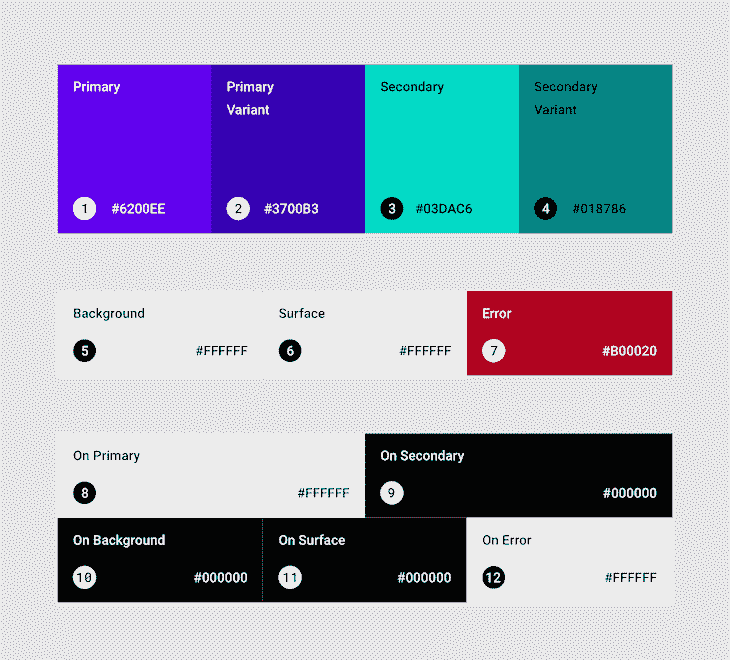
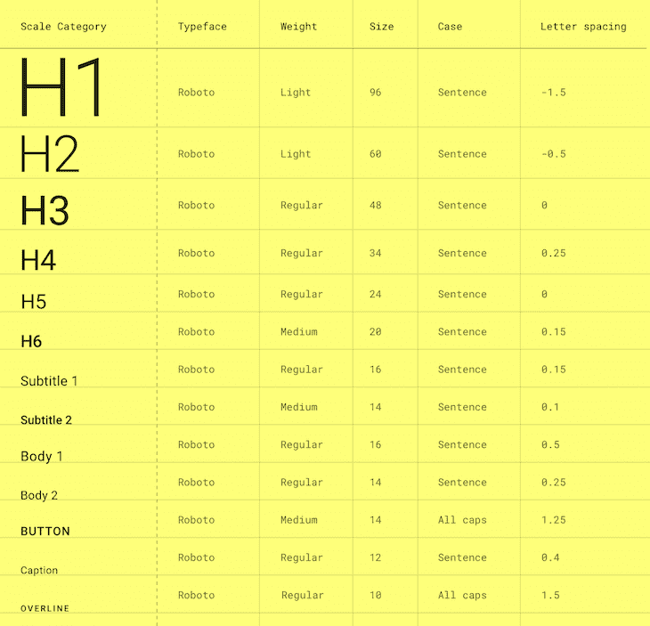
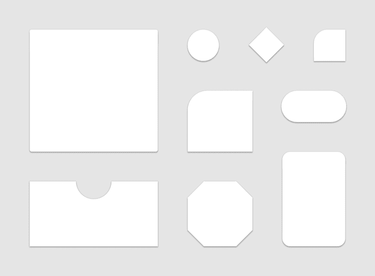

# 探索 Jetpack Compose 中的主题

> 原文：<https://blog.logrocket.com/exploring-theming-jetpack-compose/>

每当讨论用户界面时，考虑主题化总是很重要的。主题化是一种跨应用程序应用相似的视觉和行为属性的方式，使它们独特而统一。

本文关注主题如何在 Jetpack Compose 中工作，Jetpack Compose 是用于 Android 的现代用户界面工具包，并探索其材料主题的内部实现。此外，我们将探索它与 Android View XML 主题风格的互操作性。

## Jetpack Compose 的主题实现

一般来说，主题是由定义共同的视觉和行为概念的系统组成的。这些系统可以包括像颜色或排版这样的东西。

在 Compose 中，提供的主题化，或材料主题化([，因为它是建立在材料设计](https://blog.logrocket.com/definitive-guide-react-material/)的概念上)，由三个主要系统组成——颜色、字体和形状——由一个简单的可组合函数`MaterialTheme`提供。

这将所有用户界面组件(如文本字段和按钮)包装在一个应用程序中，以提供相似的视觉效果和行为。`MaterialTheme`简单定义如下:

```
MaterialTheme(
colors: Colors = …,
typography: Typography = …,
shapes: Shapes = …,
content: @Composable () -> Unit
) {
// app content
}
```

### 材料主题颜色系统

材料主题的颜色系统建立在材料设计颜色系统的基础上。这个系统只是由颜色属性组成，这些颜色属性代表特定的品牌颜色以及与亮暗模式混合的其他颜色。



The [Material Design Color System](https://material.io/design/color/the-color-system.html#color-theme-creation).

上图显示了所有可用的颜色属性。在代码中，它们是这样声明的:

```
class Colors(
    primary: Color,
    secondary: Color,
    background: Color,
    surface: Color,
    error: Color,
    /* ... */
) {
    /* ... */
}

```

要声明每个属性的颜色值，请考虑您的 Android OS 中的系统主题(即，浅色或深色主题)(注意，深色主题是在 Android 10 (API 级别 29)中引入的)。选择亮暗主题写在下面:

```
fun lightColors(
    primary: Color = Color(0xFF6200EE),
    primaryVariant: Color = Color(0xFF3700B3),
    background: Color = Color.White,
    /* ... */
): Colors = Colors(
    primary,
    primaryVariant,
    background,
    /* ... */
)

fun darkColors(
    primary: Color = Color(0xFFBB86FC),
    primaryVariant: Color = Color(0xFF3700B3),
    background: Color = Color(0xFF121212),
    /* ... */
): Colors = Colors(
    primary,
    primaryVariant,
    background,
    /* ... */
)

```

如您所见，`lightColors`和`darkColors`有默认值，您可以根据您的设计规范选择是否覆盖。

为了决定在你的主题中使用哪一个，你可以提供一个`if...else`语句来关联主题和应用运行的系统:

```
colors = if (isSystemInDarkTheme()) darkColors else lightColors

```

注意`isSystemInDarkTheme()`是 Compose 库提供的一个实用方法，用来检测用户的设备是否在使用黑暗主题。

### 素材主题排版系统

排版系统是建立在材料设计类型系统上的。

字体系统实质上是一个字体标尺，由 13 种不同的字体组合而成，如`H1`、`Subtitle2`或`Caption`。这些不同的样式(或文本样式)是由字体属性(如字样、粗细或大小)定义的，它们在应用程序及其内容中提供了区别。



The [Material Design Type System](https://material.io/design/typography/the-type-system.html#type-scale).

在代码中，使用`Typography`类提供了一个排版系统，该类包含这些文本样式，每个样式被定义为一个`TextSytle`。每种文本样式使用[字体相关的类](https://developer.android.com/reference/kotlin/androidx/compose/ui/text/font/package-summary)定义其字体属性。

然后，`Typography`类看起来如下:

```
@Immutable
class Typography constructor(
    val h1: TextStyle = TextStyle(...),
    val h2: TextStyle = TextStyle(...),
    val h3: TextStyle = TextStyle(...),
    val h4: TextStyle = TextStyle(...),
    val h5: TextStyle = TextStyle(...),
    val h6: TextStyle = TextStyle(...),
    val subtitle1: TextStyle = TextStyle(...),
    val subtitle2: TextStyle = TextStyle(...),
    val body1: TextStyle = TextStyle(...),
    val body2: TextStyle = TextStyle(...),
    val button: TextStyle = TextStyle(...),
    val caption: TextStyle = TextStyle(...),
    val overline: TextStyle = TextStyle(...)
) {
  /* ... */
}

```

如您所见，它提供了默认的文本样式，因此您可以决定不覆盖任何样式或覆盖您想要的样式。替代特定文本样式的示例如下:

```
val Outfit = FontFamily(
    Font(R.font.outfit_regular),
    Font(R.font.outfit_medium, FontWeight.W500),
    Font(R.font.outfit_bold, FontWeight.Bold)
)

val AppTypography = Typography(
    h1 = TextStyle(
        fontFamily = Outfit,
        fontWeight = FontWeight.W300,
        fontSize = 96.sp
    ),
    body1 = TextStyle(
        fontFamily = Outfit,
        fontWeight = FontWeight.W600,
        fontSize = 16.sp
    )
    /* ... */
)

```

### 该素材主题造型系统

造型系统建立在材料设计造型系统的基础上，材料设计造型系统包含一组有限的可制作成曲面的自定义，例如具有圆角或切角的曲面。



The [Material Design Shape System](https://material.io/design/shape/about-shape.html#shaping-material).

在代码中，形状的声明如下，使用`small`、`medium`和`large`来表示可以被造型的组件的大小类别:

```
@Immutable
class Shapes(
    val small: CornerBasedShape = RoundedCornerShape(4.dp),
    val medium: CornerBasedShape = RoundedCornerShape(4.dp),
    val large: CornerBasedShape  = RoundedCornerShape(0.dp),
) {
  /* ... */
}

```

要了解哪些组件属于哪个类别，请查看[形状方案](https://material.io/design/shape/applying-shape-to-ui.html#shape-scheme)。

注意像`RoundedCornerShape`和`CutCornerShape`这样的`CornerBasedShape`类已经被提供来为每个类别设置一个形状样式，如果你选择覆盖提供的缺省值，这很容易实现。

此外，`CornerBasedShape`与上面提到的另外两个子类相比，有两个额外的子类，即`AbsoluteRoundedCornerShape`和`AbsoluteCutCornerShape`。

这些形状和它们的非绝对对应形状之间的区别在于，这些形状不会在从右到左的布局方向上自动反映角的大小。

## 向 UI 组件提供主题系统

为了将这些主题系统值分解到组合的每个部分(树中的每个孩子)，我们必须显式地将每个值作为参数传递。这是相当繁琐的，这也是为什么我们会在这个过程中使用`CompositionLocal`来帮助。

虽然建议不要在所有情况下都使用它，因为它会使 composables 的行为更难理解，并提供一个不清楚的事实来源，因为它可以在组合的任何部分发生变化。

但是，在我们的场景中，整个组合依赖于主题系统值，这些值不会随着组合而改变，使用它就足够了。

`CompositionLocal`是使用`ProvidableCompositionLocal`类定义的，并被提供了一个相同类型的默认值，以便在没有提供值的情况下使用。

或者，`ProvidableCompositionLocal`有两个实现:`DynamicProvidableCompositionLocal`和`StaticProvidableCompositionLocal`。

当它的值预计会经常变化时，我们可以使用`DynamicProvidableCompositionLocal`。因为它是一个内部类，所以只能使用`compositionLocalOf()`函数来创建。

* * *

### 更多来自 LogRocket 的精彩文章:

* * *

另一方面，`StaticProvidableCompositionLocal`用于其值很少会改变的情况。因为它是一个内部类，所以只能使用`staticCompositionLocalOf()`函数来创建。

因为我们的主题系统值不太可能经常改变，所以让我们使用静态实现:

```
internal val LocalColors = staticCompositionLocalOf { lightColors() }

internal val LocalTypography = staticCompositionLocalOf { Typography() }

internal val LocalShapes = staticCompositionLocalOf { Shapes() }

```

为了给一个`CompostionLocal`提供值，应该发生两件事:

首先，我们必须创建一个`ProvidedValue`的实例，一个保存`CompositionLocal`及其值的对象。

然后，我们可以使用`CompositionLocalProvider` composable，它接受一个或多个`ProvidedValue`对象，并在内部创建一个映射，将每个`CompositionLocal`链接到它的值。

创建`ProvidedValue`的更快方法是使用如下所示的`provides`中缀函数:

```
CompositionLocalProvider(
    LocalColors provides colors,
    LocalTypography provides typography,
    LocalShapes provides shapes,
) {
  // Content goes here.
}

```

## 访问主题的系统属性

当主题可以使用时，您可能希望访问一些系统属性来应用到您的 UI 组件，比如背景视图的颜色属性，或者文本视图的特定文本样式。

当您自定义材料组件或创建自己的组件时，通常会出现这种情况。在这种情况下，您希望获得主题中系统的值和/或系统的属性。

为此，您可以创建一个对象，其属性指向每个系统的当前值。由于每个系统的值都是以`CompostionLocal`的形式提供的，因此访问相应`CompositionLocal`的`current`值会返回它们的值。

然后在内部创建的`Map`中查找关键字，如果找到关键字，则返回其值，否则返回定义`CompoitionLocal`时设置的默认值:

```
object MaterialTheme {
    val colors: Colors
        @Composable
        @ReadOnlyComposable
        get() = LocalColors.current

    val typography: Typography
        @Composable
        @ReadOnlyComposable
        get() = LocalTypography.current

    val shapes: Shapes
        @Composable
        @ReadOnlyComposable
        get() = LocalShapes.current
}

```

注意，为了保持一致性，这个对象的命名类似于主题 composable。然而，并不要求具有相似的名称。

## 最终代码

将所有内容放在一起，最终的代码如下所示:

```
MaterialTheme(
    colors = if (isSystemInDarkTheme()) darkColors else lightColors,
    typography = AppTypography,
    shapes = Shapes(),
    content: @Composable () -> Unit
) {
    CompositionLocalProvider(
        LocalColors provides colors,
        LocalTypography provides typography,
        LocalShapes provides shapes
    ) {
      content()
    }
}

object MaterialTheme {
    val colors: Colors
        @Composable
        @ReadOnlyComposable
        get() = LocalColors.current

    val typography: Typography
        @Composable
        @ReadOnlyComposable
        get() = LocalTypography.current

    val shapes: Shapes
        @Composable
        @ReadOnlyComposable
        get() = LocalShapes.current
}

internal val LocalColors = staticCompositionLocalOf { lightColors() }

internal val LocalTypography = staticCompositionLocalOf { Typography() }

internal val LocalShapes = staticCompositionLocalOf { Shapes() }

```

## 与 Android 视图 XML 主题的互操作性

如果你计划在 bits 中从以前的 Android View 系统迁移到 Jetpack Compose,有一些工具可以帮助你快速实现一些主题系统。

### MDC-Android 撰写主题适配器

如果您想从 Material Components M2 XML 主题迁移，请使用 MDC-Android Compose 主题适配器。它有助于在 Compose 中将颜色、文本样式和形状类别映射到主题系统中。


这可以像实现以下内容一样简单地使用:

```
MdcTheme {
   // app content
}

```

在内部，适配器已经包装了`MaterialTheme` composable，并提供了使用当前上下文的主题创建的必要的主题系统。你需要做的就是提供你的 app 内容。

另外，如果您想定制所提供的一些主题系统值，有一个`createMdcTheme()`函数，在内部用来从 XML 主题中读取排版值，并提供一些参数来确定创建主题系统时使用的逻辑:

```
var (colors, typography, shapes) = createMdcTheme(
    /* ... */
    setTextColors = true,
    setDefaultFontFamily = true
)

MaterialTheme(
    colors = colors,
    typography = typography,
    shapes = shapes
) {
  // app content
}

```

注意这里有一些关于这种方法的限制需要考虑。

### AppCompat 撰写主题适配器:

[AppCompat 撰写主题适配器](https://github.com/google/accompanist/tree/main/appcompat-theme)类似于第一个适配器，但是从 AppCompat XML 主题迁移而来:

```
AppCompatTheme {
   // app content
}

```

要自定义读取值，您可以像这样使用`createAppCompatTheme()`函数:

```
val context = LocalContext.current
var (colors, type) = context.createAppCompatTheme()

MaterialTheme(
    colors = colors,
    typography = type
) {
    // app content
}

```

注意这里没有形状系统，如果你进入实现，你也会注意到提供的颜色和类型系统并不完美。

这是因为`AppCompat`主题不包含材料组件主题中引入的新属性，因此由于这些限制，不可能用这种方法创建一个完美的主题。

你可以[在这里](https://google.github.io/accompanist/appcompat-theme/#generated-theme)阅读更多关于这些限制的内容，或者查看代码，看看这些情况是如何处理的。注意，还有一些其他的[限制](https://google.github.io/accompanist/appcompat-theme/#limitations)，类似于第一种方法，需要考虑。

## 结论

现在，您应该对一些 Jetpack Compose 构建块以及如何创建其主题化基础有了足够的理解。

遵循类似的方法，您可以轻松地从头开始创建自己的主题。请注意，主要解释的是 Compose 中主题化的核心，所以请随意查看来自源的其他变量。

## 使用 [LogRocket](https://lp.logrocket.com/blg/signup) 消除传统错误报告的干扰

[](https://lp.logrocket.com/blg/signup)

[LogRocket](https://lp.logrocket.com/blg/signup) 是一个数字体验分析解决方案，它可以保护您免受数百个假阳性错误警报的影响，只针对几个真正重要的项目。LogRocket 会告诉您应用程序中实际影响用户的最具影响力的 bug 和 UX 问题。

然后，使用具有深层技术遥测的会话重放来确切地查看用户看到了什么以及是什么导致了问题，就像你在他们身后看一样。

LogRocket 自动聚合客户端错误、JS 异常、前端性能指标和用户交互。然后 LogRocket 使用机器学习来告诉你哪些问题正在影响大多数用户，并提供你需要修复它的上下文。

关注重要的 bug—[今天就试试 LogRocket】。](https://lp.logrocket.com/blg/signup-issue-free)

## LogRocket :即时重现你的安卓应用中的问题。

[](https://lp.logrocket.com/blg/kotlin-signup)

[LogRocket](https://lp.logrocket.com/blg/kotlin-signup) 是一款 Android 监控解决方案，可以帮助您即时重现问题，确定 bug 的优先级，并了解您的 Android 应用程序的性能。

LogRocket 还可以向你展示用户是如何与你的应用程序互动的，从而帮助你提高转化率和产品使用率。LogRocket 的产品分析功能揭示了用户不完成特定流程或不采用新功能的原因。

开始主动监控您的 Android 应用程序— [免费试用 LogRocket】。](hhttps://lp.logrocket.com/blg/kotlin-signup)