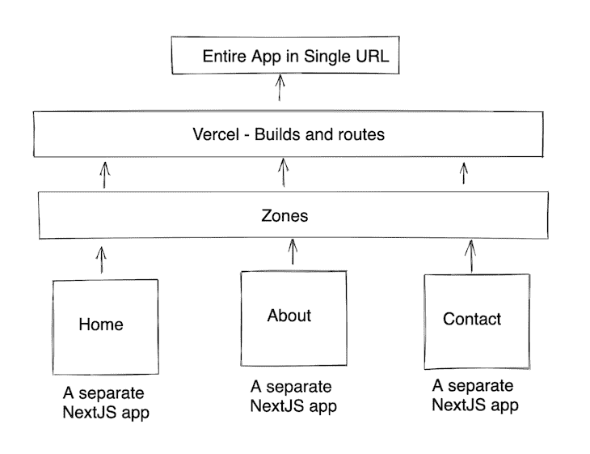
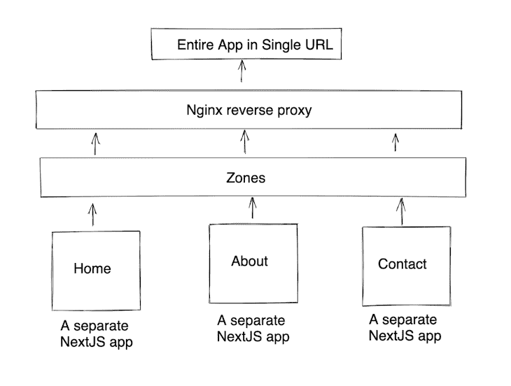

# 在 Next.js - LogRocket 博客中探索区域

> 原文：<https://blog.logrocket.com/exploring-zones-in-next-js/>

Next.js 非常棒，它已经成为前端开发人员青睐的工具。Next.js 的发展令人惊叹——它有如此多的功能可以帮助我们快速轻松地编写生产就绪的应用程序。

框架期望所有的路线都在`pages`文件夹中。然而，在现实世界的场景中，我们将有许多团队在单独的页面或组件上工作，我们不能现实地期望他们致力于一个整体。

这个问题的解决方案是区域。根据 [Next.js](https://nextjs.org/docs/advanced-features/multi-zones) [文档](https://nextjs.org/docs/advanced-features/multi-zones)，区域是 Next.js 应用的单个部署。

Next.js 允许您拥有多个用于部署单个 Next.js 应用程序的区域，并且可以在一个 URL 下访问所有区域。这允许不同的团队单独构建和部署应用程序的各个部分，而在用户端，它看起来是一个完整的应用程序。

## Next.js 区域是如何工作的？

区域没有任何来自 Next.js 的特定 APIs 它基于 HTTP 代理。您可以使用 Vercel 中内置的支持来实现多个区域，或者创建自己的 HTTP 代理。然而，Vercel 试图通过不提供定制代理的例子来推销自己的部署，而是展示它在他们的平台中是多么简单。

### 使用 Vercel

如果你用 Vercel，那就相当简单了。它们内置了对区域的支持，你只需在`vercel.json`中列出你个人应用的版本以及为它们服务的路线。



### 使用自定义代理

在自定义代理中，我们可以创建一个代理服务器，比如 Nginx 服务器。该服务器将在内部重定向到相应的 Next.js 应用程序。



使用区域时，有两个主要事项需要考虑:

1.  Next.js 规定在每个区域中添加多个页面，但是没有两个页面可以在所有区域中具有相同的名称。因此，所有区域中的所有页面都应该有唯一的名称。
2.  静态文件中存在潜在冲突的风险。

为了解决静态文件之间的冲突，我们可以利用`assetPrefix`。这将基于`assetPrefix`为所有静态文件启用唯一的路径。在这里阅读更多。

```
module.exports = {
  assetPrefix: "about/",
}
```

## 使用 HTTP 代理的示例实现

#### 1.创建两个 Next.js 应用程序

创建一个名为`nextjs-zones`的新文件夹，并使用`create-next-app`引导两个新的 Next.js 项目:`home`和`about`。

让我们在每个项目中创建一个页面。

```
// home/pages/home.js
function Home() {
  return (
    <div>
      <h1>Home</h1>
    </div>
  );
}
export default Home;
```

```
// about/pages/about.js
function About() {
  return (
    <div>
      <h1>About</h1>
    </div>
  );
}
export default About;
```

#### 2.在不同的端口上独立运行两个应用程序

首页→ `localhost:3000`

关于→ `localhost:3001`

#### 3.创建一个 Nginx 反向代理并运行它

```
# Sample nginx config

daemon off;
pid nginx.pid;

http {
    server {
        listen       8000;
        server_name  http://localhost:8000;
        proxy_buffering off;
        proxy_http_version 1.1;

        location / {
            proxy_pass    http://localhost:3000/home;
            proxy_redirect off;
        }
        location /about/ {
            proxy_pass    http://localhost:3001/about;
            proxy_redirect off;
        }
    }
}
events {
}
```

现在 Nginx 服务器在`localhost:8000`运行，直接指向`Home`应用。同样，`localhost:8000/about`指向了`About`应用程序。虽然`Home`和`About`作为不同的应用程序运行，但现在都可以通过`localhost:8000`访问。

这是一个解释概念的非常幼稚的实现。更健壮的实现将反向代理 Docker 容器中的构建文件。

## 使用 Vercel 的示例实现

#### 1.创建两个 Next.js 应用程序

遵循与上述相同的步骤[。](#createtwonextjsapps)

#### 2.创建一个`vercel.json`文件

如果您使用 Vercel 作为部署平台，它支持开箱即用的区域。让我们用一些数据创建一个`vercel.json`文件，我们就可以开始了。

```
// A sample vercel.json
{
  "version": 2,
  "build": {
    "env": {
      "BUILDING_FOR_NOW": "true"
    }
  },
  "builds": [
    { "src": "about/package.json", "use": "@now/next" },
    { "src": "home/package.json", "use": "@now/next" }
  ],
  "routes": [
    { "src": "/about(.*)", "dest": "about$1" },
    { "src": "(.*)", "dest": "home$1" }
  ]
}
```

在这里，我们可以将不同类型的区域组合在一起，例如，SSG 区域和下一个区域可以在同一个 URL 下工作。在上面的例子中，我们对`Home`和`About`都使用了`@now/next`，并且我们定义了路由来帮助 Vercel 基于 URL 决定加载哪个构建。

通过在更大程度上分离应用程序，这种方法有可能为使用 Next.js 的大型团队解决许多问题。这个特性可以更好地与 webpack 模块联邦一起使用，它可能真正成为微前端的下一个大事件。

如果你有更好的方法或思想，请在评论中告诉我。

## [LogRocket](https://lp.logrocket.com/blg/nextjs-signup) :全面了解生产 Next.js 应用

调试下一个应用程序可能会很困难，尤其是当用户遇到难以重现的问题时。如果您对监视和跟踪状态、自动显示 JavaScript 错误、跟踪缓慢的网络请求和组件加载时间感兴趣，

[try LogRocket](https://lp.logrocket.com/blg/nextjs-signup)

.

[](https://lp.logrocket.com/blg/nextjs-signup)[](https://lp.logrocket.com/blg/nextjs-signup)

LogRocket 就像是网络和移动应用的 DVR，记录下你的 Next.js 应用上发生的一切。您可以汇总并报告问题发生时应用程序的状态，而不是猜测问题发生的原因。LogRocket 还可以监控应用程序的性能，报告客户端 CPU 负载、客户端内存使用等指标。

LogRocket Redux 中间件包为您的用户会话增加了一层额外的可见性。LogRocket 记录 Redux 存储中的所有操作和状态。

让您调试 Next.js 应用的方式现代化— [开始免费监控](https://lp.logrocket.com/blg/nextjs-signup)。