# 快速中间件:一个完整的指南

> 原文：<https://blog.logrocket.com/express-middleware-a-complete-guide/>

在本指南中，我们将探索使用 Express.js 中间件的基础。我们将从头开始创建一个简单的 Express API，然后向其中添加中间件，并演示如何使用每个工具。

我们将要讨论的 Express 中间件工具是您初始 Express.js 应用程序设置的必备工具。我们将向您展示如何开始使用它们，您可以根据您的应用程序的独特需求进一步配置它们。

我们将讨论以下内容:

为了简单起见，我们将在示例 Express API 中只创建一个端点。完整的代码可以在 [GitHub](https://github.com/lelouchB/5-express-middlewares) 上找到。

## Node.js 是什么？

[Node.js](https://nodejs.org/en/) 是一个开源的 JavaScript 运行时环境，构建在 [Chrome 的 V8 JavaScript 引擎](https://v8.dev/)之上。

虽然 Node.js 可以处理简单的任务，如创建简单的服务器，但是更复杂的任务，如分别处理不同路由的请求或提供静态文件，就更加困难了。

## 什么是 Express.js？

Express.js 是最流行和最广泛使用的节点 web 框架之一。事实上，在 MERN，梅文和平均堆栈的“E”代表“快递”

根据官方 [Express.js 文档](https://expressjs.com/)，“Express 是 Node.js 的一个快速、非个性化、极简的 web 框架，”虽然 Express 是极简的，但它也非常灵活，这导致了各种中间件的开发，这些中间件可以与 Express.js 一起使用，以解决几乎任何你能想到的任务或问题。

## 什么是 Express 中间件？

[中间件](https://expressjs.com/en/guide/using-middleware.html)是包含在请求-响应周期中执行的功能的软件，可以访问请求对象(req)和响应对象(res)。中间件在服务器接收请求和发送响应之间的窗口期间执行。

[Express 中间件](https://expressjs.com/en/guide/using-middleware.html)包括应用层、路由器层和错误处理功能，可以内置或来自第三方。由于 Express.js 自身的功能有限，因此 Express 应用程序主要由多个中间件函数调用组成。

您可以为 Express.js 编写自己的中间件，但是大多数开发人员更喜欢使用和配置内置和第三方工具来完成常见任务。在本指南中，我们将向您展示如何使用五个最流行的 Express 中间件。但是首先，简要概述一下中间件在应用程序中是如何工作的。

## 中间件是如何工作的？

为了理解中间件是如何工作的，假设你有一个柠檬水摊，顾客自带柠檬，你来做柠檬水。你负责评估柠檬的来源和新鲜度，丢弃任何不合格的柠檬，最后，制作柠檬水。

为了减少你的工作量，你雇了一个工人——我们叫他拉里——来确保柠檬是有机种植的，没有任何有害化学物质。在这个类比中，Larry 是在你和你的客户的柠檬之间起作用的中间件。

现在你盈利了，所以你雇佣了另外两个员工，卷毛和莫伊。拉里检查了柠檬的产地，把有机生长的柠檬递给卷毛，卷毛扔掉腐烂的柠檬，把好的递给莫伊。Moe 检验它们的新鲜度，然后把新鲜的柠檬递给你。

现在你可以专注于制作柠檬水，增加你的利润。

把柠檬想象成你的 HTTP 请求，把柠檬水想象成服务器。在接受或拒绝请求之前，您可以像处理 HTTP 请求一样检查柠檬的来源。并非所有来自可信来源的请求都是好的，因此仍然需要对它们进行过滤。你的员工——拉里、卷毛和莫伊——就像你柠檬水计划的中间件。如果在任何阶段中间件确定请求是坏的，它有能力终止请求-响应循环。

一旦一个请求通过了应用程序中的所有中间件，它就会到达控制器函数——在我们的例子中，就是您(或者更具体地说，是制作柠檬水的行为)。

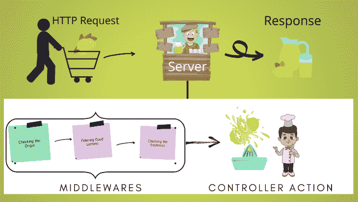

显然，这只是一个简单的例子。在现实生活中，您可能需要使用多个中间件来执行一个任务，比如让一个用户登录。

## 设置 Express.js API

为了演示如何使用 Express.js 中间件，我们将[创建一个具有单个端点的简单 Express API](https://blog.logrocket.com/creating-a-crud-api-with-node-express-and-grpc/) 。

在终端中运行以下命令:

```
mkdir express-api
cd express-api
npm init -y

```

最后一个命令将在项目的根目录下创建一个`package.json`文件。它看起来会像这样:

```
{
"name": "express-api",
"version": "1.0.0",
"description": "",
"main": "index.js",
"scripts": {
"test": "echo \"Error: no test specified\" && exit 1"
},
"keywords": [],
"author": "",
"license": "MIT"
}

```

运行以下命令安装`express`:

```
npm install express

```

创建一个名为`index.js`的文件:

```
touch index.js

```

将以下内容添加到`index.js`以创建一个简单的 Express API:

```
const express = require("express");
const app = express();

// Port
const port = 3000;

app.get("/", (req, res) => {
  res.json({
    message: "Hello Stranger! How are you?",
  });
});

// Listen
app.listen(port, () => {
  console.log(`Listening on port: ${port}`);
});

```

在项目的根目录下运行以下命令，将`nodemon`安装为一个开发依赖项。这是一个优秀的本地开发工具。

```
npm install -D nodemon

```

有了`nodemon`，就不用手动重启 Express.js 服务器了；`nodemon`检测文件更改并自动重启服务器。

在你的`package.json`里修改`"scripts"`，像这样:

```
"scripts": {
    "start": "node index.js",
    "dev": "nodemon index.js"
  },

```

您的`package.json`应该是这样的:

```
{
  "name": "express-api",
  "version": "1.0.0",
  "description": "",
  "main": "index.js",
  "scripts": {
    "start": "node index.js",
    "dev": "nodemon index.js"
  },
  "keywords": [],
  "author": "Ashutosh K Singh",
  "license": "MIT",
  "dependencies": {
    "express": "^4.17.1"
  },
  "devDependencies": {
    "nodemon": "^2.0.6"
  }
}

```

运行以下命令启动 Express 服务器:

```
npm run dev

```

一旦服务器启动，您将在终端中看到以下消息:

```
[nodemon] 2.0.5
[nodemon] to restart at any time, enter `rs`
[nodemon] watching path(s): *.*
[nodemon] watching extensions: js,mjs,json
[nodemon] starting `node index.js`
Listening on port: 3000

```

转到`[http://localhost:3000](http://localhost:3000)`，您将看到来自 API 的以下响应:

```
{
  "message": "Hello Stranger! How are you?"
}

```

## 使用 Express 中间件

现在我们已经建立了一个简单的 API，让我们详细看看五个顶级的 Express.js 中间件工具以及如何使用它们。我们将描述每一个中间件，它做什么，以及如何设置和使用我们的 Express API。

### `morgan`

[`morgan`](https://www.npmjs.com/package/morgan) 是 Node.js 的 HTTP 请求记录器中间件，为每个 API 请求生成日志。最棒的是，您可以使用预定义的格式，也可以根据需要创建新的格式。

要安装 [`morgan`](https://github.com/expressjs/morgan#morgan) ，运行以下命令:

```
npm install morgan

```

`morgan`包含许多您可以使用的预定义格式。许多开发人员更喜欢使用标准的 Apache 通用日志输出`common`。

像这样修改你的`index.js`:

```
const express = require("express");
const morgan = require("morgan")

const app = express();

// Middlewares
app.use(morgan("common"))

// Port
const port = 3000;

app.get("/", (req, res) => {
  res.json({
    message: "Hello Stranger! How are you?",
  });
});

// Listen
app.listen(port, ()=>{
    console.log(`Listening on port: ${port}`)
})

```

完成了！转到`[http://localhost:3000](http://localhost:3000)`，您会在运行服务器的终端中看到由`morgan`生成的日志:

```
::ffff:127.0.0.1 - - [14/Oct/2020:09:21:16 +0000] "GET / HTTP/1.1" 304 -

```

这里有一个相同的截图:

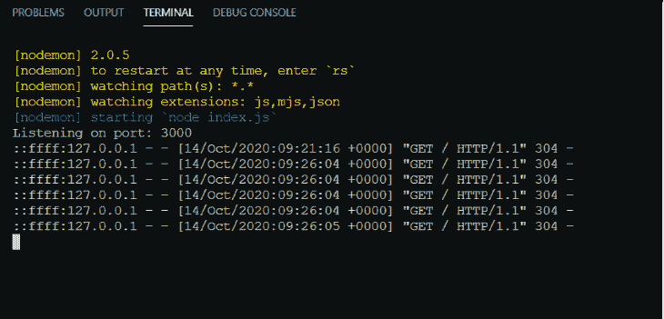

值得注意的是，中间件工具是根据您定义它们的顺序来执行的。

### 头盔

[头盔](https://www.npmjs.com/package/helmet)是一个安全中间件，通过设置各种 HTTP 头来保护 Express.js 应用。

为了更好地理解[头盔如何工作](https://blog.logrocket.com/search-optimized-spas-react-helmet/)，前往`[http://localhost:3000/](http://localhost:3000/)`并通过按下 Chrome 中的`CTRL + Shift + J`或 Firefox 中的`CTRL + Shift + K`打开控制台。现在点击**网络**选项卡。

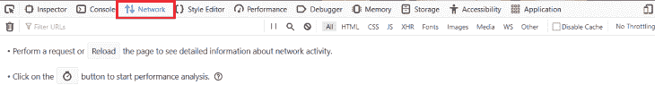

如果**网络**标签是空的，在**网络**标签打开的情况下重新加载你的页面，你会看到它填满了条目。

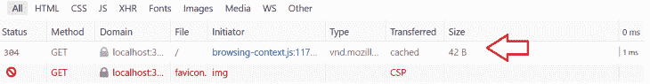

您现在可以忽略`favicon`请求；我们稍后会谈到这一点。

点击`GET /`请求数据。关注**响应头**部分。

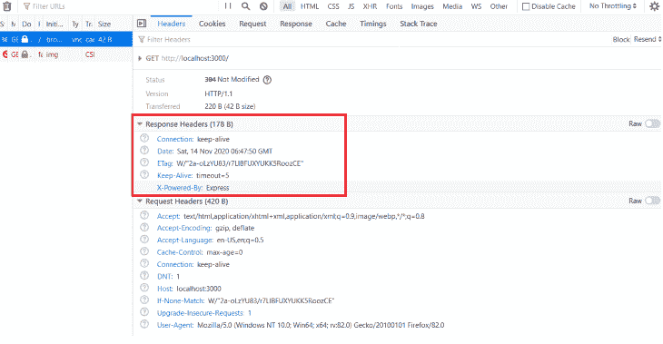

您可能看不到任何漏洞，但是，就您的 API 目前的情况而言，攻击者和黑客可以很容易地利用它——尤其是`X-Powered-By: Express`字段，它向全世界广播该应用程序正在运行 Express.js。

头盔是 11 个小中间件的集合，它们一起保护你的应用免受众所周知的漏洞和攻击。

运行以下命令安装 [`helmet`](https://helmetjs.github.io/) :

```
npm install --save helmet

```

像这样更新`index.js`文件以包含`helmet`中间件:

```
const express = require("express");
const morgan = require("morgan")
const helmet = require("helmet");
const app = express();

// Middlewares
app.use(morgan("common"))
app.use(helmet());
// Port
const port = 3000;

app.get("/", (req, res) => {
  res.json({
    message: "Hello Stranger! How are you?",
  });
});
// Listen
app.listen(port, () => {
  console.log(`Listening on port: ${port}`);
});

```

再次打开`[http://localhost:3000/](http://localhost:3000/)`，刷新页面，打开**开发者工具**中**网络**标签下的**响应头**部分。

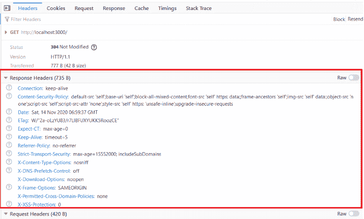

正如您这次看到的，在**响应头中有新的条目，**和`X-Powered-By: Express`字段已经消失。

您还可以配置`helmet()`函数来禁用这样的中间件。

```
// This disables the `referrerPolicy` middleware but keeps the rest.
app.use(
    helmet({
        referrerPolicy: false,
    })
  );

```

### `cors`

[CORS](https://developer.mozilla.org/en-US/docs/Web/HTTP/CORS) 代表跨产地资源共享。它用于在 Express.js 应用程序中启用和配置 CORS。

假设您有一个全栈应用，在端口 3000 上运行 React 前端，在端口 8000 上运行 Express 后端服务器。一个请求来自客户端(即 React 前端)到后端 Express 服务器，但是您的请求很可能会失败，因为它来自不同于 Express 服务器的源。

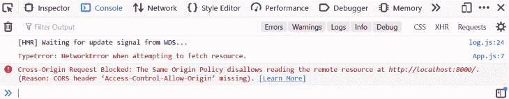

您需要告诉服务器接受这个请求，即使它来自不同的来源。这就是 [`cors`](https://www.npmjs.com/package/cors) 的用武之地。

运行以下命令安装`cors`:

```
npm install --save cors

```

更新`index.js`这样:

```
const express = require("express");
const morgan = require("morgan")
const helmet = require("helmet");
const cors = require("cors");
const app = express();

// Middlewares
app.use(morgan("common"))
app.use(helmet());
app.use(cors())

// Port
const port = 3000;

app.get("/", (req, res) => {
  res.json({
    message: "Hello Stranger! How are you?",
  });
});
// Listen
app.listen(port, () => {
  console.log(`Listening on port: ${port}`);
});

```

上面的代码`app.use(cors())`允许来自任何来源的请求，但这可能会使您的应用程序面临安全漏洞，除非您有一个公共 API 来接受来自任何来源的请求。

让我们考虑一下上面这个带有 React 和 Express 的全栈 app 的例子。您可以创建一个允许域的白名单，并检查请求是否来自白名单中的域，而不是允许来自任何来源的请求。

```
// whitelist
const whitelist = ['http://localhost:3000', 'http://localhost:3001']
const corsOptions = {
  origin: function (origin, callback) {
    if (whitelist.indexOf(origin) !== -1) {
      callback(null, true)
    } else {
      callback(new Error('Not allowed by CORS'))
    }
  }
}
app.use(cors(corsOptions));

```

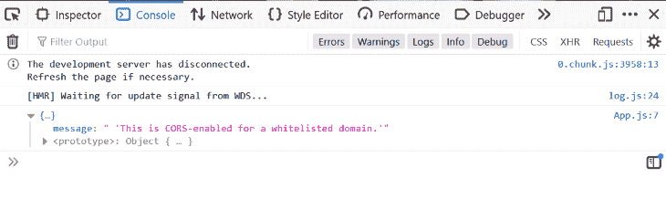

您可以在 MDN 网络文档上了解更多关于 CORS 的信息。

### 快速速率限制

[Express 限速](https://www.npmjs.com/package/express-rate-limit#usage)是 Express.js 的基本限速中间件，顾名思义，限制来自同一个 IP 地址的重复 API 请求。

下面是如何安装`express-rate-limit`:

```
npm install --save express-rate-limit

```

接下来，将这个中间件导入到`index.js`并创建一个名为`limiter`的变量来配置`express-rate-limit`。

```
const rateLimit = require("express-rate-limit");

const limiter = rateLimit({
    windowMs: 15 * 60 * 1000, // 15 minutes
    max: 100 // limit each IP to 100 requests per windowMs
  });

```

上面的代码将每个 IP 地址在 15 分钟内的请求限制为 100 个。

更新`index.js`这样:

```
const express = require("express");
const morgan = require("morgan")
const helmet = require("helmet");
const cors = require("cors");
const rateLimit = require("express-rate-limit");

const limiter = rateLimit({
    windowMs: 15 * 60 * 1000, // 15 minutes
    max: 100 // limit each IP to 100 requests per windowMs
  });

const app = express();

// Middlewares
app.use(morgan("common"))
app.use(helmet());
app.use(cors())
app.use(limiter); //  apply to all requests

// Port
const port = 3000;

app.get("/", (req, res) => {
  res.json({
    message: "Hello Stranger! How are you?",
  });
});
// Listen
app.listen(port, () => {
  console.log(`Listening on port: ${port}`);
});

```

为了更好地展示如何使用`express-rate-limit`，更改`limit`，如下所示:

```
const limiter = rateLimit({
    windowMs: 60 * 1000, // 1 minute
    max: 2, // limit each IP to 2 requests per windowMs
    message: "Too many accounts created from this IP, please try again after a minute"
  });

```

前往`[http://localhost:3000/](http://localhost:3000/)`，刷新页面三四次。

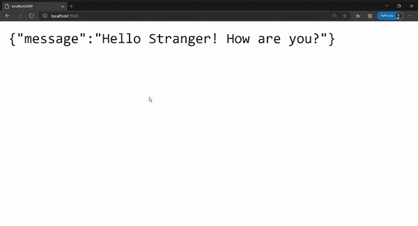

由于`morgan`仍然有效，所以可以在终端中看到日志。

```
::1 - - [14/Nov/2020:08:15:58 +0000] "GET / HTTP/1.1" 304 -
::1 - - [14/Nov/2020:08:15:59 +0000] "GET / HTTP/1.1" 304 -
::1 - - [14/Nov/2020:08:15:59 +0000] "GET / HTTP/1.1" 429 71

```

[429 状态码](https://developer.mozilla.org/en-US/docs/Web/HTTP/Status/429)表示用户在给定的时间内发送了过多的请求(“速率限制”)。

您还可以配置`express-rate-limit`来应用于特定的请求或者不是所有的请求。

```
//  apply to all requests
app.use(limiter); 

// only apply to requests that begin with /api/
app.use("/api/", limiter);

```

以下是其他一些值得一试的限速中间件:

### `serve-favicon`

[`serve-favicon`](https://www.npmjs.com/package/serve-favicon) 是一个最受欢迎的服务中间件。你可能还记得当我们打开头盔部分的**网络**标签时失败的 favicon 请求。

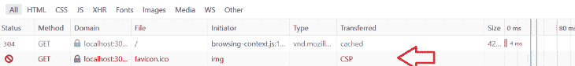

A [f](https://en.wikipedia.org/wiki/Favicon) [avicon](https://en.wikipedia.org/wiki/Favicon) 是一个小图标，经常出现在地址栏页面标题的左侧。例如，下面是 LogRocket 博客的图标:

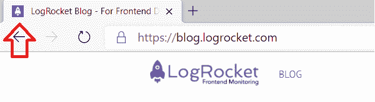

要安装`serve-favicon`:

```
npm install serve-favicon

```

在项目的根目录中，您还需要一个 favicon 文件。你可以从 [GitHub](https://github.com/lelouchB/5-express-middlewares/blob/main/favicon.ico) 获取样本图标。

像这样更新`index.js`文件:

```
const express = require("express");
const morgan = require("morgan")
const helmet = require("helmet");
const cors = require("cors");
const rateLimit = require("express-rate-limit");
var favicon = require('serve-favicon')

const limiter = rateLimit({
    windowMs: 15 *60 * 1000, // 15 minutes
    max: 100, // limit each IP to 100 requests per windowMs
    message: "Too many accounts created from this IP, please try again after a minute"
  });

const app = express();

// Serve Favicon
app.use(favicon('favicon.ico'))

// Middlewares
app.use(morgan("common"))
app.use(helmet());
app.use(cors())
app.use(limiter); //  apply to all requests

// Port
const port = 3000;

app.get("/", (req, res) => {
  res.json({
    message: "Hello Stranger! How are you?",
  });
});
// Listen
app.listen(port, () => {
  console.log(`Listening on port: ${port}`);
});

```

如果您的收藏夹图标出现在`public`文件夹中，您可以使用`path`。

```
var path = require('path')
 ...

// Serve Favicon
app.use(favicon(path.join(__dirname, 'public', 'favicon.ico')))
...

```

头转向`[http://localhost:3000/](http://localhost:3000/)`；您将看到页面上有一个图标。

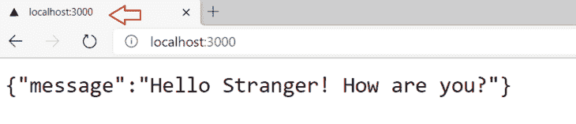

现在打开**网络**标签，重新加载页面。

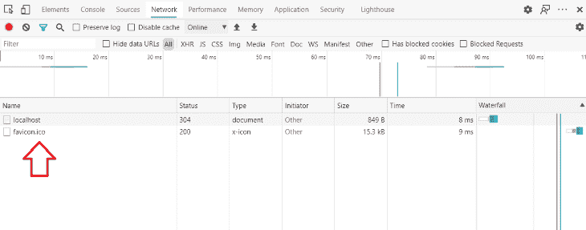

`serve-favicon`还将 favicon 缓存在内存中，通过减少磁盘访问来提高性能。

默认情况下，`serve-favicon`会将图标缓存一年。

```
Cache-Control: public, max-age=31536000

```

你也可以通过在`favicon`中传递一个属性为`maxAge`的选项对象来改变`Cache-Control`。

```
// Serve Favicon
app.use(
  favicon("favicon.ico", {
    maxAge: 500 * 60 * 60 * 24 * 1000,
  })
);

```

## 结论

在本文中，我们讨论了如何使用五个 Express.js 中间件。当然，您可能希望为您的 Express API 探索其他中间件，但是我们在本指南中研究的工具可以用于几乎任何应用程序，并提供了 Express 中间件可以增强您的 API 的优秀快照。

## 200 只显示器出现故障，生产中网络请求缓慢

部署基于节点的 web 应用程序或网站是容易的部分。确保您的节点实例继续为您的应用程序提供资源是事情变得更加困难的地方。如果您对确保对后端或第三方服务的请求成功感兴趣，

[try LogRocket](https://lp.logrocket.com/blg/node-signup)

.

[](https://lp.logrocket.com/blg/node-signup)[https://logrocket.com/signup/](https://lp.logrocket.com/blg/node-signup)

LogRocket 就像是网络和移动应用程序的 DVR，记录下用户与你的应用程序交互时发生的一切。您可以汇总并报告有问题的网络请求，以快速了解根本原因，而不是猜测问题发生的原因。

LogRocket 检测您的应用程序以记录基线性能计时，如页面加载时间、到达第一个字节的时间、慢速网络请求，还记录 Redux、NgRx 和 Vuex 操作/状态。

[Start monitoring for free](https://lp.logrocket.com/blg/node-signup)

.