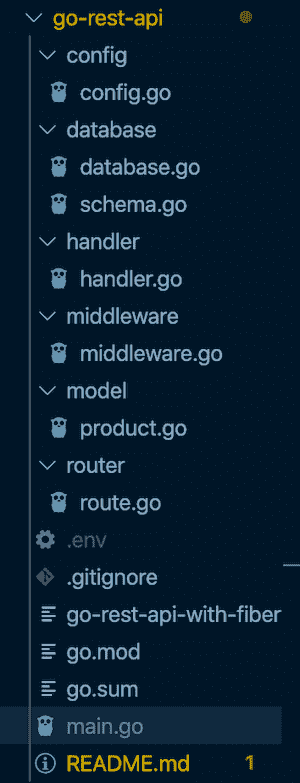
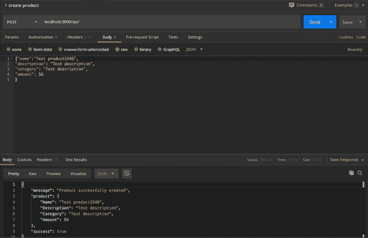
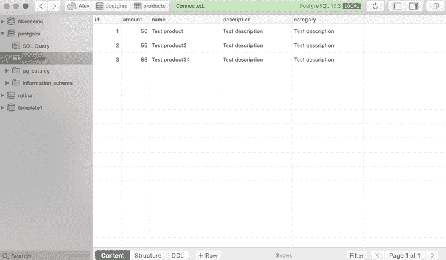

# 用 Fiber 在 Go 中构建一个 Express 风格的 API

> 原文：<https://blog.logrocket.com/express-style-api-go-fiber/>

## 介绍

如果你熟悉 [Express](https://expressjs.com/) ，你可能会认出 [Fiber](https://gofiber.io/) 的灵感来源于牛逼的 Node.js 框架——只不过它是用 Go 编写的。为什么？

嗯，因为 Go 非常快，占用内存少，对于构建可伸缩的 web 服务器和应用程序来说性能很高。

光纤充分利用了这些性能优势和特性。首先，它基于 [fasthttp](https://github.com/valyala/fasthttp) 包，这是 Go 生态系统中最快的 http 客户端库。从[基准测试结果](https://github.com/valyala/fasthttp#http-server-performance-comparison-with-nethttp)来看，fasthttp 比`net/http` native Go 客户端包快 10 倍。

在这篇文章中，我们将通过研究 Fiber 的特性和组件来探索它，比如路由、中间件支持和上下文。最终，我们应该能够应用这些特性，并构建一个与我们选择的数据库交互的演示应用程序。

## 先决条件

为了容易地理解本教程，我们至少应该有 Go 编程语言的基础知识。了解一点 Express 也是有益的，因为这有助于从体系结构的角度快速理解纤程。

此外，确保你有你选择的操作系统的 Postgres.app 你可以在这里下载。此外，您可以为 Postgres 安装任何 GUI 客户端。在本文中，我们将使用 Postico，你可以在这里下载。

最后，确保你的机器上安装了最新版本的 Go。可以在[文档](https://golang.org/doc/install#install)中找到这样做的说明。

在接下来的部分中，我们将简单地谈谈纤维背后的动机。我们走吧。

## Go Fiber 背后的动机

正如我们前面提到的，Fiber 的灵感来自于 Express，并采用了几乎相同的设计和思想。例如，这是一个简单的光纤应用程序:

```
package main 

import "github.com/gofiber/fiber"

func main() { 
  // Fiber instance
  app := fiber.New()  

  // Routes
  app.Get("/", hello)

  // start server
  app.Listen(3000) 
}

  // Handler
  func hello(c *fiber.Ctx){
    c.send("Hello, world!")
  }

// Note: we can pass any other native listerner using the Serve method.
```

这是一个简单的快速应用程序:

```
const express = require('express') 

// Express instance
const app = express()

// Routes
app.get('/', hello)

// Start server
app.listen(3000)

// Handler
function hello(req, res) { 
  res.send('hello world!')
})
```

就像 Express 一样，上面这个简单的 Fiber 应用程序反映了启动一个简单服务器所需的最低限度。一个非常有趣的特性是使用了 fasthttp `RequestCtx` [包](https://pkg.go.dev/github.com/valyala/fasthttp?tab=doc#RequestCtx)，它主要帮助处理常规的 http 请求和响应，使用了我们已经知道的所有方法:`req.query`、`req.params`、`req.body`等等。

注意，要在我们的开发机器上运行上面的应用程序，我们需要做的就是确保我们已经安装了 Go。之后，我们可以继续创建一个新的 go 模块:

```
go init github.com/firebase007/go-rest-api
```

现在我们可以直接在根目录下创建一个文件——姑且称之为`sample.go`。然后，我们可以将上面的代码粘贴到我们刚刚创建的文件中，并运行`go run sample.go`命令来启动我们的程序。输出如下所示:

```
[email protected] go-rest-api % go mod init github.com/firebase007/go-rest-api-with-fiber
go: creating new go.mod: module github.com/firebase007/go-rest-api-with-fiber
[email protected] go-rest-api % go get -u github.com/gofiber/fiber                       
go: finding github.com/gofiber/fiber v1.9.6
go: downloading github.com/gofiber/fiber v1.9.6
go: extracting github.com/gofiber/fiber v1.9.6
go: updates to go.mod needed, but contents have changed
[email protected] go-rest-api % go run sample.go                                         
        _______ __
  ____ / ____(_) /_  ___  _____
_____ / /_  / / __ \/ _ \/ ___/
  __ / __/ / / /_/ /  __/ /
    /_/   /_/_.___/\___/_/ v1.9.6
Started listening on 0.0.0.0:3000
```

> **注意**:不要忘记将 Fiber 包导入到我们的工作空间中。为此，我们可以运行:
> 
> ```
> go get -u github.com/gofiber/fiber
> ```

完成上述步骤后，我们可以在`port 3000`上访问我们的浏览器，查看我们的应用程序是否正常工作。浏览器呈现如下所示的输出:

```
Hello, World!
```

记住导入纤程包后，`app := fiber.New()`基本上调用位于`app.go`文件中的`[New](https://docs.gofiber.io/application#new)`函数。这个函数接受一个可选的`[settings](https://docs.gofiber.io/application#settings)`指针，我们可以在初始化时将它作为参数传递给我们的应用程序。我们还可以在这一行上看看`newServer`方法是如何初始化`fasthttp`服务器[的。](https://github.com/gofiber/fiber/blob/99f95b2561b89376ee83ab23a9a199e14e7ecf12/app.go#L150)

值得一提的是，作为在 Go 中构建 web 服务器和应用程序的框架，Fiber 正迅速变得非常流行。它逐渐从 Go 社区和开发人员那里获得了巨大的动力和吸引力，包括他们的 API，以及向 Go 迁移的 Node.js 开发人员。

从上面的例子可以看出，创建一个简单的 Fiber app 是相当容易和快速的，就像 Express 一样。现在让我们通过探索 Fiber 的主要组件特性以及它们在 Go 中是如何实现的来了解更多关于 Fiber 的知识。

## 纤维的成分特征

### 按指定路线发送

就像 Express 一样，Fiber 也附带了一个高性能的路由器，它也像 Express 路由器一样，有一个回调函数，为每个匹配我们服务器上特定路径的请求运行。让我们看看签名:

```
// Function signature
app.Method(path string, ...func(*fiber.Ctx))
```

注意，`Method`代表常规的 [HTTP 方法](https://docs.gofiber.io/application#http-methods) — `GET`、`POST`、`HEAD`、`PUT`等等。`Path`表示我们想要匹配的路由，`...func(*fiber.Ctx)`表示为该特定路由运行的处理程序或回调。同样重要的是要注意，我们可以为一个特定的路由使用多个处理程序，这主要在我们打算为任何目的传递中间件函数时有用。

和往常一样，`app`是一个 Fiber app 的实例。为了[服务静态文件](https://docs.gofiber.io/application#static)，我们可以使用`app.Static()`方法。有关光纤布线的更多详细信息，请参见[文档](https://docs.gofiber.io/routing)。实现可以在 [GitHub repo](https://github.com/gofiber/fiber/blob/master/router.go) 中的`Layer.go`、`router.go`、`app.go`文件中找到。

> **注意**:我们可以把一条路线想象成一个大的有序切片。当请求进来时，第一个匹配方法名、路径和模式的处理程序将被执行。此外，基于在任何特定时间匹配的路由，我们倾向于知道接下来将执行哪个中间件。

### 中间件支持

Fiber 已经附带了一些预构建的中间件。概括地说，中间件有助于在请求到达主处理器或控制器之前拦截和操纵请求。中间件功能基本上是请求周期/上下文的一部分，通常用于执行某些动作。

让我们来看看 GitHub 上 Go Fiber[R](https://github.com/gofiber/recipes)ECI pes repo 的一个非常简单的中间件示例:

```
package main

import "github.com/gofiber/fiber"

// handler function 
func handler() func(*fiber.Ctx) {
        return func(c *fiber.Ctx) {
                c.Send("This is a dummy route")
        }
}

func main() {
        // Create new Fiber instance
        app := fiber.New()

        // Create new sample GET routes
        app.Get("/demo", handler())
        app.Get("/list", handler())

        // Last middleware to match anything
        app.Use(func(c *fiber.Ctx) {
                c.SendStatus(404) // => 404 "Not Found"
        })

        // Start server on http://localhost:3000
        app.Listen(3000)
}
```

这是中间件的一个非常简单的用法。在上面的例子中，中间件检查与注册的路由不匹配的路由。就像 Express 一样，我们可以看到它是最后一个用`app.Use()`方法为我们的 app 注册的东西。注意，如果我们在浏览器上导航到不是`/demo`或`list`的路线，我们将得到错误`Not Found`。

注册中间件路由的`Use`方法的签名如下所示:

```
func (*fiber.App).Use(args ...interface{}) *fiber.App
```

这表示一个 Fiber 应用程序的实例，带有接受空接口作为参数的`Use`方法。同样，中间件将匹配以所提供的前缀开始的请求，如果没有提供前缀，则默认为`"/"`。最后，在[文档的这一部分](https://docs.gofiber.io/middleware)中还有许多其他的中间件功能。您可以查看它们以了解更多信息。

### 语境

正如我们前面提到的，上下文包含 HTTP 请求和响应，以及请求查询、参数、主体等方法。我们可以快速联想到的最基本的例子是使用`[Body](https://docs.gofiber.io/context#body)`方法——就像我们在 Express 中使用`req.body`一样。

在纤程中，上下文`Body`方法的签名如下所示:

```
c.Body() string // type string
```

这里有一个简单的用例:

```
// curl -X POST http://localhost:8080 -d user=john
app.Post("/", func(c *fiber.Ctx) {
// Get raw body from POST request
c.Body() // user=john
})
```

关于上下文包中其他可用方法的更多细节可以在[文档](https://docs.gofiber.io/context)中找到。

到目前为止，我们已经探索了`routing`在 Fiber 中是如何工作的，并且我们还研究了中间件支持和上下文。现在，让我们使用所有这些特性，构建一个与数据库交互的 Fiber 应用程序。

## 用纤程构建一个演示应用

在这一节中，我们将探索自己构建可伸缩纤程应用程序的方法，并在此过程中了解如何实现纤程的核心特性。在这个演示中，我们将使用`pq`包，它是`database/sql`包的纯 Go Postgres 驱动程序。我们可以在 Go 的[包库](https://pkg.go.dev/github.com/lib/pq?tab=doc)查看。

此外，我们将使用两个中间件包，`basicauth`和`logger`，它们是 Fiber 支持的内置中间件的一部分。首先，我们需要用下面的命令初始化一个新的 Go 模块:

```
go init github.com/firebase007/go-rest-api-with-fiber
```

然后我们可以继续使用`go get`命令安装下面的包。最后，我们的`go.mod`文件应该是这样的:

```
module github.com/firebase007/go-rest-api-with-fiber

go 1.13

require (
    github.com/gofiber/basicauth v0.0.3
    github.com/gofiber/fiber v1.9.6
    github.com/gofiber/logger v0.0.8
    github.com/joho/godotenv v1.3.0
    github.com/klauspost/compress v1.10.5 // indirect
    github.com/lib/pq v1.5.2
)
```

现在我们准备开始新的光纤项目。导航到我们的模块目录后，我们可以继续在根路径中创建一个`main.go`文件。它应该是这样的:

```
package main 

import (
"github.com/gofiber/fiber" // import the fiber package
"log"
"github.com/gofiber/fiber/middleware"
"github.com/firebase007/go-rest-api-with-fiber/database"
"github.com/firebase007/go-rest-api-with-fiber/router"

_ "github.com/lib/pq"
)

  // entry point to our program
func main() { 
  // Connect to database
  if err := database.Connect(); err != nil {
      log.Fatal(err)
    }

 // call the New() method - used to instantiate a new Fiber App
  app := fiber.New()

  // Middleware
  app.Use(middleware.Logger())

  router.SetupRoutes(app)

  // listen on port 3000
  app.Listen(3000) 

}
```

在这里，我们将导入 Fiber 包和我们在项目目录中创建的另外两个包:`router`和`database`。在我们继续之前，这里是我们的项目目录的截图:



Folder structure for our API.

在`main`函数中，我们从`database`包中实例化了`Connect`函数。我们的数据库包的内容如下所示:

```
package database
import (
    "database/sql"
    "fmt"
    "strconv"
    "github.com/firebase007/go-rest-api-with-fiber/config" 
)

// Database instance
var DB *sql.DB

// Connect function
func Connect() error {
    var err error
    p := config.Config("DB_PORT")
    // because our config function returns a string, we are parsing our str to int here 
    port,err := strconv.ParseUint(p, 10, 32) 
    if err != nil {
        fmt.Println("Error parsing str to int")
    }
    DB, err = sql.Open("postgres", fmt.Sprintf("host=%s port=%d user=%s password=%s dbname=%s sslmode=disable", config.Config("DB_HOST"), port, config.Config("DB_USER"), config.Config("DB_PASSWORD"), config.Config("DB_NAME")))

    if err != nil {
        return err
    }
    if err = DB.Ping(); err != nil {
        return err
    }
    CreateProductTable()
    fmt.Println("Connection Opened to Database")
    return nil
}
```

它使用`pg`驱动程序包导出一个连接到我们的 SQL 数据库的方法。注意，在我们成功连接到数据库之后，我们调用了一个`CreateProductTable()`函数，顾名思义，它为我们创建了一个新的数据库表。文件`schema.go`的内容仍然在我们的数据库包中，如下所示:

```
package database

// CreateProductTable ...
func CreateProductTable() {
    DB.Query(`CREATE TABLE IF NOT EXISTS products (
    id SERIAL PRIMARY KEY,
    amount integer,
    name text UNIQUE,
    description text,
    category text NOT NULL
)
`)
}
```

注意，这个函数有助于在我们的数据库中创建一个新表(如果它还不存在的话)。在我们的数据库文件的前面，我们导入了`config`包，它负责根据各自的键返回 env 值。该文件内容如下所示:

```
package config

import (
    "github.com/joho/godotenv"
    "os"
    "fmt"
)

// Config func to get env value from key ---
func Config(key string) string{
    // load .env file
    err := godotenv.Load(".env")
    if err != nil {
        fmt.Print("Error loading .env file")
    }
    return os.Getenv(key)

}
```

`sample.env`文件包含我们的数据库连接所需的秘密，以及我们的 basic-auth 中间件包所需的`username`和`password`秘密密钥(用于认证我们的路由)。你可以在下面看到它的内容:

```
DB_HOST=localhost
DB_PORT=5432
DB_USER=postgres
DB_PASSWORD=
DB_NAME=
USERNAME=
PASSWORD=
```

在我们完成设置并连接到我们的数据库之后，我们可以看到我们也在导入并初始化我们的`main`包中的`SetupRoutes`函数。该功能有助于设置我们的路线。`router`包的内容如下所示:

```
package router

import (
    "github.com/firebase007/go-rest-api-with-fiber/handler"
    "github.com/firebase007/go-rest-api-with-fiber/middleware"
    "github.com/gofiber/fiber"
)

// SetupRoutes func
func SetupRoutes (app *fiber.App) { 
    // Middleware
    api := app.Group("/api", logger.New(), middleware.AuthReq())  

    // routes
    api.Get("/", handler.GetAllProducts)
    api.Get("/:id", handler.GetSingleProduct)
    api.Post("/", handler.CreateProduct)
    api.Delete("/:id", handler.DeleteProduct)
}
```

正如我们从上面的包文件中看到的，我们正在导入两个包:`handler`和`middleware`包。`middleware`包包含一个`AuthReq`函数，它返回一个 basic-auth 配置。包的内容如下所示:

```
package middleware
import (
    "github.com/gofiber/fiber"
    "github.com/gofiber/basicauth"
    "github.com/firebase007/go-rest-api-with-fiber/config"
)

// AuthReq middleware
func AuthReq() func(*fiber.Ctx) {
    cfg := basicauth.Config{
        Users: map[string]string{
          config.Config("USERNAME"): config.Config("PASSWORD"),
        },
      }
    err := basicauth.New(cfg);
    return err
}
```

注意，`app.Group()`方法用于通过创建一个`*Group`结构来对路由进行分组。签名如下所示:

```
app.Group(prefix string, handlers ...func(*Ctx)) *Group
```

从上面的 routes 文件中，我们还调用了我们的`handler`包，它包含了当 route 匹配一个适当的路径时将被调用的函数。`handler`包的内容如下所示:

```
package handler

import (
    "log"
    "database/sql"
    "github.com/gofiber/fiber"
    "github.com/firebase007/go-rest-api-with-fiber/model"
    "github.com/firebase007/go-rest-api-with-fiber/database"
)

// GetAllProducts from db
func GetAllProducts(c *fiber.Ctx) {
    // query product table in the database
    rows, err := database.DB.Query("SELECT name, description, category, amount FROM products order by name")
    if err != nil {
        c.Status(500).JSON(&fiber.Map{
            "success": false,
            "error": err,
          })
        return
    }
    defer rows.Close()
    result := model.Products{}
    for rows.Next() {
        product := model.Product{}
        err := rows.Scan(&product.Name, &product.Description, &product.Category, &product.Amount)
        // Exit if we get an error
        if err != nil {
            c.Status(500).JSON(&fiber.Map{
                "success": false,
                "error": err,
              })
            return
        }
        // Append Product to Products
        result.Products = append(result.Products, product)
    }
    // Return Products in JSON format
    if err := c.JSON(&fiber.Map{
        "success": true,
        "product":  result,
        "message": "All product returned successfully",
      }); err != nil {
        c.Status(500).JSON(&fiber.Map{
            "success": false,
            "message": err,
          })
        return
    }
}

// GetSingleProduct from db
func GetSingleProduct(c *fiber.Ctx) {
    id := c.Params("id")
    product := model.Product{}
    // query product database
    row, err := database.DB.Query("SELECT * FROM products WHERE id = $1", id)
    if err != nil {
        c.Status(500).JSON(&fiber.Map{
            "success": false,
            "message": err,
          })
        return
    }
    defer row.Close()
    // iterate through the values of the row
    for row.Next() {
    switch err := row.Scan(&id, &product.Amount, &product.Name, &product.Description, &product.Category ); err {
        case sql.ErrNoRows:
              log.Println("No rows were returned!")
              c.Status(500).JSON(&fiber.Map{
                "success": false,
                "message": err,
              })
        case nil:
            log.Println(product.Name, product.Description, product.Category, product.Amount)
        default:
            //   panic(err)
              c.Status(500).JSON(&fiber.Map{
                "success": false,
                "message": err,
              })
    }
}

    // return product in JSON format
    if err := c.JSON(&fiber.Map{
        "success": false,
        "message": "Successfully fetched product",
        "product": product,
      }); err != nil {
        c.Status(500).JSON(&fiber.Map{
            "success": false,
            "message":  err,
          })
        return
    }

}

// CreateProduct handler
func CreateProduct(c *fiber.Ctx) {
    // Instantiate new Product struct
    p := new(model.Product)
    //  Parse body into product struct
    if err := c.BodyParser(p); err != nil {
        log.Println(err)
        c.Status(400).JSON(&fiber.Map{
            "success": false,
            "message": err,
          })
        return
    }
    // Insert Product into database
    res, err := database.DB.Query("INSERT INTO products (name, description, category, amount) VALUES ($1, $2, $3, $4)" , p.Name, p.Description, p.Category, p.Amount )
    if err != nil {
        c.Status(500).JSON(&fiber.Map{
            "success": false,
            "message": err,
          })
        return
    }
    // Print result
    log.Println(res)

    // Return Product in JSON format
    if err := c.JSON(&fiber.Map{
        "success": true,
        "message": "Product successfully created",
        "product": p,
      }); err != nil {
        c.Status(500).JSON(&fiber.Map{
            "success": false,
            "message":  "Error creating product",
          })
        return
    }
}

// DeleteProduct from db 
func DeleteProduct(c *fiber.Ctx) {
        id := c.Params("id")
        // query product table in database
        res, err := database.DB.Query("DELETE FROM products WHERE id = $1", id)
        if err != nil {
            c.Status(500).JSON(&fiber.Map{
                "success": false,
                "error": err,
              })
            return
        }
        // Print result
        log.Println(res)
        // return product in JSON format
        if err := c.JSON(&fiber.Map{
            "success": true,
            "message": "product deleted successfully",
          }); err != nil {
            c.Status(500).JSON(&fiber.Map{
                "success": false,
                "error": err,
              })
            return
        }
}
```

我们也从上面的`handler`包中导入我们的`database`和`model`包。需要注意的一点是，Fiber 附带了`fiber.Map()`方法，这基本上是`map[string]interface{}`的捷径。关于该项目的更多细节可以在 [GitHub repo](https://github.com/firebase007/go-rest-api-with-fiber) 上找到。

要启动 API，在项目根目录下运行`go run main.go`。此外，如果您打算尝试我们 API 的端点，可以使用一个 [POSTMAN 集合](https://www.getpostman.com/collections/72bda22b880bdce64276)。

例如，使用 POSTMAN 创建新产品如下所示:



Creating a new product from POSTMAN.

我们还可以使用 Postico 可视化我们的数据库记录和新创建的产品，如下所示:



Showing our DB records with Postico.

## 结论

随着 Go 开发人员和 Node.js 开发人员将 Go 作为一种编程语言，Fiber 正在获得一些坚实的动力，并找到了牵引力。

正如我们所见，Fiber 非常容易使用，就像 Express 一样。它还附带了 fasthttp 方法，这使它在性能方面具有优势。我们还探讨了 Fiber 的一些最重要的特性，包括对中间件(包括第三方)的支持，就像 Express 一样。

最后，Fiber 针对 Go 的高速后端 API 开发进行了优化。它支持[静态文件](https://docs.gofiber.io/#static-files)、一个[前置功能](https://docs.gofiber.io/application#settings)设置、[模板引擎](https://docs.gofiber.io/middleware#template)、 [WebSockets](https://docs.gofiber.io/middleware#websocket) 、[测试](https://docs.gofiber.io/application#test)等等。[文档](https://docs.gofiber.io/)是检验这些令人敬畏的特性的最佳地方。

再次感谢，如果您有任何问题，请通过 [Twitter](https://twitter.com/alex_nnakwue) 联系我，或者使用下面的评论框。我很乐意回答这些问题。🙂

## 使用 [LogRocket](https://lp.logrocket.com/blg/signup) 消除传统错误报告的干扰

[](https://lp.logrocket.com/blg/signup)

[LogRocket](https://lp.logrocket.com/blg/signup) 是一个数字体验分析解决方案，它可以保护您免受数百个假阳性错误警报的影响，只针对几个真正重要的项目。LogRocket 会告诉您应用程序中实际影响用户的最具影响力的 bug 和 UX 问题。

然后，使用具有深层技术遥测的会话重放来确切地查看用户看到了什么以及是什么导致了问题，就像你在他们身后看一样。

LogRocket 自动聚合客户端错误、JS 异常、前端性能指标和用户交互。然后 LogRocket 使用机器学习来告诉你哪些问题正在影响大多数用户，并提供你需要修复它的上下文。

关注重要的 bug—[今天就试试 LogRocket】。](https://lp.logrocket.com/blg/signup-issue-free)