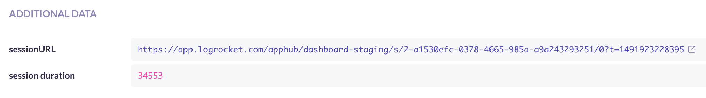
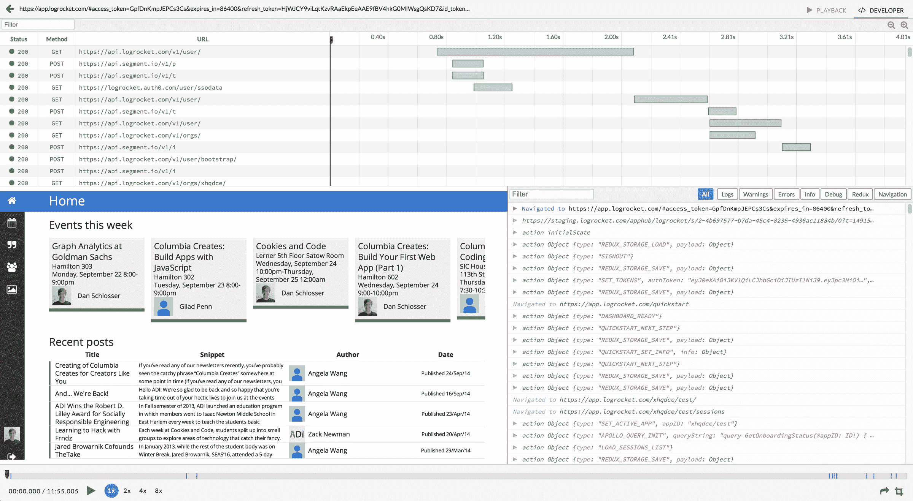

# 用 LogRocket 扩展哨兵

> 原文：<https://blog.logrocket.com/extending-sentry-with-logrocket-52e2f5b67d5a/>

# 用 LogRocket 扩展岗哨

## 

2017 年 4 月 11 日 1 分钟阅读 557

如果你正在使用 [Sentry](https://getsentry.com) ，那么你已经知道它是跟踪 JavaScript 应用程序错误的最好工具之一。只需添加几行代码，Sentry 就会在应用程序中出现重要错误时提醒您，并帮助您了解它们在生产中出现的频率。

但是错误报告本身有一些限制。通常很难理解错误的影响，因为许多错误对用户没有实际影响。对于难以修复的异常，错误报告缺乏足够的上下文来找出根本原因。

这就是 LogRocket 的用武之地。LogRocket 是第一款为前端 JavaScript 应用打造的日志工具。添加几行代码后，LogRocket 捕获控制台日志、网络请求、Redux 操作/状态等，给出每个 bug 的完整上下文。

此外，LogRocket 在你的应用程序中记录 HTML/CSS，让你重放一个像素完美的视频，看看一个异常是否真正影响了用户体验。

## 集成哨兵和日志火箭

集成 Sentry 和 LogRocket 可以让您看到 Sentry 中每个错误的 LogRocket“会话”。它是这样工作的:

1.  在[https://app.logrocket.com](https://app.logrocket.com)创建一个免费账户，并遵循快速入门指南。
2.  这个代码片段为每个哨兵报告添加了一个 LogRocket 记录 URL:

    ```
    Sentry.configureScope(scope => {   scope.setExtra("sessionURL", LogRocket.sessionURL); });
    ```

3.  注意，如果 LogRocket SDK 没有完全初始化并开始将会话数据发送回 LogRocket 服务器，那么`LogRocket.sessionURL`将返回 null。为了保证会话 URL 的存在，向`LogRocket.getSessionURL()` :

    ```
    LogRocket.getSessionURL(sessionURL => {   Sentry.configureScope(scope => {     scope.setExtra("sessionURL", sessionURL);   }); });
    ```

    传递一个回调

就是这样！下一次当你的应用程序中出现触发 Sentry 的错误时，你会在 Sentry 报告的底部看到这个额外的字段。



点击`sessionURL`链接将带您进入发生错误的 LogRocket 会话。下面是 LogRocket 会话的样子:



A sample LogRocket session showing session video, network requests, and Redux logs.

在顶部，我们看到网络请求，瀑布图显示了它们的相对时间。单击请求会显示相关的标题和正文，以及来自服务器的响应。

在左下方，我们看到了像素完美的会议视频。这个“视频”实际上是 DOM 的重建，因此您可以检查 HTML/CSS 以了解视觉错误，或者以两倍的速度回放它，以快速了解用户做了什么来触发错误。

最后，在右下角，我们看到了控制台查看器。这将显示应用程序中的所有控制台日志、警告和错误。如果您使用 Redux，它还会显示`actions`并让您随时检查`state`。

## 总结一下

将 LogRocket 集成到您的 Sentry 工作流中有助于为您提供额外的上下文来快速轻松地解决 bug。要开始，请访问 https://logrocket.com。

## 了解 Branch Insurance 如何利用 Sentry 和 LogRocket 更快地发布功能

[阅读案例研究](https://logrocket.com/customers/branch/)了解 Branch 的团队如何快速优化分行平台，以满足新老客户的需求。

“由于 LogRocket 和 Sentry 之间的集成，调试比我们以前的解决方案更快更容易。”–首席技术官乔·艾米森

[点击此处](https://logrocket.com/customers/branch/)阅读案例研究。