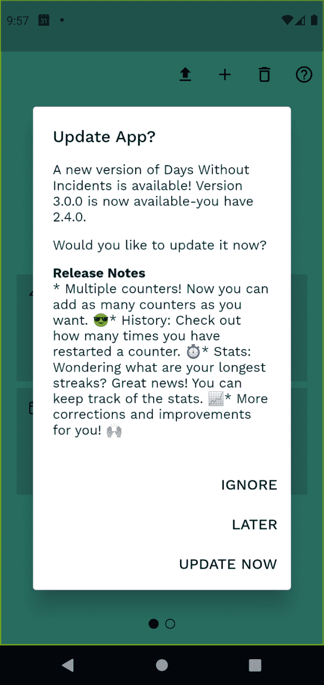
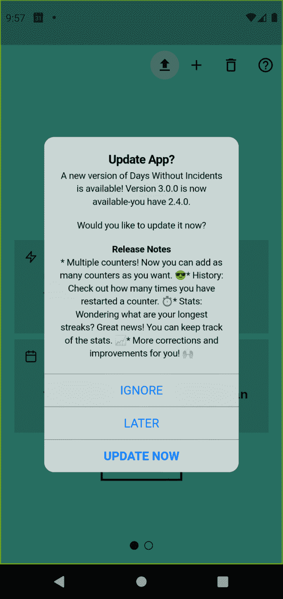
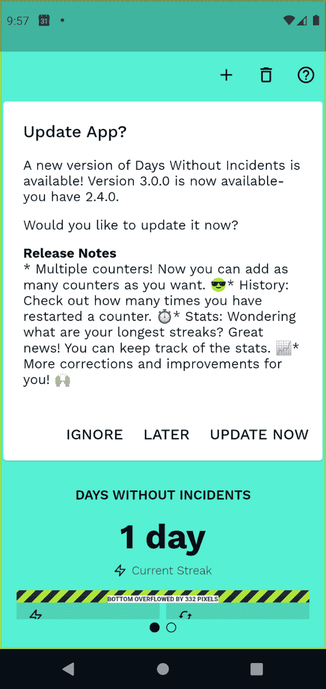
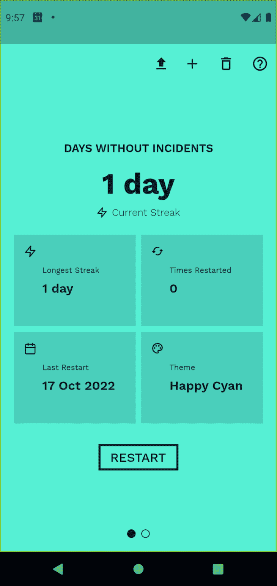
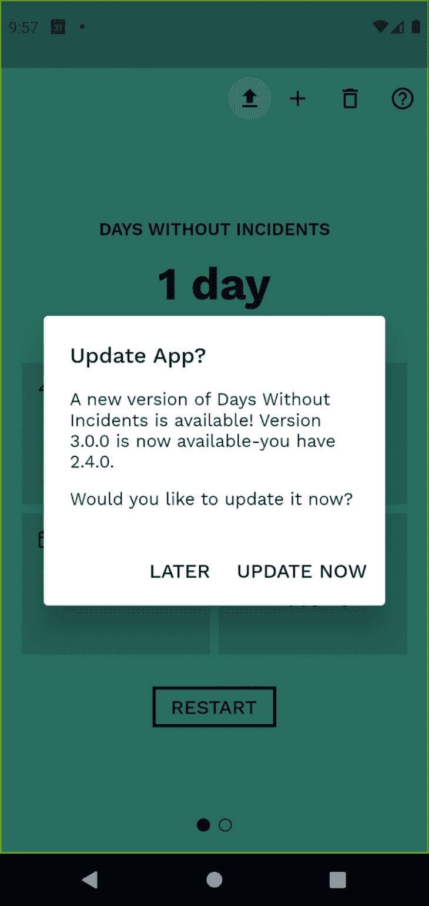

# 通过 Flutter 升级程序促进应用程序更新

> 原文：<https://blog.logrocket.com/facilitate-app-updates-flutter-upgrader/>

当谷歌 Play 商店或 Apple App Store 中有更新的应用程序版本时，会显示一个简单的警告提示或卡片。大多数用户利用这种自动升级功能来避免在手机上单独更新每个应用程序。

然而，有时应用程序需要比平时更新得更快，必须直接通知用户，而不是依赖于商店警报。这种直接通知也有助于联系没有订阅自动更新的人。

如果你遵循早期的[发布，经常发布的哲学](https://en.wikipedia.org/wiki/Release_early,_release_often)，这个问题尤其重要；经常向你的应用添加新的内容和特性，并以相当快的节奏发布新版本。

应用程序有多个版本会导致版本碎片问题，这对应用程序开发来说是一个巨大的问题。幸运的是，有一个很棒的 Flutter 插件可以帮助你提醒用户，并提示他们将应用程序更新到最新版本:`[upgrader](https://pub.dev/packages/upgrader)`。

在本教程中，我们将讨论`upgrader`如何工作，我们将演示不同的策略，可用于处理应用程序版本升级。

*向前跳转:*

## 先决条件

要遵循本指南，您应该具备以下条件:

*   Flutter、有状态小部件和包版本控制的基础知识
*   向谷歌 Play 商店和苹果应用商店推送移动应用的工作知识

## 入门指南

本文的教程部分将使用无事故日(DWI)应用程序来演示概念。DWI 是一个简单的事件计数器应用程序，支持多种计数器，风格和一个简单的用户界面。

接下来，下载通过 GitHub 获得的开源[代码，并确保您使用的是 Flutter v3.0+。](https://github.com/CodingAleCR/dayswithoutincidents/tree/v3.0.0%2B11)

用您喜欢的 IDE 打开项目，记得用`flutter pub get`获取依赖项。

以下是您应该了解的一些重要文件的简要概述:

*   `lib/main.dart`:颤振项目所需的标准主文件
*   `lib/core`:两个或更多功能之间共享的核心小部件和实用程序
*   `lib/features`:使用特性分组来抽象 UI 的不同部分
*   `packages`:包含数据层和领域层

为了更好地理解要点，您还可以查看这个 [GitHub pull 请求](https://github.com/CodingAleCR/dayswithoutincidents/pull/15/files)。它拥有您自己处理应用程序更新和版本限制所需的所有更改。

## 了解`upgrader`如何工作

如前所述，当市场上有太多版本的应用程序时，就会出现版本碎片。每个版本都有不同的特性、设备支持、屏幕支持，甚至 API 版本。您的基础设施和服务将需要支持所有这些变化，从而导致更昂贵的业务运营。

那么，有什么解决办法呢？

有三种方法可以降低版本碎片的影响:

1.  有一个您支持的可管理的版本列表
2.  强制实施您支持的最低版本

3.  如果用户的应用程序没有运行最新版本，请指导用户完成更新

这就是`upgrader`派上用场的地方；它可以帮助你在应用程序中设置所有这些机制，而不需要太多的开销。

`upgrader`是一个 Flutter 插件，帮助管理用户安装的应用程序版本。它允许您检查用户是否安装了最新版本，如果没有，它会通过一个对话框或小工具指导用户通过应用商店安装它。

该插件还可以强制执行最低应用版本，并提供内置的 RSS 提要支持，支持 Sparkle 使用的 Appcast 标准(我们将在本文后面进一步讨论)。

足够的闲聊；是时候深入研究一些代码了！

## 如果应用程序过期，则显示警告

`upgrader`最常见的一个用例是当当前安装的应用程序与商店列表相比过时时显示一个对话框。

为了测试这一点，打开`lib/features/time_counter/pages/counter_page.dart`文件并将`CountersPage` `build`更改如下:

```
@override
Widget build(BuildContext context) {
  return Scaffold(
    appBar: const DWIAppBar(),
    body: UpgradeAlert(
      child: const SafeArea(
        child: _Body(),
      ),
    ),
  );
}
```

`UpgradeAlert`[可以包装一个小部件](https://blog.logrocket.com/widgets-the-building-blocks-of-flutter-apps/)，允许你把它作为`body`属性的包装器，而不必担心手工检查版本。

***注意，*** 记住在文件顶部添加这个导入:`import 'package:upgrader/upgrader.dart';`

如果您现在构建并运行该应用程序，您将看到以下内容:



该插件为对话框提供了有限的样式定制。`Upgrader`中的`dialogStyle` 属性有两种不同的选项:`UpgradeDialogStyle.cupertino`和默认的`UpgradeDialogStyle.material`。

再次更改`build`并将样式更改为`cupertino`，像这样:

```
@override
Widget build(BuildContext context) {
  return Scaffold(
    appBar: const DWIAppBar(),
    body: UpgradeAlert(
      upgrader: Upgrader(dialogStyle: UpgradeDialogStyle.cupertino),
      child: const SafeArea(
        child: _Body(),
      ),
    ),
  );
}
```

现在，构建并运行应用程序。它应该是这样的:



接下来，让`build`保持原样:

```
@override
Widget build(BuildContext context) {
  return const Scaffold(
    appBar: DWIAppBar(),
    body: SafeArea(
      child: _Body(),
    ),
  );
}
```

另一个常见的场景是在 UI 中有一个指示器来显示应用程序的安装版本不是最新的。同样，这个插件通过`UpgradeCard`实现了这个功能。

再加上`UpgradeCard`看看怎么样。打开`lib/features/time_counter/widgets/counter_list.dart`文件，在`Expanded`上方添加以下代码，使其显示在屏幕顶部:

```
UpgradeCard(),
```

如果您构建并运行该应用程序，它应该是这样的:



正如你所看到的，`UpgradeCard`显示了一个材质设计的卡片，它使用了与`UpgradeAlert`相同的内容，但是显示为内嵌而不是对话框。由于该卡看起来不太好，在这种情况下，继续删除刚才添加的代码(删除第 81 行)。我们会考虑其他的选择。

现在，就用户体验而言，有时这两个内置行为(`UpgradeAlert`和`UpgradeCard`)还不够。例如，当应用程序有更新时，你可能想显示一个`IconButton`。

让我们试一试这个例子。

您需要创建一个新的小部件，它将像`UpgradeAlert`和`UpgradeCard`一样工作。事实上，如果你仔细看看这个库的代码，你会注意到两者都扩展了`UpgradeBase`,这会让事情变得简单一些。

首先创建一个`lib/core/widgets/upgrade_widget.dart`文件，并添加以下代码:

```
import 'dart:developer';

import 'package:flutter/material.dart';
import 'package:upgrader/upgrader.dart';

/// Defines a builder function that allows you to create a custom widget
/// that is displayed in a similar fashion as [UpgradeCard]
typedef UpgradeWidgetBuilder = Widget Function(
  BuildContext context,
  Upgrader upgrader,
);

/// A widget to display by checking upgrader info available.
class UpgradeWidget extends UpgradeBase {
  /// Creates a new [UpgradeWidget].
  UpgradeWidget({
    Key? key,
    Upgrader? upgrader,
    required this.builder,
  }) : super(upgrader ?? Upgrader.sharedInstance as Upgrader, key: key);

  /// Defines how the widget will be built. Allows the implementation of custom
  /// widgets.
  final UpgradeWidgetBuilder builder;

  /// Describes the part of the user interface represented by this widget.
  @override
  Widget build(BuildContext context, UpgradeBaseState state) {
    if (upgrader.debugLogging) {
      log('UpgradeWidget: build UpgradeWidget');
    }

    return FutureBuilder(
      future: state.initialized,
      builder: (BuildContext context, AsyncSnapshot<bool> processed) {
        if (processed.connectionState == ConnectionState.done &&
            processed.data != null &&
            processed.data!) {
          if (upgrader.shouldDisplayUpgrade()) {
            if (upgrader.debugLogging) {
              log('UpgradeWidget: will call builder');
            }
            return builder.call(context, upgrader);
          }
        }

        return const SizedBox.shrink();
      },
    );
  }
}
```

下面是我们刚刚添加的代码的简要概述:

在上面的代码中，`UpgradeWidget`是一个包装器小部件，它实现了与`UpgradeCard`和`UpgradeAlert`相同的基本行为。当执行定制的`build`时，它扩展`UpgradeBase`并进行基本检查。它将允许您包装任何部件，并显示有关更新应用程序的信息，如果需要的话。

* * *

### 更多来自 LogRocket 的精彩文章:

* * *

`UpgradeWidget`接收一个可选的`Upgrader`实现，但也有默认实现，所以`UpgradeCard`和`UpgradeAlert`都工作。让定制小部件使用相同的原则允许您保持定制小部件和库的 API 之间的互操作性。

`UpgradeWidgetBuilder`是用于呈现内容小部件的`builder`函数的别名。它将`Upgrader`作为参数，因为它将提供构建定制小部件所需的信息。我们将在本文稍后详细讨论这一点。

现在您已经设置了一个可重用的`UpgradeWidget`，打开`lib/core/widgets/dwi_appbar.dart`文件，将这段代码复制到文件的底部:

```
class _UpdateButton extends StatelessWidget {
  const _UpdateButton({
    Key? key,
  }) : super(key: key);

  @override
  Widget build(BuildContext context) {
    return UpgradeWidget(
      upgrader: Upgrader(
        //! This is a bit of a hack to allow the alert dialog to be shown
        //! repeatedly.
        durationUntilAlertAgain: const Duration(milliseconds: 500),
        showReleaseNotes: false,
        showIgnore: false,
      ),
      builder: (context, upgrader) => CircleAvatar(
        child: IconButton(
          onPressed: () {
            upgrader.checkVersion(context: context);
          },
          icon: const Icon(Icons.upload),
        ),
      ),
    );
  }
}
```

`_UpdateButton`是一个方便的私有小部件，允许我们为自定义`UpgradeWidget`设置行为。在这种情况下，我们的想法是在点击`IconButton`时显示`upgrader`警告对话框。这可以通过调用`checkVersion`并将上下文作为参数传递来完成；当该函数被调用时，插件将接管，并显示一个新的`UpgradeAlert`。

为了更好的可读性，`showReleaseNotes`和`showIgnore`标志被设置为`false`，因为这两个元素在 UI 中占据了太多的空间。此外，DWI 应用程序用户熟悉简单的用户体验，所以你现在可以跳过显示这些。

最后一点需要注意的是，每当用户在`UpgradeAlert`中点击**之后的**，库就会存储一个时间戳，以避免过于频繁或在不希望的时间显示对话框。只有过了一段时间(默认为三天)后，它才会重新显示对话框。

对于 DWI 应用程序，你需要绕过这个功能，在用户每次点击更新`IconButton`时显示对话框。为了实现这一点，我们将用 500 毫秒的`Duration`覆盖默认的`durationUntilAlertAgain`。这样，当用户关闭对话框时，库会将它标记为就绪。

***N.B.*** *，这是一个有点黑客的解决方案，因为如果库信任我们在我们想要的任何时候显示警告对话框，就不需要它了。遗憾的是，在撰写本文时，* `upgrader` *并没有提供对此类行为的内置支持。*

现在，让我们把`_UpdateButton(),`加到`actions`上`_AddCounterButton`的正上方。此外，确保在文件的顶部为库添加相应的导入:

```
import 'package:dwi/core/widgets/widgets.dart';
import 'package:upgrader/upgrader.dart';

```

构建并运行后，您应该看到以下内容:





## 在应用中强制实施最低版本

`upgrader`的另一个很棒的特性是，它能够简单地通过在应用商店的描述中添加预定义的文本或者通过在`Upgrader`中定义一个最低应用版本来强制执行一个最低应用版本，就像这样:

```
Upgrader(
  minAppVersion: '3.0.0',
),

```

如果您希望使用 app store 描述，请记住以下格式:

*   谷歌 Play 商店的格式(Android 应用):`[Minimum supported app version: 1.2.3]`
*   苹果应用商店的格式(iOS 应用):`[:mav: 1.2.3]`

使用上述文本格式会将应用程序的最低版本定义为`1.2.3.`,这意味着此应用程序的早期版本将被强制更新为可用的最新版本。

## 控制您自己的版本列表

`upgrader`的一个重要限制是，它的默认行为利用了当前苹果应用商店和谷歌 Play 商店的应用列表，这意味着:

1.  如果谷歌或苹果决定停止显示应用版本或限制允许的描述格式，那么`upgrader`的默认行为将停止工作
2.  如果您的应用程序不是通过公共商店发布的，`upgrader`将无法按预期开箱即用

3.  您无法控制您支持的版本列表，也没有关于它们的历史记录

为了解决这个问题，`upgrader`提供了与 Appcast 合作的支持，app cast 基于安迪·马图切克的 [Sparkle 框架。Sparkle 是一种广泛使用的标准，它以 XML 格式列出了应用程序的所有版本。Appcast 提要描述了应用程序的每个版本，并向`upgrader`提供最新版本。](https://sparkle-project.org/)

这里有一个来自 [Sparkle 文档](https://sparkle-project.org/documentation/publishing/)的例子，展示了 Appcast 文件的外观:

```
<rss xmlns:sparkle="http://www.andymatuschak.org/xml-namespaces/sparkle" xmlns:dc="http://purl.org/dc/elements/1.1/" version="2.0">
  <channel>
    <title>Sparkle Test App Changelog</title>
    <link>http://sparkle-project.org/files/sparkletestcast.xml</link>
    <description>Most recent changes with links to updates.</description>
    <language>en</language>
    <item>
      <title>Version 2.0</title>
      <link>https://sparkle-project.org</link>
      <sparkle:version>2.0</sparkle:version>
      <description>
      <![CDATA[ <ul> <li>Lorem ipsum dolor sit amet, consectetur adipiscing elit.</li> <li>Suspendisse sed felis ac ante ultrices rhoncus. Etiam quis elit vel nibh placerat facilisis in id leo.</li> <li>Vestibulum nec tortor odio, nec malesuada libero. Cras vel convallis nunc.</li> <li>Suspendisse tristique massa eget velit consequat tincidunt. Praesent sodales hendrerit pretium.</li> </ul> ]]>
      </description>
      <pubDate>Sat, 26 Jul 2014 15:20:11 +0000</pubDate>
      <enclosure url="https://sparkle-project.org/files/Sparkle%20Test%20App.zip" length="107758" type="application/octet-stream" sparkle:edSignature="7cLALFUHSwvEJWSkV8aMreoBe4fhRa4FncC5NoThKxwThL6FDR7hTiPJh1fo2uagnPogisnQsgFgq6mGkt2RBw=="/>
    </item>
  </channel>
</rss>

```

该文件应托管在任何使用该应用程序的人都可以访问的服务器上。它也可以在发布过程中自动生成，或者您可以在 app stores 发布后手动更新。

在 Appcast 中使用`upgrader`也相对简单。这里有一个来自[图书馆文档](https://pub.dev/packages/upgrader#appcast)的例子:

```
import 'package:flutter/material.dart';
import 'package:upgrader/upgrader.dart';

void main() => runApp(const MyApp());

class MyApp extends StatelessWidget {
  const MyApp({
    Key key,
  }) : super(key: key);

  @override
  Widget build(BuildContext context) {
    final appcastURL =
        'https://raw.githubusercontent.com/larryaasen/upgrader/master/test/testappcast.xml';
    final appcastConfig = AppcastConfiguration(url: appcastURL, supportedOS: ['android', 'ios']);

    return MaterialApp(
      title: 'Upgrader Example',
      home: Scaffold(
          appBar: AppBar(
            title: Text('Upgrader Example'),
          ),
          body: UpgradeAlert(
            Upgrader(appcastConfig: appcastConfig),
            child: Center(child: Text('Checking...')),
          )),
    );
  }
}
```

干得好！现在你确切地知道如何让用户运行你的应用程序的最新版本，你也知道你可能会在这个过程中发现的主要“陷阱”。

## 下一步是什么？

在本文中，我们回顾了使用`upgrader`处理 Flutter 应用程序更新的不同策略。您可以查看[这几天无事故](https://github.com/CodingAleCR/dayswithoutincidents/pull/15/files)所需的所有变更的完整列表。

我希望你喜欢这个教程。如果你觉得有用，请考虑与他人分享。我很乐意回答下面评论区留下的任何问题。

## 使用 [LogRocket](https://lp.logrocket.com/blg/signup) 消除传统错误报告的干扰

[](https://lp.logrocket.com/blg/signup)

[LogRocket](https://lp.logrocket.com/blg/signup) 是一个数字体验分析解决方案，它可以保护您免受数百个假阳性错误警报的影响，只针对几个真正重要的项目。LogRocket 会告诉您应用程序中实际影响用户的最具影响力的 bug 和 UX 问题。

然后，使用具有深层技术遥测的会话重放来确切地查看用户看到了什么以及是什么导致了问题，就像你在他们身后看一样。

LogRocket 自动聚合客户端错误、JS 异常、前端性能指标和用户交互。然后 LogRocket 使用机器学习来告诉你哪些问题正在影响大多数用户，并提供你需要修复它的上下文。

关注重要的 bug—[今天就试试 LogRocket】。](https://lp.logrocket.com/blg/signup-issue-free)