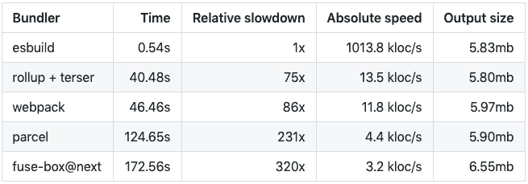
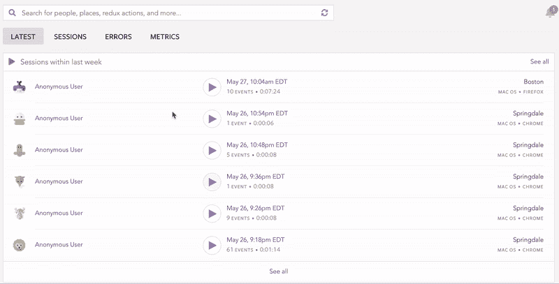

# 比 webpack 更快:与 esbuild 的 JavaScript 捆绑

> 原文：<https://blog.logrocket.com/fast-javascript-bundling-with-esbuild/>

[Ibrahima Ndaw Follow](https://blog.logrocket.com/author/ibrahimandaw/) JavaScript enthusiast, full-stack developer, and blogger who also dabbles in UI/UX design.

# 比 webpack 更快:用 esbuild 捆绑 JavaScript

## 

2020 年 4 月 2 日 2 分钟读完 561

[模块化编程](https://www.cs.cornell.edu/courses/cs3110/2019sp/textbook/modules/modular_programming.html)是一种软件设计技术，通过这种技术，程序的各种功能被细分为单独开发的代码模块。现代编程很大程度上依赖于模块化，这就是为什么你需要一个模块捆绑器来把所有独立的文件合并成一个文件。

JavaScript 社区中有一些可用的捆绑器，比如 [WebPack](https://webpack.js.org/) 、 [Rollup](https://rollupjs.org/guide/en/) 和[package](https://parceljs.org/)。然而，它们不够快，因为它们是用 JavaScript 构建的，众所周知，这在性能方面还有很多不足之处。幸运的是，有一个用 Go 构建的新捆绑器比其他捆绑器运行得更快。

在本指南中，我们将探索 [esbuild](https://github.com/evanw/esbuild) ，这是一个 JavaScript 捆绑器和精简器，它打包 JS 代码以便在 web 上分发。我们将研究它如何能够如此快速地工作，并讨论为什么您应该在 2020 年及以后关注这个工具。

## 什么是 esbuild，为什么它这么快？

esbuild 是由 Evan Wallace 创建的 JavaScript bundler。代码本身是在考虑速度的情况下用 Go 编写的，显然开发人员尽可能地避免了不必要的分配。

## 将 esbuild 与其他捆扎机进行比较(基准测试)

esbuild 完全并行解析、打印和源映射生成。所有这些特性结合起来使得 esbuild 非常快。也就是说，为了帮助您为下一个 JavaScript 项目选择最佳捆绑器，让我们将 esbuild 与市场上的其他工具进行比较。

为了对这些捆绑器进行基准测试，我将使用 Wallace 在他的 [GitHub repo](https://github.com/evanw/esbuild) 中发布的相同标准。这些数字可能会因计算机的不同而有所不同，但不会相差太多。

这里的用例是将 [Three.js](https://threejs.org/) 库复制 10 次，并将其捆绑到一个没有任何缓存的文件中。测试是在六核 2019 MacBook Pro 上进行的，内存为 16gb。



基准测试的结果令人震惊:由于使用了 [Go 语言](https://blog.logrocket.com/functional-programming-in-go/)，esbuild 比其他捆绑软件快 10 到 100 倍。

顺便说一下，您可以在您的机器上运行这个基准测试，并亲自查看。安装 [Go 语言工具链](https://golang.org/doc/install)并运行以下命令:

```
make bench-three

```

## esbuild 可以投入生产了吗？

这位捆绑者的速度是无可争议的。但是它可以生产了吗？

目前，esbuild 是一个小型开源项目；它是由一个人开发和维护的。这在很大程度上是设计使然。根据作者所说:“我个人并不想运行一个大型的开源项目，所以我现在并不寻求贡献。”

尽管这将不可避免地减慢工具的开发，但它已经是一个强大的捆绑器，对常见的 JS 模块、JSX 到 JavaScript 的转换等提供了强大的支持。然而，它尚未用于生产；现在这样做是有风险的，很可能会发现一些错误。

也就是说，esbuild 有巨大的潜力来简化 JavaScript 中捆绑模块的传统缓慢任务，值得在您的下一个项目中尝试。

## 结论

如果没有别的，esbuild 证明了我们当前的 JavaScript 构建工具不够快。鉴于 esbuild 和其他 bundlers 在性能方面的差距如此之大，我希望这个工具将有助于改进 JS 生态系统中的构建工具。

即使 esbuild 还没有准备好投入生产，它也是值得关注的。我强烈推荐查看 Github repo 来更深入地了解文档。

## 通过理解上下文，更容易地调试 JavaScript 错误

调试代码总是一项单调乏味的任务。但是你越了解自己的错误，就越容易改正。

LogRocket 让你以新的独特的方式理解这些错误。我们的前端监控解决方案跟踪用户与您的 JavaScript 前端的互动，让您能够准确找出导致错误的用户行为。

[](https://lp.logrocket.com/blg/javascript-signup)

LogRocket 记录控制台日志、页面加载时间、堆栈跟踪、慢速网络请求/响应(带有标题+正文)、浏览器元数据和自定义日志。理解您的 JavaScript 代码的影响从来没有这么简单过！

[Try it for free](https://lp.logrocket.com/blg/javascript-signup)

.