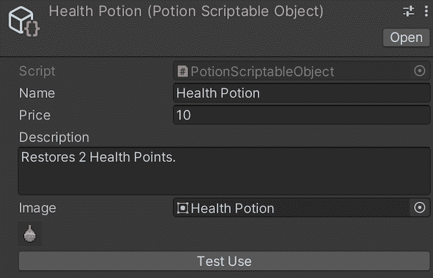

# Unity 中的快速原型:可脚本化的对象

> 原文：<https://blog.logrocket.com/fast-prototyping-unity-scriptable-objects/>

假设您正在 Unity 中为您的游戏开发一个商家系统，其中商家出售一系列具有不同名称、价格、描述和图像的物品。

你团队中的游戏设计师已经写了一份 100 页的文件，里面有整整一章是关于各种药剂的。作为首席程序员，您需要决定在系统中的什么地方存储这些项目，那么您会在哪里存储呢？

在本文中，我们将探索 Unity 中的快速原型，以及如何在游戏开发中有效地使用可脚本化的对象。

## 可序列化 struts

我相信解决这个系统的最初尝试是使用一个封装了项目属性的[可序列化结构](https://docs.unity3d.com/ScriptReference/Serializable.html)。让我们称之为 ItemStruct。然后，您将在商家中添加一个 ItemStruct 列表。

因此，通过检查员，游戏设计者可以手动输入这些项目中的每一个，而让你为游戏的其他系统编程。此类系统的代码和检查器如下所示:

```
[Serializable]
public struct ItemStruct
{
   public string name;
   public int price;
   [TextArea]
   public string description;
   public Sprite image;
}

```


这种方法实际上非常通用，对于许多简单的系统来说，这无疑是最简单、最稳定的方法。

可序列化结构提供了一种通过 Inspector 进行更改的简单方法，同时还利用了 C#中结构的优势，例如与类相比，更适合于更小的数据聚合和具有值语义。

然而，你的商人系统允许不同的商人在整个游戏世界。

其中一个，在起始区域，应该是卖低级药水和弱临时 buffs 的。为了支持速度较慢的玩家，游戏中更高级的区域仍然有商人出售比他们更高级别的替代品价格更低的起始药剂。

## ItemStruct 方法的问题是

如果我们坚持使用 ItemStruct 方法，现在的情况可能是，不同的商家实例现在拥有相同 item struct 的副本。

如果你已经竖起了一边眉毛，准备竖起另一边，因为你的游戏设计师很有可能会在某个时候试图平衡游戏，给所有低级药水打个折扣。由于 ItemStructs 相互之间没有联系，所以销售它们的每个商家的每个实例都需要更新。如果你已经在使用预置和[预置变体](https://docs.unity3d.com/Manual/PrefabVariants.html)，但是它们都还需要更新，请接受我的掌声。

购买是编程这些物品的困难之一，但是考虑到游戏也有战斗。打败敌人会得到战利品，比如魔药。

应该清楚的是，我们正在寻找的解决方案围绕着将 ItemStruct 从商家(和其他机制)中分离出来，并让每个商家使用对它的引用。

因此，对 ItemStruct 所做的任何更改都会立即影响引用它的人。令人高兴的是，Unity 提供了一种简单的方法:可脚本化的对象。

## 使用脚本化对象

可脚本化对象是 Unity 中的数据保存对象，不需要附加到游戏对象。

因此，我们可以创建它们，而无需将它们添加到场景中的某个对象或预设中。它们独立存在，任何使用它们的实体都使用一个引用。

可脚本化的对象不从 MonoBehavior 继承，MonoBehavior 是 Unity 脚本的默认类，但是它们有一些类似的行为，可以以类似的方式使用。

例如，他们有自己的[唤醒呼叫](https://docs.unity3d.com/ScriptReference/ScriptableObject.html)，以及开启和关闭。它们可以有自己的方法和成员变量，也可以从使用属性中受益。

此外，它们与常规的单声道行为脚本一样易于创建:

```
[CreateAssetMenu(fileName = "New Item", menuName = "Item", order = 0)]
public class ItemScriptableObject : ScriptableObject
{
   public string name;
   public int price;
   [TextArea]
   public string description;
   public Sprite image;
}

```


正如你在上面的例子中看到的，为了提高创建可脚本化对象实例的效率，我们可以使用`CreateAssetMenuAttribute`到[添加一个编辑器菜单](https://docs.unity3d.com/ScriptReference/CreateAssetMenuAttribute.html)来生成那种类型的文件。

## 从游戏对象中分离数据

回到我们之前讨论的从游戏元素中分离 item struts 的问题，现在一个简单的解决方案是用 ItemScriptableObject 替换 item struts。每个商家持有其销售的 ItemScriptableObjects 的列表。

物品价格的任何折扣或上涨都是针对物品本身的。这种变化会立即反映在引用它的任何实体中。让游戏设计师现在为平衡游戏经济而欢欣鼓舞吧。

此外，其他机制，如从怪物身上掉落物品或掠夺宝箱，也有同样的好处。你甚至可以更进一步，使用相同的脚本化对象来设计一个库存系统或工艺系统。

我们作为例子设计的可脚本化对象可以很容易地扩展到包含其他数据，例如它在 UI 上显示的图像或工艺品类型。

在这一点上，有两个令人兴奋的扩展值得一提:继承和 CustomEditorScripts。

## 扩展可编写脚本的对象

让我们从继承开始。可编写脚本的对象继承自[对象基类](https://docs.unity3d.com/ScriptReference/ScriptableObject.html)；因此，它们可以在任何可以使用常规 C#类的环境中使用。

这意味着我们可以拥有抽象的可脚本化的对象，并用它们来建模行为，受益于所有那些优秀的面向对象编程的优势，比如数据抽象和多态。

例如，我们可以为游戏中的物品创建一个抽象的可脚本化的对象，其中包含标准信息，如名称、费用和显示图像。它还将包含一个抽象方法`Use( )`。然后每个项目类型可以指定它在使用时做什么。

然后，我们可以为药剂创建一个具体的可脚本化的对象，它扩展了 Item。魔药脚本化对象从其父类继承成员变量，并被强制实现`Use`方法。

* * *

### 更多来自 LogRocket 的精彩文章:

* * *

从这里，我们甚至可以通过创建 each 药水扩展或 rejuvenation 药水来进一步分支层次结构，以便`Use`方法具有更精确的实现，并且我们可以添加更好地满足每种类型需求的成员变量。

你现在可能会停下来想为什么我们以前不能这样做，因为这是一个标准的面向对象编程实践。

事实是我们总是可以的，这就是使用可脚本化对象的美妙之处:我们不需要改变我们对系统建模的方式。现在的优势是我们可以为我们的数据创建独立于系统本身的实例。

此外，正如我们所提到的，我们可以实现基于项目的系统，即使我们的游戏设计者现在正在添加 LegendarySwordScriptableObject 类型的数据。

```
public abstract class ItemScriptableObject : ScriptableObject
{
   public string name;
   public int price;
   [TextArea]
   public string description;
   public Sprite image;

   public abstract void Use();
}

```

```
[CreateAssetMenu(fileName = "New Potion", menuName = "Items/Potion", order = 0)]
public class PotionScriptableObject : ItemScriptableObject
{
   public override void Use()
   {
       //Do Something
   }
}

```

## 使用自定义编辑器脚本

我之前提到的另一个方面是为可脚本化的对象提供自定义编辑器脚本。自定义编辑器脚本允许我们更改和添加特定实体在 Unity Inspector 中的显示方式。

它们通常用在常规的 MonoBehavior 脚本中来添加按钮或显示标签，并且通常用来加速开发。

ScriptableObjects 还可以使用自己的自定义编辑器脚本进行扩展，这使它们成为直接在检查器中的强大编辑工具，并且再次与其他实体分离。

例如，我们建议我们的 Item 可脚本化对象可以包含它的显示图像。使用自定义编辑器脚本，我们可以在检查器中直接显示选中的图像，以便于检查是否使用了正确的精灵。

特别是对于药剂，我们可以添加一个按钮来打印药剂的使用结果，以快速评估其结果是否合适。

```
[CustomEditor(typeof(PotionScriptableObject))]
public class PotionScriptableObjectEditor : UnityEditor.Editor
{
   public override void OnInspectorGUI()
   {
       base.OnInspectorGUI();

       var potionScriptableObject = (PotionScriptableObject) target;
       if (potionScriptableObject.image == null) return;
       GUILayout.Box(potionScriptableObject.image.texture);

       if (GUILayout.Button("Test Use"))
       {
           potionScriptableObject.Use();
       }
   }
}

```



(Note: The sprites used here are originally from the [2D Mega Pack](https://assetstore.unity.com/packages/2d/free-2d-mega-pack-177430) from Brackeys)

## 可脚本化对象的其他优势

与常规 MonoBehavior 脚本相比，调整可编写脚本的对象的值(无论是否使用自定义编辑器脚本)还有另一个优势:它们在编辑器和播放模式之间是持久的。

这意味着，如果您在游戏模式下测试游戏时更改了可脚本化的对象，这些更改将保存到可脚本化的对象中，并在编辑器模式下保持不变。

请注意，这不是一个已构建游戏的实例之间的持久性的情况，也就是说，你[不应该](https://forum.unity.com/threads/scriptable-objects-for-store-data.899555/)使用可脚本化的对象作为你的保存系统的替代。

此外，在可脚本化对象中进行的更改也会在场景之间持续。当在场景和游戏状态之间传递信息时，这个优势允许更好地替代单例。

例如，您可以将玩家的健康和经验等信息存储在一个可脚本化的对象中，并让它被游戏中的多个系统引用。

如果你的角色在战斗场景中失去了生命值，然后返回到世界地图，生命值的变化会保存在可脚本化的对象中，而不必通过其他机制共享，例如玩家管理器在加载新场景时被标记为不被[破坏](https://docs.unity3d.com/ScriptReference/Object.DontDestroyOnLoad.html)。

然而，可脚本化对象还有另一个听起来非常反直觉的用途:无数据可脚本化对象。

## 转换可编写脚本的对象

默认情况下，可脚本化的对象实例是唯一的，因为它们中的每一个都有一个 GUID。

因此，对一个可脚本化对象实例的多个引用必然使用正确的引用，特别是因为它们很可能在检查器中链接到它们相应的引用容器。

另一方面，我们也可以从这个属性中受益，通过内容(例如，重写 Equals 方法)或标识符来比较可脚本化的对象。

这也使它们成为字典和其他基于键的数据结构的优秀键。

## 作为关键对象的可脚本化对象的替代

正如我前面暗示的，我们可以使用可脚本化的对象，仅仅是为了作为键，但是保留它们的所有好处。例如，考虑一下，对于游戏中的全球市场系统，您想要指定一个字典，将商家链接到它们对应的城市。

每个商家只能链接到一个城市，而城市可以容纳多个商家。你会用什么来联系商人和城市？一根绳子？一个枚举？

您可能已经猜到了，例如，一个可脚本化的对象 CityScriptableObject 可以很容易地解决这个难题。

我们先讨论一下替代方案。

### 线

除了维护和更新效率非常低之外，字符串肯定会出现打字错误和其他错误(例如，由于游戏作者之间的争论，一个城市在开发过程中更改了名称)。比较字符串也[不是很高效](https://rhale78.wordpress.com/2011/05/16/string-equality-and-performance-in-c/)。

### 列举型别

enum 工作得很好，但是对于每一个新的添加，都需要修改代码库。此外，如果您删除 enum 中的一个条目，并且必须修复引用它的所有代码，这可能是灾难性的(由于游戏作者之间的另一场争论，一座城市现在被摧毁了——那些家伙！).

## 为什么可脚本化的对象是有益的

另一方面，可脚本化的对象实例可以在项目视图中创建(不需要代码)，并且它可以在代码中作为常规对象被引用，而不依赖于指定可能条目的 switch 语句和其他控制流结构。

如前所述，同样的可脚本化对象可以通过添加新的字段和方法来进一步扩展。如果我们需要一个键来引用一个城市，我们的可脚本化对象可以是空的，并使用资产的文件名本身作为键(反正它有一个 GUID)。

但是，如果以后我们希望商家在用户界面中使用其城市名称，我们可以很容易地将其作为属性添加到 CityScriptableObject 代码中，这对代码的任何其他部分都没有附带影响。

如果你现在认为这似乎是可脚本化对象的非常规用法，请记住[这种做法最初是由 Unity Technologies 本身的员工 Richard Fine](https://www.youtube.com/watch?v=6vmRwLYWNRo) 提出的，并得到了社区中许多其他开发人员的验证。

实现一个使用可脚本化对象而不是枚举的系统与实现一个使用自制密钥系统的系统没有太大区别。

实体将保存对可脚本化对象的引用，系统将使用这些可脚本化对象进行比较，甚至使用它们自己的成员方法。还记得我们的`Use`方法吗？下面的代码摘录应该有助于您设想实现这一策略的可能方法。

```
[UnityEngine.CreateAssetMenu(fileName = "New Magic Element", menuName = "Magic/Magic Element", order = 0)]

public class MagicElementScriptableObject : UnityEngine.ScriptableObject
{
//Nothing 
}

```

```
public class MagicPotionScriptableObject : PotionScriptableObject
{
   public MagicElementScriptableObject magicElement;
   public int increaseBy;

   public override void Use()
   {   
character.IncreaseMagicElementPower(magicElement, increaseBy);
   }

```

```
public class Character
{
   public Dictionary<MagicElementScriptableObject, int> magicElements;

   public void IncreaseMagicElementPower (MagicElementScriptableObject magicElement, int value)
   {
magicElements[magicElement] += value;
   }
}

```

## 判断可脚本化对象

凭借其巨大的灵活性和简单性，可脚本化对象为系统、持久性、数据存储提供了许多新的方法，甚至可以作为单例和枚举的替代品。

如前所述，由于它们的继承性，它们的行为与我们已经习惯的许多其他组件相似，这使得开始使用它们的过程更加平易近人。

当然，所有的好事都是有代价的——之前讨论的一些方法也可以用不同的技术来实现，这些技术可能会为代码库实现更高级别的性能或稳定性。

### 灵活性

使用可脚本化的对象来替换枚举的灵活性可能太不正统，并且在你的游戏已经很好地建立之后产生收益递减。然后，可以执行反向替换，并取回枚举的优势。

请注意，只有在原型阶段进行了长时间的头脑风暴和游戏测试之后，这种情况才有可能发生。

### 表演

就性能而言，可编写脚本的对象的行为就像 C#对象一样。在开始游戏时的序列化和将它们保存到磁盘时的反序列化过程中，可以感觉到它们对性能的影响。

但是，因为它们本质上是作为 YAML 文件实现的，所以这两种操作的成本本质上是相同的，就好像您使用常规的 JSON 文件一样。从某种意义上说，使用可脚本化的对象将会像大多数其他数据驱动开发策略一样影响性能。

值得一提的是，如果您一直将数据保存到一个可脚本化的对象中，并且希望它立即保存到磁盘中，那么您可能需要通过`AssetDatabase.SaveAssets` [调用](https://docs.unity3d.com/ScriptReference/AssetDatabase.SaveAssets.html)来调用 Unity API。

## 结论

除此之外，还有大量的实验和设计空间。Vu Dinh Pham，[在他的作品《Unity 项目中的游戏架构》](https://www.theseus.fi/handle/10024/354965)中，将可脚本化对象作为运行时集中的有用工具，通过共享相同的可脚本化对象来帮助跟踪实体间的信息，从而消除了对中间单例的需要。

在混合现实(MR)的背景下，Bovo、Giunchi、Steed 和 Heinis 开发了一个用于 MR 的[工具包，它使用可脚本化的对象](https://ieeexplore.ieee.org/document/9757432)作为一个层来编码序列、指令，甚至是训练工具的问卷。

增加游戏设计的自由度和多样性，加快原型阶段。可能发生的最糟糕的事情是，在你的游戏稳定有趣之后，你可能需要重构系统的某些部分，这无疑比优化一个无聊或无趣游戏的框架要好得多。

感谢您的阅读，如果您想要更多非正统的 Unity 策略用于快速开发和原型制作，请告诉我。你可以在这里看到更多我的作品。

## 使用 [LogRocket](https://lp.logrocket.com/blg/signup) 消除传统错误报告的干扰

[](https://lp.logrocket.com/blg/signup)

[LogRocket](https://lp.logrocket.com/blg/signup) 是一个数字体验分析解决方案，它可以保护您免受数百个假阳性错误警报的影响，只针对几个真正重要的项目。LogRocket 会告诉您应用程序中实际影响用户的最具影响力的 bug 和 UX 问题。

然后，使用具有深层技术遥测的会话重放来确切地查看用户看到了什么以及是什么导致了问题，就像你在他们身后看一样。

LogRocket 自动聚合客户端错误、JS 异常、前端性能指标和用户交互。然后 LogRocket 使用机器学习来告诉你哪些问题正在影响大多数用户，并提供你需要修复它的上下文。

关注重要的 bug—[今天就试试 LogRocket】。](https://lp.logrocket.com/blg/signup-issue-free)