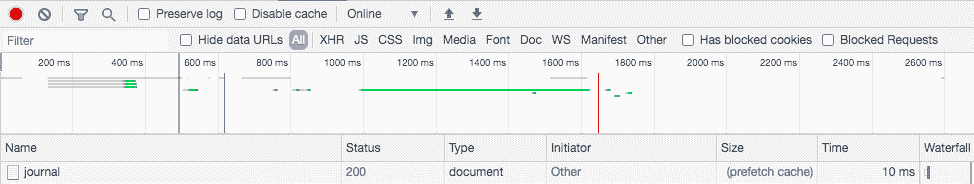
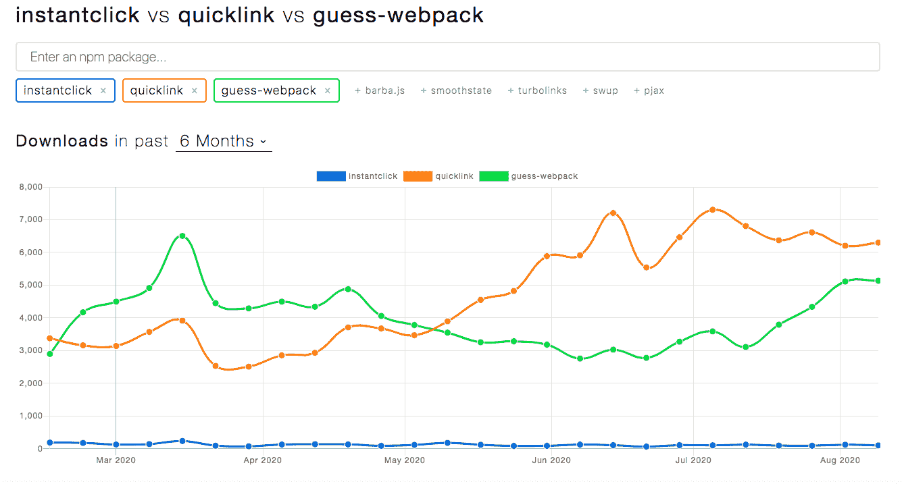
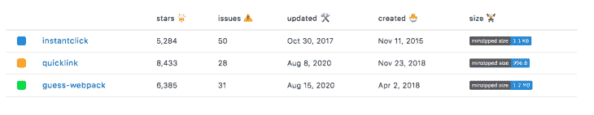

# 通过链接预取加快页面加载速度

> 原文：<https://blog.logrocket.com/faster-page-load-times-with-link-prefetching/>

从各种[研究](https://wpostats.com/)中可以看出，更快的加载时间和更高的转换率之间存在直接关联。当严格分析时，原因很简单，用户希望快速获得信息，当一个网站需要很长时间才能提供信息时，他们就会转向其他网站。

我们可以通过使用链接预取来改善导航的页面加载时间，从而减少用户离开应用程序的机会。链接预取是一种用于提前获取链接的技术，可以加快后续导航的速度。

在本文中，我们将研究三个可用于预取链接的库，并探讨每个库的优缺点。

## 用`link=prefetch`预取

在我们进入库之前，我想指出浏览器有一个用于预取链接的内置方法。本文中讨论的一些库在幕后使用这种方法，而其他库则不使用。

当浏览器下载完页面的关键资源并且没有处理太多用户交互时，它会有一些空闲时间。这个空闲时间是获取带有`<link=prefetch>`的链接并存储在缓存中的时间。当用户导航到该链接时，它是从缓存中获取的，这加快了导航速度。

预取链接非常简单，只需添加:

```
<link rel="prefetch" href="/journal" as="document">
```

`as=document`告诉浏览器要预取的资源类型，以便它设置适当的头。其他选项有`style`、`script`、`font`和[更有](https://www.w3.org/TR/preload/#as-attribute)。

当用户导航到预取页面时，在网络选项卡中，您会在大小列下看到**预取缓存**，如下图所示。您会注意到加载时间是 10 毫秒，因此页面会立即呈现给用户。



如果您不希望有第三方代码，您可以以此为起点推出自己的定制解决方案。

浏览器预取机制的一个限制是它只能与`<link>`标签一起工作。在定制和灵活性方面，你也无能为力。在本文的其余部分，我们将研究三个不同的库以及每个库预取链接的方法。

## 瞬间点击

从[官方文档](http://instantclick.io/)来看，InstantClick 是一个 JavaScript 库，它极大地加速了你的网站，使得导航在大多数情况下都是即时的。InstantClick 的工作原理是当一个链接(`<a>`)停留在(对于移动设备，停留在`touchstart`)上时预取链接，这样当用户实际点击链接时，页面已经被下载了。

你可以通过 [CDN](https://cdnjs.com/libraries/instantclick) 或者 [npm](https://www.npmjs.com/package/instantclick) 上的非官方软件包开始使用 InstantClick。从项目目录中的命令行运行命令:

```
npm install --save instantclick
```

然后在您的项目中使用它:

```
import InstantClick from 'instantclick'

InstantClick.init()
```

如果您正在使用 CDN，请将`<script>`添加到您的文档中。

```
<script src="https://cdnjs.cloudflare.com/ajax/libs/instantclick/3.1.0/instantclick.min.js"></script>
```

然后初始化它:

```
<script data-no-instant>InstantClick.init();</script>
```

您还可以传递其他配置参数，以确定何时开始预取链接以及将链接保留在缓存中的时间:

```
InstantClick.init({
  preloadingMode: 50, // Mouseover duration before preload is triggered
  preloadCacheTimeLimit: 30000 // How long to cache preloaded pages
});
```

这是您需要将 InstantClick 添加到应用程序中的基本内容。在[文档](http://instantclick.io/)中可以找到你可以做的其他事情。

## 快速链接

接下来，我们将看看[快速链接](https://github.com/GoogleChromeLabs/quicklink)，它采用不同的方法来预取链接。该方法可以分为四个步骤:

*   检查当前在视窗中的所有链接(使用 [IntersectionObserver](https://developer.mozilla.org/en-US/docs/Web/API/Intersection_Observer_API) 可见的链接)
*   检测浏览器是否不忙(使用 [requestIdleCallback](https://developer.mozilla.org/en-US/docs/Web/API/Window/requestIdleCallback)
*   检查用户是否处于慢速连接状态(使用[网络信息 API](https://developer.mozilla.org/en-US/docs/Web/API/Network_Information_API)
*   预取链接的 URL(使用`<link rel=prefetch>`或 XHR 或 fetch)

开始就像在文档底部添加带有 CDN 链接的`<script>`一样简单。quicklink 也可以通过 npm 安装。

要通过 npm 安装:

```
npm install --save quicklink
```

或者使用 cdn:

```
<script src="https://cdnjs.cloudflare.com/ajax/libs/quicklink/2.0.0/quicklink.min.js"></script>
```

然后像这样初始化它:

```
quicklink.listen();
```

初始化期间还可以传递其他配置选项。其中一些是:

```
quicklink.listen({
  timeout: 4000, // defaults to 2 seconds
  el: document.getElementById('carousel'), // DOM element to observe for viewport links
  origins: ['example.com'], // list of origins to allow to prefetch from, defaults to hostname
  priority: true // defaults to low-priority
});
```

整个库的重量不到 1kb，所以它是非常轻量级的。

## Guess.js

在涵盖的所有库当中， [Guess.js](https://github.com/guess-js/guess) 需要的设置开销最大。这在一定程度上是由于用于确定要预取的链接的数据驱动方法。另一个重要因素是开发环境，框架(Angular，Nuxt.js，Gatsby，Next.js)还是静态站点？第二部分很重要，因为开发环境决定了设置。

让我们看一个关于 [Nuxt.js](https://nuxtjs.org/) 框架的例子。Nuxt.js 将`pages/`目录中的每个`*.vue`文件转换成一个路由。假设我们有这样一个结构:

```
pages/
├── about.vue
├── example.vue
├── index.vue
└── media.vue
```

这会生成以下路线:

```
/about
/example
/
/media
```

要将 guess.js 与 Nuxt.js 一起使用，请将`guess-webpack`安装为`devDependency`:

```
npm i -D guess-webpack
```

然后在`nuxt.config.js`中，添加以下代码片段:

```
import { readFileSync } from 'fs'
import { GuessPlugin } from 'guess-webpack'

export default {
  ...
  build: {
    ...
    extend(config, ctx) {
      if (ctx.isClient) {
        config.plugins.push(
          new GuessPlugin({
            reportProvider() {
              return Promise.resolve(JSON.parse(readFileSync('./routes.json')))
            }
          })
        )
      }
      ...
    }
  },
  // Nuxt > v2.4.0
  router: {
    prefetchLinks: false
  }
}
```

Nuxt.js v2.4.0 默认使用 quicklink，所以我们用`prefetchLinks: false`覆盖它。在与`nuxt.config.js`相同的目录下创建一个文件`routes.js`，并添加以下内容:

```
{
  "/": {
    "/example": 80,
    "/about": 20
  },
  "/example": {
    "/": 20,
    "/media": 0,
    "/about": 80
  },
  "/about": {
    "/": 20,
    "/media": 80
  },
  "/media": {
    "/": 33,
    "/about": 33,
    "/example": 34
  }
}
```

这个文件是一个示例文件，它显示了用户从一条路线到另一条路线的次数。例如，如果我们查看最后一个对象，我们会看到从`/media`开始，用户访问了`/`的 33 个会话，用户访问了`/about`的另外 33 个会话，以及用户访问了`/example`的 34 个会话。

Guess.js 获取这些数据，并建立一个模型，根据用户下一次导航到该页面的概率来预测要预取哪些链接。Guess.js 还允许你从像 Google Analytics 这样的分析工具中获取真实世界的数据。这种真实世界的用法使得预取链接更加准确和高效，因为它是基于真实世界的数据。你可以在这里看到如何用 Guess.js 和 Nuxt.js [配置 Google Analytics。](https://guess-js.github.io/docs/nuxt)

## 统计数据和趋势



从上图可以看出，quicklink 和 guess-webpack (guess.js)是最近 6 个月下载量最多的库，quicklink 在今年 5 月左右超过了 guess.js。InstantClick 在 npm 上的下载量最低，这可能是因为它不是一个官方包。



从上表可以看出，GitHub 的统计数据更加接近。截至本文撰写之时，quicklink 拥有 8433 颗星(最多)和 28 期(最少)。就大小而言，它也是最小的(< 1kb)。guess-web pack——guess . js 的 npm 包——就大小而言是最大的(1.2mb)。InstantClick 在 GitHub (50)上有最多的问题，看它最后一次更新的时间，它似乎不再被积极维护。

## 开发者体验

下表给出了在决定选择哪一个之前需要考虑的一些因素:

| 图书馆 | 证明文件 | 功能 | 外卖食品 | 定论 |
| --- | --- | --- | --- | --- |
| 瞬间点击 | 有据可查。该文档解释了用于预取链接的技术。它还展示了如何将它添加到静态网站和不同的可用配置选项。 | 如果在预取完成前移除鼠标，则无法预取链接。然而，这不会破坏导航，当用户下一次悬停在链接上时，可以预取该链接。 | 稍加调整就可以快速添加到项目中。它有几个配置选项，可以控制如何预取链接。它不是主动维护的，所以如果你不想钻研源代码，你可以考虑其他的选择。 | 它看起来没有得到积极的维护，所以如果遇到问题，可能没有足够的支持。总的来说，它是稳定的，并且以可预测的方式工作。 |
| 快速链接 | 文档显示了如何建立和运行静态网站和使用框架。也有针对不同用例的配方。 | 它像描述的那样工作。一旦链接进入视口，它就开始预取它们。它可能不会在较慢的连接上预取链接以保留用户带宽。 | 它的可配置性很强，集成相对容易。这个库是由谷歌 Chrome 团队开发的，它仍然在积极维护，所以如果你遇到任何问题，社区会提供很好的支持。 | 就大小而言，它是三个库中最小的，但它得到了积极的维护，因此在出现挑战时有支持。考虑到所有的因素，它对任何项目都是一个可靠的赌注。 |
| Guess.js | 图书馆是有据可查的。有如何在不同的框架和环境中设置库的例子。 | 根据一段时间以来收集的分析数据，预取的链接被点击的概率很高。 | 虽然需要一些时间来设置，但这是值得的。一个很好的例子是电子商务应用程序。购物车页面上的用户很可能会转到结账页面。Guess.js 将根据您的分析数据构建一个模型，并根据您用户的真实数据智能地预取结账页面！ | 这是一个令人兴奋的库，使用案例不仅仅是预取链接。以前的库可能更适合中小型网站。然而，在大型应用程序中基于真实数据预取链接的好处将是无价的。 |

## 结论

在本文中，我们已经介绍了三个可以用来预取链接的库，并研究了它们用来决定预取哪些链接的方法。我们还研究了预取链接的内置方法。

您使用的库取决于您正在处理的项目。我们已经看到了每个库的优缺点，因此您可以决定哪个最适合您正在进行的项目。无论你选择使用哪一个库，它都会确保你的链接被预取，从而提高用户的导航速度。

## 使用 [LogRocket](https://lp.logrocket.com/blg/signup) 消除传统错误报告的干扰

[](https://lp.logrocket.com/blg/signup)

[LogRocket](https://lp.logrocket.com/blg/signup) 是一个数字体验分析解决方案，它可以保护您免受数百个假阳性错误警报的影响，只针对几个真正重要的项目。LogRocket 会告诉您应用程序中实际影响用户的最具影响力的 bug 和 UX 问题。

然后，使用具有深层技术遥测的会话重放来确切地查看用户看到了什么以及是什么导致了问题，就像你在他们身后看一样。

LogRocket 自动聚合客户端错误、JS 异常、前端性能指标和用户交互。然后 LogRocket 使用机器学习来告诉你哪些问题正在影响大多数用户，并提供你需要修复它的上下文。

关注重要的 bug—[今天就试试 LogRocket】。](https://lp.logrocket.com/blg/signup-issue-free)