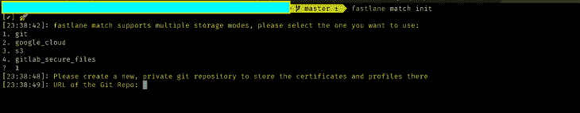

# fastlane:构建、测试和发布 React 本地应用

> 原文：<https://blog.logrocket.com/fastlane-build-test-ship-react-native-apps/>

React Native 是用于创建移动应用程序的最流行的基于 JavaScript 的框架之一。它通过支持创建运行在 iOS 和 Android 上的跨平台应用程序，减少了整体应用程序开发所需的整体复杂性和时间。

但是，为了构建 React 原生应用程序并进行分发，开发人员必须首先签署证书，编译并更新版本，然后将构建提交到适用于 iOS 的适当平台应用程序商店和适用于 Android 的 Google Play。

在本文中，我们将展示如何利用 [GitHub 动作](https://github.com/features/actions)和 [fastlane](https://fastlane.tools) 来自动化这些繁琐的任务。

这篇文章将帮助你自动构建、测试和分发用 React Native 构建的 iOS 和 Android 应用。

## 内容

## 什么是快车道？

fastlane 是一个帮助 iOS 和 Android 开发者自动化耗时操作的解决方案。该平台有助于通过持续部署交付高质量的应用，而不会影响开发人员日常工作的速度或敏捷性。

fastlane 除了 Ruby 命令行实用程序之外，还提供了本机 Gradle (Android)和 Xcode (iOS)插件。它管理诸如注册应用商店和 Google Play、向商店发布应用、部署测试软件、 [Firebase Crashlytics](https://rnfirebase.io/crashlytics/usage) 等任务。您已经拥有的任何 [CI 系统](https://docs.fastlane.tools)也将与 fastlane 一起运行。

## 设置快速通道

在我们开始之前，有一些系统要求必须在本地安装。

fastlane 官方支持在 macOS 上运行；fastlane 只部分支持 Linux 和 Windows，因为 Xcode 之类的工具只能在 macOS 上运行。

浪子可以与 macOS 的 Homebrew 一起安装:

```
brew install fastlane

```

或者，使用 RubyGems for macOS、Linux 和 Windows:

```
sudo gem install fastlane  # Make sure ruby is already installed

```

有两种方法可以将 fastlane 添加到 React 本机项目中:

1.  在 Android 和 iOS 各自的文件夹中分别使用`fastlane init`命令；fastlane 将自动检测平台，请求任何必要的信息，并配置平台
2.  在 React 本地项目的根目录下创建一个`fastlane`文件夹，并向其中添加一个`Fastfile`文件。然后，手动为 iOS 和 Android 进行配置

在本文中，我们将使用第二种方法。

## 为 Android 配置 fastlane

让我们从为 Android 配置 fastlane 开始。

如前所述，我们将在项目的根目录下创建一个`fastlane`文件夹，并将一个`Fastfile`文件添加到该文件夹中。我们将在 iOS 和 Android 上使用同样的`Fastfile`文件。

在做其他事情之前，让我们检查并清理一下 Git 分支。我们将为 Android 发行设置两条通道，一条用于 beta 测试，一条用于最终版本。

首先，我们将定义一个 Android 平台，如下所示:

```
platform :android do 
    desc "Release for the Android beta"
    lane :beta do 
        increment_version_code('app_project_dir': './andriod/app')
        gradle(task: 'clean', project_dir: './andriod')
        gradle(task: 'bundle', bundle_type: 'Release', project_dir: './andriod')
        supply(track: 'beta', abb: './andriod/app/build/outputs/apk/app-beta-release.apk')
    end
    desc "Release for the Android production"
    lane : release do
        increment_version_code(app_project_dir: './android/app')
        increment_version_name(app_project_dir: './android/app', bump_type: 'patch')
        gradle(task: 'clean', project_dir: './android/')
        gradle(task: 'bundle', bundle_type: 'Release', project_dir: './andriod', properties: {
            "android.injected.signing.store.file" => ENV['ANDROID_KEYSTORE_FILE'],
            "android.injected.signing.store.password" => ENV['ANDROID_KEYSTORE_PASSWORD'],
            "android.injected.signing.key.alias" => ENV['ANDROID_KEYSTORE_ALIAS'],
            "android.injected.signing.key.password" => ENV['ANDROID_KEYSTORE_PASSWORD']
        })
        supply(track: 'production', aab: './android/app/build/outputs/bundle/release/app_release.aab', release_status: 'draft')
    end
end

```

接下来，我们将为测试版创建一个分销渠道，并添加一组要执行的操作。

下一步我们将利用 Gradle 来清理建筑。接下来，我们将执行 Gradle 包来构建 APK 或 AAB。

最后一步，我们将使用 [CI 实用程序供应](https://docs.fastlane.tools/actions/supply/#supply)向 Google Play 提交元数据、屏幕截图、二进制文件和应用捆绑包。

Android 应用程序发布渠道将会以与测试渠道相同的方式创建；此时，我们将添加 Keystore 和 Google 凭证进行发布。

***注意，*** *fastlane 的补给工具只有在你至少成功发布一次你的 Android 应用到 Google Play 的情况下才有效。*

## 为 iOS 配置快速通道

现在，让我们为 iOS 配置 fastlane。在我们开始之前，Xcode 和 macOS 是使用 fastlane 发布 iOS 应用程序的先决条件。

我们将为 iOS 分发设置两条通道，一条用于 TestFlight，一条用于 App Store 发布。

```
platform :ios do 
    private_lane :update_version do
        app_store_version = get_app_store_version_number(bundle_id: 'rnFastlane')
        plist_version = get_version_number_from_plist(xcodeproj: './ios/rnFastlane.xcodeproj')
        if Gem::Version.new(plist_version.to_f) == Gem::Version.new(app_store_version.to_f)
            increment_version_number_in_plist(xcodeproj: './ios/rnFastlane.xcodeproj', bump_type: 'minor')
        else
            increment_version_number_in_plist(xcodeproj: './ios/rnFastlane.xcodeproj', bump_type: 'patch')
        end
    end
    private_lane :testflight_build do 
        increment_build_number_in_plist(xcodeproj: './ios/rnFastlane.xcodeproj', target: 'rnFastlane')
        gym(scheme: 'rnFastlane', workspace: './ios/rnFastlane.xcworkspace')
    end
    private_lane :distribution_build do
        increment_build_number_in_plist(xcodeproj: './ios/rnFastlane.xcodeproj', target: 'rnFastlane')
        create_keychain(
            name: ENV['KEYCHAIN_NAME'],
            password: ENV['KEYCHAIN_PASSWORD'],
            default_keychain: true,
            unlock: true,
            timeout: 3600,
            add_to_search_list: true)

        match(
            type: 'app-store',
            keychain_name: ENV["KEYCHAIN_NAME"],
            keychain_password: ENV["KEYCHAIN_PASSWORD"],
            readonly: true,
            shallow_clone: true,
            verbose: false)    
        gym(
            scheme: 'rnFastlane', 
            workspace: './ios/rnFastlane.xcworkspace',
            export_method: 'ad-hoc',
            output_directory: "./build", 
            configuration: 'Release',
            output_name: "rnFastlane.ipa"
            clean: true
            export_options: {
                method: 'app-store',
                provisioningProfiles: {
                    'rnFastlane' => ENV["sigh_#{options[:app_identifier]}_app-store_profile-name"],
                }
            })
    end
    desc "Release for the iOS beta"
    lane :beta do
        testflight_build
        upload_to_testflight(username: ENV['APP_STORE_EMAIL'] app_identifier: 'rnFastlane')
        commit_version_bump(message: 'bump build')
        push_to_git_remote
    end
    desc "Release for the iOS production"
    lane :release do
        distribution_build
        deliver
        commit_version_bump(message: 'bump build')
        push_to_git_remote
    end
end

```

### 增加版本号

下一步是为更新版本添加一个专用通道。

我们将使用
`get_app_store_version_number`和`get_version_number_from_plist`插件方法从 App Store 和 plist 文件中获取版本。这使得能够使用`increment_version_number_in_plist`方法增加次要和补丁凸点类型的版本号。

### 设置证书和预置描述文件

现在，我们将使用`match`来设置证书和配置文件。 [`match`包含在 iOS 应用的快车道](https://docs.fastlane.tools/actions/match/)中，用于代码签名。有了`match`，整个开发团队可以使用单一的代码签名身份。

在添加`match`之前，我们需要创建一个私有的 GitHub 存储库来存储证书。然后，我们可以用下面的命令安装`match`:

```
fastlane match init 

```



接下来，我们需要添加一个私有 repo 来存储证书，如上所示。在`fastlane`文件夹下生成一个`Matchfile`。一旦`match`设置完成，我们就可以为开发和应用商店创建证书和配置文件。

```
fastlane match appstore 
# for the appstore
```

```
fastlane match development
# for the development 

```

当执行上述命令时，它会将证书添加到私有 repo 中。

### 构建 iOS 应用程序

另一个快速通道功能`[gym](https://docs.fastlane.tools/actions/gym/)`将用于构建 iOS IPA 应用。`gym`还将有助于自动化测试版软件的部署和分发。

### 上传版本

现在是时候上传我们的构建了。我们将使用`upload_to_testflight`函数上传试飞，使用`deliver`函数提交[应用商店](https://docs.fastlane.tools/actions/deliver/#deliver)。`deliver`服务是快车道的一部分；它用于将元数据和 IPA 上传到 App Store。

## 使用 GitHub 动作自动化工作流程

GitHub Actions 是一个新的 GitHub 特性，它使得在云中创建和运行工作流变得容易。我们将设置 GitHub 操作来自动化 Android 和 iOS 发行版的构建和发布工作流。

首先，我们将为 iOS 和 Android 添加两个独立的工作流。在项目的根级别，我们将创建一个`.github`文件夹；在这个文件夹下，我们将创建另一个名为`workflows`的文件夹。然后，我们将把 iOS 版的`ios_release.yml`和 Android 版的`android_release.yml`添加到`.github > workflows`文件夹中。

```
mkdir .github && cd .github && mkdir workflows && cd workflows && touch andriod_release.yml && touch ios_release.yml

```

### 定义 GitHub 操作工作流

我们将定义 GitHub 动作工作流，如下所示:

```
on:
  push:
    tags:
      - 'android*'

```

当我们添加一个包含关键字`android`的标签时，Android 版本的构建就开始了，如上所述。这里有一个例子:

```
git tag -a 'versions' -m "andriod release"

```

为 Android 发布工作流定义了两个作业，一个用于 beta 版，一个用于 Google Play 版。

接下来，我们将定义最新版本的 Ubuntu 虚拟机来运行 GitHub Actions 工作流。

```
name: Build and deploy Android release
on:
  push:
    tags:
      - 'android*'
jobs:
  testFlight-build:
    name: android-beta-build
    runs-on: ubuntu-latest
    strategy:
      matrix:
        node-version: [12.x]
    steps:
      - uses: actions/[email protected]
        with:
          node-version: ${{ matrix.node-version }}
      - name: Checkout to git repository
        uses: actions/[email protected]
      - name: Install dependencies
        run: |
          yarn install
      - name: Install Fastlane
        uses: actions/[email protected]
        with:
          ruby-version: 2.6
      - name: Install npm dependencies
        run: |
          yarn install
      - name: Install Fastlane
        run: |
          bundle install
          bundle update fastlane
      - name: Build and upload to TestFlight
        run: |
          bundle exec fastlane android beta
          env: 
             ANDROID_KEYSTORE_FILE: ${{ secrets.ANDROID_KEYSTORE_FILE }}
             ANDROID_KEYSTORE_PASSWORD: ${{ secrets.ANDROID_KEYSTORE_PASSWORD }}
             ANDROID_KEYSTORE_ALIAS: ${{ secrets.ANDROID_KEYSTORE_ALIAS }}
             ANDROID_KEYSTORE_PASSWORD: ${{ secrets.ANDROID_KEYSTORE_PASSWORD }}
  release-build:
    name: Android-release-build
    runs-on: ubuntu-latest
    strategy:
      matrix:
        node-version: [12.x]
    steps:
      - uses: actions/[email protected]
        with:
          node-version: ${{ matrix.node-version }}
      - name: Checkout to git repository
        uses: actions/[email protected]
      - name: Install dependencies
        run: |
          yarn install
      - name: Install Fastlane
        uses: actions/[email protected]
        with:
          ruby-version: 2.6
      - name: Install npm dependencies
        run: |
          yarn install
      - name: Install Fastlane
        run: |
          bundle install
          bundle update fastlane
      - name: release-build
        run: |
          bundle exec fastlane android release
          env: 
             ANDROID_KEYSTORE_FILE: ${{ secrets.ANDROID_KEYSTORE_FILE }}
             ANDROID_KEYSTORE_PASSWORD: ${{ secrets.ANDROID_KEYSTORE_PASSWORD }}
             ANDROID_KEYSTORE_ALIAS: ${{ secrets.ANDROID_KEYSTORE_ALIAS }}
             ANDROID_KEYSTORE_PASSWORD: ${{ secrets.ANDROID_KEYSTORE_PASSWORD }}

```

在上面的代码中，我们定义了一系列的步骤，这些步骤是由 GitHub marketplace 提供的或者由社区支持的预定义操作。

我们将在接下来的一系列事件中添加安装 npm 依赖项、添加所需的 Node.js 版本以及安装 fastlane 的步骤，如上面的代码所示。

最后，我们为测试和发布工作运行快速通道构建。我们还使用 [GitHub Actions Secrets](https://docs.github.com/en/rest/actions/secrets) 来定义构建工作流期间所需的环境变量。

### 为 Github 操作创建和存储秘密

加密的秘密允许我们存储敏感信息。我们可以将环境变量、密钥和密码作为加密的秘密添加到 GitHub repo 中。存储库的秘密将可以被存储库上的任何工作流访问。

要添加密码，请进入回购的**设置**菜单。在**秘密** > **动作**部分(左导航)下，点击**新储存库秘密**按钮(右上方)添加新秘密。

在整个过程中，需要为 Android 和 iOS 应用程序添加密码，以便在上传之前正确签署应用程序。


### 定义 iOS 工作流

如前所述，我们通过在`.github > workflows`文件夹下创建一个不同的`ios release.yml`文件来区分 iOS 和 Android 版本。当我们添加一个包含`ios`关键词的标签时，iOS 版本的构建就开始了。

这里有一个例子:

```
git tag -a 'versions' -m "ios release"

```

对于 iOS 版本，我们将指定两个任务:一个用于 TestFlight 版本，一个用于 App Store 版本。

接下来，我们将定义最新版本的`macos-latest`虚拟机来运行 iOS 发行版的 GitHub 操作工作流。

```
name: Build and deploy iOS release
on:
  push:
    tags:
      - 'ios*'
jobs:
  testFlight-build:
    name: iOS-testFlight-build
    runs-on: macos-latest
    strategy:
      matrix:
        node-version: [12.x]
    steps:
      - uses: actions/[email protected]
        with:
          node-version: ${{ matrix.node-version }}
      - name: Checkout to git repository
        uses: actions/[email protected]
      - name: Install dependencies
        run: |
          yarn install
      - name: Install Fastlane
        uses: actions/[email protected]
        with:
          ruby-version: 2.6
      - name: Install npm dependencies
        run: |
          yarn install
      - name: Install Fastlane
        run: |
          bundle install
          bundle update fastlane
      - name: Build and upload to TestFlight
        run: |
          bundle exec fastlane ios beta
          env: 
             APPLE_ID: ${{ secrets.APPLE_ID }}
             APP_STORE_EMAIL: ${{ secrets.APP_STORE_EMAIL }}
             APPLE_TEAM_ID: ${{ secrets.APPLE_TEAM_ID }}
             IOS_DISTRIBUTION_CERTS_GITHUB_URL: ${{ secrets.IOS_DISTRIBUTION_CERTS_GITHUB_URL }}
             MATCH_PASSWORD: ${{ secrets.MATCH_PASSWORD }}
  release-build:
    name: iOS-testFlight-build
    runs-on: macos-latest
    strategy:
      matrix:
        node-version: [12.x]
    steps:
      - uses: actions/[email protected]
        with:
          node-version: ${{ matrix.node-version }}
      - name: Checkout to git repository
        uses: actions/[email protected]
      - name: Install dependencies
        run: |
          yarn install
      - name: Install Fastlane
        uses: actions/[email protected]
        with:
          ruby-version: 2.6
      - name: Install npm dependencies
        run: |
          yarn install
      - name: Install Fastlane
        run: |
          bundle install
          bundle update fastlane
      - name: Build and upload to TestFlight
        run: |
          bundle exec fastlane ios beta
          env: 
             APPLE_ID: ${{ secrets.APPLE_ID }}
             APP_STORE_EMAIL: ${{ secrets.APP_STORE_EMAIL }}
             APPLE_TEAM_ID: ${{ secrets.APPLE_TEAM_ID }}
             IOS_DISTRIBUTION_CERTS_GITHUB_URL: ${{ secrets.IOS_DISTRIBUTION_CERTS_GITHUB_URL }}
             MATCH_PASSWORD: ${{ secrets.MATCH_PASSWORD }}

```

现在，我们定义一系列步骤来安装 npm 依赖项，添加所需的 Node.js 版本，并在接下来的一系列事件中安装 fastlane，如上面的代码所示。

最后，我们为试飞版本运行快速通道构建。我们使用 GitHub Actions Secrets 来定义构建工作流程中所需的环境变量。

## 结论

在本文中，我们演示了如何在 React 本地项目中设置 fastlane。结合使用 fastlane 和 GitHub 操作简化了 iOS 和 Android 应用程序的构建和发布，并改进了构建、测试和发布版本的部署管道。

参考官方文档了解更多关于[快车道](https://docs.fastlane.tools/)和 [GitHub 动作](https://docs.github.com/en/actions)的信息。

## [LogRocket](https://lp.logrocket.com/blg/react-native-signup) :即时重现 React 原生应用中的问题。

[](https://lp.logrocket.com/blg/react-native-signup)

[LogRocket](https://lp.logrocket.com/blg/react-native-signup) 是一款 React 原生监控解决方案，可帮助您即时重现问题、确定 bug 的优先级并了解 React 原生应用的性能。

LogRocket 还可以向你展示用户是如何与你的应用程序互动的，从而帮助你提高转化率和产品使用率。LogRocket 的产品分析功能揭示了用户不完成特定流程或不采用新功能的原因。

开始主动监控您的 React 原生应用— [免费试用 LogRocket】。](https://lp.logrocket.com/blg/react-native-signup)