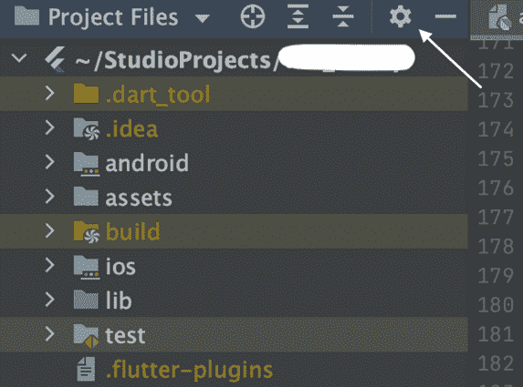
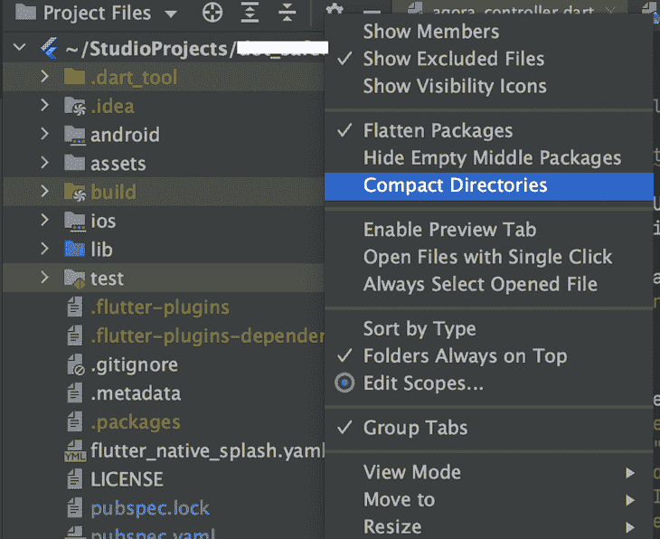
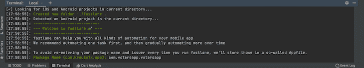
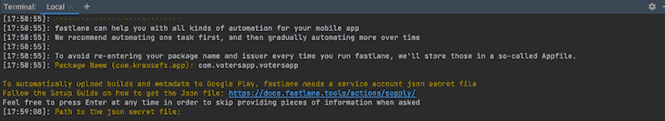
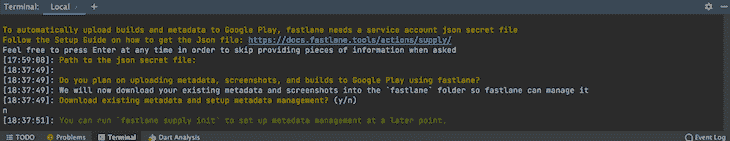
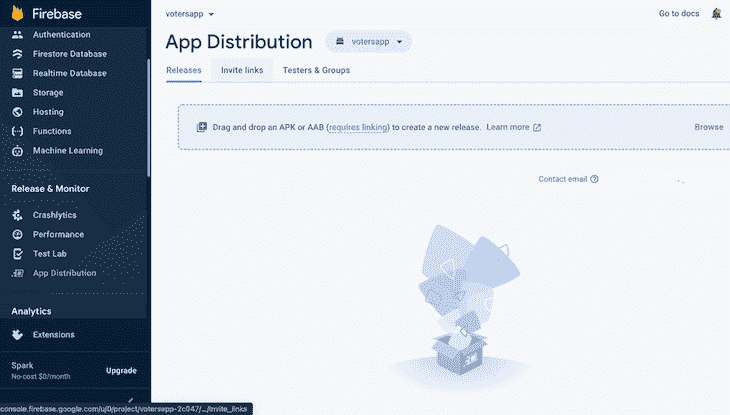
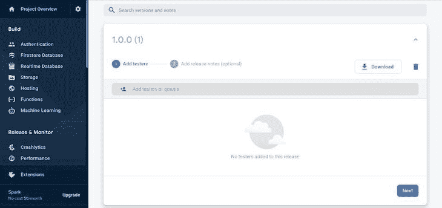

# 使用浪子颤振:一个完整的指南

> 原文：<https://blog.logrocket.com/fastlane-flutter-complete-guide/>

浪子是一个开源工具套件，用于自动发布和部署 Android 和 iOS 应用，受到许多开发者的青睐，因为它可以大大减少部署时间。使用 Android 和 iOS 应用程序可能会非常乏味，尤其是在处理截图、测试版部署、应用商店部署和代码签名等时。

这篇文章将指导你如何在你的 Flutter 应用中使用浪子。我们开始吧！

## 先决条件

要继续，我建议您:

*   主动颤振应用
*   熟悉 Flutter 和 Flutter SDK
*   熟悉 Firebase，并在其设备上安装 Firebase CLI
*   安装自制软件。如果你还没有，这里有一个关于如何在 Mac 上这么做的链接

## 安装

### **安装浪子**

要在您的 Flutter 应用程序中使用浪子，您需要正确安装它(注意，我们使用 macOS 来运行我们的应用程序)。

你可以查看关于在你选择的任何设备上安装浪子的文档。使用以下命令安装浪子:

```
brew install fastlane

```

要确认浪子已成功安装在您的设备上，请运行以下命令检查其版本:

```
fastlane -v

```

如果返回了浪子的版本和安装路径，我们就成功安装了浪子。

### **设置您的套餐****n**name

应用程序的包名必须不同。

如果您使用 Android Studio 创建了 Flutter 应用程序，那么您已经为您的应用程序分配了一个默认的包名。包名称对您的本地设备是唯一的，但可能不在 Google Play 或 App Store 上。

如果你想改变你的应用程序包名称，你可以在 Android Studio 中完成。在 Android Studio 的项目窗格中，单击顶部的设置图标:



这将弹出一个下拉菜单；确保未选中**压缩目录**选项:



接下来，您可以重构您的包名。为此，右击应用程序的包名，选择**重构**，然后选择**重命名**。将弹出一个窗口；在窗口中点击**重命名包**，重命名，然后保存更新。

### **设置供应** **和** **获取我们的 JSON 文件**

Supply 是浪子的一个工具，可以让你上传应用元数据、二进制文件和截图到 Google Play。

要初始化 Supply，您需要在 Google Play 控制台中将 APK 成功上传到您的应用程序至少一次。设置它需要从您的 Google 开发者服务帐户下载一个凭证文件。

现在，我们需要获得我们的 JSON 秘密文件。当我们设置浪子部署流程时，将需要这个文件。要获取该文件，请按照下列步骤操作:

1.  打开你的 [Google Play 控制台](https://play.google.com/console/)账户，点击**账户详情**部分，记下列出的开发者账户 ID
2.  接下来，点击**设置**，然后点击 **API 访问**
3.  点击**创建新的服务账户**按钮
4.  关注对话框中的谷歌云平台链接；这将打开一个新窗口，然后执行以下操作:
    1.  点击位于谷歌云平台控制台顶部的**创建服务账户**按钮
    2.  确保你在正确的谷歌云平台项目上
    3.  输入服务帐户名，点击**创建**
    4.  接下来，选择一个角色；找到并选择**服务账户用户**，点击**继续**
    5.  点击**完成**
    6.  接下来，选择您刚刚创建的服务帐户的**动作**垂直三点图标
    7.  在菜单上选择**管理**T2 键。
    8.  点击**添加密钥**，然后**创建新密钥**
    9.  确保选择 JSON 作为密钥类型，然后单击**创建**
    10.  创建完成后，您就有了 JSON 文件。记下文件的路径
5.  回到 Google Play 控制台模块，点击**完成**关闭对话框
6.  接下来，为屏幕底部新添加的服务帐户选择**授权访问**。如果没有显示，请尝试刷新页面以反映最新更新
7.  选择您选择的权限
8.  邀请用户结束流程

## 正在初始化浪子

在标准的手动应用程序部署实例中，一旦有了惟一的包名，下一步就是打包应用程序进行分发，然后创建新的密钥库，等等。我们将使用浪子来处理整个过程。

要继续，请转到您的 Flutter 应用程序的根目录，并通过导航到您的 Android 文件夹目录并运行以下命令来初始化 Android 部署的浪子:

```
fastlane init

```

您将收到输入应用程序包名称的提示；在我们的例子中，我们的应用程序名是 votersapp，包名是`com.votersapp.votersapp`。

> **注意**，你可以在`defaultConfig`选项的`bundle.gradle`文件下找到你的包名。

输入您的包名后，点击**进入**。



接下来，您将收到一个提示，要求您输入 JSON secret 文件的路径。输入我们上面下载的 JSON 文件的路径。或者，如果您还没有获得 JSON 文件，单击**输入**跳过这一步。



接下来，您会收到一个通知或弹出窗口，询问您是否打算上传任何元数据或截图；在本演示中，我们不会上传这些内容，因此输入“n”。



点击**进入**从这里开始设置其余的初始化。

一旦完成，我们将在 Android 目录中看到一个`Fastlane`文件夹。这里面有一个`Appfile`和一个`fastfile`。按照流程初始化 iOS 版浪子。浪子文件包含所有浪子配置工具。

要获取所有 Google Play 商店元数据，请运行:

```
fastlane supply init

```

现在，要将我们的应用程序部署到 Play Store，导航到项目的目录并在终端中执行以下命令:

```
flutter clean && flutter build apk

```

## 部署应用程序进行测试

为了展示浪子的能力，我们将部署我们的 APK 到 Firebase 应用程序分发。我们可以使用浪子应用程序执行测试和 CI/CD。

现在，我们将设置我们的 Firebase 项目。为此，请按照下列步骤操作:

1.  前往 [Google Firebase 控制台](https://console.firebase.google.com/)并创建一个帐户，如果你还没有的话
2.  点击**创建一个项目**
3.  指定您的项目名称并点击**继续**
4.  在左侧的菜单边栏上，选择**应用分发**和 Android 图标
5.  点击**注册申请**
6.  为包名指定与应用程序中指定的相同的包名。如果您没有使用任何 Firebase 服务，请跳过下载`google-services.json`文件
7.  点击**继续**为您的项目注册应用分发
8.  您的设置应该是这样的:
    
9.  最后，转到 tester and group 部分，创建一个新的组。然后，向组中添加一个新的测试人员

要将 Flutter 应用程序分配给浪子，请在您的终端中执行以下命令:

```
fastlane app_plugin firebase_app_distribution

```

在您的浪子文件中，用下面的代码替换现有代码。该代码将确保您映射浪子发行版以部署到 Firebase。

```
default_platform(:android)

platform :android do
 desc "Deploy to Firebase app distribution"
 lane :deploy do
  begin
  firebase_app_distribution(
   groups: "testers",
   release_notes: "Fixing bug in features",
   apk_path: "../build/app/outputs/flutter-apk/app-release.apk",
   firebase_cli_path: "/usr/local/bin/firebase",
   firebase_cli_token: <FIREBASE_CLI_TOKEN>
   app: <YOUR_APP_ID>
  )
  end
 end
end

```

在您的终端中运行下面的命令，并授予 Firebase 访问权限，以获得上面代码中的 Firebase CLI 令牌。

```
firebase login:ci

```

复制并替换为上面代码中`firebase_cli_token`的值。

> **N.B.** ，这是秘密，应该妥善保管。

从 Firebase 控制台获取您的应用 ID。

接下来，我们将通过指定我们希望部署的通道来部署我们的应用程序。

在我们放在浪子文件中的代码中，我们部署了“lane”字段的值。因此，要在其他通道中执行部署，我们将告诉浪子运行该特定通道。为了使用浪子部署我们的应用程序，我们在这里实现命令:

```
fastlane deploy.

```

上面的命令将上传特定车道中指定的 APK。完成后，您可以前往 Firebase 控制台，查看使用浪子部署的应用程序。



## 结论

浪子简单且易于实现——正如我在介绍中提到的，它节省了几个小时的部署时间，而且非常有用。

在本文中，我们展示了安装和初始化浪子以及部署应用程序进行测试的过程。查看官方文件以了解更多关于浪子的信息。编码快乐！

## 使用 [LogRocket](https://lp.logrocket.com/blg/signup) 消除传统错误报告的干扰

[](https://lp.logrocket.com/blg/signup)

[LogRocket](https://lp.logrocket.com/blg/signup) 是一个数字体验分析解决方案，它可以保护您免受数百个假阳性错误警报的影响，只针对几个真正重要的项目。LogRocket 会告诉您应用程序中实际影响用户的最具影响力的 bug 和 UX 问题。

然后，使用具有深层技术遥测的会话重放来确切地查看用户看到了什么以及是什么导致了问题，就像你在他们身后看一样。

LogRocket 自动聚合客户端错误、JS 异常、前端性能指标和用户交互。然后 LogRocket 使用机器学习来告诉你哪些问题正在影响大多数用户，并提供你需要修复它的上下文。

关注重要的 bug—[今天就试试 LogRocket】。](https://lp.logrocket.com/blg/signup-issue-free)