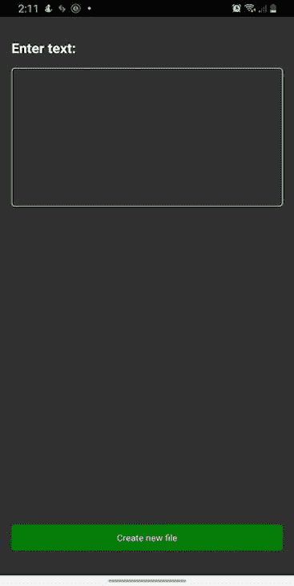
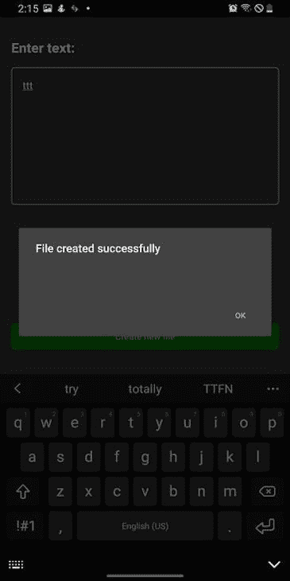
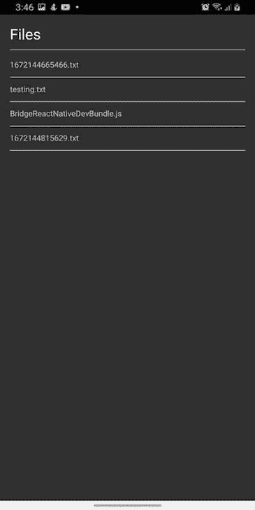
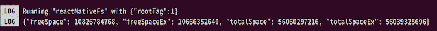

# 如何在 React Native 中获取和处理 blob 数据

> 原文：<https://blog.logrocket.com/fetch-handle-blob-data-react-native/>

有时，当使用 React Native 时，我们可能需要访问设备的文件系统来执行某些操作。这些操作可能包括创建、保存和编辑文件，或者从云中上传或下载文件。

这就是`react-native-fs`和`react-native-blob-util`包发挥作用的地方。这些包为 React Native 提供了本地文件系统访问。换句话说，对于 React 本地开发人员来说，它们使得文件访问和数据传输更加容易和高效，尤其是对于像 blobs 这样的大文件。

本文将探讨如何在 React Native 中管理云数据，方法是使用这两个包来获取和处理 blobs，以及创建、保存和读取文件。我们将涵盖:

## 什么是斑点？

Blob 是“二进制大对象”的缩写这种数据类型保存多媒体对象，如图像和视频、gif 和音频。它将二进制数据存储为单个实体。

要在 React Native 中下载、上传和读取 blobs，我们可以使用`react-native-fs`或`react-native-blob-util`。这些软件包让开发人员可以直接从云存储中上传和下载数据，这种方式更有效，尤其是对于 blobs 这样的大文件。

## 使用`react-native-fs`管理云数据

在我们开始研究如何使用`[react-native-fs](https://blog.logrocket.com/how-to-access-file-systems-react-native/)`[包](https://blog.logrocket.com/how-to-access-file-systems-react-native/)管理我们的云数据之前，让我们先看看它在本地是如何工作的——也就是说，我们如何在我们的设备上创建、读取和保存文件。

要安装该软件包，请在您的终端中运行以下两个命令之一:

```
/* npm */
npm install react-native-fs

/* yarn */
yarn add react-native-fs

```

安装后，通过运行以下命令将包链接到您的项目:

```
react-native link react-native-fs

```

这将自动将`react-native-fs`包添加到您的项目中。在自动链接由于某种原因对你不起作用的情况下，[查看官方文档](https://github.com/itinance/react-native-fs#usage-android)，看看如何手动将包链接到你的项目。

### 创建和保存文件

为了创建一个文件，`react-native-fs`提供了一个叫做`writeFile`的方法。它允许我们将文件写入文件路径。语法如下:

```
writeFile(filepath, contents, encoding)

```

让我们来看看这个方法的每个组成部分:

*   `filepath` —要保存文件的目录或绝对路径
*   `contents` —文件内容，或您想要保存的内容
*   `encoding` —可以是 UTF-8、ASCII 值或您要保存文件的属性

关于使用`react-native-fs`创建和保存文件的示例，请参见下面的代码:

```
/* App.js */ 

import React, {useState} from 'react';
import {
  SafeAreaView,
  StyleSheet,
  Text,
  TextInput,
  View,
  TouchableOpacity,
  Alert,
} from 'react-native';
import {DocumentDirectoryPath, writeFile} from 'react-native-fs';

const App = () => {
  const [text, setText] = useState('');
  const filePath = `${DocumentDirectoryPath}/testing.txt`;

  const createFile = async () => {
    try {
      await writeFile(filePath, text, 'utf8');
      Alert.alert('File created successfully');
    } catch (e) {
      console.log('error', e);
    }
  };
  return (
    <SafeAreaView style={styles.parent}>
      <View style={styles.container}>
        <View style={styles.textInput}>
          <Text style={styles.title}>Enter text:</Text>
          <TextInput
            value={text}
            onChangeText={setText}
            style={styles.textArea}
            multiline
            textAlignVertical="top"
          />
        </View>
        <TouchableOpacity onPress={createFile} style={styles.button}>
          <Text style={styles.buttonText}>Create new file</Text>
        </TouchableOpacity>
      </View>
    </SafeAreaView>
  );
};
const styles = StyleSheet.create({
  parent: {
    flex: 1,
  },
  container: {
    padding: 16,
    flex: 1,
  },
  textInput: {
    flex: 1,
    paddingVertical: 16,
  },
  textArea: {
    height: 200,
    borderWidth: 1,
    borderColor: '#ccc',
    borderRadius: 5,
    padding: 16,
    fontSize: 18,
  },
  title: {
    color: '#fff',
    fontSize: 24,
    fontWeight: 'bold',
    marginBottom: 16,
  },
  button: {
    borderRadius: 5,
    marginBottom: 20,
    backgroundColor: 'green',
  },
  buttonText: {
    color: '#fff',
    fontSize: 16,
    textAlign: 'center',
    paddingVertical: 10,
  },
});
export default App;

```

在上面的代码中，我们从我们的`react-native-fs`包中导入`DocumentDirectoryPath`和`writeFile`。使用`DocumentDirectoryPath`常量，我们可以获得我们想要保存文件的目录文件路径。然后，使用`writeFile`方法，我们用输入的内容保存文件。

下图显示了在创建文件之前我们应该看到的内容:



保存文件后，我们现在应该看到以下内容:



### 用`readDir`和`readFiles`读取文件

在上一节中，我们成功地创建了一个名为`testing.txt`的新文件。现在，我们将继续阅读文件。这意味着我们将能够看到我们在目录中创建的所有文件的列表，并在我们选择每个文件时查看它们的内容。

`react-native-fs`包为我们提供了两种方法——`readDir`和`readFiles`。让我们看看如何使用每种方法来读取我们的文件。

#### 使用`readDir`方法

方法让我们读取路径或绝对路径的内容。语法如下:

```
readDir(directorypath)

```

此方法返回一个承诺，该承诺包含一个具有属性的对象数组。这些属性包括:

*   `ctime` —文件创建的日期；此属性仅适用于 iOS
*   `mtime` —文件上次修改或更改的日期
*   `name` —文件或项目的名称
*   `path` —包含文件或项目的绝对路径
*   `size` —显示文件的大小
*   `isFile` —返回一个布尔值的函数，该值显示项目是否为文件
*   `isDirectory` —返回布尔值的函数，该布尔值显示文件是否是目录

考虑以下情况:

```
/* App.js */

import React, {useState, useEffect} from 'react';
import {
SafeAreaView,
StyleSheet,
Text,
FlatList,
View,
TouchableOpacity,
} from 'react-native';
import {DocumentDirectoryPath, readDir} from 'react-native-fs';

const App = () => {
const [directory, setDirectory] = useState([]);

useEffect(() => {
const getDirectoryList = async () => {
try {
const pathList = await readDir(DocumentDirectoryPath);
setDirectory(pathList);
} catch (error) {
console(error);
}
};
getDirectoryList();
}, []);

const renderItem = ({item}) => (

{item.name}

);

return (

Files
{directory.length > 0 ? (
item.name}
/>
) : (
No files
)}

);
};
const styles = StyleSheet.create({
parent: {
flex: 1,
},
container: {
padding: 16,
flex: 1,
},
fileHeader: {
color: '#fff',
fontSize: 30,
marginBottom: 10,
borderColor: '#ccc',
paddingBottom: 10,
borderBottomWidth: 1,
},
list: {
marginVertical: 5,
paddingBottom: 12,
borderBottomWidth: 1,
borderColor: '#ccc',
},
listName: {
fontSize: 16,
},
});
export default App;
```

运行这段代码后，您应该会看到:


在上面的代码中，我们使用`try...catch`方法来读取使用`readDir`方法的目录路径。然后，我们在状态中设置对`directory`数组的响应。接下来，我们使用`FlatList`映射数组，并呈现文件列表，如上图所示。

使用`readFile`方法

#### 方法让我们读取已经保存的文件的内容。它还返回一个包含一组具有属性的对象的承诺，就像`readDir`方法一样。语法如下:

让我们看看在下面的代码中使用`readFile`方法的例子:

```
readFile(filename, encoding)

```

在上面的代码中，我们使用我们的`FlatList`方法和`renderItem`函数来获取目录中的文件列表并通过它们进行映射。

```
/* App.js */

import React, {useState, useEffect} from 'react';
import {
  SafeAreaView,
  StyleSheet,
  Text,
  FlatList,
  View,
  TouchableOpacity,
} from 'react-native';
import {DocumentDirectoryPath, readDir, readFile} from 'react-native-fs';

// component of the file we want to view
const ViewFile = ({content, onclose}) => {
  const [fileContent, setFileContent] = useState(null);
  useEffect(() => {
    const getContent = async () => {
      try {
          if (content.isFile()) {
          const response = await readFile(content.path, 'utf8');
          setFileContent(response);
        }
      } catch (error) {
        console.log(error);
      }
    };
    getContent();
    return () => getContent();
  }, []);

  return (
    <View style={styles.parent}>
      <View style={styles.container}>
        <View>
          <Text style={[styles.fileHeader, {textTransform: 'capitalize'}]}>
            {content.name.replace('.txt', '')}
          </Text>
        </View>
        <Text style={styles.content}>{fileContent}</Text>
      </View>
      <TouchableOpacity style={styles.button} onPress={onclose}>
        <Text style={styles.buttonText}>Go Back</Text>
      </TouchableOpacity>
    </View>
  );
};

// main component
const App = () => {
  const [directory, setDirectory] = useState([]);
  const [readFIle, setReadFile] = useState(null);
  const [checkContent, setCheckContent] = useState(false);

  useEffect(() => {
    const getDirectoryList = async () => {
      try {
        const pathList = await readDir(DocumentDirectoryPath);
        setDirectory(pathList);
      } catch (error) {
        console(error);
      }
    };
    getDirectoryList();
  }, []);

  // function to handle our read file
  const handleReadFile = item => {
    setCheckContent(true);
    setReadFile(item);
  };

  // render list of files in our directory
  const renderItem = ({item}) => (
    <View>
      <TouchableOpacity
        style={styles.list}
        onPress={() => handleReadFile(item)}>
        <Text style={styles.listName}>{item.name}</Text>
      </TouchableOpacity>
    </View>
  );

  // if checkContent is true, show the ViewFile component
  if (checkContent) {
    return (
      <ViewFile content={readFIle} onclose={() => setCheckContent(false)} />
    );
  }

  return (
    <SafeAreaView style={styles.parent}>
      <View style={styles.container}>
        <Text style={styles.fileHeader}>Files</Text>
        {/* if directory length is more than 0, then map through the directory array, else show no files text */}
        {directory.length > 0 ? (
          <FlatList
            data={directory}
            renderItem={renderItem}
            keyExtractor={item => item.name}
          />
        ) : (
          <Text>No files</Text>
        )}
      </View>
    </SafeAreaView>
  );
};

const styles = StyleSheet.create({
  parent: {
    flex: 1,
  },
  container: {
    padding: 16,
    flex: 1,
  },
  fileHeader: {
    color: '#fff',
    fontSize: 30,
    marginBottom: 10,
    borderColor: '#ccc',
    paddingBottom: 10,
    borderBottomWidth: 1,
  },
  list: {
    marginVertical: 5,
    paddingBottom: 12,
    borderBottomWidth: 1,
    borderColor: '#ccc',
  },
  listName: {
    fontSize: 16,
  },
  button: {
    borderRadius: 5,
    marginBottom: 20,
    backgroundColor: 'green',
  },
  buttonText: {
    color: '#fff',
    fontSize: 16,
    textAlign: 'center',
    paddingVertical: 10,
  },
});
export default App;

```

接下来，我们点击想要阅读的文件或项目。单击项目时，我们将`checkContent`状态设置为 true。然后，使用条件渲染，只有当** `checkContent`状态返回`true`时，我们才返回`ViewFile`组件。

接下来，为了读取文件的内容，我们使用了我们的`readFile`方法。首先，我们使用前面提到的`isFile()`函数属性检查我们的项目是否是一个文件。如果是一个文件，那么使用`readFile`，我们可以读取它的内容并显示出来。

最后，我们添加了一个按钮，将我们带回到列表页面。

使用`react-native-fs`从云中下载 blob 数据

### 既然我们已经看到了`react-native-fs`包是如何工作的，以及我们如何使用它在我们的设备中创建和读取文件，让我们更进一步。在这一节中，我们将看到如何从云中下载 blobs，比如图像，同时在这个过程中检查我们的本地设备中是否有空间。

为了检查你的设备上是否有空间，`react-native-fs`为我们提供了一个叫做`getFSInfo`的方法。`getFSInfo`方法允许我们查看设备存储和可用或未使用的存储:

通过上面的代码，我们可以知道设备上的总空闲空间:

```
  getFSInfo().then(res => {
     console.log(res);
  });

```



使用关于可用或未使用存储的信息，我们可以检查可用存储是小于还是大于我们想要下载的内容。如果是，则允许下载。否则，它将被取消，并向用户显示一条错误消息。

让我们把迄今为止所学的东西放在一起，构建一个简单的应用程序。

在您的`App.js`文件中，复制以下代码:

之后，创建一个名为`ViewFile.js`的新文件，并复制下面的代码:

```
/* App.js */

import React, {useState, useEffect} from 'react';
import {
  SafeAreaView,
  StyleSheet,
  Text,
  FlatList,
  View,
  TouchableOpacity,
} from 'react-native';
import {
  DocumentDirectoryPath,
  readDir,
  downloadFile,
  getFSInfo,
} from 'react-native-fs';
import ViewFile from './ViewFile';
const App = () => {
  const [directory, setDirectory] = useState([]);
  const [readFIle, setReadFile] = useState(null);
  const [checkContent, setCheckContent] = useState(false);
  const [isDownloadReady, setIsDownloadReady] = useState(false);
  useEffect(() => {
    const getDirectoryList = async () => {
      try {
        const pathList = await readDir(DocumentDirectoryPath);
        setDirectory(pathList);
      } catch (error) {
        console(error);
      }
    };
    getDirectoryList();
  }, []);
  const handleReadFile = item => {
    setCheckContent(true);
    setReadFile(item);
  };
  // handle download pdf function
  const handleDownload = () => {
    const url =
      'https://upcdn.io/12a1xud/raw/uploads/2022/12/29/Chimezie%20Innocent%20Blogpost-57N1.jpg';
    const path = `${DocumentDirectoryPath}/testImage.png`;
    const response = downloadFile({
      fromUrl: url,
      toFile: path,
    });
    response.promise
      .then(async res => {
        if (res && res.statusCode === 200 && res.bytesWritten > 0) {
          console.log('size:', res.bytesWritten);
          await getFSInfo().then(response => {
            const deviceSpace = response.freeSpace * 0.001;
            if (deviceSpace > res.bytesWritten) {
              console.log('there is enough space');
              setIsDownloadReady(true);
            } else {
              alert('Not enough space');
            }
          });
        } else {
          console.log(res);
        }
      })
      .catch(error => console.log(error));
  };
  // render list of files in our directory
  const renderItem = ({item}) => (
    <View>
      <TouchableOpacity
        style={styles.list}
        onPress={() => handleReadFile(item)}>
        <Text style={styles.listName}>{item.name}</Text>
      </TouchableOpacity>
    </View>
  );
  if (checkContent) {
    return (
      <ViewFile content={readFIle} onclose={() => setCheckContent(false)} />
    );
  }
  return (
    <>
      {isDownloadReady ? (
        <SafeAreaView style={styles.parent}>
          <View style={styles.container}>
            <Text style={styles.fileHeader}>Files</Text>
            {/* if directory length is more than 0, then map through the directory array, else show no files text */}
            {directory.length > 0 ? (
              <FlatList
                data={directory}
                renderItem={renderItem}
                keyExtractor={item => item.name}
              />
            ) : null}
          </View>
        </SafeAreaView>
      ) : (
        <SafeAreaView style={styles.mainBody}>
          <View style={{alignItems: 'center'}}>
            <Text style={{fontSize: 30, textAlign: 'center'}}>
              React Native File Blob Tutorial
            </Text>
          </View>
          <TouchableOpacity
            style={styles.buttonStyle}
            activeOpacity={0.5}
            onPress={handleDownload}>
            <Text style={styles.buttonTextStyle}>Download Image</Text>
          </TouchableOpacity>
          <TouchableOpacity style={styles.buttonStyle} activeOpacity={0.5}>
            <Text style={styles.buttonTextStyle}>Upload Image</Text>
          </TouchableOpacity>
        </SafeAreaView>
      )}
    </>
  );
};
const styles = StyleSheet.create({
  // same style as above
});
export default App;

```

让我们来分解一下我们在这些代码文件中完成了什么。

```
/* ViewFile.js */

import React from 'react';
import {
  Text,
  View,
  Image,
  StyleSheet,
  Dimensions,
  PixelRatio,
  TouchableOpacity,
} from 'react-native';
import {DocumentDirectoryPath} from 'react-native-fs';
const ViewFile = ({content, onclose}) => {
  return (
    <View style={styles.parent}>
      <View style={styles.container}>
        <View>
          <Text style={[styles.fileHeader, {textTransform: 'capitalize'}]}>
            View Image
          </Text>
        </View>
        <Image
          style={[styles.ImageContainer, {width: Dimensions.width}]}
          source={{
            uri: `file://${DocumentDirectoryPath}/${content.name}`,
          }}
        />
        <Text style={styles.content}>Name: {content?.name}</Text>
      </View>
      <TouchableOpacity style={styles.button} onPress={onclose}>
        <Text style={styles.buttonText}>Go Back</Text>
      </TouchableOpacity>
    </View>
  );
};
export default ViewFile;
const styles = StyleSheet.create({
  parent: {
    flex: 1,
  },
  container: {
    padding: 16,
    flex: 1,
  },
  fileHeader: {
    color: '#fff',
    fontSize: 30,
    marginBottom: 10,
    borderColor: '#ccc',
    paddingBottom: 10,
    borderBottomWidth: 1,
  },
  content: {
    fontSize: 18,
  },
  button: {
    backgroundColor: 'green',
    marginBottom: 20,
    marginHorizontal: 20,
    padding: 7,
    borderRadius: 5,
  },
  buttonText: {
    textAlign: 'center',
    color: '#fff',
    fontSize: 20,
  },
  ImageContainer: {
    borderRadius: 8,
    width: 250,
    height: 250,
    borderColor: 'black',
    backgroundColor: 'green',
    borderWidth: 1 / PixelRatio.get(),
    justifyContent: 'center',
    alignItems: 'center',
  },
});

```

更多来自 LogRocket 的精彩文章:

* * *

### 我们正在将随机图像下载到我们设备的目录中。然后，我们检查设备上是否有足够的存储空间，也就是说，可用空间是否大于图像大小。

* * *

如果检查返回`true`，我们将把图像下载到我们的目录中。如果它返回`false`，那么我们将显示一条错误消息，告诉用户我们的设备中没有足够的空间用于下载。

下载完成后，文件系统目录会显示我们下载的文件列表，包括我们的图像 blob。

你可以在下面的 GIF 中看到最终的结果:


使用`react-native-blob-util`管理云数据

## 现在我们已经看到了如何用`react-native-fs`创建、保存、读取和下载 blobs，让我们看看如何用`[react-native-blob-util](https://github.com/RonRadtke/react-native-blob-util)`[包](https://github.com/RonRadtke/react-native-blob-util)执行相同的操作。

注意，这个包是现已废弃的`react-native-fetch-blob`包及其第一个分支`rn-fetch-blob`的一个分支。由于不再维护这些包，创建者继续这个分支中的项目，继续支持 React 本地开发人员轻松有效地访问和传输数据和文件。

创建和保存文件

### 要用`react-native-blob-util`创建一个文件，将下面的代码复制到`App.js`文件中:

在上面的代码中，我们首先导入了我们安装的`react-native-blob-util`模块。接下来，我们得到了路径或文件目录——也就是我们想要存储文本文件的位置。

```
/* App.js */

import React, {useState} from 'react';
import {
  SafeAreaView,
  StyleSheet,
  Text,
  TextInput,
  View,
  TouchableOpacity,
  Alert,
} from 'react-native';
import RNFetchBlob from 'react-native-blob-util';
const App = () => {
  const [text, setText] = useState('');
  const docPath = RNFetchBlob.fs.dirs.DocumentDir;
  const filePath = `${docPath}/ReactNativeTutorial.txt`;

  const createFile = async () => {
    await RNFetchBlob.fs
      .writeFile(filePath, text, 'utf8')
      .then(res => Alert.alert('File created successfully'))
      .catch(error => console.log('error', e));
  };

  return (
    <SafeAreaView style={styles.parent}>
      <View style={styles.container}>
        <View style={styles.textInput}>
          <Text style={styles.title}>Enter text:</Text>
          <TextInput
            value={text}
            onChangeText={setText}
            style={styles.textArea}
            multiline
            textAlignVertical="top"
          />
        </View>
        <TouchableOpacity onPress={createFile} style={styles.button}>
          <Text style={styles.buttonText}>Create new file</Text>
        </TouchableOpacity>
      </View>
    </SafeAreaView>
  );
};
const styles = StyleSheet.create({
   // same style as above
});
export default App;

```

`react-native-blob-util`包有一个名为`fs`的 API，允许我们访问`dirs`——目录常量。通过目录常量，我们可以访问手机设备中的不同文件夹，如`DocumentDir`、`CachedDir`、`DownloadDir`、`MusicDir`、`PicturesDir`、`RingtoneDir`等，这取决于您正在保存或阅读的内容。

在我们的例子中，我们想要保存一个文本文件，所以我们将使用`DocumentDir`文件夹。

接下来，我们创建了一个函数，当我们单击“创建新文件”按钮时，该函数将处理保存文件。就像`react-native-fs`，`react-native-blob-util`有一个`writeFile`方法，允许我们将文件写入并保存到我们指定的路径。

假设我们所有的工作都正确保存，我们希望向用户显示一个模态，告诉他们操作成功了。但是，如果有错误，我们希望将其记录在控制台中。

使用`readFile`方法

### 为了读取任何文件，`react-native-blob-util`提供了一个名为`readFile`的方法，允许我们读取指定目录下的文件内容。语法如下:

在我们阅读其中一个文件的内容之前，让我们先获取目录中的文件列表。这样，我们可以看到我们创建的所有文件，所有文件都显示在一个地方。当我们点击它时，我们就可以阅读每个文件的内容。

```
readFile(path, encoding)

```

为了获得一个目录中的文件列表，`react-native-blob-util`有一个名为`lstat`的方法，它允许我们获得一个目录中文件的统计数据。结果数据将是一个对象数组；它还会返回一个承诺。

使用返回的对象，我们可以映射并显示文件名。我们还可以完成其他任务，如检查最后修改的日期和时间以及文件的大小。请参见下面的代码，了解这是如何工作的:

使用`lstat`和`readFile`方法，我们可以创建一个文件列表以及一个显示文件内容的视图屏幕。下面的代码演示了如何实现这一功能:

```
{
    filename : 'test.pdf', // file name
    path : '/path/to/the/file/without/file/name/', // folder path
    size : 4378133, // size, in bytes
    type : 'file', // `file` or `directory`
    lastModified : 141323298 // last modified timestamp
}

```

使用`react-native-blob-util`将 blob 上传到云

```
/* App.js */

import React, {useState, useEffect} from 'react';
import {
  SafeAreaView,
  StyleSheet,
  Text,
  FlatList,
  View,
  TouchableOpacity,
} from 'react-native';
import RNFetchBlob from 'react-native-blob-util';

// component of the file we want to view
const ViewFile = ({content, onclose}) => {
  const [fileContent, setFileContent] = useState(null);
  useEffect(() => {
    const getContent = async () => {
      try {
        if (content.type === 'file') {
          const response = await RNFetchBlob.fs.readFile(content.path, 'utf8');
          setFileContent(response);
        }
      } catch (error) {
        console.log(error);
      }
    };
    getContent();
    return () => getContent();
  }, []);
  return (
    <View style={styles.parent}>
      <View style={styles.container}>
        <View>
          <Text style={[styles.fileHeader, {textTransform: 'capitalize'}]}>
            {content.filename.replace('.txt', '')}
          </Text>
        </View>
        <Text style={styles.content}>{fileContent}</Text>
      </View>
      <TouchableOpacity style={styles.button} onPress={onclose}>
        <Text style={styles.buttonText}>Go Back</Text>
      </TouchableOpacity>
    </View>
  );
};

// main component
const App = () => {
  const [directory, setDirectory] = useState([]);
  const [readFIle, setReadFile] = useState(null);
  const [checkContent, setCheckContent] = useState(false);
  useEffect(() => {
    const docPath = RNFetchBlob.fs.dirs.DocumentDir;
    const getDirectoryList = async () => {
      await RNFetchBlob.fs
        .lstat(docPath)
        .then(response => {
          console.log(response);
          setDirectory(response);
        })
        .catch(error => console.error(error));
    };
    getDirectoryList();
  }, []);
  // function to handle our read file
  const handleReadFile = item => {
    setCheckContent(true);
    setReadFile(item);
  };

  // render list of files in our directory
  const renderItem = ({item}) => (
    <View>
      <TouchableOpacity
        style={styles.list}
        onPress={() => handleReadFile(item)}>
        <Text style={styles.listName}>{item.filename}</Text>
      </TouchableOpacity>
    </View>
  );
  // if checkContent is true, show the ViewFile component
  if (checkContent) {
    return (
      <ViewFile content={readFIle} onclose={() => setCheckContent(false)} />
    );
  }
  return (
    <SafeAreaView style={styles.parent}>
      <View style={styles.container}>
        <Text style={styles.fileHeader}>Files</Text>
        {/* if directory length is more than 0, then map through the directory array, else show no files text */}
        {directory.length > 0 ? (
          <FlatList
            data={directory}
            renderItem={renderItem}
            keyExtractor={item => item.name}
          />
        ) : (
          <Text>No files</Text>
        )}
      </View>
    </SafeAreaView>
  );
};
const styles = StyleSheet.create({
   // same style as above
});
export default App;

```

### `react-native-blob-util`包有一个名为`fetch`的 API，允许我们执行上传和下载 blobs 到云的操作。它使用[本地 Fetch API](https://blog.logrocket.com/data-fetching-react-native/) ，允许 PUT、POST、GET 和 PATCH 方法。

在下面的代码中，您可以看到我们正在使用一个名为`wrap`的 API 包装我们想要上传的文件，该 API 由`react-native-blob-util`包提供:

使用`react-native-blob-util`从云中下载 blob

```
  RNFetchBlob.fetch(
    'POST',
    'cloud-storage-url',
    {
      Authorization: 'Bearer access-token...',
      'Content-Type': 'multipart/form-data',
    },
    RNFetchBlob.wrap('path-to-the-file'),
  )
    .then(res => {
      console.log(res);
    })
    .catch(error => {
      console.log(error);
    });

```

### 为了完成这一部分并结束本文，让我们看看如何使用`react-native-blob-util`包从云中下载 blobs，比如图像。

注意，对于下载 blobs，我们使用的是`react-native-blob-util`下载管理器。这允许我们通过向用户显示 blob 的下载进度以及 blob 何时被成功下载来提供更好的用户体验。

为此，我们在配置对象中将`useDownloadManager`和`notifications`设置为`true`:

我们可以设置成功通知的`title`来向用户显示我们想要的任何内容，也可以设置 blob`description`——例如，它是图像、音乐还是电影文件。`path`是我们想要保存下载文件的文件目录。

```
RNFetchBlob.config({
      path: path,
      fileCache: true,
      addAndroidDownloads: {
        useDownloadManager: true,
        notification: true,
        title: 'Download Successful! Click to view',
        description: 'An image file.',
        mime: 'image/png',
      },
    })

```

让我们看看下面的完整代码示例，它仍然使用`fetch` API:

最后，这是我们的应用程序使用`react-native-blob-util`从云中下载样本图像时的样子:

```
/* App.js */

import React from 'react';
import {
  TouchableOpacity,
  SafeAreaView,
  StyleSheet,
  Text,
  View,
} from 'react-native';
import RNFetchBlob from 'react-native-blob-util';

const App = () => {
  const docPath = RNFetchBlob.fs.dirs.DocumentDir;

  // handle download image function
  const handleDownload = async () => {
    const url =
      'https://upcdn.io/12a1xud/raw/uploads/2022/12/29/Chimezie%20Innocent%20Blogpost-57N1.jpg';
    const path = `${docPath}/DownloadImage.png`;
    await RNFetchBlob.config({
      path: path,
      fileCache: true,
      addAndroidDownloads: {
        useDownloadManager: true,
        notification: true,
        title: 'Download Successful! Click to view',
        description: 'An image file.',
        mime: 'image/png',
      },
    })
      .fetch('GET', url)
      .then(async res => {
        if (res && res.info().status === 200) {
          console.log(res);
        } else {
          console.log(res);
        }
      })
      .catch(error => console.log(error));
  };
  return (
    <SafeAreaView style={styles.mainBody}>
      <View style={{alignItems: 'center'}}>
        <Text style={{fontSize: 30, textAlign: 'center'}}>
          React Native Blob Util Tutorial
        </Text>
      </View>
      <TouchableOpacity
        style={styles.buttonStyle}
        activeOpacity={0.5}
        onPress={handleDownload}>
        <Text style={styles.buttonTextStyle}>Download Image</Text>
      </TouchableOpacity>
      <TouchableOpacity style={styles.buttonStyle} activeOpacity={0.5}>
        <Text style={styles.buttonTextStyle}>Upload Image</Text>
      </TouchableOpacity>
    </SafeAreaView>
  );
};
const styles = StyleSheet.create({
  mainBody: {
    flex: 1,
    justifyContent: 'center',
    padding: 20,
  },
  buttonStyle: {
    backgroundColor: '#307ecc',
    borderWidth: 0,
    color: '#FFFFFF',
    borderColor: '#307ecc',
    height: 40,
    alignItems: 'center',
    borderRadius: 30,
    marginLeft: 35,
    marginRight: 35,
    marginTop: 15,
  },
  buttonTextStyle: {
    color: '#FFFFFF',
    paddingVertical: 10,
    fontSize: 16,
  },
});
export default App;

```


结论

## `react-native-fs`和`react-native-blob-util`包允许我们访问设备的文件系统并执行某些操作，比如本文中演示的操作。

我们探索了用这些包可以完成的一些事情，比如创建、保存和读取文件。此外，我们看到了如何在 React Native 中获取和管理 blob，包括从云中上传和下载 blob。在此过程中，我们可以执行设备存储检查，以提供更好的用户体验。

如果您遵循了本教程并练习了演示的示例，您应该会发现自己使用`react-native-fs`和`react-native-blob-util`在 React Native 中获取和处理 blob 数据很容易。在将这些知识应用到你的项目中时，一定要评论你的任何问题。

[LogRocket](https://lp.logrocket.com/blg/react-native-signup) :即时重现 React 原生应用中的问题。

## [LogRocket](https://lp.logrocket.com/blg/react-native-signup) 是一款 React 原生监控解决方案，可帮助您即时重现问题、确定 bug 的优先级并了解 React 原生应用的性能。

[](https://lp.logrocket.com/blg/react-native-signup)

LogRocket 还可以向你展示用户是如何与你的应用程序互动的，从而帮助你提高转化率和产品使用率。LogRocket 的产品分析功能揭示了用户不完成特定流程或不采用新功能的原因。

开始主动监控您的 React 原生应用— [免费试用 LogRocket】。](https://lp.logrocket.com/blg/react-native-signup)

Start proactively monitoring your React Native apps — [try LogRocket for free](https://lp.logrocket.com/blg/react-native-signup).