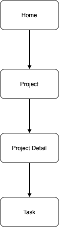
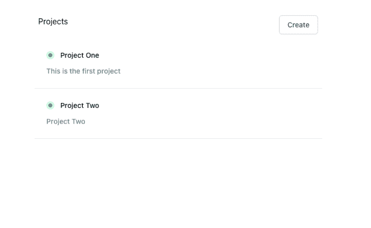
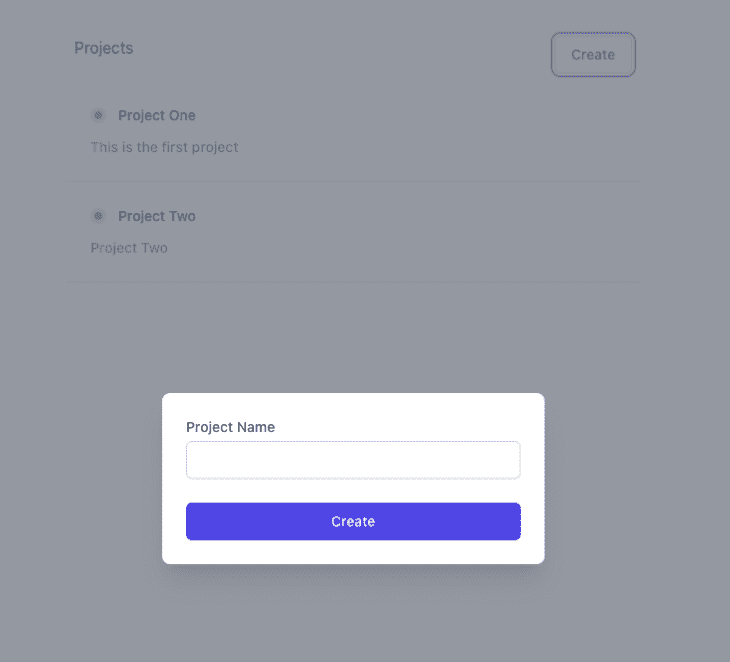
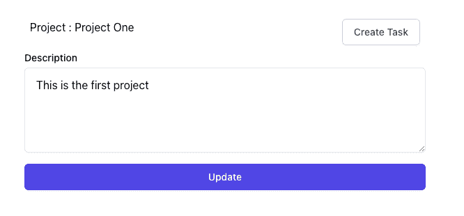
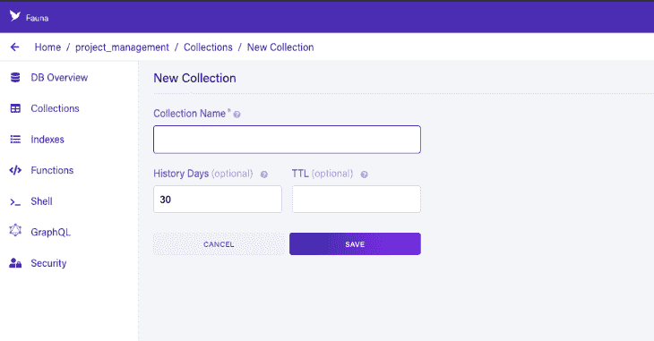
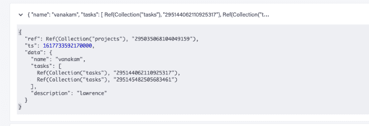
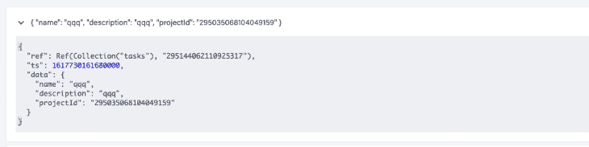

# 火基和动物群:比较前端开发的数据库工具

> 原文：<https://blog.logrocket.com/firebase-and-fauna-comparing-database-tools-for-frontend-devs/>

如今，您不需要知道如何从头开始设置服务器和数据库来构建全栈应用程序。无服务器技术的出现使得扩展应用程序变得更加容易，而无需手动管理基础架构。在现代技术世界中，一切都是 API 驱动的。

有许多工具可以帮助您构建可扩展的应用程序，而没有通常与全栈开发相关的复杂性和运营成本。根据您项目的需求选择最合适的解决方案，可以为您省去很多麻烦和将来的技术债务。

在本指南中，我们将比较 Firebase 和 Fauna，评估每个工具的学习曲线、复杂性、可伸缩性、性能和价格。

## 什么是 Firebase？

[Firebase](https://firebase.google.com/) 是一款后端即服务(BaaS)工具，提供多种服务，包括认证、实时数据库、崩溃、存储和无服务器云功能等等。

## 什么是动物群？

[Fauna](https://fauna.com/) (以前的 FaunaDB)是一个无服务器应用框架，它在传统数据库上提供了一个 GraphQL API 层。此外，它将 DBMS 转换成一个数据 API，提供操作数据库所需的所有功能。

动物群提供:

*   操纵数据的多个模型
*   用于数据访问的多个 API，包括原生 GraphQL
*   强大的数据一致性
*   内置认证

为了演示使用 Firebase 和 Fauna 的优缺点，我们将带您了解如何使用每个数据库构建一个示例应用程序。

下面是我们将构建的内容的快速演示:

 [https://www.youtube.com/embed/jDZkCYx_6XY?version=3&rel=1&showsearch=0&showinfo=1&iv_load_policy=1&fs=1&hl=en-US&autohide=2&wmode=transparent](https://www.youtube.com/embed/jDZkCYx_6XY?version=3&rel=1&showsearch=0&showinfo=1&iv_load_policy=1&fs=1&hl=en-US&autohide=2&wmode=transparent)

视频

## 反应和燃烧

在前端领域，使用 React 和 Firebase 是很常见的，因为它使前端开发人员能够构建全栈应用程序。Firebase 是一个 BaaS 工具，它使 web 和移动开发人员更容易实现常见的功能，如身份验证、文件存储和 [CRUD 数据库操作](https://blog.logrocket.com/crud-react-graphql-examples/)。

要深入了解，包括 Firebase 配置和初始设置，请查看“[react-redux-Firebase](https://blog.logrocket.com/getting-started-react-redux-firebase/)入门”

## 火焰基座组件图

让我们从实体/关系和组件图开始:




首先，在根目录中创建`firebase.js`,并添加以下代码:

```
import firebase from "firebase";
const config = {
  apiKey: "API_KEY",
  authDomain: "AUTH_DOMAIN",
  databaseURL: "DATABASE_URL",
  projectId: "PROJECT_ID",
  storageBucket: "STORAGE_BUCKET",
  messagingSenderId: "MESSAGING_SENDER_ID",
  appId: "APP ID",
};
// Initialize Firebase
firebase.initializeApp(config);
export default firebase;

```

一旦配置了 Firebase，就可以直接在组件中使用它。

## 从 Firebase 读取数据

下一步，我们将从 Firebase 获取所有项目数据:



```
useEffect(() => {
    const fetchData = async () => {
      setLoading(true);
      const db = firebase.firestore();
      const data = await db.collection("projects").get();
      setProjects(data.docs.map((doc) => ({ ...doc.data(), id: doc.id })));
      setLoading(false);
    };
    fetchData();
  }, []);

```

使用以下代码连接到 Firebase:

```
  const db = firebase.firestore();

```

一旦 Firebase 建立了数据库连接，我们就可以使用下面的代码从特定的集合中获取数据:

```
const data = await db.collection("projects").get();

```

## 将数据写入 Firebase

将数据插入 Firebase 就像读取数据一样简单。首先，创建一个项目:



将下面的代码添加到`[onClick](https://blog.logrocket.com/a-guide-to-react-onclick-event-handlers-d411943b14dd/)` [函数](https://blog.logrocket.com/a-guide-to-react-onclick-event-handlers-d411943b14dd/)中:

```
const db = firebase.firestore(); 
db.collection("projects")
      .add({ name })
      .then(async (res) => {
        // component logic comes here //
        setModalState(!modalState);
        toast.success("Project created Successfully");
      })
      .catch((err) => {
        toast.error("Oops!! Something went wrong");
        console.log("err", err);
      });

```

我们可以使用 Firebase 的`add`函数将数据添加到指定的集合中。

## 更新 Firebase 中的数据



要更新 Firebase 中的数据，使用`set`功能:

```
 const db = firebase.firestore();
    db.collection("projects")
      .doc(id)
      .set(
        {
          description: project.description,
        },
        { merge: true }
      )
      .then((res) => {
        toast.success("Project Updated Successfully");
      })
      .catch((err) => {
        toast.error("Oops!! Something went wrong");
        console.log("Error while updating project", err);
      });

```

`merge`选项使我们能够在添加现有数据的同时添加新数据。否则，它将替换数据。

## 火碱酸交易

Firebase 支持事务。您可以批处理设置操作以保持数据一致性。例如，如果您删除一个项目，您还需要删除与之相关的所有任务。因此，您需要将其作为一个事务来执行。

关于事务，有一些重要的事情需要注意:

*   读操作必须在写操作之前
*   如果并发编辑影响事务读取的文档，调用事务的函数(事务函数)可能会运行多次
*   事务函数不应该直接修改应用程序状态
*   当客户端脱机时，事务将会失败

```
var sfDocRef = db.collection("projects").doc();

return db.runTransaction((transaction) => {
    // This code may get re-run multiple times if there are conflicts.
    return transaction.get(sfDocRef).then((sfDoc) => {
        if (!sfDoc.exists) {
            throw "Document does not exist!";
        }

       // delete tasks here 
    });
}).then(() => {
    console.log("Transaction successfully committed!");
}).catch((error) => {
    console.log("Transaction failed: ", error);
});
```

## 动物群设置

在开始为我们的示例应用程序设置动物群之前，我们必须在[仪表板](https://dashboard.fauna.com/)中创建一个帐户、数据库和集合。



现在是时候建立动物群了。我们将如下构建我们的应用程序:

`config`将建立动物群，`api`将包含对`db`的所有查询。创建`db.js`并添加以下内容:

```
import Fauna from "Fauna";
const client = new Fauna.Client({
  secret: process.env.REACT_APP_Fauna_KEY,
});
const q = Fauna.query;
export { client, q };

```

## 创建动物群数据

接下来，我们将为读取、插入和更新操作创建 API。

```
import { client, q } from "../config/db";
const createProject = (name) =>
  client
    .query(
      q.Create(q.Collection("projects"), {
        data: {
          name,
        },
      })
    )
    .then((ret) => ret)
    .catch((err) => console.error(err));
export default createProject;

```

动物群中的每个查询都以`client.query`开头。要将数据插入 DB，使用`q.Create`包装集合和数据:

```
q.Create(<Collection>, {<data>})

```

## 从动物群中读取数据

从动物群中读取数据有两种方法:

*   使用索引获取所有数据
*   直接从集合中获取数据，前提是您有`id`

当您需要获取所有数据而不是特定的数据时，建议使用索引来获取数据。

```
import { client, q } from "../config/db";
const getAllProjects = client
  .query(q.Paginate(q.Match(q.Ref("indexes/all_projects"))))
  .then((response) => {
    console.log("response", response);
    const notesRefs = response.data;

    const getAllProjectsDataQuery = notesRefs.map((ref) => {
      return q.Get(ref);
    });
    // query the refs
    return client.query(getAllProjectsDataQuery).then((data) => data);
  })
  .catch((error) => console.warn("error", error.message));
export default getAllProjects;

```

这里，我们使用集合索引获取所有项目数据。默认情况下，我们可以使用`q.Paginate`对数据进行分页，并获取所有匹配`indexes/all_projects`的数据。

如果我们有`id`，我们可以获取如下数据:

```
client.query(
  q.Get(q.Ref(q.Collection('projects'), <id>))
)
.then((ret) => console.log(ret))

```

## 动物群中的一对多关系

在设计数据库及其模式时，关系是一个至关重要的概念。这里，我们有一个一对多关系的`project`和`task`实体。有两种方法可以为这种关系设计我们的数据库:您可以将任务 ID 作为数组添加到项目集合中，或者将项目 ID 添加到每个任务的数据中。

以下是如何将任务 id 作为数组添加到项目集合中:



下面是如何将项目 ID 添加到每个任务的数据中:



让我们遵循第一种方法，将任务 id 添加到项目集合中:

```
import { client, q } from "../config/db";
const createTask = async (projectId, name, description) => {
  try {
    const taskData = await client.query(
      q.Create(q.Collection("tasks"), {
        data: {
          name,
          description,
          projectId,
        },
      })
    );
    let res = await client.query(
      q.Let(
        {
          projectRef: q.Ref(q.Collection("projects"), projectId),
          projectDoc: q.Get(q.Var("projectRef")),
          array: q.Select(["data", "tasks"], q.Var("projectDoc"), []),
        },
        q.Update(q.Var("projectRef"), {
          data: {
            tasks: q.Append(
              [q.Ref(q.Collection("tasks"), taskData.ref.value.id)],
              q.Var("array")
            ),
          },
        })
      )
    );
    return taskData;
  } catch (err) {
    console.error(err);
  }
};
export default createTask;

```

首先，将数据插入任务集合:

```
const taskData = await client.query(
      q.Create(q.Collection("tasks"), {
        data: {
          name,
          description,
          projectId,
        },
      })
    );

```

接下来，将任务 ID 添加到项目集合中:

```
let res = await client.query(
      q.Let(
        {
          projectRef: q.Ref(q.Collection("projects"), projectId),
          projectDoc: q.Get(q.Var("projectRef")),
          array: q.Select(["data", "tasks"], q.Var("projectDoc"), []),
        },
        q.Update(q.Var("projectRef"), {
          data: {
            tasks: q.Append(
              [q.Ref(q.Collection("tasks"), taskData.ref.value.id)],
              q.Var("array")
            ),
          },
        })
      )
    ); 

```

`[Let](https://docs.fauna.com/fauna/current/api/fql/functions/let?lang=javascript)` [函数](https://docs.fauna.com/fauna/current/api/fql/functions/let?lang=javascript)将一个或多个变量绑定到一个值或表达式中。

## 更新动物群数据

要更新动物群中的数据，请使用以下查询:

```
await client.query(
      q.Update(q.Ref(q.Collection("projects"), projectId), {
        data: { description },
      })
    );

```

我们已经介绍了使用 Firebase 和动物群的 CRUD 应用程序中涉及的所有功能。你可以在 [GitHub](https://github.com/ganeshmani/firebase_vs_fauna) 上找到这个例子的完整源代码。

现在我们已经了解了它们是如何工作的，让我们来比较一下 Firebase 和动物群，并评估一下它们的优缺点。

## 火基地对动物群

在我们开始比较 Firebase 和动物群之前，值得注意的是，这些只是我基于个人偏好、我自己的分析以及我构建如上所述的示例应用程序的经验而提出的看法。其他人可能不同意，欢迎你在评论中表达你的观点。

### 学习曲线

Firebase 很容易学习和适应，因为它的大多数功能都类似于 JavaScript 函数。例如:

*   `get()`从 Firebase 检索数据
*   `set()`将数据插入 Firebase
*   `update()`更新 Firebase 中的数据

另一方面，动物群有一个相当陡峭的学习曲线。您可以使用 GraphQL 或动物群查询语言(FQL)。理解这些概念并了解 FQL 是如何工作的需要一些时间。但是一旦您很好地掌握了它，用更少的时间编写复杂的查询就变得容易了，

### 设置和可扩展性

Firebase 和 Fauna 在客户端的设置简单明了。这两个数据库都是为构建可伸缩的后端解决方案而设计的。在我看来，动物群是构建复杂应用程序的更好选择。我稍后会解释原因。

动物群可以很好地与 GraphQL 配合使用，并且可以与低延迟的全球 cdn 配合使用。与动物群相比，Firebase 速度快，反应灵敏，而且容易建立。

### 复杂的查询和操作

随着应用程序的增长，您可能需要编写一些复杂的查询，例如:

*   获取聚合数据以生成报告
*   支付处理
*   事务性查询
*   聚合

从上面的例子中可以看出，Fauna 可以有效地处理复杂的查询和操作。动物群是一个分布式数据库，可以是关系数据库、文档数据库和图形数据库。

* * *

### 更多来自 LogRocket 的精彩文章:

* * *

动物群的一个主要特性是它处理 ACID 事务的能力，这也是它能够轻松处理复杂查询的原因。

动物群中的函数，比如`Lambda()`、`Let()`和`Select()`，可以让你用更少的代码编写强大的查询。

### 定价

动物群的空闲层包括 100，000 次读取、50，000 次写入和 500，000 次计算操作。对于个体企业来说，每月 23 美元可以支付大部分的运营费用。

Firebase 包括 50，000 次读取、20，000 次写入和 1GB 存储，这涵盖了操作。它基于随增长付费的模式。

### 支持和社区

Firebase 和 Fauna 都有很好的支持和文档。与动物群相比，Firebase 社区是成熟和庞大的，因为 web 和移动开发者都广泛使用它。动物学有特别好的文档，可以帮助你容易地理解基本概念。

## 火基地与动物群:哪个更好？

如果你计划使用较少的复杂查询，并且需要快速构建一个应用程序，Firebase 更适合。因此，当您的应用程序集成水平有限时，这是一个不错的选择。同样，如果你需要在短时间内开发快速原型或小规模应用程序，Firebase 是最好的解决方案，因为它附带电池。

当您的应用程序在处理复杂查询方面需要高度的可伸缩性时，Fauna 是理想的选择。它可以处理一个多模型数据库，通过一个查询就可以得到所有的模型。如果您需要构建一个能够处理关系数据库结构的可伸缩应用程序，那么 Fauna 尤其有用。但是，请注意，Fauna 不提供内部数据库。

## 使用 [LogRocket](https://lp.logrocket.com/blg/signup) 消除传统错误报告的干扰

[](https://lp.logrocket.com/blg/signup)

[LogRocket](https://lp.logrocket.com/blg/signup) 是一个数字体验分析解决方案，它可以保护您免受数百个假阳性错误警报的影响，只针对几个真正重要的项目。LogRocket 会告诉您应用程序中实际影响用户的最具影响力的 bug 和 UX 问题。

然后，使用具有深层技术遥测的会话重放来确切地查看用户看到了什么以及是什么导致了问题，就像你在他们身后看一样。

LogRocket 自动聚合客户端错误、JS 异常、前端性能指标和用户交互。然后 LogRocket 使用机器学习来告诉你哪些问题正在影响大多数用户，并提供你需要修复它的上下文。

关注重要的 bug—[今天就试试 LogRocket】。](https://lp.logrocket.com/blg/signup-issue-free)