# 使用 React 将文件上传到 Firebase v9 中的 Firebase 云存储中

> 原文：<https://blog.logrocket.com/firebase-cloud-storage-firebase-v9-react/>

Firebase 是一个由 Google 创建的移动和 web 应用程序[开发平台，提供您可以依赖的产品和解决方案来满足您的应用程序开发需求，包括云 Firestore、云功能、身份验证、托管、实时数据库、云存储等等。](https://firebase.google.com/)

云存储服务旨在让开发人员轻松存储和提供用户生成的内容，如照片和视频，这些内容存储在谷歌云存储桶中。此外，Firebase 云存储[与 Firebase 认证](https://blog.logrocket.com/implementing-firebase-authentication-in-a-flutter-app/)等其他 Firebase 服务集成，以便用户可以组织上传的文件，并在需要时应用访问控制。

在本文中，我们将学习如何将文件上传到 Firebase 云存储，并使用 Firebase v9.x(撰写本文时的最新版本)访问上传文件的 URL。要阅读本文，您需要:

*   已安装 npm 和 Node.js
*   React 和 React 钩子的知识
*   访问 Firebase 控制台的 Google 帐户

我们开始吧！

## 目录

## 在 Firebase 上创建一个项目

到 https://console.firebase.google.com/的[去消防基地控制台。你会看到主页:](https://console.firebase.google.com/)

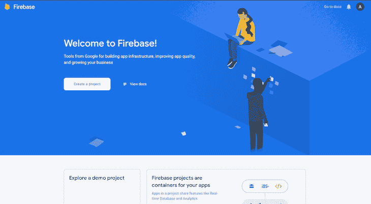

点击**创建项目**按钮。键入项目的名称。我给我的取名`React-Firebase-storage`。接受 Firebase 条款并点击**继续**:

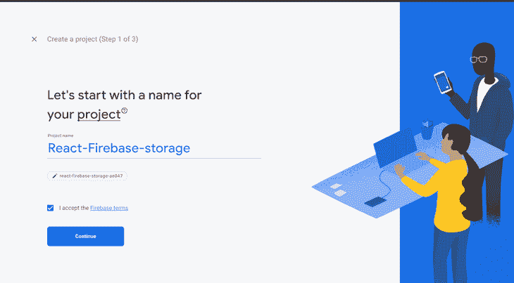

如果你想在你的项目中使用谷歌分析，那么让**启用谷歌分析**开关打开。我在这个演示中不需要它，所以我要关闭它。点击**创建项目**，等待项目被创建:

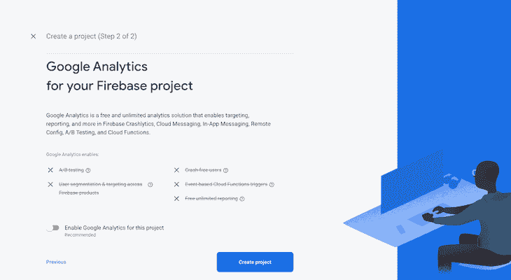

点击**继续**继续到控制台:

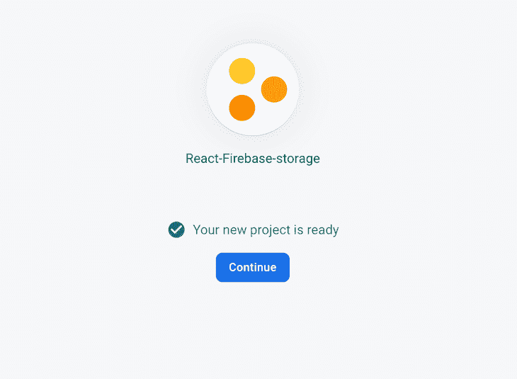

在下一个界面中，我们将选择要用来构建我们刚刚创建的应用程序的平台。在这种情况下，它将位于 web 上，因此我们选择 **web** :

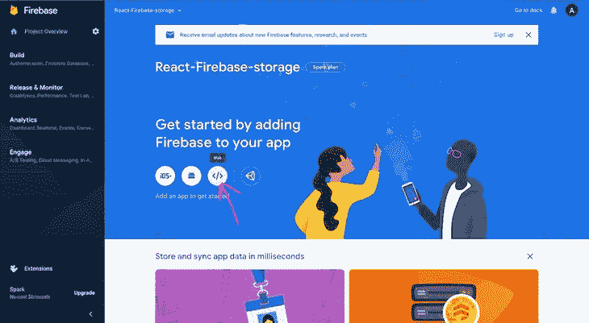

接下来，我们输入一个名称来注册应用程序。由于我不打算在 Firebase 上托管应用程序，我将跳过这一步，点击**注册应用程序**:

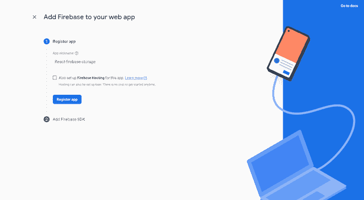

接下来，我们将初始化一个新的 React 应用程序，并使用提供的凭据将 Firebase 添加到项目中:

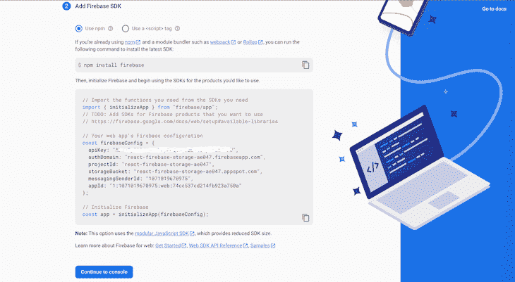

## 创建新的 React 应用程序

使用下面的命令创建一个新的 React 应用程序:

```
npx create-react-app app-name

```

接下来，安装 Firebase，如下所示:

```
npm install firebase

```

在`src`文件夹中创建一个名为`firebase.js`的新文件。复制我们创建 Firebase 项目时的配置代码，并将其粘贴到`firebase.js`文件中。

使用包含凭证的 config 对象初始化 Firebase 应用程序，并将其导出。您还将导出对存储服务的引用，该服务用于在您的存储中创建引用:

```
// Import the functions you need from the SDKs you need
import { initializeApp } from "firebase/app";
import { getStorage } from "firebase/storage";
// TODO: Add SDKs for Firebase products that you want to use
// https://firebase.google.com/docs/web/setup#available-libraries
// Your web app's Firebase configuration
const firebaseConfig = {
    apiKey: "************************************",
    authDomain: "react-firebase-storage-ae047.firebaseapp.com",
    projectId: "react-firebase-storage-ae047",
    storageBucket: "react-firebase-storage-ae047.appspot.com",
    messagingSenderId: "1071019670975",
    appId: "1:1071019670975:web:74cc537cd214fb923a750a"
};
// Initialize Firebase
export const app = initializeApp(firebaseConfig);
export const storage = getStorage(app);

```

在`App.js`中，让我们创建一个上传文件的表单和一个提交按钮:

```
import './App.css';
function App() {
  return (
    <div className="App">
      <form className='form'>
        <input type='file' />
        <button type='submit'>Upload</button>
      </form>
    </div>
  );
}
export default App;

```

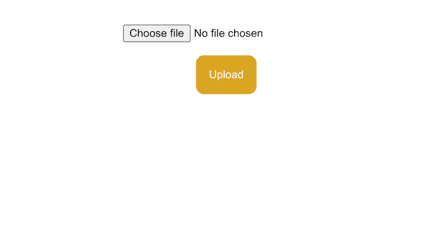

## 创建一个云存储桶

要在您的应用程序中使用任何 Firebase 服务，您必须在 Firebase 控制台中为该特定项目设置它们。所以 Firebase 知道这个 app 在用所说的产品。

在 Firebase 控制台中复制配置代码后，点击**转到控制台**。我们将看到一个界面，列出我们可以使用的所有产品。在左侧菜单栏中，点击**存储**:

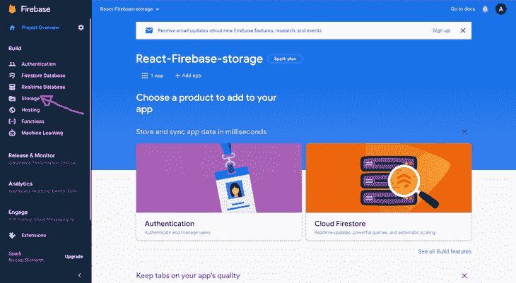

点击**开始**:

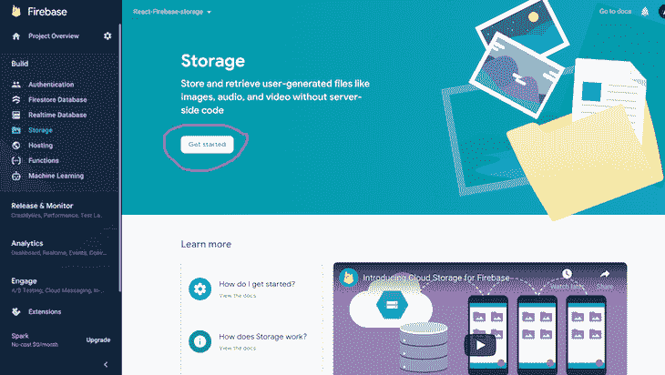

出于演示的目的，我们将选择**测试模式**。但是对于生产应用程序，您应该选择**生产模式**来限制谁可以读写存储。点击**下一个**:

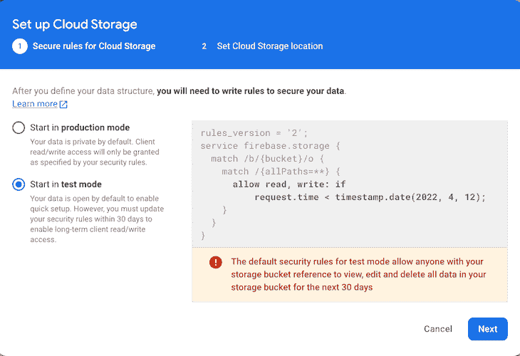

选择**云存储位置**，点击**完成**:

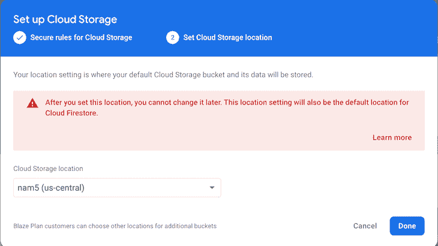

现在，我们可以以编程方式将文件上传到云存储桶，并读取这些文件:

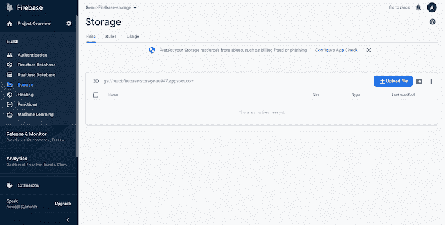

## 以编程方式上传和读取文件

这样，我们就为编写上传文件的代码做好了一切准备。在`App.js`中，我们将从导入从 Firebase 配置文件中导出的存储开始，我们将从`firebase/storage`中使用的方法，以及 React `useState`钩子:

```
import { useState } from "react";
import { storage } from './firebase';
import { ref, getDownloadURL, uploadBytesResumable } from "firebase/storage";

```

让我们编写一个当用户点击**提交**按钮时运行的函数:

```
const [imgUrl, setImgUrl] = useState(null);
const [progresspercent, setProgresspercent] = useState(0);

const handleSubmit = (e) => {
    e.preventDefault()
    const file = e.target[0]?.files[0]

    if (!file) return;

    const storageRef = ref(storage, `files/${file.name}`);
    const uploadTask = uploadBytesResumable(storageRef, file);

    uploadTask.on("state_changed",
      (snapshot) => {
        const progress =
          Math.round((snapshot.bytesTransferred / snapshot.totalBytes) * 100);
        setProgresspercent(progress);
      },
      (error) => {
        alert(error);
      },
      () => {
        getDownloadURL(uploadTask.snapshot.ref).then((downloadURL) => {
          setImgUrl(downloadURL)
        });
      }
    );
  }

```

让我们来分解一下`handleSubmit`函数中发生了什么。在我们读取上传的文件和图片上传的进度值之后，我们初始化了图片 URL 的两个状态。

`const file = e.target[0]?.files[0]`创建一个变量并将提供的文件保存到该变量中。

接下来，我们通过调用已经在配置文件中创建的存储服务实例上的`ref()`,创建了对我们想要操作的文件的引用。作为第二个参数，我们传入了一个我们希望 ref 指向的路径，这是可选的。

一旦创建了引用，我们就可以通过调用`uploadBytesResumable()`来上传文件。它接受我们之前创建的引用，然后将文件上传到云存储。注意`uploadBytes()`做的完全一样，所以两者都可以用。

然而，使用`uploadBytesResumable()`，上传可以暂停和恢复，并且它公开进度更新。我们在这里使用它是因为我们想显示上传的进度。如果您不想要那个功能，请随意使用`uploadBytes()`。

接下来，我们对调用`uploadBytesResumable()`返回的承诺调用`on()`方法，以监听状态变化、错误和成功上传。这三个回调函数在文件上传的不同阶段运行。第一个在上传期间运行，以观察状态变化事件，如进度、暂停和恢复，而下一个在上传不成功时触发。最后，当上传成功完成时，运行最后一个。

上传成功后，我们调用`getDownloadURL()`来获取文件的下载 URL，并显示在应用程序上。然后，我们用下载的新图像 URL 更新状态。

显示图像和进度条的完整代码如下所示:

```
import './App.css';
import { useState } from "react";
import { storage } from './firebase';
import { ref, getDownloadURL, uploadBytesResumable } from "firebase/storage";

function App() {
  const [imgUrl, setImgUrl] = useState(null);
  const [progresspercent, setProgresspercent] = useState(0);

  const handleSubmit = (e) => {
    e.preventDefault()
    const file = e.target[0]?.files[0]
    if (!file) return;
    const storageRef = ref(storage, `files/${file.name}`);
    const uploadTask = uploadBytesResumable(storageRef, file);

    uploadTask.on("state_changed",
      (snapshot) => {
        const progress =
          Math.round((snapshot.bytesTransferred / snapshot.totalBytes) * 100);
        setProgresspercent(progress);
      },
      (error) => {
        alert(error);
      },
      () => {
        getDownloadURL(uploadTask.snapshot.ref).then((downloadURL) => {
          setImgUrl(downloadURL)
        });
      }
    );
  }

  return (
    <div className="App">
      <form onSubmit={handleSubmit} className='form'>
        <input type='file' />
        <button type='submit'>Upload</button>
      </form>
      {
        !imgUrl &&
        <div className='outerbar'>
          <div className='innerbar' style={{ width: `${progresspercent}%` }}>{progresspercent}%</div>
        </div>
      }
      {
        imgUrl &&
        
      }
    </div>
  );
}
export default App;

```

## 结论

Firebase 云存储非常容易用于存储不同的媒体类型。此外，它会自动扩展，因此当您的数据变得太大时，您不必担心转移到另一个提供商。

感谢阅读。我希望这篇教程对你有所帮助。欢迎在下面的评论中提问。编码快乐！

## 使用 [LogRocket](https://lp.logrocket.com/blg/signup) 消除传统错误报告的干扰

[](https://lp.logrocket.com/blg/signup)

[LogRocket](https://lp.logrocket.com/blg/signup) 是一个数字体验分析解决方案，它可以保护您免受数百个假阳性错误警报的影响，只针对几个真正重要的项目。LogRocket 会告诉您应用程序中实际影响用户的最具影响力的 bug 和 UX 问题。

然后，使用具有深层技术遥测的会话重放来确切地查看用户看到了什么以及是什么导致了问题，就像你在他们身后看一样。

LogRocket 自动聚合客户端错误、JS 异常、前端性能指标和用户交互。然后 LogRocket 使用机器学习来告诉你哪些问题正在影响大多数用户，并提供你需要修复它的上下文。

关注重要的 bug—[今天就试试 LogRocket】。](https://lp.logrocket.com/blg/signup-issue-free)