# Firebase vs. Netlify:哪个适合你？

> 原文：<https://blog.logrocket.com/firebase-vs-netlify-which-one-is-right-for-you/>

企业每天都在越来越多地采用云托管服务。尤其是因为它们提供了具有更好可靠性的经济高效的解决方案。Firebase 和 [Netlify](https://www.netlify.com/) 是这类工具中最简单和最强大的两个。

它们都包含了一些特性，可以帮助我们轻松地部署应用程序。因此，在本指南中，我们将了解它们的用例、优缺点，以及何时应该选择其中一个。我们还将在 Firebase 和 Netlify 上设置和部署一个项目。它将帮助我们理解如何使用每项服务的技术细节。

## 重火力点

Firebase 提供了强大的后端即服务(BaaS)。它帮助我们快速开发功能丰富的应用程序。它得到了科技巨头谷歌的支持，所以你可以放心地依赖他们的基础设施。

### 特征

*   实时数据库
*   数据同步
*   机器学习工具
*   一键式谷歌分析集成
*   多种身份验证方法(例如，电子邮件/密码、社交媒体应用程序、电话、匿名等。)

### 赞成的意见

*   Firebase 包含了快速应用程序开发的所有功能。非常适合创建[最小可行产品(MVP)](https://blog.logrocket.com/product-management/what-is-minimum-viable-product-mvp-how-to-define/)
*   执行 A/B 测试的能力
*   轻松添加应用内和云消息
*   使用人工智能来预测用户行为
*   无需编写任何重要代码即可处理文件上传和检索
*   推出了比实时数据库更快的云商店
*   借助谷歌云平台轻松扩展任何应用

### 骗局

*   在扩展应用程序、处理数据库迁移和缓存管理方面，学习曲线非常陡峭

## Netlify

由于 JamStack 在开发者社区的巨大成功，Netlify 变得流行起来。它主要用于托管静态网站，这些网站是使用静态网站生成器(如 Hugo、Jekyll 等)生成的。

### 特征

*   静态网站托管
*   持续集成和持续部署
*   与源代码控制系统集成
*   动态优化图像、视频和文档
*   使用拖放功能进行部署
*   对用户身份验证的内置支持
*   使用分割测试来测试新功能或不同的设计
*   使用插件自定义构建工作流
*   在 Netlify 仪表板中收集表单提交

## 使用 Firebase 创建待办事项列表网站

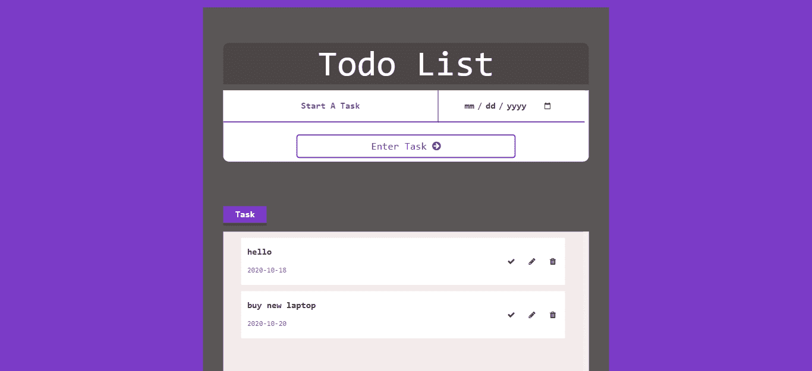

## 建立一个 Firebase 项目

首先，登录你的 Gmail 账户，然后进入 [Firebase 控制台](https://console.firebase.google.com/)。

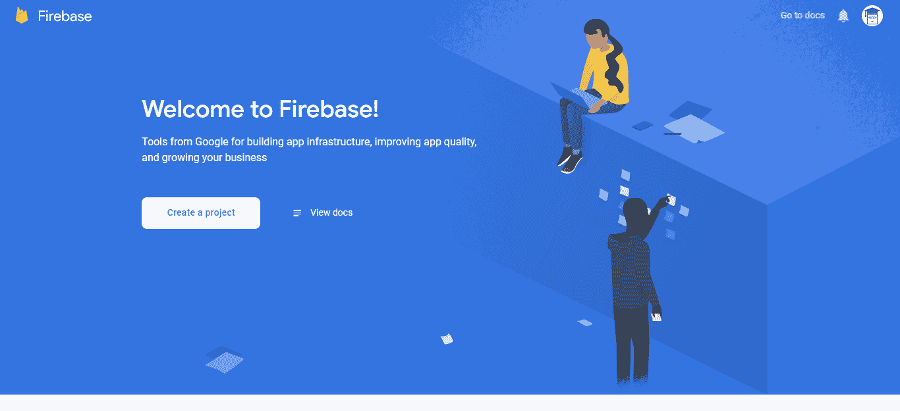

单击“创建项目”按钮继续。

您将被要求输入项目名称。键入您喜欢的任何内容，但是为了本教程，我将进入“待办事项列表”。

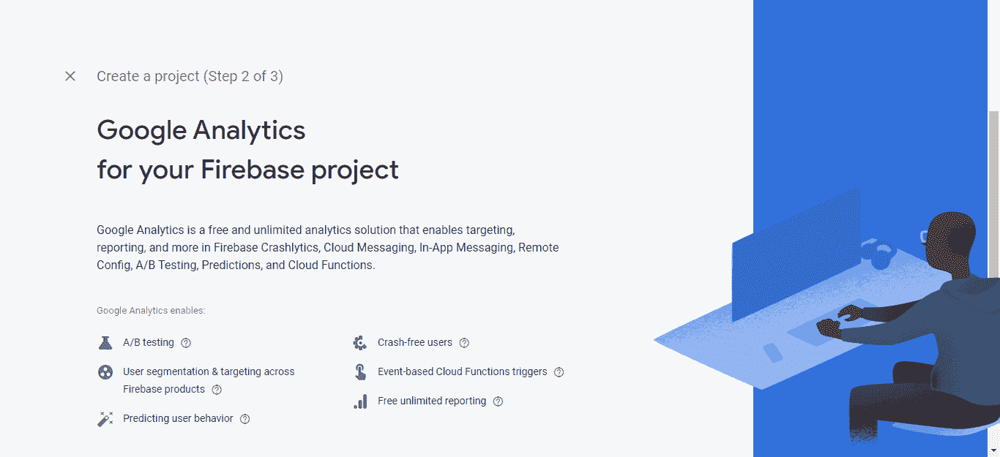

Firebase 可以很容易地与谷歌分析集成。在生产环境中，建议启用它。但是，现在，我们真的不需要它。所以，简单地关闭它，就像下面截图中提到的那样。

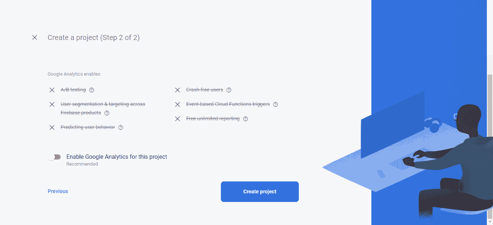

现在，只需按“创建项目”按钮，让 Firebase 为您建立一个全新的项目。

单击“继续”查看项目概述。

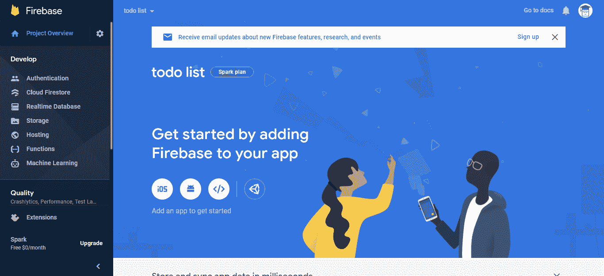

我们将创建一个网站，所以点击代码图标。

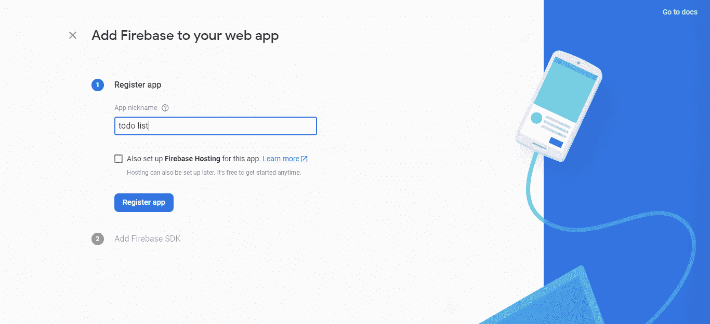

在这里，你需要注册一个 app。为此，请输入用户友好的名称，然后按“注册应用程序”。

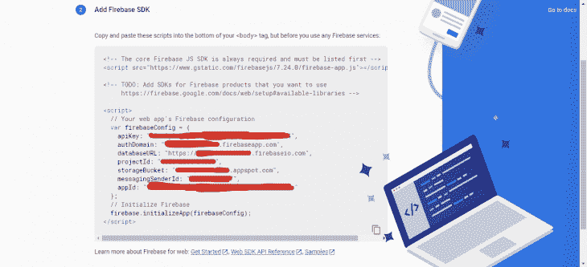

现在您将看到由 Firebase 自动生成的代码片段。把它复制到你的计算机上，因为我们以后会需要它。我隐藏了每个应用程序都有的一些敏感细节。

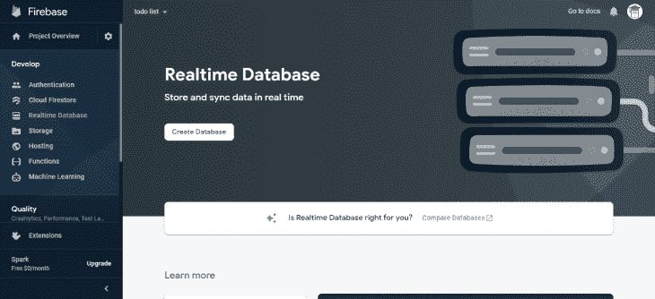

一旦你注册了一个应用程序，从左侧菜单打开“实时数据库”页面，点击“创建数据库”按钮。

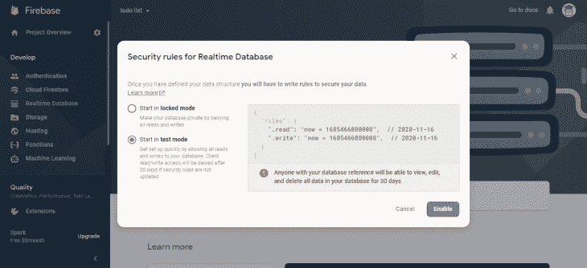

将打开一个弹出窗口，只需选择“在测试模式下启动”并按“启用”。

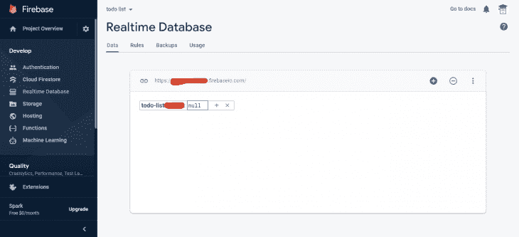

此时，我们可以使用源代码轻松访问这个 NoSQL 数据库。因此，让我们继续为我们的“待办事项”应用程序编写源代码。

你可以在这里找到代码[。](https://codesandbox.io/s/peaceful-cookies-8lwk1?file=/style.css)

### 运行项目

只需在任何网络浏览器中打开 index.html 文件。您现在可以尝试添加/删除待办事项列表项目。

## 在 Netlify 上部署静态网站

### 写代码

在本节中，我们将创建一个简单的 HTML 登录页面，然后将其部署在 Netlify 上。我们将使用 Bootstrap、jQuery、font awesome 和 Google 字体来改进 UI 和 UX。

你可以在这里找到代码[。](https://codesandbox.io/s/firebase-todo-forked-76qxd?file=/assets/js/script.js)

### 在网络上上传项目

至此，我们的静态 web 页面的源代码已经准备好部署了。只需在 [Netlify](https://www.netlify.com/) 上创建一个帐户，并验证您的电子邮件地址即可继续。之后，您将进入仪表板，在那里您可以上传项目。

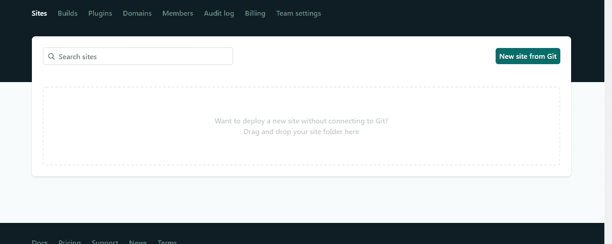

有趣的是，Nelify 通过添加拖放功能使这个过程变得更加简单。你只需要拖动项目的根文件夹，并把它放在提到的部分。它将自动开始上传/构建过程，然后最终你的网站将在没有时间活。

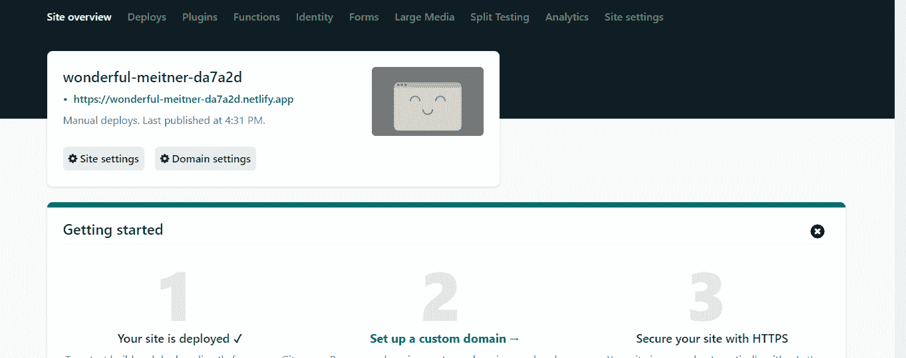

默认情况下，Netlify 会自动为您分配一个子域。

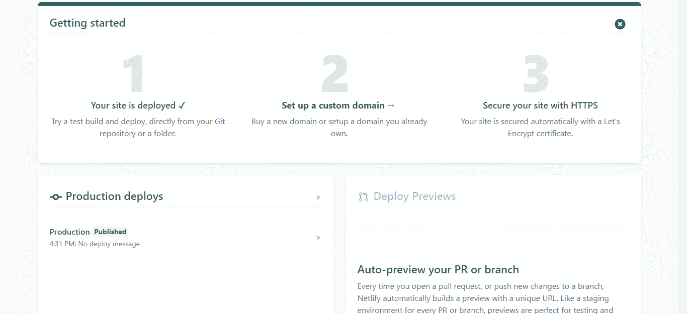

正如您在“生产部署”部分看到的，我们的网站已经成功发布，可以在线查看。

### 运行项目

只需打开我们刚刚保存的子域。在本教程中，我用自己的名字来设置子域。所以，我们可以访问这个 [URL](https://kasra.netlify.app/) 。

## Firebase 比 Netlify 好吗？

如果你想创建一个动态网站或应用程序，建议使用 Firebase。然而，Netlify 更适合托管静态网站。很多创业公司使用 Firebase 进行快速应用开发。这有助于他们快速测试他们的想法，而不用从头开始写所有的东西。类似地，Netlify 是一个新的热门服务，它提供了一个无缝的构建工作流。我们可以很容易地将它与 GitHub 这样的源代码控制系统连接起来，通过每次提交来自动化静态网站的部署。

## 净值定价

Netlify 根据企业规模有单独的[包](https://www.netlify.com/pricing/)。例如，它提供这些包。

*   前菜
*   专业人员
    *   价格:每个成员每月 19 美元
*   商业
    *   价格:每个成员每月 99 美元
*   企业
    *   价格:一般起价 3000 美元/月。但是，你需要[联系](https://www.netlify.com/enterprise/contact/)他们，根据你的网络应用定制计划

入门包对每个人都是完全免费的。它最适合个人/开源项目。它的一些主要功能包括:

*   与 GitHub 连接以自动化构建过程
*   轻松更改版本

专业包是专为小型企业网站或博客。它可以稍微提高性能，并处理比入门包多一点的流量。如果需要，您可以选择此软件包:

*   登录/注册功能
*   通知支持

同样的，商业和企业计划也推荐给成熟的网站。它们提供了更多的功能和控制。例如，您可以使用 SAML 轻松添加单点登录功能，添加基于角色的访问控制(RBAC)，甚至使用自托管的 Git 存储库。

## Firebase 定价

另一方面，与 Netlify 相比，Firebase 的定价模式非常简单。它只提供了两种方案。

*   星火计划
*   火焰计划
    *   价格:只为你使用的东西付费

像往常一样，Spark 计划是为了帮助你免费试用 Firebase 的特性。它帮助您熟悉这个后端即服务(BaaS)平台。稍后，您可以升级到 Blaze Plan 以访问高级功能。

## 比较

基于上面的学习，让我们比较 Firebase 和 Nelify，以确定哪一个更适合您的特定需求。

将 Firebase 用于:

*   动态网站—例如，当您需要访问数据库中的数据来生成网页时。它可以是登录/注册系统、问答论坛、社交媒体应用程序、游戏等。
*   Android/iOS 应用程序开发
*   处理人工智能和机器学习算法

将 Netlify 用于:

*   静态网站或博客。它们可以使用 Hugo、Jekyll、Gatsby 等工具生成。
*   高性能。这是因为在静态网站中，不需要在运行时生成任何东西，我们只需要显示它们
*   轻松部署或扩展静态网站。传统上，管理大型静态网站是非常困难的。但是，Netlify 使整个过程变得简单易行
*   版本控制(升级/降级到特定版本)。在这里，您可以连接类似 GitHub、GitLab、Bitbucket 等服务。

这就是现在，我希望你现在熟悉 Firebase 和 Netlify。如果你一直跟随我直到最后，那么你可能知道什么时候使用它们，以及如何用这些服务建立一个网站。现在，轮到您尝试这两个平台并探索它们丰富的特性了。

## 使用 [LogRocket](https://lp.logrocket.com/blg/signup) 消除传统错误报告的干扰

[LogRocket](https://lp.logrocket.com/blg/signup) 是一个数字体验分析解决方案，它可以保护您免受数百个假阳性错误警报的影响，只针对几个真正重要的项目。LogRocket 会告诉您应用程序中实际影响用户的最具影响力的 bug 和 UX 问题。

然后，使用具有深层技术遥测的会话重放来确切地查看用户看到了什么以及是什么导致了问题，就像你在他们身后看一样。

LogRocket 自动聚合客户端错误、JS 异常、前端性能指标和用户交互。然后 LogRocket 使用机器学习来告诉你哪些问题正在影响大多数用户，并提供你需要修复它的上下文。

关注重要的 bug—[今天就试试 LogRocket】。](https://lp.logrocket.com/blg/signup-issue-free)