# Firebase vs. Supabase:为你的项目选择正确的工具

> 原文：<https://blog.logrocket.com/firebase-vs-supabase-choosing-right-tool-project/>

***编者按:*** *本帖于 2022 年 9 月 13 日更新，内容包括 Firebase 和 Supabase 中的安装、可伸缩性和安全性、认证等信息，以及其他常规内容更新。*

后端即服务(BaaS)是一种服务模型，在这种模型中，开发人员将 web 或移动开发的所有幕后工作外包出去。这使得他们可以专注于在即插即用的基础上编写和维护前端，并避免编写服务器端代码的压力。

BaaS 平台为服务器端活动提供软件，如身份验证、数据库管理、实时更新、存储、托管和推送通知(针对移动应用程序)。在过去的十年里，我们已经看到了提供这些服务的公司的崛起，包括 [Firebase](https://firebase.google.com/) 、 [Supabase](http://supabase.io) 、 [Parse](https://parseplatform.org/) 、 [Back4app](https://www.back4app.com/) 和 [AWS Amplify](https://aws.amazon.com/amplify/) 等等。

尽管这些后端服务本质上提供相同的解决方案，但它们使用不同的后端技术。对于许多开发人员来说，这是为给定项目选择最佳服务时的一个决定性因素。

例如，Back4App 提供了现成的 REST 和 GraphQL APIs，而 Firebase 使用 NoSQL 语法，不提供现成的 GraphQL。

在本教程中，我们将重点关注 Firebase 和开源替代方案 Supabase。我们将从单独探索每个平台开始，然后我们将比较 Firebase 和 Supabase，并提供一些关于如何为您的项目选择最佳工具的提示。

我们将详细介绍以下内容:

## 什么是 Firebase？

Firebase 最初由詹姆斯·坦普林和安德鲁·李于 2011 年创立。谷歌在 2014 年收购了该平台，现在它是该公司应用开发的旗舰产品。

Firebase 的第一个产品是 Firebase Realtime Database，这是一个 API，可以在 iOS、Android 和 web 之间同步应用程序数据，同时将其存储在 Firebase 的云上。Firebase 已经发展成为一种成熟的 BaaS 服务，其产品适用于开发和后期开发阶段。

Firebase 分三个阶段提供产品:

1.  建设
2.  发布和监控
3.  从事


每个阶段代表不同的发展阶段。Firebase 为每个阶段都创建了特定的产品。

### Firebase 的构建阶段

构建阶段包括为主动开发提供后端基础设施的产品。这些包括构建应用程序时使用的核心服务，如身份验证、存储、实时数据库、Firestore、托管、云功能、云消息、远程配置和 Firebase ML。

让我们更详细地探讨这些功能:

*   身份验证:Firebase 提供了一个身份验证服务，允许用户在您的应用程序上注册和创建帐户，包括第三方登录服务
*   存储:firebase 作为 Firebase 平台的一部分，为用户生成的媒体(图像、视频、音频等)提供存储。)
*   托管:Firebase 允许托管，使得在同一个云服务中构建和托管您的应用程序成为可能
*   云功能:云功能使你可以直接在 Google Cloud 上运行你的服务器端代码，所有这些都在一个可控的安全环境中进行
*   Firestore: Firestore 是一个 NoSQL 数据库，允许你以你喜欢的方式构建数据库，并以闪电般的速度进行查询
*   云消息传递:这使您能够在即插即用的基础上轻松地向用户发送推送通知
*   远程配置:您可以使用特性标志来决定打开或关闭哪些特性，并最终决定哪些特性可以投入生产
*   实时数据库:这也是一个 NoSQL 数据库，使您能够实时同步数据，并在您的项目中进行无缝更改
*   Firebase ML:您可以使用机器学习 API 来帮助您训练和部署您的定制模型

### Firebase 的发布和监控阶段

发布和监控类别中的 Firebase 工具用于在开发和发布应用程序后对其进行监控。这些工具包括以下内容:

*   Firebase Crashlytics:这可以监控崩溃，实时报告它们，并提供帮助您查明原因和解决问题的洞察力
*   Google Analytics:这个工具提供详细的分析，使得研究用户行为并采取行动变得容易
*   Firebase 性能监控:这些数据帮助您从用户的角度理解性能问题，包括网络行为和延迟
*   远程配置:你可以随时定制和修改你的应用程序。该功能最常用于移动应用程序
*   测试实验室:该功能使您能够在真实和虚拟设备上创建模拟，以在发布之前测试您的应用程序
*   应用程序分发:您可以轻松地将您的应用程序的独家版本分发给受信任的测试人员

### 火力基地交战阶段

该类别的产品主要用于移动应用程序。他们帮助你吸引用户，优化用户体验，让用户满意。

在付费计划中，Firebase 提供了很酷的扩展来帮助您构建应用程序、添加功能和更快地部署。这里列举的太多了，但是最重要的特性包括以下几个。

*   Resize images:这个扩展允许你设置一个指定的大小，用来调整上传到 Firebase 存储器的图像的大小。它将原始图像和调整大小后的图像存储在同一个存储桶中
*   将收藏导出到 BigQuery:您可以将指定的 Firestore 收藏导出到存储在 [BigQuery](https://cloud.google.com/bigquery) 中，这是一个云仓库，允许您非常快速地查询您的数据库。导出过程是增量的，所以 Firestore 和 BigQuery 总是同步的
*   触发电子邮件:您可以根据写入指定 Firestore 集合的文档内容触发电子邮件发送到给定邮件
*   翻译文本:您可以将 Firestore 中的字符串翻译成多种语言，因为字符串的源语言是通过云翻译 API 自动检测的
*   删除用户数据:一旦用户从认证用户中删除，这个扩展会自动删除用户数据。您可以配置此扩展以从以下任何或所有项目中删除用户数据:云 Firestore、实时数据库或云存储。触发扩展以删除数据是用户 UUID 的关键，它对于每个经过身份验证的用户都是唯一的

## 安装 Firebase

要开始使用 Firebase，我们必须创建一个 Firebase 帐户并启动一个新项目:


一旦我们创建了项目，我们现在就可以在我们的应用程序中使用可用的 Firebase 特性。

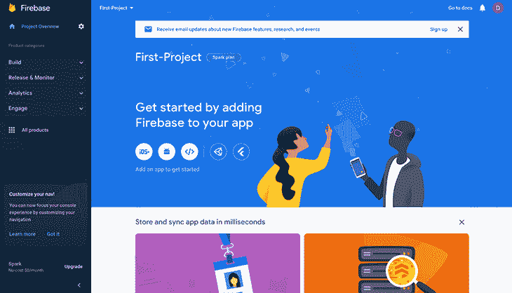

接下来，我们可以继续为网络注册应用程序。要做到这一点，点击网络图标，将 Firebase 添加到应用程序中。

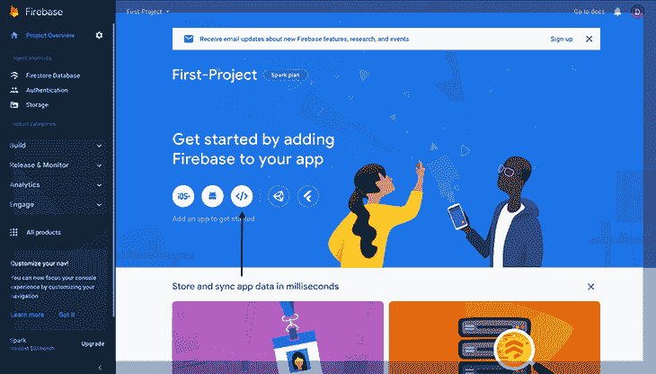

一旦我们添加了应用程序的名称，它将向我们展示如何在我们的客户端安装 Firebase SDK。此外，我们现在可以访问该应用程序的唯一凭据。


然后，我们可以继续为此应用程序设置我们的功能。大多数应用中需要的主要功能包括:

1.  证明
2.  Firestore
3.  储存；储备

## 使用 Firebase 进行身份验证

如前所述，Firebase 提供了一个 auth 服务，让我们可以直接通过 Firebase 管理用户的身份验证数据。它们还提供了不同的登录方法，我们可以使用这些方法来验证用户的身份。

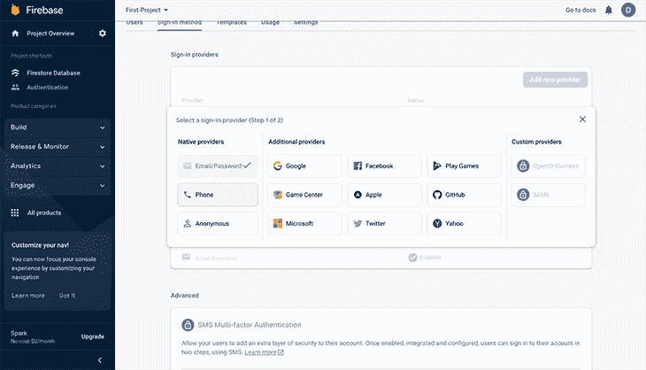

这些方法包括传统媒介，如电子邮件/密码、电话号码/短信，甚至是客人的匿名方法。此外，Firebase 允许我们使用第三方提供商如 Google、Twitter、Github 等来验证我们的用户。

## 火基风暴

Firebase Firestore 是一个 NoSQL 数据库，由 Firebase 作为其产品的一部分提供。一个好处是它允许您从客户端 SDK 直接在数据库上执行 CRUD 操作。

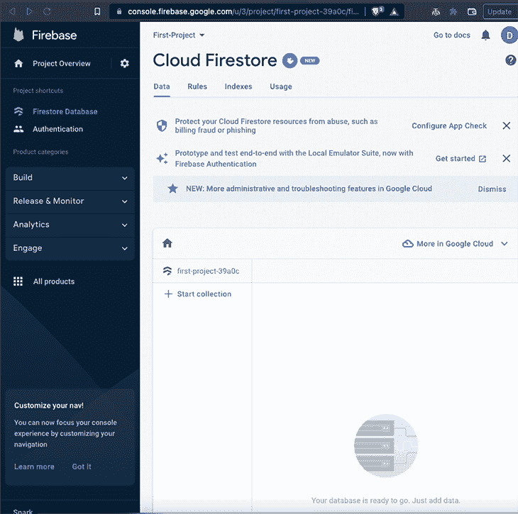

## 燃料库储存

Firebase 还提供了云存储功能，允许我们存储媒体文件。一个简单的用例是将图像上传到云中并立即获得图像的 URL。


构建应用程序时的一个常见场景是，我们需要上传一张图片并将其附加到相关数据中。我们可以继续上传图像，获取图像 URL，并将其作为文本保存在 Firestore 数据库的文档中。

## 使用 Firebase Web SDK

一旦所有这些都在我们的 Firebase 仪表板上设置好了，我们就需要将它们直接集成到我们的前端。我们首先将 Firebase SDK 安装到我们的项目中。我们可以使用之前获得的凭证来完成这项工作。

我们进入我们的应用程序，安装来自 npm 的 firebase 包。

```
npm install firebase

```

接下来，我们导入`firebase`并初始化我们的 firebase 配置代码。

```
import { initializeApp } from 'firebase/app'
import { getAuth } from 'firebase/auth'

const firebaseConfig = {
    apiKey: "API-KEY",
    authDomain: "AUTH-DOMAIN",
    databaseURL: "DATABASE-URL",
    projectId: "PROJECT-ID",
    storageBucket: "STORAGE-BUCKET",
    messagingSenderId: "MESSAGING-SENDER-ID",
    appId: "APP-ID"
  };

  // Initialize Firebase
initializeApp(firebaseConfig);

```

在将 Firebase 初始化到我们的客户端之后，让我们看看如何使用它来添加身份验证。在同一个文件中，我们将安装来自`firebase/auth`的`getAuth`,并初始化它。

```
import firebase from "firebase/app";
import { getAuth } from 'firebase/auth'

const firebaseConfig = {
    apiKey: "API-KEY",
    authDomain: "AUTH-DOMAIN",
    databaseURL: "DATABASE-URL",
    projectId: "PROJECT-ID",
    storageBucket: "STORAGE-BUCKET",
    messagingSenderId: "MESSAGING-SENDER-ID",
    appId: "APP-ID"
  };
// Initialize Firebase
 initializeApp(firebaseConfig)

// Initialize Firebase auth
const auth = getAuth()

```

我们可以使用新用户的电子邮件和密码在应用程序上注册新用户。我们必须将用户的`email`和`password`作为参数传递给`auth.createUserWithEmailAndPassword()`方法。

```
auth.createUserWithEmailAndPassword(auth, email, password)
  .then((res) => {
    let user = res.user;
  })
  .catch((error) => {
    console.log(error.code);
    console.log(error.message);
  });

```

现在让我们使用 Firestore 向我们的数据库添加数据。我们将创建一个名为`names`的数据库集合，并添加用户名。

```
import { initializeApp } from "firebase/app";
import { getFirestore } from "firebase/firestore";
import { doc, setDoc } from "firebase/firestore"; 

// Config and initialize Firebase as shown above

const firebaseConfig = {
    // ...
};

// Initialize Firebase
const app = initializeApp(firebaseConfig);

const db = getFirestore(app);

async function addDocs () {
  try {
    const addedDocs = await setDoc(doc(db, "names", "Doe"), {
    fullName: "John Doe",
    city: "London",
    country: "UK"
    });
    console.log("Document's ID: ", addedDocs.id);
  } catch (error) {
    console.error("Error adding document to DB: ", error);
  }
} 

```

最后，为了存储媒体文件，我们可以获取元数据并将其存储在云存储中。

```
import { initializeApp } from "firebase/app";
import { getStorage, ref, uploadBytes } } from "firebase/storage";

// Initialize Firebase 
const firebaseConfig = {
  // ...
};

// Initialize Firebase
const app = initializeApp(firebaseConfig);

// Initialize cloud storage and get a reference to the service
const storage = getStorage(app);
const storageRef = ref(storage, 'images/logo.png');
const metadataFile = {
  contentType: 'image/png',
};

const uploadImage = uploadBytes(storageRef, file, metadataFile);

```

## 什么是 Supabase？

Supabase 称自己是 Firebase 的开源替代品。它旨在帮助开发人员在几分钟内加速他们的后端。Supabase 的口号是“在一个周末内建造，规模扩大到数百万。”

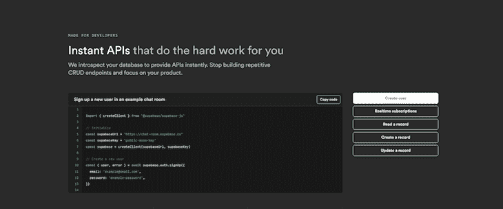

在撰写本文时，可用的 Supabase 产品包括 Postgres 数据库和认证服务、存储和 Edge 功能(后端逻辑的无服务器功能)。Supabase 及其所有工具主要是开源的。

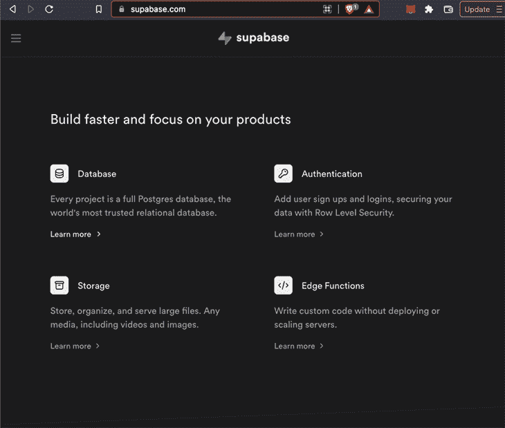

[Postgres 数据库自带数据库相关工具](https://blog.logrocket.com/getting-started-with-postgres-in-your-react-app/)，包括实时监听数据库变化和管理这些变化的界面。另外，Supabase 提供了即时 API 和语法，有点类似于 Firebase。[这有助于我们以简单明了的方式处理 CRUD 操作](https://blog.logrocket.com/building-the-simplest-crud-out-there-with-entity-management/)，这样我们就可以专注于构建而不是重写重复的 CRUD 代码。

Postgres 数据库是表格形式的，允许我们像在任何电子表格上一样存储结构化和相关的数据。有趣的是，在建立项目时，我们可以导入一个现有的电子表格作为我们的 Postgres 数据库。

## 安装超级数据库

为了在我们的应用程序中使用 Supabase，我们必须在仪表板上设置它。首先，我们需要创建一个新项目。

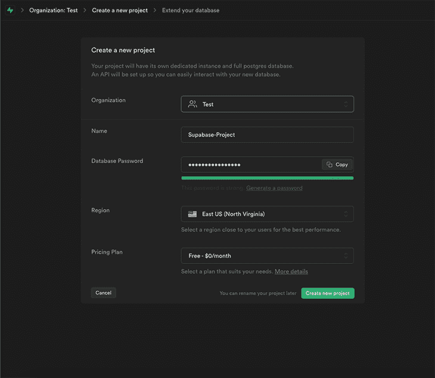

一旦项目准备就绪，点击 **SQL 编辑器**按钮。

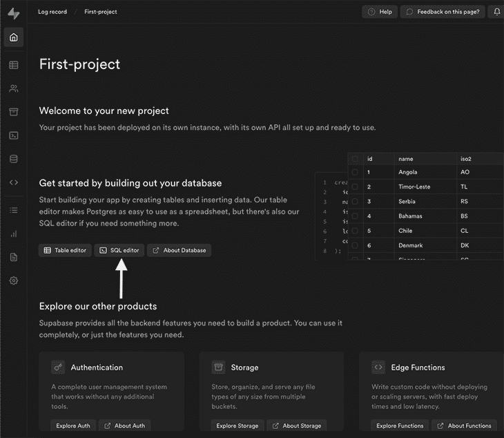

在**快速入门**部分，有我们可以运行的项目的示例脚本。目的是快速开始并为项目创建一个数据库。

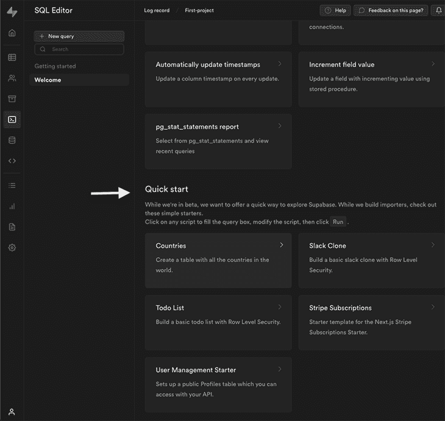

让我们选择一个简单的项目:待办事项列表。它将我们导向一个 **SQL 编辑器**页面。一旦我们进入这个页面，我们可以点击**运行**按钮。

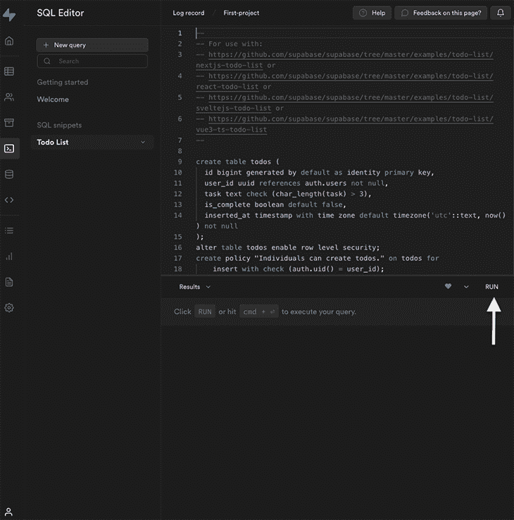

这创建了一个简单的待办事项列表，然后我们可以用我们的数据填充它。

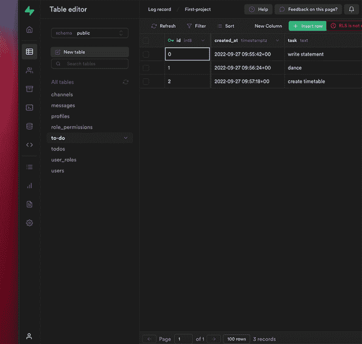

既然我们已经设置了待办事项列表，最后一步就是从客户端获取这些数据。要做到这一点，我们需要从我们的仪表板中获取两个变量**项目 URL** 和 **API** **键**。我们可以通过点击**设置> API** 来获得。

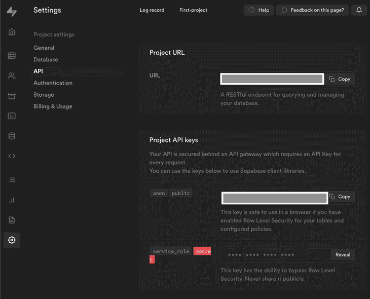

然后，我们可以将它作为环境变量的一部分保存在我们的`.env`文件中。

现在，让我们使用 Supabase 的`npm`包来安装它。

```
npm install @supabase/supabase-js

```

接下来，我们将它导入到我们的项目中，并从`todos`表中提取数据。

```
import { createClient } from '@supabase/supabase-js'

const supabaseUrl = process.env.APP_SUPABASE_URL
const supabaseAnonKey = process.env.APP_SUPABASE_ANON_KEY

const supabase = createClient(supabaseUrl, supabaseAnonKey)

const getTodo = async () => {
  try {
    let { data, error } = await supabase.from('todos').select('*')
    if(data) {
      return data
    }
    if(error) {
      throw error
    }
  }
  catch (error) {
    console.log(error)
  }
}

```

`getTodo`函数从我们的`todos`表中返回数据，如果是这样的话还会返回一个`error`。

## Firebase 与 Supabase:哪一个更适合你的项目？

既然我们已经解释了 Firebase 和 Supabase 分别是如何工作的，那么让我们剖析和比较这两种技术，并检查我们什么时候应该使用 Supabase 而不是 Firebase。

### 导入预先存在的数据

有了 Supabase，我们可以轻松导入 CSV 或复制粘贴电子表格来启动项目。如果我们将数据从另一个平台迁移到 Supabase，这是非常好的。


Firebase 不提供内置服务，使我们能够直接上传批量数据。我们能做的最好的事情是使用第三方节点脚本或类似的东西，这看起来有点粗糙。另外，在做任何事情之前，我们必须将 CSV(或其他格式)转换成 JSON。

### 定价

Supabase 是一款开源产品，这意味着它目前是免费的。Supabase 团队计划在发布时收取托管费。也有个人和企业的贡献计划来帮助赞助产品。

另一方面，Firebase 不是免费的。免费的 Spark 计划是慷慨的，这使得它非常适合于不会产生任何严重流量的辅助项目。企业应用程序需要加入 Blaze 计划(即付即用)才能获得完整的产品，包括 Firebase 扩展和更多的数据库和存储空间。

### 关系数据库与 NoSQL 数据库

Supabase 是一个关系数据库，而 Firebase 是一个 NoSQL 数据库。最适合您项目的数据库取决于您正在构建的应用程序的类型。

当数据是相关的、固定的并且每次都需要一致时，关系数据库是有用的。另一方面，如果我们有不同数据类型的灵活数据，并且我们需要快速移动，那么使用 NoSQL 可能会更好。

这两种数据库类型各有利弊。例如，NoSQL 数据库可能是重复的，但是查询数据库是快速的。这就是它被用于搜索引擎和社交媒体的原因。一致性和性能是两大因素。

### Firebase 扩展

Firebase 提供了官方扩展，可以帮助我们直接整合其他相关服务，如 Stripe、Google play、Algolia、Twilio、Mailchimp 等。

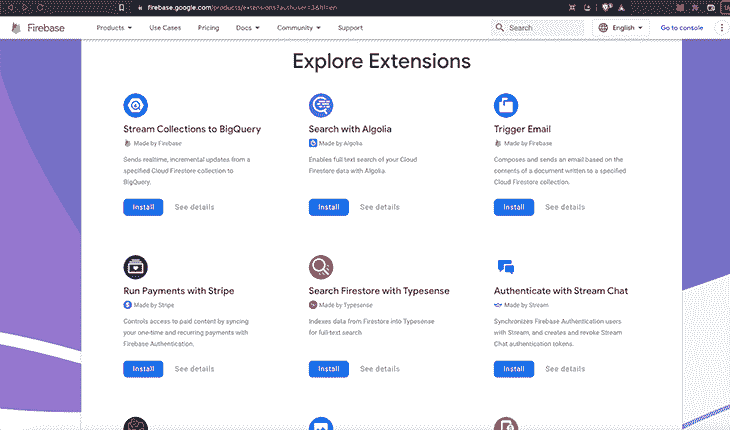

像这样的直接集成有助于我们最大限度地减少工作和抽象某些功能，如果我们使用 Supabase，我们需要自己实现这些功能。

### 数据迁移

在处理企业应用程序时，数据迁移通常是一个优先事项，尤其是当公司规模扩大时。

与使用 Supabase 提供的关系数据库相比，在没有模式或 ORM(如 Firebase)的 NoSQL 数据库上进行数据迁移可能会很困难。当我们已经在生产的时候就更难了。

您可以从仪表板上的备份部分下载我们所有的数据和模式，作为 Supabase 中的一个`.sql`文件。或者，您可以使用`pg_dump`从命令行转储最新的数据。

选择正确的 BaaS 在很大程度上取决于项目的功能需求和增长潜力。如果您正在构建一个大型项目，您应该进行研究，以了解与每个 BaaS 平台相关的约束。这有助于你将来避免技术债务。

### 可扩展性和安全性

考虑到我们上面强调的几点，我们可以说这两种服务都是相对可扩展的。在这种情况下，可伸缩性现在将严重依赖于应用程序数据架构的设计。尽管如此，Supabase 在这种情况下的优势主要在于它使用了 Postgres 数据库及其数据迁移步骤。

## 结论

在这篇文章中，我们介绍了 Firebase 和 Supabase 的基础知识。我们讨论了它们的一般架构，如何安装它们，并概述了这两个选项的主要功能和特性。我们还根据各种标准对两者进行了对比。

感谢阅读！

## 使用 [LogRocket](https://lp.logrocket.com/blg/signup) 消除传统错误报告的干扰

[](https://lp.logrocket.com/blg/signup)

[LogRocket](https://lp.logrocket.com/blg/signup) 是一个数字体验分析解决方案，它可以保护您免受数百个假阳性错误警报的影响，只针对几个真正重要的项目。LogRocket 会告诉您应用程序中实际影响用户的最具影响力的 bug 和 UX 问题。

然后，使用具有深层技术遥测的会话重放来确切地查看用户看到了什么以及是什么导致了问题，就像你在他们身后看一样。

LogRocket 自动聚合客户端错误、JS 异常、前端性能指标和用户交互。然后 LogRocket 使用机器学习来告诉你哪些问题正在影响大多数用户，并提供你需要修复它的上下文。

关注重要的 bug—[今天就试试 LogRocket】。](https://lp.logrocket.com/blg/signup-issue-free)