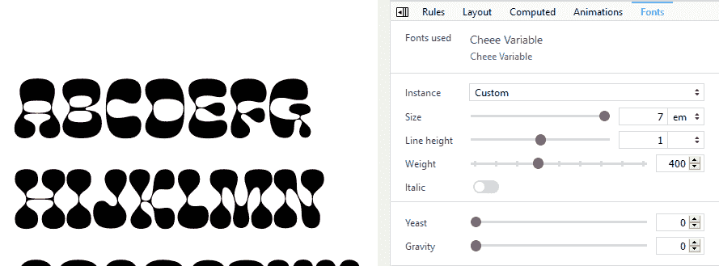
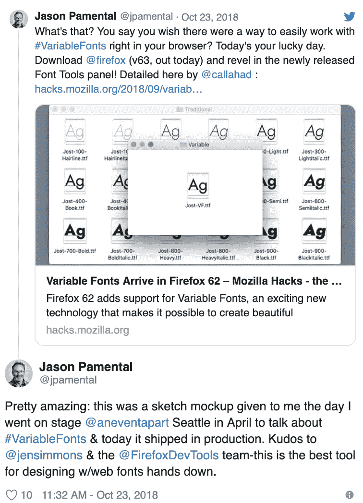

# 面向 CSS 作者的 Firefox DevTools

> 原文：<https://blog.logrocket.com/firefox-devtools-for-css-authors-1511f41d1e3/>

从版本 62 开始，开发人员可以通过 Firefox 新增加的 3 窗格检查器来检查和修改页面的 HTML 和 CSS。

第三个窗格允许深入了解影响页面特定节点的布局属性，如`box-sizing`、`position`、`display`，以及其他功能，如动画、计算和字体。从视觉上来说，这是一个很好的方法，让所有需要的信息都可以被访问和组织，这有助于保持你的 CSS 工作流的效率。

> 我很喜欢@FirefoxNightly 的开发者工具中的三窗格视图…当我们在页面上进行网格布局的多重选择时，它会更加有用。伟大的@FirefoxDevTools 工作正在进行中。pic.twitter.com/o2jRImBIBK

**文档**

### 形状路径编辑器

Image courtesy of MDN docs.

创造圆形、矩形、椭圆形或多边形等复杂形状的能力正是`clip-path`的初衷。如果你今天正在试验或使用它，我有个好消息，因为 Firefox 允许你直接从他们的开发工具中编辑和检查形状路径。

> 我很自豪地向你展示一系列设计工具中的下一个 Firefox 形状路径编辑器。看一看:[https://t.co/7dXaycRI5P](https://t.co/7dXaycRI5P)pic.twitter.com/80F4ptdatH

Jen Simmons announcement of the shape-path editor

你可以点击这里观看 Jen 的[完整视频，并使用下面的演示来亲眼看看它是如何工作的:](https://youtu.be/w8pksaGhjfA)

随着演示的加载和 Firefox DevTools 的打开…

1.  使用 DOM 检查器选择元素(本例中是实际的图像)
2.  通过 DOM 检查器选择元素后，使用 CSS 规则窗格查找元素形状值
3.  单击之前提到的属性值旁边的图标，以在浏览器的视口中高亮显示形状路径。要停用形状路径编辑器，再次点击图标

Shape Path outline via Firefox DevTools. Image Courtesy of MDN Docs

一旦形状路径在视口中被激活，你将得到更多的方面来帮助描述你的形状路径的特殊特征；特别是实线和虚线。

这些线条将拥有手柄，如果需要进一步调整，您甚至可以用光标来拉伸形状。

很酷吧？

**文档**

### 过滤

如果你不熟悉`filter`，它是一个很棒的 CSS 属性，可以创建视觉效果，比如`blur`、`saturate`和`sepia`以及许多其他效果。这些滤镜就像您通常在 Photoshop 中使用的滤镜一样，只是用于浏览器。

* * *

### 更多来自 LogRocket 的精彩文章:

* * *

CSS filters viewed from the Firefox DevTools. Photo courtesy of MDN

当使用 Firefox 检查 CSS 过滤器时，会显示一个带有灰色和白色填充的圆形图标，也可以点击该图标来编辑属性及其值。

CSS filter editor provided by Firefox DevTools. Image courtesy of MDN

单击此样本图标将打开一个过滤器编辑器，您可以添加、移除、调整和更改过滤器的顺序，因为顺序可能会扭曲预期的结果。

[https://www.youtube.com/embed/bHcfLlZE8T8?feature=oembed](https://www.youtube.com/embed/bHcfLlZE8T8?feature=oembed)

VIDEO

Saving a CSS filter from Firefox DevTools. Video courtesy of MDN

当您创建滤镜并对结果感到满意时，您可以将其存储为自定预设。若要启用任何存储的滤镜预置，请使用检查器选择您的元素，点按“样式”面板中前面提到的图标，然后从“滤镜编辑器”窗口中选择您的预置。

**文档**

### 动画片

你可能已经注意到动画在这里停留，并且有很好的理由。这是一种被广泛接受的方法，可以帮助吸引用户，并为界面创造一种更动态的方式，为体验注入活力。[动画视图](https://developer.mozilla.org/en-US/docs/Tools/Page_Inspector/UI_Tour#Animations_view)给出了应用于所选元素的动画的全部细节，以及控制器和时间线(每 250 毫秒标记一次),以处理调试/增强的回放。您还可以控制应用于伪元素(如`::before`或`::after`)的任何动画。

要开始使用此功能，请在 DevTools 中找到“**动画**”标签。注意颜色编码有助于开发人员理解所应用的动画类型。蓝色动画条代表过渡，橙色代表`@keyframes`，绿色代表 Web 动画 API。如果一个条包含一个闪电图标，这意味着属性是使用合成器线程激活的。如果动画或过渡有延迟，它将显示为交叉阴影填充。将鼠标悬停在每个条上，会显示一个工具提示，提供关于动画类型、`duration`、`delay`和定时功能(`ease`)的信息。

[https://www.youtube.com/embed/9fxRm3i_aDQ?feature=oembed](https://www.youtube.com/embed/9fxRm3i_aDQ?feature=oembed)

VIDEO

Animation Inspector. Video courtesy of MDN docs

在动画窗格的顶部，为您提供了用于回放、暂停、重启以及调整速度和时间的时间轴控件。还有一个搓擦条，用于手动将回放调整到特定的时间点，以便进一步分析。

**文档**

### 格子

我只能假设你们大多数读者一直在关注 CSS 布局这些年来的巨大改进，尤其是 Grid。Firefox 是第一批为开发人员提供强大工具的浏览器之一，以便使用 Grid 检查元素，而且随着时间的推移，它只会越来越好。

为了检查应用了`grid`属性的元素，DOM inspector 将在这些元素旁边显示标有单词“ **grid** ”的元素。在“样式”窗格中，元素的属性值旁边还会有一个附带的网格图标。单击此图标将在所选元素或区域的顶部显示一个网格覆盖图，从而显示应用于网格区域的所有信息，如线条和轨迹。查看下面的演示，进一步了解它为检查 CSS 网格提供的强大功能:

Trello Board Layout with CSS Grid & Flexbox by George W. Park

为了进一步增强已经非常强大的网格检查系统，Firefox 提供了显示行号、区域名称和延长线的选项，您可以在闲暇时打开或关闭这些选项，还可以定制网格区域的高亮颜色。Firefox 的一个真正强大的特性，也是我们网格狂热者的先驱。

> 从明天开始，你将可以在@FirefoxDevTools(将于 64 年发布)中突出显示多个网格。出于性能原因，当前限制被设置为 3，但是，您可以在 devtools . grid inspector . max highlighters pref pic.twitter.com/PJfNgWyAW0🥳下的 about:config 中增加该限制

Highlight multiple grid regions in Firefox 64

**文档**

### 字体

我是字体设计的超级粉丝，Firefox 用我最喜欢的一个特性进入了他们的 DevTools，这无疑让我大吃一惊；字体标签。

The Firefox DevTools Fonts tab

“字体”选项卡使开发人员能够检查、查看和操作您应用到页面的字体以及其他方面，如`line-height`、`weight`、`font-family`和`font-style`。您还可以获得更深入的信息，比如正在使用的字体的 URL 路径、`@font-face`声明和一个`font-family`的文本样本。

> TIL @FirefoxDevTools 为字体堆栈中正在使用的字体加下划线。pic.twitter.com/IJxX82VlrZ

Gain immediate insight on what fonts are in use for your stack

从版本 62 开始，也支持可变字体，从而允许您在浏览器中实时检查它们。

Explore variable fonts with Firefox by Jason Pamental

如果你不熟悉可变字体，它们允许字体设计者在一个单独的字体文件中包含多种不同的字体。如果你对可变字体感兴趣，请查看这个资源做进一步的研究。



Controls displayed for adjusting a Variable Font

如果正在使用可变字体，字体选项卡将为执行的轴提供额外的控制，允许您控制和改变每个轴的值。这有助于发现哪些轴是可用的，因为它们可能变化很大，因为设计人员可以实现各种各样的选项。

您可以单独调整轴，或者如果字体设计器包含已定义的实例，您可以从“**实例**”下拉列表中选择一个实例，并在您的页面上实时查看更新。如果你喜欢字体，那么 Firefox DevTools 是你的最爱。看看这个奇妙的可变字体游乐场以及 http://play.typedetail.com。



> 没有描述

**文档**:

截屏

### 如果你的工作需要以静态形式记录界面，Firefox 已经很好地实现了可视化记录你的工作的巧妙方法。除了获取完整页面截图的能力，您还可以选择部分页面区域，甚至单个节点(对于开发独立组件/模块的作者来说，这是一个方便的特性)。

用 Firefox 完成截屏有几种方法；通过 DevTools 本身，或者使用浏览器栏。如果使用 DevTools，直接选择“**设置、**，找到标题为“**可用工具箱按钮**的栏，找到切换按钮“**对整个页面进行截图**

在“**屏幕截图行为**下，您会发现控制…等待…行为的附加选项。选择这些选项后，DevTools 菜单栏将在右上角显示一个摄像头图标，允许您点击视窗，并对整个页面进行截图。如果你不想要整个页面的快照，你也可以使用你的 HTML 检查器面板，通过右击你选择的节点并选择“**屏幕截图节点**”来捕捉单个元素

Screenshot behavior options provided via DevTools settings

获取屏幕截图的另一个选项是选择浏览器地址栏中由 3 个点代表的**页面动作**。当点击这三个点时，你会注意到一个下拉菜单，显示文本“**截图**此选项允许拍摄整个页面、可见区域或使用光标高亮显示单个元素。

Firefox URL bar’s page actions menu

Screenshot option provided under page actions in Firefox’s URL bar

截屏捕获后，您可以将其复制到剪贴板，直接下载，作为 URL 共享，或保存到浏览器。如果你在本地保存到浏览器，你可以选择一段时间来终止截图或无限期保存。如果您需要访问您保存的照片，请单击浏览器栏中的库图标，然后选择“**截图**”如果控制台是创建屏幕截图的首选，您可以运行以下命令…

Eric Meyer 也写了一篇很棒的文章，关于你可以在控制台中传递给屏幕截图命令的额外标志，我强烈建议阅读。

```
screenshot <your-desired-filename.png> — fullpage
```

**文档:**

样式编辑器

### 样式编辑器并不是什么新东西，但是它和我到目前为止提到的任何其他特性一样有价值。大多数 CSS 作者最终需要检查整个文件，甚至将更改保存回磁盘。

查看、创建和导入整个样式表只是几个方面。

Firefox DevTool Style Editor. Image courtesy of MDN docs

右边的侧边栏是专门为那些讨厌的`@media`规则准备的，它提供了到定义规则的样式表的链接，以及导入自定义样式表或创建新样式表的能力。

[https://www.youtube.com/embed/XeocxoW2NYY?feature=oembed](https://www.youtube.com/embed/XeocxoW2NYY?feature=oembed)

VIDEO

Media Links triggered from Style Editor sidebar. Video courtesy of MDN Docs.

你使用 Firefox DevTools 中的样式编辑器面板吗？如果有，你想用它来解决什么问题？我们希望您能参与这项包含三个问题的调查:[https://t.co/YiPwHEayWGThanks](https://t.co/YiPwHEayWGThanks)！pic.twitter.com/DOjQJs6l8e

> Do you use the Style Editor panel in Firefox DevTools? And if so what problems are you trying to solve with it?We would love your input in this 3-questions survey: [https://t.co/YiPwHEayWGThanks](https://t.co/YiPwHEayWGThanks)! pic.twitter.com/DOjQJs6l8e

**文档:**

响应设计模式

### 响应式设计对开发者来说并不新鲜，因为它是我们每天都要处理的事情；尤其是涉及到我们 CSS 的时候。能够研究屏幕大小、设备甚至网络速度无疑是开发网页最重要的方面之一。

Firefox 非常注意为开发人员提供强大的工具来检查站点的响应方面，并在最近几年从 Chrome 那里获得了很大的指导。从 CSS 作者非常关心的各个方面进行选择，比如设备、像素比例、用户代理、自定义屏幕尺寸、方向、网络节流，当然还有获取屏幕截图。你甚至可以点击一个`@media`规则，在响应设计模式下自动应用它。

Responsive Design Mode in Firefox DevTools. Image courtesy of MDN docs.

**文档:**

转换

### 不用猜测就能确切地看到变换的位置，这不是很好吗？有了 Firefox DevTools，你可以！

要查看这一可视化效果，将鼠标悬停在任何`transform`属性上，您将看到页面上覆盖的转换。

Transform visualization in Firefox DevTools. Image courtesy of MDN Docs.

**文档:**

使用预处理程序

### 这是我们这些天非常熟悉的一个特性，但它值得重复。我们许多 CSS 作者都在使用某种形式的预处理语言，比如 Sass 或 LESS，这就是为什么处理这些文件和将更改保存回本地磁盘同样重要。

在[风格编辑器设置](https://developer.mozilla.org/en-US/docs/Tools_Toolbox#Style_Editor)中选择“显示原始来源”。在[规则视图](https://developer.mozilla.org/en-US/docs/Tools/Page_Inspector#Rules_view)中 CSS 规则旁边显示的链接将链接到样式编辑器中的原始源代码。请确保为您选择的语言启用了源映射，因为此功能对于任何不支持源映射的抽象语言都不可用。

[https://www.youtube.com/embed/zu2eZbYtEUQ?feature=oembed](https://www.youtube.com/embed/zu2eZbYtEUQ?feature=oembed)

VIDEO

**文档:**

**Docs:**