# swift 教程中的 forestore-log rocket 博客

> 原文：<https://blog.logrocket.com/firestore-swift-tutorial/>

Swift 是苹果公司开发的一种通用、多参数、编译的编程语言，专门用于 iOS 开发。在编写任何 Swift 应用程序时，开发人员通常希望在其应用程序中添加数据库功能。这就是 Firestore 的用武之地。

Firestore 是一个 NoSQL 文档数据库，为自动缩放、高性能和简单的应用程序开发而构建。在 Firestore 中，所有数据都有一组键值对，并存储在一个集合中。

在本教程中，我们将学习如何在 Swift 应用程序中设置和配置 Firestore。Firestore 可以轻松地在云中存储数据，同时管理身份验证和安全性，无需后端开发人员。

## Swift 先决条件中的 Firestore

要开始本教程，请确保您具备以下条件:

*   熟悉 swift 编程
*   熟悉 SwiftUI
*   Xcode 安装在您的本地机器上
*   Windows 用户的在线 Swift 游乐场
*   安装了 CocoaPods

## 设置 Swift 项目

让我们从创建一个新的 Swift 应用程序开始。打开 Xcode 应用程序，选择 **App** 搭建一个新项目。


命名应用程序，单击下一个按钮的**，并选择在本地机器上保存应用程序的位置。**

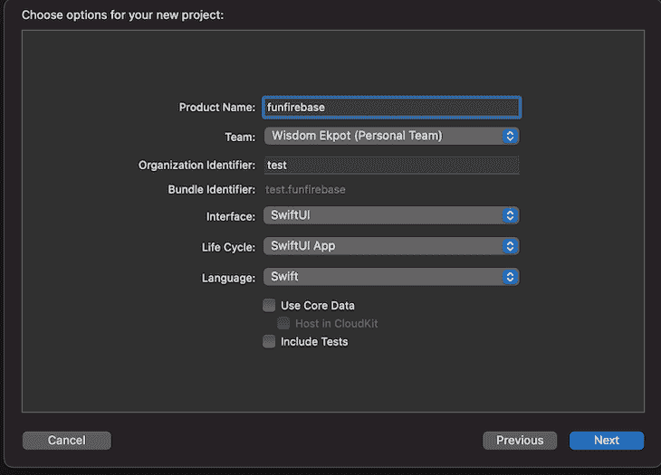

建立项目后，我们必须初始化我们的 pods，并通过我们的终端更新
`Podfile`。为此，首先进入项目目录并运行以下命令:

```
pod init;open Podfile 

```

`pod init`初始化吊舱，`open Podfile`打开配置终端更新`Podfile`。

我们还必须通过包含以下内容来包含`Podfile`的 Firebase pods:

```
pod ‘Firebase/Core'
pod ‘Firebase/Firestore' 

```

您可以在终端中看到这个配置。

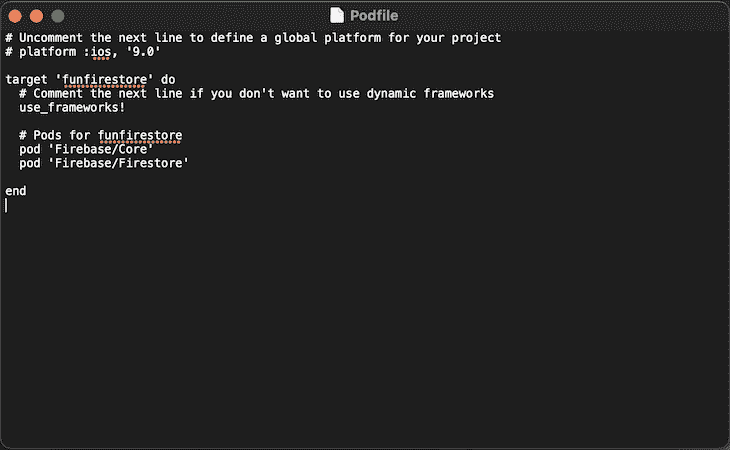

完成此操作后，按 Command + S 保存`Podfile`并关闭终端编辑器。

### 带来了与椰子的依赖

接下来，让我们通过运行`pod install`引入 Firestore 依赖项来安装我们的 pod。

如果您在尝试安装 pod 时出现以下错误，请通过运行`sudo gem install cocoapods`在您的本地机器上安装`cocoapods`。CocoaPods 是 Swift 的一个依赖项管理器，它管理在我们的 Swift 应用程序中安装依赖项。

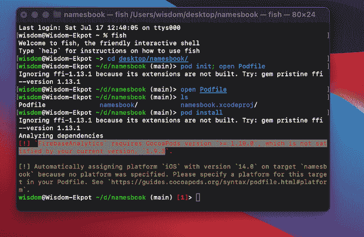

安装后，使用`pod setup`命令更新`cocoapods`。

如果错误仍然存在，请使用 brew 通过以下命令安装`cocoapods`:

```
brew install cocoapods

```

然后，使用以下命令覆盖旧版本:

```
brew link --overwrite cocoapods

```

完成后，您现在可以运行`pod install`来为我们的应用程序安装依赖项。
安装完 pods 后，打开项目目录，在 Xcode 中打开`funfirebase.xcworkspace`文件。

## 设置 Firebase

现在，前往[https://console.firebase.google.com/](https://console.firebase.google.com/)，点击**创建项目**按钮。输入项目名称，例如“funfirebase”

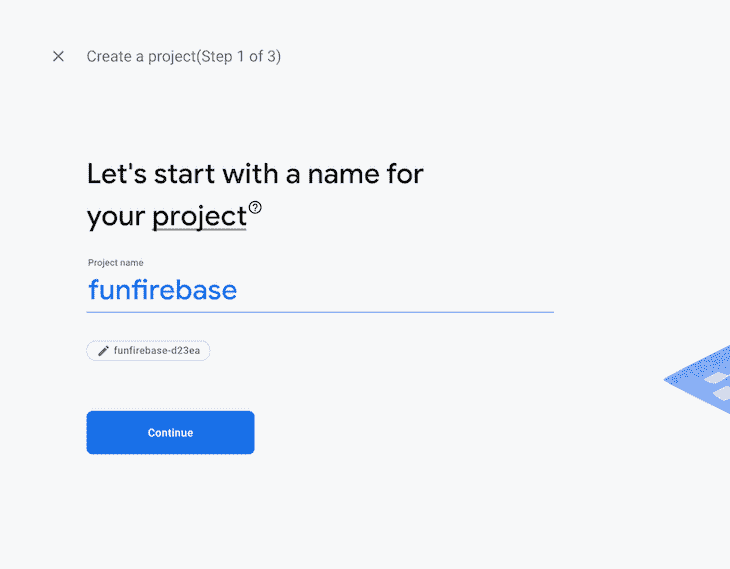

点击**继续**按钮，禁用该项目的 Google Analytics，点击**创建项目**按钮。

完成项目设置后，单击 **iOS** 图标启动设置提示。


添加应用包标识符并点击**注册应用**按钮。应用程序昵称和应用程序商店 ID 是可选的，所以我们可以忽略它。

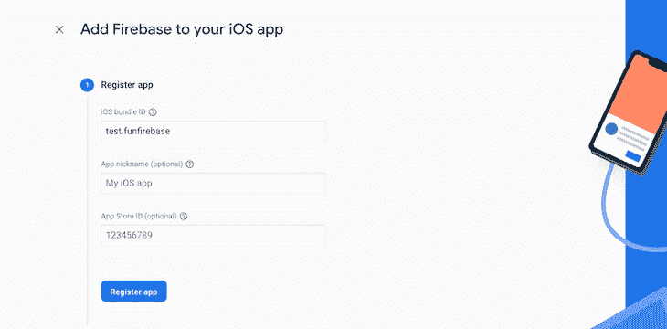

接下来，点击**下载 GoogleService-Info.plist** 按钮下载 iOS 配置。下载此文件后，将文件移动到您的根 Xcode 项目中。

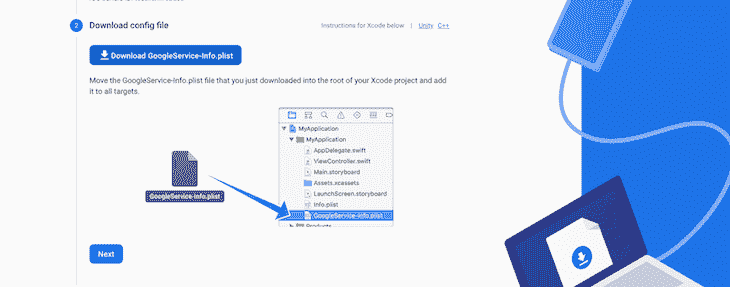

## 设置 firestorm sdk

Firestore SDK 管理您的云 Firestore 项目中的全套数据。要开始设置，o 打开`funfirebaseApp.swift`文件，创建一个`funfirebaseApp`扩展名，并添加一个`initFirebase`方法。

[Swift 中的扩展将新功能](https://blog.logrocket.com/swift-extensions-an-overview-with-examples/)添加到一个[现有的类、结构](https://blog.logrocket.com/introduction-to-classes-and-structs-in-swift/)、枚举或[协议类型](https://blog.logrocket.com/understanding-protocols-in-swift/):

```
extension funfirebaseApp {
  private func initFirebase() {
    FirebaseApp.configure()
  }
}

```

`FirebaseApp.config`方法为我们的应用程序配置一个默认的 Firebase 应用程序。我们必须通过在我们的`funfirebaseApp`结构中调用它来初始化`initFirebase`方法:

```
@main
struct funfirebaseApp: App {
    // init firebase
    init() {
        initFirebase()
      }

    var body: some Scene {
        WindowGroup {
            ContentView()
        }
    }
}

```

## 使用 Firestore 构建快捷的待办应用程序

我们将构建一个简单的待办事项应用程序，它将为用户添加一个任务列表。构建这个项目的目的是帮助我们理解如何从云 Firestore 添加和检索数据。

让我们首先为我们的应用程序创建一个简单的 UI，并使用 SwiftUI 来实现。首先，打开`ContentView.swift`文件，将其更新为以下内容:

```
//
//  ContentView.swift
//  funfirebase
//
//  Created by Wisdom Ekpot on 7/19/21.
//

import SwiftUI

struct ContentView: View {
    @State private var task:String = ""
    var body: some View {

        // input field
        TextField("Start typing a task...", text: $task)
            .padding()
            .border(Color.black)
            .frame(minWidth: 100, idealWidth: 150, maxWidth: 240, minHeight: 30, idealHeight: 40, maxHeight: 50, alignment: .leading)

        // button to add
        Button(action: { print("Task added \(task)")}) {
            Text("Add Task")
        }.padding()
        .foregroundColor(.white)
        .background(Color.black)
        .cornerRadius(5)

        //
        NavigationView {
            List {
                Text("Read")
                Text("Execise")
                Text("Text John")
                Text("Say hello")
            }.navigationTitle("All Tasks")
        }

    }
}

struct ContentView_Previews: PreviewProvider {
    static var previews: some View {
        Group {
            ContentView()
        }
    }
}

```

让我们分解代码。我们从创建输入字段开始:

```
 TextField("Start typing a task...", text: $task)
.padding()
.border(Color.black)
.frame(minWidth: 100, idealWidth: 150, maxWidth: 240, minHeight: 30, idealHeight: 40, maxHeight: 50, alignment: .leading)

```

使用`TextField`属性，我们在 Swift 中创建输入字段，包括一个定义的`minWidth`和`minHeight`以及一个默认的占位符。在`body`变量中定义的`task`变量存储输入字段状态:

```
@State private var task:String = ""

```

接下来，我们将添加一个按钮，用于向 Firestore 数据库添加待办任务:

```
// button to add
        Button(action: { print("Task added \(task)")}) {
            Text("Add Task")
        }.padding()
        .foregroundColor(.white)
        .background(Color.black)
        .cornerRadius(5)

```

这将为按钮分配一个动作来打印输入字段的值。

接下来，使用`List`属性列出所有待办事项:

```
 // list all items
        NavigationView {
            List {
                Text("Read")
                Text("Execise")
                Text("Text John")
                Text("Say hello")
            }.navigationTitle("All Tasks")
        }

```

有了定义的列表，我们现在可以在任何模拟器设备上预览我们的应用程序。本教程使用 iPhone 11 预览应用程序，它应该是这样的:

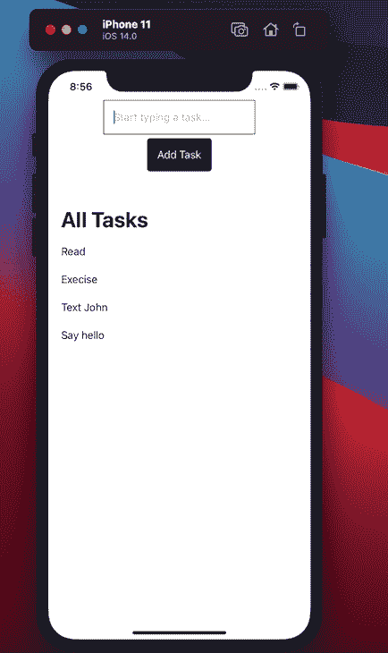

## 添加应用程序的功能

我们将继续创建`get`和`add`功能。添加这两个功能后，用户可以添加一个新的待办任务，并获得应用程序中所有待办任务的列表。

让我们首先为我们的待办事项列表创建一个模型。创建一个`Models`目录。在内部，创建一个`Todo.swift`文件并添加以下代码片段:

```
import SwiftUI
struct Todo: Codable, Identifiable {
    var id: String = UUID().uuidString
    var name: String?
}

```

我们的待办事项列表遵循这种数据结构。

接下来，创建一个`viewModel`目录，在该目录中，创建一个`TodoViewModel.swift`文件并添加以下代码:

```
import Foundation
import FirebaseFirestore

class TodoViewModel: ObservableObject {

    @Published var todos = [Todo]()

    private var db = Firestore.firestore()

    func getAllData() {
        db.collection("todos").addSnapshotListener { (querySnapshot, error) in
            guard let documents = querySnapshot?.documents else {
                print("No documents")
                return
            }

            self.todos = documents.map { (queryDocumentSnapshot) -> Todo in
                let data = queryDocumentSnapshot.data()
                let name = data["name"] as? String ?? ""
                return Todo(name: name)
            }
        }
    }

    func addNewData(name: String) {
           do {
               _ = try db.collection("todos").addDocument(data: ["name": name])
           }
           catch {
               print(error.localizedDescription)
           }
       }
}

```

这里我们有两个函数:`getAllData`函数从我们的 Firestore 数据库获取所有数据，而`addNewData`函数向 Firestore 数据库添加一个新项目。

要使用`TodoViewModel.swift`文件，我们必须将它连接到我们的`ContentView`结构中的`ContentView.swift`文件:

```
@ObservedObject private var viewModel = TodoViewModel()

```

有了这个定义，我们必须更新我们的`List`元素如下:

```
 List(viewModel.todos) { todo in
                            VStack(alignment: .leading) {
                                Text(todo.name ?? "")
                            }
                        }.onAppear() {
                            self.viewModel.getAllData()
                        }.navigationTitle("All Tasks")

```

当然，这会呈现一个空白列表，因为我们的数据库中没有任何待办任务。

要添加待办任务，请前往 Firebase 控制台，点击 **Firestore** **数据库**。点击**创建数据库**按钮，并选择**在测试模式下启动**单选按钮。

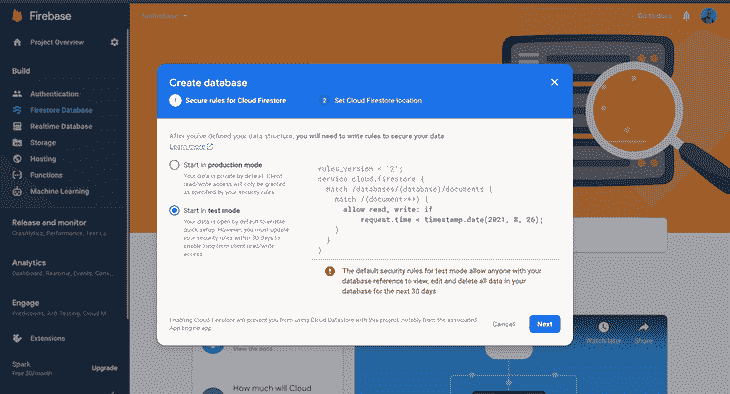

完成这些后，我们可以开始将待办任务添加到我们的数据库中。


点击**开始收藏**链接，添加“todos”作为收藏 ID。

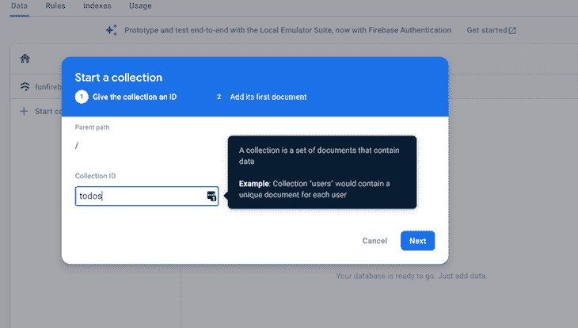

现在，开始向数据库中添加新的待办事项。始终将字段名称设置为**名称**。

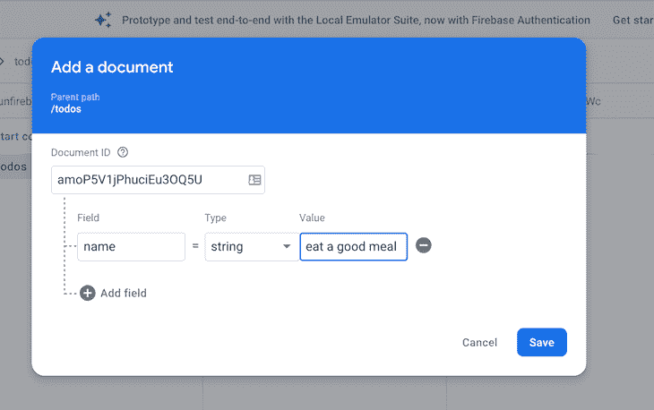

点击**保存**按钮，应用程序会自动更新我们的更改。

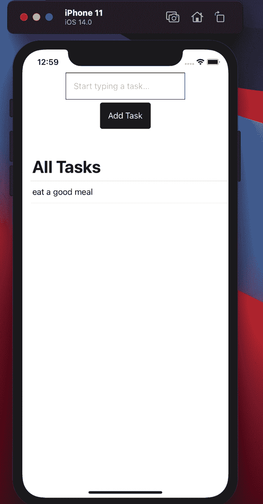

### 实施`add`功能

我们还必须更新我们的按钮来调用我们创建的`addNewData`函数。我们必须添加一个任务名称作为参数，它是从输入字段中检索的。

为此，请将按钮修改如下:

```
 Button(action: { self.viewModel.addNewData(name: task)}) {
            Text("Add Task")
        }.padding()
        .foregroundColor(.white)
        .background(Color.black)
        .cornerRadius(5)

```

现在，当单击按钮时，它从输入字段获取值，并将其传递给参数`addNewData`，将其存储在 Firestore 集合中。

## 结论

在我们的 Swift 应用程序中使用 Firestore 非常简单明了。在本文中，我们学习了如何使用 SwiftUI 为我们的应用程序设置用户界面，以及如何从云 Firestore 添加和检索数据。

[点击此处获取该应用程序的源代码](https://github.com/Wisdom132/swiftfirestore)。

## 使用 [LogRocket](https://lp.logrocket.com/blg/signup) 消除传统错误报告的干扰

[](https://lp.logrocket.com/blg/signup)

[LogRocket](https://lp.logrocket.com/blg/signup) 是一个数字体验分析解决方案，它可以保护您免受数百个假阳性错误警报的影响，只针对几个真正重要的项目。LogRocket 会告诉您应用程序中实际影响用户的最具影响力的 bug 和 UX 问题。

然后，使用具有深层技术遥测的会话重放来确切地查看用户看到了什么以及是什么导致了问题，就像你在他们身后看一样。

LogRocket 自动聚合客户端错误、JS 异常、前端性能指标和用户交互。然后 LogRocket 使用机器学习来告诉你哪些问题正在影响大多数用户，并提供你需要修复它的上下文。

关注重要的 bug—[今天就试试 LogRocket】。](https://lp.logrocket.com/blg/signup-issue-free)