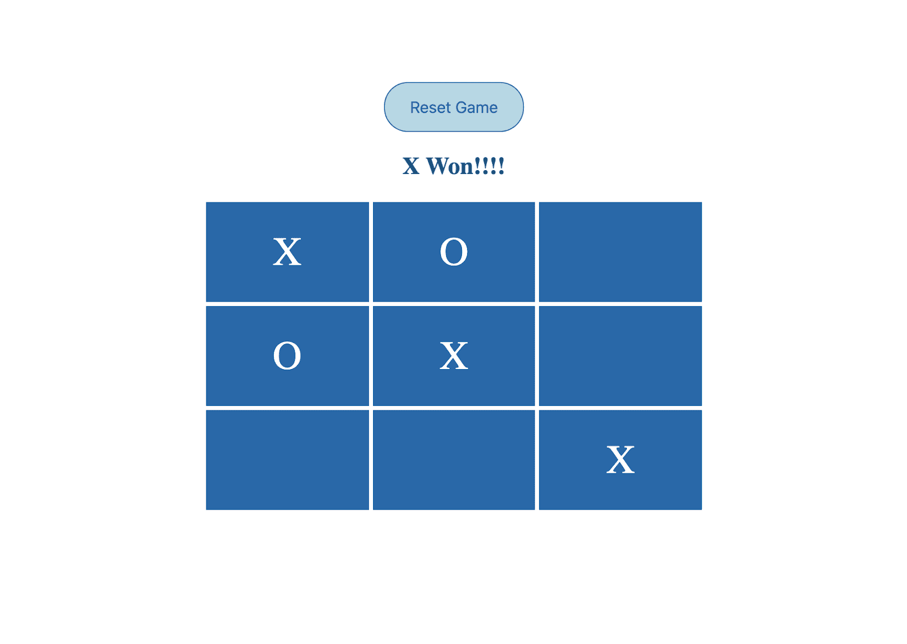

# 在 WebAssembly 中创建您的第一个游戏

> 原文：<https://blog.logrocket.com/first-game-in-webassembly/>

你有没有经历过将 C/C++中的遗留代码移植到 JavaScript 的痛苦？你是否曾经希望可以重用你的遗留应用程序，或者在你的 web 应用程序中拥有接近原生的性能？

如果你对以上任何一个问题的回答是肯定的，WebAssembly 可以帮上忙！

## 了解 WebAssembly

根据[文档](https://developer.mozilla.org/en-US/docs/WebAssembly/Concepts#:~:text=WebAssembly%20is%20a%20low%2Dlevel%20assembly%2Dlike%20language%20with%20a,can%20run%20on%20the%20web.):

> 它是一种低级的类似汇编的语言，具有紧凑的二进制格式，以接近本机的性能运行，并为 C/C++和 Rust 等语言提供编译目标，以便它们可以在 web 上运行。

这基本上意味着，WebAssembly 提供了一种将我们的 C/C++代码转换成特定格式的方法，这种格式可以很容易地被使用。

## 但是 WebAssembly 是怎么做到的呢？

WebAssembly 就像一种新的语言，但作为开发人员，您不必编写它，因为它充当了 C/C++或 Rust 等低级语言的编译目标。

所以，当你有了你的 C 或 C++应用程序，你可以把它编译成一个. wasm 文件，然后可以把它导入到你的 web 应用程序中。

WebAssembly 甚至允许您在 JS 应用程序之间传递和访问数据/变量。

本文在这里详细解释了【WebAssembly 如何工作。

## 使用 WebAssembly 的优势

*   你最终可以将性能密集型任务外包给 C/C++或类似 Rust 的性能语言，如 3D 游戏、虚拟、增强现实或计算机视觉的计算
*   有大量用 C/C++编写的惊人的遗留库，现在可以无缝集成到您的 web 应用程序中。你可以在这里找到其中的一些
*   你可以编写超级快速和漂亮的应用程序(例如，[谷歌地球](https://earth.google.com/web/@0,0,0a,22251752.77375655d,35y,0h,0t,0r))

## WebAssembly 为 web 提供了扩展功能

现在我们已经看到了 WebAssembly 可以做什么，让我们创建我们的第一个游戏来看看它是如何工作的。

## 在 WASM 创造你的第一个井字游戏



We will be building a 3×3 tic-tac-toe game. Our game logic includes:

*   计算哪个玩家赢了
*   计算是否没有赢家
*   指示待定移动

整个游戏逻辑都是用 C++写的。

## 了解 Emscripten

正如我之前提到的，我们需要将 C++应用程序转换为中间格式，即. wasm。为此，我们需要一个工具来将 C++文件编译为这种格式。

有很多方法可以做到这一点，但是在这篇文章中，我将使用 Emscripten。其原因是因为:

1.  它直接将你的 C/C++代码转换成 JavaScript，这意味着你甚至不需要写任何粘合代码来读取你的。wasm 文件。这为您提供了足够的灵活性，使您可以只关注逻辑而不是实现
2.  其次，从调用你的 C++文件中编写的函数到你的 JS 文件来说，这是非常直观的。一旦我们深入研究代码，您就会看到这一点

在你开始编码之前，确保你已经安装了 Emscripten。你可以在这里了解更多关于 T2 的信息。

在我们开始之前，让我们先把我们的游戏分成几个易于管理的部分:

1.  我们必须用 C++编写我们的游戏逻辑
2.  使用 Emscripten 传输文件
3.  在我们的游戏中调用 C++函数

最终的游戏代码可以在这里找到[。](https://github.com/arwalokhandwala/tictactoe-game-wasm)

## 用 C++编写我们的游戏逻辑

游戏的逻辑写在 [tic_tac_toe.cpp 文件](https://github.com/arwalokhandwala/tictactoe-game-wasm/blob/master/tic_tac_toe.cpp)中。

首先，我们首先导入所有必需的脚本库:

```
#include <emscripten/bind.h>
#include <emscripten/val.h>
```

上面显示的代码导入了 [Embind](https://emscripten.org/docs/porting/connecting_cpp_and_javascript/embind) ，它用于将 C++代码与 JavaScript 绑定在一起(也就是说，我们现在可以在 C++代码中调用和操作 JavaScript 变量)。

接下来，我们继续讨论 tic_tac_toe()，它包含了游戏的主要逻辑:

```
val tic_tac_toe() {
    val board_values = val::global("BoardValues");
    val moves_pending_label = val::global("movesPendingLabel");
    val no_winner_label = val::global("noWinnerLabel");
    val empty_block = val::global("emptyBlock");
    bool moves_pending = false;

    val solutions[8][3]= {
        { board_values[0][0], board_values[0][1], board_values[0][2]},
        { board_values[1][0], board_values[1][1], board_values[1][2]},
        { board_values[2][0], board_values[2][1], board_values[2][2]},
        { board_values[0][0], board_values[1][0], board_values[2][0]},
        { board_values[0][1], board_values[1][1], board_values[2][1]},
        { board_values[0][2], board_values[1][2], board_values[2][2]},
        { board_values[0][0], board_values[1][1], board_values[2][2]},
        { board_values[0][2], board_values[1][1], board_values[2][0]},
    };

    for ( int i = 0; i < 8; i++ ){
        if((solutions[i][0] != empty_block) && (solutions[i][1] != empty_block) && (solutions[i][2] != empty_block)&& (solutions[i][0] == solutions[i][1]) && ( solutions[i][1] == solutions[i][2] )) {
            return solutions[i][1];
        } else if((solutions[i][0] == empty_block) || (solutions[i][1] == empty_block) || (solutions[i][2] == empty_block)){
            moves_pending = true;
        }
   }

   if (moves_pending) {
       return moves_pending_label;
   }

    return no_winner_label;
}

```

我们的函数签名`val tic_tac_toe()`声明函数返回的值是一个 JavaScript 变量。

所有的初始值都在我们的 JavaScript 中声明，现在我们需要一种方法来访问和操作这些初始值。

幸运的是，Embind 提供了一种方法来实现这一点，它使用:

```
val cpp_var_name = val::global("js_var_name");
```

使用它，我们将导入所有必要的标签、游戏板值和游戏状态变量:

```
val board_values = val::global("BoardValues");  // Object representing our 3*3 board
val moves_pending_label = val::global("movesPendingLabel"); // Label returned if there are any pending moves/blocks remaining
val no_winner_label = val::global("noWinnerLabel"); // Label indicating who won
val empty_block = val::global("emptyBlock"); //  Indicator for an empty cell on board
bool moves_pending = false;  // State variable indicating if any blocks are pending

```

现在，我们的下一步是创建一个解决方案矩阵，显示所有可能的解决方案。`val solutions[8][3]`，是一个 8*3 的数组，代表我们所有可能的解决方案组合。

> 注意:可能有其他方法来实现井字游戏的解决方案，但是，为了简单起见，我们将列出所有可能的解决方案，并使用我们当前的棋盘值进行交叉验证，以检查是否有任何玩家获胜。

现在，一旦我们有了所有可能的解决方案，我们将比较我们当前的棋盘值与这些解决方案，看看是否有任何一个玩家赢了。

如果我们当前的棋盘值与我们的任何解决方案相匹配，那么我们返回代表其中一个玩家的单元格值。然而，如果没有找到匹配，并且棋盘上有任何空单元格，则返回`moves_pending_label`，否则返回`no_winner_label`。

现在，让我们导出这个函数，以便在我们的 web 应用程序中调用它:

```
 EMSCRIPTEN_BINDINGS(my_module) {
    function("tic_tac_toe", &tic_tac_toe);
}
```

上面的代码允许我们现在使用`tic_tac_toe()`调用函数。当我们的粘合代码。js 文件最初被加载。

## 运输。cpp 文件到。wasm 和。js(粘合代码)

曾经我们的。cpp 文件准备好了，下一步是将文件传输到。wasm 文件和。可以在我们的 web 应用程序中使用的 js 文件:

```
emcc --bind -o tic_tac_toe.js tic_tac_toe.cpp
```

上面的命令将我们的 tic_tac_toe.cpp 文件传输到两个新文件，即 [tic_tac_toe.wasm](https://github.com/arwalokhandwala/tictactoe-game-wasm/blob/master/tic_tac_toe.wasm) 和 [tic_tac_toe.js](https://github.com/arwalokhandwala/tictactoe-game-wasm/blob/master/tic_tac_toe.js) 。tic_tac_toe.js 文件包含了加载我们的 C++函数并将其公开为可以导入的模块所需的所有粘合代码。

## 在我们的 web 应用程序中调用 C++函数

下面讨论的所有代码都可以在[这里](https://github.com/arwalokhandwala/tictactoe-game-wasm/blob/master/index.html)找到。现在我们已经完全透明了。cpp 文件，现在是我们准备调用 tic_tac_toe()的 JavaScript 代码的时候了。

第一步是声明保存纸板初始值的变量，如前所述:

```
 var currentBoardValues = []
 var BoardValues = {0:[],1:[],2:[]}
 var movesPendingLabel = 'Moves still pending!';
 var emptyBlock = '';
 var noWinnerLabel = 'Oops! Looks like no one won :('

```

接下来，

```
var Module = {
    onRuntimeInitialized: function() {
            Module.tic_tac_toe()
         }
 };
```

你还记得我们的 tic_tac_toe() C++函数，它是由 Embind 公开的，现在可以在 Emscripten [module](https://emscripten.org/docs/api_reference/module.html) 对象上使用。

然而，我们只能在 tic_tac_toe()完全加载后调用它，也就是说，在运行时调用它。js 胶水代码和。wasm 文件)已初始化。为此，我们使用了`onRuntimeInitialized`回调，它将在运行时准备就绪时运行。

现在，每当任何玩家点击任何单元格，我们调用我们的 C++函数作为`Module.tic_tac_toe()`，它将返回适当的结果。

瞧，我们在 WebAssembly 的第一个游戏已经准备好了！你可以点击查看最终游戏代码[。](https://github.com/arwalokhandwala/tictactoe-game-wasm)

## 结论

WebAssembly 真的很了不起，它确实让我们做了以前不可能的事情。我希望这篇文章能帮助你迈出 web 组装之旅的第一步。

## 使用 [LogRocket](https://lp.logrocket.com/blg/signup) 消除传统错误报告的干扰

[](https://lp.logrocket.com/blg/signup)

[LogRocket](https://lp.logrocket.com/blg/signup) 是一个数字体验分析解决方案，它可以保护您免受数百个假阳性错误警报的影响，只针对几个真正重要的项目。LogRocket 会告诉您应用程序中实际影响用户的最具影响力的 bug 和 UX 问题。

然后，使用具有深层技术遥测的会话重放来确切地查看用户看到了什么以及是什么导致了问题，就像你在他们身后看一样。

LogRocket 自动聚合客户端错误、JS 异常、前端性能指标和用户交互。然后 LogRocket 使用机器学习来告诉你哪些问题正在影响大多数用户，并提供你需要修复它的上下文。

关注重要的 bug—[今天就试试 LogRocket】。](https://lp.logrocket.com/blg/signup-issue-free)