# 5 个跨浏览器兼容的 CSS 标题样式

> 原文：<https://blog.logrocket.com/five-cool-css-header-styles-with-cross-browser-compatibility/>

## 介绍

标题就像报纸的标题:大、粗、响亮。他们唯一的目的是在短时间内将你的注意力吸引到一个故事上。标题是访问者在网站上看到的第一个东西，因此它为网站的其余部分定下了基调，并且必须有适当的风格。它应该包含访问者可以快速处理的可读文本，这增加了他们滚动或点击网站的可能性。

一个网站大概有 500 毫秒(0.05 秒)的时间来给人留下印象，所以让我们来学习如何让它们发挥作用吧！

在本帖中，我们将看看用 CSS 设计标题的五种酷方法:

1.  [CSS 文本颜色渐变](#css-text-color-gradients)
2.  [用 CSS 在文本后面添加背景图片](#add-background-image-behind-text-css)
3.  [给 CSS 中的文本添加阴影](#add-shadows-text-css)
4.  [带 HTML 和 CSS 的打字机效果](#typewriter-effect-with-html-css)
5.  [渐变文本动画](#gradient-text-animation)

我们还将介绍一些关于标题文本样式的有用技巧和每种样式的跨浏览器兼容性的 T2。

### 什么是报头？

如上所述，标题是网页的第一部分，通常包含大字体的粗体标题文本、小字体的描述性文本、图像和行动号召按钮。

让我们来看一个例子:

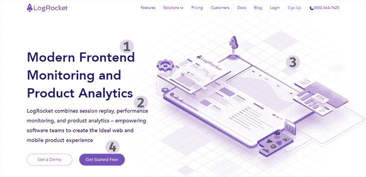

1\. Header, 2\. Description, 3\. Image, 4\. Call to action buttons

主标题文本由`h1`标签指定，这是最重要的 HTML 标题标签。我们在本教程中的重点将是这个标题的样式。

在我们进入教程之前，让我们回顾一下设计标题的一些最佳实践，帮助你在不疏远用户的情况下产生最大的影响。

### 选择正确的颜色

页眉是访问者看到的第一个东西，所以留下一个好印象很重要。如果你用品牌颜色来设计风格，那么就把重点放在主要的原色上。如果你没有使用固定的品牌颜色，那么就使用可以互相补充的颜色。如果你不知道什么有效，花时间去研究。

### 让它独一无二

主标题文本应该不同于网站上的任何其他标题。它应该脱颖而出；它的风格不应该被复制到其他任何地方。事实上，一个网页上应该只有一个`h1` header 标签，因为这对 SEO 有好处。

如果标题样式重复，性能可能会降低，因为可能会使用大量资源来显示标题。浏览器应该只需要这样做一次。

### 使用正确的字体

从大小、颜色、粗细和字体，一切都可以在完美、可读的标题文本和视觉混乱之间产生差异。我知道创意是源源不断的，但不要害怕在需要的时候低调处理。标题文本需要是可读的。

### 检查兼容性

有一个很棒的网站，[can use](https://caniuse.com/)，可以帮助你了解 CSS 属性的浏览器兼容性。我们将在浏览器兼容性部分使用它来详细说明本文中使用的功能支持。

## CSS 文本颜色渐变

颜色渐变是两种或两种以上颜色之间的过渡，其中颜色相互混合。有三种方法可以在 CSS 中为标题文本添加颜色渐变:

1.  `linear-gradient()`
2.  `radial-gradient()`
3.  `conic-gradient()`

### 1.`linear-gradient()`

使用此功能，颜色以直线过渡。

首先，用 HTML 设置一个标题:

```
  <body>
    <header>
        <h1>Modern Frontend Monitoring and Product Analytics</h1>
    </header>
  </body>

```

您可以使用语义标签`header`，如图所示，或者使用带有 ID 的`section`标签，或者使用带有`class="header"`的[、`[div]`、](https://blog.logrocket.com/bidirectional-css-centering-complete-guide/)。这里真正重要的是你的标题文本在网站的第一部分，它是可识别的标题文本。

`linear-gradient()`功能允许您添加特定的参数，包括渐变的方向和至少两个颜色值。您可以添加的颜色数量没有限制。

让我们用 CSS 来演示一下:

```
header h1 {
  font-size: 70px;
  font-weight: 600;
  background-image: linear-gradient(to left, #553c9a, #b393d3);
  color: transparent;
  background-clip: text;
  -webkit-background-clip: text;
}

```

属性确保背景不会超出一个元素——在本例中是文本。`color`道具被设置为`transparent`，这样你可以直接看到标题后面的背景。

上述代码的结果是，从标题文本的右端向左，暗色过渡到亮色:


A linear text gradient from right to left

您可以使用向其他方向移动的文本颜色渐变来设置页眉的样式:

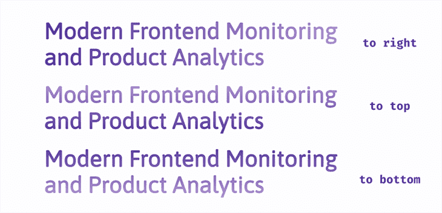

Linear text gradients in three other ways (top to bottom, bottom to top, and left to right)

您也可以制作`linear-gradient()`对角线:

```
linear-gradient(to bottom left, #553c9a, #ee4b2b);

```

对角线方向可以用角度来表示:

```
linear-gradient(45deg, #553c9a, #ee4b2b);

```

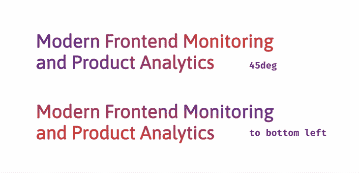

A linear text gradient on a diagonal

我们可以通过在第一种颜色后添加一个百分比值来指定标题中颜色过渡开始的时间:

```
linear-gradient(to right, #553c9a 45%, #ee4b2b)

```

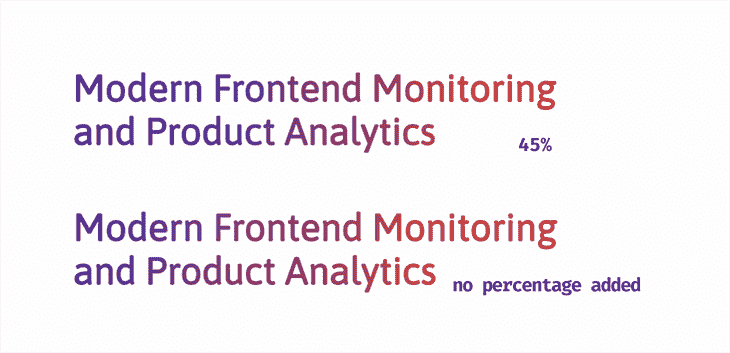

A linear text gradient using percentages

在上面的例子中，第一种颜色(紫色)在开始变成红色之前占了标题文本的 45%。

### 2.`radial-gradient()`

这种渐变从颜色向外“辐射”的原点开始。默认情况下，颜色过渡从元素(标题)的中心开始。

```
background-image: radial-gradient(#553c9a, #ee4b2b);

```

我们不能用`radial-gradient()`指定方向，但是我们可以指定渐变的形状。有两种选择可以用于我们的标题:圆形或椭圆形。

```
radial-gradient(circle, #553c9a, #ee4b2b);

radial-gradient(ellipse, #553c9a, #ee4b2b);

```

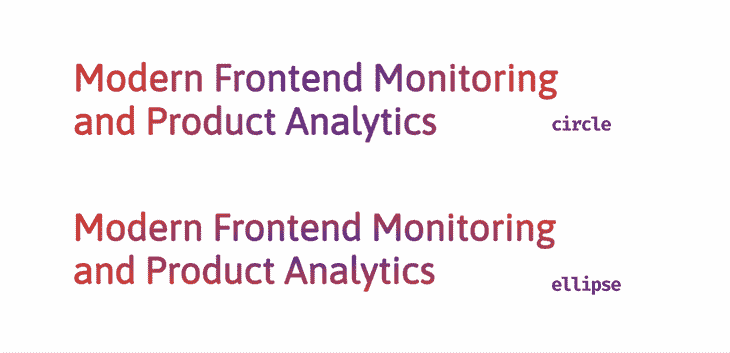

Radial text gradients using a circle and an ellipse

还可以添加四个参数来更改渐变的位置:

1.  `closest-side`
2.  `closest-corner`
3.  `farthest-side`
4.  `farthest-corner`

请继续关注，我们将在后面的部分中看到这些如何影响我们的标题文本。

### 3.`conic-gradient()`

这个渐变也有一个原点，但是现在颜色过渡围绕这个点旋转。为了真正了解标题文本中发生了什么，让我们添加第三种颜色。

```
background-image: conic-gradient(#553c9a, #ee4b2b, #00c2cb);

```

结果是:


A conic gradient example

我们可以通过将第一种颜色添加到函数的末尾来平滑苛刻的起点——在上图中字母 N 处，浅青色急剧过渡到紫色。

```
conic-gradient(#553c9a, #ee4b2b, #00c2cb, #553c9a);

```


您还可以通过在每种颜色后添加百分比值来控制标题文本中颜色过渡的开始位置。

```
conic-gradient(#553c9a 30%, #ee4b2b 40%, #ee4b2b 70%, #00c2cb 80%, #553c9a);

```

结果是:


这可以用来创建一个渐变模式，同时不是一个梯度！这是因为我们会得到周围的纯色。

```
conic-gradient(
    #553c9a 0%, #553c9a 33%, #ee4b2b 33%, #ee4b2b 66%, #00c2cb 66%, #00c2cb 99%
  );

```


让我们解释一下发生了什么。第一种颜色从起点`0``%`开始移动，并在标题文本区域的`33%`上旋转。通常，这是它应该开始过渡到下一种颜色的时候，但是那种颜色已经被设置为从`33%`开始，所以它在那一点上立即改变。对于所有颜色停止，这一过程都将继续。

### 奖励:重复渐变

我知道我们说过有三种方法可以使用渐变，但是我还有最后一招！

顾名思义，文本颜色渐变在整个页眉中重复出现。添加特定的色标，你会在页眉上得到有趣的渐变图案。

你可以有`repeating-linear-gradient()`、`repeating-radial-gradient()`和`repeating-conic-gradient()`。

```
repeating-linear-gradient(to right, #553c9a, #ee4b2b 10%, #553c9a 20%);

repeating-radial-gradient(circle closest-corner at 100px 100px, #553c9a, #ee4b2b 10%, #553c9a 20%);

repeating-conic-gradient(#553c9a 0%, #553c9a 10%, #ee4b2b 10%, #ee4b2b 20%, 
#00c2cb 20%, #00c2cb 30%);

```

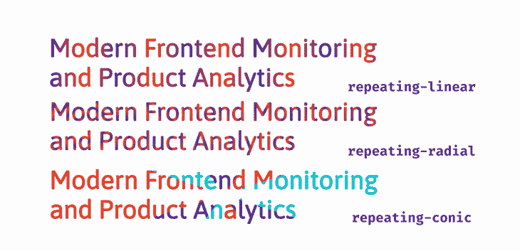

重要的是要注意，看了上面的例子后，除非你的计划是给你的访问者一个糟糕的视觉眩晕，否则你仍然需要在使用这些渐变时遵循一些最佳实践。

#### 使用相同颜色的阴影

从上面的例子中，为了在我们的头中得到`repeating-radial`模式，我们使用了以下语法:

```
repeating-radial-gradient(circle closest-corner at 100px 100px, #553c9a, #ee4b2b 10%, #553c9a 20%);

```

现在把红色换成浅紫色:

```
repeating-radial-gradient(circle closest-corner at 100px 100px, #553c9a, #b393d3 10%, #553c9a 20%);

```

其结果是，标题看起来更舒服:

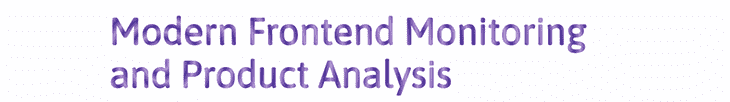

您也可以使用同一系列的颜色，而不是同一颜色的淡色。例如，黄色和橙色这样的暖色搭配起来很好，蓝色和绿色这样的冷色也一样。

#### 使用正确的参数

还记得可以和`radial-gradient`一起使用的那四个参数吗？我们已经从上面的片段中看到了一个，但是让我们仔细看看。

```
repeating-radial-gradient(<ending-shape> <size> <position> ,<color1>, <color2>, <color3>);

```

渐变的结束形状可以是`circle`或`ellipse`。默认情况下，它是一个位置居中的`ellipse`。

可以使用以下四个参数中的任何一个来定义形状的大小:

1.  `closest-side` —渐变的结束形状与元素最靠近其中心的一侧相交
2.  `closest-corner` —渐变的结束形状与元素最近的角相遇
3.  `farthest-side` —渐变的结束形状与离元素中心最远的一侧相交
4.  `farthest-corner` —渐变的结束形状与距离其中心最远的元素的角相遇

接下来是从任何`corner`或`side`开始的原点位置。它可以是百分比或长度值。
在这之后，颜色停止了；我们至少应该有两种颜色，但是，正如已经确定的，将第一种颜色作为第三种颜色有助于创建更平滑的过渡。

说够了；你自己看看。为了清楚起见，我们用紫色和红色，这样你可以看到渐变发生了什么:

对于使用`closest-`值的`repeating-radial-gradient`:

参见 [CodePen](https://codepen.io) 上 Oscar-Jite([@ Oscar-Jite](https://codepen.io/oscar-jite))
的笔[重复直线最近边](https://codepen.io/oscar-jite/pen/xxPMNOd)。

现在使用`farthest-`值:

参见 [CodePen](https://codepen.io) 上 Oscar-Jite([@ Oscar-Jite](https://codepen.io/oscar-jite))
的笔[重复直线最远](https://codepen.io/oscar-jite/pen/MWOxpJz)。

前两个标题之间没有太大的区别，因为梯度是“辐射”或向外延伸。这个结果是我们使用`linear-gradient`很容易得到的。最好的选择是指定一个形状并定义颜色过渡开始的时间；请参见演示中的第三个标题。

因此，我们已经看到，将`repeating-radial-gradient`属性与`closest-side`或`closest-corner`一起使用会在标题中产生更好的模式，但是如果使用了错误的颜色，就会降低可读性。使用`farthest-corner`或`farthest-side`作为页眉可以产生更清晰的文本，即使是对比色。选择权在你。

## 在 CSS 中的文本后面添加背景图像

这很简单。不像渐变那样绘制背景图像，而是使用`url()`函数在标题文本的背景上放置一个预先存在的图像。

首先，您将选择一个图像。这是我们在这个演示中使用的一个:

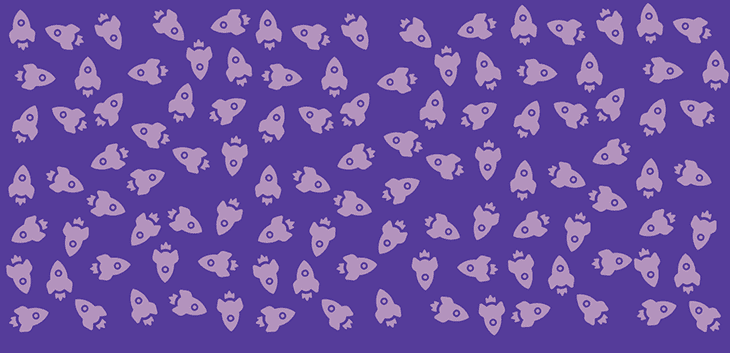

现在，对于 CSS，使用`background-image`属性和`url()`将其添加到您的头部。您可以调整`background-size`和`background-repeat`属性。

```
header h1 {
  font-size: 70px;
  font-weight: 600;
  background-image: url(/rockets.png);
  background-size: 250px;
  background-repeat: repeat;
  color: transparent;
  -webkit-background-clip: text;
  background-clip: text;
}

```

结果是:


很简单！

## 向 CSS 中的文本添加阴影

属性用于在文本周围添加阴影。让我们看看它是如何在 CSS 中声明的:

```
text-shadow: 0px 4px 10px rgba(179, 147, 211, 0.8)

```

它包含四个值:

1.  `x-offset`，阴影的水平位置
2.  `y-offset`，阴影的垂直位置
3.  模糊半径，定义阴影的明暗程度
4.  颜色

这个属性可以像`box-shadow`属性一样[样式。然而，最好记住，对于`box-shadow`，你关心的是整个盒子或容器，但是对于`text-shadow`，你必须选择每个字母上最好看的。](https://blog.logrocket.com/three-ways-style-css-box-shadow-effects/)

添加阴影的最好方法之一是分层。让我们开始给我们的标题一个简单的分层阴影效果。

```
  text-shadow: 2px 2px 4px rgba(179, 147, 211, 0.1),
               3px 4px 4px rgba(179, 147, 211, 0.15),
               4px 6px 4px rgba(179, 147, 211, 0.2),
               5px 8px 4px rgab(179, 147, 211, 0.25);

```

这将是输出:


仍然使用分层阴影，我们可以使标题文本发光。从添加一个暗`background-color`开始。将`text-shadow`上的偏移值设置为`0`，设置一个模糊半径值；这样，光晕将在文本中的每个字母周围均匀分布。最后给`text-shadow`加上亮色和几层，就这样了！你有一个发光的头。

```
body {
  background-color: #301934;
}

header h1 {
  font-size: 70px;
  font-weight: 600;
  color: #fdfdfe;
  text-shadow: 0px 0px 5px #b393d3, 0px 0px 10px #b393d3, 0px 0px 10px #b393d3,
    0px 0px 20px #b393d3;
}

```

输出:


### 三维标题文本

现在来看一些 3D 文本。对于这种效果，粗体/block `font-family`是更好的，比如 Google Fonts 的 Roboto。让我们看看我们的目标是什么:

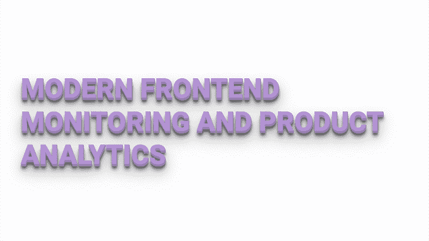

有两组分层阴影一起工作来产生这种效果。

首先，有一组紧密包装的纯色`text-shadow`层，很少模糊，100%不透明，这有助于创建文本的边缘和侧面。

第二，添加偏移和模糊半径越来越宽的阴影，以及`rgba()`颜色值来创建阴影效果:

```
text-shadow: 1px 1px 1px #957dad,
             1px 2px 1px #957dad,
             1px 3px 1px #957dad,
             1px 4px 1px #957dad,
             1px 5px 1px #957dad,
             1px 6px 1px #957dad,
             1px 10px 5px rgba(16, 16, 16, 0.5),
             1px 15px 10px rgba(16, 16, 16, 0.4),
             1px 20px 30px rgba(16, 16, 16, 0.3),
             1px 25px 50px rgba(16, 16, 16, 0.2);

```

将文本转换为大写字母，这样会更突出。下面是标题文本的完整 CSS 语法:

```
@import url('https://fonts.googleapis.com/css2?family=Roboto&display=swap');

header h1 {
  font-size: 70px;
  font-weight: 600;
  font-family: 'Roboto', sans-serif;
  color: #b393d3;
  text-transform: uppercase;
  text-shadow: 1px 1px 0px #957dad,
               1px 2px 0px #957dad,
               1px 3px 0px #957dad,
               1px 4px 0px #957dad,
               1px 5px 0px #957dad,
               1px 6px 0px #957dad,
               1px 10px 5px rgba(16, 16, 16, 0.5),
               1px 15px 10px rgba(16, 16, 16, 0.4),
               1px 20px 30px rgba(16, 16, 16, 0.3),
               1px 25px 50px rgba(16, 16, 16, 0.2);
}

```

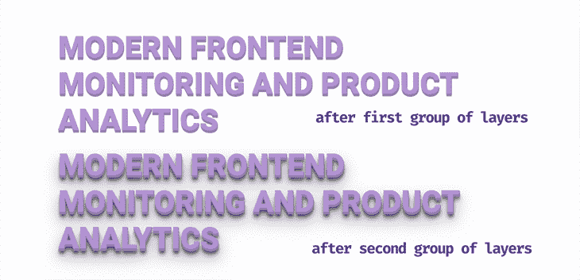

### 在 CSS 中添加多色`text-shadow`图层

让我们玩得更开心一些，做一些新奇的事情:在标题文本上添加多色的`text-shadow`层。奇特的阴影需要奇特的`font-family`，没有什么比草书字体更奇特的了，所以我们选择了 Niconne。

以上面的例子为例，去掉第二组阴影，同时保留纯色。现在我们来发挥创意——让我们混合和搭配颜色。

```
@import url('https://fonts.googleapis.com/css2?family=Niconne&display=swap');

header h1 {
  font-size: 90px;
  font-weight: 600;
  font-family: 'Niconne', cursive;
  color: #e0d6e9;
  text-shadow: 2px 2px 0px  #957dad,
               4px 4px 0px #ee4b2b,
               6px 6px 0px #00c2cb,
               8px 8px 0px #ff7f50,
               10px 10px 0px #553c9a;
}

```

结果是:

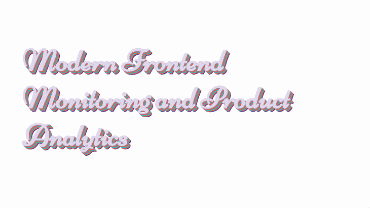

确保`text-shadow`偏移量是均匀分布的，这样你就不会得到不平衡的文本。选择和设计合适的`font-family`会让一切变得不同。调整`font-size`或`font-weight`，尝试不同的字体变化和颜色，找到最适合你的。

## HTML 和 CSS 的打字机效果

这是一种动画效果，使每个字母一个接一个地出现在页面上，就像正在被键入一样。

为了有效地做到这一点，您需要一个短标题文本(最多一行)和一个等宽字体类型，如 Courier、Inconsolata、Anonymous Pro 或来自 Google Fonts 的 Source Code Pro。所有的字母和字符都是等宽的，或者具有相同的宽度。

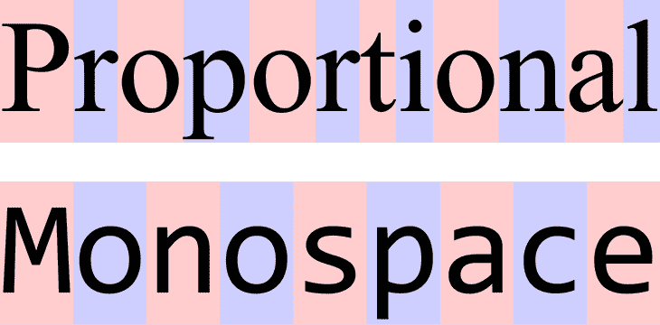

Proportional font vs Monospace font. Source: [Wikipedia](https://en.wikipedia.org/wiki/Monospaced_font)

首先，用 HTML 设置标题:

```
  <body>
    <header>
        <h1>This is a Header</h1>
    </header>
  </body>

```

现在，用 CSS 样式。我们将用`border-right`属性在标题文本的末尾添加一个闪烁的光标:

```
header h1 {
  font-size: 70px;
  font-weight: 500;
  color: #553c9a;
  border-right: 4px solid #000; /*This will be the blinking cursor*/
}

```

这是此时的输出:

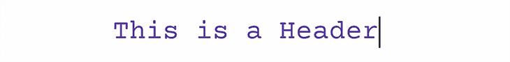

### 添加闪烁的光标

现在，为标题文本和光标定义两个`animation`属性。我们将闪烁动画命名为`cursor`。

```
animation: cursor 1s infinite step-end;

```

使用`@keyframes`定义动画。你想让它眨眼；这意味着它从可见到隐藏。要做到这一点，使用`border-color`属性并定义特定的点来决定何时隐藏、透明和可见。

```
@keyframes cursor{
  0%, 100%{border-color: transparent;}
  50%{border-color: #000;}
}

```

这里发生了很多事情，让我们来分析一下。闪烁`animation`将持续`1s`。开始时，`border-color`是透明的，如`@keyframes`所定义。在中间点，即`1s`的`50%`，它变成黑色，然后在`100%`恢复透明。这个`animation`在一个`infinite`循环中继续。

默认情况下，光标会淡入淡出，但这不是闪烁光标的行为方式，因此`animation`计时将被设置为`step-end`。这意味着`animation`将跳到`@keyframes`功能中定义的每个停止点。

### 用 CSS 添加打字机动画

现在让我们为标题添加`animation`属性。你希望每个字母一次出现一个，然后它会被删除，然后重复。为此，使用单位为`ch`的`width`属性—这是标题文本中的字符数。

我们仍然在使用`step`函数，但是这一次将设置停止点的数量，并且它将等于字符的数量。

```
animation: cursor 1s infinite step-end, typing 15s infinite steps(16);
white-space: nowrap;
overflow: hidden;

```

属性`white-space`将阻止单词和字母堆叠在一起，而`overflow: hidden`将隐藏其他字母，直到它们被“键入”到页面上。

现在对于`@keyframes`，我们将定义整个动画期间的每个停止。

```
@keyframes typing{
  0%{ width: 0ch} /*Text is hidden*/
  30%{ width: 16ch;} /*The enitre header will be typed out 1 character at a time*/
  80%{ width: 16ch;} /*Text stays visible*/
  90%{ width: 0ch;} /*Text is deleted*/
  100%{ width: 0ch;} /*Text stays hidden*/
}

```

结果是:

请看 [CodePen 上](https://codepen.io)[@ Oscar-Jite](https://codepen.io/oscar-jite)
的笔[打字机效果](https://codepen.io/oscar-jite/pen/WNXdwoQ)。

多文本输入动画

### 我们上面使用的方法的替代方法是改变标题中的一些单词并用新单词替换它们。我们可以使用一个无序列表`ul`来实现。将要输入的单词将进入列表。

现在，创建 HTML 语法并定义标题的哪一部分是`fixed`哪一部分是`typed`:

给`.header`一个`inline-flex`的`display`，这样固定的文本与列表对齐。接下来，按照你的喜好来设计它们。

```
<body>
      <div class="header">
        <div class="fixed">This is a</div>
        <ul class="typed">
          <li><span>Caption</span></li>
          <li><span>Title</span></li>
          <li><span>Header</span></li>
        </ul>
      </div>
</body>

```

现在创建一个 [`:before`伪元素](https://blog.logrocket.com/how-to-use-css-before-after-create-custom-animations-transitions/)的单词包装在`span`标签中。

```
.header{
  display: inline-flex;
}
.header .fixed {
  font-size: 70px;
  font-weight: 500;
  color: #b393d3;
}
.header .typed{
  margin-left: 20px;
  line-height: 90px;
  height: 90px;
}
.header .typed li{
  color: #553c9a;
  font-size: 70px;
  font-weight: 600;
  list-style: none;
  position: relative;
  top: 0;
}

```

这是此时的输出:

```
.header .typed li span{
  position: relative;
}
.header .typed li span::before{
  content: '';
  position: absolute;
  height: 100%;
  width: 100%;
  left: 0;
  border-left: 2px solid #553c9a;/*Blinking cursor*/
}

```

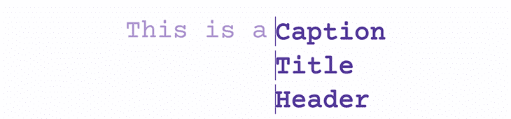

现在来看一下`animation`。我们从光标开始。它将与前面的例子相同，并被添加到伪`span`中。要获得打字动画，首先通过在与网页背景颜色相同的伪`span`上添加一个`background`来隐藏页面上将要输入的单词。

现在`@keyframes`:

```
.header .typed li span::before{
  content: '';
  position: absolute;
  height: 100%;
  width: 100%;
  left: 0;
  border-left: 2px solid #553c9a;
  background: #fdfdfe;
  animation: cursor 1s infinite step-end, typing 1.5s steps(8) infinite;
}

```

这样，当光标的水平位置从`left`(向右)移动时，标题中的字母将显示出来，一次一个字符。

```
@keyframes cursor{
  0%, 100%{border-color: transparent;}
  50%{border-color: #553c9a;}
}
@keyframes typing{
  100%{ left: 8ch;} /*Use the number of characters in the longest word*/
}

```

最后，我们希望文本在每个输入周期后都发生变化，所以我们需要为`typed`列表添加另一个`animation`。

接下来，`@keyframes`。我们将`slide`列表，这样在每一步之后都会出现一个新单词:

```
animation: slide 4.5s steps(3) infinite;

```

好了，你已经为你的标题创建了多文本输入效果。

```
@keyframes slide{
  100%{
    top: -270px;/*Height of the words times 3*/
  }
}
>
```

在 [CodePen](https://codepen.io) 上看到 Oscar-Jite([@ Oscar-Jite](https://codepen.io/oscar-jite))
的笔 [多文本打字](https://codepen.io/oscar-jite/pen/XWzGPJo)。

See the Pen [Multiple Text-typing](https://codepen.io/oscar-jite/pen/XWzGPJo) by Oscar-Jite ([@oscar-jite](https://codepen.io/oscar-jite))
on [CodePen](https://codepen.io).

在为这个动画选择合适的时长时，你真的要小心。您不希望文本在键入过程中发生变化。所有三个动画，`cursor`、`typing`和`slide`，必须无缝地协同工作。

带有 CSS 的渐变文本动画

## 再一次，我们用`animation`将文本颜色渐变提升到另一个层次。首先，我们将创建一个无限动画`linear-gradient()`。

创建一个至少有三种渐变颜色值的标题。我们将在演示中使用五个:

现在，你会看到这个:

```
background-image: linear-gradient(to right ,#553c9a, #ee4b2b, #00c2cb, #ff7f50, #553c9a);

```

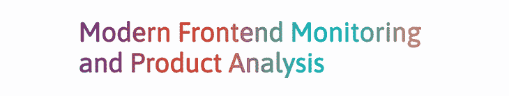

目标是在动画开始时，在标题文本中至少有两种颜色可见。所以你必须调整`background-size`和`background-position`。

摆弄这些值，直到你得到你喜欢的开始颜色。

```
background-size: 200%;
background-position: -200%; 

```

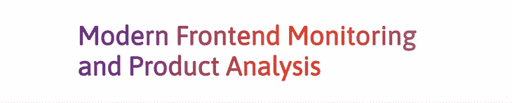

接下来，添加`animation`属性，然后添加`@keyframes`，目标是`background-position`。

基本上，我们将背景直接移动到其原始位置的对面，然后再移回来。这是结果:

```
animation: animated-gradient 2s infinite alternate-reverse;

@keyframes animated-gradient{
  to{
    background-position: 200%;
  }
}

```

参见 [CodePen](https://codepen.io) 上的笔 [渐变文字动画](https://codepen.io/oscar-jite/pen/dyZJmxp)by Oscar-Jite([@ Oscar-Jite](https://codepen.io/oscar-jite))
。

ttps://codepen . io/Oscar-jite/embed/dyZJmxp

让我们尝试一些不同的东西:在`:hover`上触发渐变动画。首先用`transition`属性替换`animation`。

然后添加`:hover`伪元素:

```
transition: all ease-in-out 2s;

```

将鼠标悬停在下面的文本上查看。

```
header h1:hover{
  background-position: 200%;
}

```

参见 Oscar-Jite([@ Oscar-Jite](https://codepen.io/oscar-jite))[code Pen](https://codepen.io)上悬停上的 Pen [渐变动画。](https://codepen.io/oscar-jite/pen/gOXoKdY)

跨浏览器兼容性

对于颜色渐变

## 所有现代浏览器都支持线性和径向渐变。带有`webkit`前缀的旧版本浏览器支持它们。只有 Chrome 和 Safari 支持桌面版的`conic-gradient`。你可以[在 CanIUse 上查看每个浏览器](https://caniuse.com/?search=CSS%20gradients)的渐变效果。

### 对于`background-image`

除 Internet Explorer 版和 Firefox 2-3.5 版之外，所有浏览器都支持该属性。
火狐 3.6 需要`moz`前缀。Opera 10.1 需要`o`前缀。

### 我们在演示中使用了`background-clip`。除了 Internet Explorer、Firefox 2-48 和 Opera 10-21 之外，所有浏览器都支持该属性。几乎所有其他浏览器都需要`webkit`扩展。一些浏览器不需要供应商前缀，包括:

微软 Edge 15-18

48 之后的每个火狐版本

*   Safari 从 14 年到现在的所有版本
*   微软 Edge 12-14 需要`ms`扩展。
*   对于`text-shadow`

所有现代浏览器都支持`text-shadow` prop。在 Safari 3.1 和 3.2 上有部分支持；它们不支持多重阴影。它不需要供应商前缀就能工作。

### 为了打字机的效果

这个有点复杂。我们正在处理`animation`属性，它在所有现代浏览器上都受支持。较老的浏览器，Chrome 4-42、Safari 4-8 和 Opera 15-29，需要`webkit`扩展。火狐 5-15 版本需要`moz`扩展。

### 所有新旧浏览器都支持`:before`伪元素，除了你猜对了，Internet Explorer 6-7。此外，Internet Explorer 8 不支持双列伪类。

然而，我们在演示中使用了`step`计时功能，大多数旧版本的浏览器都不支持该功能。关于此效果的全面支持详情，请参见 CanIUse。

结论

你有 500 毫秒的时间来留下印象，我们刚刚向你展示了五种方法。我们已经看到了各种颜色渐变的标题，以图像为背景的文本，你已经看到了标题发光，打字机效果，最后是渐变文本动画。

## 你认为你能做得比给出的例子更好吗？去吧！制作一些独特的标题文本。

你的前端是否占用了用户的 CPU？

随着 web 前端变得越来越复杂，资源贪婪的特性对浏览器的要求越来越高。如果您对监控和跟踪生产环境中所有用户的客户端 CPU 使用、内存使用等感兴趣，

## .

LogRocket 就像是网络和移动应用的 DVR，记录你的网络应用或网站上发生的一切。您可以汇总和报告关键的前端性能指标，重放用户会话和应用程序状态，记录网络请求，并自动显示所有错误，而不是猜测问题发生的原因。

[try LogRocket](https://lp.logrocket.com/blg/css-signup)

现代化您调试 web 和移动应用的方式— [开始免费监控](https://lp.logrocket.com/blg/css-signup)。

[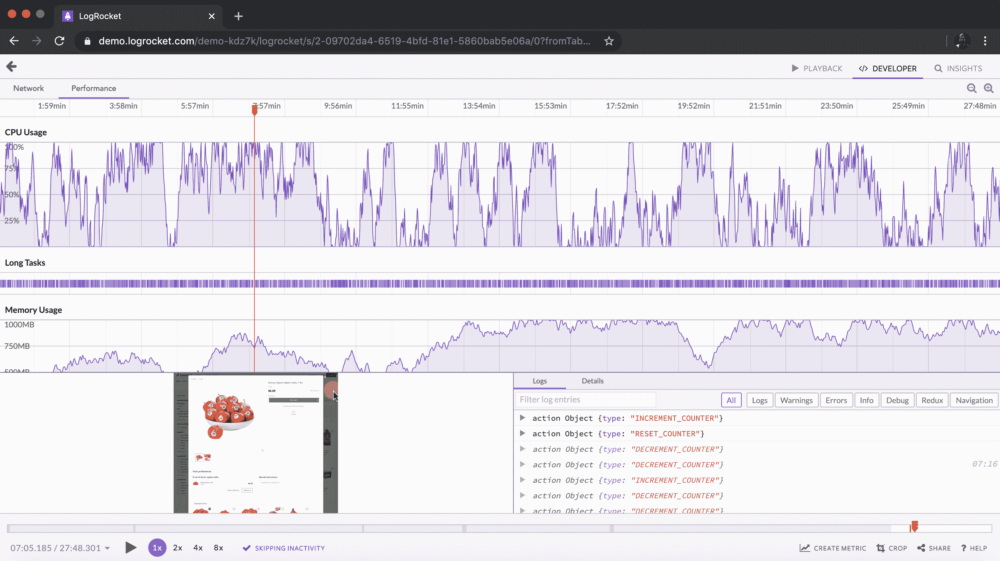](https://lp.logrocket.com/blg/css-signup)[https://logrocket.com/signup/](https://lp.logrocket.com/blg/css-signup)

[LogRocket](https://lp.logrocket.com/blg/css-signup) is like a DVR for web and mobile apps, recording everything that happens in your web app or site. Instead of guessing why problems happen, you can aggregate and report on key frontend performance metrics, replay user sessions along with application state, log network requests, and automatically surface all errors.

Modernize how you debug web and mobile apps — [Start monitoring for free](https://lp.logrocket.com/blg/css-signup).