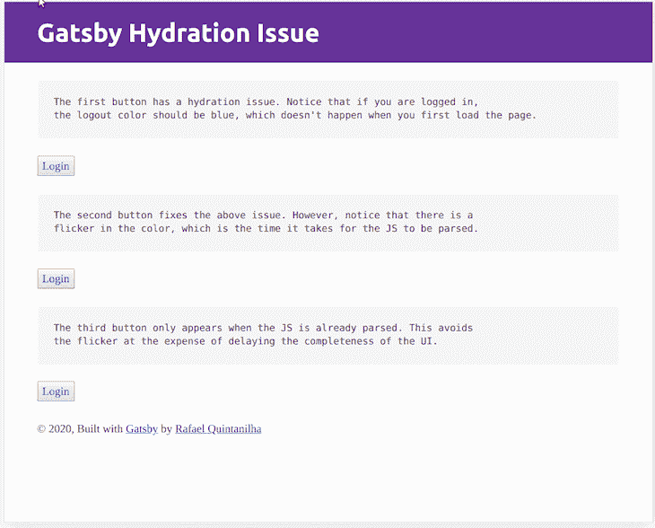
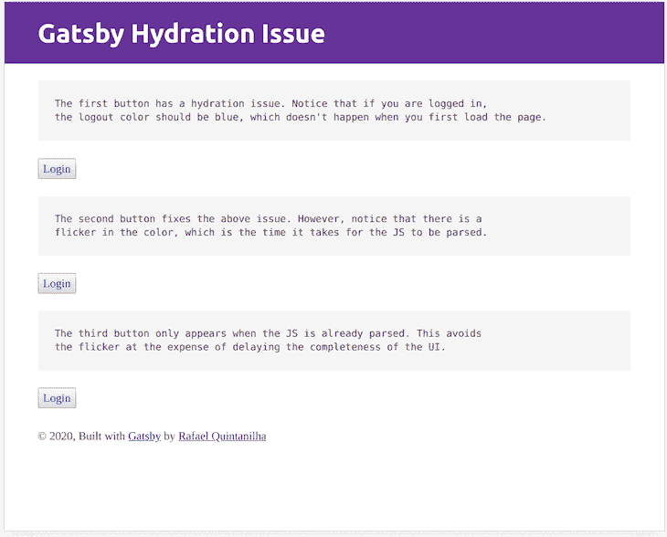

# 修复盖茨比的补液问题

> 原文：<https://blog.logrocket.com/fixing-gatsbys-rehydration-issue/>

如果你最近一直在开发 Gatsby 应用程序，很可能在某个时候你已经被它咬到了。

考虑以下场景:您的应用程序在客户端(用户的浏览器)存储一些信息，可能存储在本地存储区。

目标很简单——您希望基于个人数据(例如，主题偏好、登录详细信息等)快速进行 UI 更改。

您正确地设置了一切，并且它在本地工作，但是一旦您完成部署，事情看起来并不像您所期望的那样。

发生了什么事？

这就是我们所说的**补液问题**。

换句话说，React 和 Gatsby 在将来自服务器的数据与您想要在客户端进行的更改进行匹配时遇到了问题。

发生这种情况是因为 [React 不期望](https://reactjs.org/docs/react-dom.html#hydrate)在服务器中静态生成的内容和客户端呈现的内容之间有任何不匹配。

在我们深入了解发生了什么之前，让我们先来看看盖茨比是如何工作的。

## 服务器端渲染

Gatsby 有一套非常棒的服务器端渲染(SSR)特性。

这意味着它能够在服务器中呈现复杂的页面，并将完整的输出(编译后的文件)发送到客户端(您的浏览器)。

这与常规 React 应用程序(如 Create React App 创建的应用程序)形成对比，后者完全在客户端生成，即您在页面上看到的所有内容都是在下载、解析和评估 JavaScript 后动态创建的。

使用 SSR，您已经发送了呈现的内容。

最终结果是你的页面加载速度非常快。

很酷吧。

在由 Gatsby 支持的应用程序中的典型客户机-服务器交换中，首先检索页面，然后评估 JavaScript。

它允许更快的页面加载， [TTI 值](https://developers.google.com/web/tools/lighthouse/audits/time-to-interactive)，更快的[第一次有意义的绘制](https://developers.google.com/web/tools/lighthouse/audits/first-meaningful-paint)，以及其他几个性能指标。当您的 JavaScript 准备就绪时，用户屏幕上已经发生了很多事情。神奇！

然而，正如您可能已经猜到的，这有一个警告—如果您的页面是服务器端呈现的，但是您需要仅在客户端可用的信息来完成 UI，那么您就有一个空白。

假设您需要为访问者显示一个登录按钮，为用户显示一个注销按钮。

如果用户登录的信息(例如，存储在本地存储中的令牌)只存在于客户端，那么服务器端呈现的页面如何在 JavaScript 加载之前知道要显示哪个按钮呢？

事实上，如果用户已经登录，您将会遇到一个烦人的事件——页面将首先显示登录按钮(因为服务器中没有可用的令牌),然后它将返回到注销按钮(一旦 JavaScript 代码被评估并且令牌从本地存储中被检索)。

* * *

### 更多来自 LogRocket 的精彩文章:

* * *

这很烦人，但不是世界末日。不过，情况变得更糟了。

假设这两个按钮在同一个 DOM 树中，并且基于存储在本地存储器中的信息有条件地呈现。

假设它们有不同的颜色。

有可能他们的风格会混在一起，你会得到与预期不同的颜色！

这就是所谓的再水合问题的最终结果，React 将很难用客户端生成的动态内容再水合现有的服务器端呈现的 DOM。

这个问题已经困扰了盖茨比的用户一段时间了。幸运的是，有一个简单的方法来克服这个问题，我们将探索它。

## 基本原理

正如我们所看到的，出现这个问题是因为服务器呈现的内容和客户端生成的内容不匹配。

我们可以通过推迟特定元素的呈现来缓解这个问题，直到我们确定客户端已经完全加载。

底线是:如果您只能在客户端执行后保证完整性，为什么还要请求服务器进行渲染呢？

当然，你期待的是更小的 UI，而不是一个完整的页面，这将与 SSR 的初衷相矛盾。

事实上，如果您发现自己的页面有很大一部分都面临这种困境，那么您很可能会想让它成为一个[客户端专用页面](https://www.gatsbyjs.org/docs/client-only-routes-and-user-authentication/)，而不是直接从服务器端提供。

### 遵从客户的意见

既然我们知道在客户端加载之前不需要呈现元素，那么我们如何实现它呢？幸运的是，使用 React 钩子有一个非常优雅的方法。

```
import React, { useState, useEffect } from 'react';

const Component = () => {
  const [isClient, setClient] = useState(false);

  useEffect(() => {
    setClient(true);
  }, []);

  return <div>I am in the {isClient ? "client" : "server"}</div>;
}
```

上面的钩子利用`useEffect`来正确地检测用户是在服务器还是在客户端。

逻辑如下——只有在第一次渲染提交到屏幕后，`useEffect`才会运行一个空的依赖数组(你可以在[文档](https://reactjs.org/docs/hooks-reference.html#useeffect)中了解更多)。

如果你在服务器里，根本没有屏幕。因此，效果永远不会运行，`isClient`将始终是`false`。

另一方面，对于客户端中呈现的任何应用程序，在第一次呈现之后，效果将运行，并且`isClient`将变成`true`。

这个简单的代码片段足以让我们检测代码在哪里运行。

然而，它没有解决补液的潜在问题。

考虑以下组件:

```
 /* Component.module.css */

    .red {
      color: red;
    }

    .blue {
      color: blue;
    }

    const Component = () => {
      const [token, setToken] = useLocalStorage('token', "");
      const isLoggedIn = token !== "";

      /* Generate some fake token */
      const onLogin = () => setToken(Math.random().toString(36).substring(2));
      const onLogout = () => setToken("");

      return (
        <div>
          {isLoggedIn 
            ? <button className={css['red']} onClick={onLogout}>Logout</button>
            : <button className={css['blue']} onClick={onLogin}>Login</button>}
        </div>
      );
    }}
```

现在，我们从本地存储中检索一个令牌(您可以检查如何使用钩子方法[在这里](https://usehooks.com/useLocalStorage/))并基于该信息呈现不同的组件。

由于水合作用的问题，当服务器第一次向您发送页面时，如果您已经登录，您将会看到一个蓝色的注销按钮！

祝你调试成功，为什么这个简单的代码不能只在生产中运行。

撇开戏剧性不谈，既然我们发现了问题，我们该如何解决它呢？

嗯，关键是要用组件的`key`道具。

用更简单的话来说，`key`告诉 React 无论何时发生变化，组件都需要重新渲染。

代码的更新版本变为:

```
/* Component.module.css */

    .red {
      color: red;
    }

    .blue {
      color: blue;
    }

    const Component = () => {
      const [token, setToken] = useLocalStorage('token', "");
      const isLoggedIn = token !== "";

      /* Generate some fake token */
      const onLogin = () => setToken(Math.random().toString(36).substring(2));
      const onLogout = () => setToken("");

      return (
        <div>
          {isLoggedIn 
            ? <button className={css['red']} onClick={onLogout}>Logout</button>
            : <button className={css['blue']} onClick={onLogin}>Login</button>}
        </div>
      );
    }}
```

请注意，当组件检测到它现在在客户端上运行时，`key`发生了变化，迫使元素重新呈现并应用正确的样式(改编自[这个由达斯汀·绍在 GitHub](https://github.com/gatsbyjs/gatsby/issues/14601#issuecomment-499922794) 中给出的综合回复)。)

然而，这仅仅解决了问题的一半。

我们的样式不匹配问题已经修复，但是仍然有令人讨厌的闪烁，因为服务器首先渲染，然后客户端进来并进行更改。

不幸的是，如果不设法让服务器预先知道用户是否登录，就没有办法解决这个问题。但是，一个简单的方法是，当您检测到该元素仅在客户端中完全可用时，根本不要呈现它。

```
const Component = () => {
  const [isClient, setClient] = useState(false);
  const key = isClient ? "client" : "server";

  const [token, setToken] = useLocalStorage('token', "");
  const isLoggedIn = token !== "";

  /* Generate some fake token */
  const onLogin = () => setToken(Math.random().toString(36).substring(2));
  const onLogout = () => setToken("");

  useEffect(() => {
    setClient(true);
  }, []);

  if ( !isClient ) return null;
  return (
    <div key={key}>      
      {isLoggedIn         
        ? <button className={css['red']} onClick={onLogout}>Logout</button>        
        : <button className={css['blue']} onClick={onLogin}>Login</button>}
```

```
    </div>
  );
}
```

## 挂钩版本

将上述逻辑添加到每一个遭受再水合的组件可能非常麻烦。

幸运的是，有一种方法可以用一个简单的钩子来简化代码:

```
import { useState, useEffect } from "react";

const useIsClient = () => {
  const [isClient, setClient] = useState(false);
  const key = isClient ? "client" : "server";

  useEffect(() => {
    setClient(true);
  }, []);

  return { isClient, key };
};

export default useIsClient;

```

我们之前组件中的用法将变成:

```
const Component = () => {
  const { isClient, key } = useIsClient();

  const [token, setToken] = useLocalStorage('token', "");
  const isLoggedIn = token !== "";

  /* Generate some fake token */
  const onLogin = () => setToken(Math.random().toString(36).substring(2));
  const onLogout = () => setToken("");

  if ( !isClient ) return null;
  return (
    <div key={key}>
      {isLoggedIn 
        ? <button className={css['red']} onClick={onLogout}>Logout</button>
        : <button className={css['blue']} onClick={onLogin}>Login</button>}
    </div>
  );
}

```

它看起来更干净，并且可以在您的代码库中重用！

### 将问题可视化

在下面的 gif 中可以很容易地观察到再水化问题及其解决方法:



第一个按钮有补液问题。请注意，在我们重新加载页面后(即，当我们要求服务器发送 HTML 时)，它是如何显示错误的颜色的。

第二个按钮解决了这个问题。但是，您会注意到它首先显示蓝色的登录按钮。

最后，最后一个按钮直到 JavaScript 被完全评估后才会显示。

后两种影响在慢速连接中更加明显。考虑 3G 网络中用户的以下模拟:



上面例子的代码可以在 GitHub 的[中找到。](https://github.com/rafaelquintanilha/rehydration-issue)

还有一个[现场版](https://gatsby-rehydration-issue.netlify.com/)如果你想自己查的话。

## 结论

服务器端渲染是一个强大的概念，它真的让你的应用程序变得很快。

盖茨比知道如何最好地利用它来提高绩效。

然而，当客户端和服务器需要对话时，你需要注意。这篇文章的主要观点是:

*   每当你的组件根据它被渲染的内容而改变时，使用`key`属性
*   在您确认应用程序正在客户端运行之前，防止组件呈现，以避免闪烁
*   采用`useIsClient`以便重复使用完成上述两点所需的逻辑