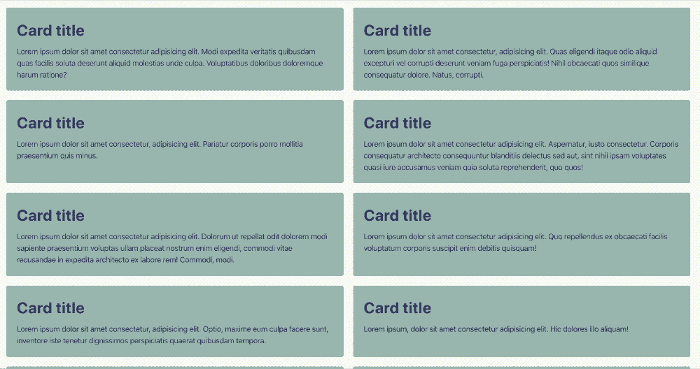
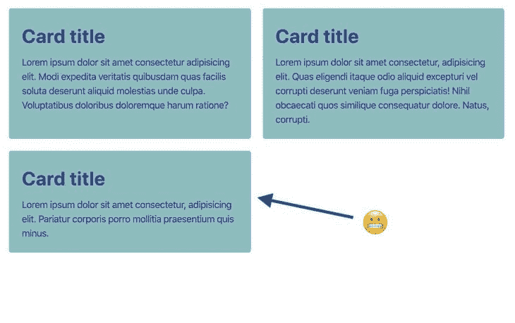
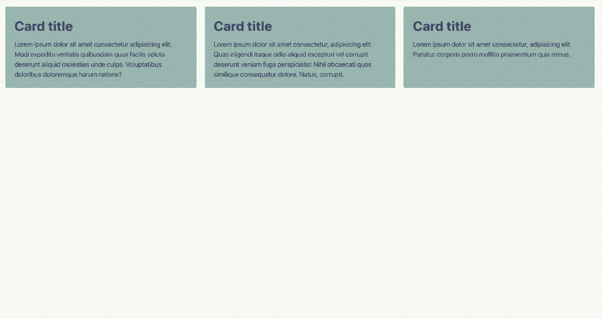
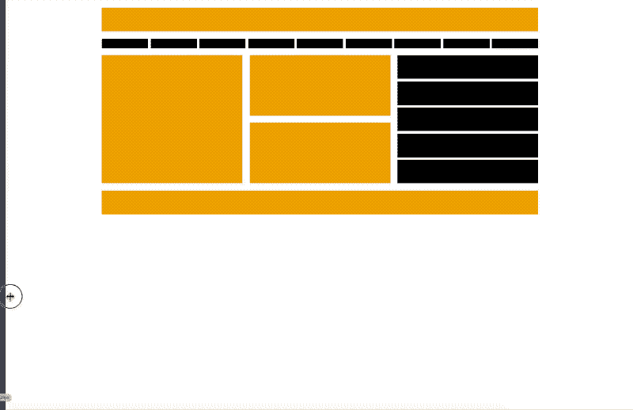
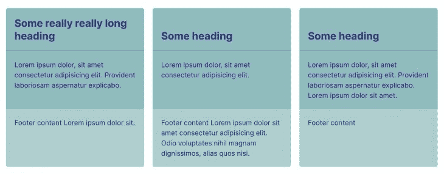
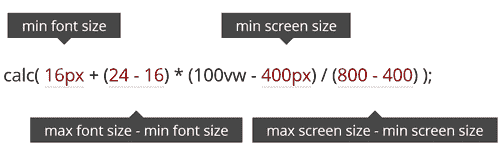

# 没有媒体查询的灵活布局

> 原文：<https://blog.logrocket.com/flexible-layouts-without-media-queries/>

自从 2017 年在浏览器中推出以来，CSS Grid 给了 web 设计师和开发人员一个新的超级大国。有许多文章/教程展示了 CSS Grid 的好处和算法能力，涵盖了从可视化 ASCII 启发的模板区域到使媒体查询有些过时的自动放置的所有内容。然而，媒体的质疑仍然很强烈，这可能会引起一些问题。

## 媒体询问的问题是

现在是 2020 年，我们已经稍微偏离了设计师和开发人员可以在任何给定的屏幕尺寸上控制设计的每个像素的想法。随着设计系统的出现，我们倾向于考虑“组件”而不是“页面”

媒体查询的问题是它们不能很好地与设计系统配合，因为所述系统中的组件通常是在没有特定上下文的情况下定义的。在大多数情况下，组件应该适合任何不同宽度(和高度)的上下文，并且媒体查询[“根据视口的常量进行调整”](https://heydonworks.com/article/the-flexbox-holy-albatross)。

因此，如果我们想要构建一个真正灵活的组件，它应该适合任何容器，并有自己的一套指令，说明它应该在不同的环境中如何表现，而不管外部环境如何，媒体查询是不够的。

在本文中，我将探讨如何使用 CSS 网格和数学函数创建灵活的布局组件，以获得对写入组件的假设指令的更多控制。

## 数学函数

如果我们向下滚动 [CSS 值和单位模块级别 4](https://www.w3.org/TR/css-values-4/#calc-notation) 的规范，我们会看到一个叫做“数学表达式”的部分除了传统的“calc()”之外，我们还发现了数学函数“min()”、“max()”和“clamp()”，这些函数让我们可以进行比简单的 calc()函数更复杂的计算——就在 CSS 中。

### 令人困惑的名字

这看起来很有希望，但是这些新函数的命名一开始有点混乱。我们使用

> [“`max()`对某事物施加最小值……对某事物施加最大值`min()`；很容易不小心把手伸向相反的功能，试图用`min()`加一个最小尺寸。”](https://www.w3.org/TR/css-values-4/#example-3f7f1368)

一旦这个小小的困惑都解决了，让我们来看一些例子。

`min()`和`max()`函数取两个值。分别是最小值和/或最大值，用逗号分隔。考虑下面的`min()`表情:

```
width: min(100%, 200px);
```

这里我们说默认值是 200 像素，但是它从来没有比父容器宽 100%。这在本质上等同于这样说:

```
width: 100%;
max-width: 200px;
```

相当灵活，对吧？这是另一个使用`max()`的表达式:

```
width: max(20vw, 200px);
```

该表达式将宽度设置为 20 个视口单位，但不会低于 200 个像素。

那么数学函数如何帮助我们实现灵活的组件和布局呢？

## 一个基本例子

当我们希望一个项目集合在不引入媒体查询规则的情况下以响应的方式运行时，Grid 的自动放置算法可以帮助我们做到这一点，而无需进行任何复杂的计算。使用`auto-fit`或`auto-fill`以及`minmax()`语句，我们可以很容易地指示浏览器计算出什么时候“中断”列计数是合适的，从而创建一个动态响应的网格:

```
grid-template-columns: repeat(auto-fit, minmax(350px, 1fr));
```

我们声明每张卡片必须最小 350 像素，最大 1 个单位的可用空间。使用`auto-fit`，每个卡片被允许大于 350 个像素，我们告诉浏览器尽可能多的挤进相同宽度、灵活尺寸的卡片，以适合网格容器。

然而，在上面的例子中，我们可以注意到卡片的最小值不考虑视口宽度。如果视口变得比卡片的最小值小，它们会滑出视线，我们会得到水平滚动条的额外奖励。而且我们不想处理水平滚动条！

> 没有描述

为了避免这种行为，我们可以在有问题的断点处添加一个媒体查询，然后忽略最小值。但是这有什么意思呢？相反，让我们利用新获得的数学函数知识。

Min()还是 max()？

## 当我们想要“给某物强加一个最大值”时，这正是我们在这里想要的。

我们告诉浏览器最小值应该是 350 像素，只要这 350 像素不到父容器的 100%。否则，最大值为 100%。

```
grid-template-columns: repeat(auto-fit, minmax(min(100%, 350px), 1fr));
```

没有描述

请注意，现在纸牌在每种屏幕尺寸下都清晰可见。

> `*` *卡片容器只能压缩到其内容达到最大最小尺寸的点。对于一串文本，这通常意味着最长单词的大小。*

这是有希望的。但是我们能做得更多吗？

夹紧的例子

> 如果我们希望对列的分布以及应该断开的点有更多的控制呢？我们希望完全控制，而不是让浏览器在使用上述自动放置技术时做出所有决定。

换句话说，我们希望在更大的屏幕上显示两列，当视窗变得小于我们选择的特定宽度时显示一列——不多也不少。很简单，对吧？媒体查询… yeea..不要！

## 

和前面的例子一样，我们将使用自动放置算法和数学函数，如果我们将`min()`和`max()`结合起来，我们可以开始看到数学在 CSS 中的真正威力。这让我们对网格项目的分布有了更多的控制。

考虑一下这个:

注意我们是如何在`min()`中嵌套`max()`以获得更灵活的值输出的。这里我们告诉浏览器我们的宽度应该是(容器的)最大值 100 %,最小值 50 %,前提是 50%大于 350 像素…我想。

我们也可以反过来写:

除了`min()`和`max()`之外，我们还有`clamp()`，它更容易阅读，因为它的值位于最小值和最大值之间。说明书上写着:

```
min(100%, max(50%, 350px)
```

clamp()函数表示其中心计算，根据其最小和最大计算进行箝位。

这意味着我们可以这样写问题中的计算:

```
max(50%, min(350px, 100%))
```

…在我看来，这确实让破译变得容易多了。

> 我们声明最小值应该是 50%，首选值应该是 350 像素，最大值应该是 100%。更好的语法！

This means that we can write the calculation in question like this instead:

```
clamp(50%, 350px, 100%)
```

如果我们想要在卡片之间有一个间隙，我们必须在我们的计算中通过从最小尺寸中减去所述间隙的尺寸来解决这个问题，正如我们在下面的代码示例中看到的。对于这样的管理，我建议使用[自定义属性](https://blog.logrocket.com/how-to-use-css-variables-like-a-pro/)来尽可能保持整洁:

请注意，如果我们想要进行计算，我们不需要在 clamp()表达式中嵌套 calc()函数。最小()和最大()也是如此。

我们能更进一步吗？是的，我们可以！

一个更数学化的例子

```
clamp(50% - 20px, 200px, 100%)
```

如果我们想让三列或更多列直接“折叠”成一列，而不需要中间步骤，该怎么办？例如，如果我们只有三张卡片，并且不希望出现其中一张卡片被单独放在新的一行的“尴尬情况”,这就很方便了:



## 您可能会怀疑，用 50%代替 33.3333%(父容器大小的三分之一)最终创建三个列会很容易。如果是这样，恐怕你就错了。在某个断点处，只有足够的空间容纳两张卡，因此导致两列布局。这不是我们想要的。

这种布局的数学有点复杂。幸运的是，Heydon Pickering 已经用 Flexbox 解决了这个问题，他称之为“神圣的信天翁”他利用了浏览器处理最小值和最大值的方式。从[海登的文章](https://heydonworks.com/article/the-flexbox-holy-albatross)中他发现:

最小宽度和最大宽度覆盖弹性基础。所以如果`flex-basis`值高得离谱，比如 999rem，宽度就会回落到 100%。如果低得离谱，比如-999 雷姆，它将默认为 33%

这类似于`minmax()`在 CSS 网格中的工作方式。来自 [MDN](https://developer.mozilla.org/en-US/docs/Web/CSS/minmax) 的内容是:

如果最大值 minmax(min,max)被视为最小值

> 最后，这是海登得出的公式:

*`40rem`表示应该堆栈的断点。*

> 让我们试着在网格示例中实现这个公式。应用神圣信天翁技术给了我们这样的东西:

33.3333%表示我们每张卡的大小(为三列留出空间)，假设该值不大于首选值:`(40rem - 100%) * 999`。当网格容器到达`40rem`时，它变成一个单列网格，最大值为 100%。

```
calc(40rem - 100% * 999)
```

*The `40rem`‘s represent the breakpoint at which it should stack.*



```
minmax(
    clamp(
          33.3333% - var(--gap), /* min value */
          (40rem - 100%) * 999, /* preferred value */
          100% /* max value */
        ),
        1fr
    )
```

我们已经创建了一个灵活的类似组件的布局，它应该适合任何容器，有自己的一套指令，说明它在不同的环境下应该如何表现。

这种布局的说明是，“如果卡片容器的宽度低于 40 雷姆，那么卡片应该堆叠起来。”

如果我们希望这条指令由各个卡片的首选宽度(可能是一个基于 ch 的值)决定，而不是查看容器大小断点，那么我们必须对 clamp()表达式中的首选值做一些小的调整。我们通过将卡片的最小宽度乘以首选列数得出如下结果:

每张卡片的宽度决不能比`30ch`窄，如果我们考虑卡片之间的间隙，代码结果如下:

The instruction for this layout reads, “If the card container goes below a width of 40rem, then the cards should stack.”

注意:在上面的代码笔中，我使用了自定义属性来使代码更加清晰。

```
((30ch * 3) - 100%) * 999
```

现在指令是这样的:“如果每张卡片变得比`*30ch*`更窄，父容器就折叠成一列。”

```
((30ch * 3 - var(--gap) * 2) - 100%) * 999
```

组件进入的上下文并不总是严格定义的，所以可以说，通过将指令写入组件本身，您可以在某种程度上确保它适合任何上下文，不管外部边界如何。使用数学函数，我们可以引入多个“断点”,这些断点由各个布局组件通知，如以下代码笔所示:

*Note: In the Codepen above, I’ve used custom properties to make the code a bit more legible.*



请注意，导航项目、中间部分和旁侧元素的堆叠点各不相同。每一个“断点”都是由单个布局组件的假设铭文而不是多个媒体查询(多少有些随意)告知的。

为什么不用 Flexbox 呢？

对于这种布局使用 CSS Grid 而不是 Flexbox 的额外好处是我们从 Subgrid 获得的对齐能力。这样我们可以确保内容(例如，页眉、页脚等。)在卡片彼此相邻时对齐。它看起来是这样的:

Notice that the point at which the nav items, middle section, and the aside elements stack all differ from each other. Each “breakpoint” is informed by the hypothetical inscription of the individual layout component rather than that of multiple — somewhat arbitrary — media queries.

## 

这个例子中的对齐功能目前只在 Firefox 75+中有效。

数学函数的其他用例

布局中的数学函数几乎有无限的可能性。另一个用例可能是带有`clamp()`的响应式字体大小，没有媒体查询。

我记得不久前读过一篇关于流畅排版的文章，展示了一个实现这个结果的简单数学公式。不过，这项技术需要使用媒体查询来阻止文本变得过大或过小。

## 

使用数学函数，我们现在可以完全消除对介质查询规则的需求:

I remember reading [an article on fluid typography](https://www.smashingmagazine.com/2016/05/fluid-typography) a while back showcasing a handy math equation for achieving this very result. The technique, though, requires using media queries to stop the text from becoming too big or too small.

[戴夫·鲁伯特](https://daverupert.com/)和[做了类似的东西](https://codepen.io/davatron5000/pen/mddmRJe)，不需要复杂的计算，使用视口单位作为流体大小。使用`clamp()`,他就可以限制两端的值，确保`font-size`不会变得太大或太小。

这确实非常聪明，但是，当我们诉诸视口单位时，我们没有相同级别的控制。这些对我来说似乎有点武断。

```
font-size: clamp(
  var(--min-font-size) + 1px,
  var(--fluid-size),
  var(--max-font-size) + 1px /* we add 1px so the value becomes pixel-based */
);

```

此外，似乎有一些[警告](https://dev.to/macargnelutti/using-css-viewport-units-for-font-sizes-can-be-tricky-3h31)使用视口单位缩放字体大小。浏览器的缩放不起作用，调整浏览器窗口的大小会影响可读性，并且文本在大屏幕上看起来很大。

浏览器兼容性

```
h1 {
  --minFontSize: 32px;
  --maxFontSize: 200px;
  --scaler: 10vw;
  font-size: clamp(var(--minFontSize), var(--scaler), var(--maxFontSize));
}
```

在编写 Chrome/Edge 的这个时候，Firefox (75+)和 Safari (13.1+)都支持`min()`、`max()`和`clamp()`。至于子网格，不幸的是，这还没有标准化，目前只在 Firefox 中有效。

结论

## 单独基于视口的多边形区域，当您处理独立的布局组件时，媒体查询可能不够灵活。CSS Grid 中的自动放置算法和 CSS math 函数为我们的元素布局提供了额外的灵活性，而无需显式定义外部上下文。我预见了网络布局的美好未来，我期待着看到更多 CSS 中数学函数的用例。

如果您知道其他技术，或者您只是想对本文发表评论，请告诉我。

## 你的前端是否占用了用户的 CPU？

随着 web 前端变得越来越复杂，资源贪婪的特性对浏览器的要求越来越高。如果您对监控和跟踪生产环境中所有用户的客户端 CPU 使用、内存使用等感兴趣，

.

## LogRocket 就像是网络和移动应用的 DVR，记录你的网络应用或网站上发生的一切。您可以汇总和报告关键的前端性能指标，重放用户会话和应用程序状态，记录网络请求，并自动显示所有错误，而不是猜测问题发生的原因。

现代化您调试 web 和移动应用的方式— [开始免费监控](https://lp.logrocket.com/blg/css-signup)。

[try LogRocket](https://lp.logrocket.com/blg/css-signup)

.

[](https://lp.logrocket.com/blg/css-signup)[https://logrocket.com/signup/](https://lp.logrocket.com/blg/css-signup)

[LogRocket](https://lp.logrocket.com/blg/css-signup) is like a DVR for web and mobile apps, recording everything that happens in your web app or site. Instead of guessing why problems happen, you can aggregate and report on key frontend performance metrics, replay user sessions along with application state, log network requests, and automatically surface all errors.

Modernize how you debug web and mobile apps — [Start monitoring for free](https://lp.logrocket.com/blg/css-signup).