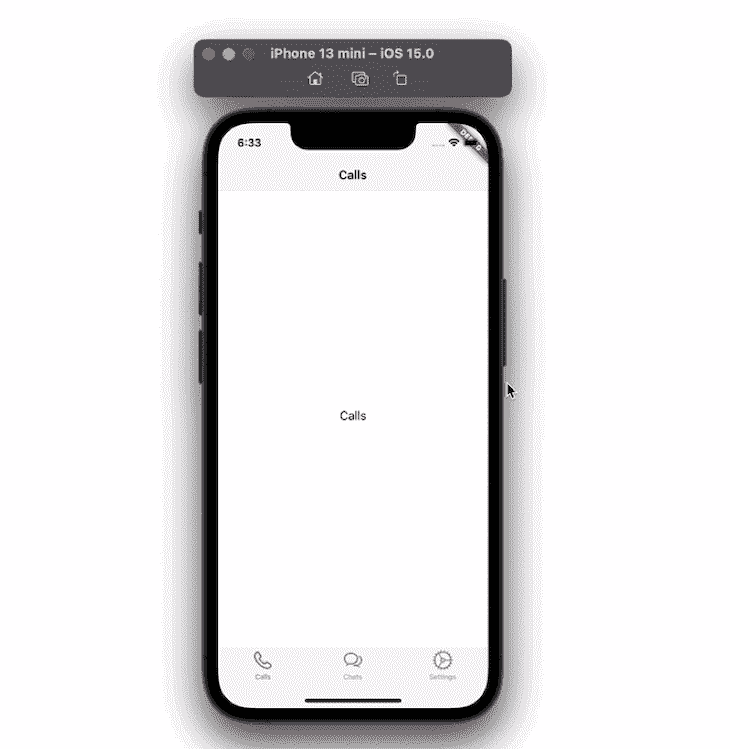
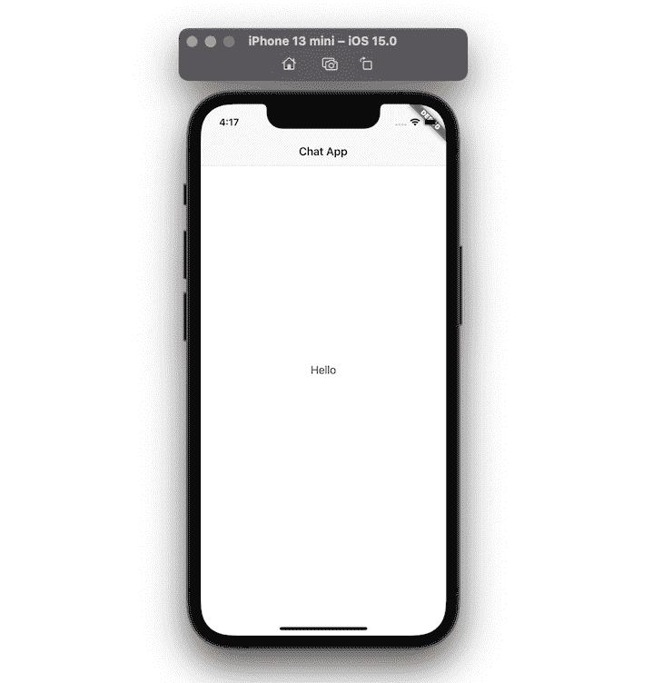
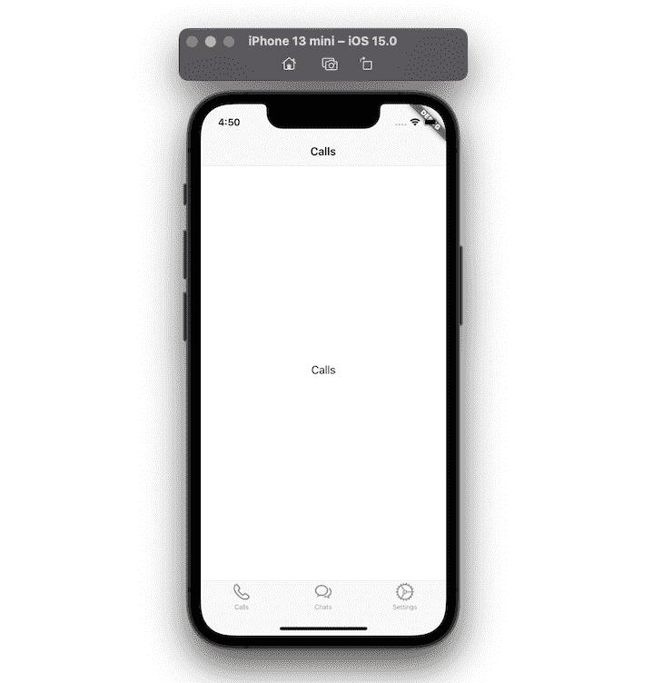
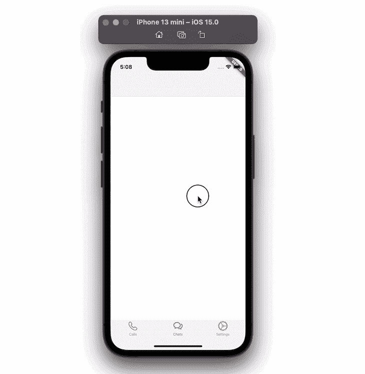
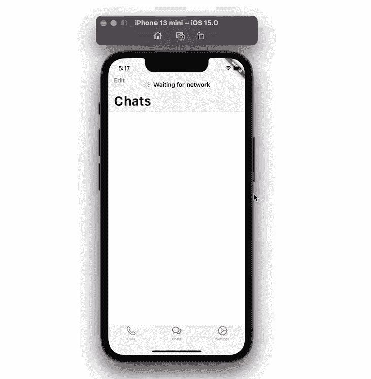
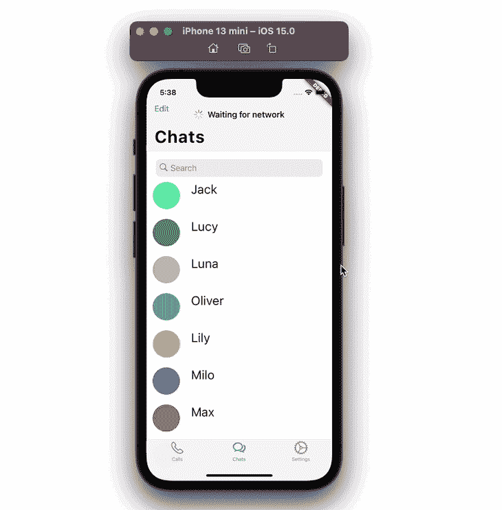
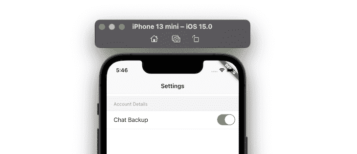
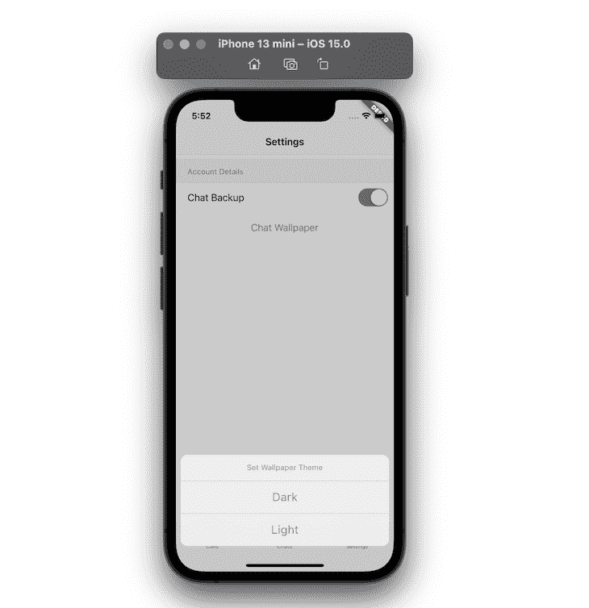
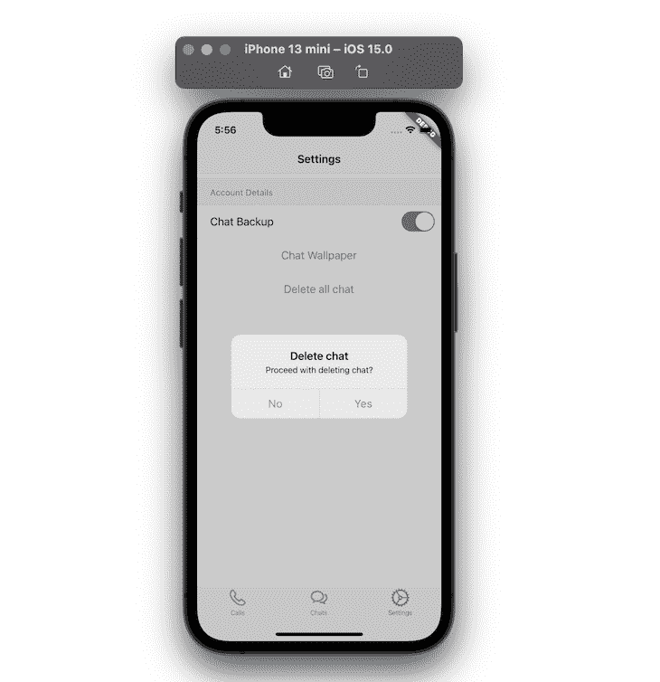
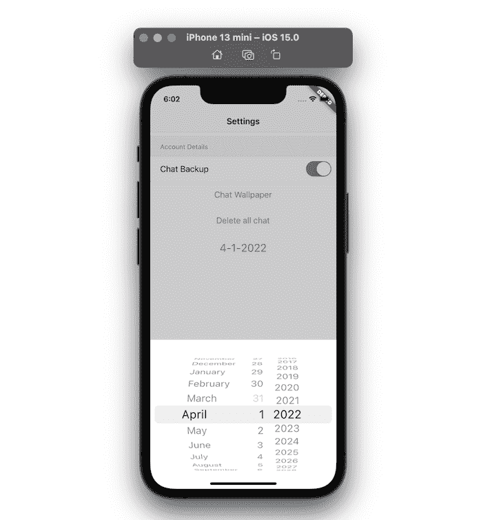

# Flutter Cupertino 教程:如何构建外观和感觉都与生俱来的 iOS 应用程序

> 原文：<https://blog.logrocket.com/flutter-cupertino-tutorial-build-ios-apps-native/>

所有前端应用程序都使用某种设计系统来帮助用户更容易地完成任务。他们可能会使用内部开发的定制设计系统或已建立的设计系统，如 Material Design 或 Cupertino (iOS)。

Material design 由 Google 开发，可用于开发 Android、iOS、web 和桌面应用。

Cupertino 是苹果开发的。它基于苹果的人机界面指南，实现了当前的 iOS 设计语言。

Flutter SDK 附带了[素材](https://docs.flutter.dev/development/ui/widgets/material)和[库比蒂诺](https://docs.flutter.dev/development/ui/widgets/cupertino)小部件库，可以开发一个外观和感觉都适合这两个平台的应用程序。

你仍然可以使用材料部件库来构建一个应用程序。然而，如果你想建立一个看起来像标准 iOS 风格的应用程序，你应该强烈考虑使用 Cupertino 库。

在本教程中，我们将构建一个简单的应用程序，在底部有三个选项卡；**通话、聊天、**和**设置。**

在**调用**选项卡上，我们将添加简单的导航栏； **聊天** 选项卡将显示成员列表，并允许最终用户搜索任何成员；在 **设置** 选项卡上，我们将使用各种 Cupertino 风格的小部件来构建设置

这是最终的应用程序的样子:



在本教程中，我们将涵盖:

## 创建简单页面

让我们首先创建一个简单的页面，在顶部显示页面标题，在中间显示“Hello”消息。要构建这样的页面，您必须删除新创建项目的所有内容，并用以下代码替换它:

```
import 'package:flutter/cupertino.dart';
import 'package:flutter/material.dart';
import 'package:flutter/services.dart';

import 'simple_page.dart';

void main() {
  WidgetsFlutterBinding.ensureInitialized();
  SystemChrome.setPreferredOrientations([
    DeviceOrientation.portraitUp,
    DeviceOrientation.portraitDown,
  ]).then((value) => runApp(MyApp()));
  runApp(const MyApp());
}

class MyApp extends StatelessWidget {
  const MyApp({Key? key}) : super(key: key);

  // This widget is the root of your application.
  @override
  Widget build(BuildContext context) {
    // 1 <-- SEE HERE
    return CupertinoApp(
      // 2 <-- SEE HERE
      theme: CupertinoThemeData(brightness: Brightness.light),
      home: CupertinoSimpleHomePage(),
    );
  }
}

class CupertinoSimpleHomePage extends StatefulWidget {
  const CupertinoSimpleHomePage({Key? key}) : super(key: key);

  @override
  _CupertinoSimpleHomePageState createState() =>
      _CupertinoSimpleHomePageState();
}

class _CupertinoSimpleHomePageState extends State<CupertinoSimpleHomePage> {
  @override
  Widget build(BuildContext context) {
    // 3 <-- SEE HERE
    return const CupertinoPageScaffold(
      // 4 <-- SEE HERE
      navigationBar: CupertinoNavigationBar(
        middle: Text('Chat App'),
      ),
      child: Center(
        child: Text('Hi'),
      ),
    );
  }
}

```

### 代码解释

*   `CupertinoApp`:`CupertinoApp`小部件允许你添加主要用于构建 iOS 风格应用的小部件
*   使用这个小工具，你可以指定你的应用程序的样式
*   `[CupertinoPageScaffold](https://api.flutter.dev/flutter/cupertino/CupertinoPageScaffold-class.html)`:`CupertinoPageScaffold`帮助构建页面的布局，比如添加导航栏
*   这个小部件创建了一个看起来像本地 iOS 风格的导航栏。

### 输出



## 添加选项卡

选项卡用于支持应用程序的主要导航。让我们在底部添加三个选项卡，每个选项卡都有不同的名称和图标。要创建选项卡，我们必须用`CupertinoTabScaffold`替换`CupertinoPageScaffold`。

使用`CupertinoTabScaffold`小部件的优点是它允许您在页面底部添加标签栏，并且额外提供了在多个堆栈中维护页面的能力。

### 密码

```
// 1 <-- SEE HERE
return CupertinoTabScaffold(
  // 2 <-- SEE HERE
  tabBar: CupertinoTabBar(
    currentIndex: 1,
    items: const <BottomNavigationBarItem>[
      // 3 <-- SEE HERE
      BottomNavigationBarItem(
          icon: Icon(CupertinoIcons.phone), label: 'Calls'),
      BottomNavigationBarItem(
          icon: Icon(CupertinoIcons.chat_bubble_2), label: 'Chats'),
      BottomNavigationBarItem(
          icon: Icon(CupertinoIcons.settings), label: 'Settings'),
    ],
  ),
  tabBuilder: (context, index) {
    late final CupertinoTabView returnValue;
    switch (index) {
      case 0:
        // 4 <-- SEE HERE
        returnValue = CupertinoTabView(builder: (context) {
          return const CupertinoPageScaffold(
              navigationBar: CupertinoNavigationBar(
                middle: Text('Calls'),
              ),
              child: Center(child: Text('Calls')));
        });
        break;
      case 1:
        returnValue = CupertinoTabView(
          builder: (context) {
            return CupertinoChatPage();
          },
        );
        break;
      case 2:
        returnValue = CupertinoTabView(
          builder: (context) {
            return CupertinoSettingsPage();
          },
        );
        break;
    }
    return returnValue;
  },
);

```

### 代码解释

*   `[CupertinoTabScaffold](https://api.flutter.dev/flutter/cupertino/CupertinoTabScaffold-class.html)`:`CupertinoTabScaffold`小部件包含`tabBar`和`tabBuilder`等参数，允许您创建标签栏项目和标签栏视图
*   `CupertinoTabBar`:`CupertinoTabBar`小工具在屏幕底部添加标签栏。它使用名为`BottomNavigationBarItem`的小部件显示多个项目。`currentIndex`属性允许您在应用程序启动时控制活动选项卡
*   `BottomNavigationBarItem`:这个小部件在标签栏上显示一个项目。它包含有用的参数，如图标、标签和背景颜色，以构建一个项目
*   `CupertinoTabView`:`CupertinoTabView`小部件负责放大所选选项卡的内容。每个`CupertinoTabView`都有自己的导航栈

### 输出



在前面的步骤中，我们已经构建了一个基本的设置，在此基础上我们可以开始添加更多的小部件。

在当前的例子中，当向下滚动列表时，基本的导航条总是停留在顶部。我们可以通过在用户开始滚动时隐藏导航条来改善用户体验。

### 步伐

第一步:在`CupertinoTabView`里面，返回`CustomScrollView`
第二步:在`CustomScrollView`里面，添加 [`CupertinoSliverNavigationBar`](https://api.flutter.dev/flutter/cupertino/CupertinoSliverNavigationBar-class.html) 小部件。该控件在滚动
时隐藏导航栏第三步:在`CupertinoSliverNavigationBar`内，添加`largeTitle`参数显示导航标题

### 密码

```
CupertinoTabView(
  builder: (context) {
    return CustomScrollView(
      slivers: <Widget>[
        CupertinoSliverNavigationBar(
          largeTitle: Text('Chats'),
        ),
      ],
    );
  },
);

```

### 输出



## 显示装载指示器

要显示加载指示器，您可以使用`CupertinoActivityIndicator`小部件。这个小部件显示一个 iOS 风格的活动指示器，它以顺时针方向旋转。让我们使用带有文本小部件的`CupertinoActivityIndicator`来显示“等待网络”指示。

### 步伐

第一步:在`CupertinoSliverNavigationBar`内，添加`middle`参数，并分配`Row`小部件
第二步:在`Row`小部件内，添加`CupertinoActivityIndicator`
第三步:再添加一个小部件(即文本小部件)

### 密码

```
CupertinoSliverNavigationBar(
  largeTitle: Text('Chats'),
  leading: Text(
    'Edit',
    style: TextStyle(color: CupertinoColors.link),
  ),
  middle: Row(
    mainAxisSize: MainAxisSize.min,
    children: const [
      CupertinoActivityIndicator(),
      SizedBox(width: 8),
      Text('Waiting for network')
    ],
  ),
)

```

### 输出



## 启用搜索

让我们用一些用户填充**聊天**选项卡，并实现搜索功能。

为此，我们将:

*   创建一个`users`模型类
*   用它来填充一些用户数据
*   使用自定义列表框小部件显示
*   使用`CupertinoSearchTextField`小部件启用搜索

### 步伐

步骤 1:创建用户列表。

```
const List<User> users = const <User>[
  const User('Jack', Colors.greenAccent),
  const User('Lucy', Colors.green),
  const User('Luna', Colors.black26),
  const User('Oliver', Colors.blue),
  const User('Lily', Colors.amberAccent),
  const User('Milo', Colors.purple),
  const User('Max', Colors.pink),
  const User('Kitty', Colors.yellowAccent),
  const User('Simba', Colors.red),
  const User('Zoe', Colors.blueAccent),
  const User('Jasper', Colors.deepOrange),
  const User('Stella', Colors.cyan),
  const User('Lola', Colors.lightBlue),
  const User('Halsey', Colors.deepPurpleAccent),
  const User('Taylor', Colors.indigoAccent),
];

```

第二步:将所有用户复制到`filteredUsers`中。

```
List<User> _filteredUsers = users;

```

第 3 步:添加`SliverGrid`小部件并使用`filteredUsers`在任何可滚动视图中显示用户列表。

```
SliverGrid(
  gridDelegate: SliverGridDelegateWithFixedCrossAxisCount(
    crossAxisCount: 1,
    childAspectRatio: 5,
  ),
  delegate: SliverChildBuilderDelegate(
    (BuildContext context, int index) {
      return UserTile(_filteredUsers[index]);
    },
    childCount: _filteredUsers.length,
  ),
)

```

第四步:在`CupertinoSliverNavigationBar`下面，添加带有`FractionallySizedBox`和`ClipRect`的`SliverToBoxAdapter`小部件。

第 5 步:添加`CupertinoSearchTextField`小部件作为子部件。`CupertinoSearchTextField`小部件类似于普通的`Textfield`小部件，但是另外模仿了 iOS 风格的外观和行为。

```
SliverToBoxAdapter(
  child: FractionallySizedBox(
    widthFactor: 0.9,
    child: ClipRect(
        child: Padding(
      padding: const EdgeInsets.only(top: 16),
      child: CupertinoSearchTextField(
        controller: _controller,
        onChanged: (value) {
          _updateUserList(value);
        },
        onSubmitted: (value) {
          _updateUserList(value);
        },
        onSuffixTap: () {
          _updateUserList('');
        },
      ),
    )),
  ),
)

```

第 6 步:添加`_updateUsersList()`方法来查找匹配搜索词的用户。

```
void _updateUserList(String value) {
  debugPrint('$value');

  if (value.length > 0) {
    _filteredUsers = _filteredUsers
        .where((element) =>
            element.name.toLowerCase().contains(value.toLowerCase()))
        .toList();
  } else {
    _controller.text = '';
    _filteredUsers = users;
  }

  setState(() {});
}

```

### 输出



## 添加开关

使用 [`CupertinoSwitch`](https://api.flutter.dev/flutter/cupertino/CupertinoSwitch-class.html) 小工具，可以在应用中创建 iOS 风格的开关。让我们在**设置**选项卡中添加`CupertinoSwitch`小部件。

### 密码

```
CupertinoFormSection(
  header: Text('Account Details'),
  children: [
    CupertinoFormRow(
      prefix: Text('Chat Backup'),
      child: CupertinoSwitch(
        value: chatBackup,
        onChanged: (value) {
          setState(() {
            chatBackup = !chatBackup;
          });
        },
      ),
    ),
  ],
),

```

### 输出



## 显示`ActionSheet`

要显示一个`ActionSheet`，您可以使用`CupertinoActionSheet`小部件。这个小部件用于允许用户在多个项目之间进行选择。

第 1 步:添加`CupertinoButton`小部件。
第二步:在`onPressed`方法中，调用`showCupertinoModalPopup`。
第三步:在`showCupertinoModalPopup`的构建器里面，返回 [`CupertinoActionSheet`](https://api.flutter.dev/flutter/cupertino/CupertinoActionSheet-class.html) 。
步骤 4:在`CupertinoActionSheet`内部，使用`CupertinoActionSheetAction`小部件返回一些`actions`。

### 密码

```
Center(
  child: CupertinoButton(
    onPressed: () {
      showCupertinoModalPopup<void>(
        context: context,
        builder: (BuildContext context) => CupertinoActionSheet(
          title: const Text('Set Wallpaper Theme'),
          actions: <CupertinoActionSheetAction>[
            CupertinoActionSheetAction(
              child: const Text('Dark'),
              onPressed: () {
                Navigator.pop(context);
              },
            ),
            CupertinoActionSheetAction(
              child: const Text('Light'),
              onPressed: () {
                Navigator.pop(context);
              },
            )
          ],
        ),
      );
    },
    child: const Text('Chat Wallpaper'),
  ),
)

```

### 输出



## 显示`AlertDialog`

要显示一个`AlertDialog`，您可以使用`CupertinoAlertDialog`小部件。`CupertinoAlertDialog`小部件用于确认用户的操作——例如，删除账户。

第 1 步:添加`CupertinoButton`小部件。
第二步:在`onPressed`方法中，调用`showCupertinoDialog`。
第三步:在`showCupertinoDialog`的构建器中返回`[CupertinoAlertDialog](https://api.flutter.dev/flutter/cupertino/CupertinoAlertDialog-class.html)`
第四步:在`CupertinoAlertDialog`中，使用`CupertinoDialogAction`小部件返回一些`actions`

### 密码

```
Center(
  child: CupertinoButton(
    onPressed: () {
      showCupertinoDialog<void>(
        context: context,
        builder: (BuildContext context) => CupertinoAlertDialog(
          title: const Text('Delete chat'),
          content: const Text('Proceed with deleting chat?'),
          actions: <CupertinoDialogAction>[
            CupertinoDialogAction(
              child: const Text('No'),
              onPressed: () {
                Navigator.pop(context);
              },
            ),
            CupertinoDialogAction(
              child: const Text('Yes'),
              isDestructiveAction: true,
              onPressed: () {
                // Do something destructive.
              },
            )
          ],
        ),
      );
    },
    child: const Text('Delete all chat'),
  ),
)

```

### 输出



## 添加`CupertinoDatePicker`

`CupertinoDatePicker`小部件允许用户选择标准 iOS 风格的日期。

第 1 步:添加`CupertinoButton`小部件。
第二步:在`onPressed`方法中，调用`_showDialog`。
第三步:返回带有一些有用参数的 [`CupertinoDatePicker`](https://api.flutter.dev/flutter/cupertino/CupertinoDatePicker-class.html) widget，如`initialDateTime`、`mode`、`use24hFormat`。
第 4 步:添加`onDateTimeChanged`属性并用新日期重新构建小部件。

### 密码

```
Center(
  child: CupertinoButton(
    // Display a CupertinoDatePicker in date picker mode.
    onPressed: () => _showDialog(
      CupertinoDatePicker(
        backgroundColor: CupertinoColors.white,
        initialDateTime: date,
        mode: CupertinoDatePickerMode.date,
        use24hFormat: true,
        // This is called when the user changes the date.
        onDateTimeChanged: (DateTime newDate) {
          setState(() => date = newDate);
        },
      ),
    ),
    // In this example, the date value is formatted manually. You can use intl package
    // to format the value based on user's locale settings.
    child: Text(
      '${date.month}-${date.day}-${date.year}',
      style: const TextStyle(
        fontSize: 22.0,
      ),
    ),
  ),
)

```

### 输出



你可以在这里找到完整的源代码。

## 结论

在本教程中，我们通过实际例子演示了如何构建外观和感觉都很自然的 iOS 应用程序。

我们使用 Cupertino widgets 库来构建所有的可视化 UI 元素，如`Switch`、`ActionSheet`、`AlertDialog`、`NavigationBar`和`DateTimePicker`。

我们从创建一个简单的页面开始，然后看到了如何向应用程序添加搜索功能。后来我们研究了各种 Cupertino 小部件来构建**设置**页面。

我希望这篇教程对你有所帮助——快乐编码！

## 使用 [LogRocket](https://lp.logrocket.com/blg/signup) 消除传统错误报告的干扰

[](https://lp.logrocket.com/blg/signup)

[LogRocket](https://lp.logrocket.com/blg/signup) 是一个数字体验分析解决方案，它可以保护您免受数百个假阳性错误警报的影响，只针对几个真正重要的项目。LogRocket 会告诉您应用程序中实际影响用户的最具影响力的 bug 和 UX 问题。

然后，使用具有深层技术遥测的会话重放来确切地查看用户看到了什么以及是什么导致了问题，就像你在他们身后看一样。

LogRocket 自动聚合客户端错误、JS 异常、前端性能指标和用户交互。然后 LogRocket 使用机器学习来告诉你哪些问题正在影响大多数用户，并提供你需要修复它的上下文。

关注重要的 bug—[今天就试试 LogRocket】。](https://lp.logrocket.com/blg/signup-issue-free)