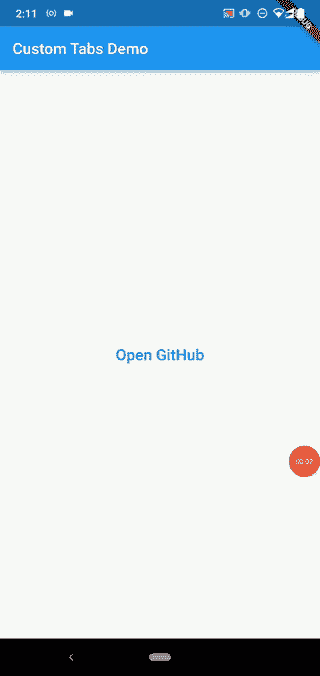
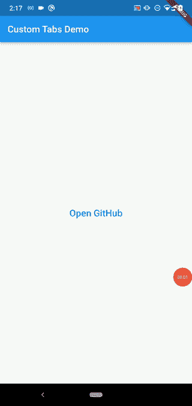
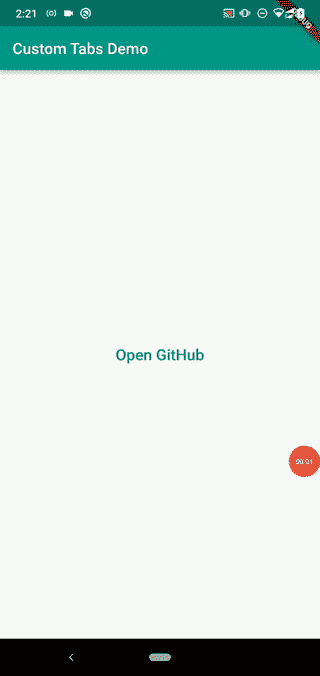
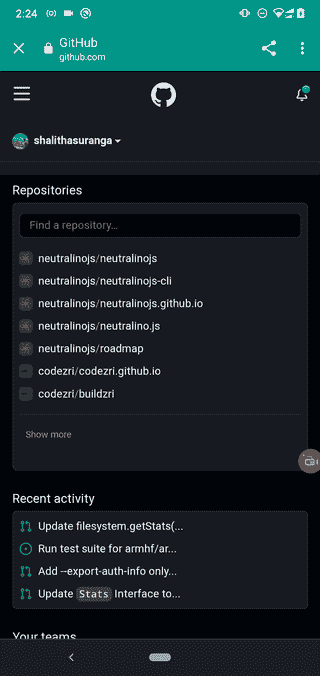
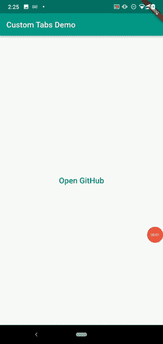
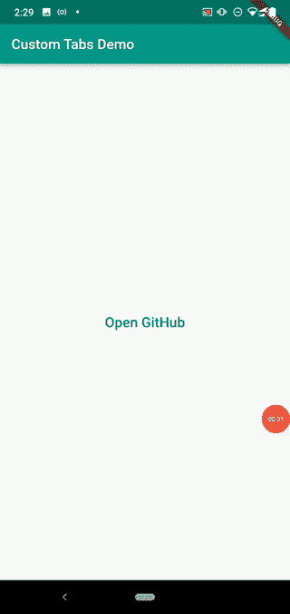

# 在 Flutter 中使用自定义的 Chrome 标签

> 原文：<https://blog.logrocket.com/flutter-custom-tabs-plugin/>

移动应用程序开发人员经常需要在他们的应用程序中显示网页。显示网页最简单的方法是在用户的默认浏览器中打开特定的网页，但这有一些明显的缺点。

例如，当用户通过您的应用程序在浏览器中打开一个 URL 时，特定的操作会突然切换当前的应用程序上下文并启动浏览器应用程序，因此它不是用户友好的，而且浏览器 UI 也是不可定制的。特定于平台的 webview 组件也允许开发人员呈现 web 内容，但[webview 通常不与其他 web 浏览器共享浏览状态](https://blog.logrocket.com/react-native-webview-a-complete-guide/)，也不包含最新的 web APIs。

Chromium 开源浏览器在 2015 年通过[提供自定义标签功能](https://blog.chromium.org/2015/09/chrome-custom-tabs-smooth-transition_2.html)解决了这个网址导航问题。现在，很多主流的 Android 浏览器都实现了自定义标签协议。

## 什么是自定义选项卡功能？

自定义选项卡功能允许移动应用程序开发人员在可自定义的浏览器实例中启动网页，该实例与原始浏览器应用程序共享相同的 cookie jar 和权限模型。 [`flutter_custom_tabs`包](https://pub.dev/packages/flutter_custom_tabs)提供了一个跨平台的解决方案，用于在 Android 上实现 Chrome 定制标签，以及在 iOS 上实现一个基于 [Safari 视图控制器的](https://developer.apple.com/documentation/safariservices/sfsafariviewcontroller)，类似定制标签的功能。

在本帖中，我们将通过以下部分讨论`flutter_custom_tabs`在 Android 平台上提供的每一项功能:

## `flutter_custom_tabs`特性

`flutter_custom_tabs`包允许开发者在 Android 上的 Chrome 定制标签和 iOS 上的 Safari 视图控制器上启动 URL。这个包包含了许多令人印象深刻的特性，我们将在这一节回顾这些特性。

### 灵活、功能全面、最小化的 API

这个包提供了一个简单的 API 函数，就像 [url_launcher 包](https://pub.dev/packages/url_launcher)一样，可以使用自定义标签和一个非常灵活的配置对象，它几乎覆盖了所有原生 Android 自定义标签的特性。您可以通过库配置对象轻松配置浏览器工具栏、活动启动器动画和一些浏览器功能。

### 跨平台支持

Chrome 自定义标签是为 Android 平台引入的一项功能，但这个包通过原生 Safari 视图控制器 API 在 iOS 平台上提供了类似的功能。`flutter_custom_tabs`甚至可以通过 [url_launch_package](https://pub.dev/packages/url_launcher_web/versions) 打开一个新的浏览器标签，作为基于网络的定制标签的替代，从而与 Flutter web 平台协同工作。

### 错误处理

Chrome 自定义标签需要 Chrome 浏览器、另一个支持自定义标签的浏览器或至少一个浏览器应用程序来启动网页。当系统中没有浏览器时，这个库不能完成它的任务。您可以使用 Dart try-catch 块轻松处理此类错误。

## 颤振铬自定义标签教程

现在我们知道了`flutter_custom_tabs`包的突出特性。让我们将它安装到一个 Flutter 项目中，并尝试所有支持的功能。

### 设置`flutter_custom_tabs`包

您可以用一个新的 Flutter 项目来测试即将到来的代码示例，或者直接在一个现有的项目中使用这些代码示例。

如果您计划创建一个新项目，请使用以下命令创建一个项目:

```
flutter create customtabs
cd customtabs

```

现在我们可以将`flutter_custom_tabs`添加到`pubspec.yaml`文件的依赖列表中，并通过运行以下命令链接外部包:

```
flutter pub get flutter_custom_tabs 

```

确保您的依赖项列表包括新链接的包:

```
dependencies:
  flutter:
    sdk: flutter
  flutter_custom_tabs: ^1.0.4

  # --- Other dependencies ---

```

接下来，用`flutter run`命令运行项目，安装新链接的包并运行应用程序。

如果插件安装成功，运行`flutter run`后你会看到默认的 Flutter 应用。由于 Flutter 的热重新加载功能，您可以让应用程序运行并测试即将到来的代码片段。

### 使用基本语法启动 URL

让我们启动一个带有 Chrome 自定义标签的 URL，无需额外配置即可开始使用这个包。将以下代码添加到`lib/main.dart`文件中。

```
import 'package:flutter/material.dart';
import 'package:flutter_custom_tabs/flutter_custom_tabs.dart';

void main() {
  runApp(const MyApp());
}

class MyApp extends StatelessWidget {
  const MyApp({Key? key}) : super(key: key);

  @override
  Widget build(BuildContext context) {
    return MaterialApp(
      title: 'Custom Tabs Demo',
      theme: ThemeData(
        primarySwatch: Colors.blue
      ),
      home: Home()
    );
  }
}

class Home extends StatelessWidget {
  const Home({Key? key}) : super(key: key);

  @override
  Widget build(BuildContext context) {
    return Scaffold(
      appBar: AppBar(
        title: const Text('Custom Tabs Demo'),
      ),
      body: Center(
        child: TextButton(
          child: const Text('Open GitHub', style: TextStyle(fontSize: 20)),
          onPressed: () => _launchURL(),
        ),
      ),
    );
  }

  void _launchURL() async {
    try {
      launch('https://github.com');
    }
    catch(e) {
      debugPrint(e.toString());
    }
  }
}

```

这里，我们使用了来自`flutter_custom_tabs`包的`launch`异步函数，通过自定义标签功能打开一个 Chrome 实例。我们使用典型的 Dart try-catch 错误处理方法来检测自定义选项卡初始化问题。

一旦你运行上面的代码并点击材料文本按钮(我们的显示为打开 GitHub)，应用程序将在自定义选项卡中打开 GitHub 网站，如下所示。



Custom Tabs with the default configuration

如上面的预览所示，我没有登录就获得了 GitHub 仪表板，因为我已经通过 Chrome 登录了 GitHub 网站——由于共享的浏览器存储模型(即 cookies、设置等),您将看到所有自定义标签启动的网站，就像您在 Chrome 浏览器中看到的一样。).你可以点击左侧的关闭按钮快速返回到你的应用程序，或者你可以按几次返回按钮，这取决于你的浏览深度。

即使自定义标签使用相同的 Chrome 浏览器，它也允许开发人员自定义主要的 UI 元素，如工具栏。自定义选项卡 API 通过众所周知的 [Android Intent](https://developer.android.com/reference/android/content/Intent) 对象将这些配置细节传递给 Chrome。`launch`函数接受一个可选的配置对象，用于定制选项卡。

例如，我们可以用`toolbarColor`属性改变工具栏的背景颜色。用下面的代码片段更新您的`_launchURL`函数源代码:

```
void _launchURL() async {
  try {
    launch('https://github.com',
      customTabsOption: CustomTabsOption(
        toolbarColor: Colors.blue
      )
    );
  }
  catch(e) {
    debugPrint(e.toString());
  }
}

```

现在，您将获得 Chrome 实例的蓝色工具栏，如以下预览所示:



Custom Tabs with a hard-coded toolbar color

这里，我们对工具栏颜色的`Colors.blue`值进行了硬编码，但是你可以通过`Theme.of()`函数调用从`context`引用中应用你的应用主题的主要颜色，如下所示:

```
void _launchURL(BuildContext context) async {
    try {
      launch('https://github.com',
        customTabsOption: CustomTabsOption(
          toolbarColor: Theme.of(context).primaryColor,
        )
      );
    }
    catch(e) {
      debugPrint(e.toString());
    }
  }

```

然后，你还需要从按钮按下回调中传递`context`引用:

```
onPressed: () => _launchURL(context)

```

以下是将主题的主要颜色用于自定义选项卡的完整源代码:

```
import 'package:flutter/material.dart';
import 'package:flutter_custom_tabs/flutter_custom_tabs.dart';

void main() {
  runApp(const MyApp());
}

class MyApp extends StatelessWidget {
  const MyApp({Key? key}) : super(key: key);
  @override
  Widget build(BuildContext context) {
    return MaterialApp(
      title: 'Custom Tabs Demo',
      theme: ThemeData(
        primarySwatch: Colors.teal
      ),
      home: Home()
    );
  }
}

class Home extends StatelessWidget {
  const Home({Key? key}) : super(key: key);
  @override
  Widget build(BuildContext context) {
    return Scaffold(
      appBar: AppBar(
        title: const Text('Custom Tabs Demo'),
      ),
      body: Center(
        child: TextButton(
          child: const Text('Open GitHub', style: TextStyle(fontSize: 20)),
          onPressed: () => _launchURL(context),
        ),
      ),
    );
  }
  void _launchURL(BuildContext context) async {
    try {
      launch('https://github.com',
        customTabsOption: CustomTabsOption(
          toolbarColor: Theme.of(context).primaryColor,
        )
      );
    }
    catch(e) {
      debugPrint(e.toString());
    }
  }
}

```

运行上述代码后，您将看到我们在自定义选项卡工具栏中选择的蓝绿色主主题颜色，如下面的预览所示:



Flutter Custom Tabs is using the application theme’s primary color

`showPageTitle`属性允许您控制工具栏上网页标题的可见性。以下配置对象要求自定义选项卡显示网页标题:

```
customTabsOption: CustomTabsOption(
        // --- Other options ---
        // ...
        showPageTitle: true,
      )

```

现在我们可以看到网页标题如下:



Flutter Custom Tabs with the webpage title

这个包为工具栏相关的定制提供了另外两个配置属性。`enableDefaultShare`和`enableUrlBarHiding`属性分别帮助显示或隐藏共享菜单项和滚动时显示/隐藏工具栏。

### 定制 Android 活动动画

Android 平台通常会在每次活动启动时播放系统动画。默认情况下，Chrome 自定义标签也继承了相同的系统动画。flutter_custom *_* tabs 包提供了一种非常灵活的方式，通过`CustomTabsSystemAnimation`和`CustomTabsAnimation`类定制 Chrome 自定义标签的活动动画。

这个包提供了两个内置的活动动画:`slideIn`和`fade`。你可以用下面的代码片段激活`slideIn`预建的动画:

```
customTabsOption: CustomTabsOption(
          // --- Other options ---
          // ....
          animation: CustomTabsSystemAnimation.slideIn(),
        )

```

现在你将会看到如下图所示的`slideIn`动画:



Flutter Custom Tabs with the slideIn transition animation

我们可以通过添加`animation: CustomTabsSystemAnimation.fade()`配置来使用`fade`动画。


Flutter Custom Tabs with the fade transition animation

这个包非常灵活——它允许你使用任何 Android 框架核心动画，而不是预先构建的库动画。例如，您可以使用以下配置对象构建自定义动画:

```
import 'package:flutter_custom_tabs_platform_interface/flutter_custom_tabs_platform_interface.dart'; // Import CustomTabsAnimation
customTabsOption: CustomTabsOption(
          // --- Other options ---
          // ...
          animation: const CustomTabsAnimation(
            startEnter: 'android:anim/screen_rotate_minus_90_enter',
            startExit: 'android:anim/fade_out',
            endEnter: 'android:anim/screen_rotate_minus_90_enter',
            endExit: 'slide_down/fade_out',
          ),
        )

```

现在，您将看到一个不同于先前预建库动画的旋转过渡动画:



Flutter Custom Tabs with a user-defined rotation transition animation

你可以为`CustomTabsAnimation`构造器提供 Android 框架核心动画标识符，[浏览所有提供的 Android 框架核心动画](https://android.googlesource.com/platform/frameworks/base/+/HEAD/core/res/res/anim)。

每个动画构造函数参数都有以下定义:

*   `startEnter`:输入自定义标签的动画
*   `startExit`:启动自定义选项卡的应用活动的退出动画
*   `endEnter`:为启动自定义标签的应用程序输入动画
*   `endExit`:退出自定义标签动画

尝试从 Android 框架核心动画制作自己的过渡动画！只要确保实现你的动画不会对用户体验产生负面或剧烈的影响。

### 高级自定义选项卡配置

以上是每个 Flutter 开发者需要配置 Chrome 自定义标签页的常用功能。`flutter_custom_tabs`包还支持一些针对特定需求的高级配置。例如，如果 Chrome 没有出现在带有`extraCustomTabs`数组的用户设备上，你可以优先选择后备浏览器。

如果用户的设备上没有 Chrome，以下配置通过引用 Android 软件包名称来优先考虑 Mozilla Firefox，然后是 Microsoft Edge:

```
customTabsOption: CustomTabsOption(
          extraCustomTabs: const <String>[
            'org.mozilla.firefox',
            'com.microsoft.emmx'
           ],
        )

```

此外，这个包允许你通过`enableInstantApps`布尔配置属性在自定义标签中启用和禁用 Google Play [即时应用](https://developer.android.com/topic/google-play-instant)。例如，以下配置激活自定义选项卡上的即时应用程序功能:

```
>customTabsOption: CustomTabsOption(
          enableInstantApps: true
        )

```

这个包还允许您在 HTTP 请求中发送一些头值，如下所示:

```
customTabsOption: CustomTabsOption(
          // --- Other options ---
          // ...
          headers: {
            'content-type': 'text/plain'
          }
        )

```

请注意，这些头值需要是 [CORS 安全列表请求头](https://developer.mozilla.org/en-US/docs/Glossary/CORS-safelisted_request_header)——否则，您需要用您的域名配置[谷歌数字资产链接](https://developers.google.com/digital-asset-links/v1/getting-started)来发送任意请求头。

### iOS 和 web 支持配置

flutter_custom_>tabs 包支持 Android、iOS 和 web 平台。在 Android 上，它通过底层的 [CustomTabsLauncher](https://github.com/droibit/CustomTabsLauncher) 平台特定的 Kotlin 库使用 Chrome 或其他后备浏览器。

在 iOS 上，它通过 Flutter 方法通道 API 直接使用系统自带的 [SFSafariViewController](https://developer.apple.com/documentation/safariservices/sfsafariviewcontroller) 类来打开定制的 Safari 实例。在 web 平台上，它通过 [url_launcher_web package](https://pub.dev/packages/url_launcher_web) 打开一个新的浏览器标签。

flutter_custom_tabs 的 web 版本是不可定制的，因为我们不能用客户端 JavaScript 更改浏览器 UI。但是，我们可以在 iOS 上自定义 Safari 实例，方式有点类似于自定义标签。查看以下配置对象:

```
>customTabsOption: CustomTabsOption(
        // --- Other options ---
        // ...
        safariVCOption: SafariViewControllerOption(
          preferredBarTintColor: Colors.blue,
          preferredControlTintColor: Colors.white,
          barCollapsingEnabled: true,
          entersReaderIfAvailable: true,
          dismissButtonStyle: SafariViewControllerDismissButtonStyle.close,        
        ),
      )

```

以上配置设置了以下 Safari UI 自定义:

*   使用蓝色作为带有`preferredBarTintColor`属性的工具栏背景
*   对带有`preferredControlTintColor`属性的工具栏元素使用白色
*   当用户使用`barCollapsingEnabled`属性滚动时自动折叠工具栏
*   使用`entersReaderIfAvailable`属性自动激活阅读器模式
*   使用关闭按钮返回到带有`dismissButtonStyle`属性的应用程序

## 自定义选项卡与默认浏览器和 Webview

自定义标签并不是在 Flutter 应用上呈现网页内容的唯一方式——我们也有 Flutter 包来打开默认浏览器和实现应用内网页视图。让我们通过将每个选项与自定义选项卡解决方案进行比较，来讨论启动默认浏览器和使用 webview 的利弊。

| 比较点 | 自定义选项卡 | 默认浏览器 | 网络视图 |
| --- | --- | --- | --- |
| 初始化 | 通过原生 Android 和 Chrome 定制标签性能优化，提供最快的初始化时间 | 网页初始化很慢，因为默认的 web 浏览器不像自定义标签那样使用特定的初始化性能优化 | 网页初始化可以通过各种性能调整来提高，但 webview 组件通常不像 web 浏览器那样支持完整的 web APIs 和浏览器功能 |
| 可定制性 | 能够根据 Flutter 应用程序主题定制用户界面(工具栏和菜单) | 无法自定义用户界面，因为 URL 启动过程是由 Android 系统控制的，而不是由开发人员明确控制的 | 如果 webview 驻留在开发人员创建的活动中，则高度可定制 |
| UX/在浏览器和应用程序之间导航 | 应用程序和自定义选项卡之间内置的用户友好导航支持 | 与 Flutter 应用程序用户体验相比，默认浏览器可能会显示为完全不同的应用程序，用户通常需要找到关闭浏览器应用程序的方法来再次返回到您的应用程序 | 开发人员可以通过各种 UI 和内部 webview 功能提供与应用程序的其他本机部分相同的用户体验，因为他们可以根据需要定制 webview |
| Cookie 和权限共享 | 共享 cookie jar 和权限模型，因此用户可以在 Chrome 和自定义标签实例上看到完全相同的网站状态 | 使用相同的 cookie jar 和权限模型，因为 URL 是在系统中相同的默认浏览器中启动的 | 浏览器和 webview 组件之间不共享 cookie jar 和权限模型。与自定义选项卡不同，用户可能需要从浏览器和 webview 登录网页两次 |
| 有效性 | 通过 flutter_custom_tabs 和 flutter_web_browser 插件提供给 Flutter 开发者 | 通过 url_launcher 插件提供给 Flutter 开发者 | 通过 url_launcher 插件(非常有限的定制)和 webview_flutter 插件(灵活的定制)提供给 Flutter 开发者 |

我们根据你的应用开发需求总结一下上面的对照表。

* * *

### 更多来自 LogRocket 的精彩文章:

* * *

如果您只需要显示网页，请考虑使用自定义选项卡，而不是启动默认浏览器，以获得更好的用户体验。如果您需要使用本机 web、类似通信桥的高级定制来呈现您自己的 web 内容，面向 webview 的方法为您提供了完全的灵活性和支持。

在使用默认浏览器选项之前要三思——它确实会改变应用程序的上下文，影响用户体验。

## 实现自定义选项卡的最佳实践

开发最佳实践总是帮助我们构建高质量的软件系统，让用户欣赏并推荐给其他用户。正如您已经体验过的，使用 flutter_custom *_* tabs 包实现定制选项卡非常容易。即使实现并不复杂，我们也需要考虑实现更好的应用程序质量的最佳实践。

在 Flutter 中使用自定义选项卡时，请考虑以下最佳实践。

*   尝试在自定义选项卡中提供与在应用程序中相同的外观和感觉，包括类似于应用程序屏幕的动画和颜色
*   总是测试后备选项:Chrome 和其他一些流行的浏览器支持自定义标签，但在某些情况下，用户可能不会使用 Chrome 或支持自定义标签的浏览器，或者用户可能没有 web 浏览器应用程序。因此，在这种情况下，请检查您的应用程序是使用默认浏览器还是 webview 实现
*   遵循 [DRY](https://en.wikipedia.org/wiki/Don%27t_repeat_yourself) 编程原则，不要在许多地方重新定义同一个`CustomTabsOption`对象——实现一个共享函数来启动所有定制标签，就像我们之前创建的`_launchURL`函数一样
*   添加跨平台支持并在真实设备上测试。确保使用`safariVCOption`配置属性为 iOS 配置 flutter_custom *_* 选项卡

看一下最后一点的完整配置:

```
void _launchURL(BuildContext context) async {
  final theme = Theme.of(context);
  try {
    launch('https://github.com',
      // Android Custom Tabs config
      customTabsOption: CustomTabsOption(
        showPageTitle: true,
        toolbarColor: theme.primaryColor,
        animation: CustomTabsSystemAnimation.fade(),
        // fallback options
        extraCustomTabs: const <String>[
          'org.mozilla.firefox',
          'com.microsoft.emmx',
        ],
        headers: {
          'content-type': 'text/plain'
        }
      ),
      // iOS Safari View Controller config
      safariVCOption: SafariViewControllerOption(
        preferredBarTintColor: theme.primaryColor,
        preferredControlTintColor: Colors.white,
        barCollapsingEnabled: true,
        entersReaderIfAvailable: false,
        dismissButtonStyle: SafariViewControllerDismissButtonStyle.close,
      ),
    );
  }
  catch(e) {
    // Handle the URL launching failure here
    debugPrint(e.toString());
  }
}

```

您可以从 [my GitHub repository](https://github.com/codezri/flutter_custom_tabs_example) 下载一个完整的示例 Flutter 自定义选项卡项目源代码。

## 结论

在本教程中，我们已经讨论了 flutter_custom_tabs 提供的几乎所有特性。这个包提供了一个简单的功能来集成颤振应用中的自定义标签。尽管它提供了一个最小的 Dart 功能来处理自定义标签，但它允许你在 Flutter 中使用 Chrome 自定义标签进行几乎所有的自定义。

但是，flutter_custom_tabs 有几个问题需要解决。例如，像`enableDefaultShare`这样的一些配置选项不能像预期的那样工作。此外，没有向特定的自定义选项卡添加额外的动作/菜单项的选项，即使原生的 [Android API 支持自定义选项卡中的](https://developer.chrome.com/docs/android/custom-tabs/integration-guide/#configure-a-custom-action-button)自定义动作/菜单项。我还注意到自定义标签关闭动画不能正常工作。由于这些问题，Flutter 开发者开始支持一些替代插件，如 [flutter_web_browser](https://pub.dev/packages/flutter_web_browser) 。

但是，总的来说，flutter_custom_tabs 包仍然是最好的 flutter 自定义标签插件，它为开发者提供了一个灵活的、功能齐全的界面。它甚至为 Flutter web 和 iOS 提供了定制的标签式实现。这个包在 [Dart packages registry](https://pub.dev) 上有很高的人气分数，并且有一个结构良好的代码库——因此，我们可以在生产应用中使用`flutter_custom_tabs`而没有任何问题。

软件包维护者将会添加缺失的特性，并很快修复现有的问题，以支持整个 Flutter 开发者社区。

## 使用 [LogRocket](https://lp.logrocket.com/blg/signup) 消除传统错误报告的干扰

[](https://lp.logrocket.com/blg/signup)

[LogRocket](https://lp.logrocket.com/blg/signup) 是一个数字体验分析解决方案，它可以保护您免受数百个假阳性错误警报的影响，只针对几个真正重要的项目。LogRocket 会告诉您应用程序中实际影响用户的最具影响力的 bug 和 UX 问题。

然后，使用具有深层技术遥测的会话重放来确切地查看用户看到了什么以及是什么导致了问题，就像你在他们身后看一样。

LogRocket 自动聚合客户端错误、JS 异常、前端性能指标和用户交互。然后 LogRocket 使用机器学习来告诉你哪些问题正在影响大多数用户，并提供你需要修复它的上下文。

关注重要的 bug—[今天就试试 LogRocket】。](https://lp.logrocket.com/blg/signup-issue-free)