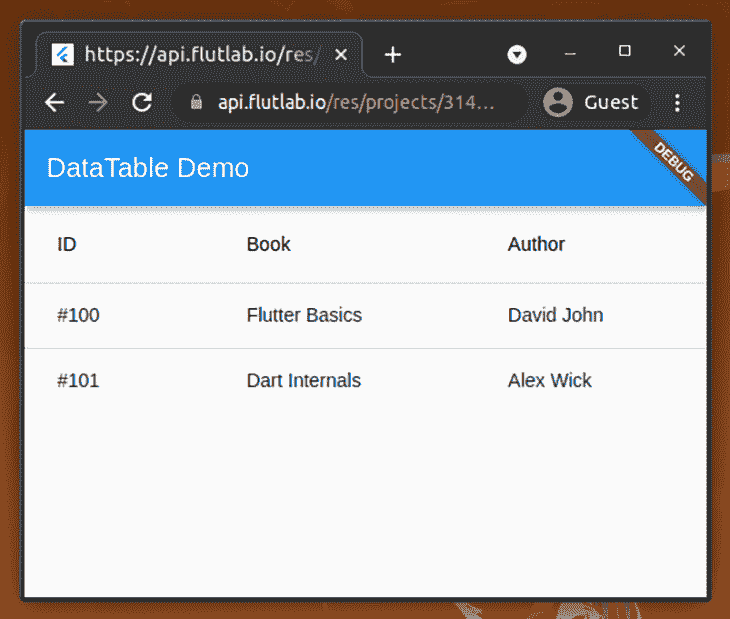
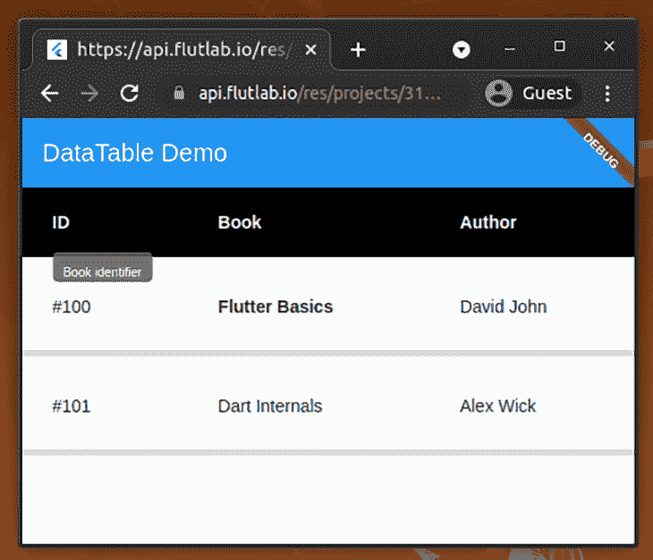
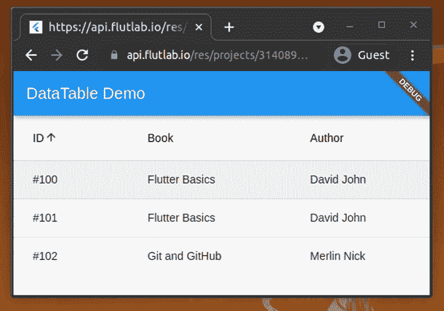
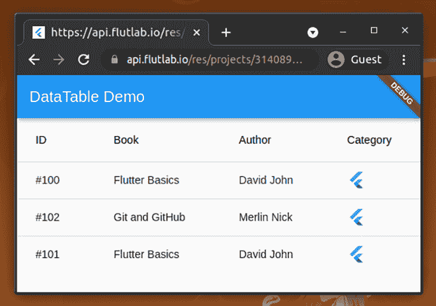
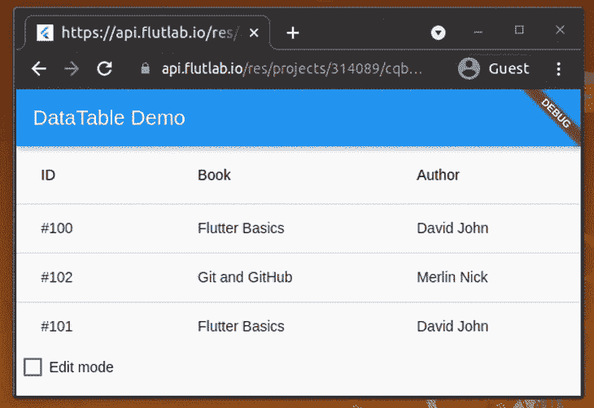

# Flutter 的数据表部件:显示数据的指南

> 原文：<https://blog.logrocket.com/flutter-datatable-widget-guide-displaying-data/>

Flutter 是一个流行的、灵活的、全功能的框架，用于构建跨平台的应用程序。它最初是一个跨平台的移动应用程序开发框架，特别是用于构建 Android 和 iOS 应用程序，但现在我们可以使用 Flutter 来构建适用于 Linux、macOS 和 Windows 的原生桌面应用程序。

在大多数应用程序中，程序员必须以表格结构显示一些数据——他们可能必须显示简单的列表、带有一些动作的列表或可编辑的列表。

Flutter 自带 UI 工具包，里面有很多做各种事情的小部件。一个这样的小部件 Flutter 提供的是用于显示表格数据结构的[数据表小部件](https://api.flutter.dev/flutter/material/DataTable-class.html)。与特定于原生平台的列表视图相比，DataTable 小部件非常灵活。

在本教程中，我将解释 DataTable 小部件的原理，并通过展示几个实际例子来讨论它的所有特性。

## 数据表原则和语法

您可以创建一个新的 Flutter 应用程序或打开一个现有的应用程序来开始学习本教程。如果您想创建一个新的应用程序，请像往常一样使用下面的命令。

```
flutter create datatable-demo 

```

你也可以使用 [FlutLab](https://flutlab.io/) 更快地尝试即将到来的代码片段，甚至不需要安装 Flutter。

DataTable 小部件有三个关键的子部件:[数据列](https://api.flutter.dev/flutter/material/DataColumn-class.html)、[数据行](https://api.flutter.dev/flutter/material/DataRow-class.html)和[数据单元格](https://api.flutter.dev/flutter/material/DataCell-class.html)。DataColumn 定义列，DataRow 定义行，DataCell 定义行内的单元格。

DataTable 小部件具有以下语法。

```
DataTable(
  columns: [...] // A list of DataColumns
  rows: [...] // A list of DataRows
  ...
  ...
  // other parameters
  ...
) 

```

## Flutter 数据表教程

让我们用数据表构建一个简单的图书列表。通过替换现有代码，将以下代码添加到您的`main.dart`文件中。

```
import 'package:flutter/material.dart';
void main() {
  runApp(MyApp());
}
class MyApp extends StatefulWidget {
  @override
  _MyAppState createState() => _MyAppState();
}
class _MyAppState extends State<MyApp> {
  @override
  Widget build(BuildContext context) {
    return MaterialApp(
      home: Scaffold(
        appBar: AppBar(
          title: Text('DataTable Demo'),
        ),
        body: ListView(
          children: [
            _createDataTable()
          ],
        ),
      ),
    );
  }
DataTable _createDataTable() {
    return DataTable(columns: _createColumns(), rows: _createRows());
  }
List<DataColumn> _createColumns() {
    return [
      DataColumn(label: Text('ID')),
      DataColumn(label: Text('Book')),
      DataColumn(label: Text('Author'))
    ];
  }
List<DataRow> _createRows() {
    return [
      DataRow(cells: [
        DataCell(Text('#100')),
        DataCell(Text('Flutter Basics')),
        DataCell(Text('David John'))
      ]),
      DataRow(cells: [
        DataCell(Text('#101')),
        DataCell(Text('Dart Internals')),
        DataCell(Text('Alex Wick'))
      ])
    ];
  }
}

```

保存文件后，您会看到一个图书列表，如下所示。



Here we created a simple book list with three columns and two rows. The DataTable creator code is decomposed into two functions: `_createColumns` for generating columns, and `_createRows` for generating rows with cell data.

出于演示目的，该表提供了硬编码的模拟数据，但是您可以基于 RESTful API 请求、设备文件和动态生成的数据来填充行-列数据。

在这些场景中，您可能必须基于 Dart 列表和映射动态生成行列数据。下面的代码从列表和地图中呈现相同的图书列表。我们会尽量把新书加入书单。

```
import 'package:flutter/material.dart';
void main() {
  runApp(MyApp());
}
class MyApp extends StatefulWidget {
  @override
  _MyAppState createState() => _MyAppState();
}
class _MyAppState extends State<MyApp> {
  List<Map> _books = [
    {
      'id': 100,
      'title': 'Flutter Basics',
      'author': 'David John'
    },
    {
      'id': 102,
      'title': 'Git and GitHub',
      'author': 'Merlin Nick'
    },
    {
      'id': 101,
      'title': 'Flutter Basics',
      'author': 'David John'
    },
  ];
  @override
  Widget build(BuildContext context) {
    return MaterialApp(
      home: Scaffold(
        appBar: AppBar(
          title: Text('DataTable Demo'),
        ),
        body: ListView(
          children: [
            _createDataTable()
          ],
        ),
      ),
    );
  }
DataTable _createDataTable() {
    return DataTable(columns: _createColumns(), rows: _createRows());
  }
List<DataColumn> _createColumns() {
    return [
      DataColumn(label: Text('ID')),
      DataColumn(label: Text('Book')),
      DataColumn(label: Text('Author'))
    ];
  }
List<DataRow> _createRows() {
    return _books
        .map((book) => DataRow(cells: [
              DataCell(Text('#' + book['id'].toString())),
              DataCell(Text(book['title'])),
              DataCell(Text(book['author']))
            ]))
        .toList();
  }
}

```

### 基本样式和配置

我们只提供了行和列数据来创建上面的数据表。因此，Flutter 框架通过应用默认样式和配置来呈现表格。

不过，DataTable 小部件非常灵活，所以我们可以根据需要定制它——通过提供各种参数。例如，我们可以使用下面的代码用几种样式和配置来配置 DataTable 小部件。用以下内容更新您的`main.dart`文件。

```
import 'package:flutter/material.dart';
void main() {
  runApp(MyApp());
}
class MyApp extends StatefulWidget {
  @override
  _MyAppState createState() => _MyAppState();
}
class _MyAppState extends State<MyApp> {
  @override
  Widget build(BuildContext context) {
    return MaterialApp(
      home: Scaffold(
        appBar: AppBar(
          title: Text('DataTable Demo'),
        ),
        body: ListView(
          children: [
            _createDataTable()
          ],
        ),
      ),
    );
  }
}
DataTable _createDataTable() {
  return DataTable(columns: _createColumns(), 
      rows: _createRows(), 
      dividerThickness: 5, 
      dataRowHeight: 80,
      showBottomBorder: true,
      headingTextStyle: TextStyle(
                          fontWeight: FontWeight.bold,
                          color: Colors.white
                        ),
      headingRowColor: MaterialStateProperty.resolveWith(
                        (states) => Colors.black
                      ),
  );
}
List<DataColumn> _createColumns() {
  return [
    DataColumn(label: Text('ID'), tooltip: 'Book identifier'),
    DataColumn(label: Text('Book')),
    DataColumn(label: Text('Author'))
  ];
}
List<DataRow> _createRows() {
  return [
    DataRow(cells: [
      DataCell(Text('#100')),
      DataCell(Text('Flutter Basics', style: TextStyle(fontWeight: FontWeight.bold))),
      DataCell(Text('David John'))
    ]),
    DataRow(cells: [
      DataCell(Text('#101')),
      DataCell(Text('Dart Internals')),
      DataCell(Text('Alex Wick'))
    ])
  ];
}

```

现在，您已经定制了您的数据表，如下所示。



自定义详细信息:

*   数据表的`dividerThickness`参数增加了行分隔线的厚度
*   数据表的`headingRowColor`和`headingTextStyle`参数改变了标题行的背景颜色、文本颜色和文本粗细
*   通过将数据表的`showBottomBorder`参数设置为`true`来启用页脚行
*   由于 DataColumn 的`tooltip`参数，第一列得到了一个漂亮的工具提示

如上所述，您可以根据需要定制数据表。如果您维护一个定制的 Flutter 主题，那么您可以使用 [DataTableThemeData 类](https://api.flutter.dev/flutter/material/DataTableThemeData-class.html)在您的主题数据对象中定义这些调整。

## 添加排序和选择所有功能

当数据表包含数值时，排序是提高可用性的必备功能。有时，程序员还会在表格行中添加复选框来启用选择。我们可以通过添加一个一次性选择/取消选择所有项目的功能来提高应用程序的可用性和生产率。

让我们将这些特性添加到我们的书单中吧！

### 启用排序

排序特性是 DataTable 小部件的内置特性。您可以通过为可排序列定义主排序列索引和`onSort`回调函数来启用排序。

将以下代码添加到您的`main.dart`文件中。

```
import 'package:flutter/material.dart';
void main() {
  runApp(MyApp());
}
class MyApp extends StatefulWidget {
  @override
  _MyAppState createState() => _MyAppState();
}
class _MyAppState extends State<MyApp> {
  List<Map> _books = [
    {
      'id': 100,
      'title': 'Flutter Basics',
      'author': 'David John'
    },
    {
      'id': 101,
      'title': 'Flutter Basics',
      'author': 'David John'
    },
    {
      'id': 102,
      'title': 'Git and GitHub',
      'author': 'Merlin Nick'
    }
  ];
  int _currentSortColumn = 0;
  bool _isSortAsc = true;
@override
  Widget build(BuildContext context) {
    return MaterialApp(
      home: Scaffold(
        appBar: AppBar(
          title: Text('DataTable Demo'),
        ),
        body: ListView(
          children: [
            _createDataTable()
          ],
        ),
      ),
    );
  }
DataTable _createDataTable() {
    return DataTable(
      columns: _createColumns(),
      rows: _createRows(),
      sortColumnIndex: _currentSortColumn,
      sortAscending: _isSortAsc,
    );
  }
List<DataColumn> _createColumns() {
    return [
      DataColumn(
        label: Text('ID'),
        onSort: (columnIndex, _) {
          setState(() {
            _currentSortColumn = columnIndex;
            if (_isSortAsc) {
              _books.sort((a, b) => b['id'].compareTo(a['id']));
            } else {
              _books.sort((a, b) => a['id'].compareTo(b['id']));
            }
            _isSortAsc = !_isSortAsc;
          });
        },
      ),
      DataColumn(label: Text('Book')),
      DataColumn(label: Text('Author'))
    ];
  }
List<DataRow> _createRows() {
    return _books
        .map((book) => DataRow(cells: [
              DataCell(Text('#' + book['id'].toString())),
              DataCell(Text(book['title'])),
              DataCell(Text(book['author']))
            ]))
        .toList();
  }
}

```

正如您所看到的，上面的代码定义了一个排序函数，它根据排序方向对图书列表进行排序。当用户点击 ID 列标题时，sort 函数用`setState`方法改变排序方向。

如果您运行上面的代码，您会看到下面的结果。您可以单击 ID 列对数据表的行进行排序。



### 启用选择

您不需要手动将复选框小部件添加到您的数据表来启用基于复选框的选择——Flutter DataTable 提供了基于复选框的选择功能！您只需要为 DataRow 的`onSelectChanged`参数添加一个回调，并通过 DataRow 的`selected`参数设置选择状态，以启用基于复选框的选择特性。

将下面的代码添加到您的`main.dart`中，查看这个特性的运行情况。

```
import 'package:flutter/material.dart';
import 'package:collection/collection.dart';
void main() {
  runApp(MyApp());
}
class MyApp extends StatefulWidget {
  @override
  _MyAppState createState() => _MyAppState();
}
class _MyAppState extends State<MyApp> {
  // The following list is already sorted by id
  List<Map> _books = [
    {
      'id': 100,
      'title': 'Flutter Basics',
      'author': 'David John'
    },
    {
      'id': 101,
      'title': 'Flutter Basics',
      'author': 'David John'
    },
    {
      'id': 102,
      'title': 'Git and GitHub',
      'author': 'Merlin Nick'
    }
  ];
  List<bool> _selected = [];
@override
  void initState() {
    super.initState();
    _selected = List<bool>.generate(_books.length, (int index) => false);
  }
@override
  Widget build(BuildContext context) {
    return MaterialApp(
      home: Scaffold(
        appBar: AppBar(
          title: Text('DataTable Demo'),
        ),
        body: ListView(
          children: [
            _createDataTable()
          ],
        ),
      ),
    );
  }
DataTable _createDataTable() {
    return DataTable(columns: _createColumns(), rows: _createRows());
  }
List<DataColumn> _createColumns() {
    return [
      DataColumn(label: Text('ID')),
      DataColumn(label: Text('Book')),
      DataColumn(label: Text('Author'))
    ];
  }
List<DataRow> _createRows() {
    return _books
        .mapIndexed((index, book) => DataRow(
                cells: [
                  DataCell(Text('#' + book['id'].toString())),
                  DataCell(Text(book['title'])),
                  DataCell(Text(book['author']))
                ],
                selected: _selected[index],
                onSelectChanged: (bool? selected) {
                  setState(() {
                    _selected[index] = selected!;
                  });
                }))
        .toList();
  }
}

```

上面的代码将当前选中行的索引细节存储在`selected`列表中。此外，它还通过 DataRow 的`selected`参数设置当前行是否被选中。`onSelectChanged`回调函数根据用户动作更新选择索引列表。Flutter 框架自动处理全选复选框的动作。

运行上面的代码。您将看到如下结果。


您可以从`selected`列表中找到所有选中的索引。

## 向数据表中添加图像和其他小部件

在前面的例子中，我们使用了`Text`小部件来显示单元格的内容。有时候，程序员不得不展示一些图标、按钮、链接等。用数据表。像任何其他复杂的 Flutter 小部件一样，也可以在数据表中显示小部件。

让我们通过创建一个名为`Category`的新列，在数据单元格中添加一个图像。作为演示，下面的代码将把 Flutter 徽标添加到 category 列中。

```
import 'package:flutter/material.dart';
void main() {
  runApp(MyApp());
}
class MyApp extends StatefulWidget {
  @override
  _MyAppState createState() => _MyAppState();
}
class _MyAppState extends State<MyApp> {
  List<Map> _books = [
    {
      'id': 100,
      'title': 'Flutter Basics',
      'author': 'David John'
    },
    {
      'id': 102,
      'title': 'Git and GitHub',
      'author': 'Merlin Nick'
    },
    {
      'id': 101,
      'title': 'Flutter Basics',
      'author': 'David John'
    },
  ];
  @override
  Widget build(BuildContext context) {
    return MaterialApp(
      home: Scaffold(
        appBar: AppBar(
          title: Text('DataTable Demo'),
        ),
        body: ListView(
          children: [
            _createDataTable()
          ],
        ),
      ),
    );
  }
DataTable _createDataTable() {
    return DataTable(columns: _createColumns(), rows: _createRows());
  }
List<DataColumn> _createColumns() {
    return [
      DataColumn(label: Text('ID')),
      DataColumn(label: Text('Book')),
      DataColumn(label: Text('Author')),
      DataColumn(label: Text('Category'))
    ];
  }
List<DataRow> _createRows() {
    return _books
        .map((book) => DataRow(cells: [
              DataCell(Text('#' + book['id'].toString())),
              DataCell(Text(book['title'])),
              DataCell(Text(book['author'])),
              DataCell(FlutterLogo())
            ]))
        .toList();
  }
}

```

一旦执行了上面的代码，您将会看到下面的输出。



类似地，只需将所需的小部件传递给 DataCell 的构造函数，就可以将任何小部件添加到数据单元格中。

## 用数据单元格显示动态内容

有时，我们必须根据用户的动作动态地改变单元格数据。例如，当编辑模式被激活时，我们可以让用户编辑一些单元格值。

我们可以通过添加复选框来启用/禁用编辑模式，从而将此编辑模式功能添加到我们的图书列表中。启用编辑模式后，图书名称将变成可编辑的文本框。

将下面的代码添加到`main.dart`文件中，让示例运行起来。

```
import 'package:flutter/material.dart';
void main() {
  runApp(MyApp());
}
class MyApp extends StatefulWidget {
  @override
  _MyAppState createState() => _MyAppState();
}
class _MyAppState extends State<MyApp> {
  List<Map> _books = [
    {
      'id': 100,
      'title': 'Flutter Basics',
      'author': 'David John'
    },
    {
      'id': 102,
      'title': 'Git and GitHub',
      'author': 'Merlin Nick'
    },
    {
      'id': 101,
      'title': 'Flutter Basics',
      'author': 'David John'
    },
  ];
  bool? _isEditMode = false;
  @override
  Widget build(BuildContext context) {
    return MaterialApp(
      home: Scaffold(
        appBar: AppBar(
          title: Text('DataTable Demo'),
        ),
        body: ListView(
          children: [
            _createDataTable(),
            _createCheckboxField()
          ],
        ),
      ),
    );
  }
DataTable _createDataTable() {
    return DataTable(columns: _createColumns(), rows: _createRows());
  }
List<DataColumn> _createColumns() {
    return [
      DataColumn(label: Text('ID')),
      DataColumn(label: Text('Book')),
      DataColumn(label: Text('Author'))
    ];
  }
List<DataRow> _createRows() {
    return _books
        .map((book) => DataRow(cells: [
              DataCell(Text('#' + book['id'].toString())),
              _createTitleCell(book['title']),
              DataCell(Text(book['author']))
            ]))
        .toList();
  }
DataCell _createTitleCell(bookTitle) {
    return DataCell(_isEditMode == true ? 
            TextFormField(initialValue: bookTitle, 
            style: TextStyle(fontSize: 14)) 
            : Text(bookTitle));
  }
Row _createCheckboxField() {
    return Row(
      children: [
        Checkbox(
          value: _isEditMode,
          onChanged: (value) {
            setState(() {
              _isEditMode = value;
            });
          },
        ),
        Text('Edit mode'),
      ],
    );
  }
}

```

上面的代码用`_createTitleCell`函数动态显示了图书标题单元格的数据。如果选择了编辑模式复选框，`_createTitleCell`函数将返回一个可编辑的文本框。否则，它照常返回一个只读文本字段。

新的应用程序将如下工作。



## 设计模式指南

Flutter 允许程序员在 Dart 文件中定义他们的应用程序布局，它不像其他流行的框架那样提供单独的布局语法。因此，当您开发大规模的 Flutter 应用程序时，您的源文件可能会变得复杂且可读性较差。

这种情况也可能发生在数据表上。以下设计模式实践有助于我们降低 Flutter 应用程序的复杂性。

*   用类似 MVC(Model-view-controller)的模式将应用程序逻辑和布局相关的代码分开
*   将小部件的创建代码分解成单独的 Dart 函数；例如，像我们之前创建的`_createColumns`函数。
*   将整个应用程序分解成更小的可重用组件
*   为 UI 组件创建多个 Dart 源文件

## 结论

正如我们在本教程中讨论的，您可以使用 Flutter DataTable 来显示表格数据。此外，通过编写上述配置，可以使数据表非常具有交互性和用户友好性。此外，通过编写一些额外的 Dart 代码并根据您的需求在数据表附近添加一些其他 Flutter 小部件，您可以向数据表添加搜索和过滤等功能。

DataTable 适合于显示少量的数据记录。如果需要显示很多数据记录，可以考虑使用 [PaginatedDataTable](https://api.flutter.dev/flutter/material/PaginatedDataTable-class.html) 。

如果您试图在较小的屏幕上显示较大的数据表，请确保用 [SingleChildScrollView](https://api.flutter.dev/flutter/widgets/SingleChildScrollView-class.html) 包装您的数据表，以处理水平溢出。

## 使用 [LogRocket](https://lp.logrocket.com/blg/signup) 消除传统错误报告的干扰

[](https://lp.logrocket.com/blg/signup)

[LogRocket](https://lp.logrocket.com/blg/signup) 是一个数字体验分析解决方案，它可以保护您免受数百个假阳性错误警报的影响，只针对几个真正重要的项目。LogRocket 会告诉您应用程序中实际影响用户的最具影响力的 bug 和 UX 问题。

然后，使用具有深层技术遥测的会话重放来确切地查看用户看到了什么以及是什么导致了问题，就像你在他们身后看一样。

LogRocket 自动聚合客户端错误、JS 异常、前端性能指标和用户交互。然后 LogRocket 使用机器学习来告诉你哪些问题正在影响大多数用户，并提供你需要修复它的上下文。

关注重要的 bug—[今天就试试 LogRocket】。](https://lp.logrocket.com/blg/signup-issue-free)