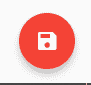
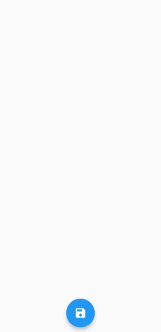
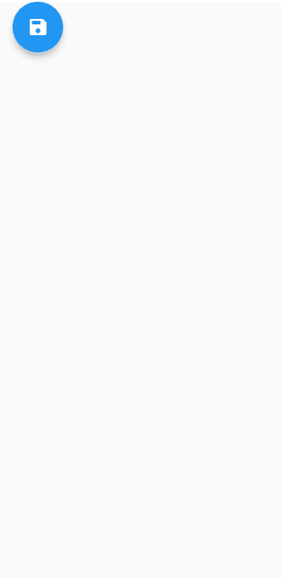
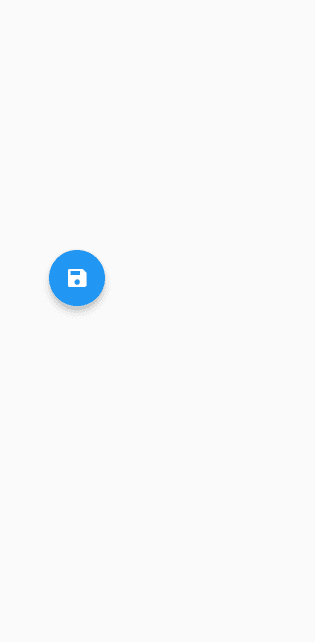
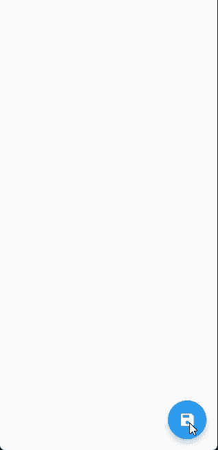

# Flutter FloatingActionButton:带示例的完整教程

> 原文：<https://blog.logrocket.com/flutter-floatingactionbutton-a-complete-tutorial-with-examples/>

遵循材料设计准则，Flutter 为各种使用情况提供不同种类的按钮。其中，FloatingActionButton (FAB)尤其重要，因为它有独特的属性和使用规则。

在本教程中，我们将向您介绍这些规则，并向您展示如何在 Flutter 中使用和定制 FloatingActionButton 小部件。

以下是我们将要介绍的内容:

## 什么是 Flutter 中的 FloatingActionButton？

Flutter 中的每个组件都被称为一个 widget， [FloatingActionButton](https://api.flutter.dev/flutter/material/FloatingActionButton-class.html) 也不例外。顾名思义，这个小部件浮动在屏幕上其他小部件的顶部。

通常，FloatingActionButton 小部件位于屏幕的右下角，形状为圆形。它也有一个标高，以提供漂浮效果。最重要的是，所有这些属性都是可定制的。

下面是 Flutter 中一个典型的浮动操作按钮的样子:

要在 Flutter 中使用 FloatingActionButton，请使用`Scaffold`的`floatingActionButton`属性:

```
Scaffold(
  floatingActionButton: FloatingActionButton(),
),

```

这将在屏幕上的默认位置添加 FAB:


您也可以使用`FloatingActionButton.extended()`创建一个扩展 FAB:

```
Scaffold(
  floatingActionButton: FloatingActionButton(
    label: Text('Action'),
  ),
),

```

这里我们在屏幕上有一个默认的 FAB。

## 浮动操作按钮规则和原则

在我们深入研究和探索定制选项之前，让我们确保理解使用 FAB 时要记住的规则和原则。这些最佳实践对于保持应用程序与材料设计的一致性非常重要。

### 直接作用

FAB 在 UI 中占据了突出的位置。因此，它应该在屏幕上执行主要操作。

该动作应该是屏幕上最常用和最重要的动作。例如，撰写推文是 Twitter feed 页面的主要操作:


诸如调节音量、复制文本和打开抽屉等次要操作不应使用 FAB 来执行。这些操作总是可以通过隐藏或巧妙放置在 UI 中的小部件来执行。

### 建设性行动

你应该只在建设性的行动中使用 FAB，避免在破坏性的行动中使用它。添加到购物车、共享图片和写电子邮件等操作被视为建设性的操作。破坏性操作包括存档、删除、导航到上一页等。

### 背景是关键

浮动操作按钮应该与屏幕的上下文相关；图标和动作都应该有意义。

再次以 Twitter 应用程序为例，图标清楚地表明了按钮的作用——也就是说，它创建了一条新的 tweet。

这怎么能以错误的方式完成呢？一个例子是设置按钮打开一个个人资料页面，这显然不是屏幕上下文中最重要的动作。

### 不要使用多个晶圆厂(在大多数情况下)

在大多数情况下，屏幕上最多只能有一个浮动操作按钮。这是有道理的，因为 FAB 的作用是执行最重要的行动，拥有多个 FAB 降低了它的重要性。

然而，这个规则有一个例外:如果屏幕上有两个不同的非常重要的动作，使用两个晶圆厂可能是有意义的。一个很好的例子就是谷歌地图应用:

在这里，选择目的地和以当前位置为中心都是同等重要的操作，应该在屏幕上随时可用。

### 图标和标签

默认情况下，屏幕上只显示工厂的图标；包含文本在某种程度上违背了使用 FAB 小部件的目的。

然而，在扩展 FAB 的情况下，这个规则是相反的。对于扩展 FAB，您可以只显示标签或图标，同时显示两者。相比之下，在扩展的浮动操作按钮中只显示图标是不允许的。

## 自定义浮动操作按钮

现在您已经理解了创建浮动动作按钮的重要原则和最佳实践，让我们来探索 Flutter 的浮动动作按钮小部件所提供的定制选项。

### 颜色；色彩；色调

您可以自定义浮动操作按钮的颜色。将 FAB 的背景色改为红色，如下所示:

```
FloatingActionButton(
	backgroundColor: Colors.red,
), 
```



属性被用来改变一个孩子的颜色——在这个例子中，是图标的颜色。让我们把它改成粉红色:

```
FloatingActionButton(
	foregroundColor: Colors.pink,
),
```

当您点击 FAB 时，会出现一个动画，其中一种颜色来自被点击的位置，并覆盖整个按钮区域。这就是所谓的飞溅颜色。

让我们将浮动操作按钮的飞溅颜色改为紫色:

```
FloatingActionButton(
	splashColor: Colors.purple,
),
```

当鼠标光标悬停在按钮上时，颜色也会发生变化。这在按钮被真正点击之前产生了很好的反馈。

要将此颜色更改为橙色，请按如下方式设置`hoverColor`属性:

```
FloatingActionButton(
  hoverColor: Colors.orange,
),
```

最后，还有一个改变焦点颜色的选项。基本上，当使用`FocusNode`聚焦按钮时，可以改变颜色来指示按钮现在处于焦点中。

为了准确理解这是如何发生的，您需要回顾一下 Flutter 中的[焦点的概念，这超出了本文的范围。](https://flutter.dev/docs/cookbook/forms/focus)

现在，我们可以通过将`autoFocus`参数设置为`true`来看到颜色的变化。这将自动聚焦 FAB，我们可以看到颜色变为绿色:

```
FloatingActionButton(
	focusColor: Colors.green,
	autoFocus: true,
),
```

海拔

### 仰角基本上是按钮在 Z 轴上的位置。根据标高调整阴影，造成按钮浮动的假象。

我们工厂的默认高度设置为`6`，所以让我们通过将其更改为`12`来增加高度:

```
FloatingActionButton(
	elevation: 12,
),
```

如果 FAB 的`onPressed`属性设置为`null`，则该按钮被标记为禁用。我们可以专门定制残疾人高程。

让我们把它设置为`0`:

```
FloatingActionButton(
	onPressed: null,
	disabledElevation: 0,
),
```

就像`focusColor`一样，这里我们有`focusElevation`来获得对用户在按钮被聚焦时看到的反馈的额外控制。

在这个例子中，我们将其设置为`5`。不要忘记将`autoFocus`设置为`true`，以便立即测试。

```
FloatingActionButton(
	autoFocus: true,
	focusElevation: 5,
),
```

高亮高程是点击时按钮的高程，就像飞溅颜色一样。我们将它设置为`50`以查看海拔的实际差异:

```
FloatingActionButton(
	higlightElevation: 50,
),
```

最后，我们有悬停高度。这表示鼠标光标悬停在 FAB 上方时的高度。同样，我们将保持在`50`:

位置

```
FloatingActionButton(
	hoverElevation: 50,
),
```

FAB 的默认右下角位置可能不适合你的应用程序的设计，你可能想把它放在中间。为此，我们更改了`Scaffold`的`floatingActionButtonLocation`属性，如下所示:



### 或者放在左上方怎么样？



```
Scaffold(
	floatingActionButtonLocation: FloatingActionButtonLocation.centerFloat,
), 
```

但既然 FAB 是一个 widget，我们就不受`Scaffold` xin 顺序的限制来定位它。我们可以把它放在布局中的任何地方，就像任何其他小部件一样。这里有一个例子:



```
Scaffold(
	floatingActionButtonLocation: FloatingActionButtonLocation.startTop,
), 
```

杂项属性

让我们快速浏览一下 FloatingActionButton 小部件的各种属性。

首先是`mini`。将`mini`设置为`true`会呈现迷你版的 FAB:

`mouseCursor`当光标停留在按钮上时，您可以改变光标的类型。

`toolTip`使您能够为用户提供额外的可访问性。例如，如果用户不明白按钮图标的意思怎么办？你可以创建一个工具提示，比如说“保存”，当鼠标悬停或长按按钮时，它就会出现:

```
FloatingActionButton(
	mini: true,
),
```

您可以使用`shape`参数定制按钮的形状。例如，您可以将它做成矩形，如下所示:

```
FloatingActionButton(
  mouseCursor: MaterialStateMouseCursor.textable,
),

```

```
FloatingActionButton(
	tooltip: 'Save',
),
```

添加动画和过渡

`FloatingActionButton`使用英雄动画进行页面过渡。这个按钮在转换时会变成一个新的小部件，看起来非常酷。让我们看看实际情况，好吗？

```
FloatingActionButton(
	shape: RoundedRectangleBorder(),
),
```

首先，创建一个新的导航页面。我们称之为`SecondPage`:

## 接下来，在页面中央创建一个`Hero`小部件:

`tag`属性使我们能够通过提供唯一的标签来连接两个小部件，因此框架不会混淆要变形到哪个小部件。在本例中，我们将使用与孩子相同的“保存”* *图标。

现在在第一页中向 FAB 提供相同的标记:

```
class SecondPage extends StatelessWidget {
  const SecondPage({Key? key}) : super(key: key);

  @override
  Widget build(BuildContext context) {
    return Scaffold(
      appBar: AppBar(),
    );
  }
}

```

FAB 现在知道它必须为那个特定的图标小部件制作动画。

```
return Scaffold(
  body: Center(
    child: Hero(tag: 'uniqueTag', child: Icon(Icons.save)),
  ),
);

```

由于 FAB 只能为一个小部件制作动画，所以不能用同一个标签创建多个`Hero`小部件。每个小部件都应该有一个唯一的标签。

最后，我们将让 FAB 在被按下时导航到`SecondPage`。为此，使用 FAB 的`onPressed`属性中的`Navigator.push()`:

```
FloatingActionButton(
  heroTag: 'uniqueTag',
),

```

这种转变看起来是这样的:

让我们尝试制作另一个浮动动作按钮的动画，看看是什么样子。

在第二页创建一个 FAB。这一次，我们可以有一个扩展的浮动操作按钮:

```
FloatingActionButton(
        heroTag: 'uniqueTag',
        onPressed: () {
          Navigator.push(
            context,
            MaterialPageRoute(
              builder: (context) => SecondPage(),
            ));
        }
),

```

现在导航到第二页应该是这样的:

让我们尝试最后一次跨多页转换 FAB 的位置。

```
FloatingActionButton.extended(
  heroTag: 'uniqueTag',
  label: Row(
    children: [Icon(Icons.save), Text('Save')],
  ),
),

```

就像第二页一样，用不同的颜色和图标创建第三和第四页。对于每个 FAB，使用`floatingActionButtonLocation`属性保持不同的位置。确保向所有人提供相同的`heroTag`。现在，看看魔法吧！



很酷，对吧？

结论

完成本教程后，您现在应该明白:

什么是 FloatingActionButton 以及如何在 Flutter 应用程序中使用它

## 使用 FAB 时要记住的规则和原则

如何根据自己的喜好定制 FAB

*   如何在 FAB 中添加英雄动画
*   有了这些知识，我希望你能够在你的 Flutter 应用程序中实现 FAB，并使它们更加美观和实用。感谢阅读！
*   使用 [LogRocket](https://lp.logrocket.com/blg/signup) 消除传统错误报告的干扰
*   [LogRocket](https://lp.logrocket.com/blg/signup) 是一个数字体验分析解决方案，它可以保护您免受数百个假阳性错误警报的影响，只针对几个真正重要的项目。LogRocket 会告诉您应用程序中实际影响用户的最具影响力的 bug 和 UX 问题。

然后，使用具有深层技术遥测的会话重放来确切地查看用户看到了什么以及是什么导致了问题，就像你在他们身后看一样。

## LogRocket 自动聚合客户端错误、JS 异常、前端性能指标和用户交互。然后 LogRocket 使用机器学习来告诉你哪些问题正在影响大多数用户，并提供你需要修复它的上下文。

[](https://lp.logrocket.com/blg/signup)

关注重要的 bug—[今天就试试 LogRocket】。](https://lp.logrocket.com/blg/signup-issue-free)

Then, use session replay with deep technical telemetry to see exactly what the user saw and what caused the problem, as if you were looking over their shoulder.

LogRocket automatically aggregates client side errors, JS exceptions, frontend performance metrics, and user interactions. Then LogRocket uses machine learning to tell you which problems are affecting the most users and provides the context you need to fix it.

Focus on the bugs that matter — [try LogRocket today](https://lp.logrocket.com/blg/signup-issue-free).