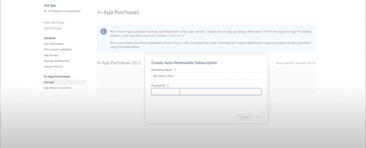
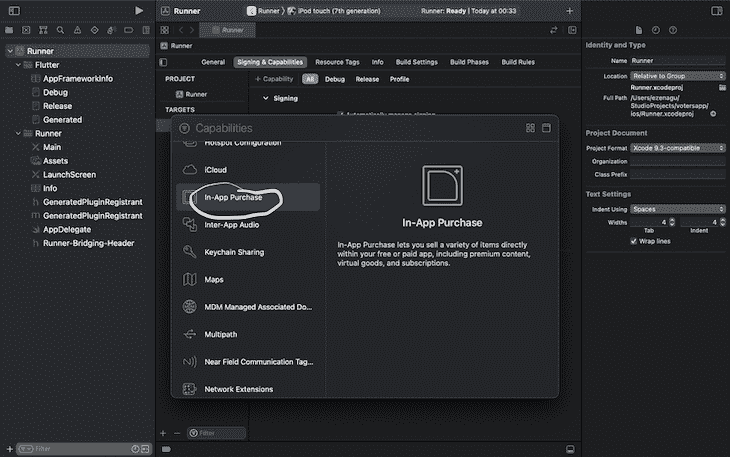
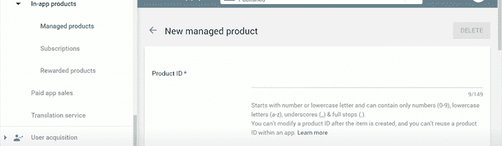
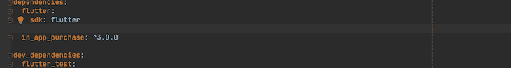

# 实现 Flutter 应用内购买的 3 种方法

> 原文：<https://blog.logrocket.com/flutter-in-app-purchase-subscription-capability/>

Flutter 由谷歌于 2017 年开发，是一个开源的 UI 软件开发工具包，用于跨平台的应用开发。Flutter 框架包括一个软件开发工具包(SDK)和他们基于小部件的 UI 库。

Flutter in_app_purchase (IAP)是第一方的 Flutter 包，允许开发者从 iOS 上的 App Store 或 Android 上的 Google Play 在其应用中实现应用内购买。另外两个解决方案 flutter_inapp_purchase 和 purchases_flutter 也提供了类似的功能。

在本文中，我们旨在指导您哪种 IAP 最适合您的 [Flutter](https://blog.logrocket.com/tag/flutter/) 应用。每个 IAP 插件都有不同的功能；这意味着了解哪一款最适合您的应用非常重要。

继续读下去，了解你应该选择哪一个。

## 目标

在本文中，我们将讨论:

*   集成 IAP 的三种不同方式:
    *   在应用程序中购买
    *   颤振 _ inapp _ 购买
    *   购买 _ 颤振
*   每个软件包的主要功能以及它们的安装和使用方式
*   基于特定的用例，何时以及为什么每个包更适合于实现 IAP

## 先决条件

要继续，我建议您:

*   Dart 编程语言的中级知识
*   之前构建了一个颤振应用程序

## IAP 集成

*   我们将展示并解释 Flutter 将应用内购买整合到你的 iOS 或 Android 应用中的三种方式

现在，一切都结束了，让我们开始吧！请随意跳到下面任何一个带项目符号的部分:

## 应用内购买的初始设置

成功测试应用内购买需要大量的设置；这包括注册新的应用 id 和商店条目，以便在 Play Developer 控制台和 App Store Connect 中进行测试。

Google Play 和 App Store 都要求开发人员为应用程序配置可供购买的应用内项目，以便调用他们的应用内购买 API——两家商店都有大量关于如何做到这一点的文档。

以下是可以提供帮助的高级指南的链接:

### **应用内购买的类型**

应用内购买主要有三种类型。它们是:

*   消耗品:可多次购买
*   非消耗品:可以购买一次，但不能再次购买
*   订阅:允许用户在有限的时间内购买(注意:这个概念同样适用于 iOS 和 Android)

需要应用内购买，因为您不能通过任何移动应用商店使用任何第三方系统来处理支付。

### iOS 的设置

要做到这一点，你需要一个苹果 iOS 开发者计划账户，并且已经向 App Store 发布了一个应用。您可以点击此[链接](https://docs.flutter.dev/deployment/ios)了解发布应用的详细信息。

现在，进入 App Store Connect，从左侧面板的选项卡中选择**应用内购买**。


在 **App Store 连接**部分，选择**耗材类型**，然后点击**确定**。接下来，提供一个`name`和一个`product_ID`。

(注意:记住产品 ID，因为它对于谷歌 Play 商店是相同的。)



接下来，为您的产品设置定价细节和显示名称。

之后，我们将前往`Xcode`并启用**应用内购买**功能。为此，在 Xcode 中打开 Flutter 项目，并按照路径运行器>签名&功能>添加功能。



这样，您就完成了 iOS 应用内购买的设置。

### Android 设置

像 iOS 一样，对于 Android，你需要一个谷歌开发者帐户，并有一个应用程序发布到 Play Store。将 Android 应用发布到 Play Store 的细节超出了本文的范围，但是您可以在这里找到关于这个[的信息](https://docs.flutter.dev/deployment/android)。

你需要创建至少一个应用程序的 alpha 版本，这样你就可以在你的设备上本地测试谷歌应用内购买。

(注意:如果您的应用程序没有发行版，则这不起作用。此外，您还应该在我的中注明，您必须作为赛道上的测试员添加您的电子邮件地址)

现在，前往**商店展示**选项卡。接着是**应用内产品**，然后是**被管理产品**。在 Google Play 中，你不能选择它是否是一个消费品；应用程序会自动处理该选项。



接下来，创建一个新产品，使用与 iOS 设置相同的`product_ID`，并将您的产品设置为**活动**。

一旦我们为您的应用程序设置了价格和其他细节，我们就完成了应用程序内购买的 Android 应用程序设置。

## 在应用程序中购买

in_app_purchase 是一个 Flutter 插件，支持通过底层商店进行应用内购买，如 App Store(iOS 上)或 Google Play(Android 上)。有了它，我们可以执行以下操作:

*   展示各个商店出售的产品。这些产品可以是消耗品、非消耗品或订阅
*   将用户转移到商店购买产品
*   加载用户拥有的产品

### in_app_purchase 应用程序设置

下面的代码块关注于 in_app_purchase Flutter 插件的实现，但是应该注意的是，in_app_purchase 的特性可以使用特定的状态管理技术来实现，比如 Bloc 或 Firebase 来管理购买的状态。

首先，我们将遵循以下步骤:

首先，将插件添加到您的 pubspec.yaml 文件中。



(注:你可以在 _app_purchase [这里](https://pub.dev/packages/in_app_purchase)找到最新发布的 Flutter)

接下来，将`in_app_purchase`导入到您的应用程序中，并导入`Flutter dart.io`来执行平台检查。

然后，在 Play Store 或 App Store 上将您的`testID`变量设置为项目名称后，调用您的 widget 类`Purchase`。

```
const String testID = 'book_test';

```

我们在这里实例化了一个`InAppPurchase`实例:

```
final InAppPurchase _iap = InAppPurchase.instance;

```

现在，我们将创建一些属性来保存我们的值。

(注意:查看每个代码块中的注释，了解每行代码的功能)

```
// checks if the API is available on this device
bool _isAvailable = false;
// keeps a list of products queried from Playstore or app store
List<ProductDetails> _products = [];
// List of users past purchases
List<PurchaseDetails> _purchases = [];
// subscription that listens to a stream of updates to purchase details
late StreamSubscription _subscription;
// used to represents consumable credits the user can buy
int _credits = 0;

```

下面的方法检索产品列表。它从我们的帐户中获取一个列表，列出 Play Store 或 App Store 上的所有产品，并在一个`ProductDetailsResponse`响应变量中提供这些产品。

```
Future<void> _getUserProducts() async {
 Set<String> ids = {testID};
 ProductDetailsResponse response = await _iap.queryProductDetails(ids);

 setState(() {
 _products = response.productDetails;
 });
}

```

当您想购买新产品时，请调用以下方法。

```
void _buyProduct(ProductDetails prod){
 final PurchaseParam purchaseParam = PurchaseParam(productDetails: prod);
 _iap.buyConsumable(purchaseParam: purchaseParam, autoConsume: false);
}

```

我们需要设置下面的代码来区分我们购买的状态。该方法检查商品是否已经被购买。

```
void _verifyPurchases(){
 PurchaseDetails purchase = _hasPurchased(testID);
 if(purchase != null && purchase.status == PurchaseStatus.purchased){
 _credits = 10;
 }
}

```

下面的方法检索用户以前的购买。

```
Future<void> _getPastPurchases() async {
 QueryPurchaseDetailsResponse response = await _iap.queryPastPurchases();

```

该代码检索产品的过去购买列表，填充我们的购买列表，并重新构建小部件以反映任何附加功能。

```
for(PurchaseDetails purchase in response.pastPurchases){
 if(Platform.isIOS){
 _iap.completePurchase(purchase);
 }
 }
 setState(() {
 _purchases = response.pastPurchases;
 });
}

```

下面是整个代码的表示:

```
import 'dart:async';

import 'package:Flutter/material.dart';
import 'package:in_app_purchase/in_app_purchase.dart';
import 'dart:io';
import 'package:in_app_purchase_android/in_app_purchase_android.dart';

void main() {
 runApp(
 const MaterialApp(
 home: Purchase()
 ),
 );
}

const String testID = 'book_test';

class Purchase extends StatefulWidget {

 const Purchase({Key? key}) : super(key: key);

 @override
 _PurchaseState createState() => _PurchaseState();

}

class _PurchaseState extends State<Purchase> {

 // Instantiates inAppPurchase
 final InAppPurchase _iap = InAppPurchase.instance;

 // checks if the API is available on this device
 bool _isAvailable = false;

 // keeps a list of products queried from Playstore or app store
 List<ProductDetails> _products = [];

 // List of users past purchases
 List<PurchaseDetails> _purchases = [];

 // subscription that listens to a stream of updates to purchase details
 late StreamSubscription _subscription;

 // used to represents consumable credits the user can buy
 int _coins = 0;

 Future<void> _initialize() async {

 // Check availability of InApp Purchases
 _isAvailable = await _iap.isAvailable();

 // perform our async calls only when in-app purchase is available
 if(_isAvailable){

 await _getUserProducts();
 await _getPastPurchases();
 _verifyPurchases();

 // listen to new purchases and rebuild the widget whenever
 // there is a new purchase after adding the new purchase to our
 // purchase list

 _subscription = _iap.purchaseStream.listen((data)=> setState((){

 _purchases.addAll(data);
 _verifyPurchases();
 }));

 }
 }

 // Method to retrieve product list
 Future<void> _getUserProducts() async {
 Set<String> ids = {testID};
 ProductDetailsResponse response = await _iap.queryProductDetails(ids);

 setState(() {
 _products = response.productDetails;
 });
 }

 // Method to retrieve users past purchase
 Future<void> _getPastPurchases() async {
 QueryPurchaseDetailsResponse response = await _iap.queryPastPurchases();

 for(PurchaseDetails purchase in response.pastPurchases){
 if(Platform.isIOS){
 _iap.completePurchase(purchase);
 }
 }
 setState(() {
 _purchases = response.pastPurchases;
 });
 }

 // checks if a user has purchased a certain product
 PurchaseDetails _hasUserPurchased(String productID){
 return _purchases.firstWhere((purchase) => purchase.productID == productID);
 }

 // Method to check if the product has been purchased already or not.
 void _verifyPurchases(){
 PurchaseDetails purchase = _hasUserPurchased(testID);
 if(purchase.status == PurchaseStatus.purchased){
 _coins = 10;
 }
 }

 // Method to purchase a product
 void _buyProduct(ProductDetails prod){
 final PurchaseParam purchaseParam = PurchaseParam(productDetails: prod);
 _iap.buyConsumable(purchaseParam: purchaseParam, autoConsume: false);
 }

 void spendCoins(PurchaseDetails purchase) async {
 setState(() {
 _coins--;
 });
 if(_coins == 0 ){
 var res = await _iap.consumePurchase(purchase);
 }
 }

 @override
 void initState() {
 _initialize();
 super.initState();
 }

 @override
 void dispose() {

 // cancelling the subscription
 _subscription.cancel();

 super.dispose();
 }

 @override
 Widget build(BuildContext context) {
 return Scaffold(
 appBar: AppBar(
 title: Text(_isAvailable ? 'Product Available': 'No Product Available'),
 ),
 body: Center(
 child: Column(
 children: [

 // Looping over products from app store or Playstore
 // for each product, determine if the user has a past purchase for it
 for (var product in _products)

 // If purchase exists
 if(_hasUserPurchased(product.id) != null)
  ...[
  Text('$_coins', style: const TextStyle(fontSize: 30),),
  ElevatedButton(
  onPressed: ()=> spendCoins(_hasUserPurchased(product.id)),
  child: const Text('Consume')),
  ]

 // If not purchased exist
 else ...[
  Text(product.title,),
  Text(product.description),
  Text(product.price),
  ElevatedButton(
  onPressed: () => _buyProduct(product),
  child: const Text(''))
 ]
 ],
 ),
 ),
 );
 }
}

```

我们现在已经使用 Flutter in_app_purchase 插件实现了 Flutter 应用内购买。这个插件让你可以控制你的实现。当您需要将一些业务逻辑应用到您的实现中时，这个插件为您提供了必要的控制。

## 颤振 _ inapp _ 购买

这是另一个处理应用内购买的 Flutter 插件。

与官方的 in_app_purchase 不同，这是由致力于开源项目的组织 dooboolab 创建的。这个插件与前一个插件的不同之处在于，它为用户在应用程序中执行操作提供了更多可用的方法。

要使用此应用程序，就像在 in_app_purchase 中一样，我们必须在 App Store 上使用我们的开发者帐户和 iOS 为我们在谷歌 Play 商店上的应用程序设置应用程序内配置。

过程与上面强调的相同。

### flutter _ inapp _ 采购应用程序设置

要开始，请执行以下操作:

通过将它添加到您的 pubspec.yaml 文件来安装它。然后，您可以将它‌import 到您的应用程序中。

我们可以使用提供的方法初始化应用程序，也可以使用以下方法结束连接:

```
await FlutterInappPurchase.instance.initConnection;
await FlutterInappPurchase.instance.endConnection;

```

我们可以通过以下方式从提供的产品中购买商品:

```
FlutterInappPurchase.instance.requestPurchase(item.productId);

```

类似地，就像在上面的代码中一样，我们也可以使用以下代码获得我们帐户中可用的产品列表:

```
await 
    FlutterInappPurchase.instance.getProducts(_productLists);

```

上面的代码返回一个列表，可以存储和循环显示单个产品。

我们还可以为订阅创建一个流，这有助于我们跟踪购买的变化:

```
FlutterInappPurchase.purchaseUpdated.listen((productItem) {})

```

我们还可以监听错误:

```
FlutterInappPurchase.purchaseError.listen((purchaseError) {})

```

这种方法为我们提供了几种选择，都可以在他们提供的补充[文档](https://github.com/dooboolab/flutter_inapp_purchase)中找到。

## 购买 _flutter (RevenueCat)

我们可以用来在应用程序中实现应用内购买的另一种方法是使用付费购买 _flutter 插件。这是一个使用 RevenueCat 的解决方案实现应用内购买的插件。

RevenueCat 是一个第三方机构，它简化了应用程序中应用内购买的实现。当使用官方的 Flutter 插件(in_app_purchase)时，您需要在服务器上实现您的逻辑来处理购买验证、订阅和取消等过程。

这样做需要大量的逻辑工作，因此，替代方案可能很有吸引力，因为它们可以承担大部分繁重的工作。purchases_flutter 可以为您处理这个逻辑，因此在您的应用程序中实现应用内购买更加容易。RevenueCat 的服务器将处理购买验证以及所有中间的逻辑和中间件。

### **购买 _ 颤振应用设置**

(注:purchases_flutter 是付费解决方案)

与上面列出的应用内购买的其他实现类似，您需要在 Play Store 和 App Store 上设置活动的应用内购买。

(注意:关于如何实现这一点的详细信息已在上面突出显示)

purchases_flutter 是 RevenueCat 的插件，用于在 flutter 应用程序中实现他们的 SDK。

在 Play Store 和 App Store 上设置应用内购买后，您需要创建一个 RevenueCat 帐户。按照此处的流程在 [RevenueCat](https://docs.revenuecat.com/docs/getting-started) 设置您的产品/订阅帐户，并将 RevenueCat 链接到您的 Play Store 帐户‌to，使其能够处理计费流程。

接下来，您需要安装插件并将其导入到您的应用程序中。从[这里](https://pub.dev/packages/purchases_flutter#purchases_flutter)获取最新版本的插件。

RevenueCat 也有 webhooks，它可以与您的应用程序一起实现，向您的后端发送更新、购买或活动的信号，以防您需要将其存储在数据库中。一些现有的网页挂钩包括:

*   续订当前订阅
*   订户已经更改了他们订阅的产品
*   已取消非续订购买或订购
*   订阅的重新启用自动续订状态
*   试图向用户收费时出现问题

根据 purchases_flutter 的要求，您需要向您的 AndroidManifest.xml 文件添加许可计费。

```
<uses-permission android:name="com.android.vending.BILLING" />

```

### RevenueCat 应用程序设置

```
await Purchases.setDebugLogsEnabled(true);
await Purchases.setup(_APIKey);

```

上面的代码在我们的应用程序中初始化 RevenueCat。这里的 _apiKey 来自于创建账户时 RevenueCat 中的 **API Keys** 模块。


level 卡特彼勒使用权利来确定您产品的访问级别。您可以使用它来设置会员级别，并为您的用户提供优质内容。左侧的**权限**模块为您提供了执行此操作的选项。

RevenueCats 的产品描述了我们的应用程序中显示的内容。这样，您可以将多个产品打包成一个产品。该产品充当一个容器，其中可以包含各种权利。

这样，您可以在不同的应用程序部分显示相关的权利。一个典型的例子是允许按月支付和按年支付的订阅计划。您可以在 RevenueCat 中更新产品，这将反映所有应用程序中的更改。

要创建所有的产品，您可以使用 purchases_flutter 插件提供的产品方法。

```
await Purchases.getOffering();

```

(注意:要在模拟器中测试结果，请确保模拟器在 AVD 管理器中激活并启用了 Play Store)

因此，我们可以这样购买我们的类:

```
import 'package:Flutter/services.dart';
import 'package:votersapp/main.dart';

class PurchaseFlutterAPI{
 static final _APIKey = ’YOUR API KEY’;

// initialize function to be called to initialize our purchase_Flutter plugin
 static Future init() async{
 await Purchases.setDebugLogEnabled(true);
 await Purchases.setup(_APIKey);
 }

// gets a list of offerings from RevenueCat and stores it in a list for use in our app
 static Future<List<Offering>> fetchOffers() async {
 try{
 final offerings = await Purchases.getOffering();
 final activeOffering = offerings.current;

 return (activeOffering == null) ? [] : [activeOffering];
 } on PlatformException catch (e) {
 return [];
 }
 }
 }
}

```

上面的代码检索产品列表，并使它们对`activeOffering`变量可用。它可以向用户提供‌display 列表。

要购买从上述操作中收到的列表，我们需要:

```
await Purchases.purchasePackage(package);

```

(注:关键词“套餐”是选择要购买的套餐)

购买完成后，您可以在 RevenueCat 仪表板中看到您的购买情况，并查看交易的详细信息。

## 总结所有三个插件

所有应用程序都需要为 Android 和 iOS 平台设置应用内购买，但在以下方面各不相同。

### **在 *_* app *_* 购买**

in_app_purchase 是 Flutter 官方针对 Flutter 应用内购买的插件。它附带了一些功能和方法来查询您选择的应用商店，并执行与应用内购买相关的操作。

尽管这些功能是可用的，但是您将不得不编写大量的代码来验证您的应用程序并将购买信息存储在您的数据库中。如果你想尽可能快地实现应用内购买，这可能有点令人不知所措，但它提供的好处是，你可以获得处理操作所需的所有控制，以及如何处理与购买相关的数据。

任何新的更新肯定会首先在这里实现，这个插件有一个活跃的社区，旁边是一直致力于它的谷歌开发者。

### 颤振 _ inapp _ 购买

这不是 Flutter 的官方版本，所以在定期更新和插件的安全性和效率方面，社区可能会有一些担忧。它提供了更多的功能，使它更容易访问，但不管它是如何使用的，它们的过程都是相似的。

它没有提供实现逻辑的解决方案；因此，在使用这个解决方案时，您必须编写代码来实现验证和其他一些功能。

### 购买 *s* _flutter

这个插件需要更多的努力来设置 RevenueCat 的功能，以便与 Google Play 和 App Store 配合使用，但一旦实现，它就会通过自动化和简化流程，消除在应用程序中实现和跟踪购买操作带来的单调乏味。

它提供了简单易用的功能，可以相对轻松地查询产品和进行购买。然而，这个第三方插件不是免费的，但不要担心，因为我们会为您提供一个替代方案。

如果你需要一个简单但全面的第三方解决方案，如果你更喜欢随增长付费的模式，你可以尝试使用 [Adapty](https://adapty.io/) 实现应用内购买。整个过程在[本教程](https://adapty.io/blog/in-app-purchases-for-flutter-apps)中有描述。

感谢阅读和快乐编码！

## 使用 [LogRocket](https://lp.logrocket.com/blg/signup) 消除传统错误报告的干扰

[](https://lp.logrocket.com/blg/signup)

[LogRocket](https://lp.logrocket.com/blg/signup) 是一个数字体验分析解决方案，它可以保护您免受数百个假阳性错误警报的影响，只针对几个真正重要的项目。LogRocket 会告诉您应用程序中实际影响用户的最具影响力的 bug 和 UX 问题。

然后，使用具有深层技术遥测的会话重放来确切地查看用户看到了什么以及是什么导致了问题，就像你在他们身后看一样。

LogRocket 自动聚合客户端错误、JS 异常、前端性能指标和用户交互。然后 LogRocket 使用机器学习来告诉你哪些问题正在影响大多数用户，并提供你需要修复它的上下文。

关注重要的 bug—[今天就试试 LogRocket】。](https://lp.logrocket.com/blg/signup-issue-free)