# 颤振布局指南:边距和填充

> 原文：<https://blog.logrocket.com/flutter-layouts-guide-margins-padding/>

Flutter 应用程序的 UI 由各种小部件组合而成。这些小部件有些是可见的，有些则不可见。

可视小部件向用户显示元素，如文本或图像。不可见的部件或布局部件定义了可见部件在屏幕上的布局。

布局微件对应用的成功至关重要。微件的组成决定了用户与应用程序的交互方式。Flutter 提供了几个小部件，比如`Container`和`Padding`，用于布局应用的 UI。

在本教程中，我们将介绍 Flutter 的盒子模型，这是一个在讨论布局时使用的概念。我们还将学习如何在我们的 Flutter 应用程序中实现边距和填充来布局窗口小部件。

*向前跳转:*

## 盒子模型

盒子模型是一个盒子，包含显示的小部件的内容、填充、边框和边距。目标是确保开发人员有一个模型良好的 UI。

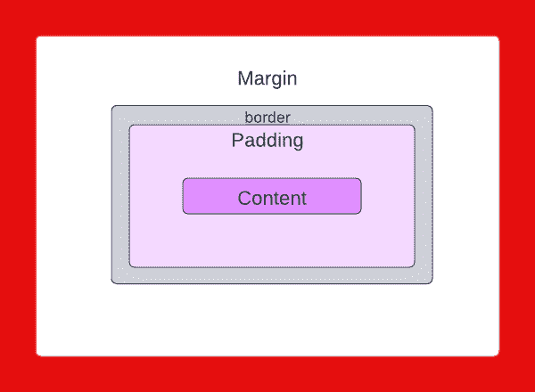

在箱式模型中，让我们分解各个组件。

首先是内容。内容是可以使用宽度和高度属性调整大小的可见元素。

接下来，我们有填料。这是内容周围的空白。它的值包含在可视元素的宽度和高度中。

然后，我们有了边界。边框环绕填充和内容。它的值也包含在可视元素的填充中。

最后，我们有利润。这是可见元素周围的空白区域。它完全不可见，并清除了边界以外的区域。

Flutter 提供了一个`Container`小部件，可以用来在我们的应用程序中实现盒子模型。`Container`很方便，因为它可以用来管理多个小部件的宽度、高度、边距、填充、颜色等等。它通过组合常见的绘制、定位和调整小部件来实现这一点。

`Container`的`margin`和`padding`属性用于设置边距和填充(有意义吧？)用于我们 UI 中的可见元素。

下面的应用程序在`Container`中呈现了两个`Text`小部件。在下面的例子中，每个`Container`的颜色被设置为清楚地展示设置边距和填充的效果:

```
Row(
  mainAxisAlignment: MainAxisAlignment.start,
  crossAxisAlignment: CrossAxisAlignment.start,
  children: [
    Container(
      child: Text(
        "text 1",
        style: TextStyle(fontSize: 32),
      ),
      decoration: BoxDecoration(color: Colors.yellow),
    ),
    Container(
      child: Text(
        "text 2",
        style: TextStyle(fontSize: 32),
      ),
      decoration: BoxDecoration(color: Colors.green),
    ),
  ],
),

```

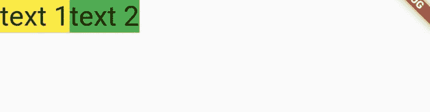

上面的代码片段并排绘制了两个`Containers`，没有任何空格。我们需要为可见的`Text`小部件设置`margin`和`padding`。但是在我们这样做之前，重要的是我们要了解一下`EdgeInsets`类。

## `EdgeInsets`类

一个`Container`小部件的`margin`和`padding`属性需要一个抽象类`EdgeInsetsGeometry`类型的值。这意味着`EdgeInsetsGeometry`不能直接使用，所以我们必须利用它的子类`EdgeInsets`和`EdgeInsetsDirectional`来设置边距和填充。

`EdgeInsets`根据左、上、右和下方向参数设置边距和填充。另一方面，`EdgeInsetsDirectional`根据开始、顶部、结束和底部方向参数设置边距和填充。

两者的主要区别在于`EdgeInsetsDirectional`是一个[地区方向感知部件](https://blog.logrocket.com/internationalizing-app-flutter-easy-localization/)，不像`EdgeInsets`。

我们可以使用以下属性设置`EdgeInsets`类的 insets:

*   `EdgeInsets.zero`:设置所有方向的零点偏移
*   `EdgeInsets.all`:在所有方向设置一个公共偏置
*   `EdgeInsets.only`:仅设置指定方向的偏置。可以按任意顺序指定左、上、右和下方向
*   `EdgeInsets.fromLTRB`:根据为每个方向传递的值，设置所有方向的偏移。必须按照左、上、右和下的顺序指定方向
*   `EdgeInsets.symmetric`:设置垂直和水平偏移
*   `EdgeInsets.fromWindowPadding`:设置与给定窗口填充相匹配的偏移量。`padding`和`devicePixelRatio`值是预期值；您可以使用来自`dart:ui.window`的值或利用`MediaQuery.of`

我们可以使用以下属性设置`EdgeInsetsDirectional`类的 insets:

*   `EdgeInsets.zero`:设置所有方向的零点偏移
*   `EdgeInsets.all`:在所有方向设置一个公共偏置
*   `EdgeInsets.only`:仅设置指定方向的偏置。可以按任何顺序指定开始、顶部、结束和底部方向
*   `EdgeInsets.fromSTEB`:根据为每个方向传递的值，设置所有方向的偏移。必须按照开始、顶部、结束和底部的顺序指定方向

在本教程中，我们将使用`EdgeInsets`类。

## 设置抖动中的余量

`Container`的`margin`属性用于设置边距。它在`Container`周围增加了一个空白空间。

首先，我们将在第一个`Container`周围添加一个边距，如下所示:

```
Container(
  margin: EdgeInsets.all(24),
  child: Text(
    "text 1",
    style: TextStyle(fontSize: 32),
  ),
  decoration: BoxDecoration(color: Colors.yellow),
)

```

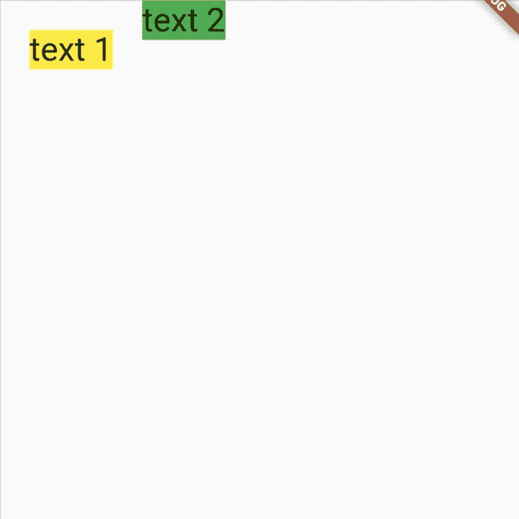

接下来，我们将只给第二个`Container`添加上边距:

```
Container(
  margin: EdgeInsets.only(top: 24),
  child: Text(
    "text 2",
    style: TextStyle(fontSize: 32),
  ),
  decoration: BoxDecoration(color: Colors.green),
)

```

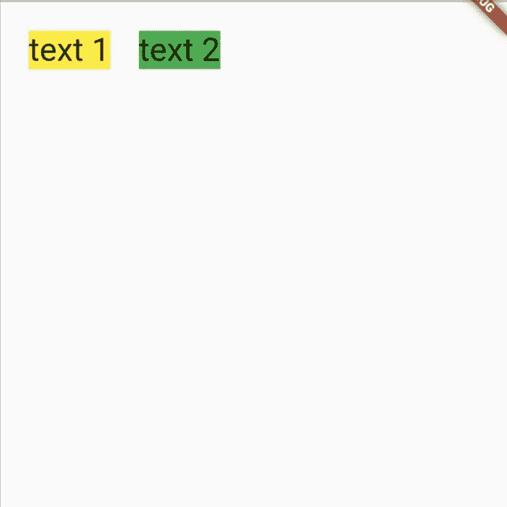

我们的小部件现在用一个空格隔开。

## 在颤动中设置衬垫

`Container`的`padding`属性用于在装饰后的`Container`内添加空白空间。我们将向小部件添加水平和垂直填充，如下面的代码所示:

```
padding: EdgeInsets.symmetric(horizontal: 20, vertical: 12)

```

这段代码片段向我们的小部件添加了水平和垂直填充。它设置了向左和向右的偏移`20`以及向上和向下的偏移`12`。

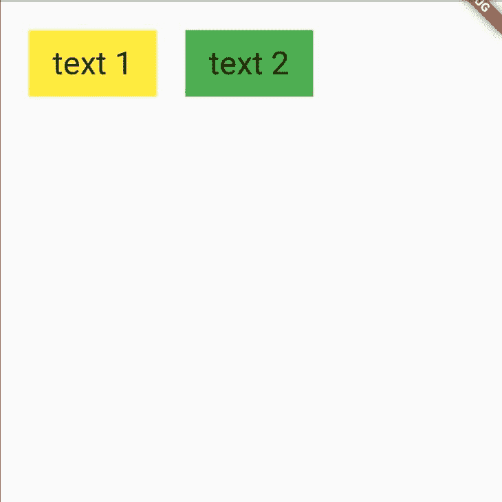

我们的内容现在被填充，看起来更好！

## 动态设置边距和填充

为我们的边距和填充设置硬编码值可能只会在我们的测试设备上看起来不错。在不同的屏幕尺寸上，预期的布局可能不是用户实际看到的。因此，根据屏幕大小动态设置边距和填充非常重要。

我们将使用`MediaQuery`类来获取应用程序的屏幕尺寸。然后，我们将能够根据小部件的大小动态设置边距和填充。

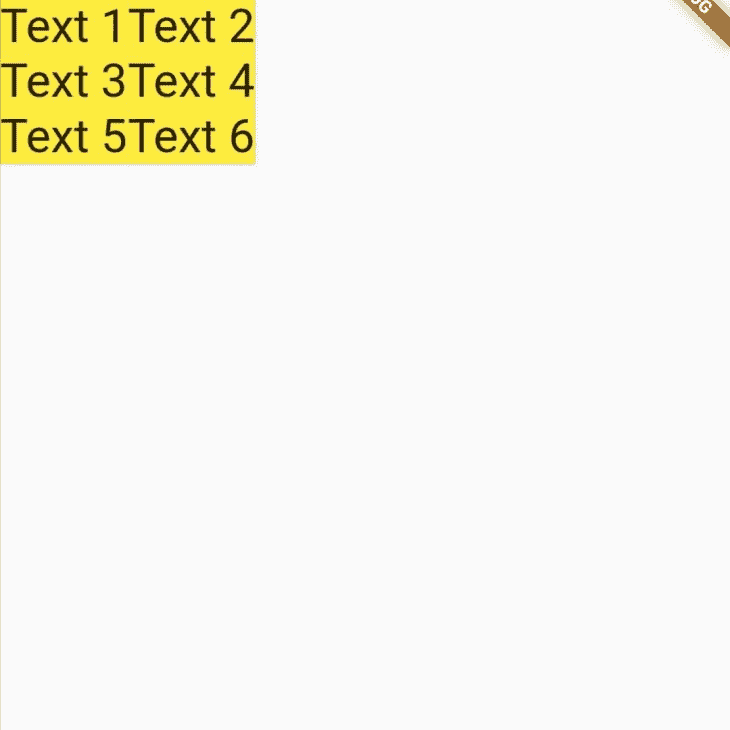

首先，我们将在变量中存储设备的`width`和`height`值，如下所示:

```
Widget build(BuildContext context) {
  final height = MediaQuery.of(context).size.height;
  final width = MediaQuery.of(context).size.width;
  return ...

```

接下来，我们将把`margin`和`padding`属性设置为设备宽度和高度的一部分:

```
margin: EdgeInsets.symmetric(horizontal: width *0.1, vertical: height *0.05),
padding: EdgeInsets.symmetric(horizontal: width *0.05,vertical: height*0.05),

```

这为我们的小部件布局了边距和填充，以适应不同大小的屏幕。

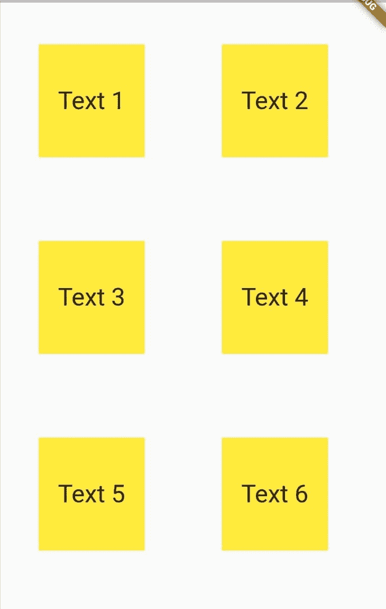

## 装饰盒子

我们可以使用`decoration`属性给容器添加一些装饰。这需要所有装饰的抽象类，称为`Decoration`类，并将样式应用于我们的小部件。

下面的代码片段使用`BoxDecoration`类为`Container`添加颜色、边框、边框半径和边框阴影。

```
decoration: BoxDecoration(
  color: Colors.yellow,
  borderRadius: BorderRadius.circular(10),
  border: Border.all(),
  boxShadow: [
    BoxShadow(
      color: Colors.grey.withOpacity(0.5),
      spreadRadius: 5,
      blurRadius: 7,
      offset: const Offset(0, 3),
    ),
  ],
),

```

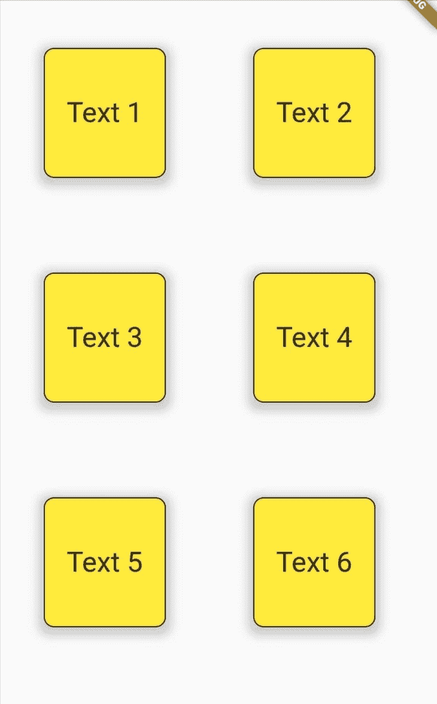

我们可能需要向一个在其属性中没有实现`Padding`类的小部件添加填充。例如，下面的`Card`小部件绘制了一张里面有文本的卡片。

```
Center(
  child: Card(
    color: Colors.yellow,
    child: Text(
      "Card text",
      style: TextStyle(fontSize: 32),
    ),
  ),
)

```

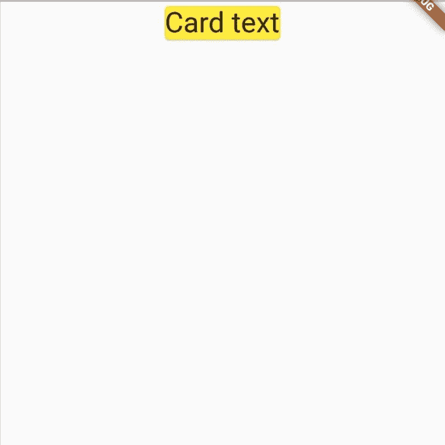

为了在文本周围添加一些空间，我们可以用一个`Padding`小部件包装`Text`小部件。`Padding`小部件需要一个`padding`属性。该属性被设置为通过`EdgeInsetsGeometry`类在所需的小部件周围添加空白空间。

```
child: Center(
  child: Card(
    color: Colors.yellow,
    child: Padding(
      padding: EdgeInsets.all(24.0),
      child: Text(
        "Card text",
        style: TextStyle(fontSize: 32),
      ),
    ),
  ),
)

```

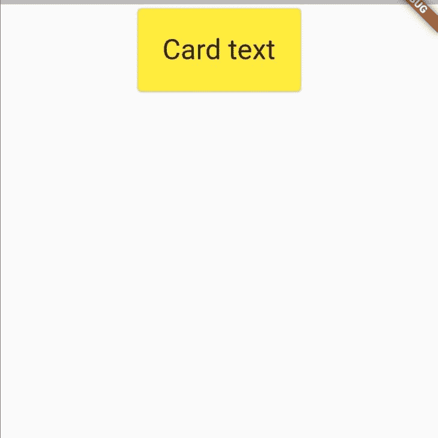

## 负边距

CSS 块布局模型允许负边距，允许元素重叠。Flutter 不支持负边距。向 Flutter 小部件添加负边距将会抛出一个错误。

为了实现重叠效果，您可以使用`Stack`和`Position`小部件。`Stack`小部件相对于其盒子的边缘定位其子部件，第一个子部件位于底部。

下面的代码片段使用`Stack`小部件在三个容器上创建一个重叠的特性。然后使用`Positioned`小部件将第一个容器放置在距离顶部`50`个单位的位置。

```
 SizedBox(
  width: 500,
  height: 500,
  child: Stack(
    children: <Widget>[
      Positioned(
        top: 50,
        child: Container(
          width: 200,
          height: 200,
          color: Colors.yellow,
        ),
      ),
      Container(
        width: 190,
        height: 190,
        color: Colors.orange,
      ),
      Container(
        width: 180,
        height: 180,
        color: Colors.red,
      ),
    ],
  ),
)

```

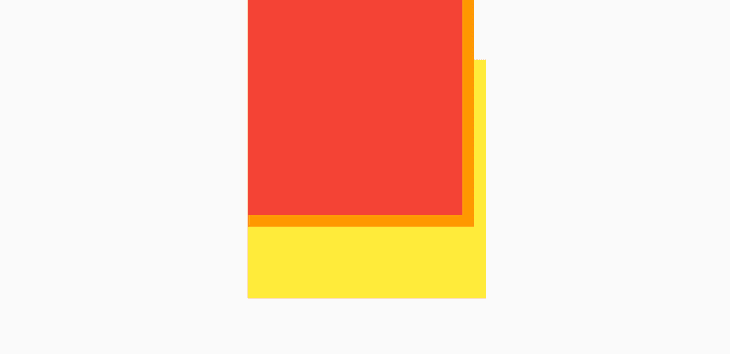

## 折叠页边距

与 CSS 不同，Flutter 在 UI 中绘制元素时不会将边距合并或折叠成一个边距。为了演示这一点，我们将使用 [Flutter DevTools](https://docs.flutter.dev/development/tools/devtools/overview) ，它允许我们检查应用程序的用户界面布局。

首先，我们将在一个父容器中嵌套两个容器，并给它们`vertical`边距，如下所示。

```
Container(
  color: Colors.red,
  margin: EdgeInsets.symmetric(vertical: 30),
  child: Column(
    children: [
      Container(
        color: Colors.red,
        margin: EdgeInsets.symmetric(vertical: 10),
        child: Text(
          "Text nest1",
          style: TextStyle(fontSize: 32),
        ),
      ),
      Container(
        color: Colors.orange,
        margin: EdgeInsets.symmetric(vertical: 10),
        child: Text(
          "Text nest2",
          style: TextStyle(fontSize: 32),
        ),
      )
    ],
  ),
)

```

然后我们将启动 Flutter DevTools 并启用 **Show Guidelines。**这将显示 UI 布局组件的轮廓。

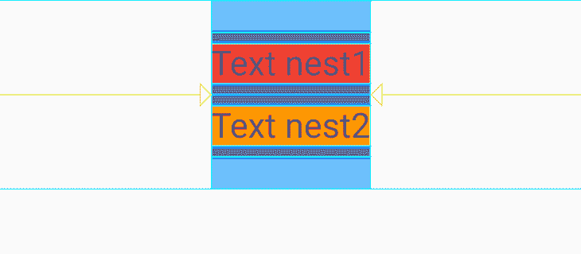

布局中包含的所有边距都被绘制到用户界面。嵌套子级的边距不会折叠到父级的边距中。

## 结论

在本教程中，我们讨论了盒子模型，并研究了如何在 Flutter 中使用边距和填充来构建布局。我们还研究了`Container`小部件以及如何设置它的边距、填充和装饰。然后我们使用`Padding`小部件添加填充。最后，我们讨论了颤振中的负边界和塌陷边界。

有了这些，你现在应该能够在你的应用程序的 UI 中仔细地布局小部件来增强你的用户交互。本文中的所有代码都可以在 [GitHub](https://github.com/Ivy-Walobwa/flutter-layout-margin-padding) 上获得。

我希望你喜欢这个教程！

## 使用 [LogRocket](https://lp.logrocket.com/blg/signup) 消除传统错误报告的干扰

[](https://lp.logrocket.com/blg/signup)

[LogRocket](https://lp.logrocket.com/blg/signup) 是一个数字体验分析解决方案，它可以保护您免受数百个假阳性错误警报的影响，只针对几个真正重要的项目。LogRocket 会告诉您应用程序中实际影响用户的最具影响力的 bug 和 UX 问题。

然后，使用具有深层技术遥测的会话重放来确切地查看用户看到了什么以及是什么导致了问题，就像你在他们身后看一样。

LogRocket 自动聚合客户端错误、JS 异常、前端性能指标和用户交互。然后 LogRocket 使用机器学习来告诉你哪些问题正在影响大多数用户，并提供你需要修复它的上下文。

关注重要的 bug—[今天就试试 LogRocket】。](https://lp.logrocket.com/blg/signup-issue-free)