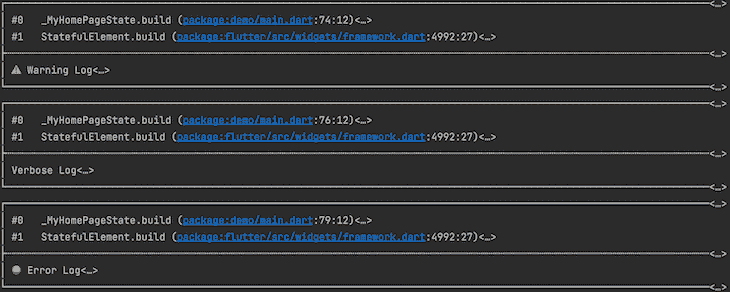

# 颤振日志记录最佳实践

> 原文：<https://blog.logrocket.com/flutter-logging-best-practices/>

开发一个大规模的应用程序并不容易。它通常涉及多个模块协同工作，并且通常由不同的开发人员编写。因此，当开发中出现问题时，一个人必须检查由多个开发人员创建的应用流程，以确定根本原因。错误地识别哪里出了问题或者添加临时修复可能会破坏代码的其他部分，从长远来看会导致更多的问题。

如果你想加速创建一个应用程序，你可以在你的代码中使用这些:

```
print('reached here');

// Some code

print('now here');

// Some other code

print('method called');
```

`print()`或`debugPrint()`语句是将错误记录到控制台或检查代码位置的便捷方式。最初，围绕应用程序的一些打印声明并不令人担忧。然而，从长远来看，这不是一种可持续的开发应用的方式。

确保项目的所有模块和功能顺利运行的一个好方法是使用日志记录。定义良好的日志记录系统有助于减少构建应用程序时的麻烦，并在应用程序运行时为用户和开发人员提供简明的信息。

本文将探索如何使用[日志包](https://pub.dev/packages/logger)来创建易于解释的 [Flutter](https://blog.logrocket.com/tag/flutter/) 日志，考虑日志级别，并介绍如何使用 [Crashlytics](https://firebase.google.com/products/crashlytics) 来获取正在进行的日志。

*向前跳转:*

## 一个好的颤振测井系统是什么样的？

在我们讨论在 Flutter 中登录的最佳实践之前，让我们看看日志本身。

具有不均匀结构和消息传递的日志很难破译内容。例如，HTTP 请求可以包含几个参数，或者有需要检查的重要结果。当日志结构不良时，这样做既困难又耗时。

让我们想想你需要什么来构建一个 app。首先，您必须确保对服务器的所有调用都成功通过。稍后，您将需要检查 UI 的某些部分是否正确构建，并且您将需要关于数据库的详细信息。

当您监视重大错误并修复它们时，具有均匀结构和消息传递的日志记录系统将使您免于毁了您的周末。日志系统必须适合开发者的需求，而不是一成不变的。

现在，让我们看看日志记录级别。

## 颤振项目中测井水平的重要性

Flutter 项目可以有许多日志，包括网络、数据库和错误。通常，开发人员只需要适量的日志，可以安全地忽略那些更详细的日志。但是，如果事情不顺利，您可能需要检查更详细的事件。

当一个应用程序发布时，您可能只需要记录错误和其他重要事件。在每个日志中设置级别对于记录这些错误至关重要，因为级别为每个日志指定了重要性或类型。

您可能会发现诸如`verbose`、`warning`和`error`这样的日志类型，它们会过滤掉不必要的日志。既然我们已经了解了可靠的日志记录系统的重要性，并且设置了日志的日志级别，那么让我们看看如何将它们添加到应用程序中。

## 向 Flutter 项目添加日志的最佳实践

这里，我们将讨论向项目添加日志的基本规则。通过遵循这些最佳实践，你可以更好地理解你的应用程序的流程，并比没有一致的日志系统的应用程序更快地处理任何意外问题。

### 1)记录适当的信息

当试图解决一个错误时，记录太多的信息是压倒性的，而拥有太少的信息并不能提供足够的信息来处理错误。如同任何误差一样，误差可以追溯到颤振本身的基础。如果将整个堆栈轨道提供给开发人员，这就像大海捞针，而不是有用的信息。为了避免这种情况，请记录适当的信息以确定开发人员代码中错误的根本原因，而不要将相同的链向下扩展到基本 Dart 错误。

### 2)确保涵盖所有活动

当一个应用程序运行时，几个系统协同工作，包括 UI、网络调用、数据库等等。这么多系统同时工作，很容易忽略对关键事件的报道。这些丢失的日志掩盖了流程的内部工作和错误的原因。为了避免麻烦，请确保所有事件都被报道。

### 3)不要使用日志作为测试

日志经常被用来代替测试，以确保到达代码的特定部分。虽然在代码的这些部分有日志并不总是一个坏主意，但是避免测试可能是有害的。

### 4)统一记录

需要检查每个记录的事件的重要性，因此为每种类型的事件分配一个级别。例如，您可以将所有网络调用设置为详细。这使得开发人员可以有效地分离日志，以避免在更高的日志级别处理大量日志。

### 5)不需要日志时将其关闭

在开发过程中，您将需要检查比生产中更多的日志——所以不要在生产中记录不必要的信息。生产应用可能比调试应用运行在更多的设备上。记录这些应用程序运行的所有事件会增加不必要的运营成本；因此，生产日志通常仅限于警告和错误。

* * *

### 更多来自 LogRocket 的精彩文章:

* * *

既然已经设置了最佳实践，那么让我们来看一个可以为我们实现日志记录各个方面的包。

## 使用日志包登录 Flutter

虽然为内部登录创建不同的组件是可能的，但这非常耗时，而且几乎没有什么好处，因为跨应用程序的登录系统很少是定制的或不同的。有几个日志包，比如 [FLogs](https://pub.dev/packages/f_logs) 、 [loggy](https://pub.dev/packages/loggy) 、 [simple_logger](https://pub.dev/packages/simple_logger) 。

在本文中，我们将探索[记录器](https://pub.dev/packages/logger)包。它是最受欢迎的 Flutter 日志记录解决方案之一，因为它支持开箱即用的日志记录，并创建简洁格式的日志。你可以在这里找到整个 GitHub 库。

### 创建基本日志

要开始日志记录，使用`log()`方法创建一个`Logger`类实例。

接下来，使用下面的命令提供级别和消息:

```
var logger = Logger();

logger.log(Level.verbose, "Demo log");
```

您可以提供一个与特定日志相关联的`error`和一个`stackTrace`:

```
class StringStackTrace implements StackTrace {

 final String _stackTrace;

 const StringStackTrace(this._stackTrace);

 String toString() => _stackTrace;

}

var logger = Logger();

logger.log(Level.verbose, "Demo log", "An error", StringStackTrace("Your stacktrace here"));
```

错误可以是除了`String`之外的任何对象。因此，您可以将您的`error`与日志一起提供，如下所示:

```
var error = Error();

var logger = Logger();

logger.log(Level.verbose, "Demo log", error, error.stackTrace);

```

在示例中，我们可以在记录时传递错误的`error`和`stackTrace`。这允许用户从日志中快速提取更多细节并处理错误。

### 使用`Logger`类来记录级别

现在我们已经创建了基本日志，是时候记录级别了。幸运的是，`Logger`有几个级别可以用来记录事件，如下所示:

```
enum Level {
 verbose,
 debug,
 info,
 warning,
 error,
 wtf,
 nothing,
}
```

为了记录而不必每次都描述级别，`Logger`提供了多种方法来记录不同的级别:

```
var logger = Logger();

logger.log(Level.verbose, "Demo log", error, error.stackTrace);

//OR

logger.v("Demo log", error, error.stackTrace);

// SIMILARLY

logger.w("Demo log", error, error.stackTrace);

logger.i("Demo log", error, error.stackTrace);

// AND MORE...
```

### 构建日志过滤器

日志过滤器有助于确定哪些事件应该记录，哪些不应该记录。这在决定需要在发布模式下显示何种日志时非常有用。

要创建一个`LogFilter`，扩展`LogFilter`类，并实现`shouldLog()`。接下来，在实例化`Logger`时传入过滤器:

```
class DemoFilter extends LogFilter {
 @override
 bool shouldLog(LogEvent event) {

   if(event.level == Level.error || event.level == Level.warning) {
     return true;
   }

   return false;
 }
}

var logger = Logger(filter: DemoFilter());

logger.w("This will be accepted", error, error.stackTrace);

logger.v("This will not", error, error.stackTrace);
```

`LogFilter`让您决定是否应该记录或忽略收到的事件。例如，根据日志的严重程度，可以有不同的过滤器。

### 设计日志打印机

Logger 包支持打印结构良好且美观的日志。默认情况下，它们以标准方式打印，带有一个`stackTrace`和一条类似如下的消息:



但是，您可以使用内置的`PrettyPrinter`类，使用下面的命令为您的日志添加更多的特色:

```
var logger = Logger(
 printer: PrettyPrinter(),
);

```

要制作你的打印机，你可以用这个来扩展`LogPrinter`:

```
class DemoPrinter extends LogPrinter {
 @override
 List<String> log(LogEvent event) {
   switch(event.level) {
     case Level.verbose:
       break;
     case Level.debug:
       break;
     case Level.info:
       break;
     case Level.warning:
       break;
     case Level.error:
       break;
     case Level.wtf:
       break;
     case Level.nothing:
       break;
   }
 }
}
```

现在，您可以为每个日志级别打印定制格式的消息。

## 连接到 Crashlytics

Firebase 的 Crashlytics 服务允许开发者分析应用程序中的崩溃和特殊事件。虽然崩溃是极端事件，但 Crashlytics 也支持将应用程序中的自定义日志发送到 Firebase Crashlytics 控制台。这有助于 Crashlytics 成为一个通用的日志工具，而不仅仅是在应用程序出错时提供帮助。

首先，使用以下步骤将 Firebase Crashlytics 添加到您的应用程序中:

### 1.添加`firebase_crashlytics`依赖项

运行此命令将依赖项添加到项目中:

```
flutter pub add firebase_crashlytics
```

### 2.为 Android 添加配置

将这些行添加到您的`android/build.gradle`文件中:

```
dependencies {
 // ... 
 classpath 'com.google.firebase:firebase-crashlytics-gradle:2.7.1'
}
```

此外，将这些添加到`android/app/build.gradle`:

```
android {
 // ... your android config
}

dependencies {
 // ... your dependencies
}

// This must appear at the bottom of the file
apply plugin: 'com.google.firebase.crashlytics'
```

要获得有关 Crashlytics 集成的更多信息，请在此处找到文档[。](https://firebase.flutter.dev/docs/crashlytics/overview)

要在应用程序中记录错误，请使用 Crashlytics 提供的`recordError()`方法:

```
FirebaseCrashlytics.instance.recordError(
 error,
 stackTrace,
 reason: 'Your error reason',
 fatal: true
);
```

如果没有错误，并且您想查看日志，请使用`log()`方法:

```
FirebaseCrashlytics.instance.log("Your log event");
```

此外，还有颤振特有的误差函数，如`recordFlutterError()`:

```
FirebaseCrashlytics.instance.recordFlutterError(
 FlutterErrorDetails(
   exception: YourException(),
   stack: stackTrace,
 ),
 fatal: false,
);
```

`exception`值的类型是`Object`，所以这个值可以是您想要传递的任何值。

## 结论

本文讨论了在 Flutter 项目中记录日志的最佳实践。我们还学习了如何使用一个包来创建易于解释的日志，考虑了日志级别，并介绍了如何使用 Crashlytics 和类似的工具来获取正在进行的日志。

虽然这是对 Flutter 登录的总结，但是您的实现可能每次都有所不同，这取决于您正在开发的项目。

## 使用 [LogRocket](https://lp.logrocket.com/blg/signup) 消除传统错误报告的干扰

[](https://lp.logrocket.com/blg/signup)

[LogRocket](https://lp.logrocket.com/blg/signup) 是一个数字体验分析解决方案，它可以保护您免受数百个假阳性错误警报的影响，只针对几个真正重要的项目。LogRocket 会告诉您应用程序中实际影响用户的最具影响力的 bug 和 UX 问题。

然后，使用具有深层技术遥测的会话重放来确切地查看用户看到了什么以及是什么导致了问题，就像你在他们身后看一样。

LogRocket 自动聚合客户端错误、JS 异常、前端性能指标和用户交互。然后 LogRocket 使用机器学习来告诉你哪些问题正在影响大多数用户，并提供你需要修复它的上下文。

关注重要的 bug—[今天就试试 LogRocket】。](https://lp.logrocket.com/blg/signup-issue-free)